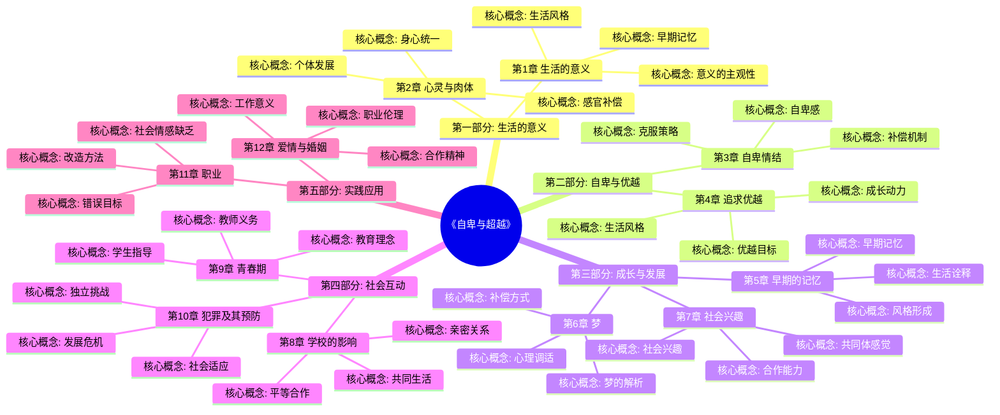
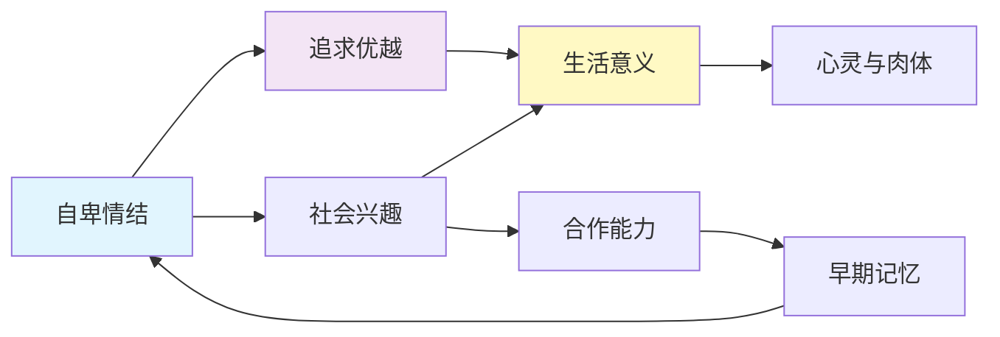

# 《自卑与超越》- 章节导航

> 作者: 阿尔弗雷德·阿德勒
> 总章节: 12章
> 拆解状态: ✅ 全部完成
> 最后更新: 2026-02-27

---

## 📚 章节结构（Mermaid Mindmap）

---

## 🔗 核心概念关联图

---

| 章节 | 标题 | 状态 | 完成日期 | 核心收获 |
|------|------|------|----------|----------|

**状态说明:**
- ✅ 已完成
- 🔄 进行中
- ⏸️ 待拆解
- ⏳ 暂停

---

## 🚀 快速跳转

### 按章节跳转
- [[第1章-生活的意义]]
- [[第2章-心灵与肉体]]
- [[第3章-自卑情结]]
- [[第4章-追求优越]]
- [[第5章-早期的记忆]]
- [[第6章-梦]]
- [[第7章-社会兴趣]]
- [[第8章-学校的影响]]
- [[第9章-青春期]]
- [[第10章-犯罪及其预防]]
- [[第11章-职业]]
- [[第12章-爱情与婚姻]]

### 按主题跳转
- [[自卑感]]
- [[优越情结]]
- [[社会兴趣]]
- [[共同体感觉]]
- [[课题分离]]
- [[生活风格]]
- [[追求优越]]

### 相关资源
- [[自卑与超越-阿德勒-拆解记录]] - 主拆解笔记
- [[被讨厌的勇气-岸见一郎-拆解记录]] - 姊妹篇
- [[阿德勒心理学]]
