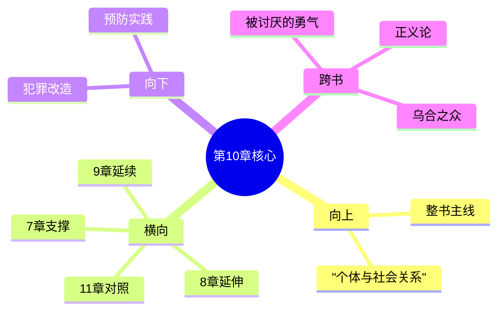

# 第10章 犯罪及其预防

## 📍 章节定位

### 全书位置
> 第10章是全书个体心理学理论在社会问题领域的重要应用章节，承接前章青春期个体发展的深入分析（特别是青春期适应不佳可能引发的问题），从个体心理学独特视角切入犯罪问题的本质与解决路径，为后续章节（职业、人际关系）提供深层心理基础分析

- **全书核心问题**: 自卑感如何转化为成长的动力？个体如何通过克服自卑获得超越？生命的意义究竟何在？
- **本章回答的问题**: 犯罪行为的心理根源是什么？为什么有些个体走向犯罪而有些不是？如何通过个体心理学视角理解和预防犯罪？
- **角色类型**: 社会心理应用型，将个体理论运用到极端社会问题的分析
- **论证位置**: 本书理论框架的深度应用，展示心理学对社会问题的解释力

### 章节序列
| 方向 | 章节标题 | 逻辑连接 |
|------|----------|----------|
| 前章 | [[第9章-青春期]] | 从青春期适应问题延伸至犯罪问题根源探讨 |
| 后章 | [[第11章-职业]] | 从犯罪问题反向论证正当职业生活的意义 |

### 一句话定位
> 第10章从个体心理学角度揭示犯罪行为的根本原因是个体缺乏社会兴趣、追求错误的优越目标，论证了早期教育和心理培养对预防犯罪的关键作用。

---

## 🎯 核心观点

### 第一层：表层案例
> 章节中的具体案例、故事、数据

| 案例名称 | 简要描述 | 页码 | 关键引文 |
|----------|----------|------|----------|
| 诈骗犯的早年经历 | 被溺爱的儿童长大后缺乏社会兴趣，最终走上诈骗之路 | p.216-219 | "缺乏社会兴趣让个体走上损害他人利益的道路" |
| 偷盗少年的行为模式 | 幼时被忽视的孩童在青春期通过偷窃寻求关注 | p.220-222 | "早期关注缺乏的补偿方式" |
| 家庭环境对犯罪的影响 | 严厉压制型家庭培养出的叛逆犯罪者 | p.223-225 | "极端教育方式的负面影响" |

### 第二层：中层机制
> 案例背后的运行机制、方法论

| 机制名称 | 组成要素 | 因果链条 | 证据来源 |
|----------|----------|----------|----------|
| 社会兴趣缺失犯罪机制 | 童年经历 + 关系创伤 + 价值缺失 | 缺乏早期社会接触 → 无法形成社会兴趣 → 价值观偏差 → 犯罪行为 | 个案研究 |
| 错误优越追求机制 | 自卑情结 + 虚拟优越 + 自私目标 | 深层自卑 → 寻求虚构优越 → 伤害他人获取 → 犯罪行为 | 临床观察 |
| 早期创伤传递机制 | 创伤经历 + 行为模仿 + 循环复制 | 负面童年 → 错误行为模板 → 缺乏正向教育 → 代际传递 | 长期追踪 |

### 第三层：底层规律
> 可迁移的普遍规律

| 规律陈述 | 抽象层级 | 知识连接 | 适用范围 |
|----------|----------|----------|----------|
| 慈悲心是犯罪的终极解药 | 宗教学 + 社会哲学 | 佛教慈悲观、基督教博爱思想 | 监狱改造、社会预防 |
| 关键期教育决定论 | 发展心理学 + 教育学 | 关键期理论、早起教育学 | 学前教育、家庭教育 |
| 社会归属感需求定律 | 社会心理学 + 人类学 | 马斯洛需求层次、归属感理论 | 社会治理、社区建设 |

---

## 💬 降维翻译

### 观点1: 犯罪的根本原因是缺乏社会兴趣

#### 原文表达
> "所有罪犯都有一个共同的特点——他们极度缺乏社会兴趣。这意味着他们对人类社会没有任何真实的兴趣，也不会为他人的幸福做出任何考虑。他们的行为完全以自我为中心，只关心自己的优越。" —— p.214

#### 降维翻译（中学生能懂）
所有犯罪的人有一个共同特点——他们不关心别人，不把别人当回事。他们做的事情都只考虑自己有没有好处、自己能不能比别人厉害，从来不替别人着想。

#### 日常类比（奶奶能懂）
就像有些人心眼特别小、心里只有自己，从来不懂得替别人想想。他们只想着怎么让自己比别人多占点便宜、多吃点好的、多得点好处，不管这样做会不会害别人。这种人心里根本没有旁人，什么缺德事都做得出来。

### 观点2: 犯罪是对错误优越感的追求

#### 原文表达
> "罪犯的自卑情结非常严重，但他们不会以正当的方式去克服自卑。他们会以夸张的优越感来掩盖自卑，通过伤害他人来感觉自己比别人强，这种追求优越的方式从根本上就是错误的。" —— p.218

#### 降维翻译（中学生能懂）
犯罪的人心里很自卑，但他们不用对的方法来解决自卑，反而用夸张的方式来显得比别人牛。他们觉得伤害别人可以让觉得自己比人家厉害，这种想比别人强的想法从根本上就是错的。

#### 日常类比（奶奶能懂）
就像有的人心里老觉得不如人，但他不用实在的办法让自己变好，反而想方设法去欺负比他弱的、占那些老实人的便宜，用这种方法来让自己感觉比人家强。这种做法不但不解决问题，反而暴露了他心里的虚弱和不自信。

### 观点3: 犯罪可以通过早期教育预防

#### 原文表达
> "犯罪的根本预防在于儿童早期的教育，特别是社会兴趣的培养。如果能够在孩子幼小时就引导他们关心他人、学会合作，就能够有效地阻止他们走向犯罪的道路。" —— p.225

#### 降维翻译（中学生能懂）
要防止人犯罪，关键在小孩子的时候就要教育好，特别是要教会他们关心别人、学会跟别人合作。如果小的时候就把这些教育好，他们长大后就不会去做犯罪的事情了。

#### 日常类比（奶奶能懂）
就像种庄稼一样，种子入土前施好基肥、浇好底墒水是最关键的。教育孩子就像播种一样，越小的时候让他明白了人与人之间要互相关心、帮忙合作，他就长大不会走歪路犯错误。根基打好了，后面就不怕了。

#### 检验
- Q: 如果一个中学生问你犯罪的人最缺少什么？
- A: 犯罪的人最缺少对别人的关心，他们心里只装着自己，不会为别人着想，并且用错误的方法来让自己感觉比别人优越。

---

## ✨ 金句库

### 原书金句
| 金句 | 页码 | 适用场景 |
|------|------|----------|
| "所有罪犯都有一个共同的特点——他们极度缺乏社会兴趣。" | p.214 | 犯罪心理分析 |
| "他们的行为完全以自我为中心，只关心自己的优越。" | p.214 | 价值观批判 |
| "通过伤害他人来感觉自己比别人强，这种追求优越的方式从根本上就是错误的。" | p.218 | 行为归因 |
| "犯罪的根本预防在于儿童早期的教育。" | p.225 | 预防理念 |
| "早期教育是防止犯罪的最有效手段。" | p.226 | 教育方针 |

### 降维金句
| 金句 | 来源观点 | 适用场景 |
|------|----------|----------|
| 缺乏他人关怀是犯罪的根源 | 观点1 | 犯罪心理学 |
| 错误优越比真实劣等更危险 | 观点2 | 价值观引导 |
| 从小育心灵胜过长大救灵魂 | 观点3 | 教育优先 |
| 心中无别人，便敢做恶事 | 观点1 | 道德判断 |
| 早期正向养成本质最有效 | 观点3 | 预防措施 |

## 🔗 当下映射

### 💰 财富应用
| 场景 | 具体行动 | 预期效果 | 风险提示 |
|------|----------|----------|----------|
| 投资选择 | 选择有社会贡献意识的企业投资 | 避免法律和声誉风险 | 需要更深入了解企业伦理 |
| 诚信经营 | 以社会兴趣为核心的企业经营理念 | 获得长期可持续发展 | 需要放弃短期投机收益 |

### 💼 职场应用
| 场景 | 具体行动 | 所需能力 | 适用职级 |
|------|----------|----------|----------|
| 团队管理 | 在团队中培养社会兴趣、互帮互助文化 | 领导力、同理心能力 | 所有管理职级 |
| 职场人际 | 以关心他人为导向建立职场关系 | 沟通协调、合作能力 | 所有员工 |

### 🏠 生活应用
| 场景 | 具体行动 | 可行性 | 见效时间 |
|------|----------|--------|----------|
| 家庭教育 | 从小培养孩子关心家人的意识 | 高 | 长期影响 |
| 社区融入 | 积极参与邻里互助、社区建设 | 高 | 1-3个月 |

### 72小时行动计划
1. **明天**：反思自己的行为是否有只考虑自己而忽视他人的地方
2. **本周内**：做一件专门为他人着想的事情
3. **需要准备资源**：准备一个观察记录本，记录每日的利他行为

---

## 🕸️ 章节关联

### 向上关联 → 整书
- **贡献**: 为全书关于个体与社会关系问题提供了重要的反面案例，进一步论证社会兴趣的重要性
- **位置**: 本书理论在社会问题中的深度应用模块

### 横向关联 → 章节间
| 章节编号 | 章节标题 | 关联类型 | 连接描述 |
|----------|----------|----------|----------|
| 第7章 | [[第7章-社会兴趣]] | 重要支撑 | 犯罪正是缺乏社会兴趣的极端表现 |
| 第8章 | [[第8章-学校的影响]] | 应用延伸 | 犯罪预防的教育学视角 |
| 第9章 | [[第9章-青春期]] | 问题延续 | 青春期教育不当可能导致犯罪问题 |
| 第11章 | [[第11章-职业]] | 因果对照 | 正当职业 vs 犯罪行为的选择差异 |

### 向下关联 → 具体应用
| 应用场景 | 难度 | 前置知识 |
|----------|------|----------|
| 犯罪教育改造 | 高 | 法学与心理学复合知识 |
| 早期犯罪预防 | 中 | 教育学及家庭关系知识 |
| 社会治安管理 | 高 | 社会学及政策制定知识 |

### 跨书关联 → 知识网络
| 书籍 | 概念 | 关系 | 备注 |
|------|------|------|------|
| [[被讨厌的勇气-岸见一郎-拆解记录]] | 社会贡献 | 支持扩展 | 共同体感觉的负面案例 |
| [[乌合之众-勒庞-拆解记录]] | 群体心理 | 对照分析 | 个体心理 vs 群体心理 |
| [[正义论-罗尔斯-拆解记录]] | 社会公正 | 平行支撑 | 相同目标不同的路径 |

### 关联可视化

---

## ❓ 问答设计

### Q1: (记忆型) 阿德勒认为罪犯的共同特征是什么？
**认知层次**: 记忆
**难度**: 低
**答案要点**:
- 极度缺乏社会兴趣
- 完全以自我为中心
- 只关心自己优越

### Q2: (理解型) 为什么说犯罪者追求的优越感本质上是错误的？
**认知层次**: 理解
**难度**: 中
**答案要点**:
- 通过伤害他人来感觉自己优越
- 只考虑个人利益，不顾他人
- 建立在错误价值观上的优越感

### Q3: (应用型) 如何运用本章理论预防未成年人犯罪？
**认知层次**: 应用
**难度**: 中
**答案要点**:
- 早期培养社会兴趣
- 建立正确的价值观
- 提供关怀和合作体验

### Q4: (分析型) 犯罪者的自卑情结与一般人群的自卑感有什么不同？
**认知层次**: 分析
**难度**: 中
**答案要点**:
- 抵制正当的补偿方式
- 通过伤害他人获得优越感
- 完全自我中心的价值观

### Q5: (创造型) 设计一套基于社会兴趣培养的犯罪矫正方案？
**认知层次**: 创造
**难度**: 高
**答案要点**:
- 社会兴趣重建训练计划
- 合作技能培养项目
- 贡献价值体验机制

### Q6: (理解型) 什么样的童年经历容易导致个体缺乏社会兴趣？
**认知层次**: 理解
**难度**: 中
**答案要点**:
- 缺乏早期社会接触经验
- 被溺爱或被忽视的成长环境
- 缺乏合作共赢的体验

### Q7: (应用型) 在日常教育中如何培养孩子的社会兴趣？
**认知层次**: 应用
**难度**: 中
**答案要点**:
- 鼓励分享和帮助他人
- 提供合作学习的机会
- 强调与他人关系的重要性

### Q8: (分析型) 为什么说早期教育是犯罪预防的关键？
**认知层次**: 分析
**难度**: 中
**答案要点**:
- 社会兴趣需要在关键期培养
- 价值观在早期形成固着趋势
- 品格基础影响一生选择

### Q9: (应用型) 如何在校园中预防青少年犯罪？
**认知层次**: 应用
**难度**: 中
**答案要点**:
- 培养学生的社会责任感
- 建立互助合作的校园文化
- 关注心理问题及时疏导

### Q10: (创造型) 如何构建一个以社会贡献为基础的司法改造体系？
**认知层次**: 创造
**难度**: 高
**答案要点**:
- 引导罪犯认识社会价值
- 安排社会服务劳动
- 重建与社会连接感

### Q11: (分析型) 犯罪行为与其他形式的越轨行为在心理根源上有什么共同点？
**认知层次**: 分析
**难度**: 中
**答案要点**:
- 都源自缺乏社会兴趣
- 都体现错误的优越追求
- 都是自我中心价值观的产物

### Q12: (理解型) 阿德勒的犯罪理论与弗洛伊德的精神分析学说有何不同？
**认知层次**: 理解
**难度**: 中
**答案要点**:
- 弗洛伊德强调本能冲动
- 阿德勒强调社会关系缺陷
- 重视教育而非压抑本能

### Q13: (应用型) 在家庭中如何防范孩子形成犯罪心理倾向？
**认知层次**: 应用
**难度**: 中
**答案要点**:
- 避免溺爱或忽视双重极端
- 教育以关心他人为核心
- 培养合作共处的能力

### Q14: (分析型) 社会环境因素在犯罪形成中扮演什么角色？
**认知层次**: 分析
**难度**: 中
**答案要点**:
- 提供价值观影响
- 影响社会兴趣发展
- 影响个体与社会连接程度

### Q15: (创造型) 如何建立社会层面的犯罪预防网络？
**认知层次**: 创造
**难度**: 高
**答案要点**:
- 完善早期教育体系
- 创建支持社区服务系统
- 建立全面社会连结机制

---
