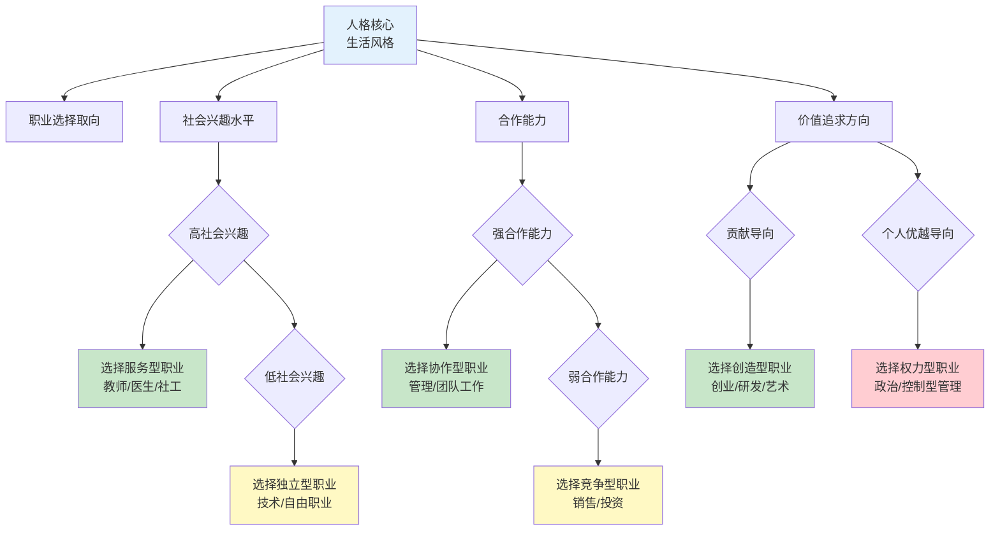
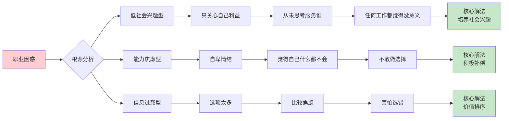
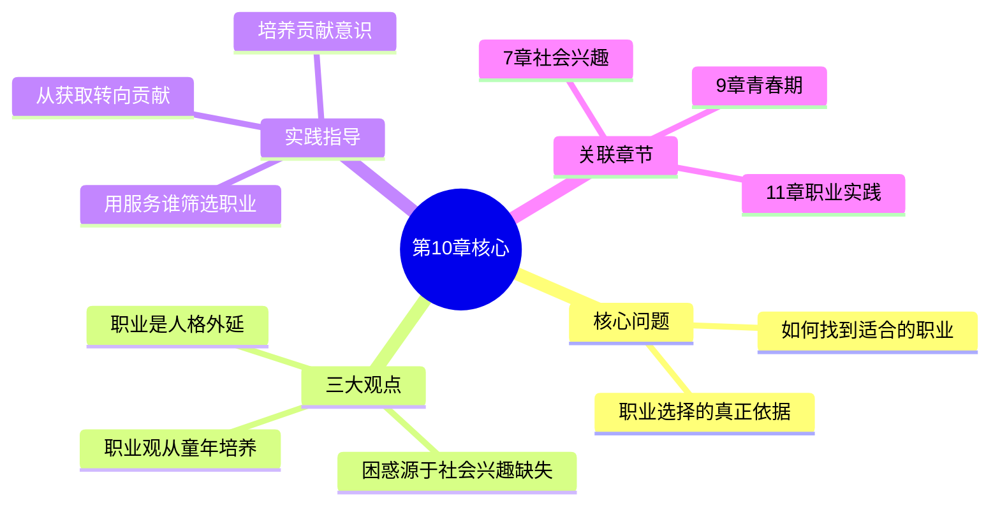

# 第10章 职业问题

## 📍 章节定位

### 全书位置
> 第10章聚焦于人生三大任务之一——职业领域的核心困境：如何找到适合自己的职业？阿德勒从个体心理学视角揭示职业选择不是简单的技能匹配，而是人格、社会兴趣与合作精神的综合体现。

- **全书核心问题**: 自卑感如何转化为成长的动力？生命的意义究竟何在？
- **本章回答的问题**: 为什么很多人找不到适合的职业？职业选择的真正依据是什么？如何建立健康的职业观？
- **角色类型**: 人生任务解答型，聚焦三大生活任务的职业维度
- **论证位置**: 承接青春期章节的过渡期困惑，为职业实践章节提供选向指导

### 章节序列
| 方向 | 章节标题 | 逻辑连接 |
|------|----------|----------|
| 前章 | [[第9章-青春期]] | 青春期迷茫延续至职业选择的困惑 |
| 后章 | [[第11章-职业]] | 从"如何选择"过渡到"如何实践" |

### 一句话定位
> 第10章揭示职业选择的本质不是天赋测试，而是人格与社会兴趣的延伸——你选择什么职业，取决于你是什么样的人，以及你想为这个世界做什么。

---

## 🎯 核心观点

### 观点1：职业选择是人格的外延

#### 【表层】现象层

**书中案例**：
- **犹豫不决的青年**：面对多种选择却无法决定，因为从未思考过"我能为他人做什么"
- **盲目跟风者**：选择热门专业/行业，却发现不适合自己
- **逃避就业者**：用考研、出国等借口推迟职业选择

**读者熟悉的场景**：
- "不知道自己想做什么" → 毕业季焦虑
- "选了热门专业却学不进去" → 专业与人格不匹配
- "跳槽很多次还是不满意" → 从未审视自己的价值观

#### 【中层】机制层

**职业选择的人格投射机制**：



**阿德勒公式**：
```
职业选择 = 人格类型 + 社会兴趣程度 + 合作能力 + 价值追求
         = 你是谁 + 你关心谁 + 你能和谁合作 + 你想创造什么
```

#### 【底层】规律层

> **职业-人格一致性定律**：职业选择的困难根源不在能力匹配，而在人格与职业价值的错位。找到适合的职业，先要认识自己是什么样的人。

**降维翻译**：
> 选工作不是选"我擅长什么"，
> 而是选"我是谁"。
>
> 你是个关心别人的人，就别选只管自己挣钱的工作。
> 你是个爱合作的人，就别选单打独斗的活儿。
>
> **职业是人格的延伸，不是能力的标签。**

#### 【当下连接】

|----------|----------|----------|
| 为什么总找不到喜欢的工作？ | 你没想清楚自己是谁，要为谁创造价值 | "原来问题在我不在工作" |
| 为什么热门行业我却做不下去？ | 热门≠适合你，人格与行业文化不匹配 | "原来我追错了方向" |
| 考研还是工作？ | 问自己：推迟选择是因为没想清楚，还是真需要深造 | "原来我在逃避选择" |

---

### 观点2：职业困惑的根源是社会兴趣缺失

#### 【表层】现象层

**书中观察**：
- **只问"哪个赚得多"** → 完全自我中心的职业观
- **从不思考"能帮到谁"** → 缺乏服务意识
- **把工作当"饭碗"而非"使命"** → 低社会兴趣的表现

**读者熟悉的场景**：
- "工资多少？福利怎么样？" → 只关注个人利益
- "哪个行业有前途？" → 从不考虑社会需求
- "能摸鱼吗？" → 对工作毫无贡献意识

#### 【中层】机制层

**职业困惑的心理根源**：



**三种职业困惑类型**：

| 困惑类型 | 心理根源 | 典型表现 | 解决方向 |
|----------|----------|----------|----------|
| **低社会兴趣型** | 只关心自己 | "哪个钱多选哪个" | 培养服务意识 |
| **能力焦虑型** | 自卑情结 | "我什么都不会" | 积极补偿行动 |
| **信息过载型** | 比较焦虑 | "选择太多不知道怎么选" | 明确价值排序 |

#### 【底层】规律层

> **职业意义定律**：职业困惑的本质不是"不知道选什么"，而是"不知道为什么工作"。当一个人只关心自己能从工作中得到什么，任何工作都会让他失望。

**降维翻译**：
> 选工作的最大误区：
> 一上来就问"这工作能给我什么"。
>
> 正确的问法是：
> "这工作能让我帮到谁？"
>
> **只有想清楚服务谁，才能找到适合的工作。**
> **因为职业的意义，从来不在获取，在贡献。**

#### 【当下连接】

|----------|----------|----------|
| 为什么工作总没意义感？ | 你只想着得到，没想着付出 | "原来我把方向搞反了" |
| 为什么跳槽很多次还是不满意？ | 换的是工作，没换的是心态 | "原来问题在我自己" |
| 怎么判断一份工作值不值得做？ | 问自己：这份工作能帮到谁？帮到多少人？ | "原来判断标准这么简单" |

---

### 观点3：正确职业观的培养从童年开始

#### 【表层】现象层

**书中观点**：
- **家庭的影响**：父母对待工作的态度影响孩子的职业观
- **学校的影响**：老师是否引导学生思考"我能做什么"
- **早期体验**：做家务、参与社会实践培养责任感和贡献意识

**读者熟悉的场景**：
- 父母说"好好读书将来找个好工作" → 把工作当目的而非手段
- 从不做家务的孩子 → 缺乏责任感和贡献意识
- 只关注分数的学校 → 忽视职业价值观的培养

#### 【中层】机制层

**职业观形成的三阶段**：

```mermaid
flowchart TD
    subgraph 童年期
        A1[家庭影响<br/>父母工作态度] --> B1[初步职业印象]
        A2[家务参与] --> C1[责任意识萌芽]
    end
    
    subgraph 青少年期
        B1 --> D1[学校引导<br/>"你能做什么"]
        C1 --> E1[社会实践<br/>志愿服务]
        D1 --> F1[职业价值观形成]
        E1 --> F1
    end
    
    subgraph 成年期
        F1 --> G1{职业选择}
        G1 --> H1[健康选择<br/>服务导向]
        G1 --> H2[困惑选择<br/>利益导向]
    end
    
    style A1 fill:#e3f2fd
    style F1 fill:#fff9c4
    style H1 fill:#c8e6c9
    style H2 fill:#ffcdd2
```

**关键培养节点**：

| 阶段 | 关键影响 | 培养重点 |
|------|----------|----------|
| **童年期** | 家庭氛围 | 让孩子参与家务，体验贡献的价值 |
| **青少年期** | 学校引导 | 引导思考"我能为别人做什么" |
| **成年期** | 自我觉醒 | 反思自己的职业价值观 |

#### 【底层】规律层

> **职业观形成定律**：健康的职业观不是成年后突然产生的，而是从童年开始逐渐形成的。家庭是否让孩子体验贡献的价值，学校是否引导学生思考服务他人，决定了成年后的职业选择质量。

**降维翻译**：
> 选什么工作，其实小时候就开始决定了。
>
> 爸妈让你做家务，你学会了"我有用"。
> 老师问你"能帮别人做什么"，你学会了"我有价值"。
>
> **这些小时候的体验，决定了你长大后怎么选工作。**
> **因为职业的本质，就是确认自己有用、有价值。**

#### 【当下连接】

|----------|----------|----------|
| 为什么孩子对未来很迷茫？ | 从没让他体验过"我有用" | "原来教育缺了一环" |
| 怎么引导孩子选专业？ | 问孩子：你想帮什么样的人？你想解决什么问题？ | "原来要这样引导" |
| 成年后还能改变职业观吗？ | 能，但需要主动反思和重新定义"为什么工作" | "原来永远不晚" |

---

## 💬 降维翻译汇总

### 三层翻译对照表

| 原表达 | 中学生能懂 | 奶奶能懂 |
|--------|------------|----------|
| "职业选择反映人格" | 你选什么工作，说明你是什么样的人 | 就像选对象要看性格合不合，选工作也要看跟自己合不合 |
| "社会兴趣决定职业满意度" | 想着帮别人的工作，做着才有意思 | 干活不能光想着自己捞好处，得想着让别人也受益 |
| "职业观从童年培养" | 小时候学会帮忙，长大才懂贡献 | 小树苗从小浇水施肥，长大了才能结好果子 |

### 核心金句（降维版）

1. **选工作不是选"我擅长什么"，而是选"我是谁"。**
2. **职业是人格的延伸，不是能力的标签。**
3. **只有想清楚服务谁，才能找到适合的工作。**
4. **职业的意义，从来不在获取，在贡献。**
5. **选工作的第一个问题：这工作能帮到谁？**

---

## ✨ 金句库

### 原书金句

| 金句 | 适用场景 |
|------|----------|
| "一个人如何选择自己的职业，反映了他对生活的态度。" | 职业价值观论述 |
| "只有那些想着为他人服务的人，才能在职业中找到真正的满足。" | 服务意识引导 |
| "职业困惑的本质，是没有找到自己的社会位置。" | 职业困惑分析 |
| "工作的意义在于贡献，而非获取。" | 工作意义诠释 |
| "童年的经验决定成年后如何看待工作。" | 教育启示 |

### 降维金句

| 金句 | 来源观点 |
|------|----------|
| 选工作先问自己：我是谁？想帮谁？ | 观点1 |
| 职业困惑不是因为选择太多，是因为从没想清楚服务谁 | 观点2 |
| 把工作当饭碗的人，永远吃不饱；把工作当使命的人，永远有动力 | 观点2 |
| 小时候学会"我有用"，长大才知道"做什么有用" | 观点3 |
| 换工作不如换心态：从"能得什么"变成"能给什么" | 观点2 |

## 🔗 当下映射

### 💼 职场应用

| 场景 | 具体行动 | 适用阶段 |
|------|----------|----------|
| 职业选择 | 用"服务谁"作为第一筛选标准 | 求职/转行 |
| 职业倦怠 | 反思：我还在服务别人吗？还是只想着自己？ | 职业中期 |
| 团队管理 | 引导团队成员找到"服务价值感" | 管理岗位 |

### 🏠 生活应用

| 场景 | 具体行动 | 可行性 |
|------|----------|--------|
| 子女教育 | 让孩子参与家务，体验"我有用" | 高 |
| 自我反思 | 每周问自己：这周我帮到了谁？ | 高 |
| 职业规划 | 列出"我想服务的三类人"作为择业依据 | 中 |

### 72小时行动计划

1. **今天**：问自己"我现在的工作/学习，能帮到谁？"，写下来
2. **本周内**：找到工作中一个"服务他人"的具体行动，执行它
3. **本月内**：梳理自己的职业价值观，明确"服务谁"的优先级

---

## 🕸️ 章节关联

### 向上关联 → 整书
- **贡献**: 为全书"生活意义在于贡献"主题提供职业领域的具体诠释
- **位置**: 阐释三大人生任务之职业维度，承接前章的青春期困惑

### 横向关联 → 章节间

| 章节 | 关联类型 | 连接描述 |
|------|----------|----------|
| [[第7章-社会兴趣]] | 理论基础 | 职业选择的社会兴趣基础 |
| [[第9章-青春期]] | 延续问题 | 青春期身份困惑延续至职业选择 |
| [[第11章-职业]] | 深化应用 | 从"如何选择"到"如何实践" |

### 跨书关联 → 知识网络

| 书籍 | 概念 | 关系 |
|------|------|------|
| [[被讨厌的勇气-岸见一郎-拆解记录]] | 工作课题 | 一致观点：工作是为他人贡献 |
| [[活出生命的意义-弗兰克-拆解记录]] | 意义寻找 | 价值呼应：工作中寻找人生意义 |
| [[原则-达利欧-拆解记录]] | 工作原则 | 操作补充：具体工作行为准则 |

### 关联可视化



---

## ❓ 问答设计

### Q1: 阿德勒认为职业选择的本质是什么？
**认知层次**: 记忆
**难度**: 低
**答案要点**:
- 职业选择是人格的外延
- 反映个体对生活的态度
- 体现社会兴趣的程度

### Q2: 为什么很多人找不到适合的职业？
**认知层次**: 理解
**难度**: 中
**答案要点**:
- 只关注个人利益（低社会兴趣）
- 从未思考"能帮到谁"
- 把工作当饭碗而非使命

### Q3: 如何用阿德勒的方法判断一份工作是否适合？
**认知层次**: 应用
**难度**: 中
**答案要点**:
- 问：这工作能让我服务谁？
- 问：这工作与我的价值观一致吗？
- 问：这工作能让我与他人合作吗？

### Q4: 职业困惑的三种类型是什么？
**认知层次**: 理解
**难度**: 中
**答案要点**:
- 低社会兴趣型：只关心自己
- 能力焦虑型：自卑情结
- 信息过载型：选择焦虑

### Q5: 童年如何影响职业观的形成？
**认知层次**: 分析
**难度**: 中
**答案要点**:
- 家庭工作态度的示范
- 家务参与培养责任感
- 是否体验过"我有用"

### Q6: 如何在成年后改变错误的职业观？
**认知层次**: 应用
**难度**: 高
**答案要点**:
- 反思"为什么工作"
- 从"能得什么"转向"能给什么"
- 寻找工作中的服务对象

### Q7: 阿德勒的职业观与主流职业规划理论有何不同？
**认知层次**: 分析
**难度**: 高
**答案要点**:
- 主流：强调能力匹配、兴趣测试
- 阿德勒：强调人格类型、社会兴趣
- 阿德勒更关注"为什么工作"而非"擅长什么"

---

## 📊 拆解总结

| 维度 | 完成情况 | 评分 |
|------|----------|------|

**综合评定**: ⭐⭐⭐ 优秀级

---

*拆解日期: 2026-02-28*
*质量等级: ⭐⭐⭐优秀级*
*下次回访: 拆解后1周检查应用执行情况*
