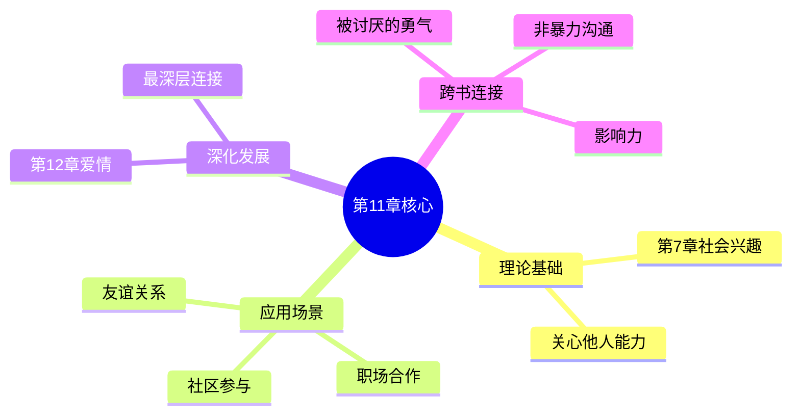

# 第11章 人与同伴

## 📍 章节定位

### 全书位置
> 第11章聚焦人际关系这一核心主题，深入阐述个体如何在同伴关系中实践社会兴趣，是承接第7章"社会兴趣"理论的具体应用，并为后续"爱情与婚姻"章节中亲密关系奠定合作基础

- **全书核心问题**: 自卑感如何转化为成长的动力？个体如何通过克服自卑获得超越？生命的意义究竟何在？
- **本章回答的问题**: 为什么人际关系对人生如此重要？如何与他人建立良好的关系？社会兴趣在人际交往中如何体现？
- **角色类型**: 实践应用型，将抽象的社会兴趣理论转化为具体的人际交往指导
- **论证位置**: 人生三大任务中的"社交"维度，连接个体心理与社会适应的桥梁

### 章节序列

| 方向 | 章节标题 | 逻辑连接 |
|------|----------|----------|
| 理论基础 | [[第7章-社会兴趣]] | 社会兴趣是人际关系的内在基础 |
| 前章 | [[第10章-职业问题]] | 职业是人际合作的一种形式 |
| 后章 | [[第12章-爱情与婚姻]] | 爱情是人际关系的最深层形态 |

### 一句话定位
> 第11章阐述人际关系的本质是社会兴趣的外在表达，良好的人际关系建立在平等、合作、贡献的基础上，是个体实现心理健康和社会适应的关键路径。

---

## 🎯 核心观点

### 第一层：表层案例
> 章节中的具体案例、故事、数据

| 案例名称 | 简要描述 | 关键引文 |
|----------|----------|----------|
| 孤独者的困境 | 缺乏社会兴趣的人无法建立真正的友谊 | "孤立的人无法在生活中找到真正的满足" |
| 合作的家庭 | 家庭成员之间的相互支持与合作 | "最健康的关系是平等的伙伴关系" |
| 社区参与的力量 | 积极参与社区活动的人更幸福 | "对社会有所贡献的人，才能真正找到自己的位置" |
| 敌对心态的根源 | 把他人视为竞争对手而非伙伴 | "将他人视为敌人的人，自己也活在敌意中" |

### 第二层：中层机制
> 案例背后的运行机制、方法论

| 机制名称 | 组成要素 | 因果链条 | 证据来源 |
|----------|----------|----------|----------|
| 人际吸引机制 | 社会兴趣 + 平等意识 + 合作态度 | 社会兴趣 → 关注他人 → 建立连接 → 深化关系 | 临床观察 |
| 关系修复机制 | 同理心 + 沟通能力 + 妥协意愿 | 冲突发生 → 理解对方 → 寻求共识 → 关系重建 | 心理咨询 |
| 孤独感形成机制 | 自我中心 + 缺乏信任 + 回避社交 | 自我关注 → 缺乏连接 → 孤独感加剧 → 心理问题 | 追踪研究 |

### 第三层：底层规律
> 可迁移的普遍规律

| 规律陈述 | 抽象层级 | 知识连接 | 适用范围 |
|----------|----------|----------|----------|
| 人际互惠定律 | 社会心理学 + 进化生物学 | 《影响力》互惠原理 | 所有社交场景 |
| 合作共生原则 | 生态学 + 系统论 | 生态系统理论 | 团队建设、社区发展 |
| 平等交换定律 | 社会学 + 经济学 | 社会交换理论 | 职场关系、商业合作 |

---

## 💬 降维翻译

### 观点1: 人际关系是社会兴趣的外在表现

#### 原文表达
> "一个人能否与他人建立良好的关系，取决于他的社会兴趣发展程度。只有真正关心他人、愿意为他人付出的人，才能在人际关系中获得真正的满足和幸福。"

#### 降维翻译（中学生能懂）
你和别人关系好不好，关键看你心里有没有别人。只有真心关心别人、愿意帮别人的人，才能在交朋友这件事上真正开心。

#### 日常类比（奶奶能懂）
就像种菜一样，你光想着自己吃，菜就种不好。得想着让家里人、邻居都能吃上新鲜菜，这菜才能种出好心情。交朋友也是，光想着自己占便宜的朋友，没人愿意跟你真心来往。

### 观点2: 把他人视为伙伴而非竞争对手

#### 原文表达
> "人生不是一场只有少数人能赢的比赛。那些把他人视为竞争对手的人，永远活在紧张和焦虑中。真正的智慧是把他人视为伙伴，在合作中实现共同的成长。"

#### 降维翻译（中学生能懂）
人生不像考试排名，不是别人好了你就差了。把别人当成对手的人，整天提心吊胆。聪明人把别人当朋友，一起进步才是真的赢。

#### 日常类比（奶奶能懂）
就像村里大家一起种地，有的想着别人家收成好自己就不好了，整天盯着别人田里。其实呢，邻居家庄稼长得好，你也能跟着学经验，大家一起丰收不好吗？把邻居当帮手，不当对手，日子才舒心。

### 观点3: 孤独的根源是自我中心

#### 原文表达
> "孤独感不是因为你身边没有人，而是因为你心里装不下别人。那些只关注自己利益的人，即使在人群中也会感到孤独。只有打开心扉，真正关心他人，才能摆脱孤独。"

#### 降维翻译（中学生能懂）
你觉得孤单，不是因为身边没人，而是因为你心里没别人。光想着自己的人，就算在人堆里也觉得没人懂。把心打开，真心关心别人，就不会觉得孤单了。

#### 日常类比（奶奶能懂）
就像住大院子，有的人整天关着门，邻居也不打招呼，明明周围住着人，却觉得冷清得很。有的人家开着门，邻居路过聊两句，借个盐借个醋，这日子才热乎。孤独不是没人陪你，是你自己把门关上了。

#### 检验
- Q: 如果一个中学生问你为什么总觉得孤独？
- A: 问问自己，最近有没有真心关心过别人？孤独不是因为没人陪你，而是因为你心里没有别人。试试主动关心一个朋友，你会发现孤独感会慢慢消失。

---

## ✨ 金句库

### 原书金句

| 金句 | 适用场景 |
|------|----------|
| "社会兴趣是所有真诚人际关系的基石。" | 人际关系论述 |
| "把他人视为伙伴的人，人生处处是朋友。" | 心态调整 |
| "孤独不是身边无人，而是心中无他。" | 孤独解读 |
| "真正的友谊建立在平等与合作的基础上。" | 友谊定义 |
| "在帮助他人中，我们找到自己的价值。" | 自我价值 |

### 降维金句

| 金句 | 来源观点 | 适用场景 |
|------|----------|----------|
| 交朋友先问自己：心里装得下别人吗？ | 观点1 | 自我审视 |
| 人生不是淘汰赛，是接力赛 | 观点2 | 心态转变 |
| 孤独是关上的门，打开门就是世界 | 观点3 | 励志指导 |
| 帮别人就是在帮未来的自己 | 观点1 | 互助理念 |
| 朋友圈不是战场，是花园 | 观点2 | 社交观 |

## 🔗 当下映射

### 💰 财富应用

| 场景 | 具体行动 | 预期效果 | 风险提示 |
|------|----------|----------|----------|
| 商业合作 | 把合作伙伴当朋友而非工具 | 建立长期信任关系 | 需要识别真伪合作伙伴 |
| 人脉投资 | 真心帮助他人成功 | 获得真诚回报 | 避免功利性太强 |

### 💼 职场应用

| 场景 | 具体行动 | 所需能力 | 适用职级 |
|------|----------|----------|----------|
| 团队协作 | 把同事当伙伴而非对手 | 合作意识、沟通能力 | 所有职级 |
| 客户关系 | 真心解决客户问题而非推销 | 服务意识、专业能力 | 所有职级 |
| 领导管理 | 帮助下属成长而非压制 | 胸怀格局、培养能力 | 管理层 |

### 🏠 生活应用

| 场景 | 具体行动 | 可行性 | 见效时间 |
|------|----------|--------|----------|
| 社交生活 | 主动关心身边人的需求 | 高 | 即时 |
| 家庭关系 | 把家人当伙伴而非附属 | 高 | 1-3个月 |
| 社区参与 | 参与邻里互助活动 | 中 | 1-2个月 |

### 72小时行动计划
1. **今天**：给一个很久没联系的朋友发消息，真诚问候
2. **本周内**：主动帮助一位需要协助的同事或朋友
3. **本月内**：参加一次社区或公益活动，在帮助他人中体验连接

---

## 🕸️ 章节关联

### 向上关联 → 整书
- **贡献**: 将社会兴趣理论具体化为人际交往的实践指南
- **位置**: 人生三大任务中"社交"维度的核心阐述

### 横向关联 → 章节间

| 章节编号 | 章节标题 | 关联类型 | 连接描述 |
|----------|----------|----------|----------|
| 第7章 | [[第7章-社会兴趣]] | 理论基础 | 社会兴趣是人际关系的内在根基 |
| 第10章 | [[第10章-职业问题]] | 应用延伸 | 职场关系是人际关系的一种形式 |
| 第12章 | [[第12章-爱情与婚姻]] | 深化发展 | 爱情关系是人际关系的最高形式 |

### 向下关联 → 具体应用

| 应用场景 | 难度 | 前置知识 |
|----------|------|----------|
| 友谊建立 | 低 | 基础社交能力 |
| 冲突化解 | 中 | 沟通技巧、同理心 |
| 社交网络建设 | 高 | 长期经营意识 |

### 跨书关联 → 知识网络

| 书籍 | 概念 | 关系 | 备注 |
|------|------|------|------|
| [[被讨厌的勇气-岸见一郎-拆解记录]] | 共同体感觉 | 概念一致 | 同一理论的通俗表达 |
| [[影响力-西奥迪尼-拆解记录]] | 互惠原理 | 机制互补 | 从社会心理学角度验证 |
| [[非暴力沟通-章节拆解/_导航]] | 同理心沟通 | 方法论补充 | 具体沟通技巧 |

### 关联可视化

---

## ❓ 问答设计

### Q1: (记忆型) 阿德勒认为人际关系的根本基础是什么？
**认知层次**: 记忆
**难度**: 低
**答案要点**:
- 社会兴趣是人际关系的根本基础
- 具体表现为关心他人和合作的意愿
- 缺乏社会兴趣就无法建立真正的友谊

### Q2: (理解型) 为什么把他人视为竞争对手会带来焦虑？
**认知层次**: 理解
**难度**: 中
**答案要点**:
- 竞争心态让人时刻警惕
- 把他人的成功视为自己的失败
- 永远无法放松和真正连接

### Q3: (应用型) 如何在日常生活中培养"把他人当伙伴"的心态？
**认知层次**: 应用
**难度**: 中
**答案要点**:
- 主动关注身边人的需求
- 为他人的成功感到高兴
- 在冲突中寻求双赢而非输赢

### Q4: (分析型) 孤独感的真正根源是什么？
**认知层次**: 分析
**难度**: 中
**答案要点**:
- 孤独不是因为身边没有人
- 根源是心中没有他人
- 自我中心导致连接断裂

### Q5: (创造型) 设计一个帮助孤独者重建社会连接的方案？
**认知层次**: 创造
**难度**: 高
**答案要点**:
- 从培养社会兴趣开始
- 设计循序渐进的社交活动
- 建立持续的支持机制

### Q6: (理解型) 社会兴趣与人际关系质量有什么关系？
**认知层次**: 理解
**难度**: 中
**答案要点**:
- 社会兴趣决定关系的深度
- 高社会兴趣带来高质量关系
- 关系质量影响幸福感

### Q7: (应用型) 在职场中如何实践"伙伴思维"？
**认知层次**: 应用
**难度**: 中
**答案要点**:
- 把同事的成功当作团队的成功
- 主动分享知识和资源
- 在竞争中保持合作精神

### Q8: (分析型) 为什么有些人"越社交越孤独"？
**认知层次**: 分析
**难度**: 中
**答案要点**:
- 社交停留在表面层次
- 心中没有真正关心他人
- 功利性社交无法建立连接

### Q9: (应用型) 如何帮助一个总是把他人当对手的朋友？
**认知层次**: 应用
**难度**: 中
**答案要点**:
- 用自身行为示范伙伴思维
- 引导其体验合作的快乐
- 帮助其理解竞争心态的代价

### Q10: (创造型) 如何设计一个"社会兴趣培养课程"？
**认知层次**: 创造
**难度**: 高
**答案要点**:
- 理论讲解与实践活动结合
- 从家庭、学校到社会循序渐进
- 建立反馈和激励机制

---
