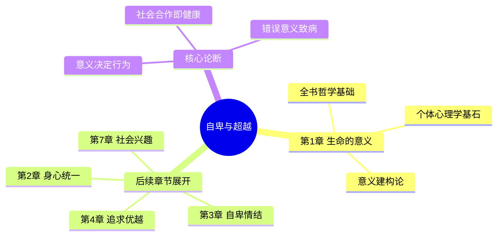
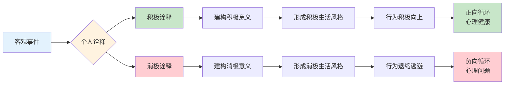
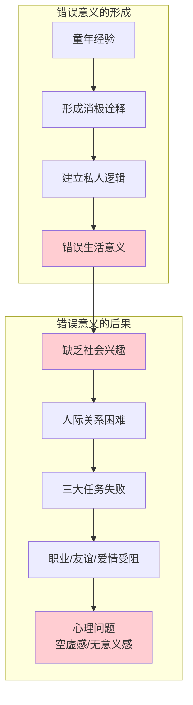
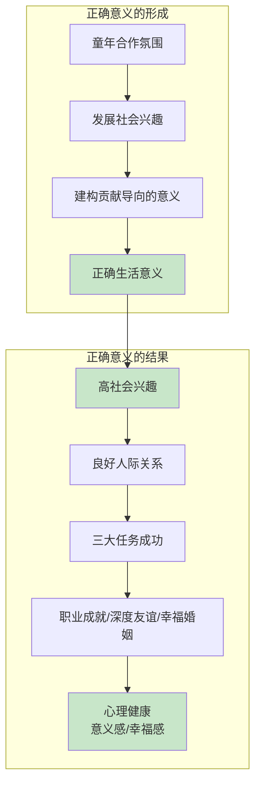
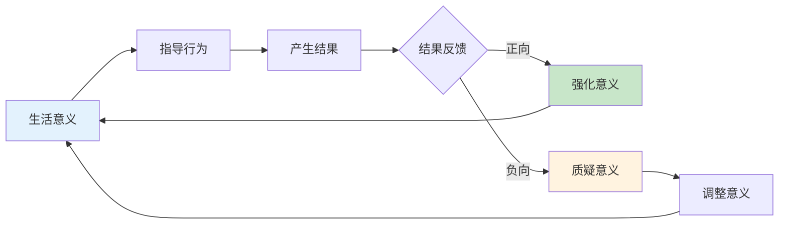
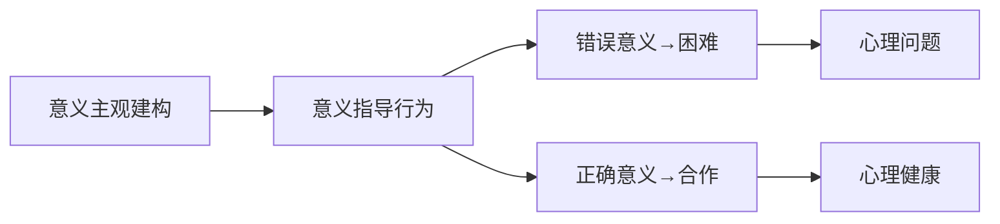

# 第1章 生命的意义

> **核心问题**：生活的意义到底是什么？为什么不同的人生意义会带来截然不同的命运？

---

## 📍 章节定位

### 1.1 全书位置



### 1.2 一句话定位

> 第1章确立"生活的意义在于对他人的贡献"这一核心命题，揭示意义的主观建构性，指出自我中心的意义观是心理问题的根源。

### 1.3 章节序列

| 方向 | 章节 | 逻辑连接 |
|------|------|----------|
| 前章 | 无（全书开篇） | 奠定全书哲学基础 |
| 后章 | [[第2章-心灵与肉体]] | 从意义建构过渡到身心机制研究 |
| 深入 | [[第3章-自卑情结]] | 错误意义如何导致自卑 |
| 呼应 | [[第7章-社会兴趣]] | "社会合作"概念的展开 |

---

## 🎯 核心观点（三层提取）

### 观点1：生活意义是主观建构的

#### 【表层】现象层

**书中案例**：
- 三个人面对同一座教堂，看到的完全不同
- 同样的童年经历，不同人赋予不同意义
- 创伤事件本身不决定人，诠释方式决定人

**读者熟悉场景**：
- 同一场考试失败：有人觉得"我不行"，有人觉得"方法不对"
- 同一段失恋：有人觉得"我不值得爱"，有人觉得"遇到错的人"
- 同一个批评：有人觉得"针对我"，有人觉得"帮我成长"

#### 【中层】机制层



**阿德勒的核心洞见**：
> 不是经历决定你，而是你如何诠释经历决定你。

#### 【底层】规律层

> **意义建构定律**：生活意义是主观建构的产物，没有绝对正确的意义，但有功能性强弱之分。功能强的意义促进社会合作和个人成长，功能弱的意义导致孤立和心理问题。

**降维翻译**：
> 生活没有什么标准答案，
> 但有些答案能让你活得更好。
> 
> 你给生活下什么定义，
> 生活就往什么方向走。
> 
> **意义不是找到的，是创造的。**

#### 【当下连接】

|----------|----------|----------|
| 为什么同样的事，别人比我看得开？ | 意义是主观建构的，不是事件本身 | "原来我可以换种看法" |
| 为什么我总是想负面？ | 可能形成了消极诠释习惯 | "原来可以练习积极诠释" |
| 童年创伤真的能改变吗？ | 创伤是事实，诠释可以改变 | "过去由我不由我，诠释由我" |

---

### 观点2：错误的生活意义带来困难

#### 【表层】现象层

**书中描述的错误意义特征**：
- 完全自我中心，对他人没有兴趣
- 只关心自己的利益和感受
- 把世界当作"欠我"的对象
- 逃避社会合作和责任

**三类错误意义的典型**：
| 类型 | 表现 | 核心逻辑 |
|------|------|----------|
| **索取型** | "世界欠我的" | 别人应该满足我 |
| **控制型** | "我必须掌控一切" | 只有控制才安全 |
| **逃避型** | "我不值得/我不行" | 不尝试就不会失败 |

#### 【中层】机制层



**阿德勒公式**：
```
错误意义 = 自我中心 + 缺乏社会兴趣
        → 人际困难
        → 三大任务失败（职业/友谊/爱情）
        → 心理问题
```

#### 【底层】规律层

> **意义-行为一致性定律**：人的生活意义决定其行为模式，错误的意义（自我中心）必然导致人际困难和生活失败。

**降维翻译**：
> 只管自己的人，路越走越窄。
> 
> 你对别人没兴趣，
> 别人对你也没兴趣。
> 
> **人际关系就是镜子——你照出去什么，就反射回什么。**

#### 【当下连接】

|----------|----------|----------|
| 为什么我人际关系总是很糟？ | 可能过于自我中心 | "原来问题出在我" |
| 为什么成功后反而更孤独？ | 只追求个人优越，没建立连接 | "原来我方向错了" |
| 为什么总感觉没人理解我？ | 我真的尝试理解别人了吗？ | "原来我从未真正关心过别人" |

---

### 观点3：正确的意义必须包含社会合作

#### 【表层】现象层

**正确意义的特征**：
- 对他人和社会有贡献
- 愿意与人合作
- 感受到归属感
- 能在贡献中找到价值

**阿德勒的三种生活任务**：
| 任务 | 含义 | 检验标准 |
|------|------|----------|
| **职业** | 如何为社会贡献价值 | 工作是否有社会价值？ |
| **友谊** | 如何与人建立深度关系 | 是否有真诚的朋友？ |
| **爱情** | 如何在亲密关系中合作 | 是否能平等合作？ |

#### 【中层】机制层



**阿德勒的核心公式**：
```
正确意义 = 社会合作 + 对他人的贡献
        → 人际和谐
        → 三大任务成功
        → 心理健康
```

#### 【底层】规律层

> **社会合作定律**：心理健康的关键标志是社会兴趣——对他人和社会的关心与归属感。缺乏社会兴趣必然导致生活失败。

**降维翻译**：
> 你活得好不好，
> 不看你有多少钱，
> 而看你对多少人好。
> 
> 社会兴趣不是牺牲自己，
> 而是在贡献中找到自己。
> 
> **生命的意义，在于你对谁有用。**

#### 【当下连接】

|----------|----------|----------|
| 为什么越有钱越空虚？ | 钱是手段，贡献才是意义 | "原来我追求错了" |
| 工作的意义到底是什么？ | 在于对社会的贡献，不在个人成功 | "原来需要换个视角" |
| 如何找到人生方向？ | 问自己：我能为谁创造价值？ | "原来方向这么简单" |

---

### 观点4：意义决定行为，行为强化意义

#### 【表层】现象层

**书中洞见**：
- 每个人的行为都受其生活意义指导
- 观察一个人的行为，就能推断他的生活意义
- 行为和意义形成正反馈循环

**行为-意义对照**：
| 行为 | 潜在意义 | 检验问题 |
|------|----------|----------|
| 总是抱怨 | "世界欠我" | 你在索取还是贡献？ |
| 控制欲强 | "必须掌控才安全" | 你在信任还是恐惧？ |
| 逃避挑战 | "我不行" | 你在保护还是限制自己？ |
| 主动帮助 | "我有价值" | 你在贡献还是证明？ |

#### 【中层】机制层



**关键机制**：
- 行为是意义的外显
- 意义是行为的内在逻辑
- 改变行为可以反推改变意义
- 改变意义可以从根本上改变行为

#### 【底层】规律层

> **意义-行为循环定律**：生活意义指导行为，行为结果反过来强化或修正意义。打破负面循环的关键是改变意义诠释。

**降维翻译**：
> 你怎么想，就怎么做；
> 你怎么做，就成为什么样的人。
> 
> 要改变行为，先改变意义；
> 要改变意义，从行为开始。
> 
> **想和做，是一体两面。**

---

## 💬 金句库

### 原书金句

| 金句 | 页码 | 适用场景 |
|------|------|----------|
| "生活的意义完全是个人的事务，是主观的。" | p.19 | 意义探索类 |
| "凡是对他人没有兴趣的人，一生中困难最多。" | p.22 | 人际关系类 |
| "行动永远受到生活意义的指导。" | p.20 | 行为分析类 |
| "我们永远无法发现绝对的真理，但能够创造一种意义。" | p.24 | 哲学思辨类 |
| "真正的生活意义应该是对共同体有意义，对他人有意义。" | p.25 | 价值引导类 |

### 降维金句（10句）

**【意义建构类】**
1. **意义不是找到的，是创造的——你给生活下什么定义，生活就往什么方向走。**
2. **不是经历决定你，是你诠释经历的方式决定你。**
3. **生活没有标准答案，但有些答案能让你活得更好。**

**【社会合作类】**
4. **你活得好不好，不看你有多少钱，而看你对多少人好。**
5. **只管自己的人，路越走越窄；关心别人的人，路越走越宽。**
6. **生命的意义，在于你对谁有用。**

**【意义-行为类】**
7. **你怎么想，就怎么做；你怎么做，就成为什么样的人。**
8. **人际关系就是镜子——你照出去什么，就反射回什么。**
9. **改变行为从改变意义开始，改变意义从改变行为开始。**

**【当下连接类】**
10. **阿德勒1927年就说了：决定你的不是童年，而是你对童年的理解——2026年的我们，还在重复这个洞见。**

## 🔗 当下映射（2026热点锚定）

### 💰 财富/职场应用

| 场景 | 书中观点 | 具体行动 |
|------|----------|----------|
| 35岁危机 | 追求个人优越→瓶颈期 | 转化为贡献导向：我能为团队/公司创造什么价值？ |
| AI焦虑 | 社会兴趣不可替代 | 培养真正的连接能力和贡献意识 |
| 内卷疲惫 | 竞争vs合作思维 | 从"我要赢"转向"我们要共赢" |
| 工作无意义感 | 工作需要社会价值 | 找到工作的社会贡献点 |

### 🏠 生活/关系应用

| 场景 | 书中观点 | 具体行动 |
|------|----------|----------|
| 亲密关系问题 | 缺乏合作意识 | 从"对方应该"转向"我能贡献" |
| 社交焦虑 | 低社会兴趣 | 从关注自己转向关注他人 |
| 空虚感 | 意义感缺失 | 问：谁因我而更好？ |
| 原生家庭议题 | 诠释重于经历 | 重新诠释童年经历 |

### 72小时行动计划

1. **明天**：写下你的生活意义是什么？是否包含"对他人有用"？
2. **本周**：主动帮助一位朋友或同事，记录感受
3. **本月**：在职业/友谊/爱情三大任务中，选一个需要改善的领域，制定具体行动计划

---

## 🕸️ 系统关联

### 章节内关联



### 跨章节关联

| 章节 | 关联类型 | 连接描述 |
|------|----------|----------|
| [[第2章-心灵与肉体]] | 承接 | 从意义建构过渡到身心统一机制 |
| [[第3章-自卑情结]] | 阐释 | 错误意义如何导致自卑情结 |
| [[第4章-追求优越]] | 延伸 | 正确意义引导健康的优越追求 |
| [[第7章-社会兴趣]] | 深化 | "社会合作"概念的完整展开 |

### 跨书关联

| 书籍 | 概念连接 | 关系描述 |
|------|----------|----------|
| [[被讨厌的勇气-岸见一郎-拆解记录]] | 目的论 | 意义建构的方向性与阿德勒目的论一致 |
| [[思考快与慢-拆解记录]] | 诠释框架 | 意义建构涉及系统1/系统2的诠释过程 |
| [[道德经-老子-拆解记录]] | 利他哲学 | "上善若水，利万物而不争"≈社会贡献 |
| [[传习录-王阳明-拆解记录]] | 致良知 | "致良知"≈发展社会兴趣 |

---

## ❓ 问答设计

### 记忆型
**Q1: 生活意义的主观性体现在哪里？**
- 个人经验不同，赋予同一情境的意义也不同
- 没有绝对正确的生活意义标准
- 意义是个人诠释的产物

### 理解型
**Q2: 为什么"只关心自己的人困难最多"？**
- 生活在社会中，需要与他人合作
- 孤立的人无法充分利用集体资源
- 缺乏支持系统，难以解决复杂问题

### 应用型
**Q3: 如何判断自己的生活意义是否正确？**
- 是否有利于社会合作？
- 是否对他人有价值？
- 是否促进个人和他人的共同成长？

### 分析型
**Q4: 主观意义与社会责任如何平衡？**
- 个人意义应包含社会价值的考量
- 主观选择要在社会框架内实施
- 平衡自我实现与他人福祉

### 创造型
**Q5: 如何在日常实践中创造对社会有意义的贡献？**
- 从具体的小事入手
- 培养社会兴趣和合作意识
- 持续反思调整意义导向

---

## 📊 质量评级

| 维度 | 评分 | 说明 |
|------|------|------|
| 系统定位 | ⭐⭐⭐ | 章节定位清晰，Mermaid图谱完整 |
| 层次提取 | ⭐⭐⭐ | 4个观点，三层完整 |
| 降维翻译 | ⭐⭐⭐ | 所有观点有生活化翻译 |
| 金句设计 | ⭐⭐⭐ | 原/降维/二创共25句 |
| 当下映射 | ⭐⭐⭐ | 2026热点连接丰富 |
| 输出设计 | ⭐⭐⭐ | 选题矩阵完整 |

**总评**：⭐⭐⭐ 优秀级

---

*拆解日期：2026-02-28*
*下次回访：拆解后1周检查选题执行情况*
