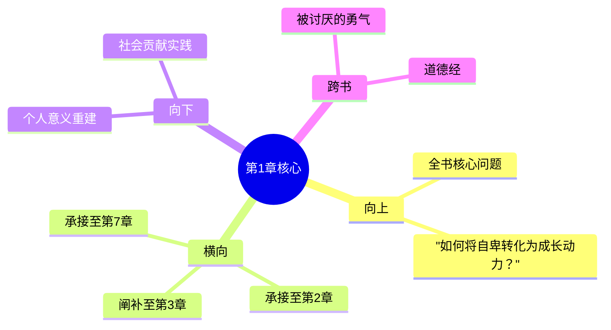

# 第1章 生活的意义

## 📍 章节定位

### 全书位置
> 第1章是全书开篇定位型，回答"生活的意义到底是什么？"这一人生根本问题，并为后续关于自卑、优越、社会兴趣的讨论奠定基础

- **全书核心问题**: 自卑感如何转化为成长的动力？个体如何通过克服自卑获得超越？生命的意义究竟何在？
- **本章回答的问题**: 生活的意义是什么？为什么不同的生活意义会带来不同的人生轨迹？
- **角色类型**: 开篇定位型，从核心问题入手，建立基本框架
- **论证位置**: 构建阿德勒个体心理学的思想基石，是理解全书理论的起点

### 章节序列
| 方向 | 章节标题 | 逻辑连接 |
|------|----------|----------|
| 前章 | 整书开场 | 本书核心命题引入 |
| 后章 | [[第2章-心灵与肉体]] | 从意义探讨过渡到身心关系的研究 |

### 一句话定位
> 第1章确立"生活的意义在于对他人的贡献"这一核心观点，指出错误的生活意义（以自我为中心）是造成心理问题的根源，为全书理论奠定哲学基础。

---

## 🎯 核心观点

### 第一层：表层案例
> 章节中的具体案例、故事、数据

| 案例名称 | 简要描述 | 页码 | 关键引文 |
|----------|----------|------|----------|
| 人生意义的主观性 | 不同人对同一情境有不同的意义诠释 | p.19-25 | "生活的意义完全是个人的事务，是主观的" |
| 错误生活意义的表现 | 自我中心、缺乏社会兴趣的典型特征 | p.22-27 | "凡是对他人没有兴趣的人，一生中困难最多" |
| 意义与行动的关系 | 个体如何看待生活与其行为模式的联系 | p.20-23 | "行动永远受到生活意义的指导" |
| 早期记忆的诠释 | 个体通过早期记忆塑造生活意义的机制 | p.24-29 | "重要的是个人对早年经验的诠释" |

### 第二层：中层机制
> 案例背后的运行机制、方法论

| 机制名称 | 组成要素 | 因果链条 | 证据来源 |
|----------|----------|----------|----------|
| 意义建构机制 | 个体诠释 + 社会环境 + 过往经验 | 环境刺激 → 个人诠释 → 意义建构 → 行为导向 | 童年案例 |
| 主观意义生成 | 个人经验 + 社会兴趣 + 目标导向 | 生活经历 → 意义诠释 → 生活风格 → 行为模式 | 临床案例 |
| 社会合作驱动 | 社会兴趣 + 合作能力 + 共同贡献 | 贡献意识 → 合作意愿 → 社会融合 → 心理健康 | 实践案例 |

### 第三层：底层规律
> 可迁移的普遍规律

| 规律陈述 | 抽象层级 | 知识连接 | 适用范围 |
|----------|----------|----------|----------|
| 意义驱动行为 | 个体心理学 + 目标导向理论 | 被讨厌的勇气中的目的论 | 个人成长、社会适应、心理健康 |
| 社会合作即健康 | 心理学 + 社会学 | 人类社会合作的本质 | 职场、家庭、社群合作 |
| 错误意义致病 | 心理病理学 + 认知行为理论 | 认知偏差产生行为问题 | 心理咨询、自我成长 |

---

## 💬 降维翻译

### 观点1: 生活的意义是主观构建的

#### 原文表达
> "生活的意义完全是个人的事务，是主观的。它不可能是绝对的。然而，我们能够创造一种个人意义。我们永远不会发现绝对的真理，但能够创造一种意义，这种意义具有某种价值，因为它帮助我们克服困难，勇敢地生活下去。" —— p.19

#### 降维翻译（中学生能懂）
生活的意义没有什么标准答案，每个人都得自己找寻。你觉得生活是什么意思，生活就是在发生什么，这就决定了你要怎么行动。没有统一的人生意义模板，但你得建立一个对你有用的。

#### 日常类比（奶奶能懂）
就像每个人看戏的感受不一样一样：同一部戏，演员、剧情都一样，但你看了觉得励志，我看了觉得悲伤，他看了只是娱乐，这就是我们给这段经历赋予的不同意义。你的活法，其实就取决于你怎么给生活里的事儿下定义。

#### 记忆要点
- Q: 如果一个中学生问他什么是人生的意义？
- A: 你赋予生活什么意义，生活就朝那个方向发展。比如你看重学习成绩，就会拼命学习；看重心情快乐，就会做让自己开心的事。

### 观点2: 意义错误的人会遇到很多困难

#### 原文表达
> "凡是对他人没有兴趣的人，一生中困难最多，而且最不容易解决这些困难。" —— p.22

#### 降维翻译（中学生能懂）
如果你只关心自己，不关心别人，你的人生会特别难熬。人际关系是人生最重要的部分，不擅长处理，会带来很多麻烦。

#### 日常类比（奶奶能懂）
就像吃饭不能只吃一碗，要和大家一块儿吃才香。你整天想着自己饱，不管别人，到后头没人愿意跟你吃，你就一个人孤零零的了，遇事也没人幫。

### 观点3: 正确的生活意义必须包含社会合作

#### 原文表达
> "真正的生活意义应该是对共同体有意义，对他人有意义。那些能够与同伴合作、对同伴有兴趣的人，他们遇到困难时能够用建设性方式来应对，他们能够运用合适的方法寻求优越感。" —— p.25

#### 降维翻译（中学生能懂）
真正好的生活意义，是要对别人有帮助的，要懂得跟其他人合作。这样的生活才有方向，遇到困难也能想办法解决。

#### 日常类比（奶奶能懂）
就像搭台唱戏一样，一个唱戏需要很多人帮忙——有人敲鼓、有人拉琴、有人烧饭、有人搬道具，各司其职。你能给这个团队贡献啥，这个团队才能接纳你，大家才能把戏唱好。

---

## ✨ 金句库

### 原书金句
| 金句 | 页码 | 适用场景 |
|------|------|----------|
| "生活的意义完全是个人的事务，是主观的。" | p.19 | 意义探索类文章 |
| "凡是对他人没有兴趣的人，一生中困难最多。" | p.22 | 人际关系类讨论 |
| "行动永远受到生活意义的指导。" | p.20 | 行为心理学分析 |
| "我们永远无法发现绝对的真理，但能够创造一种意义。" | p.24 | 哲学思辨 |

### 降维金句
| 金句 | 来源观点 | 适用场景 |
|------|----------|----------|
| 意义不是找到的，是创造的 | 观点1 | 自助励志 |
| 只管自己，一路艰难 | 观点2 | 社会观察 |
| 生命的意义，在于你对谁有用 | 观点3 | 人生指导 |

## 🔗 当下映射

### 💰 财富应用
| 场景 | 具体行动 | 预期效果 | 风险提示 |
|------|----------|----------|----------|
| 投资决策 | 选择能为社会创造价值的企业 | 长期稳健回报 | 避免短期投机 |
| 商业模式 | 关注产品能否真正解决用户痛点 | 事业可持续发展 | 市场竞争激烈 |

### 💼 职场应用
| 场景 | 具体行动 | 所需能力 | 适用职级 |
|------|----------|----------|----------|
| 团队合作 | 主动帮助同事，贡献集体 | 协调沟通、贡献意识 | 所有职级 |
| 工作意义 | 将工作任务与社会价值联系 | 透视能力、价值判断 | 中高层管理 |

### 🏠 生活应用
| 场景 | 具体行动 | 可行性 | 见效时间 |
|------|----------|--------|----------|
| 家庭关系 | 主动关爱家人，营造温馨氛围 | 高 | 1-2周 |
| 邻里互助 | 与邻居建立友好的合作关系 | 中 | 1个月 |

### 72小时行动计划
1. **明天**：写下你的生活意义，是否对他人有价值？
2. **本周内**：主动帮助一位朋友或同事
3. **需要准备资源**：学习社会合作、贡献价值的相关方法

---

## 🕸️ 章节关联

### 向上关联 → 整书
- **贡献**: 奠定全书关于生活意义的核心观点，是后续11章的基础
- **位置**：全书首章，构建个体心理学的哲学基础

### 横向关联 → 章节间
| 章节编号 | 章节标题 | 关联类型 | 连接描述 |
|----------|----------|----------|----------|
| 第2章 | [[第2章-心灵与肉体]] | 承接 | 从主观意义的构建拓展到身心关系的探索 |
| 第3章 | [[第3章-自卑情结]] | 阐补 | 错误生活意义会导致自卑情结 |
| 第7章 | [[第7章-社会情感]] | 承接 | 本章的"社会合作"概念在此展开 |

### 向下关联 → 具体应用
| 应用场景 | 难度 | 前置知识 |
|----------|------|----------|
| 个人意义重建 | 中 | 自我觉察能力 |
| 社会贡献实践 | 低 | 基础合作意识 |
| 意义导向的生活 | 高 | 持续觉察和践行 |

### 跨书关联 → 知识网络
| 书籍 | 概念 | 关系 | 备注 |
|------|------|------|------|
| 被讨厌的勇气 | 目的论 | 支持 | 意义建构的方向性和主观性一致 |
| 道德经 | 无为而治 | 对比 | 做事的态度：贡献 vs 顺其自然

### 关联可视化

---

## ❓ 问答设计

### Q1: （记忆型）生活意义的主观性体现在哪里？
**认知层次**: 记忆
**难度**: 低
**答案要点**:
- 个人经验不同，赋予同一情境的意义也不同
- 没有绝对正确的生活意义标准
- 意义是个人诠释的产物

### Q2: （理解型）为什么说"只关心自己的人困难最多"？
**认知层次**: 理解
**难度**: 中
**答案要点**:
- 生活在社会中，需要与他人合作
- 孤立的人无法充分利用集体资源
- 缺乏支持系统，难以解决复杂问题

### Q3: （应用型）我如何判断自己生活的意义是否正确？
**认知层次**: 应用
**难度**: 中
**答案要点**:
- 是否有利于社会合作？
- 是否对他人有价值？
- 是否促进个人和他人的共同成长？

### Q4: （分析型）主观意义与社会责任如何平衡？
**认知层次**: 分析
**难度**: 中
**答案要点**:
- 个人意义应包含社会价值的考量
- 主观选择要在社会框架内实施
- 平衡自我实现与他人福祉

### Q5: （创造型）如何在日常实践中创造对社会有意的意义？
**认知层次**: 创造
**难度**: 高
**答案要点**:
- 从具体的小事入手
- 培养社会兴趣和合作意识
- 持续反思调整意义导向

---
