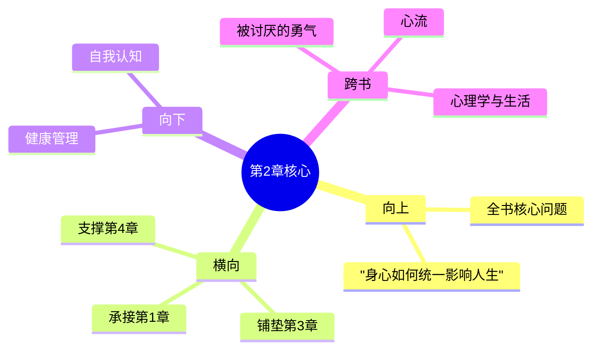

# 第2章 心灵与肉体

## 📍 章节定位

### 全书位置
> 第2章是全书的核心章节，探讨个体心理学的重要基础——心灵与肉体的关系，承接第一章关于生活的意义，为后续自卑情结理论奠定身体与心理的统一基础

- **全书核心问题**: 自卑感如何转化为成长的动力？个体如何通过克服自卑获得超越？生命的意义究竟何在？
- **本章回答的问题**: 心灵与肉体是什么关系？它们是如何协同工作的？这种关系如何影响个体的行为和生活方式？
- **角色类型**: 核心理论型，阐述身心统一理论
- **论证位置**: 为整个个体心理学提供身心关系的理论基础

### 章节序列
| 方向 | 章节标题 | 逻辑连接 |
|------|----------|----------|
| 前章 | [[第1章-生活的意义]] | 承接"生活意义"的概念，探讨身心对意义感知的影响 |
| 后章 | [[第3章-自卑情结]] | 为自卑情结的身体基础做铺垫，阐述身体感受如何影响心理状态 |

### 一句话定位
> 第2章阐述心灵与肉体的统一关系，指出身心健康相互影响，身体的不完美或疾病会对心理产生深刻影响，并影响个体的生活方式和追求目标。

---

## 🎯 核心观点

### 第一层：表层案例
> 章节中的具体案例、故事、数据

| 案例名称 | 简要描述 | 页码 | 关键引文 |
|----------|----------|------|----------|
| 病态器官的补偿 | 身体某器官有问题时，其他部位会代偿性发展 | p.32-35 | "器官缺陷的孩子往往会发展出超越正常水平的补偿能力" |
| 视力障碍的补偿 | 近视儿童往往具有更强的想象力和创造性思维 | p.36-40 | "身体的弱势常常伴随精神的强势" |
| 体型与性格类型 | 阿德勒划分三种体质类型及其对应的生活风格 | p.42-45 | "身体是人格的物质载体，反映生活风格" |

### 第二层：中层机制
> 案例背后的运行机制、方法论

| 机制名称 | 组成要素 | 因果链条 | 证据来源 |
|----------|----------|----------|----------|
| 身心统一机制 | 生理状态 + 心理状态 + 环境反应 | 生理感受 → 心理解读 → 行为反应 → 生活风格 | 临床观察 |
| 补偿机制 | 器官缺陷 + 自我觉察 + 努力弥补 | 身体缺陷 → 意识到不足 → 寻求补偿 → 超常发展 | 佝偻病患者案例 |
| 顺应机制 | 外界刺激 + 内在反应 + 行为调整 | 环境要求 → 身体能力 → 心理适应 → 行为策略 | 青春发育期案例 |

### 第三层：底层规律
> 可迁移的普遍规律

| 规律陈述 | 抽象层级 | 知识连接 | 适用范围 |
|----------|----------|----------|----------|
| 身心一体性 | 生理心理学 + 个体心理学 | 西医身心医学、中医形神合一 | 健康管理、个人发展、教育实践 |
| 优势转换规律 | 医学康复学 + 发展心理学 | 疾病适应理论、韧性发展 | 特殊教育、康复指导、潜能开发 |
| 整体反应原理 | 系统论 + 个体心理学 | 协同学、系统思维 | 心理咨询、人格评估、发展预测 |

---

## 💬 降维翻译

### 观点1: 心灵与肉体是一个整体

#### 原文表达
> "心灵和肉体构成一个统一体，两者相互影响、相互制约。心灵是整个有机体为了达成其目标而发展出来的工具之一。" —— p.32

#### 降维翻译（中学生能懂）
心里想的事和身体的状态是互相影响的，不是分开的。当你心情不好的时候，身体也会跟着受影响；当你身体不舒服时，心情也不太好。而且，我们心里的想法是为了帮助身体更好地生活和做事。

#### 日常类比（奶奶能懂）
就像人饿了肚子会难受，脑子也就转不动想事儿了；反过来，如果你心里有事总是愁着，就什么都不想吃，饭量也少了。人的思想和身体是一块儿活动的，不分家。

### 观点2: 器官缺陷可能激发超常发展

#### 原文表达
> "器官缺陷虽然造成身体的劣势，但这种劣势往往会激发出个体更大的努力，从而在另一些方面实现超常的发展。" —— p.38

#### 降维翻译（中学生能懂）
身体上有缺陷的地方，可能会让你在其他方面更努力、更有创造力。比如说，眼睛看不见的人，听力通常比常人更敏锐。弱点反而可能促使你在别的地方变得更强。

#### 日常类比（奶奶能懂）
就像有些小时候营养不良长得不太好的孩子，长大了反而特别聪明、特别能干。老天关了一扇门，会在别的地方给你打开更多窗。关键是看你怎么利用自己的处境。

### 观点3: 身体状况影响生活目标的选择

#### 原文表达
> "每个人都根据自己的身体条件来确定他的生活方式和目标。身体的特性成为个体解释世界的基础，影响其生活风格的形成。" —— p.44

#### 降维翻译（中学生能懂）
每个人的性格和行事方式，其实跟自己的身体条件有关。比如身高较矮的人可能会更努力在智力或其他方面来证明自己；而身体强壮的人可能会选择一些需要体力的活动作为人生方向。

#### 日常类比（奶奶能懂）
小孩子走路摔了跤，疼得不轻，以后走路就会更加小心仔细。人的性格和行为，很多时候就跟小时候的身体体验有关系。长得高的人可能更容易开朗，长得胖的人可能更怕热。环境塑造性格，这是一辈子的事。

#### 检验
- Q: 如果一个中学生问你心灵与肉体的关系是什么？
- A: 你的心思和身体是连在一起的，不是分开的两样东西。心情不好身体健康状况受影响，身体不舒服时心理状态也会变。

---

## ✨ 金句库

### 原书金句
| 金句 | 页码 | 适用场景 |
|------|------|----------|
| "心灵是整个有机体为了达成其目标而发展出来的工具之一。" | p.32 | 整体观论述 |
| "器官缺陷的孩子往往会发展出超越正常水平的补偿能力。" | p.35 | 身心康复 |
| "身体是人格的物质载体，反映生活风格。" | p.42 | 人格分析 |
| "身体的问题常常反映心灵的需求。" | p.39 | 心身关系 |
| "个体的生活风格深深植根于其身体基础之上。" | p.43 | 发展心理学 |

### 降维金句
| 金句 | 来源观点 | 适用场景 |
|------|----------|----------|
| 身体的缺陷，往往是心灵的动力源泉 | 观点2 | 激励成长 |
| 心想事成不仅是个愿望，更是身体的真实反应 | 观点1 | 心理调适 |
| 弱点成就强项，这是生命的智慧 | 观点2 | 励志分享 |
| 心身原本一体，分开了就缺斤短两 | 观点1 | 健康理念 |
| 每个身体都有自己的人生剧本 | 观点3 | 自我认知 |

## 🔗 当下映射

### 💰 财富应用
| 场景 | 具体行动 | 预期效果 | 风险提示 |
|------|----------|----------|----------|
| 压力管理 | 通过身体锻炼缓解心理压力 | 改善身心健康，提高工作效率 | 避免过度运动导致损伤 |
| 职业选择 | 根据身体特点选择适合的职业方向 | 发挥身体优势，获得更好表现 | 需要客观认识自身局限性 |

### 💼 职场应用
| 场景 | 具体行动 | 所需能力 | 适用职级 |
|------|----------|----------|----------|
| 工作方式 | 依据身心状态调整工作节奏 | 自我觉察能力、灵活调整能力 | 所有职级 |
| 团队管理 | 推崇身心健康的团队文化 | 沟通协调、人文关怀能力 | 中高层管理者 |

### 🏠 生活应用
| 场景 | 具体行动 | 可行性 | 见效时间 |
|------|----------|--------|----------|
| 健康生活 | 采用身心一体化的健康管理方式 | 高 | 1-2个月 |
| 家庭教育 | 教导孩子身体健康与心理发展的关系 | 高 | 6个月到1年 |

### 72小时行动计划
1. **明天**：观察自己今天的情绪和身体状态有何关联，记录下来
2. **本周内**：选择一项能让身心同时获益的活动并付诸实践（如瑜伽、散步、太极等）
3. **需要准备资源**：学习关于身心健康的科普知识，建立整体观念

---

## 🕸️ 章节关联

### 向上关联 → 整书
- **贡献**: 为阿德勒个体心理学奠定了重要的身心统一基础，是理解自卑情结和补偿机制的生物学基础
- **位置**: 全书中承上启下的位置，连接生活意义和个人心理结构

### 横向关联 → 章节间
| 章节编号 | 章节标题 | 关联类型 | 连接描述 |
|----------|----------|----------|----------|
| 第1章 | [[第1章-生活的意义]] | 承接 | 从意义层面过渡到身心层面 |
| 第3章 | [[第3章-自卑情结]] | 铺垫 | 承认身心关系是理解自卑的重要基础 |
| 第4章 | [[第4章-追求优越]] | 支撑 | 解释身体条件如何影响优越感追求 |
| 第5章 | [[第1章-哈吉斯]] | 底层支撑 | 机体感觉是早期记忆的基础之一 |

### 向下关联 → 具体应用
| 应用场景 | 难度 | 前置知识 |
|----------|------|----------|
| 身心健康管理 | 中 | 基础生物学和心理学理解 |
| 优势转换训练 | 高 | 深入的人格自我剖析能力 |
| 生活风格调整 | 高 | 强大的自我监控和调整能力 |

### 跨书关联 → 知识网络
| 书籍 | 概念 | 关系 | 备注 |
|------|------|------|------|
| [[被讨厌的勇气-岸见一郎-拆解记录]] | 目的论 | 扩展 | 本书从身心统一出发解释目的性行为 |
| [[心流-契克森米哈赖-拆解记录]] | 身心整合 | 支持 | 心流状态也是身心高度协调的体现 |
| [[心理学]] | 认知行为治疗 | 对比 | 西方心理学也重视身心关系 |

### 关联可视化

---

## ❓ 问答设计

### Q1: (记忆型) 心灵和肉体之间是什么关系？
**认知层次**: 记忆
**难度**: 低
**答案要点**:
- 心灵和肉体构成一个统一体，彼此相互影响
- 心灵不是独立于身体存在的实体
- 身体状态会影响心理状态，反之亦然

### Q2: (理解型) 器官缺陷如何激发个体的超常发展？
**认知层次**: 理解
**难度**: 中
**答案要点**:
- 器官缺陷会产生强烈的弥补动机
- 个体会投入到其他方面的优势发展中
- 通过补偿机制获得超常能力

### Q3: (应用型) 如何根据身体特点调整生活目标？
**认知层次**: 应用
**难度**: 中
**答案要点**:
- 客观认识自身身体条件限制
- 根据实际情况设定可行性目标
- 利用身体特点转化为优势

### Q4: (分析型) 身心统一如何影响我们的行为选择？
**认知层次**: 分析
**难度**: 中
**答案要点**:
- 行为选择受身心双重因素制约
- 生理限制可能引发特定心理补偿
- 个体通过身心协调达到目标

### Q5: (创造型) 如何设计身心一体化的个人发展方案？
**认知层次**: 创造
**Difficulty**: 高
**答案要点**:
- 设定兼顾身心健康的综合目标
- 制定身心协调的发展策略
- 建立身心反馈监测机制

### Q6: (理解型) 为什么阿德勒强调整体而非分离的治疗方式？
**认知层次**: 理解
**难度**: 中
**答案要点**:
- 分离治疗不能根本解决问题
- 身心问题往往互为因果
- 整体视角才可能真正帮助个体

### Q7: (应用型) 身心统一观在日常保健中如何运用？
**认知层次**: 应用
**难度**: 中
**答案要点**:
- 调节身心平衡的保健理念
- 注重心理调适的同时注意身体养护
- 从整体健康的角度制定保健计划

### Q8: (分析型) 器官缺陷带来的补偿性发展有哪些具体表现？
**认知层次**: 分析
**难度**: 中
**答案要点**:
- 某方面的超常能力可能出现在其他感官或智慧方面
- 高度敏感的心理适应能力
- 创新性地解决问题的能力

### Q9: (应用型) 如何帮助身体有缺陷的孩子发挥补偿性优势？
**认知层次**: 应用
**难度**: 中
**答案要点**:
- 发现孩子在其他方面的特长或潜能
- 提供适当的环境和支持
- 建立积极的人生观和世界观

### Q10: (创造型) 如何运用身心统一原理进行个性化的心理咨询？
**认知层次**: 创造
**难度**: 高
**答案要点**:
- 评估客户身心两方面的状况
- 制定兼顾身心的咨询策略
- 促进身心协调发展，实现心理成长

### Q11: (分析型) 身心关系如何影响个体的自卑感形成？
**认知层次**: 分析
**难度**: 中
**答案要点**:
- 身体缺陷容易引发自卑情绪
- 生理感受影响个体的自我评价
- 身心协调有助于化解自卑感

### Q12: (理解型) 阿德勒的身心观与传统身心二元论有何区别？
**认知层次**: 理解
**难度**: 中
**答案要点**:
- 不区分身心的主导地位
- 强调二者不可分割的统一性
- 认为行为是个体整体的体现

### Q13: (应用型) 如何通过锻炼身体来改善心理状态？
**认知层次**: 应用
**难度**: 中
**答案要点**:
- 选择适合个性的运动或身体活动
- 注意运动对心理健康的实际效果
- 建立规律的身心调适制度

### Q14: (分析型) 身体优势如何影响个体的自我认知和生活方式？
**认知层次**: 分析
**难度**: 中
**答案要点**:
- 身体优势可能带来一定的优越感
- 影响个体在社交、职业等领域的行为选择
- 形成特定的自我定位和人际模式

### Q15: (创造型) 如何创新应用身心一体理论来解决现代社会问题？
**认知层次**: 创造
**难度**: 高
**答案要点**:
- 融合传统医学和现代心理治疗
- 开发身心整合的教育模式
- 创建兼顾健康的职场环境

---
