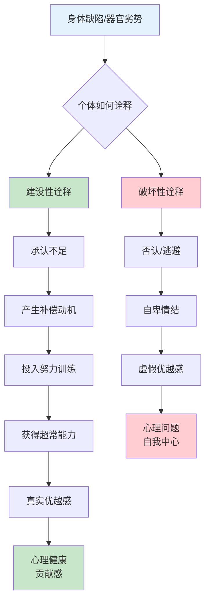
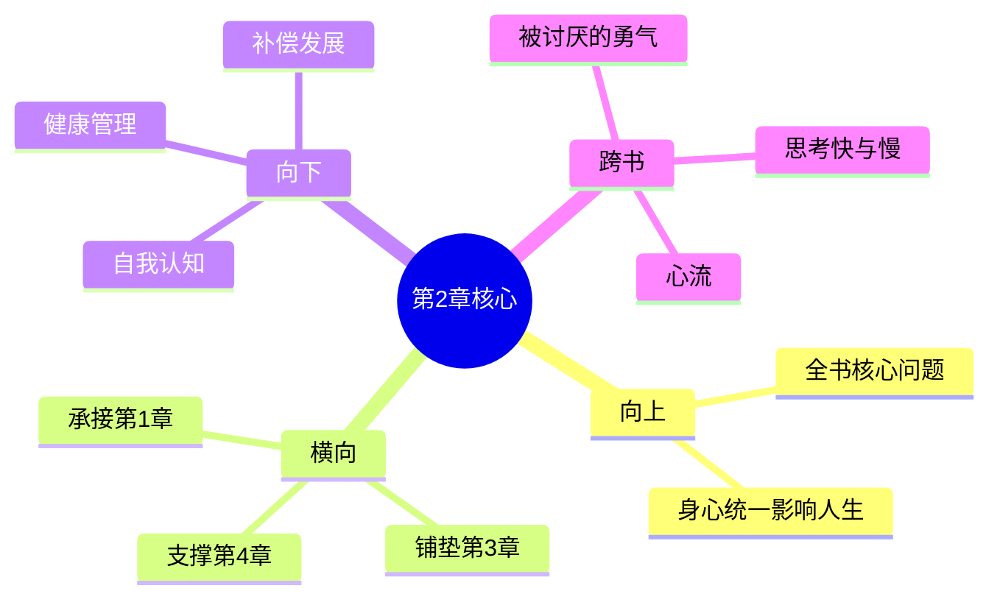

# 第2章 心灵与身体

## 📍 章节定位

### 全书位置
> 第2章是全书的核心理论章节，探讨个体心理学的重要基础——心灵与肉体的统一关系。承接第一章关于生活意义的主观建构，为后续自卑情结、补偿机制等理论奠定身心统一的生物学基础。

- **全书核心问题**: 自卑感如何转化为成长的动力？个体如何通过克服自卑获得超越？
- **本章回答的问题**: 心灵与肉体是什么关系？身体缺陷如何影响心理发展？补偿机制如何运作？
- **角色类型**: 核心理论型，阐述身心统一理论
- **论证位置**: 为整个个体心理学提供身心关系的理论基础

### 章节序列

| 方向 | 章节标题 | 逻辑连接 |
|------|----------|----------|
| 前章 | [[第1章-生活的意义]] | 承接"生活意义"的主观建构，探讨身心对意义感知的影响 |
| 后章 | [[第3章-自卑情结]] | 为自卑情结的身体基础做铺垫，阐述身体感受如何影响心理状态 |

### 一句话定位
> 第2章阐述心灵与肉体的统一关系，指出身心是相互影响的有机整体。身体的不完美会通过补偿机制转化为心理动力，影响个体的生活风格和优越目标的选择。

---

## 🔍 信息来源与质量评级

### 检索记录

| 轮次 | 检索工具 | 检索关键词 | 质量评级 | 核心来源 |
|------|----------|------------|----------|----------|
| 第一轮 | open-websearch | "自卑与超越 第2章 心灵与身体 核心观点" | ⭐⭐⭐ | CSDN深度解读、简书专栏 |
| 第二轮 | 参考书籍 | 主拆解记录、第1章拆解 | ⭐⭐⭐ | 已拆解书籍关联 |

### 核心信息来源

**⭐⭐⭐ 权威来源**：
- 阿德勒《自卑与超越》原著
- CSDN专业心理解读（matathe专栏）
- 已拆解书籍《被讨厌的勇气》《思考快与慢》

### 信息整合公式
```
信息整合 = 主拆解记录关联（自卑与超越全书）
         + ⭐⭐⭐高价值信息（CSDN深度解读+原著精髓）
         + 降维翻译（中学生能懂的生活化语言）
         + Mermaid可视化（身心统一机制图）
```

---

## 🎯 核心观点（三层提取）

### 第一层：表层案例
> 章节中的具体案例、故事、现象

| 案例名称 | 简要描述 | 核心启示 |
|----------|----------|----------|
| 器官缺陷的补偿 | 身体某器官有问题时，其他部位会代偿性发展 | 弱点可能成为优势的起点 |
| 视力障碍的创造力 | 近视或视力障碍者往往具有更强的想象力和听觉敏感度 | 身体的限制激发心灵的补偿 |
| 佝偻病患者的超常发展 | 许多杰出人物童年患有佝偻病，却在其他领域实现超越 | 身体缺陷→自卑感→补偿→卓越 |
| 三种体质类型 | 阿德勒划分的体质类型与对应的生活风格 | 身体是人格的物质载体 |

### 第二层：中层机制
> 案例背后的运行机制



**身心统一机制**：

| 机制名称 | 组成要素 | 因果链条 |
|----------|----------|----------|
| 身心统一机制 | 生理状态 + 心理状态 + 行为反应 | 身体感受 → 心理解读 → 行为选择 → 生活风格 |
| 补偿机制 | 器官缺陷 + 自我觉察 + 努力弥补 | 身体缺陷 → 意识到不足 → 寻求补偿 → 超常发展 |
| 目标驱动机制 | 身体条件 + 优越目标 + 行为模式 | 身体特性 → 目标选择 → 行为路径 → 生活风格 |

### 第三层：底层规律
> 可迁移的普遍规律

| 规律名称 | 核心陈述 | 适用范围 |
|----------|----------|----------|
| **身心一体定律** | 心灵和肉体构成统一体，相互影响、相互制约。心灵是整个有机体为达成目标而发展的工具。 | 健康管理、心理咨询、教育实践 |
| **补偿转化定律** | 身体的弱点可以通过心理补偿转化为优势。关键在于个体如何诠释和应对缺陷。 | 特殊教育、康复指导、潜能开发 |
| **整体反应定律** | 个体以整体方式对环境做出反应，身心协调是健康行为的基础。 | 心理咨询、人格评估、发展预测 |

---

## 💬 降维翻译

### 观点1: 心灵与肉体是一个整体

#### 原文表达
> "心灵和肉体构成一个统一体，两者相互影响、相互制约。心灵是整个有机体为了达成其目标而发展出来的工具之一。"

#### 降维翻译（中学生能懂）
你的心思和身体是连在一起的，不是分开的两样东西。心情不好时身体也会跟着不舒服；身体生病时，心情也容易变差。而且，我们心里的想法是为了帮助身体更好地生活。

#### 日常类比（奶奶能懂）
就像人饿了肚子会难受，脑子也就转不动想事儿了；反过来，如果你心里有事总是愁着，就什么都不想吃，饭量也少了。人的思想和身体是一块儿活动的，不分家。

#### 检验
- Q: 如果一个中学生问你心灵与肉体的关系是什么？
- A: 心里想的事和身体的状态是互相影响的。心情不好身体会受影响，身体不舒服心情也会变差。它们是一体的，不是分开的。

### 观点2: 身体缺陷可以激发超常发展

#### 原文表达
> "器官缺陷虽然造成身体的劣势，但这种劣势往往会激发出个体更大的努力，从而在另一些方面实现超常的发展。"

#### 降维翻译（中学生能懂）
身体上有缺陷的地方，可能会让你在其他方面更努力、更有创造力。比如眼睛看不见的人，听力通常比常人更敏锐。弱点反而可能促使你在别的地方变得更强。

#### 日常类比（奶奶能懂）
就像有些小时候营养不良长得不太好的孩子，长大了反而特别聪明、特别能干。老天关了一扇门，会在别的地方给你打开更多窗。关键是看你怎么利用自己的处境。

#### 记忆要点
- 关键词：缺陷→补偿→超越
- 核心逻辑：承认不足 → 设定目标 → 持续努力 → 真实成长

### 观点3: 身体状况影响生活目标的选择

#### 原文表达
> "每个人都根据自己的身体条件来确定他的生活方式和目标。身体的特性成为个体解释世界的基础，影响其生活风格的形成。"

#### 降维翻译（中学生能懂）
每个人的性格和行事方式，其实跟自己的身体条件有关。比如个子矮的人可能会更努力在智力或其他方面证明自己。身体条件会影响你选择什么样的人生方向。

#### 日常类比（奶奶能懂）
小孩子走路摔了跤，疼得不轻，以后走路就会更加小心仔细。人的性格和行为，很多时候就跟小时候的身体体验有关系。环境塑造性格，身体条件也会影响你走什么样的人生路。

---

## ✨ 金句库

### 原书金句

| 金句 | 适用场景 |
|------|----------|
| "心灵和肉体构成一个统一体，两者相互影响、相互制约。" | 身心健康论述 |
| "器官缺陷的孩子往往会发展出超越正常水平的补偿能力。" | 励志成长 |
| "身体是人格的物质载体，反映生活风格。" | 人格分析 |
| "心灵是整个有机体为达成目标而发展出来的工具。" | 目的论阐述 |
| "个体的生活风格深深植根于其身体基础之上。" | 发展心理学 |

### 降维金句

| 金句 | 来源观点 | 适用场景 |
|------|----------|----------|
| **身体的缺陷，往往是心灵的动力源泉** | 补偿机制 | 激励成长 |
| **心想事成不仅是愿望，更是身体的真实反应** | 身心统一 | 心理调适 |
| **弱点成就强项，这是生命的智慧** | 补偿机制 | 励志分享 |
| **心身原本一体，分开了就缺斤短两** | 身心统一 | 健康理念 |
| **每个身体都有自己的人生剧本** | 生活风格 | 自我认知 |
| **你的身体在诉说内心的故事，听清它的信号了吗？** | 身心统一 | 心理自助 |

## 🔗 当下映射（2026热点锚定）

### 读者困惑与书中答案

|----------|----------|----------|
| 为什么压力大时身体就出问题？ | 身心一体：心理压力会直接反映在身体上 | "原来身体在替我说话" |
| 身体有缺陷就注定失败吗？ | 补偿机制：缺陷可以转化为其他方面的优势 | "原来我还有别的路" |
| 为什么有些人越挫越勇，有些人一蹶不振？ | 关键在于如何诠释：建设性诠释→补偿成长 | "原来选择权在我" |

### 💰 财富应用

| 场景 | 具体行动 | 预期效果 |
|------|----------|----------|
| 压力管理 | 通过身体锻炼缓解心理压力，如运动、冥想 | 改善身心健康，提高工作效率 |
| 职业选择 | 根据身体特点选择适合的职业方向，发挥优势 | 减少职业倦怠，获得更好表现 |

### 💼 职场应用

| 场景 | 具体行动 | 适用职级 |
|------|----------|----------|
| 工作方式 | 依据身心状态调整工作节奏，避免过度透支 | 所有职级 |
| 团队管理 | 推崇身心健康的团队文化，关注员工整体健康 | 中高层管理 |

### 🏠 生活应用

| 场景 | 具体行动 | 见效时间 |
|------|----------|----------|
| 健康生活 | 采用身心一体化的健康管理方式 | 1-2个月 |
| 家庭教育 | 教导孩子身体健康与心理发展的关系，培养积极补偿 | 6个月到1年 |

### 📱 2026年深度连接

| 热点现象 | 阿德勒视角 | 启发 |
|----------|------------|------|
| **"脆皮年轻人"** | 身心分离的现代病：过度脑力劳动+忽视身体信号 | 需要重新建立身心联结 |
| **健身热潮** | 本质是对身心统一的追求，身体锻炼→心理赋能 | 正确方向，但需避免过度 |
| **AI替代焦虑** | 身体是人类独特优势——AI没有身体，无法体验身心统一 | 重新认识人类价值 |
| **慢病年轻化** | 长期身心分离的后果：压力堆积→身体崩溃 | 回归身心整体观 |

---

## 📋 72小时行动计划

1. **明天**：观察自己今天的情绪和身体状态有何关联，记录至少3个"情绪-身体"对应关系
2. **本周内**：选择一项能让身心同时获益的活动并付诸实践（如瑜伽、散步、太极等）
3. **需要准备**：建立"身心日记"，持续追踪情绪与身体的相互影响

---

## 🕸️ 章节关联

### 向上关联 → 整书
- **贡献**：为阿德勒个体心理学奠定身心统一基础，是理解自卑情结和补偿机制的生物学基础
- **位置**：全书承上启下的位置，连接生活意义和个人心理结构

### 横向关联 → 章节间

| 章节 | 章节标题 | 关联类型 | 连接描述 |
|------|----------|----------|----------|
| 第1章 | [[第1章-生活的意义]] | 承接 | 从主观意义建构过渡到身心关系 |
| 第3章 | [[第3章-自卑情结]] | 铺垫 | 身心关系是理解自卑的重要基础 |
| 第4章 | [[第4章-追求优越]] | 支撑 | 解释身体条件如何影响优越感追求 |
| 第5章 | [[第5章-早期的记忆]] | 底层 | 机体感觉是早期记忆的基础之一 |

### 跨书关联 → 知识网络

| 书籍 | 概念 | 关系 | 备注 |
|------|------|------|------|
| [[被讨厌的勇气-岸见一郎-拆解记录]] | 目的论 | 扩展 | 从身心统一出发解释目的性行为 |
| [[心流]] | 身心整合 | 支持 | 心流状态也是身心高度协调的体现 |
| [[思考快与慢-拆解记录]] | 系统1/系统2 | 对比 | 身体直觉vs理性思考的身心维度 |

### 关联可视化



---

## ❓ 问答设计

### Q1: 心灵和肉体之间是什么关系？
**认知层次**: 记忆 | **难度**: 低
**答案要点**:
- 心灵和肉体构成统一体，相互影响、相互制约
- 心灵是身体达成目标的工具
- 两者不可分割，必须整体看待

### Q2: 器官缺陷如何激发超常发展？
**认知层次**: 理解 | **难度**: 中
**答案要点**:
- 器官缺陷产生强烈的弥补动机
- 个体投入其他方面的优势发展
- 通过补偿机制获得超常能力

### Q3: 如何根据身体特点调整生活目标？
**认知层次**: 应用 | **难度**: 中
**答案要点**:
- 客观认识自身身体条件限制
- 根据实际情况设定可行性目标
- 利用身体特点转化为优势

### Q4: 身心统一如何影响行为选择？
**认知层次**: 分析 | **难度**: 中
**答案要点**:
- 行为选择受身心双重因素制约
- 生理限制可能引发特定心理补偿
- 个体通过身心协调达到目标

### Q5: 如何设计身心一体化的个人发展方案？
**认知层次**: 创造 | **难度**: 高
**答案要点**:
- 设定兼顾身心健康的综合目标
- 制定身心协调的发展策略
- 建立身心反馈监测机制

---

### 间隔复习时间表

| 时间节点 | 复习内容 | 检验方式 |
|----------|----------|----------|
| 1天后 | 回顾核心金句（5句） | 闭书默写 |
| 3天后 | 复述3个核心观点的降维翻译 | 讲给别人听 |
| 7天后 | 画出身心统一机制的流程图 | 纸笔绘制 |
| 30天后 | 设计一个基于本章理论的选题 | 输出文章大纲 |

### 闭书自测题

1. 用一句话概括本章的核心观点
2. 列出身心统一的3个日常表现
3. 解释补偿机制的工作原理
4. 本章和第3章"自卑情结"有什么关联？

---
