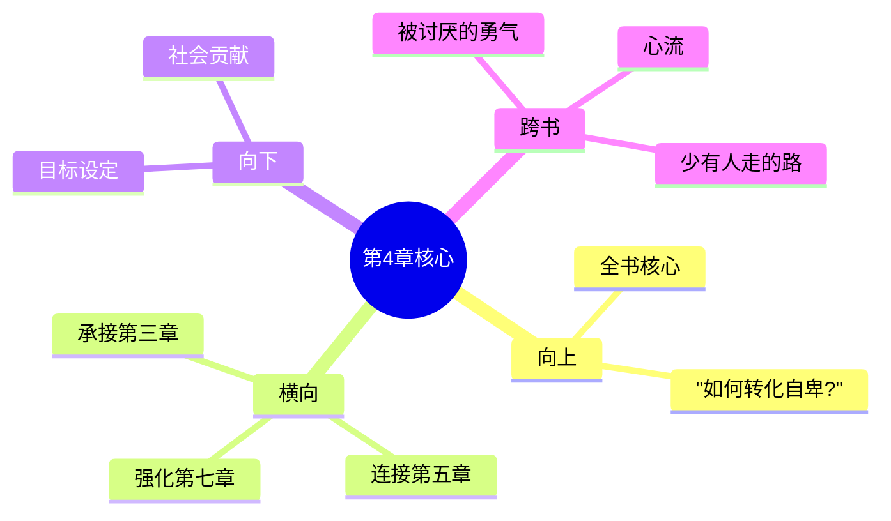

# 第4章 追求优越

## 📍 章节定位

### 全书位置
> 第4章是全书核心理论章节，阐述个体心理学的关键概念"追求优越"，承接前章对自卑情结的解析，为个体走出自卑、实现自我超越提供目标和方向，是连接心理问题识别和健康解决方案的枢纽

- **全书核心问题**: 自卑感如何转化为成长的动力？个体如何通过克服自卑获得超越？生命的意义究竟何在？
- **本章回答的问题**: 追求优越的含义及其积极作用是什么？正确的优越感目标和错误的优越感目标有何区别？个体如何设定有益的优越目标？
- **角色类型**: 核心解决方案型，指明健康的发展方向
- **论证位置**: 个体心理学理论体系中关于行为目标的指导原理

### 章节序列
| 方向 | 章节标题 | 逻辑连接 |
|------|----------|----------|
| 前章 | [[第3章-自卑情结]] | 从问题诊断转向解决方案 |
| 后章 | [[第5章-早期的记忆]] | 利用追求优越的理念审视早期记忆的作用 |

### 一句话定位
> 第4章阐述"追求优越"是人类的基本心理动力，但关键在于追求什么样的优越：服务于个体成长和社会贡献的"正确优越"，还是单纯自我膨胀的"错误优越"。

---

## 🎯 核心观点

### 第一层：表层案例
> 章节中的具体案例、故事、数据

| 案例名称 | 简要描述 | 页码 | 关键引文 |
|----------|----------|------|----------|
| 聋哑诗人海伦·凯勒 | 通过努力克服生理缺陷，在文学和社会活动中取得成就 | p.75-78 | "她的优越追求体现在服务他人上" |
| 家庭中的长子女 | 因失去独子地位而表现出补偿性竞争行为 | p.82-84 | "失去中心地位引发的优越渴望" |
| 意愿竞争的学生成绩 | 过度竞争心态损害学习效率的实例 | p.87-90 | "个人优越目标损害群体学习环境" |

### 第二层：中层机制
> 案例背后的运行机制、方法论

| 机制名称 | 组成要素 | 因果链条 | 证据来源 |
|----------|----------|----------|----------|
| 健康追求优越机制 | 贡献动机 + 社会兴趣 + 行为指向 | 自卑感→追求成长→服务社会→心理满足 | 成功人士案例 |
| 病态追求优越机制 | 自私动机 + 缺乏社会兴趣 + 个人至上 | 自卑情结→虚构优越→伤害他人→内心空虚 | 问题行为案例 |
| 优越目标修正机制 | 自我反思 + 社会认知 + 现实检验 | 错误目标→认识问题→调整方向→重新定位 | 心理矫正案例 |

### 第三层：底层规律
> 可迁移的普遍规律

| 规律陈述 | 抽象层级 | 知识连接 | 适用范围 |
|----------|----------|----------|----------|
| 目标导向成长律 | 行为主义心理学 + 个体心理学 | 荣誉理论、马斯洛需求层次 | 个人发展、教育引导、组织管理 |
| 社会贡献导向定理 | 心理动力学 + 社会心理学 | 阿德勒社会兴趣理论、合作学习理论 | 精神文明建设、团队合作、社区发展 |
| 自我超越循环律 | 发展心理学 + 静观心理学 | 东方哲学、正向心理学、心流理论 | 自我实现、心理疗愈、个人修养 |

---

## 💬 降维翻译

### 观点1: 每个人都有追求优越的动力

#### 原文表达
> "追求优越是所有生物的根本冲动。对于人类而言，追求优越意味着征服一切困难，超越一切可能性，创造出新的成功。然而，问题的关键在于追求优越的目标是什么。" —— p.72

#### 降维翻译（中学生能懂）
每个人天生都想变得更强、更好，这是人类的一个基本特点。但是重要的不是你想要变得有多么厉害，而是你追求这些厉害的目标是用来做什么的。

#### 日常类比（奶奶能懂）
人人都想当好汉，都想比周围人能干一些。这想法很正常，也很正面。关键是看你是为了啥：是为了帮助街坊邻里，还是只想自己风光盖过别人。前一种想法让人佩服，后一种想法让人敬而远之。

### 观点2: 正确的追求是有社会意义的

#### 原文表达
> "如果个体对他人和社会发生了兴趣，他的目标就必然具备社会意义。这样追求优越的过程中，他会与他人合作，会以对社会的贡献为衡量成功的重要尺度。" —— p.78

#### 降维翻译（中学生能懂）
如果你的目标不仅是为了自己好，也是为了让更多人好起来，那你追求优秀的方向就是对的。这样你努力提升自己时，同时也帮到了别人，自己也好、别的人也好了。

#### 日常类比（奶奶能懂）
就像村里的能人，自己致富了还带着大家一起富，这样的人村里人都尊敬；要是自己富了就嫌弃穷亲戚，甚至坑害邻居，这样的人就算再有钱也没人瞧得起。做人要有良心。

### 观点3: 错误的追求只为自己膨胀

#### 原文表达
> "如果个体只关注自己的优越地位，只想着压倒他人，他可能会采取欺骗、操控、破坏的方式来达到目标。这种追求优越的方式，实际上是自我毁灭的。" —— p.84

#### 降维翻译（中学生能懂）
如果你只顾着自己变得更优越，想踩着别人往上爬，就可能会使坏、哄骗、破坏，这样达成的成功不会持续。因为这样追求优越，最终伤害的是自己。

#### 日常类比（奶奶能懂）
就像有人为了显得自己钱包鼓，把家里值钱的东西偷偷拿去典当，换钱买只金戒指戴出去，别人看到了是暂时嫉妒，过后知道真相了就是瞧不起。这种靠损害根基换来的风光，迟早要露馅，还得搭进去更多。

#### 检验
- Q: 如果一个中学生问你什么是正确的追求优越？
- A: 正确的追求优越不仅是让自己更好，也希望让别人和社会变得更好。错误的追求优越是只要自己好，不管别人怎么样。

---

## ✨ 金句库

### 原书金句
| 金句 | 页码 | 适用场景 |
|------|------|----------|
| "追求优越是所有生物的根本冲动。" | p.72 | 基本动机论述 |
| "问题的关键在于追求优越的目标是什么。" | p.75 | 目标指引分析 |
| "如果个体对他人和社会发生了兴趣，他的目标就必然具备社会意义。" | p.78 | 社会价值观阐述 |
| "错误的追求优越方式，实际上是自我毁灭的。" | p.84 | 问题行为警示 |
| "对社会的贡献是对优越感最好的衡量。" | p.90 | 价值导向判定 |

### 降维金句
| 金句 | 来源观点 | 适用场景 |
|------|----------|----------|
| 追求优越本身无错，错在追求的目的 | 观点2 | 价值观引导 |
| 真正的强大是成就他人而非贬低他人 | 观点2 | 人际关系 |
| 合理的野心让人前进，自私的野心让人坠落 | 观点3 | 远景规划 |
| 只为自己好的成功，注定不能长久 | 观点3 | 现实教育 |
| 优越感的最好衡量是帮助多少人 | 观点2 | 成就评价 |

## 🔗 当下映射

### 💰 财富应用
| 场景 | 具体行动 | 预期效果 | 风险提示 |
|------|----------|----------|----------|
| 投资理财 | 从为社会创造价值角度选择投资项目 | 投资更具长期价值 | 避免只看短期收益的投资陷阱 |
| 创业选择 | 基于服务市场需求而非单纯追求个人盈利 | 企业更具社会价值 | 需要更深入理解消费者需求 |

### 💼 职场应用
| 场景 | 具体行动 | 所需能力 | 适用职级 |
|------|----------|----------|----------|
| 职业目标 | 以贡献社会为核心设立职业发展目标 | 战略思维、全局观念 | 所有职级 |
| 团队领导 | 引导团队追求共同目标而非相互竞争 | 激励他人、协调统筹能力 | 管理层以上 |

### 🏠 生活应用
| 场景 | 具体行动 | 可行性 | 见效时间 |
|------|----------|--------|----------|
| 家庭教育 | 引导孩子理解正确追求成功的价值观 | 高 | 3个月到1年 |
| 职业选择 | 根据是否能贡献社会选择职业方向 | 高 | 取决于具体情况 |

### 72小时行动计划
1. **明天**：审视自己当前的目标，看看有多少是纯粹为自己，多少是为他人/社会
2. **本周内**：尝试设立一个有社会价值的小目标并开始行动
3. **需要准备资源**：寻找可参与公益或志愿活动的渠道

---

## 🕸️ 章节关联

### 向上关联 → 整书
- **贡献**: 为全书核心问题"如何将自卑转化为成长的动力"提供了重要的目标论指导
- **位置**: 阐释个体心理学关于行为终极目标的理论

### 横向关联 → 章节间
| 章节编号 | 章节标题 | 关联类型 | 连接描述 |
|----------|----------|----------|----------|
| 第3章 | [[第3章-自卑情结]] | 承接 | 从自卑问题转向解决出路 |
| 第5章 | [[第5章-早期的记忆]] | 承接 | 探讨记忆如何塑造优越目标 |
| 第7章 | [[第7章-社会兴趣]] | 强化 | 强调追求优越需与社会兴趣结合 |
| 第11章 | [[第1章-哈吉斯]] | 扩展 | 阐释与同伴关系中的优越追求 |

### 向下关联 → 具体应用
| 应用场景 | 难度 | 前置知识 |
|----------|------|----------|
| 健康目标设定 | 低 | 基础价值观思考能力 |
| 社会贡献实践 | 中 | 社会责任感、行动力 |
| 精神生活追求 | 高 | 更深层的人生意义认知 |

### 跨书关联 → 知识网络
| 书籍 | 概念 | 关系 | 备注 |
|------|------|------|------|
| [[被讨厌的勇气-岸见一郎-拆解记录]] | 人生课题 | 支持 | 追求优越要与贡献他人相统一 |
| [[心流-契克森米哈赖-拆解记录]] | 最优体验 | 扩展 | 追求优越与自我实现的最优体验 |
| [[少有人走的路-派克-拆解记录]] | 纪律成长 | 对比 | 个人成长与社会责任的平衡 |

### 关联可视化

---

## ❓ 问答设计

### Q1: (记忆型) 人类追求优越的根本冲动是什么？
**认知层次**: 记忆
**难度**: 低
**答案要点**:
- 追求优越是所有生物的基本冲动
- 人类追求优越意味着征服困难，超越可能
- 关键在于追求的目的是什么

### Q2: (理解型) 为什么要区分正确的追求优越和错误的追求优越？
**认知层次**: 理解
**难度**: 中
**答案要点**:
- 正确的追求有社会贡献导向
- 错误的追求只考虑个人优越
- 目的不同导致后果完全不同

### Q3: (应用型) 在职业规划中如何确定正确的优越追求目标？
**认知层次**: 应用
**难度**: 中
**答案要点**:
- 分析对社会的价值贡献度
- 评估目标的可持续性
- 考虑是否能实现个人与社会共赢

### Q4: (分析型) 为什么错误的优越追求会自我毁灭？
**认知层次**: 分析
**难度**: 中
**答案要点**:
- 损害人际关系，失去合作基础
- 自私自利引发他人抵制
- 追求方式与长期生存悖逆

### Q5: (创造型) 如何设计帮助他人建立正确优越目标的辅导方案？
**认知层次**: 创造
**难度**: 高
**答案要点**:
- 评估个人当前追求目标的性质
- 设置有社会贡献意义的目标
- 建立长期的监督和调整机制

### Q6: (理解型) 追求优越与自卑感之间是什么关系？
**认知层次**: 理解
**难度**: 中
**答案要点**:
- 自卑感是追求优越的起点和动力
- 自卑推动个体寻求优越状态
- 但追求的路径可能正当或不当

### Q7: (应用型) 在教育孩子的过程中，如何引导其树立正确的优越追求？
**认知层次**: 应用
**难度**: 中
**答案要点**:
- 以榜样展示服务他人的成功案例
- 在家庭中强调互助合作的价值
- 让孩子体验帮助他人带来的心灵满足

### Q8: (分析型) 正确追求优越的社会效益体现在哪些方面？
**认知层次**: 分析
**难度**: 中
**答案要点**:
- 促进社会合作网络的形成
- 激发创新，解决社会问题
- 提升整体道德水准

### Q9: (应用型) 如何在团队管理中利用优越追求来调动积极行为？
**认知层次**: 应用
**难度**: 中
**答案要点**:
- 设置团队共赢的业绩目标
- 强调团队贡献而非个人突出
- 建立公平的竞争机制

### Q10: (创造型) 如何构建一套衡量追求优越正确性的评估指标？
**认知层次**: 创造
**难度**: 高
**答案要点**:
- 社会贡献度
- 可持续发展性
- 合作关系质量

### Q11: (分析型) 家庭排行如何影响个体的优越追求方式？
**认知层次**: 分析
**难度**: 中
**答案要点**:
- 长子女可能承担额外责任
- 次子可能寻找独特空间
- 最小的孩子可能被宠溺

### Q12: (理解型) 社会兴趣如何帮助人们建立正确的优越目标？
**认知层次**: 理解
**难度**: 中
**答案要点**:
- 增强对他人的关注和理解
- 强化合作和贡献意识
- 优化个人成就感的衡量标准

### Q13: (应用型) 个人如何定期评估和校正自己的优越追求目标？
**认知层次**: 应用
**难度**: 中
**答案要点**:
- 定期反思追求行为的动机
- 征询他人对追求方式的反馈
- 评估对他人和环境的影响

### Q14: (分析型) 错误优越追求在现代社会中有哪些表现形式？
**认知层次**: 分析
**难度**: 中
**答案要点**:
- 物质攀比
- 社交媒体显摆
- 恶性竞争
- 推卸责任等

### Q15: (创造型) 如何通过制度设计引导人们选择正确的优越追求？
**认知层次**: 创造
**难度**: 高
**答案要点**:
- 奖励合作创新而非恶性竞争
- 建立社会贡献的认证机制
- 加强公共教育对价值观的引导

---
