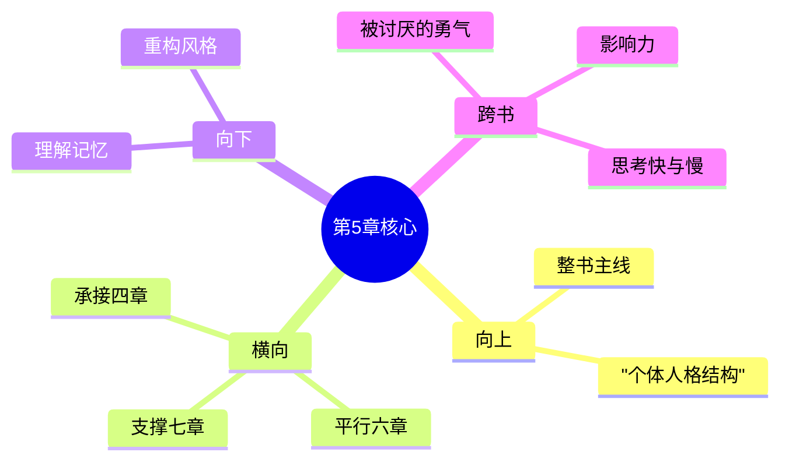

# 第5章 早期的记忆

## 📍 章节定位

### 全书位置
> 第5章是全书个体心理学理论的重要组成部分，阐释早期记忆在个体生活风格形成中的关键作用，承接前章对追求目标的探讨（追求优越），为理解个体心理基础提供关键机制，并为下章梦境解析做铺垫

- **全书核心问题**: 自卑感如何转化为成长的动力？个体如何通过克服自卑获得超越？生命的意义究竟何在？
- **本章回答的问题**: 早期记忆如何反映个体的生活目标？为什么个体只能记住符合其生活风格的经验？如何通过早期记忆来理解并改变个体的生活方式？
- **角色类型**: 机制探索型，阐述记忆的选择性和目的性
- **论证位置**: 说明个体生活风格形成机制的重要环节

### 章节序列
| 方向 | 章节标题 | 逻辑连接 |
|------|----------|----------|
| 前章 | [[第4章-追求优越]] | 从目标追求追溯到记忆基础 |
| 后章 | [[第6章-梦]] | 延伸记忆对潜意识影响的理解 |

### 一句话定位
> 第5章揭示早期记忆不在于保存真实事实，而在于反映个体独特的诠释方式和生活风格，它是个体心理学家探究个体内在逻辑系统的宝贵线索。

---

## 🎯 核心观点

### 第一层：表层案例
> 章节中的具体案例、故事、数据

| 案例名称 | 简要描述 | 页码 | 关键引文 |
|----------|----------|------|----------|
| 被忽视女孩的记忆 | 被溺爱后受到冷落的女孩回忆起被人漠视的场景 | p.100-103 | "她选择记住被忽视的瞬间" |
| 愤怒男孩的记忆 | 多动挑衅的男孩记住打架的场面 | p.110-112 | "攻击性的记忆强化了他的行为模式" |
| 自信女孩的记忆 | 成绩优异的女孩选择性记住表扬和成就 | p.113-115 | "积极记忆支持她的自信风格" |

### 第二层：中层机制
> 案例背后的运行机制、方法论

| 机制名称 | 组成要素 | 因果链条 | 证据来源 |
|----------|----------|----------|----------|
| 选择性记忆机制 | 生活风格 + 解释倾向 + 记忆筛选 | 核心信念 → 选择性注意 → 储存过滤 → 特定回忆 | 临床观察 |
| 验证循环机制 | 生活风格 + 特定记忆 + 行为强化 | 生活风格 → 选择记忆 → 行为模式 → 强化风格 | 成长历程分析 |
| 目的性重构机制 | 生活目标 + 记忆选取 + 意义重构 | 未来目标 → 过去选择 → 意义赋予 → 行为指导 | 认知重建实验 |

### 第三层：底层规律
> 可迁移的普遍规律

| 规律陈述 | 抽象层级 | 知识连接 | 适用范围 |
|----------|----------|----------|----------|
| 主观建构记忆定律 | 认知心理学 + 个体心理学 | 建构主义理论 | 认知疗法、心理咨询 |
| 解释决定现实定理 | 现象学哲学 + 认知心理学 | 韦伯定理、戈夫曼拟剧理论 | 教育评估、社会研究 |
| 循环强化原理 | 系统论 + 社会学 | 反馈理论、自我实现预言 | 管理实践、教育干预 |

---

## 💬 降维翻译

### 观点1: 早期记忆是生活风格的产物而非成因

#### 原文表达
> "我们不是因为记住了某些事情才变成今天的模样，而是因为现在的我们选择保存那些与当前人格一致的过去经验。" —— p.102

#### 降维翻译（中学生能懂）
我们记住的事情不是随机的，而是因为现在我们的想法跟那时候的经历相似，才会把那样的经历记得很清楚。我们不是被记忆决定了性格，而是用现在的性格去挑选过去值得记忆的事情。

#### 日常类比（奶奶能懂）
就像一个人脾气不好的话，他会特别留意别人对他发脾气的事情，记住那些被人骂的场面；但好脾气的人就容易记住别人对他好、被人夸奖的事。不是那些事决定了他们的性格，而是性格让他们选择了记住这些事。

### 观点2: 每个人的记忆都在验证自我期待

#### 原文表达
> "记忆是生活风格的储存库，人们不断地从中选取符合他们对世界假设的内容，以维持既有信念体系的稳固性。" —— p.106

#### 降维翻译（中学生能懂）
我们头脑里的记忆都符合我们对自己的想法：如果你认为自己不行，你就会一直记住失败的经历；如果你觉得自己很棒，你就会反复想起那些成功的片段。

#### 日常类比（奶奶能懂）
就像有位老人觉得大家都对他不好，他就能举出好多例子证明；如果你告诉他有人对他好，他会说:"那不算啥"不记在心上。他的记忆就像筛子，专门留下面印证"别人对他不好"的证据。

### 观点3: 改变记忆诠释可重塑生活风格

#### 原文表达
> "如果我们能帮助个体重新诠释过去，他们就能够改变其对未来的期望及行为倾向。记忆重构就是人格重组的第一步。" —— p.120

#### 降维翻译（中学生能懂）
如果我们帮一个人换种方式看待自己以前的经历，他们就能改变对以后的打算和做法。重新看待过去的经历是改变性格的第一步。

#### 日常类比（奶奶能懂）
像有个小孩小时候被狗咬过，他就记着狗是吓人的东西，见到狗就躲。但如果大人告诉他："那天狗是生病了才咬人的，平常的狗都挺友善的"，换个看待往事的角度，小孩就不那么怕狗了。不是忘了被咬的事，而是对这事有了新理解。

#### 检验
- Q: 如果一个中学生问你早期记忆有什么特殊之处？
- A: 早期记忆不完全是真实的经历，而是符合我们现在怎么看待世界和自己的经验。我们选记那些支持我们想法的事情，然后这些记忆再证明我们想法是对的。

---

## ✨ 金句库

### 原书金句
| 金句 | 页码 | 适用场景 |
|------|------|----------|
| "记忆是生活风格的储存库。" | p.106 | 认知心理分析 |
| "我们记住的不是经历了什么，而是如何诠释它。" | p.108 | 心理治疗指导 |
| "记忆服务于个体的生活风格。" | p.104 | 人格形成阐述 |
| "每个人都建构了一个符合其目标的记忆世界。" | p.112 | 目标论论述 |
| "改变记忆诠释就是改变了生活方向。" | p.120 | 行为改变案例 |

### 降维金句
| 金句 | 来源观点 | 适用场景 |
|------|----------|----------|
| 记忆不决定性格，性格选择记忆 | 观点1 | 自认知改变 |
| 我们只记住符合期待的事 | 观点2 | 行为模式解析 |
| 重构过去，才能改写未来 | 观点3 | 心理调适 |
| 不是过去困住你，是你对过去的理解 | 观点3 | 自我突破 |
| 记忆是自我验证的证据包 | 观点2 | 认知偏见 |

## 🔗 当下映射

### 💰 财富应用
| 场景 | 具体行动 | 预期效果 | 风险提示 |
|------|----------|----------|----------|
| 投资心理 | 重新审视失败投资经历，避免过度谨慎/鲁莽 | 合理风险评估 | 避免忽视真实风险 |
| 职业发展 | 改变对早期职场挫折的记忆诠释 | 提升未来发展信心 | 不要完全忽略过去的经验教训 |

### 💼 职场应用
| 场景 | 具体行动 | 所需能力 | 适用职级 |
|------|----------|----------|----------|
| 工作自信 | 重构工作中受挫的记忆，聚焦成长价值 | 自我反思、认知重构能力 | 所有职级 |
| 领导风格 | 分析早期经历如何形塑领导哲学 | 自我觉察、发展整合能力 | 管理层级 |

### 🏠 生活应用
| 场景 | 具体行动 | 可行性 | 见效时间 |
|------|----------|--------|----------|
| 人际关系 | 重新诠释童年关系经历，改善人际模式 | 高 | 2-3个月 |
| 人格发展 | 有意识地记忆积极经历 | 高 | 1个月以内 |

### 72小时行动计划
1. **明天**：回顾一段痛苦的童年经历，尝试从"成长机遇"的角度重新诠释
2. **本周内**：记录一天中回想的3个记忆片断，分析它们是否反映了当前心态
3. **需要准备资源**：寻求一位信任的亲友给予外部视野反馈

---

## 🕸️ 章节关联

### 向上关联 → 整书
- **贡献**: 为全书关于个体生活风格的形成与发展过程提供了深层解释机制
- **位置**: 说明个体人格结构形成机制的关键环节，连接早期体验与生活目标

### 横向关联 → 章节间
| 章节编号 | 章节标题 | 关联类型 | 连接描述 |
|----------|----------|----------|----------|
| 第4章 | [[第4章-追求优越]] | 承接 | 解释记忆如何支持个体的优越目标设定 |
| 第6章 | [[第6章-梦]] | 平行 | 同属潜意识表达方式的研究 |
| 第1章 | [[第1章-生活的意义]] | 阐补 | 记忆如何巩固特定的生活意义认知 |
| 第7章 | [[第7章-社会兴趣]] | 支撑 | 早期记忆决定社会兴趣是否发展 |

### 向下关联 → 具体应用
| 应用场景 | 难度 | 前置知识 |
|----------|------|----------|
| 记忆重构训练 | 高 | 元认知和心理治疗技能 |
| 生活风格评估 | 中 | 具备基本访谈能力 |
| 人格发展辅导 | 高 | 心理咨询专业知识 |

### 跨书关联 → 知识网络
| 书籍 | 概念 | 关系 | 备注 |
|------|------|------|------|
| [[被讨厌的勇气-岸见一郎-拆解记录]] | 目的论 | 支持 | 过去经历服务于当下的心理目的 |
| [[影响力-西奥迪尼-拆解记录]] | 一致性原则 | 支持 | 个体选择性记忆维持认知一致性 |
| [[思考快与慢-拆解记录]] | 锚定效应 | 相似 | 记忆中的初始印象持续影响判断 |

### 关联可视化

---

## ❓ 问答设计

### Q1: (记忆型) 阿德勒认为早期记忆是什么的产物？
**认知层次**: 记忆
**难度**: 低
**答案要点**:
- 早期记忆是生活风格的产物
- 不是生活风格的成因
- 选择性保存符合当下人格的记忆

### Q2: (理解型) 为什么每个人只能记住符合其生活风格的经验？
**认知层次**: 理解
**难度**: 中
**答案要点**:
- 选择性注意机制发挥作用
- 大脑倾向于保留支持既有信念的信息
- 为维持稳定的自我概念服务

### Q3: (应用型) 如何运用记忆重构来改变消极的生活风格？
**认知层次**: 应用
**难度**: 中
**答案要点**:
- 识别记忆中的负面偏见
- 重新诠释早期经历
- 建立积极的新认知框架

### Q4: (分析型) 早期记忆如何影响个体的追求目标设定？
**认知层次**: 分析
**难度**: 中
**答案要点**:
- 记忆验证特定的世界观
- 塑造行为习惯
- 影响目标选择的倾向性

### Q5: (创造型) 设计一种利用早期记忆重构促进人格发展的方法？
**认知层次**: 创造
**难度**: 高
**答案要点**:
- 记忆采集技术
- 认知重构方法
- 效果监测机制

### Q6: (理解型) 记忆是否能客观记录事件经历？
**认知层次**: 理解
**难度**: 中
**答案要点**:
- 记忆不全是客观记录
- 个体解释成分很大
- 记忆服务于现有生活方式

### Q7: (应用型) 在儿童教育中如何关注其早期记忆的形成？
**认知层次**: 应用
**难度**: 中
**答案要点**:
- 营造积极正面的环境
- 引导孩子建立积极诠释
- 注重早期积极经历的积累

### Q8: (分析型) 记忆如何参与个体生活方式的巩固？
**认知层次**: 分析
**难度**: 中
**答案要点**:
- 记忆支持既有的认知框架
- 通过重复验证形成稳定模式
- 强化既有的行为反应方式

### Q9: (应用型) 如何通过分析记忆帮助个体制定生活改变计划？
**认知层次**: 应用
**难度**: 中
**答案要点**:
- 识别记忆中的固定模式
- 分析其与现实的偏离
- 制定新的经历体验计划

### Q10: (创造型) 如何将记忆分析运用到教育干预中？
**认知层次**: 创造
**难度**: 高
**答案要点**:
- 记忆访谈技术
- 指向性引导方法
- 持续行为跟踪与调整

### Q11: (分析型) 不同童年经历如何形成不同类型的记忆？
**认知层次**: 分析
**难度**: 中
**答案要点**:
- 安全依恋儿童倾向于积极记忆
- 受创伤儿童可能出现创伤印记
- 环境塑造记忆选择偏好

### Q12: (理解型) 同一事件为何能被不同个体记住不同的方面？
**认知层次**: 理解
**难度**: 中
**答案要点**:
- 个体生活风格不同
- 注意焦点各异
- 对事件的评估标准不一

### Q13: (应用型) 在心理咨询中如何运用记忆分析？
**认知层次**: 应用
**难度**: 中
**答案要点**:
- 深入采集早期记忆
- 解释其与当前问题的关联
- 制定针对性改变策略

### Q14: (分析型) 记忆重构面临的挑战主要包括哪些？
**认知层次**: 分析
**难度**: 中
**答案要点**:
- 情绪阻力
- 认知惯性
- 社会支持缺乏
- 环境制约

### Q15: (创造型) 如何设计一套系统性的记忆重构干预方案？
**认知层次**: 创造
**难度**: 高
**答案要点**:
- 评估阶段：识别记忆特点
- 干预过程：逐步重构认知
- 巩固期：建立新积极模式

---
