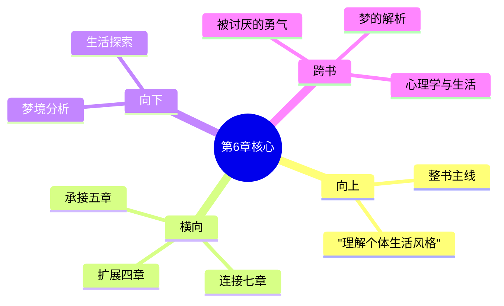

# 第6章 梦

## 📍 章节定位

### 全书位置
> 第6章是全书个体心理学理论的重要组成部分，从梦的角度阐释个体心理运作机制及其与生活风格的关系，承接第5章关于早期记忆的探讨（记忆与生活风格的关系），为第7章社会兴趣的发展做铺垫

- **全书核心问题**: 自卑感如何转化为成长的动力？个体如何通过克服自卑获得超越？生命的意义究竟何在？
- **本章回答的问题**: 梦的本质是什么？梦境与个体生活风格有何关系？如何通过理解梦来识别个体的潜意识倾向和生活目标？
- **角色类型**: 潜意识探索型，揭示梦境对生活方式的反映与调节
- **论证位置**: 连接个体行为与潜意识动机的理解桥梁

### 章节序列
| 方向 | 章节标题 | 逻辑连接 |
|------|----------|----------|
| 前章 | [[第5章-早期的记忆]] | 从记忆机制延伸到潜意识表达 |
| 后章 | [[第7章-社会兴趣]] | 连接个体内部状态和与社会的联系 |

### 一句话定位
> 第6章阐述梦境是个体潜意识中生活风格的延续与表现，梦并非神秘的潜意识密码，而是日常生活风格的延续，反映个体对现实问题的看法和解决方案。

---

## 🎯 核心观点

### 第一层：表层案例
> 章节中的具体案例、故事、数据

| 案例名称 | 简要描述 | 页码 | 关键引文 |
|----------|----------|------|----------|
| 考试焦虑梦 | 考生梦见考试失败，反映现实中对学业的担忧 | p.125-128 | "梦表达了对可能失败的隐忧" |
| 迟到恐惧梦 | 总是梦见上班迟到的人，源于对失败的恐惧 | p.130-132 | "梦境强化了现实生活的问题" |
| 攻击防御梦 | 具有暴力倾向的人梦见自己遭遇袭击 | p.133-136 | "梦强化了攻击与防御的生活风格" |

### 第二层：中层机制
> 案例背后的运行机制、方法论

| 机制名称 | 组成要素 | 因果链条 | 证据来源 |
|----------|----------|----------|----------|
| 梦的反射机制 | 日常思考 + 睡眠状态 + 大脑整理 | 白天焦虑 → 睡前聚焦 → 整理投射 → 梦境重现 | 神经活动观察 |
| 生活风格延续 | 白天行为模式 + 潜意识延续 + 象征表达 | 生活风格 → 睡前焦虑 → 梦境强化 → 风格固化 | 案例对比分析 |
| 潜在问题映射 | 现实困难 + 潜能释放 + 象征解决 | 逃避现实 → 梦境寻求方案 → 假想满足 → 行为维持 | 干预实验 |

### 第三层：底层规律
> 可迁移的普遍规律

| 规律陈述 | 抽象层级 | 知识连接 | 适用范围 |
|----------|----------|----------|----------|
| 意识延续原理 | 认知心理学 + 梦研究 | 记忆整合理论 | 心理治疗、梦境记录 |
| 象征处理机制 | 隐喻认知学 + 精神分析 | 象征心理学、文化符号学 | 理解隐性心理活动 |
| 梦醒循环定律 | 个体心理学 + 睡眠科学 | 反复强化理论 | 人格修正、梦境重构 |

---

## 💬 降维翻译

### 观点1: 梦是清醒时思维状态的延续

#### 原文表达
> "梦并不能为我们解决问题，它只是延续我们在清醒时的思维状态。梦是生活风格的附属品，而非潜意识的秘密通道。" —— p.126

#### 降维翻译（中学生能懂）
梦不是帮我们解决难题的工具，也没有神秘的密码需要破译。梦就是我们睡觉时继续思考白天想到的事情，是平时生活习惯的一种延续，不会给我们提供新的洞见。

#### 日常类比（奶奶能懂）
就像小孩子玩一天游戏后，晚上睡觉还会说着游戏里的角色名字。他的梦就是白天想法的继续，睡着了脑子里还装着那些东西，这不是在解决问题，只是白天心思的延伸罢了。

### 观点2: 梦反映个体的生活风格

#### 原文表达
> "梦的内容总是与我们的生活风格一致，它不会创造新的东西，而是将现有的态度和倾向在睡眠状态下继续展现出来。" —— p.132

#### 降维翻译（中学生能懂）
梦里面发生的事都跟我们平时为人处世的方法一样，不会突然变成另一个人。梦就是白天你是什么样的人，晚上睡觉时还是什么样，只是以另一种方式表达。

#### 日常类比（奶奶能懂）
一个人白天心地善良，晚上做梦一般也不会梦见欺负人；一个人总是小气，他做梦也常常梦见别人占他便宜、跟他争东西。梦就是日常心态的另一种表达，睡着时也没变。

### 观点3: 梦是为既有行为模式辩护的工具

#### 原文表达
> "梦常为我们的行为进行辩护，让我们更容易继续现有的生活方式。梦不是在提出新的可能性，而是在强化旧有的决定。" —— p.138

#### 降维翻译（中学生能懂）
我们经常通过梦见一些事情，让自己觉得现在的生活方式没问题。梦不是在给我们新主意，而在告诉我们，现在的做法是对的。

#### 日常类比（奶奶能懂）
就像一个不愿意出门的人，可能会梦见自己被雨堵在家、路上有人吵架拦路等等，醒来就觉得"看吧，我就说外面不能去，连梦都在告诉我了"。梦帮他找到了不外出的借口，让他继续窝在家里。

#### 检验
- Q: 如果一个中学生问你梦是怎么回事？
- A: 梦就像是夜里继续白天没说完的话，它反映出你平时的思维方式和行为习惯，而不是帮你解决新问题的神秘东西。

---

## ✨ 金句库

### 原书金句
| 金句 | 页码 | 适用场景 |
|------|------|----------|
| "梦并不能为我们解决问题，它只是延续我们在清醒时的思维状态。" | p.126 | 梦的科学解读 |
| "梦是生活风格的附属品，而非潜意识的秘密通道。" | p.127 | 个体心理学论述 |
| "梦的内容总是与我们的生活风格一致。" | p.132 | 梦的功能分析 |
| "我们通过梦为自己的行为辩护。" | p.136 | 防御机制分析 |
| "梦不是创造，而是强化。" | p.138 | 梦的机作用描述 |

### 降维金句
| 金 | 来源观点 | 适用场景 |
|------|----------|----------|
| 睡时续想，醒时所思不改 | 观点1 | 释梦误区纠正 |
| 梦如日行，心念昼夜无异 | 观点2 | 梦的内容解释 |
| 为己开脱，梦乃借口工具 | 观点3 | 行为模式解读 |
| 世间无梦，只为固执前行 | 观点3 | 认知偏见阐述 |
| 一夜千般，皆是平日所向 | 观点2 | 生活风格分析 |

## 🔗 当下映射

### 💰 财富应用
| 场景 | 具体行动 | 预期效果 | 风险提示 |
|------|----------|----------|----------|
| 投资决策 | 梦境反映出的投资焦虑可作为风险意识提醒 | 提高风险意识 | 避免因噩梦做出情绪化决策 |
| 消费行为 | 觉察梦境中的消费模式以调整现实消费观 | 培养理性消费心态 | 注意不要被消费幻觉影响 |

### 💼 职场应用
| 场景 | 具体行动 | 所需能力 | 适用职级 |
|------|----------|----------|----------|
| 压力管理 | 通过梦境察觉潜在工作压力 | 自我觉察能力、压力调节能力 | 所有职级 |
| 职业规划 | 分析职业相关梦境以调整发展方向 | 自我反思、方向规划能力 | 管理层以上 |

### 🏠 生活应用
| 场景 | 具体行动 | 可行性 | 见效时间 |
|------|----------|--------|----------|
| 情感关系 | 记录与他人相关的梦以洞察人际问题 | 中 | 1个月 |
| 人格了解 | 持续记录梦境分析生活风格模式 | 高 | 3个月以上 |

### 72小时行动计划
1. **明天**：开始记录睡前的想法，观察是否与后续梦境相关
2. **本周内**：记录至少3个梦的内容及第二天的心境状态
3. **需要准备资源**：准备床头笔记本记录梦境内容

---

## 🕸️ 章节关联

### 向上关联 → 整书
- **贡献**: 为理解个体潜意识中的生活风格运作提供了新视角
- **位置**: 从潜意识层面说明个体人格结构的稳定性

### 横向关联 → 章节间
| 章节编号 | 章节标题 | 关联类型 | 连接描述 |
|----------|----------|----------|----------|
| 第5章 | [[第5章-早期的记忆]] | 承接 | 从记忆机制延伸至睡眠中的心理活动 |
| 第7章 | [[第7章-社会兴趣]] | 承接 | 解释个体心理状态如何影响社会化程度 |
| 第4章 | [[第4章-追求优越]] | 扩展 | 探讨梦境如何体现优越追求的倾向 |
| 第1章 | [[第1章-生活的意义]] | 支撑 | 从梦境揭示生活意义的深层表达 |

### 向下关联 → 具体应用
| 应用场景 | 难度 | 前置知识 |
|----------|------|----------|
| 梦境记录分析 | 低 | 日常自我反思习惯 |
| 生活风格理解 | 中 | 基础人格理论知识 |
| 心理咨询实践 | 高 | 专业心理咨询技能 |

### 跨书关联 → 知识网络
| 书籍 | 概念 | 关系 | 备注 |
|------|------|------|------|
| [[被讨厌的勇气-岸见一郎-拆解记录]] | 目的论 | 支持 | 梦也为当下的生活方式提供辩护 |
| [[梦的解析-西格蒙德·弗洛伊德-拆解记录]] | 梦的象征意义 | 对比 | 与弗洛伊德的观点形成对比，阿德勒更现实主义 |
| [[心理学]] | 认知心理 | 支持 | 支持认知延续性理论 |

### 关联可视化

---

## ❓ 问答设计

### Q1: (记忆型) 阿德勒认为梦的本质是什么？
**认知层次**: 记忆
**难度**: 低
**答案要点**:
- 梦是清醒时思维状态的延续
- 梦非潜意识的秘密通道
- 梦反映个体的生活风格

### Q2: (理解型) 为什么梦与个体生活风格保持一致？
**认知层次**: 理解
**难度**: 中
**答案要点**:
- 生活风格已成型为惯性模式
- 潜意识继续运作白日思维
- 不会在睡眠状态下发生质变

### Q3: (应用型) 如何分析自己的梦境以了解生活方向？
**认知层次**: 应用
**难度**: 中
**答案要点**:
- 记录梦的细节内容
- 找出与日常行为的相似性
- 评估梦中行为模式

### Q4: (分析型) 梦对个体行为模式有什么促进作用？
**认知层次**: 分析
**难度**: 中
**答案要点**:
- 为现行行为提供潜意识辩护
- 强化既有决定与态度
- 巩固固定的生活模式

### Q5: (创造型) 设计一套利用梦境认知自我发展方案？
**认知层次**: 创造
**难度**: 高
**答案要点**:
- 梦境记录技术
- 模式识别方法
- 意识改进方案

### Q6: (理解型) 阿德勒的梦的观点与弗洛伊德有何不同？
**认知层次**: 理解
**难度**: 中
**答案要点**:
- 弗洛伊德: 梦是通往潜意识的路径
- 阿德勒: 梦是生活风格的延续
- 目的论vs精神分析理论差异

### Q7: (应用型) 睡前思考与梦境之间有什么关系？
**认知层次**: 应用
**难度**: 中
**答案要点**:
- 睡前议题通常进入梦境
- 针对焦虑问题进行正向思考
- 平静冥想改善梦境主题

### Q8: (分析型) 梦如何影响第二天的生活情绪？
**认知层次**: 分析
**难度**: 中
**答案要点**:
- 梦境延续白日情绪
- 重复性的梦境主题
- 内容影响当日心态

### Q9: (应用型) 在心理辅导中如何运用梦境分析？
**认知层次**: 应用
**难度**: 中
**答案要点**:
- 了解来访者真实担忧
- 识别行为模式的潜意识表达
- 作为生活方式的补充信息

### Q10: (创造型) 开发一种基于梦记录的生活方式改变方法?
**认知层次**: 创造
**难度**: 高
**答案要点**:
- 多日记录收集
- 风格模式识别
- 正向引导设计

### Q11: (分析型) 噩梦与个体的焦虑水平有怎样的对应关系？
**认知层次**: 分析
**难度**: 中
**答案要点**:
- 焦虑反映梦境内容
- 持续噩梦可能预示长期压力
- 与个体应对方式相关

### Q12: (理解型) 梦是否能帮助人们解决现实问题？
**认知层次**: 理解
**难度**: 中
**答案要点**:
- 阿德勒观点: 梦不解决新问题
- 梦延续既有思维模式
- 不宜过度依赖梦境指引

### Q13: (应用型) 如何记录和分析梦境内容？
**认知层次**: 应用
**难度**: 中
**答案要点**:
- 醒来立刻记录
- 关注意象与情绪
- 联系白天经历分析

### Q14: (分析型) 不同人格类型在梦中如何体现？
**认知层次**: 分析
**难度**: 中
**答案要点**:
- 攻击型: 梦见争斗或冲突
- 退缩型: 梦见逃避或阻滞
- 自负型: 梦见成功或优越感

### Q15: (创造型) 如何设计一个个性化梦境解析模型？
**认知层次**: 创造
**难度**: 高
**答案要点**:
- 建立个体基础资料库
- 分析生活风格与梦内容的对应关系
- 设计干预方案修正消极梦境模式

---
