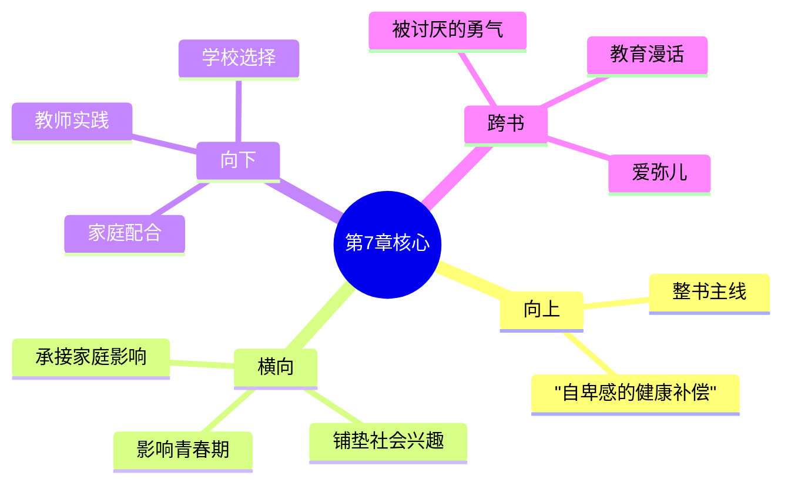

# 第7章 学校的影响

## 📍 章节定位

### 全书位置
> 第7章聚焦学校作为儿童社会化的关键场所，探讨教育如何影响人格发展、自卑感的形成与补偿，以及教师在这一过程中的核心角色，是连接家庭影响与社会适应的重要桥梁

- **全书核心问题**: 自卑感如何转化为成长的动力？个体如何通过克服自卑获得超越？生命的意义究竟何在？
- **本章回答的问题**: 学校如何成为儿童社会兴趣的培养基地？教师如何帮助学生克服自卑感？什么样的教育方式能促进健康人格形成？
- **角色类型**: 实践应用型，将个体心理学理论延伸至教育领域
- **论证位置**: 家庭教育向社会适应过渡的关键环节

### 章节序列
| 方向 | 章节标题 | 逻辑连接 |
|------|----------|----------|
| 前章 | [[第6章-家庭的影响]] | 家庭奠定基础，学校延续培养 |
| 后章 | [[第7章-社会兴趣]] | 学校培养的社会兴趣在此深化 |

### 一句话定位
> 第7章阐述学校是儿童社会化的重要场所，教师的职责不仅是传授知识，更是帮助学生克服自卑、培养合作精神、发展社会兴趣，正确的教育应该让每个孩子找到自己的价值。

---

## 🎯 核心观点

### 第一层：表层案例
> 章节中的具体案例、故事、数据

| 案例名称 | 简要描述 | 关键引文 |
|----------|----------|----------|
| 成绩落后学生的自卑 | 学习困难的孩子产生自卑感，可能放弃努力或转向消极补偿 | "当孩子无法胜任学业时，自卑感开始生根" |
| 课堂竞争的负面影响 | 过度强调竞争让学生陷入恶性比较 | "排名制度让多数孩子成为'失败者'" |
| 被忽视的孩子 | 教师关注度不均导致部分学生边缘化 | "被忽视的孩子往往发展出退缩或攻击性" |
| 合作学习的成功案例 | 小组合作让不同能力的孩子各展所长 | "合作让每个孩子都能贡献价值" |

### 第二层：中层机制
> 案例背后的运行机制、方法论

| 机制名称 | 组成要素 | 因果链条 |
|----------|----------|----------|
| 学校自卑形成机制 | 学业压力 + 横向比较 + 权威评价 | 高期待→反复失败→自卑感→逃避/补偿 |
| 教师影响力机制 | 师生信任 + 权威认同 + 行为示范 | 信任建立→权威内化→自我调整→行为改变 |
| 社会兴趣培养机制 | 合作活动 + 贡献机会 + 集体归属 | 合作体验→贡献感→归属感→社会兴趣 |
| 积极补偿引导机制 | 发现优势 + 个性化指导 + 成功体验 | 优势识别→定向培养→成就感→健康自信 |

### 第三层：底层规律
> 可迁移的普遍规律

| 规律陈述 | 抽象层级 | 知识连接 |
|----------|----------|----------|
| 教育的本质是人格塑造 | 教育哲学 | 杜威"教育即生长" |
| 合作优于竞争 | 社会心理学 | 社会互赖理论 |
| 每个孩子都有独特价值 | 人本主义心理学 | 罗杰斯无条件积极关注 |
| 自信来自贡献而非比较 | 积极心理学 | 自我决定理论 |

---

## 💬 降维翻译

### 观点1: 学校是家庭之外社会兴趣培养的第一站

#### 原文表达
> "学校是儿童第一次大规模与家庭以外的人合作的地方。在这里，他必须学会与陌生的老师和同学相处，这对他日后融入社会有着决定性的影响。"

#### 降维翻译（中学生能懂）
学校是你第一次离开爸爸妈妈，和那么多不认识的人一起学习和生活的地方。这里决定了你能不能学会和别人合作，会不会关心别人。将来你走向社会，能不能融入集体，很大程度上就看学校这段经历。

#### 日常类比（奶奶能懂）
就像小鸟要学会飞，得先在枝头练习。学校就是孩子们练习做"社会人"的地方。在家里，爸爸妈妈都让着你；在学校，你得学会和别人轮流、分享、合作。这些本事学会了，以后到哪儿都能和人好好相处。

### 观点2: 教师的责任远不止传授知识

#### 原文表达
> "教师的工作不仅是教授书本知识，更重要的是了解儿童的心理状态，发现他们的自卑感，并帮助他们建立自信和合作精神。只关注成绩而忽视心理健康的教育，是失败的。"

#### 降维翻译（中学生能懂）
老师不光是教你语文数学这些课本知识的，更重要的是要关心你心里怎么想，看你是不是觉得自卑，帮你学会关心别人、和人合作。如果老师只看分数，不管你成长得怎么样，那这样的教育就白搭。

#### 日常类比（奶奶能懂）
就像种庄稼不能只看收成，还要看庄稼长得壮不壮、根扎得深不深。教孩子也一样，不能只看考试多少分，要看孩子会不会和人相处，遇事是愿意帮忙还是推给别人。这才是真关心孩子成长。

### 观点3: 正确的教育让每个孩子找到自己的价值

#### 原文表达
> "好的教育不是让所有孩子都成为第一名，而是让每个孩子都能发现自己的长处，感到自己对集体有贡献。竞争性的教育只会制造少数赢家和大量失败者。"

#### 降维翻译（中学生能懂）
真正好的学校不是只培养考第一名的学生，而是让每个学生都能找到自己擅长的事情，觉得自己对班级有贡献。如果学校只鼓励竞争，那除了第一名，其他人都觉得自己是失败者，这不对。

#### 日常类比（奶奶能懂）
就像一锅饭，有人负责淘米，有人负责烧火，有人负责端碗，每个人都有用。学校也一样，有人学习好，有人体育好，有人会帮助人。好的老师要让每个孩子都觉得"我有用"，而不是让大家都去争那个"第一名"。

#### 检验
- Q: 如果一个中学生问你学校对成长有什么重要？
- A: 学校是你第一次和家庭外的很多人在一起的地方，决定了你是否能学会和别人合作、是否关心他人。老师怎么教你，不光影响你的成绩，更影响你的性格和自信心。

---

## ✨ 金句库

### 原书金句
| 金句 | 适用场景 |
|------|----------|
| "学校是儿童第一次大规模与家庭以外同伴合作的地方。" | 教育重要性论述 |
| "教师的职责不仅是教授学业，更是培养学生的社会兴趣和合作能力。" | 教师职责定义 |
| "只关注成绩而不关心学生心理成长的教育毫无价值。" | 教育价值观批判 |
| "好的教育不是制造竞争者，而是培养合作者。" | 教育目标反思 |
| "每个孩子都应该在学校找到自己的价值。" | 教育公平理念 |

### 降维金句
| 金句 | 来源观点 |
|------|----------|
| 学的不只是书本，还有如何和人相处 | 观点1 |
| 老师不只是教书，更是在雕刻灵魂 | 观点2 |
| 教育育心大于育分 | 观点2 |
| 每个孩子都有发光的位置 | 观点3 |
| 竞争制造输家，合作创造价值 | 观点3 |

## 🔗 当下映射

### 💰 财富应用
| 场景 | 具体行动 | 预期效果 |
|------|----------|----------|
| 子女教育投资 | 平衡学业成绩与品格培养 | 培养全面发展的人才 |
| 教育创业 | 设计合作导向的学习模式 | 建立差异化竞争优势 |

### 💼 职场应用
| 场景 | 具体行动 | 所需能力 |
|------|----------|----------|
| 团队管理 | 应用合作学习理念促进团队融合 | 领导力、沟通能力 |
| 新人培养 | 关注新人心理适应，帮助建立归属感 | 同理心、辅导能力 |
| 培训设计 | 设计让每个人都有贡献机会的培训 | 课程设计、组织能力 |

### 🏠 生活应用
| 场景 | 具体行动 | 可行性 |
|------|----------|--------|
| 家庭教育 | 将合作理念延伸到家庭互动 | 高 |
| 选择学校 | 考察学校是否重视品格培养 | 中 |
| 志愿服务 | 参与学校或社区的教育活动 | 高 |

### 72小时行动计划
1. **明天**：回忆自己学生时代，哪些老师的做法对你产生了积极影响
2. **本周内**：观察身边的教育场景（可以是孩子的学校、培训课程），评估是否符合合作理念
3. **需要准备资源**：了解一所学校的教育理念，或阅读一篇关于现代教育改革的文章

---

## 🕸️ 章节关联

### 向上关联 → 整书
- **贡献**: 为全书的自卑感理论和生命意义探讨提供教育场景的具体应用
- **位置**: 家庭影响向社会适应过渡的关键环节

### 横向关联 → 章节间
| 章节编号 | 章节标题 | 关联类型 | 连接描述 |
|----------|----------|----------|----------|
| 第6章 | [[第6章-家庭的影响]] | 延续发展 | 家庭奠定的社会兴趣在学校中得到培养 |
| 第8章 | [[第7章-社会兴趣]] | 基础铺垫 | 学校培养的合作能力是社会兴趣的体现 |
| 第5章 | [[第5章-早期的记忆]] | 相互影响 | 学校经历可能成为重要的早期记忆 |
| 第9章 | [[第9章-青春期]] | 前置因素 | 学校经历影响青春期的适应状况 |

### 向下关联 → 具体应用
| 应用场景 | 难度 | 前置知识 |
|----------|------|----------|
| 教育方法改进 | 高 | 心理学和教育学基础 |
| 家庭教育配合 | 中 | 基础儿童心理理解 |
| 学校选择决策 | 低 | 教育理念认知 |

### 跨书关联 → 知识网络
| 书籍 | 概念 | 关系 |
|------|------|------|
| [[被讨厌的勇气-岸见一郎-拆解记录]] | 共同体感觉 | 学校是培养共同体感觉的场所 |
| [[教育漫话-洛克]] | 绅士教育 | 对比：洛克强调习惯，阿德勒强调合作 |
| [[爱弥儿-卢梭]] | 自然教育 | 对比：卢梭主张自然发展，阿德勒强调社会合作 |

### 关联可视化

---

## ❓ 问答设计

### Q1: (记忆型) 阿德勒认为学校对儿童发展的核心作用是什么？
**认知层次**: 记忆
**难度**: 低
**答案要点**:
- 培养社会兴趣和合作能力
- 是家庭外第一次大规模社会接触
- 影响日后社会适应

### Q2: (理解型) 为什么说只关注成绩的教育是失败的？
**认知层次**: 理解
**难度**: 中
**答案要点**:
- 教育目的是培养完整的人
- 心理健康是学习的基础
- 成绩不能代表人的全部价值

### Q3: (应用型) 如果你是老师，如何帮助一个自卑的学生？
**认知层次**: 应用
**难度**: 中
**答案要点**:
- 发现他的优势并给予机会展示
- 创造让他为集体贡献的机会
- 避免公开比较，多用鼓励

### Q4: (分析型) 竞争性教育和合作性教育各有什么优缺点？
**认知层次**: 分析
**难度**: 中
**答案要点**:
- 竞争教育：激励少数，打击多数
- 合作教育：人人有机会，但需精心设计
- 长远效果不同

### Q5: (创造型) 设计一个以"让每个孩子都有价值"为理念的班级活动？
**认知层次**: 创造
**难度**: 高
**答案要点**:
- 设计多角色分工的活动
- 让不同能力的孩子都能贡献
- 强调团队成果而非个人表现

### Q6: (理解型) 阿德勒说的"学校是第二次诞生"是什么意思？
**认知层次**: 理解
**难度**: 中
**答案要点**:
- 进入全新的社会环境
- 需要独立面对人际关系
- 形成新的身份认同

### Q7: (应用型) 家长如何配合学校培养孩子的合作精神？
**认知层次**: 应用
**难度**: 中
**答案要点**:
- 在家里创造合作机会
- 鼓励孩子帮助他人
- 与老师保持沟通一致

### Q8: (分析型) 为什么有些"好学生"长大后会出问题？
**认知层次**: 分析
**难度**: 中
**答案要点**:
- 只发展了学业能力
- 缺乏社会兴趣培养
- 成功建立在比较而非贡献上

### Q9: (应用型) 如何设计一个帮助学习困难学生重建信心的方案？
**认知层次**: 应用
**难度**: 中
**答案要点**:
- 找到他的非学业优势
- 创造贡献机会
- 建立小成功体验

### Q10: (创造型) 如果让你重新设计学校评价体系，会怎么改？
**认知层次**: 创造
**难度**: 高
**答案要点**:
- 增加合作贡献的权重
- 强调个人进步而非排名
- 多维度评价标准

---
