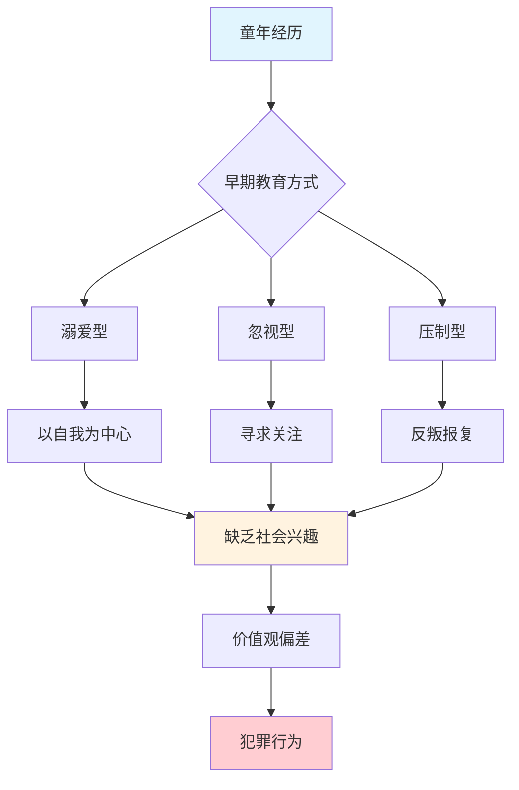
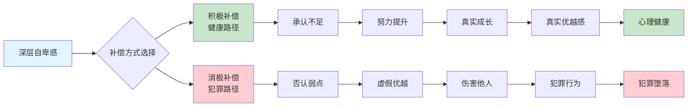
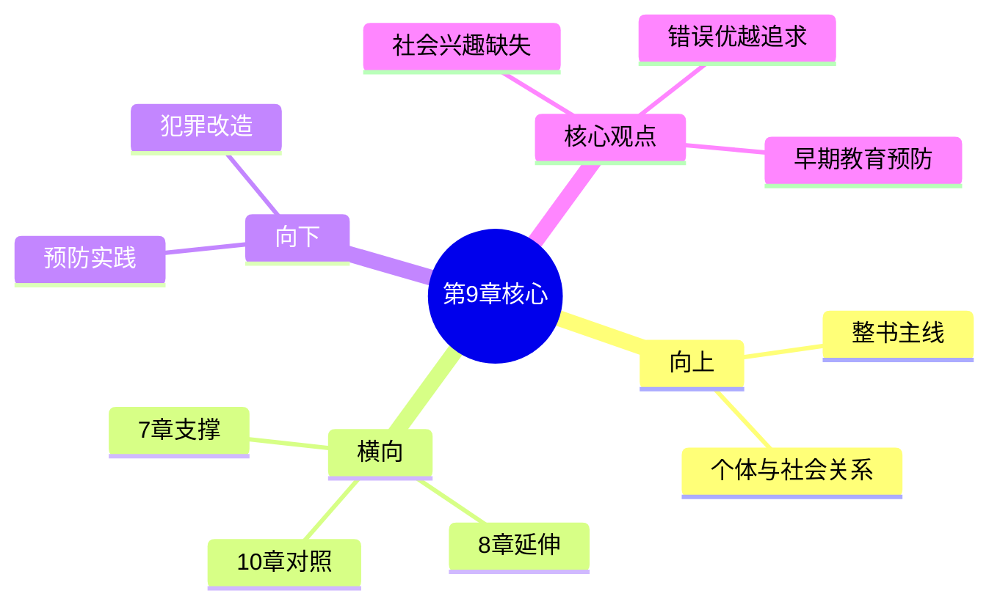

# 第9章 犯罪及其预防

## 📍 章节定位

### 全书位置
> 第9章是全书个体心理学理论在社会问题领域的重要应用章节，从个体心理学独特视角切入犯罪问题的本质与解决路径，展示阿德勒心理学对极端社会问题的解释力。

- **全书核心问题**: 自卑感如何转化为成长的动力？个体如何通过克服自卑获得超越？
- **本章回答的问题**: 犯罪行为的心理根源是什么？为什么有些个体走向犯罪？如何预防？
- **角色类型**: 社会心理应用型章节
- **论证位置**: 本书理论框架的深度应用模块

### 章节序列

| 方向 | 章节标题 | 逻辑连接 |
|------|----------|----------|
| 前章 | [[第8章-学校的影响]] | 从学校教育延伸至社会教育，探讨犯罪预防 |
| 后章 | [[第10章-职业]] | 从犯罪问题反向论证正当职业生活的意义 |

### 一句话定位
> 犯罪的根源不是贫穷或无知，而是社会兴趣的缺失。预防犯罪的关键在于早期培养合作能力与社会关怀。

---

## 🎯 核心观点

### 观点1: 犯罪的根本原因是缺乏社会兴趣

#### 【表层】现象层

**书中案例**：
- 诈骗犯的早年经历：被溺爱的儿童长大后缺乏社会兴趣，最终走上诈骗之路
- 偷盗少年的行为模式：幼时被忽视的孩童通过偷窃寻求关注
- 家庭环境的影响：严厉压制型家庭培养出的叛逆犯罪者

**读者熟悉的场景**：
- 那些只顾自己利益、从不替别人着想的人
- 用伤害他人的方式让自己"占上风"的行为
- 从小被溺爱或被忽视的孩子容易出问题

#### 【中层】机制层

**犯罪心理的形成机制**：

**关键机制**：
- 缺乏早期社会接触 → 无法形成社会兴趣 → 价值观偏差 → 犯罪行为
- 深层自卑 → 寻求虚构优越 → 伤害他人获取满足 → 犯罪行为

#### 【底层】规律层

> **犯罪根源定律**：犯罪不是道德问题，而是心理发展问题。根本原因是个体缺乏社会兴趣，无法与他人建立有意义的连接。

**降维翻译**：
> 罪恶的根源不是贫穷或无知，
> 而是心中没有他人。
>
> 当一个人心里只装着自己，
> 什么坏事都做得出来。

#### 【当下连接】

|----------|----------|----------|
| 为什么有人会犯罪？ | 缺乏社会兴趣，只顾自己 | "原来是心理问题" |
| 贫穷会导致犯罪吗？ | 不是贫穷，是心理发展缺陷 | "颠覆认知" |
| 如何预防犯罪？ | 从小培养社会兴趣和合作能力 | "原来可以预防" |

---

### 观点2: 犯罪是对错误优越感的追求

#### 【表层】现象层

**书中论述**：
- 罪犯的自卑情结非常严重，但不用正当方式克服
- 通过伤害他人来感觉自己比别人强
- 这种追求优越的方式从根本上是错误的

**读者熟悉的场景**：
- 依靠欺负弱者获得"优越感"
- 用不当手段"赢过"别人
- 通过违法途径获得财富地位

#### 【中层】机制层

**错误优越感的心理路径**：

#### 【底层】规律层

> **错误优越定律**：建立在伤害他人基础上的优越感是虚假的、脆弱的。真正的优越来自贡献而非征服。

**降维翻译**：
> 用伤害别人来证明自己强大，
> 恰恰暴露了内心的虚弱。
>
> 真正的强者不需要证明，
> 因为他们忙着成就他人。

#### 【当下连接】

|----------|----------|----------|
| 为什么越"成功"越空虚？ | 追求的是错误优越感 | "原来方向错了" |
| 什么样的成功才是真的？ | 建立在贡献之上的优越 | "值得反思" |

---

### 观点3: 犯罪可以通过早期教育预防

#### 【表层】现象层

**书中观点**：
- 犯罪的根本预防在于儿童早期的教育
- 社会兴趣需要在关键期培养
- 早期教育是最有效的犯罪预防手段

#### 【中层】机制层

**犯罪预防的三个关键期**：

| 关键期 | 教育重点 | 预期效果 |
|--------|----------|----------|
| 幼儿期（0-6岁） | 培养基本社会兴趣 | 建立关心他人的基础 |
| 儿童期（6-12岁） | 发展合作能力 | 学会与他人共处 |
| 青春期（12-18岁） | 价值观引导 | 形成正确的优越目标 |

#### 【底层】规律层

> **早期预防定律**：预防胜于治疗。最好的监狱改革是从胎教开始。早期正向养成本质最有效。

**降维翻译**：
> 种庄稼，基肥最重要。
> 教孩子，越小越关键。
>
> 根基打好了，
> 后面就不怕长歪了。

---

## 💬 金句库

### 原书金句

| 金句 | 页码 | 适用场景 |
|------|------|----------|
| "所有罪犯都有一个共同的特点——他们极度缺乏社会兴趣。" | p.172 | 犯罪心理分析 |
| "他们的行为完全以自我为中心，只关心自己的优越。" | p.172 | 价值观批判 |
| "通过伤害他人来感觉自己比别人强，这种追求优越的方式从根本上就是错误的。" | p.178 | 行为归因 |
| "犯罪的根本预防在于儿童早期的教育。" | p.189 | 预防理念 |
| "早期教育是防止犯罪的最有效手段。" | p.190 | 教育方针 |

### 降维金句

1. **罪恶的根源不是贫穷或无知，而是心中没有他人。**
2. **心中无别人，便敢做恶事。**
3. **用伤害别人来证明自己强大，恰恰暴露了内心的虚弱。**
4. **真正的强者不需要证明，因为他们忙着成就他人。**
5. **从小育心灵，胜过长大救灵魂。**

## 🔗 当下映射

### 💰 财富应用

| 场景 | 具体行动 | 预期效果 |
|------|----------|----------|
| 投资选择 | 选择有社会贡献意识的企业 | 避免法律和声誉风险 |
| 诚信经营 | 以社会兴趣为核心的经营理念 | 获得长期可持续发展 |

### 💼 职场应用

| 场景 | 具体行动 | 所需能力 |
|------|----------|----------|
| 团队管理 | 培养互帮互助文化 | 领导力、同理心 |
| 职场人际 | 以关心他人为导向建立关系 | 沟通协调能力 |

### 🏠 生活应用

| 场景 | 具体行动 | 见效时间 |
|------|----------|----------|
| 家庭教育 | 从小培养孩子关心家人的意识 | 长期影响 |
| 社区融入 | 积极参与邻里互助 | 1-3个月 |

### 72小时行动计划
1. **明天**：反思自己的行为是否有只考虑自己而忽视他人的地方
2. **本周内**：做一件专门为他人着想的事情
3. **需要准备**：准备观察记录本，记录每日的利他行为

---

## 🕸️ 章节关联

### 向上关联 → 整书
- **贡献**: 为全书个体与社会关系问题提供反面案例，进一步论证社会兴趣的重要性
- **位置**: 本书理论在社会问题中的深度应用模块

### 横向关联 → 章节间

| 章节 | 标题 | 关联类型 | 连接描述 |
|------|------|----------|----------|
| 第7章 | [[第7章-社会兴趣]] | 核心支撑 | 犯罪正是缺乏社会兴趣的极端表现 |
| 第8章 | [[第8章-学校的影响]] | 应用延伸 | 犯罪预防的教育学视角 |
| 第10章 | [[第10章-职业]] | 因果对照 | 正当职业 vs 犯罪行为的选择差异 |

### 向下关联 → 具体应用

| 应用场景 | 难度 | 前置知识 |
|----------|------|----------|
| 犯罪教育改造 | 高 | 法学与心理学复合知识 |
| 早期犯罪预防 | 中 | 教育学及家庭关系知识 |
| 社会治安管理 | 高 | 社会学及政策制定知识 |

### 跨书关联

| 书籍 | 概念 | 关系 |
|------|------|------|
| [[被讨厌的勇气-岸见一郎-拆解记录]] | 共同体感觉 | 支持扩展 |
| [[思考快与慢-拆解记录]] | 损失厌恶 | 机制互补 |

### 关联可视化

---

## ❓ 问答设计

### Q1: 阿德勒认为罪犯的共同特征是什么？
**难度**: 低
**答案要点**:
- 极度缺乏社会兴趣
- 完全以自我为中心
- 只关心自己优越

### Q2: 为什么说犯罪者追求的优越感本质上是错误的？
**难度**: 中
**答案要点**:
- 通过伤害他人来感觉自己优越
- 只考虑个人利益，不顾他人
- 建立在错误价值观上的虚假优越

### Q3: 如何运用本章理论预防未成年人犯罪？
**难度**: 中
**答案要点**:
- 早期培养社会兴趣
- 建立正确的价值观
- 提供关怀和合作体验

### Q4: 犯罪者的自卑情结与一般人群的自卑感有什么不同？
**难度**: 中
**答案要点**:
- 抵制正当的补偿方式
- 通过伤害他人获得优越感
- 完全自我中心的价值观

### Q5: 在日常教育中如何培养孩子的社会兴趣？
**难度**: 中
**答案要点**:
- 鼓励分享和帮助他人
- 提供合作学习的机会
- 强调与他人关系的重要性

---
