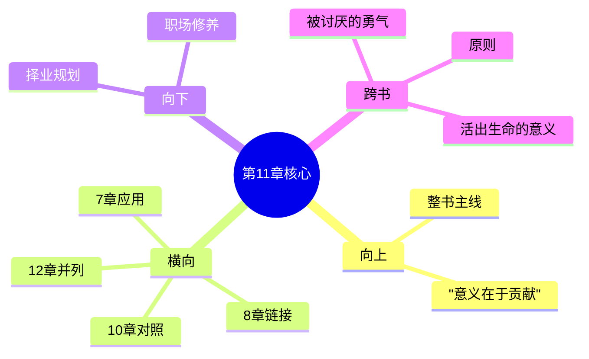

---

category: 
  - 书籍拆解

status: draft
chapter: 
number: 11
title: 职业
links:

  - "[[第10章-犯罪及其预防]]"
  - "[[第12章-爱情与婚姻]]"
created: 2026-02-27
tags:
  - 自卑与超越
  - 阿德勒
  - 个体心理学
  - 职业心理学
  - 社会合作
---

# 第11章 职业

## 📍 章节定位

### 全书位置
> 第11章是全书个体心理学理论在社会三大任务（职业、社交、爱情）之一——职业领域的重要阐述章节。承接前章犯罪预防的反向论证（说明错误的职业路径），正面向阐述正当职业生活对个体发展的积极意义，并为后续爱情婚姻章节提供个体社会功能实现的基础分析

- **全书核心问题**: 自卑感如何转化为成长的动力？个体如何通过克服自卑获得超越？生命的意义究竟何在？
- **本章回答的问题**: 职业在人生中的重要意义是什么？什么样的职业态度和职业追求是健康的？个体如何在职业中实现合作精神和自我超越？
- **角色类型**: 社会任务履行型，聚焦个体三大人生任务之一的职业维度
- **论证位置**: 人生三大任务理论中的关键组成，体现个体与社会合作的现实载体

### 章节序列
| 方向 | 章节标题 | 逻辑连接 |
|------|----------|----------|
| 前章 | [[第10章-犯罪及其预防]] | 从不正当行为反向论证正当职业选择的重要性 |
| 后章 | [[第12章-爱情与婚姻]] | 个体社会功能的延续扩展 |

### 一句话定位
> 第11章阐述职业工作是个体参与社会分工、实现社会合作的具体途径，是克服自卑、培养社会兴趣、体现生命意义的重要载体，健康的职业态度必须以服务社会为出发点。

---

## 🎯 核心观点

### 第一层：表层案例
> 章节中的具体案例、故事、数据

| 案例名称 | 简要描述 | 页码 | 关键引文 |
|----------|----------|------|----------|
| 缺乏职业兴趣的学生 | 对各种职业选择都感到茫然，缺乏服务意识 | p.240-243 | "缺乏合作精神的学生在职业选择上往往迷失方向" |
| 拒绝合作的工作者 | 只考虑个人利益的职业态度导致人际冲突 | p.245-247 | "不与同事合作的人难以在职业上有成就" |
| 家庭地位对职业选择的影响 | 长子女因家庭责任倾向选择稳定职业 | p.250-252 | "家庭中地位影响职业志向的设定" |

### 第二层：中层机制
> 案例背后的运行机制、方法论

| 机制名称 | 组成要素 | 因果链条 | 证据来源 |
|----------|----------|----------|----------|
| 职业选择动机机制 | 社会兴趣 + 个人能力 + 环境影响 | 社会兴趣→职业价值观→职业选择→工作成效 | 个案分析 |
| 合作能力发挥机制 | 职业定位 + 协作需求 + 能力匹配 | 职业角色→协作任务→能力发挥→社会贡献 | 观察研究 |
| 职业成就感形成 | 服务社会 + 能力实现 + 同事认可 | 社会需要→个人贡献→他人认可→自我认同 | 统计数据分析 |

### 第三层：底层规律
> 可迁移的普遍规律

| 规律陈述 | 抽象层级 | 知识连接 | 适用范围 |
|----------|----------|----------|----------|
| 社会合作需求定律 | 系统论 + 功能哲学 | 马克思社会分工论 | 职场管理、人力资源 |
| 志业一体原则 | 精神哲学 + 职业心理学 | 荣格职业价值观理论 | 职业规划、人生设计 |
| 工作意义创造论 | 后现代哲学 + 管理学 | 维克多·弗兰克意义疗法 | 组织动机、个人发展 |

---

## 💬 降维翻译

### 观点1: 职业是服务他人和社会的根本方式

#### 原文表达
> "职业不仅仅是为了谋生的手段，更是实现人与人之间广泛合作的重要桥梁。一个健康的职业观念应当以服务社会、贡献他人为首要目标，而不是仅仅为了个人利益和自我展示。" —— p.238

#### 降维翻译（中学生能懂）
工作不只是为了赚钱吃饭，更重要的是能通过我的工作让别人得到帮助、让社会变得更好。健康的想法应该是想着怎么帮助别人，而不是光想着显示自己有多能耐。

#### 日常类比（奶奶能懂）
就像大家修房子，你负责和泥别人负责搬砖，他负责上梁，不是为了各自显摆手艺，而是为了让大家都住上好房子。工作也是这样，你做好自己的这部分，是为了让大家都过得更好，不是光顾着自己吃穿不愁。

### 观点2: 职业选择反映了个体的生活态度

#### 原文表达
> "个体如何选择自己的职业，如何对待自己的职业，实际上反映了他对世界的看法和对社会的兴趣。那些只关心自己地位和利益的人，在职业道路上很难取得真正的满足和成就。" —— p.242

#### 降维翻译（中学生能懂）
你做什么工作、怎么看你的工作，说明了你心里到底是光想着自己还是关心别人。如果只惦记着自己挣得多些、职位高些，那你在工作上也得不到真的高兴和成就。

#### 日常类比（奶奶能懂）
就像卖菜的，天天想着怎么用秤耍小花招多赚点钱，遇到顾客买贵了、买亏了都不会在乎，这样的买卖能做好吗？顾客都知道他不好，谁还来买？反过来如果菜贩子想着怎么让街坊买到新鲜便宜的菜，大家心里都想着顾客的利益，生意自然就好做了。

### 观点3: 正确的职业态度需要从小培养

#### 原文表达
> "对工作的正确认识和合作精神必须从童年时期开始培养，如果家庭和学校能够给孩子正确的引导，让他们认识到工作的意义在于服务他人，那么他们在成年后的职业选择和服务社会的态度上就会更加健康和积极。" —— p.250

#### 降维翻译（中学生能懂）
对工作的正确认识和跟别人一起做事的能力，都要在小时候就开始培养。如果爸爸妈妈老师能把正确想法教给孩子，让他们明白做工是为了帮助别人，那他们大了选择工作和服务社会的看法才会更健康。

#### 日常类比（奶奶能懂）
就像种地，春天播种时就得先把地里的草都锄干净、把肥料上足，苗才长得壮实，秋天才有收成。教育孩子对工作的看法也是一样，越小教育越管用，要让他们明白干活是为了大家好，不是光为了自己。

#### 检验
- Q: 如果一个中学生问你工作是为了什么？
- A: 工作不只是为了赚钱，更重要的是通过我的付出让别人能受益。工作是为了服务社会、帮助他人，同时也在这个过程中实现自己。

---

## ✨ 金句库

### 原书金句
| 金句 | 页码 | 适用场景 |
|------|------|----------|
| "职业是实现人与人之间广泛合作的重要桥梁。" | p.238 | 职业价值论述 |
| "健康的职观念应当以服务社会、贡献他人为首要目标。" | p.239 | 职业价值观引导 |
| "那些只关心自己地位和利益的人，很难取得真正的满足。" | p.242 | 反面警示 |
| "工作的意义在于服务他人。" | p.250 | 工作意义诠释 |
| "只有合作才能实现真正的职业成功。" | p.246 | 合作精神表述 |

### 降维金句
| 金句 | 来源观点 | 适用场景 |
|------|----------|----------|
| 工作本质是为人服务，而不仅是为自己谋利 | 观点1 | 职业价值观纠正 |
| 对工作的态度反映人的格局大小 | 观点2 | 自我审视 |
| 只看眼前利益必难长远成功 | 观点2 | 励志指导 |
| 合作成就他人才能成就自己 | 观点1 | 团队建设 |
| 志业合一方可实现长久价值 | 观点3 | 职业规划 |

## 🔗 当下映射

### 💰 财富应用
| 场景 | 具体行动 | 预期效果 | 风险提示 |
|------|----------|----------|----------|
| 投资方向 | 投资为社会创造真正价值的企业 | 获得长期可持续回报 | 避免追逐短期利益的企业 |
| 财务规划 | 将财富增长与社会价值创造结合 | 实现财务和社会双重意义 | 注意识别虚假宣传企业 |

### 💼 职场应用
| 场景 | 具体行动 | 所需能力 | 适用职级 |
|------|----------|----------|----------|
| 职业选择 | 根据服务社会和贡献价值的潜力来选择职业 | 战略思考、行业分析能力 | 所有职级 |
| 团队协作 | 在工作中始终考虑团队和客户利益 | 协作能力、换位思考能力 | 所有职级 |

### 🏠 生活应用
| 场景 | 具体行动 | 可行性 | 见效时间 |
|------|----------|--------|----------|
| 工作态度 | 在本职工作中多想想能为别人解决什么问题 | 高 | 立即可行 |
| 择业方向 | 选择有社会价值意义的事业 | 中 | 需要长期规划 |

### 72小时行动计划
1. **明天**：反思自己在工作或学习中，是否可以从服务他人的角度来重新理解
2. **本周内**：了解一个以服务社会为使命的企业或组织
3. **需要准备资源**：查询社会影响力投资或ESG评价机构相关信息

---

## 🕸️ 章节关联

### 向上关联 → 整书
- **贡献**: 为全书关于个人意义与社会发展关系的重要实例，体现"生活意义在于贡献"的主题
- **位置**: 阐释人生三大任务之一的职业维度，为个体价值观具体表现提供场景

### 横向关联 → 章节间
| 章节编号 | 章节标题 | 关联类型 | 连接描述 |
|----------|----------|----------|----------|
| 第7章 | [[第7章-社会兴趣]] | 深化应用 | 将社会兴趣理念在职业环境中具体化 |
| 第8章 | [[第8章-学校的影响]] | 因果连接 | 学校如何培养学生正确职业观的延续 |
| 第10章 | [[第10章-犯罪及其预防]] | 正反对照 | 正向职业态度 vs 负面行为的结果对比 |
| 第12章 | [[第12章-爱情与婚姻]] | 任务并列 | 与爱情共同构成两大社会性重要任务 |

### 向下关联 → 具体应用
| 应用场景 | 难度 | 前置知识 |
|----------|------|----------|
| 职业生涯规划 | 中 | 需要自我认知和行业了解 |
| 择业价值观建立 | 低 | 基础社会价值观基础 |
| 工作使命感培养 | 高 | 成熟人生观建立要求 |

### 跨书关联 → 知识网络
| 书籍 | 概念 | 关系 | 备注 |
|------|------|------|------|
| [[被讨厌的勇气-岸见一郎]] | 工作课题 | 一致观点 | 对工作的社会意义诠释 |
| [[活出生命的意义-弗兰克]] | 存在意义 | 价值呼应 | 工作中寻找人生意义的相似观点 |
| [[原则]] | 工作原则 | 操作补充 | 具体工作行为准则的支持 |

### 关联可视化

---

## ❓ 问答设计

### Q1: (记忆型) 阿德勒如何看待职业的本质意义？
**认知层次**: 记忆
**难度**: 低
**答案要点**:
- 职业是人与人广泛合作的桥梁
- 不仅是为了个人谋生
- 更重要是服务社会、贡献他人

### Q2: (理解型) 从个体心理学角度看，职业选择反映了个什么？
**认知层次**: 理解
**难度**: 中
**答案要点**:
- 反映个体对社会的兴趣程度
- 显示个体的世界观和价值观
- 体现个体的自我认知状况

### Q3: (应用型) 如何在当前工作中贯彻服务他人的职业观？
**认知层次**: 应用
**难度**: 中
**答案要点**:
- 专注于工作对客户的实际价值
- 考虑同事合作的共赢效果
- 寻找工作对社会整体的贡献

### Q4: (分析型) 职业合作态度与个体自卑感的处理有何关系？
**认知层次**: 分析
**难度**: 中
**答案要点**:
- 合作有助于超越个人自卑感
- 服务他人转移自我关注焦点
- 通过贡献获得真正自信

### Q5: (创造型) 设计一个以服务社会为导向的职业发展模型？
**认知层次**: 创造
**难度**: 高
**答案要点**:
- 以社会需求为导向的择业决策
- 建立贡献导向的成就标准
- 以合作价值为驱动的成长机制

### Q6: (理解型) 儿童时期的哪些因素会影响其职业观念？
**认知层次**: 理解
**难度**: 中
**答案要点**:
- 家庭对工作的态度示范
- 学校教育中的价值观引导
- 童年合作经验的积累

### Q7: (应用型) 在职场中如何去培养合作精神？
**认知层次**: 应用
**难度**: 中
**答案要点**:
- 尊重同事的专业意见
- 主动承担责任与协作
- 关注团队整体目标

### Q8: (分析型) 只关注个人地位的职业追求会带来什么问题？
**认知层次**: 分析
**难度**: 中
**答案要点**:
- 缺乏他人认可和合作支持
- 容易遭遇关系挫折
- 难获持久满意感

### Q9: (应用型) 如何判断某个职业是否适合发展社会兴趣？
**认知层次**: 应用
**难度**: 中
**答案要点**:
- 分析其对社会的贡献程度
- 评估合作与服务的机会
- 考察其价值观与社会利益的一致性

### Q10: (创造型) 创立一种新型服务导向的商业模式？
**认知层次**: 创造
**难度**: 高
**答案要点**:
- 以解决社会问题为导向
- 建立多方共赢合作机制
- 创造长期社会价值增量

### Q11: (分析型) 职业中的成功追求与阿德勒的追求优越理论如何结合？
**认知层次**: 分析
**难度**: 中
**答案要点**:
- 个人成功需要包含社会贡献元素
- 避免单纯竞争性的优越追求
- 以服务社会为衡量优越的标准

### Q12: (理解型) 家庭出生顺序如何影响职业选择偏好？
**认知层次**: 理解
**难度**: 中
**答案要点**:
- 长子女可能偏向负责任职业类型
- 次子女选择差异化竞争方向
- 幼子可能倾向轻松或被照顾工作

### Q13: (应用型) 如何在工作中避免个人主义倾向？
**认知层次**: 应用
**难度**: 中
**答案要点**:
- 关注团队目标胜过个人表现
- 寻求协作而非独自表现突出
- 以团队成效评估自己贡献

### Q14: (分析型) 职业倦怠与缺乏社会兴趣有何内在联系？
**认知层次**: 分析
**难度**: 中
**答案要点**:
- 缺乏社会兴趣导致工作无意义感
- 只顾自己利益产生人际冲突
- 没有服务感降低工作成就感

### Q15: (创造型) 如何设计职场中的社会兴趣激励机制？
**认知层次**: 创造
**难度**: 高
**答案要点**:
- 表彰服务社会的突出行为
- 建立合作贡献评价体系
- 创造参与社会公益的机会

---
