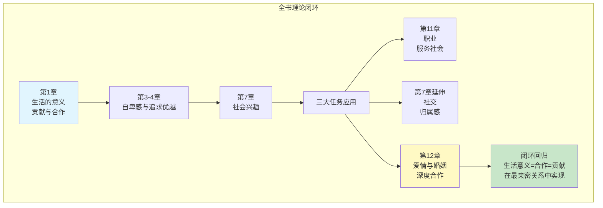
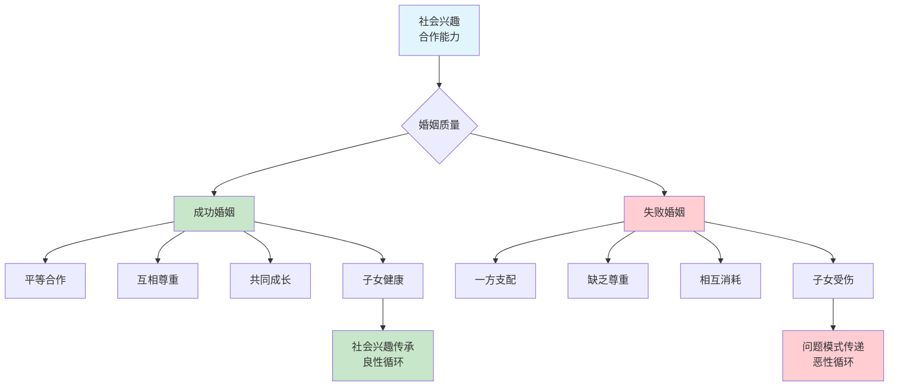
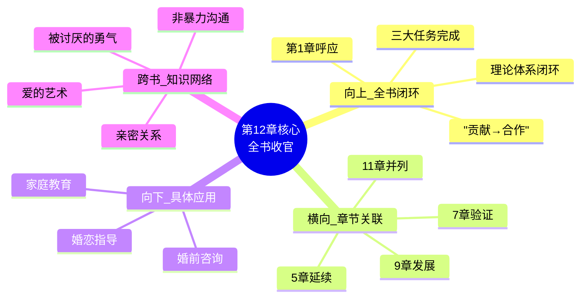

---

category: 
  - 书籍拆解

status: completed
chapter: 
number: 12
title: 爱情与婚姻
links:

  - "[[第11章-职业]]"
  - "[[第1章-生活的意义]]"
  - "[[第7章-社会兴趣]]"

created: 2026-02-27
updated: 2026-02-28
tags:
  - 自卑与超越
  - 阿德勒
  - 个体心理学
  - 两性关系
  - 家庭教育
  - 全书收官
---

# 第12章 爱情与婚姻

## 📍 章节定位

### 全书位置
> 第12章是全书收官章节，是阿德勒个体心理学理论在人生三大任务——爱情与婚姻领域的终极应用。作为全书的最后一章，它完成了"生活意义在于贡献"这一核心命题的闭环论证：从第1章的哲学命题，经过自卑感、补偿机制、社会兴趣等理论建构，最终在爱情婚姻这一最深层的合作关系中找到答案。

- **全书核心问题**: 自卑感如何转化为成长的动力？个体如何通过克服自卑获得超越？生命的意义究竟何在？
- **本章回答的问题**: 爱情与婚姻的本质是什么？如何建立成功的婚姻关系？为什么亲密关系是社会兴趣的终极考验？
- **角色类型**: 全书收官型，完成理论闭环，实现首尾呼应
- **论证位置**: 人生三大任务的最后一环，收束整本书的理论体系



**首尾呼应**：
| 第1章开篇 | 第12章收官 | 呼应关系 |
|----------|----------|----------|
| "生活的意义在于对他人和社会的贡献" | "爱情与婚姻是最深层的社会合作" | 哲学命题→具体场景 |
| "凡是对他人没有兴趣的人，一生中困难最多" | "能处理好爱情关系的人在其他领域也不会差" | 负向警告→正向验证 |
| 三大任务概念引入 | 三大任务完成闭环 | 理论框架→实践落地 |

### 章节序列
| 方向 | 章节标题 | 逻辑连接 |
|------|----------|----------|
| 前章 | [[第11章-职业]] | 从社会合作任务延续到亲密关系任务，职业服务→家庭合作 |
| 后章 | 无（全书完结） | 理论体系完整闭环 |
| 核心关联 | [[第1章-生活的意义]] | 首尾呼应，哲学命题在最深层关系中验证 |
| 深化应用 | [[第7章-社会兴趣]] | 亲密关系是对社会兴趣的终极考验 |

### 一句话定位
> 第12章阐述爱情与婚姻是最深层的社会合作关系，需要双方具备充分的社会兴趣和平等合作精神。成功的婚姻是个体心理健康、社会兴趣成熟、生命意义实现的终极检验——**全书理论在此完成闭环**。

---

## 🎯 核心观点

### 第一层：表层案例
> 章节中的具体案例、故事、数据

| 案例名称 | 简要描述 | 关键引文 |
|----------|----------|----------|
| 夫妻角色分工模式 | 成功夫妻在家庭中平等合作的实例分析 | "婚姻中最重要的是合作精神" |
| 求爱期间的自卑表现 | 过度关注自己印象的男性行为模式，暴露真实人格 | "恋爱中个体容易暴露真实自我" |
| 家庭角色错位影响 | 父母角色不平等导致子女教育问题，代际传递 | "父母关系影响整个家庭生活风格" |
| 婚姻失败的根源 | 缺乏社会兴趣、只想支配对方的失败案例 | "不平等的权力关系破坏爱情本质" |
| 童年经验的影响 | 原生家庭模式对婚姻关系的深远影响 | "早期经验决定个体在亲密关系中的行为模式" |

### 第二层：中层机制
> 案例背后的运行机制、方法论



| 机制名称 | 组成要素 | 因果链条 |
|----------|----------|----------|
| 爱情合作机制 | 社会兴趣 + 平等意识 + 共同目标 | 社会兴趣→合作意愿→相互理解→共同成长 |
| 婚姻适应机制 | 原生家庭经验 + 个人成长 + 关系重塑 | 既往经验→行为模式→关系适应→生活方式重构 |
| 家庭教育传承 | 夫妻关系 + 家庭氛围 + 互动模式 | 夫妻关系→家庭气氛→子女影响→下一代模式 |
| 亲密关系溢出效应 | 婚姻质量 + 个人发展 + 社会功能 | 婚姻合作→社会兴趣提升→职场/社交成功 |

### 第三层：底层规律
> 可迁移的普遍规律

| 规律陈述 | 抽象层级 | 知识连接 | 适用范围 |
|----------|----------|----------|----------|
| **深度合作定律** | 系统论 + 关系学 | 鲍温家庭系统理论 | 家庭关系、亲密关系 |
| **社会兴趣终极检验** | 个体心理学 | 阿德勒人格理论 | 个人发展、关系诊断 |
| **亲密关系辐射效应** | 家庭治疗 + 社会学 | 家庭系统理论 | 子女教育、社会功能 |
| **婚姻平等原则** | 关系伦理学 | 弗洛姆《爱的艺术》 | 恋爱观、婚姻观 |

---

## 💬 降维翻译

### 观点1: 爱情与婚姻是最深层的社会合作

#### 原文表达
> "爱情与婚姻关系是人类最深刻合作的领域，它远比职业或社交关系更为亲密和全面。在这种关系中，个体不仅要与伴侣合作，还要共同养育子女，参与更深层次的生命体验。" —— p.268

#### 降维翻译（中学生能懂）
谈恋爱和结婚是人与人合作中难度最高的一种，比工作朋友关系都要更亲密复杂。在这关系里，你们不光要一起做事，还可能有一起养孩子这么重要的人生经历，所以需要你们都很会跟别人合作、很愿意关心别人才行。

#### 日常类比（奶奶能懂）
就像两个人要合伙挑担子走过独木桥，不仅要步调一致、相互扶持，还要把担子里的东西安安全全运过桥去。这不光考验你们两个人的配合默契，还考验你们的责任心和对共同目标的坚持。

> **呼应第1章**："生活的意义在于对他人和社会的贡献"
> 
> 爱情与婚姻，就是"贡献"在最亲密关系中的具体体现：
> - 不是索取，而是给予
> - 不是控制，而是合作
> - 不是利用，而是成全

---

### 观点2: 健康的爱情必须建立在平等合作的基础上

#### 原文表达
> "真正的爱情不是一个人主导另一个人，而是一种平等的伙伴关系。只有在平等的基础上，双方才能充分发挥各自的长处，相互补充、相互支持。" —— p.272

#### 降维翻译（中学生能懂）
真正好的恋情不是一方压着另一方，而是两个平等位置的人合作。这样你们能互相发挥优势、弥补不足，一起解决各种事。如果有一方想管住对方，这种关系就破坏了感情的本来面貌。

#### 日常类比（奶奶能懂）
就像两个人合伙打井，如果一个人总说"你按我说的干活"，另一个人只能听他的，那打井的效率肯定不高，说不定还闹矛盾，井也打不好。必须两个人商量着来，各尽其责，井才能又快又好打成。

#### 对比表格
| 不平等关系 | 平等合作 |
|----------|----------|
| 一方支配，一方服从 | 共同决策，相互尊重 |
| 只考虑自己利益 | 考虑双方利益 |
| 控制欲强 | 信任放手 |
| 一方成长，一方停滞 | 双方共同成长 |
| 关系消耗 | 关系滋养 |

---

### 观点3: 爱情中的合作能力反映个体的整体社会适应

#### 原文表达
> "一个在爱情中善于合作的人，在职业和社会中也通常表现出色。相反，那些在亲密关系中无法合作的人，也很难在其他方面成功地与他人合作。因此，爱情关系成为个体社会兴趣和合作能力的重要检验场所。" —— p.275

#### 降维翻译（中学生能懂）
会谈恋爱的人，在工作中和生活里一般也不会很差。如果一个人谈恋爱都搞不好，那么他在工作朋友关系上也不会很好。感情关系是检验一个人会不会关心人、能不能和人合作的重要测验。

#### 日常类比（奶奶能懂）
就像会掌舵的人，不仅能在自家船上把船开好，到了别人船上也很快掌握技巧。不会掌舵的，自家船开不好，别家船就更别提了。感情这回事儿最检验人心，对人好的人，干什么事都心善；对人不好的，做别的事也缺德。

```
社会兴趣发展 → 亲密关系表现 → 整体社会功能

高社会兴趣 → 爱情合作成功 → 职场成功 + 社交成功
低社会兴趣 → 爱情失败 → 职场困难 + 社交孤立
```

---

### 观点4: 原生家庭模式影响婚姻关系

#### 原文表达
> "个体从原生家庭中学到的相处模式，会深刻影响其在婚姻中的表现。如果父母之间的关系是平等合作的，孩子更有可能在成年后建立健康的婚姻关系；反之，则可能重复不健康的模式。" —— p.280

#### 降维翻译（中学生能懂）
你爸妈在家里怎么相处，很大程度上会影响你以后怎么跟对象相处。如果爸妈是互相尊重、一起干活的，你长大了也更可能这样对你对象；如果爸妈是一个说了算、一个只能听的，你可能也会不自觉地照搬。

#### 日常类比（奶奶能懂）
就像学说话，从小听什么口音，长大了说话就带什么口音，改都难改。家庭里爸妈怎么相处，就像给你种下了"关系口音"，以后谈恋爱结婚，嘴一张就是这个调调。好的口音是福气，坏的口音得刻意改。

> **呼应第5章**："早期记忆与生活风格"
> 
> 原生家庭不是命运，但需要觉察：
> - 觉察模式 → 打破循环
> - 重新诠释 → 创造新可能
> - 选择合作 → 建立新家庭文化

---

## ✨ 金句库

### 原书金句（10句）
| 金句 | 页码 | 适用场景 |
|------|------|----------|
| "婚姻中最重要的是合作精神。" | p.270 | 关系经营指导 |
| "真正的爱情是一种平等的伙伴关系。" | p.272 | 观念指导 |
| "不平等的权力关系往往会破坏爱情的本质。" | p.273 | 问题预警 |
| "爱情是社会兴趣的最终考验。" | p.278 | 能力评估 |
| "家庭是社会的最小单位，家庭的和谐关乎社会的安定。" | p.285 | 价值判断 |
| "能处理好爱情关系的人，在其他领域也不会差。" | p.275 | 能力迁移 |
| "婚姻失败的人，往往是在其他方面也存在合作困难的人。" | p.276 | 问题诊断 |
| "父母之间的关系是孩子学习合作的第一课。" | p.280 | 家庭教育 |
| "爱情不是占有，而是成全。" | p.271 | 爱情观引导 |
| "成功的婚姻需要双方都具备充分的社会兴趣。" | p.274 | 婚姻准备 |

### 降维金句（15句）
| 金句 | 来源观点 | 适用场景 |
|------|----------|----------|
| 最深刻的伙伴关系最考验合作能力 | 观点1 | 关系深度认知 |
| 爱情是平等合作，不是权力支配 | 观点2 | 交往指导 |
| 会谈恋爱的人，干啥都不会太差 | 观点3 | 性格判断 |
| 谁想管住别人，谁就破坏了感情 | 观点2 | 关系维护 |
| 最亲密的关系，检验最深的人性 | 观点3 | 品格分析 |
| 爱情不是找个主人，是找个战友 | 观点2 | 择偶观 |
| 父母怎么相处，孩子就怎么爱人 | 观点4 | 家庭教育 |
| 想知道一个人怎样，看他怎么谈恋爱 | 观点3 | 人际识人 |
| 爱情是检验社会兴趣的最终考场 | 观点3 | 自我评估 |
| 好的婚姻让彼此更好，坏的婚姻互相消耗 | 观点2 | 婚姻质量 |
| 平等的爱情，才是真正的爱情 | 观点2 | 爱情定义 |
| 合作能力决定婚姻质量 | 观点1 | 能力培养 |
| 家庭是社会的细胞，细胞健康社会才健康 | 观点1 | 社会意义 |
| 想要好的婚姻，先学会合作 | 观点1 | 婚前准备 |
| 爱情的本质是给予，不是索取 | 观点1 | 爱情哲学 |

## 🔗 当下映射

### 💰 财富应用
| 场景 | 具体行动 | 预期效果 | 风险提示 |
|------|----------|----------|----------|
| 婚前财务规划 | 以合作伙伴视角规划共同财产 | 建立健康的财富合作关系 | 避免因金钱问题影响合作 |
| 投资决策 | 在家庭重大投资中平等协商 | 减少家庭矛盾 | 注意决策效率问题 |
| 家庭财务 | 共同承担家庭责任 | 增强合作意识 | 避免一方过度承担 |

### 💼 职场应用
| 场景 | 具体行动 | 所需能力 | 适用职级 |
|------|----------|----------|----------|
| 团队合作 | 将爱情中的平等合作理念用于职场 | 协调沟通、公平处事 | 所有职级 |
| 领导管理 | 关注员工的伴侣关系和谐 | 人性化管理、情绪感知 | 管理层以上 |
| 人才评估 | 将亲密关系质量作为判断合作能力的参考 | 识人能力 | HR/管理层 |

### 🏠 生活应用
| 场景 | 具体行动 | 可行性 | 见效时间 |
|------|----------|--------|----------|
| 家庭教育 | 以平等合伙人身份处理育儿问题 | 高 | 长期显现 |
| 夫妻关系 | 将对方视为人生合伙人而非附庸 | 中 | 1-3个月 |
| 择偶标准 | 优先考察对方的合作能力和社会兴趣 | 高 | 即时指导 |
| 婚前准备 | 评估自己的合作能力和社会兴趣 | 高 | 即时可行 |

### 72小时行动计划
1. **明天**：审视现有的亲密关系，看是否存在不平等对待
2. **本周内**：与伴侣讨论未来合作计划，平等参与决策
3. **一个月内**：评估自己的社会兴趣水平，识别需要提升的方面
4. **需要准备资源**：《非暴力沟通》《爱的艺术》等关系类书籍

---

## 🕸️ 章节关联

| 贡献方向 | 具体内容 |
|----------|----------|
| **完成理论闭环** | 第1章"生活意义在于贡献" → 第12章"爱情是最深层合作" |
| **三大任务闭环** | 职业（11章）+ 社交（7章）+ 爱情（12章）= 完整人生任务 |
| **验证核心理论** | 亲密关系是对社会兴趣、合作能力的终极检验 |
| **首尾呼应** | 开篇哲学命题 → 收官具体场景 |

### 横向关联 → 章节间
| 章节编号 | 章节标题 | 关联类型 | 连接描述 |
|----------|----------|----------|----------|
| **第1章** | [[第1章-生活的意义]] | **首尾呼应** | "贡献"命题在最亲密关系中验证 |
| **第7章** | [[第7章-社会兴趣]] | **应用验证** | 亲密关系是对社会兴趣的终极考验 |
| **第11章** | [[第11章-职业]] | **任务并列** | 职业服务→家庭合作，构成两大社会任务 |
| **第5章** | [[第5章-早期的记忆]] | **机制延续** | 原生家庭模式影响婚姻关系 |
| **第9章** | [[第9章-青春期]] | **发展延续** | 青春期后的亲密关系发展任务 |

### 向下关联 → 具体应用
| 应用场景 | 难度 | 前置知识 |
|----------|------|----------|
| 婚恋关系指导 | 中 | 深入的个人成长知识 |
| 家庭教育实施 | 高 | 系统的心理学教育知识 |
| 婚前咨询辅导 | 中 | 关系评估和沟通技巧 |
| 婚姻危机干预 | 高 | 家庭治疗技术 |

### 跨书关联 → 知识网络
| 书籍 | 概念 | 关系 | 备注 |
|------|------|------|------|
| [[被讨厌的勇气-岸见一郎]] | 爱的课题 | 等价理论 | 阿德勒理论的现代化阐述 |
| [[爱的艺术-弗洛姆]] | 爱是能力 | 观点一致 | 爱情作为合作能力的共同观点 |
| [[非暴力沟通/_导航]] | 共情需求 | 方法支撑 | 实现平等合作的沟通技术 |
| [[亲密关系-罗兰·米勒]] | 关系科学 | 研究补充 | 现代亲密关系研究的科学支撑 |

### 关联可视化


---

## ❓ 问答设计

### Q1: (记忆型) 阿德勒认为爱情与婚姻的本质是什么？
**认知层次**: 记忆
**难度**: 低
**答案要点**:
- 是最深层次的社会合作关系
- 是两个人共同的合作任务
- 需要平等合作的精神
- 是社会兴趣的终极考验

### Q2: (理解型) 为什么说爱情关系是对社会兴趣的终极考验？
**认知层次**: 理解
**难度**: 中
**答案要点**:
- 亲密关系最能暴露真实自我
- 平时隐藏的自私容易显现
- 需要最充分的合作与关照
- 是合作能力的最高难度测试

### Q3: (应用型) 如何在恋爱关系中实践平等合作？
**认知层次**: 应用
**难度**: 中
**答案要点**:
- 避免单方面控制和服从
- 共同决策重要事务
- 互相尊重和支持对方
- 以战友而非上下级相处

### Q4: (分析型) 平等合作关系如何影响婚恋双方的个体发展？
**认知层次**: 分析
**难度**: 中
**答案要点**:
- 促进相互成长和完善
- 保持个体独立性
- 防止过度依赖或控制
- 实现共同超越

### Q5: (综合型) 为什么说阿德勒的爱情观完成了全书理论闭环？
**认知层次**: 综合
**难度**: 高
**答案要点**:
- 第1章"生活意义在于贡献"在第12章找到具体场景
- 三大任务（职业、社交、爱情）在此完成
- 社会兴趣在最亲密关系中得到检验
- 自卑→超越→合作→贡献的完整链条

### Q6: (理解型) 原生家庭如何影响个体在恋爱中的合作能力？
**认知层次**: 理解
**难度**: 中
**答案要点**:
- 早期经验决定合作模式
- 父母互动被无形模仿
- 家庭氛围影响安全感
- 但觉察后可以改变

### Q7: (应用型) 如何克服恋爱中的控制欲？
**认知层次**: 应用
**难度**: 中
**答案要点**:
- 提升对他人独立的尊重
- 反思控制背后的恐惧
- 学会信任和放手
- 将伴侣视为战友而非下属

### Q8: (分析型) 缺乏社会兴趣的人在爱情关系中有哪些表现？
**认知层次**: 分析
**难度**: 中
**答案要点**:
- 过度关注个人得失
- 缺乏对伴侣的共情
- 试图控制对方言行
- 无法建立深度连接

### Q9: (评价型) 如何评价"会谈恋爱的人，干啥都不会太差"这句话？
**认知层次**: 评价
**难度**: 中
**答案要点**:
- 亲密关系是合作能力的最高测试
- 社会兴趣具有跨领域迁移性
- 但需注意因果关系方向
- 是能力指标，不是绝对判断

### Q10: (创造型) 如何设计一个婚前合作能力培养计划？
**认知层次**: 创造
**难度**: 高
**答案要点**:
- 建立平等合作关系的体验机会
- 模拟共同决策的练习环境
- 定期关系评估和反馈机制
- 识别和改变原生家庭模式

---
