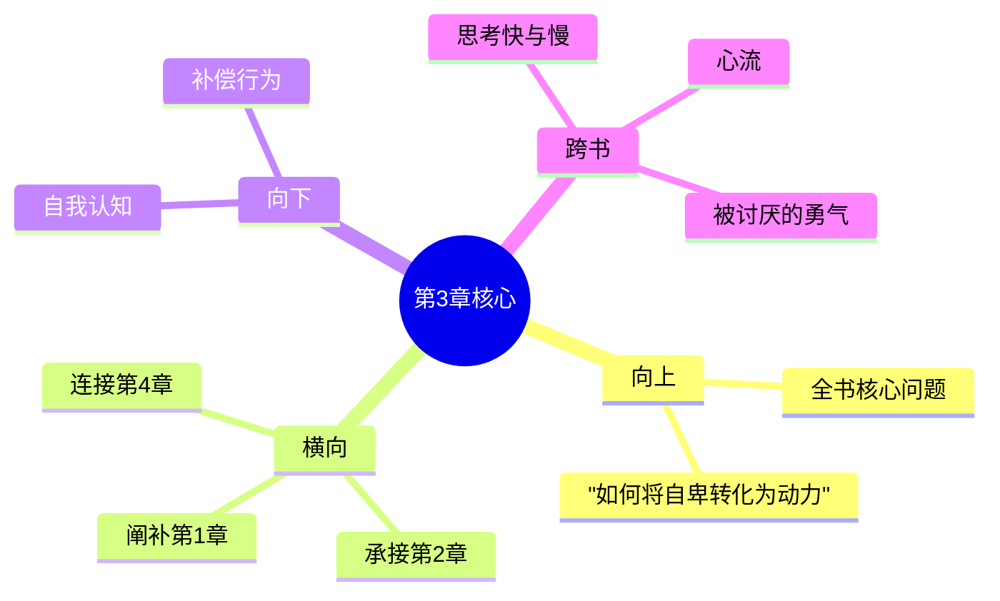

---

category: 
  - 书籍拆解

status: draft
chapter: 
number: 3
title: 自卑情结
links:

  - "[[第2章-心灵与肉体]]"
  - "[[第4章-追求优越]]"
created: 2026-02-27
tags:
  - 自卑与超越
  - 阿德勒
  - 个体心理学
  - 自卑情结
  - 补偿机制
---

# 第3章 自卑情结

## 📍 章节定位

### 全书位置
> 第3章是全书的核心理论章节，全面阐述自卑情结的概念、成因及影响，承接前两章的身心统一和生活意义，为下一章追求优越做铺垫，是理解阿德勒心理学的关键环节

- **全书核心问题**: 自卑感如何转化为成长的动力？个体如何通过克服自卑获得超越？生命的意义究竟何在？
- **本章回答的问题**: 什么是自卑情结？它与正常的自卑感有何不同？自卑情结是如何形成的？如何克服自卑情结？
- **角色类型**: 核心概念型，澄清自卑情结与自卑感的区别
- **论证位置**: 连接自卑感与补偿机制的理论枢纽，为个体心理学奠定基础

### 章节序列
| 方向 | 章节标题 | 逻辑连接 |
|------|----------|----------|
| 前章 | [[第2章-心灵与肉体]] | 从身心关系过渡到自卑感问题 |
| 后章 | [[第4章-追求优越]] | 探讨自卑情结的解决出路——追求优越 |

### 一句话定位
> 第3章澄清自卑情结的真相，指出它不是正常自卑感，而是逃避现实、拒绝成长的心理防御机制，只有正视自卑、积极补偿，才能走向成长和超越。

---

## 🎯 核心观点

### 第一层：表层案例
> 章节中的具体案例、故事、数据

| 案例名称 | 简要描述 | 页码 | 关键引文 |
|----------|----------|------|----------|
| 家族自卑 | 来自出身低微家庭的个体表现出的自卑感 | p.50-55 | "家族自卑感往往使人过分关注自己的出身" |
| 器官自卑 | 身体有缺陷导致强烈自卑情结的案例 | p.56-60 | "器官自卑感可能发展成严重的心理问题" |
| 家庭排行自卑 | 作为家中老大或老小而产生的心理特点 | p.62-65 | "出生顺序影响个体的生活风格" |

### 第二层：中层机制
> 案例背后的运行机制、方法论

| 机制名称 | 组成要素 | 因果链条 | 证据来源 |
|----------|----------|----------|----------|
| 自卑情结形成机制 | 真实缺陷 + 环境负面反馈 + 自我拒绝 | 真实劣势 → 负面标签 → 自我拒绝 → 补偿缺失 → 自卑情结 | 临床案例分析 |
| 补偿机制分裂 | 正常补偿 + 消极补偿 | 自卑感受挫 → 寻求补偿 → 无力积极补偿 → 选择消极补偿 → 补偿失效 | 亲子教育案例 |
| 逃避现实机制 | 自卑情结 + 焦虑恐惧 + 防御行为 | 自卑感→逃避现实→寻求虚构优越→防御加强→心理固化 | 社交恐惧患者 |

### 第三层：底层规律
> 可迁移的普遍规律

| 规律陈述 | 抽象层级 | 知识连接 | 适用范围 |
|----------|----------|----------|----------|
| 自卑推动法则 | 个体心理学 | 追求卓越理论、动机理论 | 个人发展、组织管理、教育实践 |
| 补偿分化原理 | 心理学 + 社会学 | 认知失调理论、社会比较理论 | 心理治疗、教育咨询、行为修正 |
| 虚构优越效应 | 临床心理学 | 防御机制理论、幻想投射理论 | 心理诊断、行为矫正、现实检验 |

---

## 💬 降维翻译

### 观点1: 自卑情结≠正常自卑感

#### 原文表达
> "自卑感本身并不是变态的，它是一个人正常生活中不可缺少的一部分。但是自卑情结，则是另外一回事。它是一种神经症，表示了对自己的能力和价值缺乏信心。" —— p.50

#### 降维翻译（中学生能懂）
自卑感是每个人都有的正常情绪，是推动人进步的力量。而自卑情结则是不健康的，是把自己陷入自我怀疑的泥潭里，不肯出来改变。正常的自卑让人想努力，病态的自卑让人心态越来越差。

#### 日常类比（奶奶能懂）
普通人知道自己不如人家，就想办法努力赶上去；自卑情结的人知道自己不如人后，就越躲越不敢出门，越藏越觉得自己真的不行，其实只是给自己找不敢努力的理由。

### 观点2: 自卑情结是逃避成长的防御机制

#### 原文表达
> "自卑情结实际上是一种心理捷径，试图通过虚构的优越感来回避解决真正的困难。它是一个人在面对难以补偿的劣势时采取的逃避手段。" —— p.55

#### 降维翻译（中学生能懂）
自卑情结其实是一种心理上的偷懒，想不用努力就能感觉自己厉害一点。当一个人觉得自己的缺点太难改正时，就转而去幻想自己很了不起，这是一种逃避现实、害怕努力的做法。

#### 日常类比（奶奶能懂）
孩子学习不好，不愿意去背书写字，反而在家里吹嘘自己将来是要当大人物的人，连做作业都不配做。这不是真自信，是怕辛苦又不愿承认，就骗自己说是不屑做。

### 观点3: 克服自卑情结需要用行动补偿

#### 原文表达
> "只有通过积极的补偿行动，面对挑战、克服困难，才能真正走出自卑情结。消极的回避和假装优越都无济于事。" —— p.65

#### 降维翻译（中学生能懂）
要想摆脱自卑的感觉，只有一个办法：实实在在做出成绩来证明自己。逃避现实和吹牛都说不清楚的，只有真正动手改变自己才能解决问题。

#### 日常类比（奶奶能懂）
觉得自己不如人又不想办法改进，反而假装自己不在乎、不稀罕那些事，或者找各种理由说自己本可以比人家强，这种想法骗不了别人的，只能让自己越来越落后。只有硬着头皮去练习、去干活，才能慢慢变好的。

#### 检验
- Q: 如果一个中学生问你什么是自卑情结？
- A: 自卑情结是指一个人因为害怕面对困难，不敢努力改变，就用自我否定或虚假优越感来回避现实的一种心理问题。

---

## ✨ 金句库

### 原书金句
| 金句 | 页码 | 适用场景 |
|------|------|----------|
| "自卑感本身并不是变态的，它是一个人正常生活中不可缺少的一部分。" | p.50 | 自我接纳论述 |
| "自卑情结实际上是一种心理捷径，试图通过虚构的优越感来回避解决真正的困难。" | p.55 | 心理诊断分析 |
| "逃避困难是自卑情结的核心特征。" | p.58 | 行为模式解析 |
| "补偿不是为了掩饰自卑，而是为了实现超越。" | p.62 | 成长目标阐述 |
| "每个人都可能有自卑感，但有自卑情结的人无法面对现实。" | p.64 | 理论对比 |

### 降维金句
| 金句 | 来源观点 | 适用场景 |
|------|----------|----------|
| 正常自卑推人向前，自卑情结拖人后腿 | 观点1 | 激励成长 |
| 逃避是自卑情结的伪装，现实是成长的唯一出路 | 观点2 | 行为纠偏 |
| 虚假优越感比真自卑更可怕 | 观点2 | 心理预警 |
| 用心补偿，胜过口头优越 | 观点3 | 实践导向 |
| 自卑的真相是成长的信号灯 | 观点1 | 心态调整 |

## 🔗 当下映射

### 💰 财富应用
| 场景 | 具体行动 | 预期效果 | 风险提示 |
|------|----------|----------|----------|
| 投资心理 | 识别并克服因恐惧损失而不敢投资的心理 | 提升投资成功率 | 需要充分的市场分析 |
| 职业转型 | 基于自卑情绪分析而非逃避地考虑跳槽 | 更匹配的职业道路 | 需要客观评估能力 |

### 💼 职场应用
| 场景 | 具体行动 | 所需能力 | 适用职级 |
|------|----------|----------|----------|
| 专业成长 | 将自卑感转化为实际提升能力的动力 | 持续学习能力、自我评估能力 | 所有职级 |
| 团队合作 | 识别自卑情结对协作的影响，建立支持环境 | 沟通协调、心理敏锐能力 | 团队领导者 |

### 🏠 生活应用
| 场景 | 具体行动 | 可行性 | 见效时间 |
|------|----------|--------|----------|
| 人际交往 | 将自卑转化为真诚而非伪装的行为模式 | 高 | 1-2个月 |
| 自我认知 | 定期反思自卑感并制定改善计划 | 高 | 3-6个月 |

### 72小时行动计划
1. **明天**：识别一个自己的自卑感，并写下如何将它转化为积极行动
2. **本周内**：开始一项针对自己短板的具体行动任务
3. **需要准备资源**：寻找一位正直的朋友，定期交流成长进展

---

## 🕸️ 章节关联

### 向上关联 → 整书
- **贡献**: 为全书关于如何将自卑转化为成长动力的核心问题提供了诊断工具和解决方案
- **位置**: 全书从发现问题(自卑)到解决方法(补偿)的关键桥梁

### 横向关联 → 章节间
| 章节编号 | 章节标题 | 关联类型 | 连接描述 |
|----------|----------|----------|----------|
| 第1章 | [[第1章-生活的意义]] | 阐补 | 错误生活意义可能导致自卑情结 |
| 第2章 | [[第2章-心灵与肉体]] | 承接 | 解释身心状态如何影响自卑感受 |
| 第4章 | [[第4章-追求优越]] | 承接 | 为积极补偿和超越自卑指明道路 |
| 第7章 | [[第7章-社会兴趣]] | 支撑 | 社会兴趣是克服自卑情结的重要途径 |

### 向下关联 → 具体应用
| 应用场景 | 难度 | 前置知识 |
|----------|------|----------|
| 自卑认知提升 | 低 | 基础自我觉察能力 |
| 行动补偿训练 | 中 | 目标管理和执行力 |
| 优越情结防范 | 高 | 元认知和反向思维能力 |

### 跨书关联 → 知识网络
| 书籍 | 概念 | 关系 | 备注 |
|------|------|------|------|
| [[被讨厌的勇气-岸见一郎]] | 优越情结 | 扩展 | 自卑是为了掩飾虚假优越的情结 |
| [[思考快与慢]] | 损失厌恶 | 支持 | 损失厌恶会加剧自卑感 |
| [[心流-契克森米哈赖]] | 逃避挑战 | 对比 | 心流需要接受挑战，与自卑逃避相反 |

### 关联可视化

---

## ❓ 问答设计

### Q1: (记忆型) 自卑感和自卑情结的主要区别是什么？
**认知层次**: 记忆
**难度**: 低
**答案要点**:
- 自卑感是正常的心理状态，推动人进步
- 自卑情结是不健康的心理防御机制
- 自卑感促使人努力补偿，自卑情结促使人逃避

### Q2: (理解型) 为什么自卑情结是阻碍成长的心理防御机制？
**认知层次**: 理解
**难度**: 中
**答案要点**:
- 自卑情结让人逃避真实的挑战
- 沉溺于虚构的优越感，缺乏实际行动
- 阻碍个人面对和解决真正的问题

### Q3: (应用型) 如何将自卑感转化为积极的成长动力？
**认知层次**: 应用
**难度**: 中
**答案要点**:
- 勇敢面对自己真实的不足
- 制定具体的提升计划
- 采取补偿性行动而非逃避或伪装

### Q4: (分析型) 自卑情结对个人行为模式有什么具体影响？
**认知层次**: 分析
**难度**: 中
**答案要点**:
- 容易退缩和回避挑战
- 可能表现为过度敏感
- 会用虚假优越掩护逃避行为

### Q5: (创造型) 如何建立防止自卑情结的自我保护机制？
**认知层次**: 创造
**难度**: 高
**答案要点**:
- 建立定期自省的习惯
- 培养接受挑战的心态
- 建立支持性的社会关系

### Q6: (理解型) 家族自卑如何影响个体的心理发展？
**认知层次**: 理解
**难度**: 中
**答案要点**:
- 与家庭出身相关的社会比较
- 影响个体的自尊和自信
- 可能引发补偿行为或回避行为

### Q7: (应用型) 在教育中如何处理学生的自卑情绪？
**认知层次**: 应用
**难度**: 中
**答案要点**:
- 区分正常的自卑感和病态的自卑情结
- 提供积极的实践机会让孩子体验成功
- 重视学生的个体差异而不做横向比较

### Q8: (分析型) 器官自卑感如何发展成为心理问题？
**认知层次**: 分析
**难度**: 中
**答案要点**:
- 身体缺陷引起的心理自卑
- 缺乏有效的补偿措施
- 社会负面反馈加深心理负担

### Q9: (应用型) 如何在职场中识别和帮助有自卑情结的同事？
**认知层次**: 应用
**难度**: 中
**答案要点**:
- 识别逃避责任、过度敏感等行为
- 提供安全的工作环境
- 给予适当的鼓励和展示机会

### Q10: (创造型) 如何设计一套帮助克服自卑情结的康复体系？
**认知层次**: 创造
**难度**: 高
**答案要点**:
- 现实检验能力训练
- 渐进式补偿行为设计
- 社会支持系统建设

### Q11: (分析型) 早期教育如何影响自卑情结的形成？
**认知层次**: 分析
**难度**: 中
**答案要点**:
- 过分溺爱或严厉批评都可能引发自卑
- 缺乏平等交流的机会
- 没能培养面对困难的技能

### Q12: (理解型) 自卑情结和优越情结的关系是什么？
**认知层次**: 理解
**难度**: 中
**答案要点**:
- 两者都是错误应对自卑的方式
- 自卑情结是彻底投降
- 优越情结是虚假抵抗

### Q13: (应用型) 如何在自我评估时避免自卑情结陷阱？
**认知层次**: 应用
**难度**: 中
**答案要点**:
- 客观分析自身优劣势
- 设置合理的成长目标
- 关注进步过程而非结果比较

### Q14: (分析型) 自卑情结如何影响人际关系和社会功能？
**认知层次**: 分析
**难度**: 中
**答案要点**:
- 社会回避导致关系疏离
- 可能出现过度敏感或敌意
- 功能受损影响社会参与

### Q15: (创造型) 如何运用社区资源帮助自卑人群重建自信？
**认知层次**: 创造
**难度**: 高
**答案要点**:
- 建立互助小组促进相互支持
- 设计低门槛的技能学习机会 
- 创造安全的成长和社会环境

---
