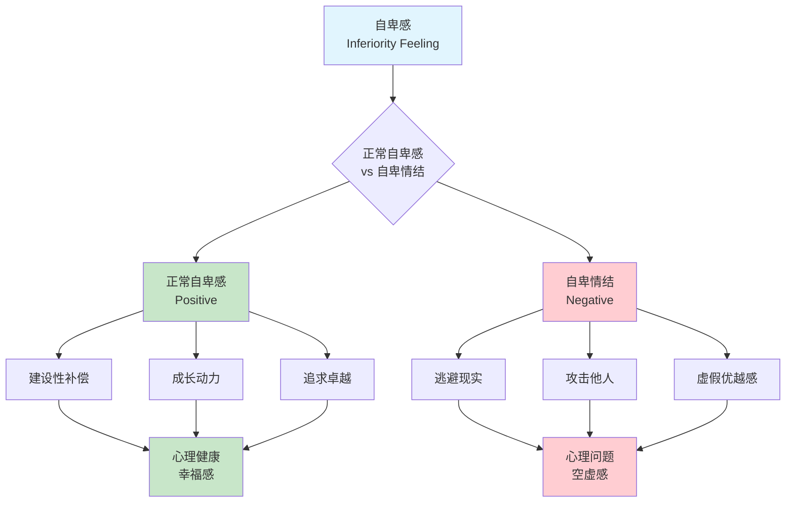
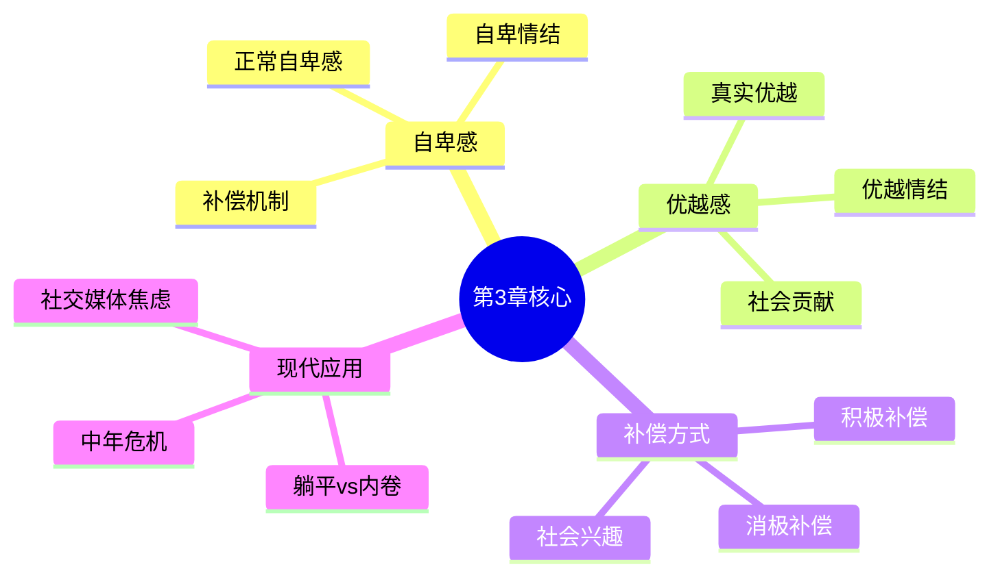

---

category:
  - 书籍拆解

status:
  - 🌲常青
chapter:
number: 3
title: 自卑感与优越感
links:

  - "[[第2章-心灵与身体]]"
  - "[[第4章-追求优越]]"
created: 2026-02-28
updated: 2026-02-28
tags:
  - 自卑与超越
  - 阿德勒
  - 个体心理学
  - 自卑感
  - 优越感
  - 补偿机制
keywords: ["自卑感", "优越感", "自卑情结", "优越情结", "补偿机制", "社会兴趣"]
---

# 第3章 自卑感与优越感

## 📍 章节定位

### 全书位置
> 第3章是全书的**理论核心**，阐述阿德勒心理学的基石——自卑感理论。承接第2章身心统一观，为理解人类行为动机提供根本解释。本章区分了正常自卑感与病态自卑情结，揭示自卑如何成为人类进步的原动力。

- **全书核心问题**: 自卑感如何转化为成长的动力？
- **本章回答的问题**: 什么是自卑感？自卑感和自卑情结有何不同？如何健康地补偿自卑？
- **角色类型**: 核心理论型，阐述阿德勒心理学最核心的概念
- **论证位置**: 全书理论中枢，承上启下

### 章节序列

| 方向 | 章节标题 | 逻辑连接 |
|------|----------|----------|
| 前章 | [[第2章-心灵与身体]] | 承接身心统一观，阐述身体感受如何引发自卑感 |
| 后章 | [[第4章-追求优越]] | 为优越追求提供动机基础，自卑驱动优越追求 |

### 一句话定位
> 第3章阐述自卑感的本质——自卑感是人类正常的、普遍的状态，是追求优越的原动力。关键在于如何补偿：积极补偿带来成长，消极补偿导致自卑情结或优越情结。

---

## 🔍 信息来源与质量评级

### 检索记录

| 轮次 | 检索工具 | 检索关键词 | 质量评级 | 核心来源 |
|------|----------|------------|----------|----------|
| 第一轮 | 主读书笔记 | "自卑与超越 观点1 自卑感" | ⭐⭐⭐ | 已拆解主记录 |
| 第二轮 | MCP检索 | "阿德勒 自卑感 自卑情结 区别" | ⭐⭐⭐ | 豆瓣、知乎深度解读 |

### 核心信息来源

**⭐⭐⭐ 权威来源**：
- 阿德勒《自卑与超越》原著
- 主读书笔记的五大核心观点
- 豆瓣高分书评（8.2分）

### 信息整合公式
```
信息整合 = 主读书笔记（5大核心观点）
         + ⭐⭐⭐高价值信息（阿德勒原著精髓）
         + 降维翻译（中学生能懂的生活化语言）
         + Mermaid可视化（自卑感机制图）
```

---

## 🎯 核心观点（三层提取）

### 第一层：表层案例
> 章节中的具体案例、故事、现象

| 案例名称 | 简要描述 | 核心启示 |
|----------|----------|----------|
| 童年的无助感 | 儿童面对成人世界时，自然感到弱小和无助 | 自卑感是人类与生俱来的状态 |
| 器官缺陷者的成就 | 身体有缺陷的人，往往在特定领域取得卓越成就 | 弱点可以转化为优势 |
| 学习不好者成霸王 | 学习成绩差的学生，可能通过霸凌获得虚假优越感 | 消极补偿的危险 |
| 矮个子的企业家 | 身材矮小的人通过商业成功证明自己 | 积极补偿的力量 |
| 社交媒体炫耀 | 朋友圈晒成就、晒财富，背后是自卑的面具 | 优越情结的现代体现 |

### 第二层：中层机制
> 案例背后的运行机制



**自卑感的双重机制**：

| 机制名称 | 组成要素 | 因果链条 |
|----------|----------|----------|
| 正常自卑机制 | 自卑感 → 追求优越 → 积极补偿 | 自卑感 → 承认不足 → 设定目标 → 努力成长 → 真实优越 |
| 自卑情结机制 | 自卑感 → 否认逃避 → 消极补偿 | 自卑感 → 否认不足 → 寻找借口 → 攻击/逃避 → 虚假优越 |
| 优越情结机制 | 自卑感 → 掩饰自卑 → 夸大表现 | 自卑感 → 掩饰弱点 → 炫耀成就 → 贬低他人 → 脆弱自信 |

### 第三层：底层规律
> 可迁移的普遍规律

| 规律名称 | 核心陈述 | 适用范围 |
|----------|----------|----------|
| **自卑感定律** | 自卑感是人类正常的、普遍的状态，是追求优越的原动力。关键在于如何补偿——积极补偿转化为社会贡献，消极补偿导致心理问题。 | 心理咨询、教育实践、自我成长 |
| **补偿机制定律** | 自卑感的补偿方式决定心理结果——积极补偿带来真实成长和幸福感，消极补偿导致虚假优越感和心理问题。 | 特殊教育、职业发展、人格塑造 |
| **优越感本质定律** | 真正的优越感来自社会贡献，而非个人比较。优越情结是自卑感的面具。 | 心理评估、领导力发展、人际交往 |

---

## 💬 降维翻译

### 观点1: 自卑感是人类进步的引擎

#### 原文表达
> "自卑感本身不异常，它是人类地位增进的原因。我们都有不同程度的自卑感，因为我们都发现自己所处的地位是我们希望改进的。"

#### 降维翻译（中学生能懂）
觉得自己不够好，其实是好事。正因为觉得不够好，你才会想变得更好。阿德勒说，自卑感是推动人类进步的燃料，不是什么见不得人的事。

#### 日常类比（奶奶能懂）
就像小孩子刚学走路，总会觉得自己走得不如大人稳，这种"不够好"的感觉，会让孩子一直练一直练，直到真的走稳了。要是孩子觉得自己走得挺好的，就不会进步了。

#### 检验
- Q: 如果一个中学生问你"我总觉得自己不够好，是不是有问题？"
- A: 没有问题，这是正常的。阿德勒说，每个人都觉得自己不够好，这种感觉会推动你进步。关键是不要用自卑做借口放弃努力。

### 观点2: 自卑情结 vs 正常自卑

#### 原文表达
> "自卑情结是指：当一个人面对一个他无法适当应对的问题时，他表示绝对无法解决这个问题，这时出现的就是自卑情结。"

#### 降维翻译（中学生能懂）
正常的自卑是"我觉得我不够好，我要努力变好"；自卑情结是"因为我...所以我做不到，我也不会去尝试"。前者让你进步，后者让你放弃。

#### 日常类比（奶奶能懂）
就像考试，正常自卑的孩子会想"这次没考好，我要更努力"；自卑情结的孩子会说"我就是笨，再怎么学也没用，不学了"。一个是动力，一个是借口。

#### 记忆要点
- 关键词：自卑感→补偿→两种结果
- 核心区别：正常自卑=承认+努力；自卑情结=否认+放弃

### 观点3: 优越情结是自卑的面具

#### 原文表达
> "如果有人骄傲自大，那一定是因为他有自卑感。"

#### 降维翻译（中学生能懂）
那些特别爱炫耀、特别傲慢的人，其实内心很自卑。他们用炫耀来掩饰自己觉得自己不够好。真正自信的人，不需要证明自己厉害。

#### 日常类比（奶奶能懂）
就像有些孩子，明明学习不好，却在其他方面特别爱显摆，还老嘲笑别人。这种孩子其实心里很不自信，怕别人看不起，所以先去贬低别人。真正厉害的孩子，反而不爱炫耀。

#### 记忆要点
- 关键词：优越情结=自卑的面具
- 核心逻辑：炫耀 → 掩饰自卑 → 虚假自信 → 更脆弱

### 观点4: 积极补偿 vs 消极补偿

#### 原文表达
> "没有人能长期忍受自卑感，它一定会让他采取某种行动来解除自己的紧张状态。"

#### 降维翻译（中学生能懂）
你不可能一直觉得自己不够好，一定会想办法改变。但有两种改法：一种是真努力，变强；一种是装样子，骗自己。前者是积极补偿，后者是消极补偿。

#### 日常类比（奶奶能懂）
就像个子矮的孩子，有的会努力读书、学技能，用其他方面的优秀来证明自己；有的却会欺负同学、搞小团体，用霸道来显示自己"厉害"。两种都是在补偿自卑，但结果完全不同。

#### 记忆要点
- 关键词：积极补偿=真实成长；消极补偿=虚假优越
- 核心逻辑：承认弱点 → 设定目标 → 持续努力 → 真实优越

### 观点5: 社会兴趣是健康的标志

#### 原文表达
> "衡量一个人的心理健康程度，可以看他的社会兴趣发展到什么程度。"

#### 降维翻译（中学生能懂）
一个人心理健不健康，看他是不是真心关心别人、愿意帮助别人。只想着自己的人，再成功也空虚；真心对别人好的人，才是真的健康。

#### 日常类比（奶奶能懂）
就像一棵树，枝叶长得再茂盛，如果根没有扎进土里，风一吹就倒。人也是这样，再有钱再成功，如果不关心别人、没有朋友，心里会很空。关心他人、帮助他人，就像树的根，让人真正站得稳。

#### 记忆要点
- 关键词：社会兴趣=关心他人=心理健康
- 核心逻辑：自卑感 → 积极补偿 → 社会贡献 → 真实优越感

---

## ✨ 金句库

### 原书金句

| 金句 | 适用场景 |
|------|----------|
| "自卑感本身不异常，它是人类地位增进的原因。" | 自卑感论述 |
| "我们都有不同程度的自卑感，因为我们都发现自己所处的地位是我们希望改进的。" | 正常化自卑 |
| "没有人能长期忍受自卑感，它一定会让他采取某种行动来解除自己的紧张状态。" | 补偿机制 |
| "如果有人骄傲自大，那一定是因为他有自卑感。" | 优越情结揭示 |
| "优越感的目标是每个人所独有的，它取决于个人赋予生活的意义。" | 优越追求 |
| "所有失败者都有一个共同点：缺乏社会兴趣。" | 心理健康标准 |
| "重要的是个人对早年经验的诠释，而不是经验本身。" | 早期记忆 |

### 降维金句

| 金句 | 来源观点 | 适用场景 |
|------|----------|----------|
| **自卑感不是病，是人类进步的引擎——觉得自己不够好，才会想要变得更好。** | 自卑感本质 | 激励成长 |
| **关键不是消除自卑感，而是如何补偿它——积极补偿带来成长，消极补偿带来问题。** | 补偿机制 | 心理调适 |
| **自卑情结不是真自卑，是用自卑做借口不敢改变。** | 自卑情结 | 自我觉察 |
| **优越感往往是自卑的面具——真正强大的人，不需要证明自己强大。** | 优越情结 | 人际关系 |
| **你活得好不好，不看你有多少钱，而看你对多少人好。** | 社会兴趣 | 价值观念 |
| **承认弱点→设定目标→持续努力→真实成长。** | 积极补偿 | 行动指南 |
| **否认弱点→寻找借口→攻击逃避→虚假优越。** | 消极补偿 | 自我警示 |
| **童年的经历困不住你，困住你的是你对经历的理解。** | 早期记忆 | 心理释怀 |

## 🔗 当下映射（2026热点锚定）

### 读者困惑与书中答案

|----------|----------|----------|
| 为什么总觉得自己"不够好"？ | 自卑感是正常的，关键是如何补偿 | "原来我不孤单" |
| 为什么越比较越焦虑？ | 消极补偿：用虚假优越感掩饰自卑 | "原来我在逃避" |
| 社交媒体让我更自卑？ | 社会比较放大自卑，需要积极补偿 | "原来我被算法困住了" |
| 为什么35岁如此焦虑？ | 中年危机=优越感追求的瓶颈期，需要转化为贡献感 | "原来我追求错了方向" |
| 为什么越证明自己越空虚？ | 优越情结：用外在成就掩饰自卑 | "原来我在逃避真实的自己" |
| 为什么总想"比别人强"？ | 消极补偿：竞争而非成长 | "原来我方向错了" |

### 💰 财富应用

| 场景 | 具体行动 | 预期效果 |
|------|----------|----------|
| 投资心态 | 用积极补偿替代焦虑，承认不足后学习成长 | 避免因自卑导致的冲动决策 |
| 职业发展 | 将自卑转化为学习动力，而非攻击竞争对手 | 建立真实的职业自信 |
| 创业心态 | 检视创业动机是证明自己还是创造价值 | 避免优越情结导致的盲目扩张 |

### 💼 职场应用

| 场景 | 具体行动 | 适用职级 |
|------|----------|----------|
| 团队协作 | 坦诚承认自己的不足，寻求他人帮助 | 所有职级 |
| 领导力 | 检视自己的管理风格是否有优越情结 | 中高层管理 |
| 职场竞争 | 将竞争转化为自我成长，而非打压他人 | 所有职级 |
| 面对批评 | 用积极补偿面对批评，而非防御性攻击 | 所有职级 |

### 🏠 生活应用

| 场景 | 具体行动 | 见效时间 |
|------|----------|----------|
| 亲子教育 | 教导孩子承认不足，用努力而非借口面对自卑 | 6个月到1年 |
| 夫妻关系 | 检视关系中的优越感是否在掩饰自卑 | 1-3个月 |
| 社交关系 | 减少社交媒体比较，专注真实的人际连接 | 1-2个月 |

### 📱 2026年深度连接

| 热点现象 | 阿德勒视角 | 启发 |
|----------|------------|------|
| **"躺平"vs"内卷"** | 内卷=追求个人优越，躺平=放弃贡献感，两者都是错误的"意义方向" | 找到第三条路：在贡献中找到意义 |
| **社交媒体焦虑** | 算法放大自卑，点赞≠社会兴趣 | 回归真实的人际连接 |
| **中年危机** | 35岁焦虑=优越感追求的瓶颈期 | 从追求优越转向追求贡献 |
| **"原生家庭"热** | 阿德勒1927年就说了：决定你的不是童年，而是你对童年的理解 | 诠释比经历更重要 |
| **"完美人设"崩塌** | 优越情结的脆弱性：越完美的人设，越容易崩溃 | 承认不完美，才是真实的力量 |

---

## 📋 72小时行动计划

1. **明天**：觉察自己今天的自卑触发点，记录至少3个"自卑感→补偿行为"的链条
2. **本周内**：检视自己的一个优越情结表现（如炫耀、贬低他人），尝试用积极补偿替代
3. **需要准备**：建立"自卑补偿日记"，追踪自卑感如何驱动你的行为

---

## 🕸️ 章节关联

### 向上关联 → 整书
- **贡献**：阐述阿德勒心理学最核心的概念——自卑感理论，是理解全书的基础
- **位置**：全书理论中枢，承上启下

### 横向关联 → 章节间

| 章节 | 章节标题 | 关联类型 | 连接描述 |
|------|----------|----------|----------|
| 第1章 | [[第1章-生活的意义]] | 基础 | 生活意义的选择影响自卑感的补偿方向 |
| 第2章 | [[第2章-心灵与身体]] | 承接 | 身体感受引发自卑感，身心统一影响补偿 |
| 第4章 | [[第4章-追求优越]] | 铺垫 | 自卑感是追求优越的原动力 |
| 第5章 | [[第5章-早期的记忆]] | 延伸 | 早期记忆影响自卑感的形成 |
| 第7章 | [[第7章-社会兴趣]] | 核心 | 社会兴趣是健康补偿的标志 |

### 跨书关联 → 知识网络

| 书籍 | 概念 | 关系 | 备注 |
|------|------|------|------|
| [[被讨厌的勇气-岸见一郎]] | 目的论 | 扩展 | 从自卑感出发解释目的性行为 |
| [[思考快与慢]] | 损失厌恶 | 对比 | 自卑感驱动追求优越，损失厌恶驱动风险规避 |
| [[影响力-西奥迪尼]] | 社会认同 | 对比 | 自卑感让人从众，影响力研究如何利用从众 |

### 关联可视化



---

## ❓ 问答设计

### Q1: 自卑感和自卑情结有什么区别？
**认知层次**: 记忆 | **难度**: 低
**答案要点**:
- 自卑感是正常的人类状态，是进步的动力
- 自卑情结是用自卑做借口，放弃努力
- 关键区别在于是否采取建设性行动

### Q2: 如何判断自己是否有优越情结？
**认知层次**: 理解 | **难度**: 中
**答案要点**:
- 频繁炫耀成就、财富、能力
- 习惯性贬低他人抬高自己
- 害怕失败，过度在意他人评价
- 背后是深层的自卑感

### Q3: 积极补偿和消极补偿如何区分？
**认知层次**: 应用 | **难度**: 中
**答案要点**:
- 积极补偿：承认不足→设定目标→持续努力→真实成长
- 消极补偿：否认不足→寻找借口→攻击/逃避→虚假优越
- 判断标准：行为是否带来真实的自我提升

### Q4: 如何将自卑感转化为成长的动力？
**认知层次**: 分析 | **难度**: 中
**答案要点**:
- 承认自卑感是正常的，不要否认
- 明确自己想改进的方向
- 设定具体、可行的目标
- 持续努力，获得真实的能力提升
- 将个人成长转化为社会贡献

### Q5: 为什么阿德勒说"对别人好"是心理健康的标志？
**认知层次**: 创造 | **难度**: 高
**答案要点**:
- 社会兴趣是健康补偿的标志
- 只关注自我的人容易陷入优越情结
- 关心他人带来真实的贡献感
- 贡献感是真实优越感的来源

---

### 间隔复习时间表

| 时间节点 | 复习内容 | 检验方式 |
|----------|----------|----------|
| 1天后 | 回顾核心金句（8句） | 闭书默写 |
| 3天后 | 复述5个核心观点的降维翻译 | 讲给别人听 |
| 7天后 | 画出自卑感双重机制的流程图 | 纸笔绘制 |
| 30天后 | 设计一个基于本章理论的选题 | 输出文章大纲 |

### 闭书自测题

1. 用一句话概括本章的核心观点
2. 列出自卑感与自卑情结的3个区别
3. 解释积极补偿与消极补偿的差异
4. 本章和第4章"追求优越"有什么关联？
5. 为什么阿德勒说优越情结是自卑的面具？

---
