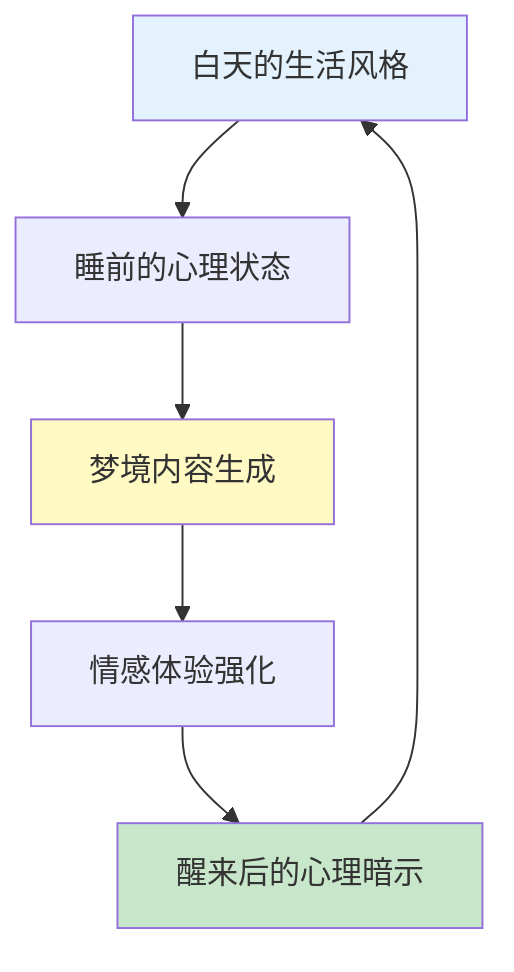
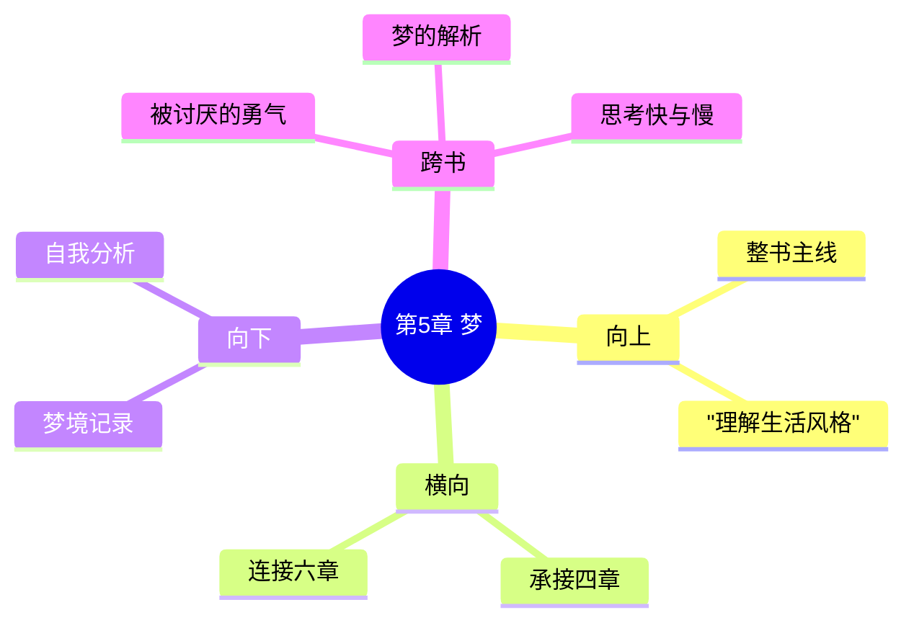

---

category: 
  - 书籍拆解

status: draft
chapter: 
number: 5
title: 梦
links:

  - "[[第4章-追求优越]]"
  - "[[第5章-早期的记忆]]"
created: 2026-02-28
tags:
  - 自卑与超越
  - 阿德勒
  - 个体心理学
  - 梦的解析
  - 生活风格
description: "第5章从个体心理学视角解读梦的本质，阐明梦并非神秘的潜意识密码，而是个体生活风格在睡眠中的延续与表现，承接前章对追求优越目标的探讨，为后章理解早期记忆与生活风格的关系做铺垫"
---

# 第5章 梦

## 📍 章节定位

### 全书位置
> 第5章从个体心理学视角解读梦的本质，阐明梦并非神秘的潜意识密码，而是个体生活风格在睡眠中的延续与表现，承接前章对追求优越目标的探讨，为后章理解早期记忆与生活风格的关系做铺垫

- **全书核心问题**: 自卑感如何转化为成长的动力？个体如何通过克服自卑获得超越？生命的意义究竟何在？
- **本章回答的问题**: 梦的本质是什么？梦境如何反映个体的人生目标？如何通过理解梦来识别个体的潜意识倾向？
- **角色类型**: 潜意识探索型，揭示梦境对生活方式的反映与调节
- **论证位置**: 连接意识追求与潜意识表达的桥梁

### 章节序列
| 方向 | 章节标题 | 逻辑连接 |
|------|----------|----------|
| 前章 | [[第4章-追求优越]] | 从优越目标延伸到潜意识表达 |
| 后章 | [[第5章-早期的记忆]] | 从梦延伸到记忆的选择性机制 |

### 一句话定位
> 第5章揭示梦是个体生活风格在睡眠中的延续，梦不创造新东西，而是为既有的人生态度和行为模式提供情感支持与心理辩护。

---

## 🎯 核心观点

### 第一层：表层案例
> 章节中的具体案例、故事、数据

| 案例名称 | 简要描述 | 核心启示 |
|----------|----------|----------|
| 考试焦虑梦 | 考生梦见考试迟到、忘带准考证 | 梦反映了个体对失败的恐惧和对完美的追求 |
| 追逐逃避梦 | 总是梦见被人追却跑不动 | 梦揭示了逃避型的生活风格 |
| 高处坠落梦 | 反复梦见从高处坠落 | 梦反映了个体对失控感的焦虑 |
| 战斗胜利梦 | 具有攻击倾向的人梦见战胜对手 | 梦强化了其优越追求的模式 |

### 第二层：中层机制
> 案例背后的运行机制、方法论

| 机制名称 | 组成要素 | 因果链条 |
|----------|----------|----------|
| 梦的延续机制 | 白天思维 + 睡眠状态 + 潜意识运作 | 日间焦虑 → 睡前聚焦 → 梦境重演 → 风格固化 |
| 情感辩护机制 | 行为模式 + 梦境场景 + 心理暗示 | 既有决定 → 梦中验证 → 醒来确信 → 行为强化 |
| 目标映射机制 | 人生目标 + 梦境象征 + 潜意识表达 | 优越目标 → 梦境象征 → 潜意识确认 → 目标强化 |

### 第三层：底层规律
> 可迁移的普遍规律

| 规律陈述 | 抽象层级 | 适用范围 |
|----------|----------|----------|
| **意识延续定律**: 梦是清醒思维的延续，而非独立的心理活动 | 认知心理学 | 梦境分析、心理咨询 |
| **风格一致定律**: 梦的内容总是与个体的生活风格保持一致 | 个体心理学 | 人格评估、自我认知 |
| **辩护强化定律**: 梦为个体的既有行为模式提供心理辩护 | 心理动力学 | 行为改变、认知重构 |

---

## 💬 降维翻译

### 观点1: 梦是清醒思维的延续

#### 原文表达
> "梦并不能为我们解决新问题，它只是延续我们在清醒时的思维状态。梦是生活风格的附属品，而非潜意识的秘密通道。"

#### 降维翻译（中学生能懂）
梦不是什么神秘的预言，也不是帮你解决难题的工具。它就是你在睡觉时继续想白天想的事。白天担心什么，晚上就梦什么。

#### 日常类比（奶奶能懂）
就像小孩子白天玩游戏太投入，晚上睡觉嘴里还念叨着游戏里的事。他的梦就是白天心思的继续，不是在解决什么新问题。

---

### 观点2: 梦反映个体的人生目标

#### 原文表达
> "梦的内容总是与我们的优越目标一致。我们梦见的是我们想要成为的样子，或者是我们担心无法成为的样子。"

#### 降维翻译（中学生能懂）
你做梦的内容跟你平时想成为什么样的人有很大关系。想当运动员的人会梦见比赛，想当学霸的人会梦见考试。梦就是你内心目标的另一种表达。

#### 日常类比（奶奶能懂）
就像一个想当医生的孩子，做梦都在给别人看病；一个怕考试的学生，做梦都在考场。梦就是把你心里最重要的事，换个方式演出来。

---

### 观点3: 梦为行为模式提供心理辩护

#### 原文表达
> "梦常为我们的行为进行辩护，让我们更容易继续现有的生活方式。梦不是在提出新的可能性，而是在强化旧有的决定。"

#### 降维翻译（中学生能懂）
我们经常通过做梦，让自己觉得现在的生活方式是对的。梦不是给我们新主意，而是帮我们找理由坚持原来的做法。

#### 日常类比（奶奶能懂）
就像一个不想出门的人，可能会梦见外面下雨、路上堵车，醒来就觉得"看吧，我就说不该出门"。梦帮他找到了继续待在家里的借口。

#### 检验
- Q: 如果一个中学生问你梦到底有什么用？
- A: 梦就是你在睡觉时继续想白天的事。它不会帮你解决新问题，但会让你更相信自己的想法是对的。所以不用太在意梦预示什么，它只是你内心想法的另一种表达。

---

## ✨ 金句库

### 原书金句
| 金句 | 适用场景 |
|------|----------|
| "梦并不能为我们解决问题，它只是延续我们在清醒时的思维状态。" | 梦的科学解读 |
| "梦是生活风格的附属品，而非潜意识的秘密通道。" | 打破神秘感 |
| "梦的内容总是与我们的生活风格一致。" | 人格分析 |
| "我们通过梦为自己的行为辩护。" | 心理防御 |
| "梦不是创造，而是强化。" | 梦的功能 |

### 降维金句
| 金句 | 适用场景 |
|------|----------|
| 梦是白天心思的夜间重播 | 释梦误区纠正 |
| 梦不预言未来，只反映现在 | 打破迷信 |
| 你是什么人，就做什么梦 | 生活风格分析 |
| 梦是给自己的心理安慰剂 | 行为模式解读 |

## 🔗 当下映射

### 💰 财富应用
| 场景 | 具体行动 | 预期效果 |
|------|----------|----------|
| 投资决策 | 记录投资相关梦境，觉察潜在焦虑 | 提高风险意识，避免情绪化决策 |
| 消费行为 | 分析消费相关梦境，了解真实需求 | 培养理性消费心态 |

### 💼 职场应用
| 场景 | 具体行动 | 所需能力 |
|------|----------|----------|
| 压力管理 | 通过梦境察觉潜在工作压力 | 自我觉察能力 |
| 职业规划 | 分析职业相关梦境以调整方向 | 自我反思能力 |

### 🏠 生活应用
| 场景 | 具体行动 | 可行性 |
|------|----------|--------|
| 人际关系 | 记录与他人相关的梦以洞察人际问题 | 高 |
| 自我认知 | 持续记录梦境分析生活风格模式 | 高 |

### 72小时行动计划
1. **明天**：开始记录睡前的主要想法，观察是否与后续梦境相关
2. **本周内**：记录至少3个梦的内容，分析它们如何反映你的生活态度
3. **需要准备资源**：床头笔记本记录梦境内容

---

## 🕸️ 章节关联

### 向上关联 → 整书
- **贡献**: 为理解个体潜意识中的生活风格运作提供了独特视角
- **位置**: 连接意识追求与潜意识表达的中间环节

### 横向关联 → 章节间
| 章节编号 | 章节标题 | 关联类型 | 连接描述 |
|----------|----------|----------|----------|
| 第4章 | [[第4章-追求优越]] | 承接 | 从优越追求延伸到梦境中的目标反映 |
| 第6章 | [[第5章-早期的记忆]] | 承接 | 从梦延伸到记忆的选择性机制 |
| 第1章 | [[第1章-生活的意义]] | 支撑 | 梦境揭示生活意义的深层表达 |

### 向下关联 → 具体应用
| 应用场景 | 难度 | 前置知识 |
|----------|------|----------|
| 梦境记录分析 | 低 | 日常自我反思习惯 |
| 生活风格理解 | 中 | 基础人格理论知识 |
| 心理咨询实践 | 高 | 专业心理咨询技能 |

### 跨书关联 → 知识网络
| 书籍 | 概念 | 关系 | 备注 |
|------|------|------|------|
| [[被讨厌的勇气-岸见一郎]] | 目的论 | 支持 | 梦也服务于当下的心理目的 |
| [[梦的解析-西格蒙德·弗洛伊德]] | 梦的象征意义 | 对比 | 阿德勒更强调梦的现实功能 |
| [[思考快与慢]] | 系统1思维 | 相似 | 梦是快速、自动化的心理过程 |

### 关联可视化

---

## ❓ 问答设计

### Q1: (记忆型) 阿德勒认为梦的本质是什么？
**认知层次**: 记忆
**难度**: 低
**答案要点**:
- 梦是清醒时思维状态的延续
- 梦非潜意识的秘密通道
- 梦反映个体的生活风格

### Q2: (理解型) 为什么梦与个体生活风格保持一致？
**认知层次**: 理解
**难度**: 中
**答案要点**:
- 生活风格已形成惯性模式
- 潜意识继续运作白日思维
- 梦为既有模式提供心理支持

### Q3: (应用型) 如何分析自己的梦境以了解人生目标？
**认知层次**: 应用
**难度**: 中
**答案要点**:
- 记录梦的细节内容
- 找出与日常目标的关联
- 评估梦中反映的追求倾向

### Q4: (分析型) 梦对个体行为模式有什么促进作用？
**认知层次**: 分析
**难度**: 中
**答案要点**:
- 为现行行为提供心理辩护
- 强化既有决定与态度
- 巩固固定的生活模式

### Q5: (理解型) 阿德勒的梦的观点与弗洛伊德有何不同？
**认知层次**: 理解
**难度**: 中
**答案要点**:
- 弗洛伊德: 梦是通往潜意识的路径，需要解码
- 阿德勒: 梦是生活风格的延续，直接反映
- 目的论 vs 精神分析的理论差异

---
