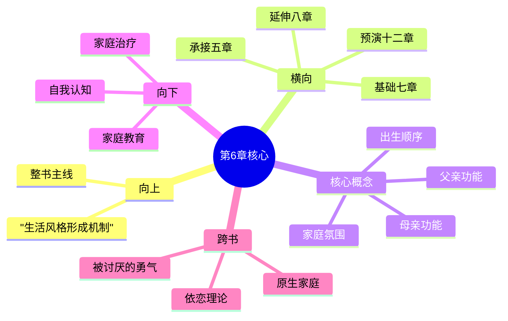

---

category: 
  - 书籍拆解

status: draft
chapter: 
number: 6
title: 家庭的影响
links:

  - "[[第5章-早期的记忆]]"
  - "[[第7章-社会兴趣]]"
  - "[[第8章-学校的影响]]"
created: 2026-02-28
tags:
  - 自卑与超越
  - 阿德勒
  - 个体心理学
  - 家庭影响
  - 原生家庭
  - 出生顺序
---

# 第6章 家庭的影响

## 📍 章节定位

### 全书位置
> 第6章是全书理论体系中承上启下的关键章节，系统阐述家庭环境对个体人格形成的决定性影响，承接前章对早期记忆的分析，为后章社会兴趣的培养提供实践基础，是理解个体生活风格形成根源的核心章节

- **全书核心问题**: 自卑感如何转化为成长的动力？个体如何通过克服自卑获得超越？生命的意义究竟何在？
- **本章回答的问题**: 家庭如何塑造个体的人格基础？父母的角色和功能分别是什么？出生顺序如何影响人格发展？
- **角色类型**: 根源探索型，追溯个体生活风格形成的社会起点
- **论证位置**: 承接个体心理分析，开启社会环境影响研究

### 章节序列
| 方向 | 章节标题 | 逻辑连接 |
|------|----------|----------|
| 前章 | [[第5章-早期的记忆]] | 从记忆机制追溯到家庭源头 |
| 后章 | [[第7章-社会兴趣]] | 家庭是社会兴趣培养的第一场所 |

### 一句话定位
> 第6章揭示家庭是人格塑造的第一现场，父母的合作态度、家庭氛围以及个体在家庭中的位置，共同决定了孩子对生活的基本态度和社会兴趣的发展方向。

---

## 🎯 核心观点

### 第一层：表层案例
> 章节中的具体案例、故事、数据

| 案例名称 | 简要描述 | 页码 | 关键引文 |
|----------|----------|------|----------|
| 被溺爱的长子 | 独占父母关注后因弟妹出生而失宠 | p.130-133 | "失去王位的体验深刻影响其生活风格" |
| 被忽视的次子 | 永远追赶哥哥的次子形成竞争型人格 | p.135-138 | "总是试图超越年长者的影子" |
| 最小的孩子 | 永远被保护的幼子可能形成依赖型人格 | p.140-142 | "永远有人为他解决问题" |
| 独生子女 | 缺乏兄弟姐妹竞争经验的孩子 | p.145-147 | "习惯成为家庭中心" |

### 第二层：中层机制
> 案例背后的运行机制、方法论

| 机制名称 | 组成要素 | 因果链条 | 证据来源 |
|----------|----------|----------|----------|
| 母婴依恋机制 | 母亲态度 + 婴儿响应 + 关系建立 | 母亲关爱 → 婴儿信任 → 建立依恋 → 社会兴趣萌芽 | 临床观察 |
| 父亲功能机制 | 父亲榜样 + 权威形象 + 合作示范 | 父亲参与 → 权威内化 → 社会规则学习 → 合作意识形成 | 家庭研究 |
| 出生顺序机制 | 家庭位置 + 期望差异 + 竞争环境 | 出生顺序 → 角色定位 → 行为模式 → 人格特征 | 心理分析 |
| 家庭氛围机制 | 父母关系 + 家庭沟通 + 情感环境 | 夫妻合作 → 和谐氛围 → 安全感 → 健康人格 | 长期追踪 |

### 第三层：底层规律
> 可迁移的普遍规律

| 规律陈述 | 抽象层级 | 知识连接 | 适用范围 |
|----------|----------|----------|----------|
| 家庭是人格的第一学校 | 发展心理学 + 社会学 | 依恋理论、社会化理论 | 教育实践、心理咨询 |
| 父母合作是孩子的第一课 | 家庭系统理论 + 社会学习理论 | 班杜拉观察学习理论 | 婚姻辅导、家庭教育 |
| 出生顺序塑造人格差异 | 个体心理学 + 人格心理学 | 阿德勒出生顺序理论 | 人格分析、职业规划 |

---

## 💬 降维翻译

### 观点1: 母亲是孩子社会兴趣的第一位教师

#### 原文表达
> "母亲是孩子通往社会生活的第一座桥梁。如果母亲无法建立与孩子的良好联系，如果她不能将孩子的兴趣扩展到父亲和其他人身上，那么孩子对社会生活的适应就会遇到严重困难。" —— p.125

#### 降维翻译（中学生能懂）
妈妈是孩子认识世界的第一扇窗户。如果妈妈不能和孩子建立好关系，或者只让孩子关注自己而不教他关心别人，那孩子长大后就会很难适应社会，不知道怎么和他人相处。

#### 日常类比（奶奶能懂）
就像小鸭子跟着母鸭学游泳一样，孩子跟着妈妈学做人。妈妈对谁好，孩子就学着对谁好；妈妈要是只顾自己不顾别人，孩子也学着只顾自己。妈妈的为人处世，就是孩子的人生第一课。

### 观点2: 父亲的功能是展示合作与责任

#### 原文表达
> "父亲的任务是向孩子证明，他能够以平等的态度与妻子合作，在家庭中承担自己的责任，并且在社会中也能够以同样的合作精神处理问题。" —— p.136

#### 降维翻译（中学生能懂）
爸爸的职责是给孩子做榜样，展示如何平等地对待妈妈、承担家庭责任，并且在社会上也用同样合作的态度来处理问题。爸爸怎么做人，孩子就学着怎么做。

#### 日常类比（奶奶能懂）
爸爸就像是家里的顶梁柱，但不能光撑着，还得会弯腰。对孩子来说，爸爸是第一个"外面世界的人"，爸爸怎么对待妈妈、怎么对待工作、怎么对待邻居，孩子都看在眼里。爸爸有担当、会合作，孩子自然也学会有担当、会合作。

### 观点3: 出生顺序深刻影响人格形成

#### 原文表达
> "每个孩子在家庭中的位置都会产生特定的心理效应。长子曾独享父母的爱，而后失去这种特权；次子永远有一个追赶的目标；最小的孩子永远被保护；独生子女习惯成为中心。每种位置都塑造着不同的人格特征。" —— p.140

#### 降维翻译（中学生能懂）
在家庭中排行不同，性格也会不一样。老大曾经是唯一的孩子，后来要分享父母的爱；老二永远在追着哥哥姐姐跑；最小的总是被照顾；独生子习惯了所有人都围着自己转。这些经历都会影响一个人长大后的性格。

#### 日常类比（奶奶能懂）
就像一树上的果子，长在不同位置味道就不一样。老大像先熟的果子，早早被捧在手心，后来有弟妹了，就要学会分享；老二呢，总想着比哥哥姐姐更强，憋着一股劲儿；老幺呢，从小被呵护，可能就娇气些。这些"位置"造就了不同的性格。

### 观点4: 父母关系决定孩子的合作观

#### 原文表达
> "如果父母之间不能平等合作，如果他们彼此敌对或漠不关心，孩子就很难发展出健康的合作能力。孩子对婚姻和人际关系的最初印象，来自于父母之间的互动方式。" —— p.148

#### 降维翻译（中学生能懂）
爸爸妈妈怎么相处，决定了孩子怎么理解"合作"这件事。如果爸妈互相尊重、一起做事，孩子就学会怎么和人合作；如果爸妈老是吵架或者不理对方，孩子就很难学会与人好好相处。

#### 日常类比（奶奶能懂）
父母的关系就是孩子学做人的"活教材"。爹妈和和气气的，遇事商量着办，孩子就学会遇事好商量；爹妈天天吵架、各顾各的，孩子要么学得胆小怕事，要么学得暴躁不合作。古人说"家和万事兴"，这"和"字，先在父母的相处里。

#### 检验
- Q: 如果一个中学生问你家庭对一个人有多重要？
- A: 家庭就像是人格的"出厂设置"。你在家里学到的东西——怎么和人相处、怎么看待自己、怎么处理问题——会跟着你一辈子。当然，后来可以调整，但基础是在家里打的。

---

## ✨ 金句库

### 原书金句
| 金句 | 页码 | 适用场景 |
|------|------|----------|
| "母亲是孩子通往社会生活的第一座桥梁。" | p.125 | 母亲角色阐述 |
| "父亲的任务是证明他能够以平等的态度与妻子合作。" | p.136 | 父亲功能定位 |
| "每个孩子在家庭中的位置都会产生特定的心理效应。" | p.140 | 出生顺序理论 |
| "孩子对婚姻和人际关系的最初印象，来自父母的互动方式。" | p.148 | 家庭影响机制 |
| "幸福的家庭都是相似的，不幸的家庭各有各的不幸。" | p.152 | 家庭氛围总结 |

### 降维金句
| 金句 | 来源观点 | 适用场景 |
|------|----------|----------|
| 妈妈是孩子认识世界的第一扇窗户 | 观点1 | 母教重要性 |
| 爸爸怎么做人，孩子就学着怎么做 | 观点2 | 父亲榜样作用 |
| 家里的排行，藏着性格的密码 | 观点3 | 出生顺序效应 |
| 父母的相处，是孩子的第一课 | 观点4 | 夫妻关系影响 |
| 家庭是人格的第一所学校 | 全章 | 家庭教育价值 |

## 🔗 当下映射

### 💰 财富应用
| 场景 | 具体行动 | 预期效果 | 风险提示 |
|------|----------|----------|----------|
| 财富传承 | 重视家庭价值观的传递而非仅物质财富 | 培养有担当的接班人 | 避免溺爱导致能力退化 |
| 投资教育 | 从小培养孩子的金钱观和责任感 | 建立健康的财富态度 | 避免过度保护 |

### 💼 职场应用
| 场景 | 具体行动 | 所需能力 | 适用职级 |
|------|----------|----------|----------|
| 领导力发展 | 反思原生家庭对自己的影响 | 自我觉察能力 | 管理层 |
| 团队管理 | 理解员工家庭背景对其行为的影响 | 同理心、分析能力 | 所有管理层 |

### 🏠 生活应用
| 场景 | 具体行动 | 可行性 | 见效时间 |
|------|----------|--------|----------|
| 亲子关系 | 建立合作的夫妻关系作为榜样 | 高 | 长期见效 |
| 自我成长 | 重新审视原生家庭对自己的影响 | 高 | 3-6个月 |

### 72小时行动计划
1. **明天**：回顾自己在家庭中的位置（排行、角色），分析其对当前人格的影响
2. **本周内**：观察一次父母或伴侣的互动方式，记录对孩子/他人可能的示范效应
3. **需要准备资源**：准备一张家庭结构图，标注各成员位置和相互关系

---

## 🕸️ 章节关联

### 向上关联 → 整书
- **贡献**: 为全书"生活风格形成机制"提供家庭维度的完整解释
- **位置**: 阐述个体人格形成的社会起点和第一环境

### 横向关联 → 章节间
| 章节编号 | 章节标题 | 关联类型 | 连接描述 |
|----------|----------|----------|----------|
| 第5章 | [[第5章-早期的记忆]] | 承接 | 早期记忆的选择受家庭环境影响 |
| 第7章 | [[第7章-社会兴趣]] | 基础 | 家庭是社会兴趣培养的第一场所 |
| 第8章 | [[第8章-学校的影响]] | 延伸 | 家庭基础决定学校适应能力 |
| 第12章 | [[第12章-爱情与婚姻]] | 预演 | 父母关系是婚姻观的原型 |

### 向下关联 → 具体应用
| 应用场景 | 难度 | 前置知识 |
|----------|------|----------|
| 家庭治疗 | 高 | 心理咨询专业知识 |
| 家庭教育指导 | 中 | 儿童发展心理学基础 |
| 自我认知探索 | 低 | 基本自我觉察能力 |

### 跨书关联 → 知识网络
| 书籍 | 概念 | 关系 | 备注 |
|------|------|------|------|
| [[被讨厌的勇气-岸见一郎]] | 课题分离 | 补充 | 阿德勒理论的现代应用 |
| 原生家庭-苏珊·福沃德 | 有毒家庭 | 扩展 | 聚焦负面家庭影响 |
| 《依恋》鲍尔比 | 依恋理论 | 深化 | 科学验证母婴依恋机制 |

### 关联可视化

---

## ❓ 问答设计

### Q1: (记忆型) 阿德勒认为母亲在孩子成长中的核心功能是什么？
**认知层次**: 记忆
**难度**: 低
**答案要点**:
- 母亲是孩子通往社会生活的第一座桥梁
- 负责将孩子的兴趣扩展到他人身上
- 建立孩子对社会生活的基本信任

### Q2: (理解型) 为什么出生顺序会影响人格形成？
**认知层次**: 理解
**难度**: 中
**答案要点**:
- 不同位置意味着不同的期望和待遇
- 形成不同的竞争环境和角色定位
- 塑造了不同的行为模式和心理特征

### Q3: (应用型) 如何运用阿德勒的家庭理论改善亲子关系？
**认知层次**: 应用
**难度**: 中
**答案要点**:
- 建立父母间的合作关系
- 根据孩子位置给予针对性关注
- 扩展孩子的社会兴趣

### Q4: (分析型) 父亲功能缺失对孩子发展有什么影响？
**认知层次**: 分析
**难度**: 中
**答案要点**:
- 缺乏权威和规则的示范
- 合作意识发展受阻
- 对男性角色认知可能偏差

### Q5: (创造型) 设计一套基于阿德勒理论的家庭教育方案？
**认知层次**: 创造
**难度**: 高
**答案要点**:
- 父母合作示范设计
- 根据出生顺序的差异化关注
- 社会兴趣培养活动

### Q6: (理解型) 阿德勒的"家庭影响"与"原生家庭"概念有何异同？
**认知层次**: 理解
**难度**: 中
**答案要点**:
- 都强调家庭对人格的影响
- 阿德勒强调诠释而非决定
- 原生家庭概念更强调创伤性影响

### Q7: (应用型) 如何帮助"被溺爱"的孩子发展独立能力？
**认知层次**: 应用
**难度**: 中
**答案要点**:
- 逐步减少过度保护
- 创造独立解决问题的机会
- 建立合理的责任分担

### Q8: (分析型) 长子/长女与次子/次女的心理特征有何典型差异？
**认知层次**: 分析
**难度**: 中
**答案要点**:
- 长子：曾经独享、可能权威型或失落型
- 次子：追赶者心态、竞争意识强
- 各有优势和潜在问题

### Q9: (应用型) 在心理咨询中如何运用出生顺序分析？
**认知层次**: 应用
**难度**: 中
**答案要点**:
- 了解来访者家庭位置
- 分析其形成的行为模式
- 识别需要调整的适应不良模式

### Q10: (创造型) 如何设计一个"家庭氛围评估工具"？
**认知层次**: 创造
**难度**: 高
**答案要点**:
- 父母合作程度指标
- 情感表达频率测量
- 冲突处理方式评估

### Q11: (分析型) 家庭中最小的孩子通常有什么心理特征？
**认知层次**: 分析
**难度**: 中
**答案要点**:
- 可能被过度保护
- 依赖性较强
- 也可能发展出独特竞争力

### Q12: (理解型) 为什么阿德勒强调父母要"平等合作"？
**认知层次**: 理解
**难度**: 中
**答案要点**:
- 为孩子提供合作的榜样
- 避免孩子形成不平等观念
- 培养健康的社会兴趣

### Q13: (应用型) 独生子女家庭如何弥补"缺乏兄弟姐妹竞争"的不足？
**认知层次**: 应用
**难度**: 中
**答案要点**:
- 创造同伴互动机会
- 参与团队活动
- 培养分享和合作习惯

### Q14: (分析型) 母亲功能与父亲功能在人格塑造中如何互补？
**认知层次**: 分析
**难度**: 中
**答案要点**:
- 母亲：依恋、信任、情感连接
- 父亲：权威、规则、社会拓展
- 两者共同构建完整人格基础

### Q15: (创造型) 如何将阿德勒的家庭理论应用于学校教育？
**认知层次**: 创造
**难度**: 高
**答案要点**:
- 理解学生家庭背景差异
- 针对性设计教育策略
- 建立家校合作机制

---
