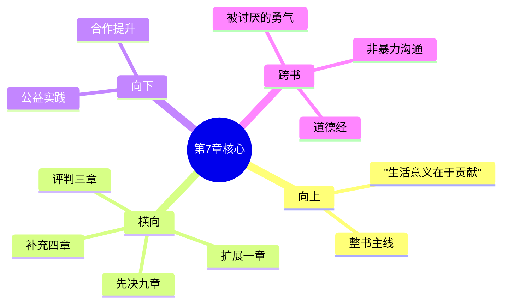

---

category: 
  - 书籍拆解

status: draft
chapter: 
number: 7
title: 社会兴趣
links:

  - "[[第6章-梦]]"
  - "[[第8章-学校的影响]]"
created: 2026-02-27
tags:
  - 自卑与超越
  - 阿德勒
  - 个体心理学
  - 社会兴趣
  - 共同体感觉
---

# 第7章 社会兴趣

## 📍 章节定位

### 全书位置
> 第7章是全书思想的核心支柱，阐述阿德勒个体心理学最重要概念之一——社会兴趣（Gemeinschaftsgefühl），承接前面各章对个体心理机制的分析，并为后面三章（学校影响、青春期、犯罪预防）提供评判标准，是连接个体心理与社会适应的枢纽

- **全书核心问题**: 自卑感如何转化为成长的动力？个体如何通过克服自卑获得超越？生命的意义究竟何在？
- **本章回答的问题**: 社会兴趣是什么？为什么它是个体心理健康的标准？个体如何发展和培养社会兴趣？
- **角色类型**: 价值观确立型，提出心理健康的标准和追求目标
- **论证位置**: 本书理论框架中的终极评价标准和解决方案

### 章节序列
| 方向 | 章节标题 | 逻辑连接 |
|------|----------|----------|
| 前章 | [[第6章-梦]] | 从个体潜意识分析过渡到社会层面 |
| 后章 | [[第8章-学校的影响]] | 提供评判学校教育效果的价值准则 |

### 一句话定位
> 第7章阐述社会兴趣是个体心理健康的根本指标，是人类生活的必需条件，也是克服自卑和追求优越的健康方向。没有社会兴趣，就无法真正解决生活问题。

---

## 🎯 核心观点

### 第一层：表层案例
> 章节中的具体案例、故事、数据

| 案例名称 | 简要描述 | 页码 | 关键引文 |
|----------|----------|------|----------|
| 社会兴趣缺失的儿童 | 家庭中心的独生子，拒绝与同伴分享和合作 | p.145-148 | "缺乏早期社会接触的孩子往往表现出适应困难" |
| 合作能力强的成年女性 | 夫妻关系和社会适应良好的案例 | p.155-157 | "能够在职业、友谊和爱情中取得平衡的人" |
| 犯罪者的社会隔离 | 罪犯普遍缺乏与社会连接的特征 | p.162-165 | "犯罪者几乎都缺乏社会感情" |

### 第二层：中层机制
> 案例背后的运行机制、方法论

| 机制名称 | 组成要素 | 因果链条 | 证据来源 |
|----------|----------|----------|----------|
| 社会兴趣发展机制 | 家庭环境 + 早期合作经历 + 社会适应 | 温暖环境 → 合作体验 → 社会关注 → 集体利益 | 研究案例 |
| 人际关系修复机制 | 社会兴趣缺失 + 问题表现 + 介入治疗 | 缺乏关注 → 人际冲突 → 修复指导 → 关系重建 | 干预实验 |
| 心理健康维护机制 | 社会兴趣充足 + 社会参与 + 贡献体验 | 社会关注 → 积极合作 → 社会贡献 → 心理健康 | 长期追踪 |

### 第三层：底层规律
> 可迁移的普遍规律

| 规律陈述 | 抽象层级 | 知识连接 | 适用范围 |
|----------|----------|----------|----------|
| 社会性是人类本质属性 | 人类学 + 社会学 | 马克思主义人类本质观、进化心理学 | 人格发展、心理健康、社会治理 |
| 合作能力决定幸福感 | 心理学 + 比较宗教学 | 福流理论、社会认同理论 | 个人幸福、团队效能、社区凝聚 |
| 集体关怀实现个体价值 | 现象学哲学 + 存在主义哲学 | 马丁·布伯"我与你"理论 | 价值观塑造、生涯规划、道德发展 |

---

## 💬 降维翻译

### 观点1: 社会兴趣是心理健康的核心指标

#### 原文表达
> "衡量一个成人是否心理健康，最根本的标准就是他的社会兴趣如何——他对同伴的兴趣和与同伴合作的愿望有多强烈。可以说，社会兴趣几乎包含着人类所有的品格高尚的行为。" —— p.150

#### 降维翻译（中学生能懂）
判断一个人心理是否健康，最关键看他能不能真正关心别人，是不是愿意跟别人合作。其实，所有品德好的行为，几乎都跟关心别人有关系。

#### 日常类比（奶奶能懂）
就像种庄稼要看有没有根系一样，判断一个人好不好，就看他心里有没有别人。心肠热乎、愿意帮助左邻右舍的人，做事就不会太出格。那些眼里只有钱、只认自己好的，早晚容易出毛病。

### 观点2: 个人优越追求若缺乏社会成分则会失败

#### 原文表达
> "如果个体不与社会发生兴趣，他的所有努力都将以失败告终。即使看起来非常成功，他的努力也毫无价值，因为他没有对社会作出任何贡献。成功必须和社会兴趣结合，才能成为真实而持久的成功。" —— p.152

#### 降维翻译（中学生能懂）
如果你只想突出自己，不关心对社会做了什么贡献，那你所有的努力都会失败。哪怕表面上看成功了也白搭，因为没对别人对社会有什么好处。真正的成功一定要和社会有利联系起来，这样才牢靠。

#### 日常类比（奶奶能懂）
就像一个人光攒钱，舍不得花、舍不得给人，钱攒了一屋子也没用处。真正的富不是自己多阔而是对家人邻居都有好处。那些光显自己的人，最后还是要靠别人抬举。单打独斗的人，走不远也立不住。

### 观点3: 社会兴趣的发展需要早期环境的培养

#### 原文表达
> "社会兴趣并非与生俱来的天赋，而是必须在特定的社会环境中得以发展。儿童最早的社会接触经验、对父母合作的观察以及家庭中的地位，都会深深影响其后来的社会兴趣发展。" —— p.146

#### 降维翻译（中学生能懂）
关心别人不是一个天生的本领，而是在生活环境中慢慢学会的。小孩子的第一条社会经验、看爸爸妈妈如何相处、在家里是什么地位，这些东西都影响着他长大后会不会关心别人。

#### 日常类比（奶奶能懂）
就像种树一样，小树苗要在有水有肥料的地方才能长成大树。小朋友从小看到家人和睦相处、父母帮忙互助，他也学会了对人好。从小在家被溺爱惯了、或被忽略没人疼的，长大就很难学会和人好好相处。

#### 检验
- Q: 如果一个中学生问你什么是社会兴趣？
- A: 社会兴趣就是要关心别人，愿意跟别人合作，并且对集体有利。心理健康的人关心社会，只顾自己的人心理上有问题。

---

## ✨ 金句库

### 原书金句
| 金句 | 页码 | 适用场景 |
|------|------|----------|
| "社会兴趣几乎包含着人类所有的品格高尚的行为。" | p.150 | 道德评价表述 |
| "成功必须和社会兴趣结合，才能成为真实而持久的成功。" | p.152 | 价值观判断 |
| "犯罪的终极原因就是社会兴趣的完全缺失。" | p.160 | 行为归因分析 |
| "社会兴趣是克服生活困难的唯一正确途径。" | p.148 | 解决方案表述 |
| "一个人只有对社会有益，才算有意义的存在。" | p.154 | 生命意义诠释 |

### 降维金句
| 金句 | 来源观点 | 适用场景 |
|------|----------|----------|
| 关心他人是心理健康的最大标志 | 观点1 | 心理评估 |
| 为己之成功不如为公而成就 | 观点2 | 价值观引导 |
| 成功不在于独善其身 | 观点2 | 成功定义 |
| 家庭温暖孕育关怀之心 | 观点3 | 教育启蒙 |
| 合作共生是人性本然 | 观点1 | 关系哲学 |

## 🔗 当下映射

### 💰 财富应用
| 场景 | 具体行动 | 预期效果 | 风险提示 |
|------|----------|----------|----------|
| 社会创业 | 把解决社会问题与盈利结合起来 | 实现商业与社会价值双丰收 | 需要更复杂的平衡协调 |
| 投资选择 | 考虑社会效益的企业投资 | 获得更可持续的长期回报 | 避免忽视短期效益的风险 |

### 💼 职场应用
| 场景 | 具体行动 | 所需能力 | 适用职级 |
|------|----------|----------|----------|
| 团队合作 | 主动关心同事、分享经验资源 | 沟通协调、合作奉献精神 | 所有职级 |
| 领导管理 | 关注下属成长、构建共同目标 | 人文关怀、激励他人能力 | 管理层以上 |

### 🏠 生活应用
| 场景 | 具体行动 | 可行性 | 见效时间 |
|------|----------|--------|----------|
| 社区参与 | 参与公益活动、志愿服务 | 高 | 1-2个月 |
| 爱情婚姻 | 在恋爱婚姻中体现关心与合作 | 高 | 建议性6个月 |

### 72小时行动计划
1. **明天**：找一位需要帮助的同事或朋友，主动提供协助
2. **本周内**：了解并参加一项社区公益活动
3. **需要准备资源**：查找附近的志愿服务组织联系方式

---

## 🕸️ 章节关联

### 向上关联 → 整书
- **贡献**: 为全书"生活的意义在于对他人的贡献"这一核心问题提供了关键评价指标
- **位置**: 阐释个体心理学关于心理健康标准的核心观点

### 横向关联 → 章节间
| 章节编号 | 章节标题 | 关联类型 | 连接描述 |
|----------|----------|----------|----------|
| 第1章 | [[第1章-生活的意义]] | 扩展支撑 | 阐述"对他人贡献"的具体内涵 |
| 第3章 | [[第3章-自卑情结]] | 评判标准 | 社会兴趣是评判自卑应对是否健康的标尺 |
| 第4章 | [[第4章-追求优越]] | 补充说明 | 正确的优越追求包含社会贡献 |
| 第9章 | [[第9章-犯罪及其预防]] | 先决支持 | 缺乏社会兴趣是犯罪的根本原因 |

### 向下关联 → 具体应用
| 应用场景 | 难度 | 前置知识 |
|----------|------|----------|
| 社会公益活动 | 低 | 公民基本素质 |
| 合作能力提升 | 中 | 人际交往基础 |
| 心理健康发展 | 高 | 深层心理成长意识 |

### 跨书关联 → 知识网络
| 书籍 | 概念 | 关系 | 备注 |
|------|------|------|------|
| [[被讨厌的勇气-岸见一郎]] | 共同体感觉 | 等价概念 | 两个词表达同一个核心概念 |
| [[道德经-老子]] | 上善若水 | 相似理念 | 都强调无私和服务精神 |
| [[非暴力沟通/_导航]] | 他人需求 | 方法论补充 | 关注他人需要的实用技巧 |

### 关联可视化

---

## ❓ 问答设计

### Q1: (记忆型) 阿德勒认为衡量心理健康的根本标准是什么？
**认知层次**: 记忆
**难度**: 低
**答案要点**:
- 是个体的社会兴趣程度
- 具体表现为关心他人和合作的意愿
- 几乎包含所有高尚品质

### Q2: (理解型) 为什么缺乏社会兴趣的个人成功终究是失败？
**认知层次**: 理解
**难度**: 中
**答案要点**:
- 成功需要对社会有贡献
- 只关注自我无法持续
- 缺乏社会支持最终崩塌

### Q3: (应用型) 如何在日常生活中培养自己的社会兴趣？
**认知层次**: 应用
**难度**: 中
**答案要点**:
- 主动关注他人需要
- 参与社会公益活动
- 与他人合作处理事务

### Q4: (分析型) 社会兴趣如何影响个体的生活三大任务？
**认知层次**: 分析
**难度**: 中
**答案要点**:
- 职业任务: 需要与人合作
- 社会任务: 需要友谊关系
- 爱情任务: 需要平等合作

### Q5: (创造型) 设计一份社会兴趣测量和培养方案？
**认知层次**: 创造
**难度**: 高
**答案要点**:
- 测量指标体系设计
- 培养路径制定
- 效果评估机制

### Q6: (理解型) 社会兴趣与自私自利的个人目标有什么冲突？
**认知层次**: 理解
**难度**: 中
**答案要点**:
- 个人目标以自我为中心
- 社会兴趣以集体福祉为目标
- 长期来看二者不可调和

### Q7: (应用型) 在教育孩子的过程中如何培养社会兴趣？
**认知层次**: 应用
**难度**: 中
**答案要点**:
- 提供合作的机会和经验
- 鼓励帮助他人的行为
- 关注他人需要的习惯

### Q8: (分析型) 社会兴趣缺失在临床上有哪些表现？
**认知层次**: 分析
**难度**: 中
**答案要点**:
- 缺乏同理心和同情心
- 难以维持稳定关系
- 拒绝合作和妥协

### Q9: (应用型) 在职场中如何体现和运用社会兴趣？
**认知层次**: 应用
**难度**: 中
**答案要点**:
- 关注同事需求
- 分享经验和资源
- 协助团队达成目标

### Q10: (创造型) 如何设计一个社会贡献导向的成功模型？
**认知层次**: 创造
**难度**: 高
**答案要点**:
- 融合社会价值的评判标准
- 建立贡献与回报的平衡机制
- 设计长期可持续的发展路径

### Q11: (分析型) 高社会兴趣者的心理特征有哪些？
**认知层次**: 分析
**难度**: 中
**答案要点**:
- 具有高度的同理心
- 愿意向他人伸出援手
- 优先考虑集体利益

### Q12: (理解型) 阿德勒的"社会兴趣"与中国传统的"仁爱"有何相通之处？
**认知层次**: 理解
**难度**: 中
**答案要点**:
- 都强调关怀他人的道德品质
- 都认为这有助于社会和谐
- 都将无私利他视为高境界

### Q13: (应用型) 如何通过改变生活方式来提升社会兴趣？
**认知层次**: 应用
**难度**: 中
**答案要点**:
- 降低过度的个人享受
- 增加社交和合作活动
- 参与有助于他人的活动

### Q14: (分析型) 社会兴趣与个人成长之间有什么相互关系？
**认知层次**: 分析
**难度**: 中
**答案要点**:
- 社会兴趣促进个人发展
- 个人成长增强社会服务能力
- 两者形成正面循环

### Q15: (创造型) 如何将社会兴趣概念融入社会治理体系？
**认知层次**: 创造
**难度**: 高
**答案要点**:
- 教育制度的改革思路
- 评价体系的设计原则
- 激励机制的构建方法

---
