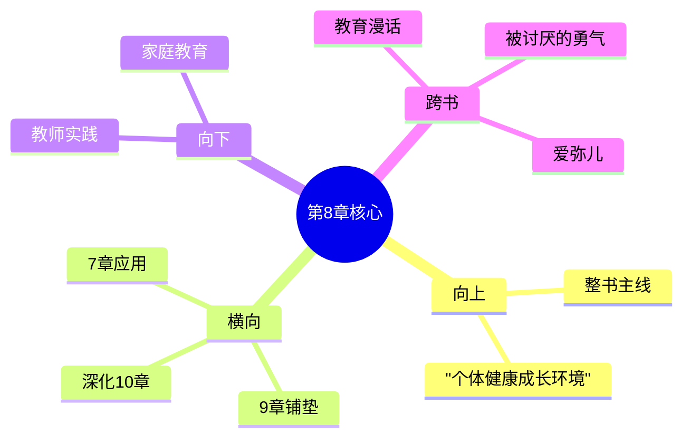

---

category: 
  - 书籍拆解

status: draft
chapter: 
number: 8
title: 学校的影响
links:

  - "[[第7章-社会兴趣]]"
  - "[[第9章-青春期]]"
created: 2026-02-27
tags:
  - 自卑与超越
  - 阿德勒
  - 个体心理学
  - 学校教育
  - 教育心理
---

# 第8章 学校的影响

## 📍 章节定位

### 全书位置
> 第8章是全书个体心理学理论在教育领域的应用章节，承接前章社会兴趣的核心理念，为后续青春期问题的探讨奠定教育背景基础，是全书中从基础理论向社会实践转化的关键节点

- **全书核心问题**: 自卑感如何转化为成长的动力？个体如何通过克服自卑获得超越？生命的意义究竟何在？
- **本章回答的问题**: 学校作为儿童的重要社会化场所，如何影响其自卑感和发展？教师的责任是什么？正确的教育理念应该是什么？
- **角色类型**: 实践应用型，将个体心理理论运用于教育情境
- **论证位置**: 连接心理学理论与教育实践的桥梁

### 章节序列
| 方向 | 章节标题 | 逻辑连接 |
|------|----------|----------|
| 前章 | [[第7章-社会兴趣]] | 基于社会兴趣理念指导学校教育 |
| 后章 | [[第9章-青春期]] | 为青春期问题的学校因素分析做铺垫 |

### 一句话定位
> 第8章阐述学校教育在儿童人格发展中的重要作用，强调教师不仅要传授知识，更要关注学生的社会兴趣培养，帮助学生克服自卑感，建立健康的合作精神。

---

## 🎯 核心观点

### 第一层：表层案例
> 章节中的具体案例、故事、数据

| 案例名称 | 简要描述 | 页码 | 关键引文 |
|----------|----------|------|----------|
| 成绩落后儿童的挫败感 | 成绩不好的学生出现自卑情绪并可能放弃学业 | p.170-173 | "当孩子不能胜任学习任务时，他会感到沮丧和自卑" |
| 课堂竞争中的恶性比较 | 过度竞争导致学生产生优越情结 | p.175-178 | "课堂环境不应鼓励过度竞争" |
| 教师偏见对学生影响 | 教师对学生的偏见影响其自我认知 | p.180-182 | "教师的看法会影响孩子的自我形象" |

### 第二层：中层机制
> 案例背后的运行机制、方法论

| 机制名称 | 组成要素 | 因果链条 | 证据来源 |
|----------|----------|----------|----------|
| 学业压力与自卑机制 | 学业期待 + 实际能力 + 环境回馈 | 高期待→无法达成→自卑感→学习逃避 | 课堂观察研究 |
| 教师权威影响力 | 教师权威 + 学生信任 + 感知内化 | 信任师生→权威影响→内化标准→行为调整 | 长期追踪案例 |
| 群体对比效应 | 群体环境 + 比较心理 + 自我评估 | 群体环境→横向比较→自我定位→风格巩固 | 教室情境实验 |

### 第三层：底层规律
> 可迁移的普遍规律

| 规律陈述 | 抽象层级 | 知识连接 | 适用范围 |
|----------|----------|----------|----------|
| 教育环境决定论 | 教育社会学 + 环境心理学 | 布朗芬布伦纳生态系统理论 | 教育政策、课程设计 |
| 权威内化规律 | 发展心理学 + 社会学习理论 | 班杜拉观察学习理论 | 教育管理、教师培训 |
| 合作学习正向循环 | 协作心理学 + 社会心理学 | 社会互赖理论 | 课堂实践、团队建设 |

---

## 💬 降维翻译

### 观点1: 学校是儿童社会兴趣发展的关键时刻

#### 原文表达
> "学校是儿童第一次大规模与家庭以外同伴合作的地方，因此对于其社会兴趣的发展有着至关重要的作用。在学校，儿童要学会如何与陌生的老师和同学相处、合作，这对于其日后融入更大社会有着决定性的影响。" —— p.169

#### 降维翻译（中学生能懂）
学校是孩子们离开爸爸妈妈后，第一次和那么多不认识的人一起学习和生活的地方。这里决定了他们能不能学会和其他人好好相处，会不会关心别人。将来他们走向社会，能不能融入集体，很大程度上就在学校这个时期形成。

#### 日常类比（奶奶能懂）
就像小狼崽要离开妈妈加入狼群一样，学校就是孩子们离开家学习做"小人儿"的第一站。在这里学会了怎么跟人说话，怎么和伙伴合作，怎么帮老师做事，这些本事学会了，以后才能在人群当中好好生活。教他们的人责任可大了。

### 观点2: 教师的责任不仅仅是传授知识

#### 原文表达
> "教师的职责不仅要教授学业，更重要的是要了解儿童的心理状态，特别是其自卑感的情况，努力培养其社会兴趣和合作能力。一个教师如果只关注成绩而忽略了学生的心理健康，那他所做的工作对教育来说毫无价值。" —— p.172

#### 降维翻译（中学生能懂）
老师不光是要教学生读书、算数这些书本知识，更重要的是要关心学生心里是怎么想的，看他是不是觉得自卑，帮助学生学会关心别人、和别人好好合作。如果老师只看得分，不关心学生成长为人这件事，那就不是真的教书育人的工作。

#### 日常类比（奶奶能懂）
就像种粮食不能只看颗粒大小，还要看庄稼长得壮不壮实、根扎得稳不稳一样，老师教孩子也不能只看考分高低。要看看孩子会不会和同学友好相处，遇事是愿意帮助人还是推给别人。这才是真关心孩子成长。

### 观点3: 恰当的教育方法可以帮助儿童克服自卑

#### 原文表达
> "通过恰当的教育方法——如合作性学习、鼓励性评价、个性化指导等，可以帮助儿童认识到自己的能力，发展其对共同体的归属感，从而使其在学习和成长过程中建立自信并克服自卑感。这些方法的核心是让孩子感到自己的价值，而不是仅仅在与他人的比较中感到优越。" —— p.178

#### 降维翻译（中学生能懂）
用正确的方法教育孩子——比如让同学们一起做项目、多夸奖不批评、根据不同孩子情况给不同的指导——能够帮助孩子知道自己有能力，有集体归属的感觉。这样孩子就会在学习过程里建立自信，消除自卑情绪。重要的是让孩子觉得自己有用，而不是让他比其他孩子强。

#### 日常类比（奶奶能懂）
就像带一群小孩放风筝，不能让孩子比谁飞得高而摔坏了别人的风筝，而要大家都学会怎么把风等放得又高又稳当。要让每个孩子都能找到自己有用的地方，会调风筝线的教调线，会拿风筝杆的教拿杆，这样孩子都有用武之地，就不会因为不会别人会的就觉得不行。

#### 检验
- Q: 如果一个中学生问你学校对成长有什么重要性？
- A: 学校是你第一次和家庭外的很多人在一起的地方，决定了你是否能学会和别人合作、是否关心他人。老师的教育方式，不只是教你知识，更影响你的心理健康和自信心。

---

## ✨ 金句库

### 原书金句
| 金句 | 页码 | 适用场景 |
|------|------|----------|
| "学校是儿童第一次大规模与家庭以外同伴合作的地方。" | p.169 | 教育重要性论述 |
| "教师的职责不仅要教授学业，更重要的是培养学生的社会兴趣。" | p.172 | 教师职责分析 |
| "一个只关注成绩而不关心学生心理成长的教学毫无价值。" | p.173 | 教育价值观批判 |
| "教育的目的应当是帮助个体走向合作而非单纯的竞争。" | p.176 | 教育目标设定 |
| "儿童在学校学到的不仅是知识，更是如何面对生活。" | p.180 | 教育深层使命 |

### 降维金句
| 金句 | 来源观点 | 适用场景 |
|------|----------|----------|
| 在学的不只是书本，还有如何融入集体 | 观点1 | 教育功能诠释 |
| 传道不仅是讲题，更是培育心灵 | 观点2 | 教师价值定位 |
| 教育育心大于育分 | 观点2 | 教育目标回归 |
| 恰当方法胜过盲目竞争 | 观点3 | 教学方法论 |
| 合作能力是最大功课 | 观点1 | 能力优先级 |

## 🔗 当下映射

### 💰 财富应用
| 场景 | 具体行动 | 预期效果 | 风险提示 |
|------|----------|----------|----------|
| 家庭教育投入 | 平衡学校成绩与品格培养 | 培养全面发展孩子 | 避免过度重视物质回报 |
| 理财选择 | 选择具有社会价值的理财方式 | 培养价值观一致的财务观 | 需要对理财产品深入了解 |

### 💼 职场应用
| 场景 | 具体行动 | 所需能力 | 适用职级 |
|------|----------|----------|----------|
| 团队建设 | 应用合作教育理念促进团队融合 | 激励他人、沟通协调能力 | 管理者级别 |
| 下属管理 | 培养团队的社会兴趣和合作能力 | 领导能力、心理洞察能力 | 所有管理层 |

### 🏠 生活应用
| 场景 | 具体行动 | 可行性 | 见效时间 |
|------|----------|--------|----------|
| 家庭教育 | 将学校教育理念延伸至家庭 | 高 | 6个月到1年 |
| 社区参与 | 参与学校相关活动 | 高 | 1-3个月 |

### 72小时行动计划
1. **明天**：反思自己在学校教育中的经历，哪些体现了合作精神
2. **本周内**：了解一所学校的教育理念，是否符合本书价值观
3. **需要准备资源**：查询当地教育机构或学校的办学理念信息

---

## 🕸️ 章节关联

### 向上关联 → 整书
- **贡献**: 为全书关于个体成长环境中最重要的社会化场景提供分析框架
- **位置**: 本书理论在教育实践中的重要应用模块

### 横向关联 → 章节间
| 章节编号 | 章节标题 | 关联类型 | 连接描述 |
|----------|----------|----------|----------|
| 第7章 | [[第7章-社会兴趣]] | 应用延伸 | 将社会兴趣理念应用于教育场景 |
| 第9章 | [[第9章-青春期]] | 铺垫基础 | 学校经历是青年期发展的重要背景 |
| 第6章 | [[第6章-梦]] | 相互影响 | 学校压力也可能反映在梦中 |
| 第10章 | [[第10章-职业问题]] | 深化支撑 | 学校教育影响未来职业选择 |

### 向下关联 → 具体应用
| 应用场景 | 难度 | 前置知识 |
|----------|------|----------|
| 教师教育方法改进 | 高 | 心理学和教育学相关知识 |
| 家庭教育环境构建 | 中 | 基础儿童心理理解 |
| 学校教育改革参与 | 高 | 教育政策与社会发展观念 |

### 跨书关联 → 知识网络
| 书籍 | 概念 | 关系 | 备注 |
|------|------|------|------|
| [[被讨厌的勇气-岸见一郎]] | 贡献感 | 相似理念 | 都强调贡献他人的重要性 |
| [[超预测-泰洛克]] | 绅士教育 | 对比研究 | 洛克强调习惯养成，阿德勒强调合作精神 |
| 爱弥儿-卢梭 | 自然教育 | 对比研究 | 卢梭主张自然发展，阿德勒强调社会合作 |

### 关联可视化

---

## ❓ 问答设计

### Q1: (记忆型) 阿德勒认为学校对于儿童社会兴趣发展有什么作用？
**认知层次**: 记忆
**难度**: 低
**答案要点**:
- 学校是儿童第一次大规模与家庭外同伴合作的场所
- 决定其社会兴趣的发展
- 对日后融入大社会有决定性影响

### Q2: (理解型) 为什么说只关注成绩而不关心心理成长的教学是毫无价值的？
**认知层次**: 理解
**难度**: 中
**答案要点**:
- 教育目的是培养完整的人
- 心理健康是学习的基础
- 单纯成绩导向违背教育初衷

### Q3: (应用型) 现代教师应该如何在教学中培养学生的社会兴趣？
**认知层次**: 应用
**难度**: 中
**答案要点**:
- 采用合作性学习方法
- 不仅传授知识，关注学生心理状态
- 个性化指导满足不同需求

### Q4: (分析型) 学校环境如何影响儿童的自卑感形成？
**认知层次**: 分析
**难度**: 中
**答案要点**:
- 学业压力造成挫败感
- 同伴比较引发自卑情绪
- 教师权威影响自我认知

### Q5: (创造型) 设计一个以培养学生社会兴趣为核心的课堂教学模型？
**认知层次**: 创造
**难度**: 高
**答案要点**:
- 合作学习框架
- 鼓励式评价体系
- 个性化发展路径

### Q6: (理解型) 如何理解阿德勒所说的"学校是孩子的第二次诞生"？
**认知层次**: 理解
**难度**: 中
**答案要点**:
- 进入家庭外的首次社会接触
- 独立面对新的人际关系
- 形成新的身份定位和角色

### Q7: (应用型) 在家庭教育中如何配合学校培养孩子合作精神？
**认知层次**: 应用
**难度**: 中
**答案要点**:
- 鼓励孩子帮助家人
- 提供与其他孩子互动机会
- 强调团队协作的重要性

### Q8: (分析型) 传统的竞争性教育和阿德勒的合作性教育在效果上有什么差异？
**认知层次**: 分析
**难度**: 中
**答案要点**:
- 竞争教育强化个人主义
- 合作教育培养共同体感觉
- 长远发展效果不同

### Q9: (应用型) 如何设计一个帮助自卑学生重拾信心的教育方案？
**认知层次**: 应用
**难度**: 中
**答案要点**:
- 个性化肯定其优点
- 提供适当挑战和成就感
- 培养其对他人的帮助能力

### Q10: (创造型) 构建一种全新的社会兴趣导向的教育评价体系？
**认知层次**: 创造
**难度**: 高
**答案要点**:
- 多维度评价标准
- 团队贡献权重
- 长期发展潜力评估

### Q11: (分析型) 师生关系对儿童自我认知形成有什么影响？
**认知层次**: 分析
**难度**: 中
**答案要点**:
- 师者权威影响孩子自我定位
- 老师关注点左右价值取向
- 认可是自信发展的重要因素

### Q12: (理解型) 阿德勒的教育理念与传统儒家教育理念有什么不同？
**认知层次**: 理解
**难度**: 中
**答案要点**:
- 传统强调等级秩序
- 阿德勒强调平等合作
- 价值观导向截然不同

### Q13: (应用型) 如何应对学生间的不当比较对心理造成的伤害？
**认知层次**: 应用
**难度**: 中
**答案要点**:
- 强调个体差异性
- 引导多元价值评价
- 鼓励自我纵向进步比较

### Q14: (分析型) 学校环境的哪些因素最容易引发儿童的自卑情结？
**认知层次**: 分析
**难度**: 中
**答案要点**:
- 成绩排名压力
- 同伴歧视霸凌
- 教师不公平对待
- 期望过高导致失落

### Q15: (创造型) 如何在学校教育中践行教育公平的理念？
**认知层次**: 创造
**难度**: 高
**答案要点**:
- 设计多元成功标准
- 确保个性化关注
- 建立合作互助文化
- 防止标签化对待

---
