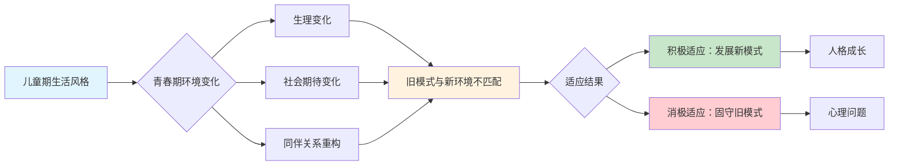
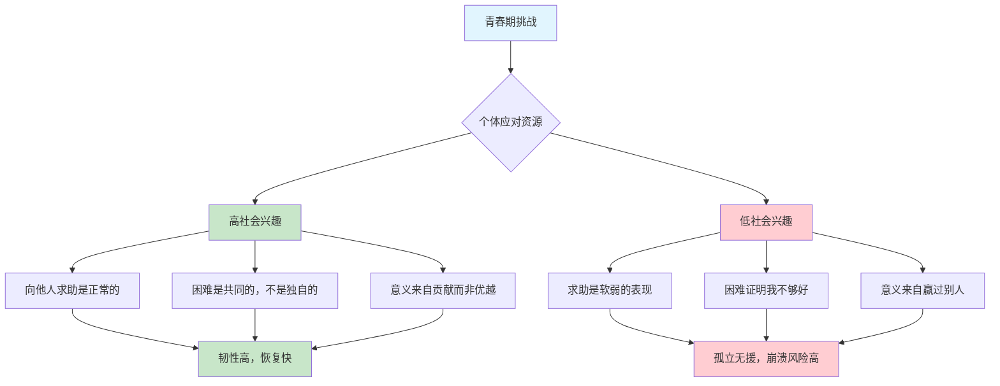
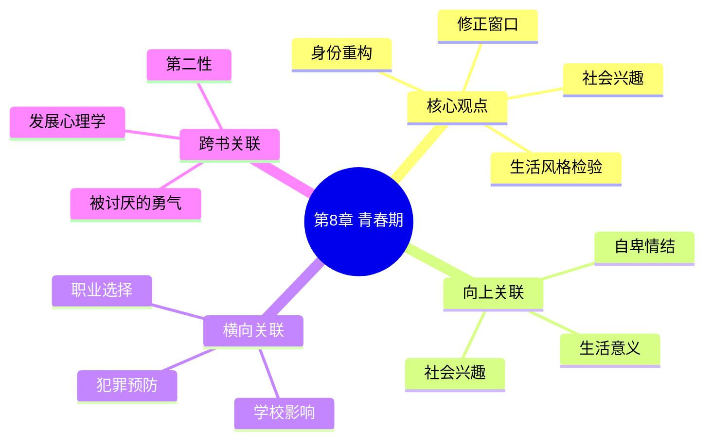

---

category:
  - Resources/书籍拆解/读书笔记

status:
  - 🌲常青
level:
  - Knowledge
links:

  - "[[第7章-学校的影响]]"
  - "[[第10章-犯罪及其预防]]"
chapter:
number: 8
title: 青春期
created_date: 2026-02-28
tags:
  - "📚类型/章节笔记"
  - "🎓领域/心理"
  - "🏷️主题/青春期"
  - "🏷️主题/人格发展"
  - "👤人物/阿德勒"
keywords: ["青春期", "身份认同", "角色转换", "人格发展", "社会适应"]
description: "青春期是个体从儿童模式向成人模式转换的关键期，人格在此经受考验——旧的生活风格可能失效，新的适应方式亟待建立。"
---

# 第8章 青春期

## 📍 章节定位

### 一句话定位
> 青春期是个体从儿童模式向成人模式转换的关键期，人格在此经受考验——旧的生活风格可能失效，新的适应方式亟待建立。

### 全书位置
- **承接**：前章探讨学校教育对儿童的影响，本章聚焦青春期这一关键转折点
- **核心问题**：青春期如何检验并重塑个体的人格结构？
- **理论角色**：发展心理学视角，揭示人格在关键期的动态变化

### 与整书主线的关系
```
自卑感 → 补偿机制 → 生活风格 → [青春期检验] → 社会适应 → 生命意义
```

---

## 🎯 核心观点（三层提取）

### 观点1：青春期是生活风格的"压力测试期"

#### 【表层】现象层
**阿德勒观察到的案例**：
- 一个在小学表现优异的孩子，进入中学后成绩骤降、情绪不稳
- 一个从小被宠爱的女孩，青春期遭遇第一次"不被特殊对待"后崩溃
- 一个在乡村学校如鱼得水的男孩，转学到城市后变得沉默寡言

**2026读者熟悉的场景**：
- 小学"学霸"到初中变成"学渣"
- 从小听话的孩子突然变得叛逆
- 原本开朗的孩子进入青春期后变得敏感多疑

#### 【中层】机制层
**为什么旧模式会失效？**



**核心机制**：
- **环境匹配原理**：生活风格的有效性依赖于环境匹配度
- **转换压力**：青春期同时面临生理、心理、社会三重变化
- **试错机会**：青春期提供了修正不健康生活风格的机会

#### 【底层】规律层
> **青春期检验定律**：生活风格在稳定环境中形成，在变化环境中接受检验。青春期的核心价值在于暴露童年期形成的不健康模式，为修正提供契机。

**降维翻译**：
> 你小时候养成的"套路"，到了青春期可能会不管用。
> 
> 这不是坏事，而是让你看看哪些套路需要升级。
> 
> 青春期的"乱"，其实是在帮你"更新系统"。

---

### 观点2：身份重构是青春期的核心任务

#### 【表层】现象层
**书中描述**：
- 青少年开始质疑"我是谁"
- 对他人的评价变得异常敏感
- 开始模仿不同的角色，尝试不同的身份

**现实对照**：
- 12岁前：我是爸爸妈妈的好孩子
- 13-16岁：我是谁？我属于哪个群体？
- 17岁后：我希望成为什么样的人？

#### 【中层】机制层
**身份重构的心理过程**：

```mermaid
flowchart TD
    A[童年身份<br/>"被定义的自我"] --> B[青春期触发<br/>环境变化+生理变化]
    B --> C[身份危机<br/>"我不再确定我是谁"]
    C --> D{身份探索方向}
    
    D --> E[社会兴趣导向<br/>探索与合作相关的身份]
    D --> F[优越追求导向<br/>探索与竞争相关的身份]
    
    E --> G[健康身份认同<br/>"我是能够贡献的人"]
    F --> H[脆弱身份认同<br/>"我必须比别人强"]
    
    G --> I[社会适应良好]
    H --> J[持续的焦虑与竞争]
    
    style A fill:#e1f5fe
    style C fill:#fff3e0
    style E fill:#c8e6c9
    style F fill:#ffcdd2
    style G fill:#c8e6c9
    style H fill:#ffcdd2
```

**阿德勒的关键洞察**：
> 身份重构不是找到"真正的自己"，而是选择"我想成为什么样的自己"。

#### 【底层】规律层
> **身份选择定律**：青春期不是被动地"发现"身份，而是主动地"选择"身份。选择的依据是生活风格——社会兴趣型个体选择贡献者身份，优越追求型个体选择竞争者身份。

**降维翻译**：
> 青春期不是"找回自己"，
> 而是"决定成为谁"。
> 
> 你可以选择成为"有用的人"，
> 也可以选择成为"比别人强的人"。
> 
> 这两个选择，决定了你以后的人生质量。

---

### 观点3：青春期危机是修正生活风格的黄金窗口

#### 【表层】现象层
**书中案例**：
- 一个被过度保护的孩子，青春期第一次独立面对困难时崩溃，但正是这次崩溃让他学会了真正的独立
- 一个从小用"生病"获取关注的孩子，青春期健康后失去了"特殊身份"，被迫发展新的获得关注的方式

**正面解读**：
- 青春期的"问题行为"可能是旧的适应方式在挣扎
- 青春期的"叛逆"可能是对不健康家庭模式的挑战
- 青春期的"迷茫"可能是重新选择人生方向的必要过程

#### 【中层】机制层
**修正机会的来源**：

| 童年期 | 青春期 | 修正机制 |
|--------|--------|----------|
| 被动接受家庭定义 | 主动质疑家庭模式 | 第一次有机会"说不" |
| 生活风格在无意识中形成 | 开始反思自己的行为模式 | 第一次有能力"看见自己" |
| 环境单一，选择有限 | 环境多元，接触不同价值观 | 第一次有"其他可能性" |

**修正的关键**：
1. **觉察**：意识到自己的旧模式在失效
2. **选择**：主动选择新的适应方式
3. **实践**：在真实环境中验证新模式

#### 【底层】规律层
> **黄金修正窗口定律**：青春期是人生中第一个有机会主动修正生活风格的时期。童年期的模式是无意识形成的，青春期则是第一次有机会有意识地审视和改变。

**降维翻译**：
> 童年时，你被塑造成什么样，自己说了不算。
> 
> 青春期，你第一次有机会说"我要变成不一样的人"。
> 
> 这是人生最早的"自我重写"机会，抓住了，就赢了。

---

### 观点4：社会兴趣是青春期健康的"定海神针"

#### 【表层】现象层
**高社会兴趣青少年的表现**：
- 关注他人感受，愿意帮助同学
- 能够建立深度友谊，而非表面社交
- 对未来有"贡献感"的期待

**低社会兴趣青少年的表现**：
- 只关注自己的得失
- 人际关系紧张，难以建立信任
- 对未来充满焦虑，不知道"活着为了什么"

#### 【中层】机制层
**社会兴趣的保护作用**：



#### 【底层】规律层
> **社会兴趣缓冲定律**：在青春期的高压环境下，社会兴趣是心理健康的保护因子。高社会兴趣的青少年将挑战视为成长机会，低社会兴趣的青少年将挑战视为自我否定证据。

**降维翻译**：
> 青春期很难，但有人在身边，就没那么难。
> 
> 社会兴趣就是"知道自己不是一个人在战斗"。
> 
> 有人可以求助、有人愿意帮助、有人需要自己——这就是青春期最需要的"定海神针"。

---

## 💬 降维翻译汇总

### 观点1降维：生活风格检验
| 原表达 | 降维表达 | 翻译技巧 |
|--------|----------|----------|
| "青春期个体面临生活风格的考验" | "小时候的套路，青春期可能不管用了" | 用"套路"替代"生活风格" |
| "环境变化导致旧有模式失效" | "换了个场子，老办法不灵了" | 用"场子"替代"环境" |
| "需要发展新的适应机制" | "得学会新的玩法" | 用"玩法"替代"适应机制" |

### 观点2降维：身份重构
| 原表达 | 降维表达 | 翻译技巧 |
|--------|----------|----------|
| "身份认同的建构" | "搞清楚自己是谁" | 口语化 |
| "社会角色期待的转换" | "别人不再把你当小孩了" | 用具体场景 |
| "主动选择身份方向" | "你想成为什么样的人，你自己定" | 用"你"增加代入感 |

### 观点3降维：修正窗口
| 原表达 | 降维表达 | 翻译技巧 |
|--------|----------|----------|
| "修正生活风格的黄金时期" | "最早的自救机会" | 用"自救"增加紧迫感 |
| "有意识地审视行为模式" | "第一次能看清自己是怎么活的" | 口语化+画面感 |
| "主动选择新的适应方式" | "换一种活法" | 极简表达 |

### 观点4降维：社会兴趣
| 原表达 | 降维表达 | 翻译技巧 |
|--------|----------|----------|
| "社会兴趣是心理健康的指标" | "身边有人，心里不慌" | 对仗句式 |
| "发展合作能力和社会连接" | "学会跟人一起扛事" | 用"扛事"替代"合作" |
| "贡献感提供意义支撑" | "知道自己对谁有用" | 用"有用"替代"贡献" |

---

## ✨ 金句库

### 原书金句
1. "青春期个体不再是儿童，也不是成人，他们正处于转换的过程中。"
2. "过去的生活风格面临着巨大考验，那些在过去环境中运行良好的模式，未必能在新的环境中发挥作用。"
3. "青春期的困难和混乱是强迫个体走出舒适圈的必要机制。"
4. "他们必须重新定义自己的社会角色，这是一次身份的重建工程。"
5. "对于能够积极应对青春期挑战的个体来说，这将是人生发展的又一次飞跃。"

### 降维金句
1. **小时候的套路，青春期可能不管用了——这不是坏事，是提醒你该升级了。**
2. **青春期不是"找回自己"，而是"决定成为谁"。**
3. **童年时你被塑造成什么样，青春期你第一次有机会说"我要变成不一样的人"。**
4. **青春期很难，但有人在身边，就没那么难——这就是社会兴趣的力量。**
5. **有人可以求助、有人愿意帮助、有人需要自己——这就是青春期最需要的"定海神针"。**
6. **青春期的"乱"，其实是在帮你"更新系统"。**
7. **换了个场子，老办法不灵了——这时候就该学新玩法了。**
8. **你是选择成为"有用的人"，还是"比别人强的人"——这决定了你以后的人生质量。**

## 🔗 当下映射（2026）

### 💼 职场应用
| 场景 | 书中智慧 | 具体行动 |
|------|----------|----------|
| 新员工入职适应 | 环境变化暴露旧模式 | 主动识别自己的"旧套路"是否适用 |
| 职业转型期 | 身份重构是正常的 | 接受转型期的混乱，这是"升级"的信号 |
| 团队融入困难 | 社会兴趣是保护因子 | 先想"我能为团队做什么"，而非"团队能给我什么" |

### 🏠 生活应用
| 场景 | 书中智慧 | 具体行动 |
|------|----------|----------|
| 孩子进入青春期 | "问题"可能是"修正机会" | 不急于纠正，先理解"旧模式为何失效" |
| 与青春期孩子沟通 | 身份重构需要支持 | 提供选择，而非强制定义 |
| 自我成长 | 修正永远不晚 | 青春期的逻辑同样适用于成人的转型期 |

### 📱 数字时代特殊挑战
| 2026挑战 | 阿德勒视角 | 应对策略 |
|----------|------------|----------|
| 社交媒体放大比较焦虑 | 优越追求导向加剧 | 培养"贡献感"替代"比较感" |
| 身份在网络上碎片化 | 身份重构更复杂 | 帮助青少年整合线上线下身份 |
| 网络关系替代真实连接 | 虚假的社会兴趣 | 强调真实互动的价值 |

### 72小时行动计划
1. **今天**：回顾自己青春期的一次"危机"，用阿德勒的视角重新理解——它是不是一次"修正机会"？
2. **本周**：观察身边一个正在经历青春期的孩子，思考他的"旧模式"是什么，为什么会失效？
3. **持续**：如果你正处于某个"转型期"（职业、关系、身份），试着用青春期的逻辑理解自己——这是"升级"的信号。

---

## 🕸️ 章节关联

### 向上关联 → 整书
- **第1章生活的意义**：青春期是第一次主动选择"我想赋予生命什么意义"
- **第3章自卑情结**：青春期的压力可能暴露或加剧自卑情结
- **第7章社会兴趣**：社会兴趣在青春期受到严峻考验，也是发展的关键期

### 横向关联 → 章节间
| 章节 | 关联类型 | 连接描述 |
|------|----------|----------|
| 第7章-学校的影响 | 承接 | 学校经历塑造的生活风格在青春期接受检验 |
| 第10章-犯罪及其预防 | 延伸 | 青春期问题处理不当可能导致犯罪行为 |
| 第11章-职业 | 延伸 | 青春期的身份选择影响职业方向 |

### 跨书关联
| 书籍 | 概念 | 关联类型 |
|------|------|----------|
| [[被讨厌的勇气-岸见一郎]] | 课题分离 | 青春期是学习课题分离的关键期 |
| 发展心理学 | 埃里克森"同一性vs角色混乱" | 理论呼应，不同视角 |
| 第二性 | 性别身份建构 | 青春期的性别身份探索 |

### 关联可视化


---
