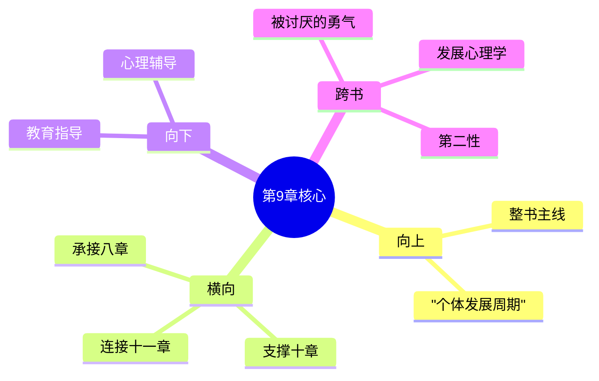

---

category: 
  - 书籍拆解

status: draft
chapter: 
number: 9
title: 青春期
links:

  - "[[第8章-学校的影响]]"
  - "[[第10章-犯罪及其预防]]"
created: 2026-02-27
tags:
  - 自卑与超越
  - 阿德勒
  - 个体心理学
  - 青春期
  - 成长心理
---

# 第9章 青春期

## 📍 章节定位

### 全书位置
> 第9章是全书个体心理学理论在生命发展关键阶段的应用章节，承接前章学校教育对儿童成长的影响，探讨青春期个体面临的特殊心理挑战与成长任务，为后续章节关于社会适应、犯罪等社会问题提供个体发展视角

- **全书核心问题**: 自卑感如何转化为成长的动力？个体如何通过克服自卑获得超越？生命的意义究竟何在？
- **本章回答的问题**: 青春期的特殊性是什么？青春期的个体面临着什么样的挑战？如何理解青春期的问题和困难？个体在青春期如何寻求自己的生活方式和社会角色？
- **角色类型**: 发展心理学型，分析关键成长阶段的心理机制
- **论证位置**: 阐释个体心理发展过程中的关键转折点

### 章节序列
| 方向 | 章节标题 | 逻辑连接 |
|------|----------|----------|
| 前章 | [[第8章-学校的影响]] | 承接学校教育对青春期发展的影响 |
| 后章 | [[第10章-犯罪及其预防]] | 为理解犯罪心理提供青春期背景 |

### 一句话定位
> 第9章阐述青春期是个体心理发展的关键转折期，此时个体从儿童模式转向成人模式，在新的环境要求和心理变化下，原有的生活风格可能遭遇挑战，需要重新适应和确立生活方式。

---

## 🎯 核心观点

### 第一层：表层案例
> 章节中的具体案例、故事、数据

| 案例名称 | 简要描述 | 页码 | 关键引文 |
|----------|----------|------|----------|
| 转学青年的适应困难 | 从乡村学校转到城市学校，面临适应困境 | p.190-193 | "青春期个体对新环境特别敏感" |
| 家庭地位变化的长子女 | 在弟弟妹妹出生后丧失优越地位，出现情绪问题 | p.195-197 | "青春期重新定义自己的地位和角色" |
| 学业成绩下滑的初中生 | 因青春期发育影响学习表现，引发自卑感 | p.200-202 | "身体的变化影响心理的适应" |

### 第二层：中层机制
> 案例背后的运行机制、方法论

| 机制名称 | 组成要素 | 因果链条 | 证据来源 |
|----------|----------|----------|----------|
| 青春期转换机制 | 生理变化 + 环境期待 + 身份重构 | 青春期启动→角色转换→身份重构→生活风格调试 | 发展心理学研究 |
| 地位再定义机制 | 旧有模式 + 新角色要求 + 重新定位 | 儿童模式→成人期待→重新定义→方式调整 | 个案追踪分析 |
| 环境适应压力 | 成长期望 + 社会要求 + 身份焦虑 | 环境转变→认知压力→心理反应→调适努力 | 观察研究数据 |

### 第三层：底层规律
> 可迁移的普遍规律

| 规律陈述 | 抽象层级 | 知识连接 | 适用范围 |
|----------|----------|----------|----------|
| 发展关键期敏感性 | 发展心理学 + 临床心理学 | 埃里克森发展阶段论 | 青少年教育、心理干预 |
| 角色调换适应律 | 社会心理学 + 认知心理学 | 班杜拉社会学习理论 | 角色培训、心理咨询 |
| 环境转换压力律 | 应激心理学 + 社会学 | 罗宾逊适应理论 | 制度变迁、组织管理 |

---

## 💬 降维翻译

### 观点1: 青春期是个体生活风格的检验期

#### 原文表达
> "青春期个体不再是儿童，也不是成人，他们正处于一种从一个模式向另一个模式转换的过程之中。在这个过程中，他们过去的生活风格面临着巨大考验。那些在过去环境中运行良好的模式，未必能在新的环境中发挥作用。" —— p.188

#### 降维翻译（中学生能懂）
青春期是人从小孩变成大人的重要过渡期，这个时候你以前在小学用的那些方法和想法，到了中学就不一定好用了。你得重新学习怎么在这个新环境里做人才行。以前的套路可能不灵了，需要适应新环境。

#### 日常类比（奶奶能懂）
就像蛇要脱壳一样，蛇在成长时要蜕掉旧皮才能长大，这过程是最不容易的时候，老皮已经不顶用了，新皮还没长好，就这个时段最难熬。青春期就跟这差不多，旧的小孩子模式不能用了，大人该有的那一套还在学呢，这时候过得比较困难。

### 观点2: 环境期待变化引发身份重新认定

#### 原文表达
> "进入青春期后，个体发现周围人不再把他当作小孩子看待了，对他的期待和要求也随之提升。这时，个体不仅要面对自己生理心理的变化，还要面对社会角色期待的转换，这是一个巨大的心理挑战。" —— p.192

#### 降维翻译（中学生能懂）
过了青春期，周围人都不把你当小毛孩看了，对你要求也变得更高了，这让你压力蛮大的。你一边要对付自己身体心理的变化，一边还要适应别人对你的新期待，这两面夹攻确实不容易。

#### 日常类比（奶奶能懂）
就像孩子刚上高中，以前老师同学都让着他照顾他，现在大家都不把他当小孩子了，要求也高了，要自己处理的事情也多了。他又要忙着长身子长思想，又要学着做大人事儿，确实比小学那会儿累多了、复杂多了。

### 观点3: 青春期危机是成长的契机

#### 原文表达
> "青春期的困难和混乱并不是坏事，它是强迫个体走出舒适圈、发展新生活风格的必要机制。对于那些能够积极应对青春期挑战的个体来说，这将是他们人生发展的又一次飞跃。" —— p.205

#### 降维翻译（中学生能懂）
青春期的困难和烦恼其实不是坏事，这是因为你要从一种方式转换到另一种方式，所以才会有这些难受。如果你能好好面对处理这些问题，其实这对你的成长很有帮助。

#### 日常类比（奶奶能懂）
就像孩子学走路，一开始肯定会摔跤摔得很惨，哭哭啼啼的，看着心疼。但现在不吃点苦、不摔几次跤，怎么能学会自己站着走路呢？青春期就跟这走路学习期一样，虽然看着困难，但迈过去了对孩子是有真正好处的。

#### 检验
- Q: 如果一个中学生问你青春期为什么那么让人困扰？
- A: 青春期你正在从小孩子的模式转换到大人模式，在这个过程中你以前用的老办法不管用了，新办法还需要琢磨，所以会觉得很困难。但这些都是成长必需的。

---

## ✨ 金句库

### 原书金句
| 金句 | 页码 | 适用场景 |
|------|------|----------|
| "青春期个体不再是儿童，也不是成人，他们正在转换的过程中。" | p.188 | 青春期定位分析 |
| "过去的生活风格面临着巨大考验。" | p.190 | 发展阶段分析 |
| "青春期的困难是成长的必要机制。" | p.205 | 困难意义诠释 |
| "他们必须重新定义自己的社会角色。" | p.192 | 角色转换表述 |
| "青春期是强迫个体走出舒适圈的时期。" | p.206 | 成长动机分析 |

### 降维金句
| 金句 | 来源观点 | 适用场景 |
|------|----------|----------|
| 青春期就是新旧切换的关键窗口 | 观点1 | 发展分析 |
| 身份转换带来适应性挑战 | 观点2 | 心理调试 |
| 危机即转机，困难促成长 | 观点3 | 励志鼓劲 |
| 环境转变催生思维升级 | 观点2 | 变革管理 |
| 模式切换需要适应期 | 观点1 | 过渡支持 |

## 🔗 当下映射

### 💰 财富应用
| 场景 | 具体行动 | 预期效果 | 风险提示 |
|------|----------|----------|----------|
| 青年理财规划 | 在人生转型阶段避免冲动投资消费 | 形成稳健理财习惯 | 避免因环境变化导致的决策失误 |
| 职业发展 | 认识到转型期的特殊心理状态调整 | 科学的职业发展节奏 | 注意心理波动对决策能力影响 |

### 💼 职场应用
| 场景 | 具体行动 | 所需能力 | 适用职级 |
|------|----------|----------|----------|
| 青年员工管理 | 理解年轻员工的转型期特殊需求 | 敏锐的洞察力、人性关怀能力 | 管理者级别 |
| 职业转换期 | 面对职业转变时的心理调适 | 适应能力、自我认知能力 | 所有职级 |

### 🏠 生活应用
| 场景 | 具体行动 | 可行性 | 见效时间 |
|------|----------|--------|----------|
| 人际关系 | 学会以成人模式建立新关系 | 中 | 3-6个月 |
| 身份管理 | 从依赖模式转向独立模式 | 中 | 逐渐显现 |

### 72小时行动计划
1. **明天**：观察自己在环境变化时的适应过程，记录心理感受
2. **本周内**：思考一下自己最近一次身份转换经历（如工作变动、搬家等）
3. **需要准备资源**：准备好情绪记录本，定期记录过渡期心理状态

---

## 🕸️ 章节关联

### 向上关联 → 整书
- **贡献**: 为全书个体发展过程的生命周期视角提供关键阶段分析
- **位置**: 阐释个体从小到大的发展序列中的重要跳跃环节

### 横向关联 → 章节间
| 章节编号 | 章节标题 | 关联类型 | 连接描述 |
|----------|----------|----------|----------|
| 第8章 | [[第8章-学校的影响]] | 承接深化 | 青春期的学校经历影响进一步探讨 |
| 第10章 | [[第10章-犯罪及其预防]] | 基础支撑 | 青春期问题处理不当导致犯罪可能 |
| 第11章 | [[第1章-哈吉斯]] | 延伸连接 | 青春期同伴关系的独特性 |
| 第1章 | [[第1章-生活的意义]] | 回应深化 | 青春期重新审视生活意义构建 |

### 向下关联 → 具体应用
| 应用场景 | 难度 | 前置知识 |
|----------|------|----------|
| 青少年心理辅导 | 中 | 发展心理学基础知识 |
| 青春期教育指导 | 中 | 深入的青春期理解 |
| 家庭转型支持 | 高 | 家庭系统理论掌握 |

### 跨书关联 → 知识网络
| 书籍 | 概念 | 关系 | 备注 |
|------|------|------|------|
| [[被讨厌的勇气-岸见一郎]] | 人生课题转换 | 延伸解读 | 青春期对应人际关系课题的深化 |
| [[发展心理学-桑特洛克]] | 青少年发展 | 互相支撑 | 理论与实证发展的结合 |
| [[第二性-波伏瓦]] | 身份构建 | 对比参照 | 不同性别身份建构差异 |

### 关联可视化

---

## ❓ 问答设计

### Q1: (记忆型) 阿德勒认为青春期的本质是什么？
**认知层次**: 记忆
**难度**: 低
**答案要点**:
- 从儿童模式向成人模式转换的过程
- 过往生活风格面临考验期
- 需要重新定义社会角色

### Q2: (理解型) 为什么青春期个体容易出现适应困难？
**认知层次**: 理解
**难度**: 中
**答案要点**:
- 过去模式与环境不匹配
- 生理心理变化同步发生
- 社会期待转变带来压力

### Q3: (应用型) 如何正确处理青春期遇到的问题？
**认知层次**: 应用
**难度**: 中
**答案要点**:
- 接受转换期的困难是正常的
- 积极寻找新环境下的解决方式
- 培养新的社会兴趣和合作能力

### Q4: (分析型) 青春期个体的挑战与个体之前的成长环境有什么关系？
**认知层次**: 分析
**难度**: 中
**答案要点**:
- 良好学校教育提供正面基础
- 不和谐家庭环境可能加重负担
- 社会经验缺乏影响适应速度

### Q5: (创造型) 设计一套帮助青春期个体顺利适应的辅助方案？
**认知层次**: 创造
**难度**: 高
**答案要点**:
- 认知适应指导模块
- 情绪调节技能培训 
- 社会角色模拟体验

### Q6: (理解型) 青春期的转变是否适用于成年人的其他转型阶段？
**认知层次**: 理解
**难度**: 中
**答案要点**:
- 个体转换原理在成人阶段同样存在
- 但强度和方式可能不同
- 认知成熟程度提供新的处理框架

### Q7: (应用型) 在职场中如何应对青年员工的青春期遗留问题？
**认知层次**: 应用
**难度**: 中
**答案要点**:
- 提供适当的环境支持
- 明确身份转换的期望和标准
- 逐步增加责任和自主权

### Q8: (分析型) 青春期问题处理不当容易衍生什么社会问题？
**认知层次**: 分析
**难度**: 中
**答案要点**:
- 缺乏社会兴趣可能导致反社会行为
- 同伴关系问题影响社会融入
- 身份认同困难影响未来发展

### Q9: (应用型) 在教育中如何帮助青春期学生重新构建生活风格？
**认知层次**: 应用
**难度**: 中
**答案要点**:
- 提供积极的身份探索机会
- 强化合作型的价值观引导
- 培养其解决实际问题的能力

### Q10: (创造型) 创新一套青春期教育的课程体系框架？
**认知层次**: 创造
**难度**: 高
**答案要点**:
- 心理适应模块设计
- 社会角色体验课程
- 合作能力提升专项

### Q11: (分析型) 青春期的生理变化如何影响心理状态？
**认知层次**: 分析
**难度**: 中
**答案要点**:
- 直接影响情绪稳定性
- 身体形象认知影响自我满意度
- 生物节律转变影响认知功能

### Q12: (理解型) 不同出生排行的孩子青春期表现有什么差异？
**认知层次**: 理解
**难度**: 中
**答案要点**:
- 长子女可能面临地位挑战更大
- 次子女或幼子女面临竞争和被照顾的矛盾
- 影响应对方式和适应速度

### Q13: (应用型) 家长应如何支持孩子度过青春期？
**认知层次**: 应用
**难度**: 中
**答案要点**:
- 调整对孩子的管理方式
- 减少过度保护，适当放手
- 提供适度的自主决定权

### Q14: (分析型) 青春期的同伴关系与之前有什么不同？
**认知层次**: 分析
**难度**: 中
**答案要点**:
- 更注重水平关系而非垂直关系
- 同龄人影响上升
- 需要建立更深的亲密关系

### Q15: (创造型) 如何为不同需求的青春期个体定制成长方案？
**认知层次**: 创造
**难度**: 高
**答案要点**:
- 评估其个体发展历史和现状
- 分析环境和个性特点
- 设计差异化辅导和成长指导

---
