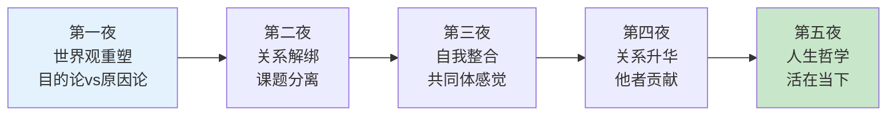
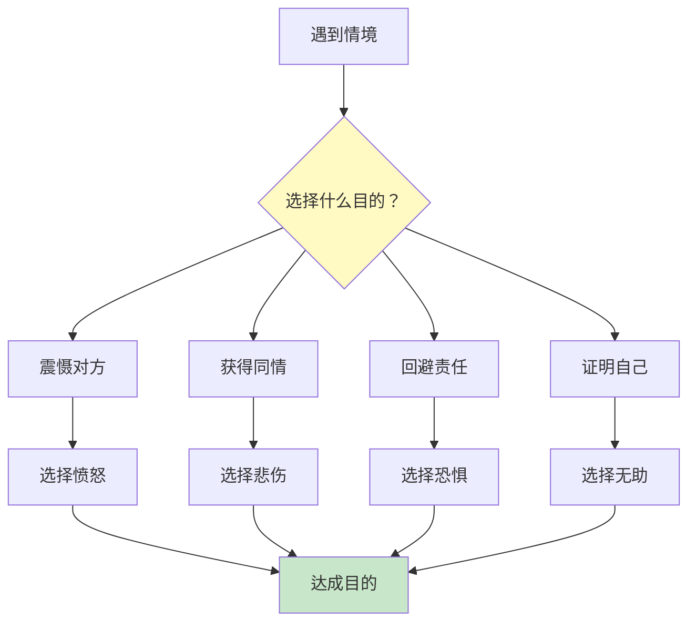
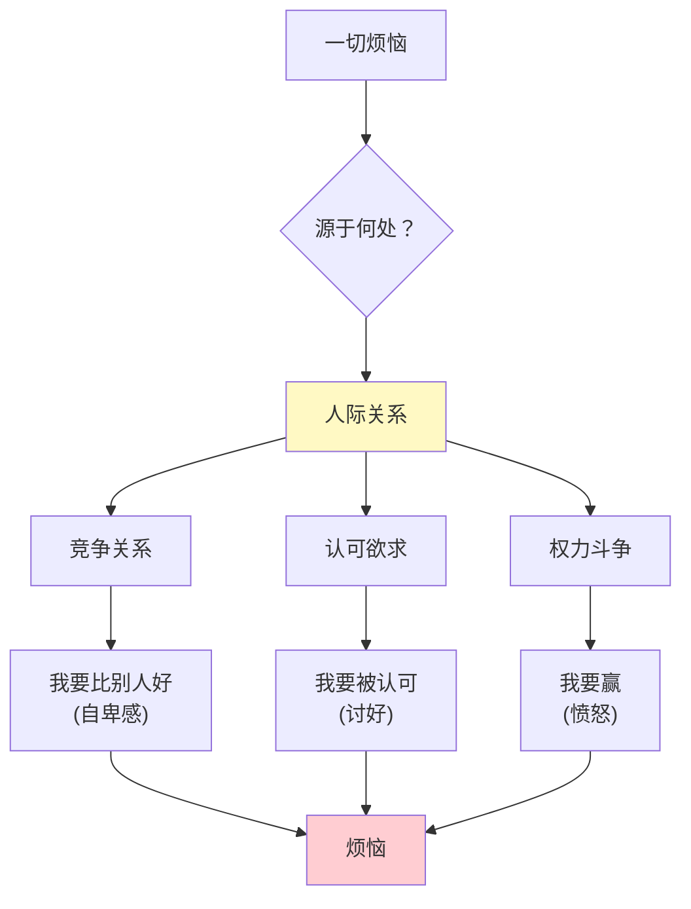
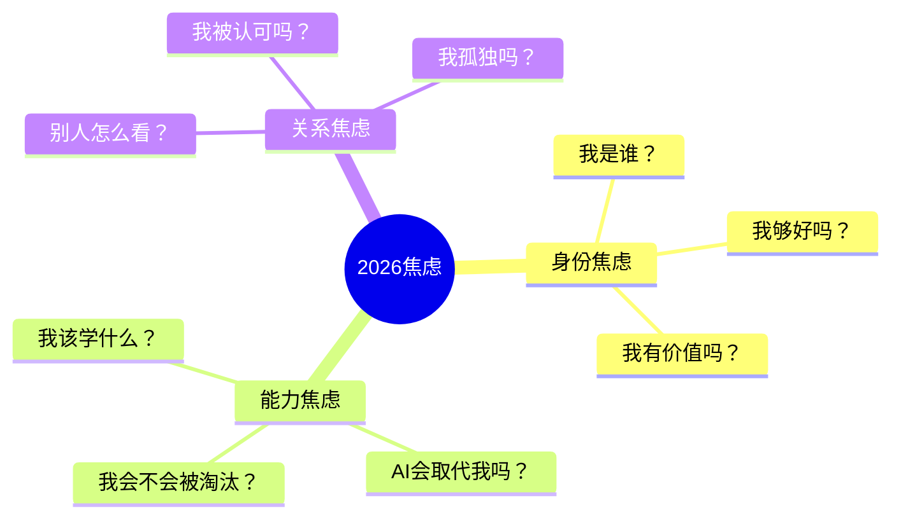
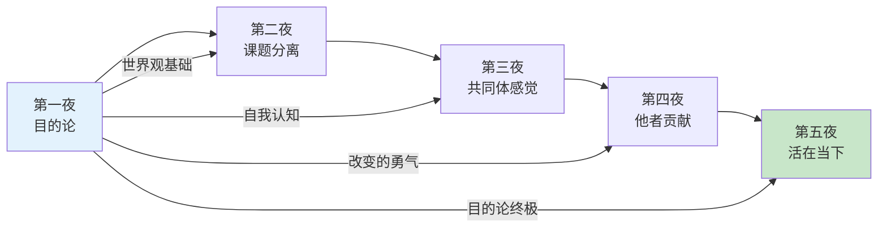

# 第一夜：我们的不幸是谁的错？

> **章节定位**：阿德勒心理学的"世界观重塑"——用目的论颠覆原因论，解开过去对现在的束缚

---

## 一、章节定位

### 1.1 在全书中的位置



**本夜功能**：拆掉"过去决定现在"的思维地基，建立"当下选择决定未来"的新地基

### 1.2 核心主题

| 维度 | 内容 |
|------|------|
| **核心困境** | 为什么我这么不幸？是谁的错？ |
| **阿德勒答案** | 你的不幸，是你自己选择的 |
| **颠覆观点** | 过去不决定现在，你"为了什么"选择现在 |
| **关键概念** | 目的论（Teleology）vs 原因论（Etiology） |

### 1.3 章节关联

| 关联章节 | 关联关系 | 共同逻辑 |
|----------|----------|----------|
| [[第二夜-一切烦恼皆源于人际关系]] | 前后承接 | 第一夜解决"我和过去的关系"，第二夜解决"我和他人的关系" |
| [[第三夜-让干涉你生活的人滚开]] | 基础支撑 | 目的论是课题分离的思维基础 |
| [[第五夜-认真活在当下]] | 终极呼应 | 目的论的终极应用是活在当下 |

---

## 二、核心观点（三层提取）

### 观点1：目的论——你的生活由你选择的目的决定

#### 【表层】现象层

**书中的三个核心案例**：

| 案例 | 原因论解读 | 目的论解读 |
|------|------------|------------|
| **愤怒的青年** | "因为服务员把咖啡洒在我身上，所以我生气" | "我选择愤怒，是为了震慑对方，让对方害怕我" |
| **脸红恐惧的少女** | "因为我有脸红恐惧症，所以不敢向喜欢的男生表白" | "我制造脸红恐惧，是为了避免表白被拒绝的尴尬" |
| **闭居的朋友** | "因为童年创伤，所以闭居在家" | "我选择闭居，是为了让父母担心，证明自己的重要性" |

**读者熟悉的场景**：
- "我因为性格内向，所以不善社交" → 你选择"内向"标签，是为了回避社交失败的风险
- "我因为学历低，所以找不到好工作" → 你选择"学历决定论"，是为了给自己的现状找到借口
- "我因为原生家庭，所以不会爱" → 你选择"原生家庭决定论"，是为了避免再次受伤的可能

#### 【中层】机制层

```mermaid
flowchart LR
    subgraph 原因论【弗洛伊德】
        A1[过去原因] --> A2[导致]
        A2 --> A3[当前状态]
        A3 --> A4["无法改变<br/>(过去无法改变)"]
    end
    
    subgraph 目的论【阿德勒】
        B1[当下目的] --> B2[选择]
        B2 --> B3[当前行为]
        B3 --> B4["可以改变<br/>(目的可以改变)"]
    end
    
    A3 -.->|"阿德勒否定"| A4
    B2 -.->|"阿德勒主张"| B4
    
    style A4 fill:#ffcdd2
    style B4 fill:#c8e6c9
```

**情绪的目的论机制**：



**阿德勒核心公式**：
```
A（Adversity 诱发事件）≠ C（Conclusion 结果/感受）
B（Belief/Purpose 信念/目的）→ C

不是"因为A所以C"，而是"为了B所以选择C"
```

#### 【底层】规律层

> **目的论定律**：人的行为和情绪不是由过去原因决定的，而是由当下的目的选择的。改变目的，就能改变行为。

**降维翻译**：
> 你以为你是"因为"过去变成这样，
> 阿德勒说：你是"为了"什么选择变成这样。
> 
> 愤怒不是因为被骂，
> 是你选择愤怒来震慑对方。
> 
> 恐惧不是因为危险，
> 是你选择恐惧来回避责任。
> 
> **关键：改变目的，就能改变生活。**

#### 【当下连接】2026热点

|----------|----------|----------|
| 为什么总觉得自己是"受害者"？ | 原因论让你陷入"因为"的循环 | "原来是我选择了受害者身份" |
| 为什么知道道理却做不到？ | 目的不够明确，选择不够坚定 | "原来不是我意志差，是目的不对" |
| 为什么35岁如此焦虑？ | 用过去解释现在，放弃了选择 | "原来我可以用目的论重启人生" |
| 心理创伤真的无法改变吗？ | 目的论：创伤不决定你，你赋予创伤的意义决定你 | "原来过去的意义由我决定" |

---

### 观点2：一切烦恼皆源于人际关系

#### 【表层】现象层

**书中的核心命题**：
- "世界上没有真正'内在的'烦恼"——任何烦恼都和他人有关
- 孤独不是因为一个人，而是因为感觉"被他人疏远"
- 自卑不是因为你真的差，而是因为"和他人比较"

**读者熟悉的场景**：
- "我自卑" → 不是因为你真的差，而是因为你和别人比较
- "我孤独" → 不是因为你一个人，而是因为你感觉被社会排斥
- "我焦虑" → 不是因为你真的有危险，而是因为你担心他人的评价

#### 【中层】机制层



**人际关系的三大陷阱**：

| 陷阱 | 表现 | 底层目的 |
|------|------|----------|
| **竞争陷阱** | 和他人比较，必须比别人好 | 证明自己的价值 |
| **认可陷阱** | 活在他人期待中 | 获得安全感 |
| **权力陷阱** | 必须赢，必须被服从 | 证明自己是对的 |

#### 【底层】规律层

> **人际关系定律**：一切烦恼都源于人际关系。要解决烦恼，不是逃避人际关系，而是改变你在人际关系中的姿态。

**降维翻译**：
> 你以为烦恼来自"自己不够好"，
> 阿德勒说：烦恼来自"你用别人的标准评判自己"。
> 
> **停止比较，烦恼减半；
> 停止讨好，自由开始。**

---

### 观点3：人可以改变——生活方式是自己选择的

#### 【表层】现象层

**书中的核心观点**：
- "性格"不是天生的，是你选择的生活方式
- 10岁左右，你选择了某种"生活方式"，然后不断强化
- 你可以选择继续保持，也可以选择改变

**读者熟悉的场景**：
- "我天生内向" → 内向是你选择的生活方式，不是基因决定的
- "我就是这种人" → "这种人"是你选择扮演的角色
- "我改不了" → 你选择"改不了"，是因为改变有代价

#### 【中层】机制层

```mermaid
flowchart LR
    A[10岁左右] --> B[选择生活方式]
    B --> C[反复强化]
    C --> D[形成"性格"]
    D --> E{继续保持？}
    E --> F[是→不变]
    E --> G[否→改变]
    G --> H[新的选择]
    H --> C
    
    style B fill:#fff9c4
    style G fill:#c8e6c9
```

**改变的三个障碍**：

| 障碍 | 表现 | 目的论解读 |
|------|------|------------|
| **恐惧未知** | "万一改变了更糟怎么办" | 选择恐惧，是为了回避改变的风险 |
| **习惯舒适** | "现在这样也挺好的" | 选择舒适，是为了维持现状 |
| **外部归因** | "是环境/他人的错" | 选择外部归因，是为了逃避责任 |

#### 【底层】规律层

> **可改变定律**：人可以改变。不是"能不能"的问题，而是"愿不愿意"的问题。改变需要勇气——面对未知、承担后果的勇气。

**降维翻译**：
> 你以为你"改不了"，
> 阿德勒说：你选择"不改"。
> 
> 改变需要的不只是方法，
> 更是勇气——
> 面对未知、承担后果的勇气。
> 
> **不是你做不到，是你不敢做。**

---

## 三、金句库

### 原书金句（10句）

**【目的论核心】**
1. "你的不幸，是你自己选择的。"
2. "重要的不是你生在什么样的环境，而是你如何使用这个环境。"
3. "决定我们自身的，不是过去的经历，而是我们赋予经历的意义。"
4. "生活方式是自己选择的东西。"

**【否定原因论】**
5. "如果我们一直依赖原因论，就会永远止步不前。"
6. "无论过去发生过什么，对你今后的人生如何度过，没有丝毫影响。"

**【人际关系】**
7. "一切烦恼，都来自人际关系。"
8. "只要涉及人际关系，就会有烦恼。"

**【改变的勇气】**
9. "人可以改变。不仅如此，人还可以变得幸福。"
10. "要有被讨厌的勇气，才能获得真正的自由。"

---

### 降维金句（15句）

**【目的论·生活版】**
1. **你的"性格内向"不是天生的，是你选择用来回避社交失败的标签。**
2. **愤怒不是因为被骂，是你选择愤怒来震慑对方——改变目的，就能改变情绪。**
3. **创伤不是决定你的牢笼，是你赋予创伤的意义决定你的自由。**
4. **你说"我就是这样的人"，其实你选择成为"这样的人"。**
5. **过去已经过去，但过去的"意义"由你决定。**

**【人际关系·清醒版】**
6. **一切烦恼来自人际关系——不是你不好，是你用别人的标准评判自己。**
7. **停止比较，烦恼减半；停止讨好，自由开始。**
8. **孤独不是一个人，而是你感觉被他人疏远。**
9. **自卑不是你真的差，而是你和别人比较。**

**【改变·行动版】**
10. **不是你做不到，是你不敢做——改变需要勇气，不只是方法。**
11. **10岁时你选择了某种生活方式，现在你可以选择另一种。**
12. **"改不了"是你的选择，不是你的命运。**

**【综合·金句版】**
13. **阿德勒的目的论：不是"因为"过去，而是"为了"什么。**
14. **你的不幸不是过去决定的，而是你选择"不幸"这种生活方式。**
15. **自由不是别人给你的，是你选择不再被过去和他人束缚。**

---

## 四、当下映射

### 2026年读者痛点连接

|------|--------------|----------|
| **35岁危机** | 不是"因为年龄到了所以焦虑"，是你选择用年龄解释焦虑 | "原来我可以用目的论重启" |
| **职场内卷** | 不是"因为环境太卷所以焦虑"，是你选择参与竞争 | "原来我可以退出竞争" |
| **原生家庭** | 不是"因为原生家庭所以不会爱"，是你选择用童年解释现在 | "原来过去的意义由我决定" |
| **性格困境** | 不是"因为性格内向所以不行"，是你选择用性格回避挑战 | "原来性格是我选择的生活方式" |
| **拖延症** | 不是"因为意志力差所以拖延"，是你选择用意志力解释拖延 | "原来拖延的目的我可以改变" |

### 三大焦虑深度连接



**第一夜的解药**：
- **身份焦虑** → 你的身份是你选择的，不是被给予的
- **能力焦虑** → 你可以选择学习，也可以选择不学
- **关系焦虑** → 一切烦恼源于人际关系，改变你在关系中的姿态

---

## 五、章节关联

### 与主拆解记录的关联

| 概念 | 第一夜深化 | 主记录位置 |
|------|------------|------------|
| 目的论 | 详细论证愤怒、脸红恐惧、闭居案例 | [[被讨厌的勇气-岸见一郎-拆解记录#观点1]] |
| 原因论批判 | 弗洛伊德 vs 阿德勒的对话 | [[被讨厌的勇气-岸见一郎-拆解记录#目的论vs原因论]] |
| 人际关系 | "一切烦恼源于人际关系"的首次提出 | [[被讨厌的勇气-岸见一郎-拆解记录#观点2]] |

### 与后续章节的关联



---

## 六、问答设计（青年vs哲人）

### Q1：为什么说愤怒是"选择"的？明明是被激怒的。

**青年**："我被人骂了，自然会生气。这不是选择，是本能反应。"

**哲人的回答（目的论版）**：
> 你以为愤怒是"被激发"的，但想象一下——
> 
> 如果骂你的人是你最尊敬的老师，你会生气吗？
> 如果骂你的人是你暗恋的对象，你会生气吗？
> 
> 愤怒不是"因为被骂所以生气"，
> 而是"为了震慑对方，所以选择愤怒"。
> 
> **改变目的，就能改变情绪。**

**降维翻译**：
> 愤怒不是自动反应，而是你选择的武器。
> 你选择愤怒，是为了让对方害怕。
> 如果你不想让对方害怕，你就不会愤怒。

---

### Q2：心理创伤真的不存在吗？童年阴影怎么解释？

**青年**："很多人童年被虐待，长大后有问题。这难道不是创伤决定的吗？"

**哲人的回答（目的论版）**：
> 阿德勒不是说"童年没有影响"，
> 而是说"童年的影响由你决定"。
> 
> 两个人经历同样的童年虐待：
> 一个人选择"我也要这样对待别人"
> 另一个人选择"我绝不让别人经历这样的痛苦"
> 
> **不是创伤决定你，是你赋予创伤的意义决定你。**

**降维翻译**：
> 创伤是事实，但创伤的"意义"由你选择。
> 
> 你可以选择：创伤让我"不能"。
> 你也可以选择：创伤让我"更要"。
> 
> 过去已经过去，但过去的"意义"由你决定。

---

### Q3：如果我承认"是我选择的"，是不是意味着我要为一切负责？

**青年**："如果我承认不幸是我选择的，那我不就成了自责？这不是受害者有罪论吗？"

**哲人的回答（目的论版）**：
> 目的不是自责，而是**拿回改变的权利**。
> 
> 如果一切是"过去决定的" → 你无能为力
> 如果一切是"我选择的" → 你可以重新选择
> 
> **目的论不是让你自责，而是让你自由。**
> 
> 承认选择，不是为了怪罪自己，
> 而是为了拿回改变的权利。

**降维翻译**：
> "是我选择的"不是"是我的错"，
> 而是"我有能力改变"。
> 
> 你不需要为过去负责，
> 但你可以为未来选择。

---

### Q4：目的论会不会太"鸡汤"？真的有用吗？

**青年**："说'我选择'很容易，但现实很残酷。目的论是不是太理想化了？"

**哲人的回答（实用主义版）**：
> 目的论不是"心灵鸡汤"，而是"实用工具"。
> 
> 你可以继续用原因论解释人生：
> "因为我有童年创伤，所以我不行。"
> → 结果：你继续不行。
> 
> 你也可以用目的论重新选择：
> "我选择不行，是为了避免失败的风险。"
> → 结果：你发现了选择，可以重新选择。
> 
> **目的论的价值不是"对不对"，而是"有没有用"。**
> 
> 哪怕目的论不是"真理"，
> 它也能让你拿回改变的权利。
> 
> 你愿意试试看吗？

**降维翻译**：
> 目的论不是科学真理，而是实用工具。
> 
> 问题是：
> 原因论让你无法改变。
> 目的论让你可以改变。
> 
> 你选哪个？

---

## 七、实践练习

### 72小时微应用

**练习1：情绪目的论检视**
```
当你感到愤怒/恐惧/悲伤时，问自己：
□ 我选择这个情绪，是为了什么？
□ 如果我不选择这个情绪，会发生什么？
□ 我可以用什么其他方式达到同样的目的？
```

**练习2：过去意义重写**
```
选择一个你认为"决定"了你的过去经历：
□ 这件事的事实是什么？
□ 我目前赋予它的意义是什么？
□ 我可以赋予它什么新的意义？
```

**练习3：生活方式识别**
```
识别你10岁左右选择的生活方式：
□ 我选择了什么样的"性格"？
□ 我选择这种生活方式是为了什么？
□ 现在我愿意选择什么新的生活方式？
```

### 检索测试（闭书自测）

```
□ 能否用一句话解释目的论和原因论的区别？
□ 能否举出一个"情绪是选择"的生活例子？
□ 能否说出"一切烦恼源于人际关系"的三层含义？
□ 能否解释为什么"人可以改变"？
```

---

## 八、章节金句卡片

### 核心金句（可直接制图）

1. **"你的不幸，是你自己选择的。"**

2. **"决定我们自身的，不是过去的经历，而是我们赋予经历的意义。"**

3. **"愤怒不是因为被骂，是你选择愤怒来震慑对方。"**

4. **"一切烦恼，都来自人际关系。"**

5. **"人可以改变。不仅如此，人还可以变得幸福。"**

---
