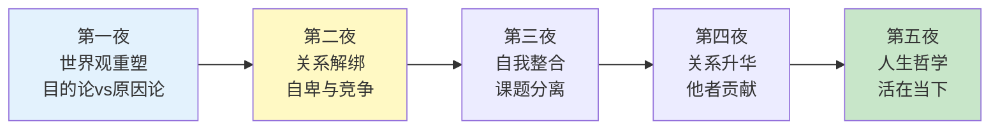
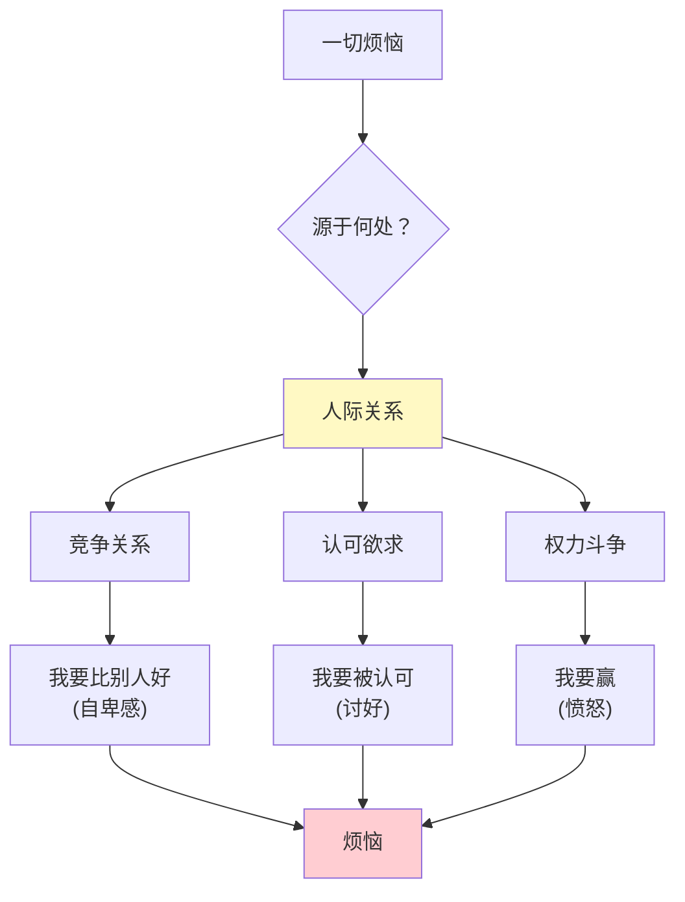
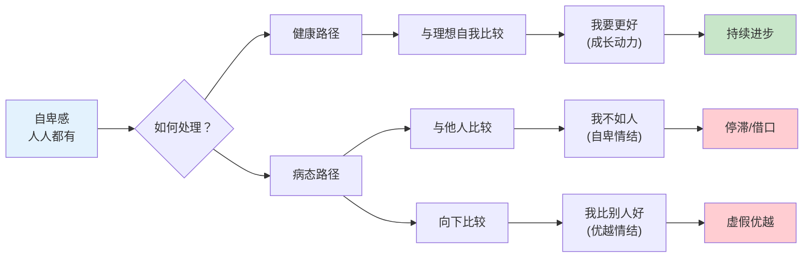
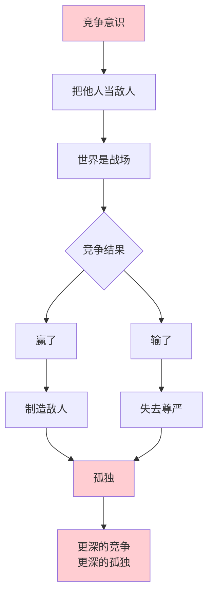
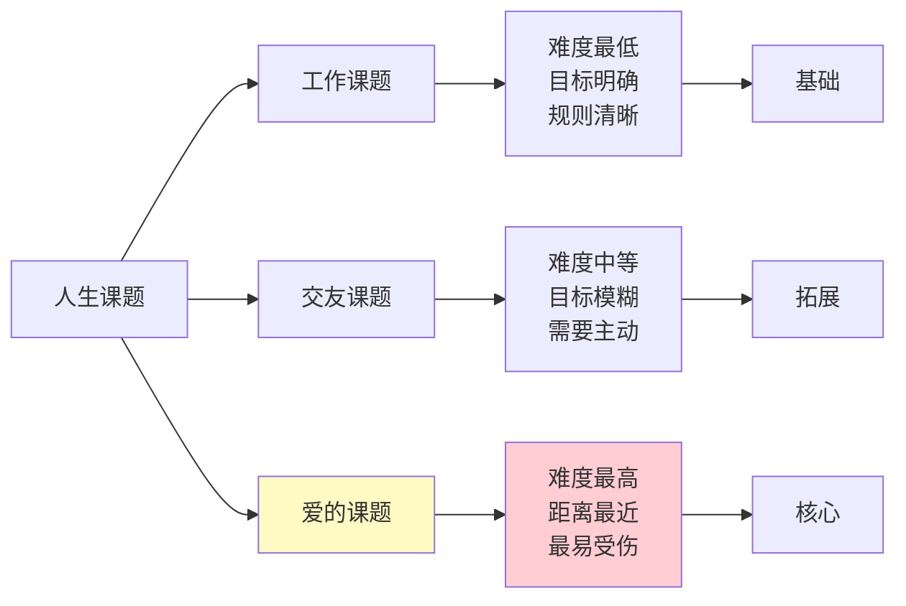
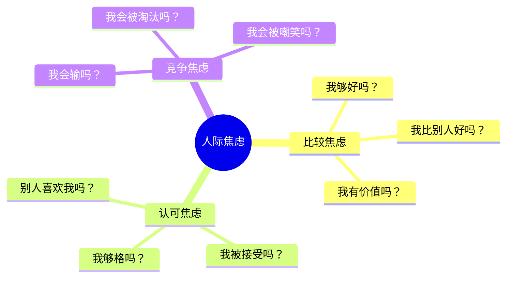

# 第二夜：一切烦恼皆源于人际关系

> **章节定位**：阿德勒心理学的"关系解绑"——从目的论进入人际关系，揭示烦恼的真正根源，为课题分离铺路

---

## 一、章节定位

### 1.1 在全书中的位置



**本夜功能**：揭示烦恼的真正根源是人际关系，区分自卑感与自卑情结，打破竞争思维，为课题分离建立基础

### 1.2 核心主题

| 维度 | 内容 |
|------|------|
| **核心困境** | 为什么我总觉得自己不够好？为什么人际关系这么累？ |
| **阿德勒答案** | 一切烦恼皆源于人际关系——自卑感来自比较，竞争制造敌人 |
| **颠覆观点** | 自卑感人人都有，但自卑情结是借口；优越情结是自卑的伪装 |
| **关键概念** | 自卑感 vs 自卑情结、优越情结、竞争意识、人生课题 |

### 1.3 章节关联

| 关联章节 | 关联关系 | 共同逻辑 |
|----------|----------|----------|
| [[第一夜-我们的不幸是谁的错]] | 前置基础 | 第一夜建立目的论，第二夜用目的论解释人际关系 |
| [[第三夜-让干涉你生活的人滚开]] | 后续应用 | 第二夜揭示问题，第三夜提供解法（课题分离） |
| [[第五夜-认真活在当下]] | 终极呼应 | 破除竞争意识，才能活在当下 |

---

## 二、核心观点（三层提取）

### 观点1：一切烦恼皆源于人际关系

#### 【表层】现象层

**书中的核心命题**：
- "世界上没有真正'内在的'烦恼"——任何烦恼都和他人有关
- 孤独不是因为一个人，而是因为"感觉被他人疏远"
- 自卑不是因为你真的差，而是因为"和他人比较"
- 幸福不是"你有多好"，而是"你在人际关系中的位置"

**读者熟悉的场景**：
- "我自卑" → 不是因为你真的差，而是因为你和别人比较
- "我孤独" → 不是因为你一个人，而是因为你感觉被社会排斥
- "我焦虑" → 不是因为你真的有危险，而是因为你担心他人的评价
- "我不自由" → 不是因为没有能力，而是因为活在他人期待中

#### 【中层】机制层



**人际关系的三大陷阱**：

| 陷阱 | 表现 | 底层目的 | 真实代价 |
|------|------|----------|----------|
| **竞争陷阱** | 和他人比较，必须比别人好 | 证明自己的价值 | 永远不够好，制造敌人 |
| **认可陷阱** | 活在他人期待中 | 获得安全感 | 失去自己，讨好成瘾 |
| **权力陷阱** | 必须赢，必须被服从 | 证明自己是对的 | 关系破裂，陷入斗争 |

#### 【底层】规律层

> **人际关系定律**：一切烦恼都源于人际关系。不是人际关系本身有问题，而是你在人际关系中的"姿态"有问题——你把他人当成竞争者、审判者、敌人。

**降维翻译**：
> 你以为烦恼来自"自己不够好"，
> 阿德勒说：烦恼来自"你用别人的标准评判自己"。
> 
> 你以为烦恼来自"别人对你不好"，
> 阿德勒说：烦恼来自"你把别人当成敌人"。
> 
> **停止比较，烦恼减半；
> 停止竞争，自由开始。**

#### 【当下连接】2026热点

|----------|----------|----------|
| 为什么社交媒体越刷越焦虑？ | 你在用别人的精彩评判自己的平淡 | "原来我在用别人的生活绑架自己" |
| 为什么同事关系这么累？ | 你把同事当成竞争者，而非伙伴 | "原来我在职场里一直在打仗" |
| 为什么越优秀越孤独？ | 优秀=竞争胜利=制造了敌人 | "原来成功也会失去关系" |
| 为什么不敢表达真实想法？ | 你活在他人期待中，怕被否定 | "原来我一直戴着面具活着" |

---

### 观点2：自卑感 vs 自卑情结——健康的自卑是成长的动力

#### 【表层】现象层

**书中的核心区分**：

| 类型 | 定义 | 来源 | 影响 |
|------|------|------|------|
| **自卑感** | "我不够好，所以我要努力" | 与"理想自我"的差距 | 成长动力，健康 |
| **自卑情结** | "我不够好，所以我做不到" | 与"他人"的比较 | 停滞借口，病态 |
| **优越情结** | "我比别人好" | 自卑的伪装 | 虚假优越，脆弱 |

**书中的经典案例**：
- **自卑感**：我想成为优秀的演讲者，现在还不够好，所以我每天练习
- **自卑情结**：我学历低，所以我注定找不到好工作（用自卑当借口）
- **优越情结**：虽然我学历低，但我比那些博士更有"实战经验"（虚假优越）

**读者熟悉的场景**：
- "我内向，所以不会社交" → 自卑情结（用内向当借口）
- "我不够好，所以我要学习" → 自卑感（健康动力）
- "我不如他，但至少我比另一个人强" → 优越情结（向下比较找安慰）

#### 【中层】机制层



**三种心态的本质**：

| 心态 | 对比对象 | 时间方向 | 结果 |
|------|----------|----------|------|
| 自卑感 | 理想自我 | 未来（向前） | 成长 |
| 自卑情结 | 他人 | 过去（向后） | 停滞 |
| 优越情结 | 更差的人 | 向下（俯视） | 虚假安慰 |

**阿德勒的核心观点**：
> 自卑感人人都有，因为人天生"追求优越"——这不是病态，而是前进的动力。
> 
> 问题不在于自卑感本身，而在于你把自卑感变成了"借口"或"武器"。

#### 【底层】规律层

> **自卑感定律**：自卑感不是问题，如何处理自卑感才是问题。健康的自卑感是与"理想自我"的差距，驱动成长；病态的自卑情结是与"他人"的比较，成为借口。

**降维翻译**：
> 自卑感 = "我不够好，所以我要努力"（健康）
> 自卑情结 = "我不够好，所以我做不到"（病态）
> 优越情结 = "我不够好，但我比别人好"（伪装）
> 
> **区别在于：
> 和谁比？——和自己比（健康）vs 和别人比（病态）
> 比了之后？——向前走（健康）vs 停下来（病态）**

#### 【当下连接】

|----------|----------|----------|
| 为什么总觉得自己不够好？ | 自卑感人人都有，关键是你和谁比 | "原来我可以把自卑变成动力" |
| 为什么总用"我不行"当借口？ | 你在用自卑情结逃避责任 | "原来'不行'是我选择的借口" |
| 为什么总要比过别人才舒服？ | 优越情结是自卑的伪装 | "原来'我比别人好'背后是'我怕比别人差'" |
| 为什么越努力越焦虑？ | 你在和他人比较，而非和自己比较 | "原来我一直在错误的赛道上奔跑" |

---

### 观点3：竞争意识——把世界变成战场

#### 【表层】现象层

**书中的核心命题**：
- "竞争意识"让人把他人当成敌人，而非伙伴
- 世界上只有两种人：竞争对手、失败者——这是竞争意识的逻辑
- 竞争意识的终点是孤独：赢了，没有朋友；输了，没有尊严

**读者熟悉的场景**：
- 职场：把同事当竞争对手，暗中较劲
- 社交：比较谁过得更好，谁更成功
- 亲密关系：比较谁付出更多，谁更委屈
- 育儿：比较谁的孩子更优秀

#### 【中层】机制层



**竞争意识的三重陷阱**：

| 陷阱 | 表现 | 后果 |
|------|------|------|
| **把他人当敌人** | 每个人都是竞争对手 | 无法建立真诚关系 |
| **无法享受成功** | 成功=打败别人=制造敌人 | 越成功越孤独 |
| **无法接受失败** | 失败=失去价值=被嘲笑 | 永远焦虑，无法放松 |

#### 【底层】规律层

> **竞争意识定律**：竞争意识让人把世界变成战场，把他人变成敌人。竞争的终点不是胜利，而是孤独——无论输赢，你都失去了真诚的关系。

**降维翻译**：
> 竞争意识的逻辑：
> "我要赢，你必须输。"
> "我要好，你必须比我差。"
> 
> 结果是：
> 我赢了，你没有——你恨我。
> 我输了，你赢了——我恨你。
> 
> **无论输赢，关系都破裂了。**
> 
> 破解之道：
> 把他人当成伙伴，而非对手。
> 把人生当成旅程，而非比赛。

#### 【当下连接】

|----------|----------|----------|
| 为什么职场关系这么累？ | 你把同事当竞争对手，在打一场不存在的仗 | "原来我一直在和假想敌战斗" |
| 为什么成功后更孤独？ | 成功=打败别人=制造敌人 | "原来我的成功代价是失去朋友" |
| 为什么总在比较？ | 竞争意识让你把比较当成存在方式 | "原来我可以退出这场比较游戏" |
| 为什么无法为别人高兴？ | 别人成功=你的失败，这是竞争逻辑 | "原来我把别人的成功当成我的失败" |

---

### 观点4：人生的三类课题——关系的三种形态

#### 【表层】现象层

**书中的人生课题分类**：

| 课题类型 | 对象 | 核心问题 |
|----------|------|----------|
| **工作课题** | 同事、上司、客户 | 我能在这个共同体中有贡献吗？ |
| **交友课题** | 朋友、伙伴 | 我能与他人建立真诚关系吗？ |
| **爱的课题** | 伴侣、家人 | 我能在亲密关系中保持自我吗？ |

**读者熟悉的场景**：
- 工作课题：职场人际、同事关系、上下级沟通
- 交友课题：社交焦虑、朋友疏远、孤独感
- 爱的课题：亲密关系冲突、家庭矛盾、亲子问题

#### 【中层】机制层



**三类课题的递进关系**：
1. **工作课题**：最容易——有明确目标，关系相对简单
2. **交友课题**：较难——没有明确目标，需要主动建立
3. **爱的课题**：最难——距离最近，最易受伤，最需勇气

#### 【底层】规律层

> **人生课题定律**：人生的三类课题（工作、交友、爱）是人际关系的三个层次。从工作到交友到爱，难度递增，但也更加核心。无法回避课题，只能在课题中成长。

**降维翻译**：
> 人生就是三类关系：
> 工作关系——我在团队中能贡献什么？
> 朋友关系——我能和谁建立真诚连接？
> 亲密关系——我能在多近的距离保持自我？
> 
> **三类关系，三类考验。
> 逃避任何一类，人生都不完整。**

---

## 三、金句库

### 原书金句（12句）

**【人际关系核心】**
1. "一切烦恼，都来自人际关系。"
2. "只要涉及人际关系，就会有烦恼。"
3. "世界上没有真正'内在的'烦恼——任何烦恼都和他人有关。"

**【自卑感】**
4. "自卑感人人都有，它本身不是坏事。"
5. "自卑感是追求优越的动力，自卑情结是逃避的借口。"
6. "优越情结是自卑情结的另一种表现。"

**【竞争意识】**
7. "竞争意识让人把他人当成敌人。"
8. "在竞争中，世界上只有两种人：竞争对手和失败者。"
9. "竞争的终点不是胜利，而是孤独。"

**【人生课题】**
10. "人生有三类课题：工作、交友、爱。"
11. "爱的课题最难，因为距离最近，最易受伤。"
12. "不能逃避人生课题，只能在课题中成长。"

---

### 降维金句（18句）

**【人际关系·清醒版】**
1. **一切烦恼来自人际关系——不是你不好，是你用别人的标准评判自己。**
2. **停止比较，烦恼减半；停止竞争，自由开始。**
3. **孤独不是一个人，而是你感觉被他人疏远。**
4. **自卑不是你真的差，而是你和别人比较。**
5. **你把世界当战场，世界就回报你敌人。**

**【自卑感·分辨版】**
6. **自卑感 = "我不够好，所以我要努力"（健康）**
7. **自卑情结 = "我不够好，所以我做不到"（病态）**
8. **优越情结 = "我不够好，但我比别人好"（伪装）**
9. **区别在于：和谁比？和自己比（健康）vs 和别人比（病态）**
10. **"我不行"不是事实，是你选择的借口。**

**【竞争意识·破除版】**
11. **竞争意识的终点不是胜利，而是孤独——赢了没有朋友，输了没有尊严。**
12. **把他人当敌人，世界就是战场；把他人当伙伴，世界就是家园。**
13. **你一直在和假想敌战斗，但敌人根本不存在。**
14. **比较让你永远不够好，因为总有人比你好。**

**【人生课题·实践版】**
15. **人生就是三类关系：工作、朋友、爱——逃避任何一类，人生都不完整。**
16. **工作关系最简单，朋友关系需要主动，亲密关系最需要勇气。**
17. **三类课题，三类考验；不逃避，才能成长。**
18. **你无法选择有没有课题，但可以选择怎么面对课题。**

---

## 四、当下映射

### 2026年读者痛点连接

|------|--------------|----------|
| **社交媒体焦虑** | 你在用别人的精彩评判自己的平淡——退出比较游戏 | "原来我在用别人的生活绑架自己" |
| **职场内卷** | 你把同事当敌人，在打一场不存在的仗 | "原来敌人是我自己制造的" |
| **35岁孤独** | 竞争让你失去了真诚关系——赢了没有朋友 | "原来我的成功代价是孤独" |
| **原生家庭** | 不是家庭决定你，是你用家庭当借口——自卑情结 | "原来'原生家庭'是我选择的解释" |
| **完美主义** | 你在和自己比较，还是在和别人比较？ | "原来我可以只要'比自己好'" |

### 三大焦虑深度连接



**第二夜的解药**：
- **比较焦虑** → 停止和他人比较，只和过去的自己比较
- **认可焦虑** → 退出认可游戏，课题分离（下一夜）
- **竞争焦虑** → 把他人当成伙伴，而非敌人

---

## 五、章节关联

### 与第一夜的承接

| 第一夜 | 第二夜 | 承接关系 |
|--------|--------|----------|
| 目的论 | 用目的论解释人际关系 | 目的论揭示：你和他人比较是"为了"什么？ |
| "一切烦恼源于人际关系" | 详细展开 | 第一夜提出命题，第二夜论证命题 |
| 改变的勇气 | 从竞争意识中退出的勇气 | 改变需要勇气——退出竞争更需要勇气 |

### 与后续章节的铺垫

```mermaid
flowchart LR
    A[第二夜<br/>烦恼源于人际关系] --> B[第三夜<br/>课题分离]
    B --> C[第四夜<br/>他者贡献]
    C --> D[第五夜<br/>活在当下]
    
    A -->|"问题诊断"| B
    A -->|"需要解法"| B
    B -->|"具体方法"| C
    C ->|"终极目标"| D
    
    style A fill:#fff9c4
    style B fill:#e3f2fd
    style D fill:#c8e6c9
```

**铺垫关系**：
- 第二夜揭示问题：人际关系为什么烦恼？（竞争意识、自卑情结）
- 第三夜提供解法：如何解绑？（课题分离）
- 第四夜升华关系：从"不被影响"到"主动贡献"
- 第五夜终极目标：破除竞争，活在当下

### 与主拆解记录的关联

| 概念 | 第二夜深化 | 主记录位置 |
|------|------------|------------|
| 自卑感 vs 自卑情结 | 详细区分+案例 | [[被讨厌的勇气-岸见一郎-拆解记录#观点3]] |
| 竞争意识 | 深度剖析机制 | [[被讨厌的勇气-岸见一郎-拆解记录#观点2]] |
| 人生课题 | 三类课题详解 | 主记录未展开，本章新增 |

---

## 六、问答设计（青年vs哲人）

### Q1：自卑感不是正常的吗？为什么说要用它当动力？

**青年**："我觉得自卑很正常啊，谁没有自卑的时候？这不是人之常情吗？"

**哲人的回答（目的论版）**：
> 自卑感确实人人都有，阿德勒不否认这一点。
> 
> 但关键问题是：你的自卑感，是在驱动你前进，还是在阻止你行动？
> 
> 自卑感："我不够好，所以我要努力"——向前走
> 自卑情结："我不够好，所以我做不到"——停下来
> 
> **自卑感本身不是问题，你把自卑感变成什么，才是问题。**

**降维翻译**：
> 自卑感不是你的敌人，是你的信号灯。
> 
> 它告诉你：你和理想之间还有差距。
> 
> 问题不是"有没有自卑感"，
> 而是"自卑感之后，你做什么？"
> 
> **向前走，还是停下来？——这才是关键。**

---

### Q2：竞争不是好事吗？为什么要退出竞争？

**青年**："竞争让人进步，没有竞争，社会怎么发展？阿德勒是不是太理想化了？"

**哲人的回答（实用主义版）**：
> 阿德勒不反对"追求卓越"，他反对的是"竞争意识"。
> 
> 区别在于：
> 追求卓越 = 和过去的自己比较，不断超越
> 竞争意识 = 和他人比较，必须打败别人
> 
> 追求卓越让你进步，竞争意识让你焦虑。
> 
> **你可以追求卓越，但不一定要打败别人。**

**降维翻译**：
> 追求卓越 ≠ 竞争
> 
> 追求卓越：我要比我昨天更好——和自己比
> 竞争意识：我要比你更好——和别人比
> 
> 问题在于：
> 和自己比，你有掌控感。
> 和别人比，你永远被动。
> 
> **你控制不了别人，但可以控制自己。**
> 
> 所以：追求卓越，退出竞争。

---

### Q3：如果我不竞争，会不会被淘汰？

**青年**："现实很残酷啊。我不和别人竞争，别人会来竞争我。我退出，不就等于放弃吗？"

**哲人的回答（目的论版）**：
> 你说"别人会来竞争我"——这是竞争意识的逻辑。
> 
> 但你想想：别人真的是你的敌人吗？
> 你的同事，真的想打败你吗？
> 你的朋友，真的在和你比较吗？
> 
> 大多数时候，敌人是你想象出来的。
> 你在和假想敌战斗，但敌人根本不存在。
> 
> **退出竞争不是放弃，而是停止和假想敌的战争。**

**降维翻译**：
> 你以为世界是战场，
> 其实战场在你心里。
> 
> 你以为别人在和你竞争，
> 其实别人根本没空想你。
> 
> 你一直在和假想敌战斗，
> 但敌人从来不存在。
> 
> **放下武器，世界就不再是战场。**

---

### Q4：自卑情结和优越情结，我好像都有，怎么办？

**青年**："我有时候觉得自己很差（自卑），有时候又觉得比某些人强（优越）。这两种心态都有，是不是很分裂？"

**哲人的回答（一致性版）**：
> 你不分裂，你很正常——自卑情结和优越情结，其实是一体两面。
> 
> 自卑情结："我不够好，所以我做不到"
> 优越情结："我不够好，但我比别人好"
> 
> 它们的共同点：都在和他人比较。
> 区别只是：向上比（自卑）还是向下比（优越）。
> 
> **两者的根源都是自卑——只不过一个承认，一个伪装。**

**降维翻译**：
> 自卑情结和优越情结，是一枚硬币的两面。
> 
> 正面：我不够好（自卑）
> 反面：但我比别人好（优越）
> 
> 它们都是比较的产物。
> 
> **破解之道：
> 停止和他人比较，只和过去的自己比较。**
> 
> "我比昨天的自己好"——这是健康的心态。
> "我比别人好/比别人差"——这是病态的比较。

---

## 七、实践练习

### 72小时微应用

**练习1：自卑感类型识别**
```
当你感到"自卑"时，问自己：
□ 我是在和谁比较？（理想自己 vs 他人）
□ 比较之后，我想做什么？（努力前进 vs 找借口停下）
□ 这是自卑感还是自卑情结？
```

**练习2：竞争意识检视**
```
识别你的"假想敌"：
□ 我在职场把谁当成竞争对手？
□ 我在社交中把谁当成比较对象？
□ 这些"敌人"真的在和我竞争吗？
□ 如果退出竞争，会发生什么？
```

**练习3：优越情结觉察**
```
当你想说"至少我比某某好"时：
□ 我为什么需要向下比较？
□ 这背后是不是一种自卑？
□ 如果不比较，我的价值在哪里？
```

### 检索测试（闭书自测）

```
□ 能否区分自卑感和自卑情结？
□ 能否举出一个"优越情结"的例子？
□ 能否解释为什么"竞争意识"制造敌人？
□ 能否说出人生的三类课题？
□ 能否用一句话总结第二夜的核心观点？
```

---

## 八、章节金句卡片

### 核心金句（可直接制图）

1. **"一切烦恼，都来自人际关系。"**

2. **"自卑感人人都有，自卑情结是借口。"**

3. **"竞争意识的终点不是胜利，而是孤独。"**

4. **"停止比较，烦恼减半；停止竞争，自由开始。"**

5. **"你把世界当战场，世界就回报你敌人。"**

---
