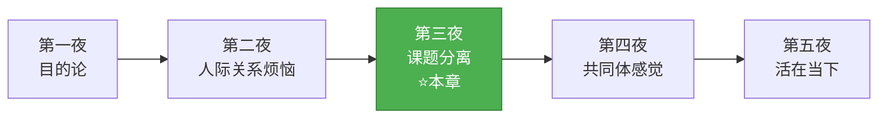
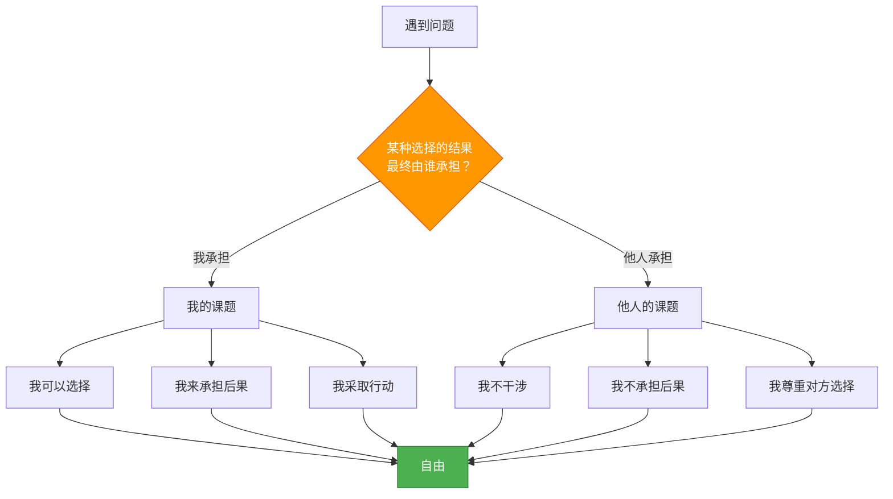
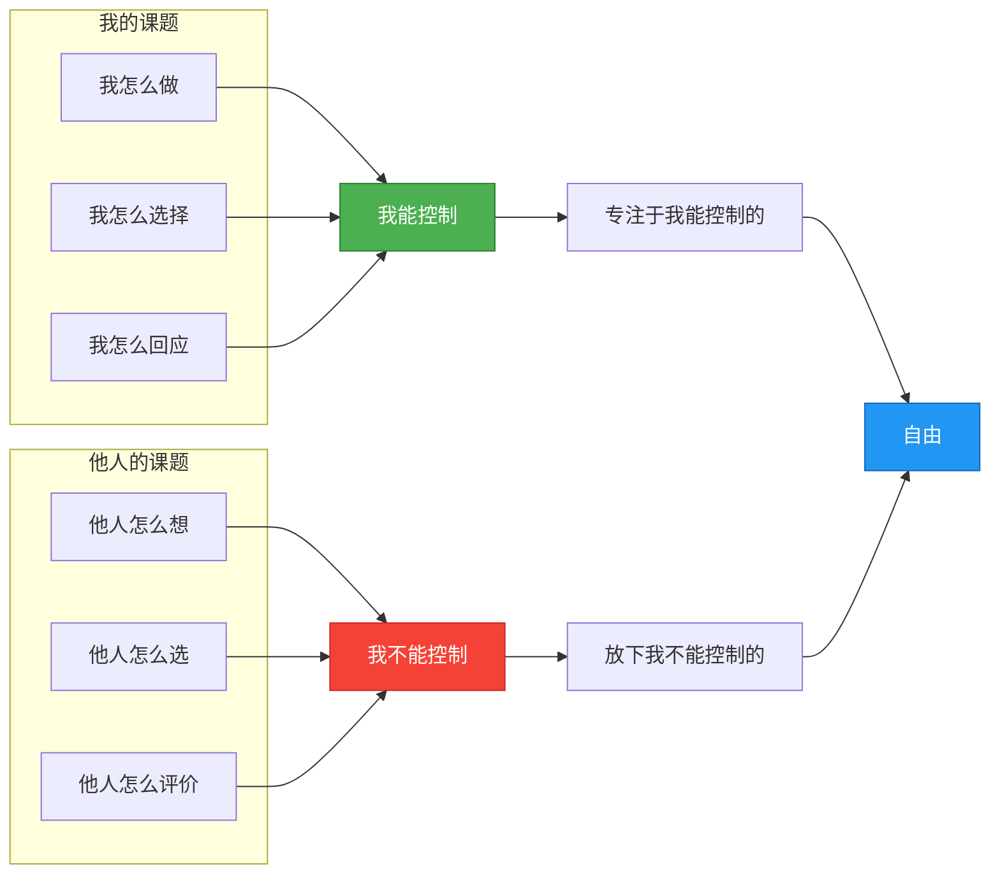
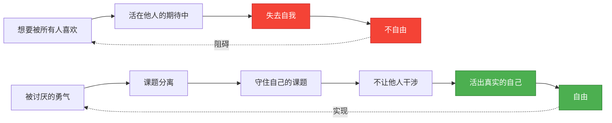
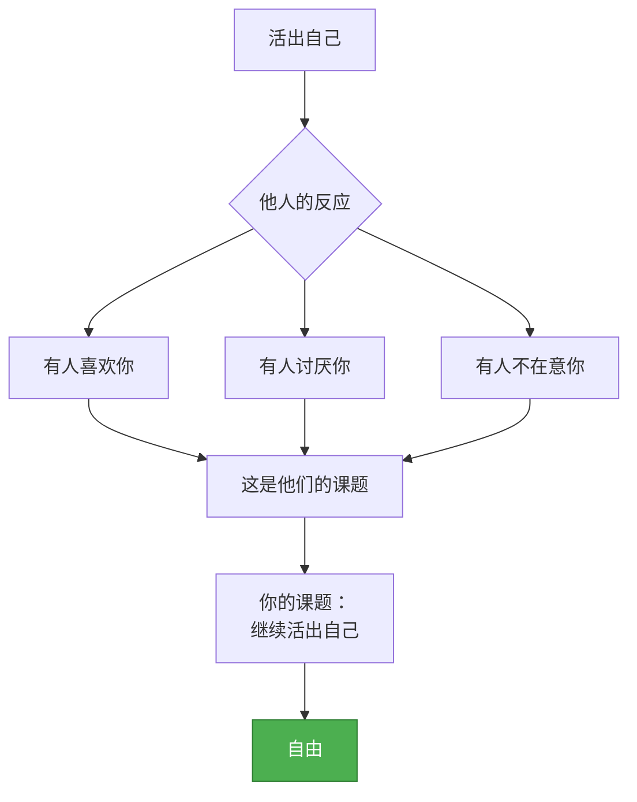
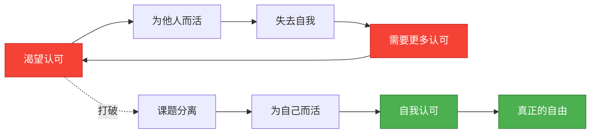

# 第三夜：让干涉你生活的人滚开

> **核心概念**：课题分离
> **章节定位**：阿德勒心理学的"自由密钥"——从关系烦恼到个体自由的实践方法论
> **一句话总结**：自由的前提是课题分离，分清什么是你的课题，什么是别人的课题

---

## 一、章节定位

### 1.1 这一夜在解决什么问题？

**核心困境**：
- ❌ 为什么总是被别人的期待压得喘不过气？
- ❌ 为什么别人的情绪总是影响我？
- ❌ 为什么想改变别人却总是失败？
- ❌ 为什么活得这么累，却不知道为谁而活？

**阿德勒给出的答案**：

**一句话定位**：
> 自由不是别人允许你做什么，而是你不再让别人决定你做什么。课题分离，就是自由的前提。

---

### 1.2 这一夜在五夜结构中的位置



**承上启下**：
- **承接第二夜**：既然烦恼来自人际关系，那怎么解？→ 课题分离
- **开启第四夜**：课题分离不是冷漠，而是建立健康关系的基础 → 共同体感觉

---

### 1.3 与其他章节的关联

| 章节 | 关联关系 | 共同逻辑 |
|------|----------|----------|
| [[第一夜-我们的不幸是谁的错]] | 基础理论 | 目的论→课题分离，都是强调"你可以选择" |
| [[第二夜-一切烦恼皆源于人际关系]] | 问题铺垫 | 诊断烦恼根源→提供解决方案 |
| 第四夜 | 延伸实践 | 课题分离→共同体感觉，从"不干涉"到"贡献" |
| 第五夜 | 终极目标 | 课题分离→活在当下，自由的最终实现 |

---

## 二、核心观点（三层提取）

### 观点1：课题分离——人际关系的解药

#### 【表层】现象层

**书中核心案例**：

1. **孩子不学习**：
   - 父母焦虑："不学习将来怎么办？"
   - 阿德勒问：学习的结果谁来承担？→ 孩子
   - 结论：学习是孩子的课题，不是父母的课题

2. **别人的评价**：
   - 你害怕被人讨厌
   - 阿德勒问：讨厌你是谁的事？→ 别人
   - 结论：别人怎么看你，是别人的课题

3. **父母的期待**：
   - 父母希望你稳定、结婚、生子
   - 阿德勒问：这些选择的结果谁来承担？→ 你自己
   - 结论：怎么活是自己的课题，父母的期待是父母的课题

**读者熟悉的场景**：
- 同事阴阳怪气 → 同事的课题；我怎么回应 → 我的课题
- 伴侣不理解我 → 伴侣的课题；我怎么沟通 → 我的课题
- 朋友不回消息 → 朋友的课题；我怎么看待 → 我的课题
- 父母催婚 → 父母的课题；我结不结婚 → 我的课题

#### 【中层】机制层

**课题判断的标准**：



**课题分离的三大误区**：

| 误区 | 表现 | 正解 |
|------|------|------|
| **干涉他人课题** | 强迫孩子学习、试图改变伴侣 | 尊重对方选择，告知后果而非强制 |
| **让他人干涉自己的课题** | 因为别人评价而改变自己 | 守住边界，按自己的方式活 |
| **课题混淆不清** | 把自己的焦虑投射到孩子身上 | 用"后果承担者"标准判断 |

**课题分离的边界**：



#### 【底层】规律层

> **课题分离定律**：人际关系的烦恼，都来自于课题分离不清——要么干涉他人课题，要么让他人干涉自己的课题。自由的前提，是分清什么是你该负责的，什么是别人该负责的。

**降维翻译**：
> 课题分离 = 心理边界
>
> 孩子学不学习，不是你的课题，
> 你怎么和孩子沟通，才是你的课题。
>
> 别人讨不讨厌你，不是你的课题，
> 你怎么做自己，才是你的课题。
>
> **自由不是别人允许你做什么，
> 而是你不再让别人决定你做什么。**

#### 【当下连接】2026热点锚定

|----------|----------|----------|
| 为什么总被父母的期待压得喘不过气？ | 父母的期待，是父母的课题；你怎么选择，是你的课题 | "原来我可以守住边界" |
| 为什么同事的负面情绪总影响我？ | 同事的情绪，是同事的课题；我怎么反应，是我的课题 | "原来我不需要为别人情绪负责" |
| 为什么总想改变伴侣？ | 改变是对方的课题；你怎么沟通，是你的课题 | "原来改变他人=侵犯边界" |
| 为什么讨好别人后更空虚？ | 讨好=让别人干涉你的课题，失去自己 | "原来我一直在放弃自己的课题" |
| **深度连接** | | |
| 为什么社交媒体焦虑？ | 别人怎么评价你，是别人的课题；你怎么看待自己，是你的课题 | "原来点赞≠我的价值" |
| 为什么35岁如此焦虑？ | 社会期待是社会的课题；我选择怎么活是我的课题 | "原来我一直在用别人标准活" |

---

### 观点2：被讨厌的勇气——自由的代价

#### 【表层】现象层

**书中核心命题**：
- **自由是什么**："自由就是被人讨厌的勇气"
- **为什么不自由**：因为想让所有人都喜欢，所以活在他人的期待中
- **如何获得自由**：课题分离（不干涉他人课题，不让他人干涉自己的课题）

**读者熟悉的场景**：
- 职场：不敢表达不同意见，怕被同事讨厌 → 失去自我
- 社交：不敢拒绝邀请，怕朋友不高兴 → 失去自由
- 亲密关系：不敢做自己，怕伴侣不接受 → 失去真实
- 家庭：不敢违背父母期待，怕让父母失望 → 失去选择

#### 【中层】机制层

**被讨厌的勇气的心理机制**：



**自由的三个层次**：

| 层次 | 状态 | 描述 | 表现 |
|------|------|------|------|
| **不自由** | 活在他人的期待中 | 想要被所有人喜欢 | 讨好、恐惧、焦虑 |
| **部分自由** | 能够守课题 | 不干涉他人，但仍会被评价影响 | 有边界，但不坚定 |
| **完全自由** | 被讨厌的勇气 | 完全不被他人评价左右 | 真实、坦然、自主 |

**"被讨厌"的本质**：



#### 【底层】规律层

> **被讨厌的勇气定律**：真正的自由不是为所欲为，而是不被他人的评价左右。自由的代价是被讨厌——你活出自己，一定有人不喜欢；但为了自由，这是值得付出的代价。

**降维翻译**：
> 你想让所有人都喜欢，
> 就会失去自己。
>
> 你想活出自己，
> 就要接受有人讨厌你。
>
> **被讨厌不是你的问题，
> 而是自由的证明。**
>
> **没有被讨厌的勇气，
> 就没有真正的自由。**

#### 【当下连接】

|----------|----------|----------|
| 为什么不敢表达真实想法？ | 想要被所有人喜欢=失去自由 | "原来我一直在用自由换认可" |
| 为什么总被别人的看法影响？ | 没有守住课题，让他人干涉了 | "原来我可以不被左右" |
| 为什么活得这么累？ | 一直在扮演别人期待的角色 | "原来我可以放下表演" |
| **深度连接** | | |
| 为什么内卷时代如此焦虑？ | 内卷=想要被所有人认可；出圈=敢于被讨厌 | "原来我一直在参与竞争，而非选择自己" |
| 为什么朋友圈不敢发真实内容？ | 想要被所有人点赞=活在他人眼光里 | "原来我一直在经营人设，而非活出自己" |

---

### 观点3：真正的"认可"来自自己

#### 【表层】现象层

**书中核心观点**：
- **认可欲求**：希望被他人认可，是人的本能
- **认可欲求的危险**：让你活在他人的期待中，失去自己
- **真正的认可**：来自自己对自己的认可，而非他人

**读者熟悉的场景**：
- 发了朋友圈，不停刷新看有没有人点赞
- 完成一项工作，期待领导表扬
- 帮了别人，希望对方说谢谢
- 穿了新衣服，期待别人夸好看

#### 【中层】机制层

**认可欲求的陷阱**：



**两种认可对比**：

| 维度 | 他者认可 | 自我认可 |
|------|----------|----------|
| **来源** | 外在评价 | 内在评价 |
| **稳定性** | 波动、不确定 | 稳定、可控 |
| **代价** | 失去自主 | 承担责任 |
| **结果** | 焦虑、空虚 | 自由、充实 |
| **获得方式** | 迎合他人 | 诚实面对自己 |

#### 【底层】规律层

> **自我认可定律**：真正的认可不是来自他人的掌声，而是来自你对自己的诚实。当你不再需要外界认可时，你才真正自由。

**降维翻译**：
> 你不需要所有人都认可你，
> 你只需要自己认可自己。
>
> 别人的掌声是锦上添花，
> 自己的认可是雪中送炭。
>
> **当你不再需要别人的认可，
> 你才真正拥有了自由。**

#### 【当下连接】

|----------|----------|----------|
| 为什么越被夸越焦虑？ | 把自我价值绑定在外界评价上 | "原来我一直在用别人的尺子量自己" |
| 为什么没人点赞就失落？ | 依赖他者认可，没有自我认可 | "原来我需要的是自己的认可" |
| 为什么总在意别人眼光？ | 把别人的评价当成了自己的课题 | "原来评价我是别人的事，我怎么做是我的事" |

---

## 三、金句库

### 原书金句

**【课题分离】**
1. "一切烦恼，都来自人际关系。"
2. "基本上，一切人际关系矛盾都起因于对别人的课题妄加干涉，或者自己的课题被别人妄加干涉。"
3. "辨别究竟是谁的课题的方法非常简单：只需要考虑一下，某种选择所带来的结果最终由谁来承担。"
4. "可以选择改变，也可以选择不变。选择不变的，是你自己。"
5. "关于自己的人生，你能够做的只有'选择自己认为最好的道路'。"

**【被讨厌的勇气】**
6. "自由就是被人讨厌的勇气。"
7. "不想被人讨厌，就不得不活在别人的人生中。"
8. "被别人讨厌，是证明你活出自由的证据。"
9. "为了不被任何人讨厌，你必须时刻看别人的脸色，这极其不自由的生活方式。"

**【认可欲求】**
10. "根本没有必要得到他人的认可。"
11. "过于希望得到别人的认可，就会按照别人的期待去生活。"

---

### 降维金句

**【课题分离·边界版】**
1. **孩子学不学习，不是你的课题；你怎么和孩子沟通，才是你的课题。**
2. **别人讨不讨厌你，不是你的课题；你怎么做自己，才是你的课题。**
3. **自由不是别人允许你做什么，而是你不再让别人决定你做什么。**
4. **课题分离：用"后果谁来承担"判断，不是你的事，不要操心。**

**【被讨厌的勇气·自由版】**
5. **你想让所有人都喜欢，就会失去自己；你想活出自己，就要接受有人讨厌你。**
6. **被讨厌不是你的问题，而是自由的证明——没有不被讨厌的勇气，就没有真正的自由。**
7. **内卷的本质：想要被所有人认可；出圈的本质：敢于被讨厌。**
8. **讨好所有人，就是放弃自己。**

**【自我认可·价值版】**
9. **真正的认可不是别人的掌声，而是你对自己的诚实。**
10. **当你不再需要别人的认可，你才真正拥有了自由。**
11. **自我价值不是点赞数，而是你对自己的评价。**

---

## 四、当下映射

### 2026年热点连接

| 热点现象 | 课题分离视角 | 洞察 |
|----------|--------------|------|
| **社交媒体焦虑** | 别人怎么评价你是别人的课题 | 点赞≠你的价值 |
| **35岁中年危机** | 社会期待是社会的课题 | 你选择怎么活是你的课题 |
| **内卷与躺平** | 内卷=被他人评价驱动；躺平=放弃选择 | 课题分离=自己选择 |
| **亲子教育焦虑** | 孩子的人生是孩子的课题 | 你怎么做父母是你的课题 |
| **职场PUA** | 对方的操控是对方的课题 | 你怎么回应是你的课题 |
| **容貌焦虑** | 别人怎么看你审美是别人的课题 | 你怎么看待自己是你的课题 |

### 读者画像与痛点

**核心人群**：25-40岁，面临边界不清困扰

| 痛点 | 课题分离解法 |
|------|--------------|
| 总被父母期待绑架 | 父母的期待是父母的课题；你的选择是你的课题 |
| 同事情绪影响自己 | 同事的情绪是同事的课题；你的反应是你的课题 |
| 总想改变伴侣 | 改变对方是对方的课题；你怎么沟通是你的课题 |
| 讨好型人格 | 讨好=让别人干涉你的课题；守住课题=不被干涉 |
| 不敢拒绝别人 | 别人的期待是别人的课题；你的拒绝是你的权利 |

---

## 五、章节关联

### 与主读书笔记的关联

本章节是[[被讨厌的勇气-岸见一郎]]中**观点2：课题分离**的深度展开。

| 主记录观点 | 本章节深化 |
|------------|------------|
| 课题分离定义 | 课题判断标准：后果承担者 |
| 三大误区 | 详述：干涉他人、被他人干涉、课题混淆 |
| 降维翻译 | 生活化场景：孩子学习、他人评价、父母期待 |

### 与前后章节的关联

```mermaid
flowchart LR
    subgraph 第一夜
        A1[目的论]
        A2[你可以选择]
    end
    
    subgraph 第二夜
        B1[烦恼来自人际关系]
        B2[自卑感与竞争]
    end
    
    subgraph 第三夜 ⭐
        C1[课题分离]
        C2[被讨厌的勇气]
        C3[自我认可]
    end
    
    subgraph 第四夜
        D1[共同体感觉]
        D2[他者贡献]
    end
    
    A1 --> C1
    B1 --> C1
    C1 --> D1
    
    style C1 fill:#4CAF50,stroke:#2E7D32,color:#fff
    style C2 fill:#4CAF50,stroke:#2E7D32,color:#fff
    style C3 fill:#4CAF50,stroke:#2E7D32,color:#fff
```

### 与其他书籍的关联

| 书籍 | 关联点 | 对话 |
|------|--------|------|
| [[影响力-西奥迪尼]] | 课题分离 vs 影响力的六大原则 | 防御影响的盾牌 |
| [[少有人走的路-派克]] | 课题分离 vs 承担责任 | 都强调主动承担 |
| [[道德经-老子]] | 课题分离 ≈ 无为而治 | 不干涉他人 |
| [[庄子-庄子]] | 被讨厌的勇气 ≈ 逍遥游 | 精神自由 |

---

## 六、问答设计

### 读者高频问题Q&A

#### Q1：课题分离是不是冷漠、不负责任？

**A**：不是。

- 课题分离≠不管别人
- 课题分离=尊重对方的选择权
- 你可以**告知后果**，但不能**强制选择**

**案例**：
- ❌ 冷漠：孩子不学习，完全不管

---

#### Q2：如果孩子的选择真的错了怎么办？

**A**：让孩子承担后果，是最好的教育。

- 错误是成长的一部分
- 父母替孩子承担后果，孩子永远学不会负责
- 课题分离的本质是：相信对方有能力面对自己的人生

**阿德勒金句**：
> "你可以把孩子带到河边，但不能强迫他喝水。"

---

#### Q3：课题分离怎么用在职场？

**A**：三步法

1. **判断**：这件事的结果谁承担？
2. **分离**：我的课题 vs 他人的课题
3. **行动**：专注我的课题，放下他人的课题

**案例**：
- 同事阴阳怪气 → 同事的课题
- 我怎么回应 → 我的课题
- 选择：不被情绪带偏，专注工作本身

---

#### Q4：被讨厌的勇气，怎么培养？

**A**：三个练习

1. **小范围练习**：从拒绝小请求开始
2. **课题分离意识**：每次在意别人评价时，问自己"这是谁的课题？"
3. **自我认可**：每天记录3件自己认可自己的事

**关键认知**：
> 被讨厌是必然的——你活出自己，一定有人不喜欢。接受这一点，就是勇气的开始。

---

#### Q5：课题分离和"关心别人"矛盾吗？

**A**：不矛盾。

- 课题分离≠冷漠
- 课题分离=边界清晰的关系
- 真正的关心是：尊重对方的选择，而非替对方做选择

**公式**：
> 关心 = 告知后果 + 尊重选择 + 陪伴承担

---

### 章节测试题

**测试你对课题分离的理解**：

1. 朋友不回你消息，你很焦虑。这是谁的课题？
   - [ ] 朋友的课题
   - [ ] 你的课题
   - [ ] 两个人都有

<details>
<summary>点击查看答案</summary>

**答案**：朋友的课题
- 朋友回不回消息 → 朋友的课题
- 你怎么看待这件事 → 你的课题
- 焦虑是因为你把朋友的课题当成了自己的课题
</details>

---

2. 父母希望你考公务员，你想创业。这是谁的课题？

<details>
<summary>点击查看答案</summary>

**答案**：
- 父母的期待 → 父母的课题
- 你的人生选择 → 你的课题
- 结果由你承担，所以选择权在你
</details>

---

## 七、章节总结

### 核心公式

```
自由 = 课题分离 + 被讨厌的勇气 + 自我认可

课题分离 = 分清"我的课题"和"别人的课题"
         = 用"后果谁来承担"判断
         = 不干涉他人 + 不让他人干涉

被讨厌的勇气 = 接受有人不喜欢你
             = 为自己而活
             = 自由的代价
```

### 一句话记住这一夜

> **课题分离：孩子学不学习是他的课题，你怎么和他沟通是你的课题。**
> **被讨厌的勇气：你想让所有人都喜欢，就会失去自己。**
> **自由的代价是被讨厌，但这是值得的。**

---
