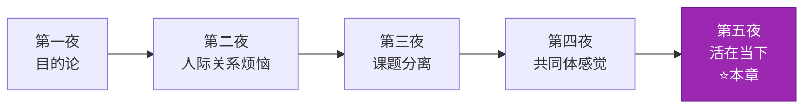
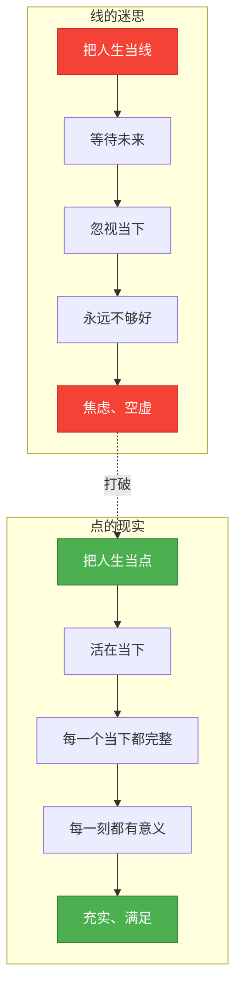
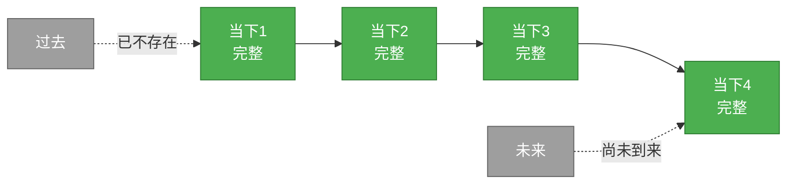
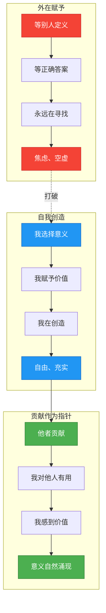
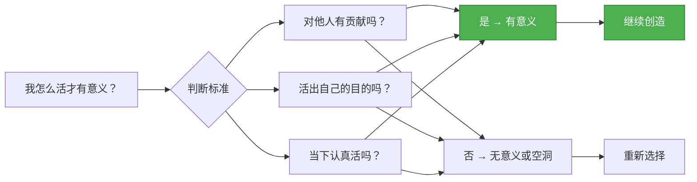
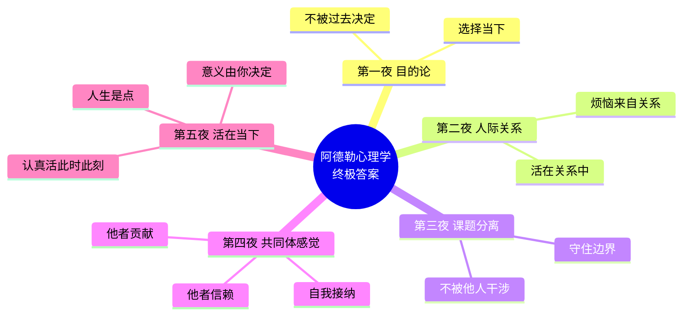

# 第五夜：认真活在"当下"

> **核心概念**：活在当下、人生的意义
> **章节定位**：阿德勒心理学的"终极答案"——整合前面四夜，给出人生的终极答案
> **一句话总结**：人生不是线，而是点的连续；意义不是找到的，是你决定的

---

## 一、章节定位

### 1.1 这一夜在解决什么问题？

**核心困境**：
- ❌ 为什么总等"以后"才幸福？
- ❌ 为什么总觉得人生"不对"？
- ❌ 为什么越规划越焦虑？
- ❌ 活着有什么意义？

**阿德勒给出的答案**：

**一句话定位**：
> 人生不是"等我...就幸福"的线，而是"我现在就在好好活"的点。意义不是找到的，是你决定的。此时此刻认真活，就是人生最大的意义。

---

### 1.2 这一夜在五夜结构中的位置



**承上启下**：
- **承接第四夜**：共同体感觉是关系的理想状态 → 如何在当下实现？
- **终极整合**：目的论（选择）+ 课题分离（自由）+ 共同体感觉（价值）→ 活在当下（意义）

---

### 1.3 与其他章节的关联

| 章节 | 关联关系 | 共同逻辑 |
|------|----------|----------|
| [[第一夜-我们的不幸是谁的错]] | 理论基础 | 目的论→当下选择，你可以选择如何活在此时此刻 |
| [[第二夜-一切烦恼皆源于人际关系]] | 问题铺垫 | 人生课题→活在关系中，不是活在未来中 |
| [[第三夜-让干涉你生活的人滚开]] | 前提准备 | 课题分离→守住当下，不让未来焦虑和过去创伤干扰 |
| [[第四夜-要有被讨厌的勇气]] | 价值基础 | 他者贡献→活在当下的动力是贡献感 |

---

## 二、核心观点（三层提取）

### 观点1：人生不是线，而是点的连续

#### 【表层】现象层

**书中核心观点**：
- **"线"的迷思**：人生是从过去到未来的线，有起点和终点，中间是过程
- **"点"的现实**：人生是无数个"现在"的连续，每一个当下都是完结的
- **关键区别**：把人生当"线"，就会等待未来；把人生当"点"，就会活在当下

**两种人生观对比**：

| 维度 | 线的人生观 | 点的人生观 |
|------|------------|------------|
| **时间观** | 过去→现在→未来 | 只有现在 |
| **幸福观** | 等我...就幸福 | 此刻就幸福 |
| **目标观** | 到达终点才有意义 | 每一步都有意义 |
| **焦虑来源** | 担心未来、遗憾过去 | 没有焦虑 |
| **生命态度** | 旅途 → 目的地 | 每一刻都是目的地 |

**读者熟悉的场景**：
- "等我赚够了钱，就幸福了" → 把人生当线，幸福在未来
- "等我退休了，就自由了" → 把人生当线，自由在未来
- "等孩子长大了，就轻松了" → 把人生当线，轻松在未来
- **阿德勒说**：现在就可以幸福，现在就可以自由，现在就可以轻松

---

#### 【中层】机制层

**"线的迷思"如何制造焦虑**：



**点的连续的真相**：



**为什么"等待"是陷阱**：

| 等待类型 | 表达 | 真相 |
|----------|------|------|
| **等待成功** | "等我成功了，就幸福" | 成功的终点会不断后移 |
| **等待爱情** | "等遇到对的人，就完整" | 你自己不完整，遇到谁都不会完整 |
| **等待自由** | "等我退休了，就自由" | 现在不自由，退休也不会自由 |
| **等待意义** | "等我找到人生意义，就开始活" | 意义不是找到的，是创造的 |

---

#### 【底层】规律层

> **点的人生定律**：人生不是线，而是无数个"现在"的连续。每一个当下都是完结的、圆满的。把人生当线，永远在等待；把人生当点，每一刻都在活。

**降维翻译**：
> 人生不是"等我...就幸福"的线，
> 而是"我现在就在好好活"的点。
>
> 你一直在等以后，
> 可以后永远不会来，
> 来的永远是现在。
>
> **不是等到终点才有意义，
> 每一步都有意义。**

---

#### 【当下连接】2026热点锚定

|----------|----------|----------|
| 为什么总等"以后"才幸福？ | 把人生当线，幸福在未来；人生是点，幸福在当下 | "原来我可以现在就幸福" |
| 为什么越规划越焦虑？ | 规划=活在未来；活在当下=关注此时此刻 | "原来我可以放下未来焦虑" |
| 为什么总觉得"还不够"？ | 把人生当线，终点永远在前方；把人生当点，每一刻都完整 | "原来我可以现在就满足" |
| **深度连接** | | |
| 为什么拖延症总治不好？ | **把人生当线，重要的事在未来；把人生当点，现在就可以开始** | "原来我一直在推迟人生" |
| 为什么35岁如此迷茫？ | **停止"等我..."，开始"我此刻..."** | "原来我一直在等待一个不会来的未来" |

---

### 观点2：人生的意义由你自己决定

#### 【表层】现象层

**书中核心观点**：
- **没有普遍意义**：人生没有普遍的意义，没有"正确答案"
- **意义由你决定**：你赋予人生什么意义，人生就有什么意义
- **不需要寻找**：意义不是找到的，是创造的

**三种人生意义观**：

| 类型 | 观点 | 结果 |
|------|------|------|
| **无意义感** | 人生没有意义 | 虚无、迷茫、抑郁 |
| **寻找意义** | 人生有正确答案，我需要找到 | 焦虑、比较、永远不够 |
| **创造意义** | 人生的意义由我自己决定 | 自由、创造、充实 |

**读者熟悉的场景**：
- "活着有什么意义？" → 在寻找意义，而非创造意义
- "我的人生没有价值" → 在等别人定义价值，而非自己定义
- "我不知道自己想要什么" → 在等"正确答案"，而非自己选择
- **阿德勒说**：意义不是找来的，是你决定的。你选择赋予什么意义，人生就有什么意义。

---

#### 【中层】机制层

**意义的三种来源**：



**阿德勒的意义指南针**：



**人生意义公式**：

```
人生意义 = 他者贡献（对他人有用）+ 活在当下（认真生活）+ 自我选择（我决定的）

不是：人生意义 = 成就 + 财富 + 地位 + 别人认可
而是：人生意义 = 我选择 + 我贡献 + 我活在当下
```

---

#### 【底层】规律层

> **意义创造定律**：人生没有普遍的意义。意义不是找到的，是你决定的。你选择赋予什么意义，人生就有什么意义。他者贡献是意义的指南针——当你对他人有用时，意义自然涌现。

**降维翻译**：
> 意义不是找到的，
> 是你决定的。
>
> 不是"人生有什么意义"，
> 而是"我选择让人生有什么意义"。
>
> **你一直在找答案，
> 可答案是你创造的。**
>
> **指南针：当你对他人有用时，
> 意义自然涌现。**

---

#### 【当下连接】

|----------|----------|----------|
| 活着有什么意义？ | 意义不是找的，是你决定的 | "原来我可以自己定义意义" |
| 为什么总觉得自己没用？ | 没有他者贡献，就没有贡献感 | "原来我可以通过贡献找到价值" |
| 为什么越追求越空虚？ | 在等外在认可，而非创造内在意义 | "原来意义不是别人给的" |
| **深度连接** | | |
| 为什么职业倦怠？ | **追求外在认可（升职加薪）vs 创造内在意义（我对他人有用）** | "原来我一直在为错误的意义工作" |
| 为什么成功后反而迷茫？ | **外在目标达成，内在意义缺失** | "原来成功≠意义" |

---

### 观点3：认真活在"当下"——人生的终极答案

#### 【表层】现象层

**书中核心观点**：
- **活在当下**：不是享乐主义，而是认真对待每一个当下
- **贡献作为动力**：他者贡献让每一个当下都有意义
- **没有未来**：未来是不存在的，存在的只有当下

**活在当下 vs 及时行乐**：

| 维度 | 及时行乐 | 活在当下 |
|------|----------|----------|
| **本质** | 逃避痛苦 | 认真生活 |
| **关注点** | 感官刺激 | 此刻的价值 |
| **时间观** | 不管未来 | 未来由当下创造 |
| **动力** | 逃避 | 贡献 |
| **结果** | 空虚 | 充实 |

**读者熟悉的场景**：
- 活在过去："如果当初..." → 遗憾、后悔
- 活在未来："等以后..." → 焦虑、空虚
- 活在当下："此刻我能做什么？" → 行动、充实

---

#### 【中层】机制层

**活在当下的三重境界**：

```mermaid
flowchart TD
    subgraph 第一重：脱离过去
        A1[不再被过去束缚] --> A2[目的论：过去不决定现在]
        A2 --> A3[我可以选择如何回应]
    end
    
    subgraph 第二重：脱离未来
        B1[不再等待未来] --> B2[人生是点：未来不存在]
        B2 --> B3[每一刻都是完整的]
    end
    
    subgraph 第三重：认真活在此时此刻
        C1[聚焦当下能做的事] --> C2[他者贡献作为动力]
        C2 --> C3[每一个当下都有意义]
    end
    
    A3 --> B1
    B3 --> C1
    
    style C1 fill:#4CAF50,stroke:#2E7D32,color:#fff
    style C2 fill:#4CAF50,stroke:#2E7D32,color:#fff
    style C3 fill:#4CAF50,stroke:#2E7D32,color:#fff
```

**五夜整合：阿德勒心理学的终极公式**：

```mermaid
flowchart LR
    subgraph 第一夜
        A1[目的论] --> A2[选择当下]
    end
    
    subgraph 第二夜
        B1[人际关系] --> B2[活在关系中]
    end
    
    subgraph 第三夜
        C1[课题分离] --> C2[守住当下]
    end
    
    subgraph 第四夜
        D1[共同体感觉] --> D2[贡献作为动力]
    end
    
    subgraph 第五夜 ⭐
        E1[活在当下] --> E2[人生的终极答案]
    end
    
    A2 --> B2
    B2 --> C2
    C2 --> D2
    D2 --> E1
    
    style E1 fill:#9C27B0,stroke:#6A1B9A,color:#fff
    style E2 fill:#9C27B0,stroke:#6A1B9A,color:#fff
```

**终极公式**：

```
活在当下 = 目的论（选择）+ 课题分离（自由）+ 共同体感觉（价值）+ 他者贡献（动力）

不是等到某一天才能幸福
而是现在就可以幸福

不是活在未来才有意义
而是现在就有意义

不是成功后才有价值
而是现在就有价值（通过对他人有用）
```

---

#### 【底层】规律层

> **活在当下定律**：人生不是线，而是点的连续。过去已不存在，未来尚未到来，只有当下是真实的。认真活在此时此刻，通过他者贡献赋予每一刻意义，就是人生的终极答案。

**降维翻译**：
> 你一直在等以后，
> 可以后永远不会来，
> 来的永远是现在。
>
> 你一直在找意义，
> 可意义不是找的，
> 是你创造的。
>
> **人生的终极答案：
> 此刻认真活，
> 对他人有用，
> 就够了。**
>
> **不是等到某天才幸福，
> 而是现在就幸福。**

---

#### 【当下连接】

|----------|----------|----------|
| 为什么总等以后才幸福？ | 把人生当线，幸福在未来；人生是点，幸福在现在 | "原来我可以现在就幸福" |
| 为什么总觉得人生不对？ | 在寻找意义，而非创造意义 | "原来意义是我决定的" |
| 为什么越规划越焦虑？ | 规划=活在未来；活在当下=关注此刻 | "原来我可以放下焦虑" |
| **深度连接** | | |
| 为什么拖延症治不好？ | **把人生当线，重要的事在未来；把人生当点，现在就可以开始** | "原来我一直在推迟人生" |
| 为什么35岁如此迷茫？ | **停止"等我..."，开始"我此刻..."** | "原来我可以现在就开始活" |
| 为什么成功后反而空虚？ | **外在成功≠内在意义；意义来自贡献，不是成就** | "原来我可以重新定义成功" |

---

## 三、金句库

### 原书金句

**【人生是点】**
1. "人生不是线，而是点的连续。"
2. "人生没有普遍的意义，人生的意义由你自己决定。"
3. "要认真地'活在当下'，你做了什么，经历了什么，才是重要的。"

**【活在当下】**
4. "此时此刻是可以按照自己的意愿去生活的。"
5. "起决定作用的，既不是昨天也不是明天，而是'此时此刻'。"
6. "人生就像跳舞，跳舞本身就是目的，不是为了到达某个地方。"

**【意义创造】**
7. "人生的意义，在于贡献他人。"
8. "不存在普遍的人生意义，人生的意义在于'他者贡献'。"
9. "世界很简单，人生也一样。"

**【终极答案】**
10. "没有目标也无妨。认真过好'此时此刻'，这本身就是跳舞。"
11. "人生的意义在你认真过好'此时此刻'的时候，会逐渐明确。"

---

### 降维金句

**【人生是点·当下版】**
1. **人生不是"等我...就幸福"的线，而是"我现在就在好好活"的点。**
2. **你一直在等以后，可以后永远不会来，来的永远是现在。**
3. **不是等到终点才有意义，每一步都有意义。**

**【意义创造·定义版】**
4. **意义不是找到的，是你决定的——停止寻找，开始创造。**
5. **你一直在找答案，可答案是你创造的。**
6. **指南针：当你对他人有用时，意义自然涌现。**

**【活在当下·行动版】**
7. **不是等到某天才幸福，而是现在就幸福。**
8. **人生的意义在认真过好"此时此刻"时，会逐渐明确。**
9. **人生就像跳舞，跳舞本身就是目的，不是为了到达某个地方。**

**【终极整合·公式版】**
10. **活在当下 = 选择（目的论）+ 自由（课题分离）+ 价值（共同体感觉）+ 动力（他者贡献）**
11. **人生的终极答案：此刻认真活，对他人有用，就够了。**
12. **不是活在未来才有意义，而是现在就有意义。**

---

## 四、当下映射

### 2026年热点连接

| 热点现象 | 活在当下视角 | 洞察 |
|----------|--------------|------|
| **拖延症蔓延** | 把人生当线，重要的事在未来 | 活在当下=现在就开始 |
| **35岁中年危机** | "等我..."到35岁发现什么都没等到 | 停止等待，开始此刻 |
| **职业倦怠** | 追求外在认可vs创造内在意义 | 意义来自贡献，不是职位 |
| **焦虑症高发** | 活在未来，担心不确定 | 活在当下=聚焦此刻可控 |
| **意义感缺失** | 在寻找意义，而非创造意义 | 意义是你决定的 |
| **FIRE运动** | "等财务自由就..." | 现在就可以自由 |

### 读者画像与痛点

**核心人群**：25-40岁，面临意义感缺失、拖延焦虑

| 痛点 | 活在当下解法 |
|------|--------------|
| 总等以后才幸福 | 人生是点，不是线；现在就可以幸福 |
| 拖延症治不好 | 把人生当线=推迟；把人生当点=现在开始 |
| 越规划越焦虑 | 规划=活在未来；活在当下=此刻能做什么 |
| 意义感缺失 | 意义不是找的，是你决定的 |
| 成功后空虚 | 外在成功≠内在意义；意义来自贡献 |

---

## 五、章节关联

### 与主读书笔记的关联

本章节是[[被讨厌的勇气-岸见一郎]]中**观点5：活在当下**的深度展开。

| 主记录观点 | 本章节深化 |
|------------|------------|
| 人生是点的连续 | 详解：线的迷思vs点的现实 |
| 意义由自己决定 | 详解：三种意义观+创造机制 |
| 活在当下 | 整合：五夜终极公式 |

### 与前后章节的关联

```mermaid
flowchart LR
    subgraph 第一夜
        A1[目的论<br/>选择当下]
    end
    
    subgraph 第二夜
        B1[人际关系<br/>活在关系中]
    end
    
    subgraph 第三夜
        C1[课题分离<br/>守住当下]
    end
    
    subgraph 第四夜
        D1[共同体感觉<br/>贡献作为动力]
    end
    
    subgraph 第五夜 ⭐
        E1[活在当下<br/>终极答案]
        E2[人生是点]
        E3[意义由你决定]
        E4[认真活此时此刻]
    end
    
    A1 --> B1
    B1 --> C1
    C1 --> D1
    D1 --> E1
    E2 --> E4
    E3 --> E4
    
    style E1 fill:#9C27B0,stroke:#6A1B9A,color:#fff
    style E4 fill:#9C27B0,stroke:#6A1B9A,color:#fff
```

### 与其他书籍的关联

| 书籍 | 关联点 | 对话 |
|------|--------|------|
| [[当下的力量-埃克哈特·托利]] | 活在当下 vs 临在 | 都强调当下，但阿德勒强调贡献，托利强调觉察 |
| [[心流-契克森米哈赖]] | 活在当下 vs 心流状态 | 都强调专注当下，心流是活在当下的高级状态 |
| [[少有人走的路-派克]] | 活在当下 vs 延迟满足 | 看似矛盾，实则互补：延迟满足是为了更好的当下 |
| [[道德经-老子]] | 活在当下 ≈ 无为而治 | 都强调顺应当下，不强求未来 |
| [[庄子-庄子]] | 活在当下 ≈ 逍遥游 | 都强调放下执着，活在当下 |

---

## 六、问答设计

### 读者高频问题Q&A

#### Q1：活在当下会不会变成享乐主义？

**A**：不会。活在当下 ≠ 及时行乐。

| 维度 | 及时行乐 | 活在当下 |
|------|----------|----------|
| 本质 | 逃避痛苦 | 认真生活 |
| 动力 | 感官刺激 | 他者贡献 |
| 结果 | 空虚 | 充实 |

**关键**：
> 活在当下不是"想干嘛就干嘛"，
> 而是"此刻认真活，对他人有用"。
>
> 他者贡献是活在当下的动力——
> 当你对他人有用时，每一刻都有意义。

---

#### Q2：不规划未来怎么成功？

**A**：活在当下 ≠ 不规划。

**阿德勒的观点**：
- 规划是可以的，但不要被规划绑架
- 规划是工具，不是目的
- 规划的价值在于指导当下的行动

**关键区别**：
> 错误：规划=活在未来，为未来焦虑
> 正确：规划=指导当下，让当下更有方向
>
> **规划的意义在于：
> 告诉你现在该做什么，
> 而不是让你等待未来。**

---

#### Q3：如果当下很痛苦怎么办？

**A**：区分"痛苦"和"逃避"。

**三种回应方式**：
1. **逃避**：用及时行乐麻痹自己 → 暂时缓解，长期更糟
2. **忍受**：被动承受痛苦 → 增加无力感
3. **认真面对**：接受现状，选择如何回应 → 赋予痛苦意义

**阿德勒的观点**：
> 痛苦是客观的，但意义是主观的。
> 你可以选择赋予痛苦什么意义。
>
> 即使在痛苦中，
> 也可以问自己：
> "此刻我能做什么？"
> "此刻我能对谁有帮助？"
>
> **痛苦本身没有意义，
> 你赋予的意义让痛苦有价值。**

---

#### Q4：人生真的没有意义吗？

**A**：不是"没有意义"，而是"没有普遍意义"。

**阿德勒的观点**：
- 没有放之四海而皆准的人生意义
- 每个人可以选择自己的人生意义
- 他者贡献是指南针——当你对他人有用时，意义自然涌现

**关键认知**：
> 不是"人生没有意义，所以一切都没意义"
> 而是"人生没有普遍意义，所以你可以创造意义"
>
> **意义不是找到的，是你决定的。
> 指南针：当你对他人有用时，意义自然涌现。**

---

#### Q5：如何在日常生活中实践活在当下？

**A**：三步法。

| 步骤 | 行动 | 案例 |
|------|------|------|
| **第一步：觉察** | 问问自己：我在等什么？ | "我在等周末才放松"→现在就可以放松 |
| **第二步：聚焦** | 此刻我能做什么？ | 此刻能认真工作、此刻能好好吃饭 |
| **第三步：贡献** | 此刻我能对谁有帮助？ | 此刻能帮同事、此刻能陪家人 |

**日常练习**：
- 吃饭时好好吃饭，不看手机
- 工作时专注工作，不担心结果
- 说话时认真听，不想要回应什么

**关键**：
> 活在当下不是做什么特别的事，
> 而是认真做正在做的事。
>
> **吃饭时吃饭，睡觉时睡觉，
> 这就是活在当下。**

---

### 章节测试题

**测试你对活在当下的理解**：

1. 以下哪个是"活在当下"的正确理解？
   - [ ] 想干嘛就干嘛，享受当下
   - [ ] 不用规划未来，活在现在
   - [ ] 此刻认真生活，对他人有用
   - [ ] 等待机会，随时准备行动

<details>
<summary>点击查看答案</summary>

**答案**：此刻认真生活，对他人有用

**解析**：
- A是享乐主义，不是活在当下
- B误解了，规划是可以的，但不要被规划绑架
- D还是在等待，不是活在当下
- C正确：活在当下=认真生活+他者贡献
</details>

---

2. 阿德勒说"人生是点的连续"是什么意思？

<details>
<summary>点击查看答案</summary>

**答案**：

| 维度 | 线的人生观 | 点的人生观 |
|------|------------|------------|
| **时间观** | 过去→现在→未来 | 只有现在 |
| **幸福观** | 等我...就幸福 | 此刻就幸福 |
| **意义观** | 到达终点才有意义 | 每一刻都有意义 |

**关键**：人生不是从A到B的线，而是无数个"现在"的连续。每一个当下都是完整的、有意义的。不要等未来，现在就可以幸福。
</details>

---

## 七、章节总结

### 核心公式

```
活在当下 = 选择（目的论）+ 自由（课题分离）+ 价值（共同体感觉）+ 动力（他者贡献）

人生是点的连续，不是线的延伸
意义是创造的，不是找到的
幸福在现在，不在未来

终极答案：
此刻认真活，对他人有用，就够了
```

### 五夜整合



### 一句话记住这一夜

> **人生不是"等我...就幸福"的线，而是"我现在就在好好活"的点。**
> **意义不是找到的，是你决定的。**
> **人生的终极答案：此刻认真活，对他人有用，就够了。**

---
