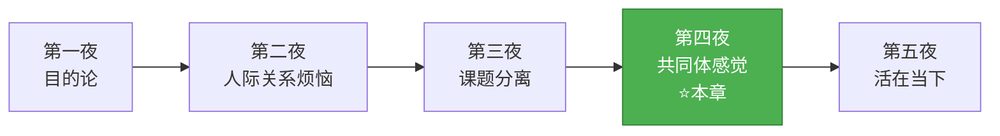
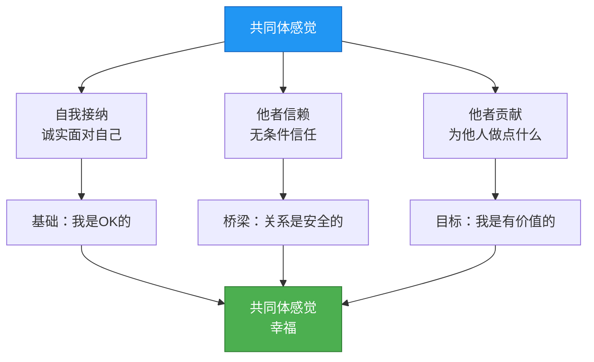
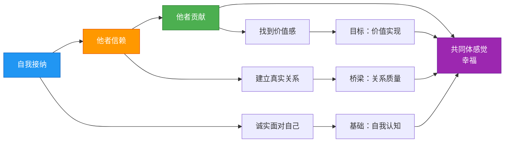
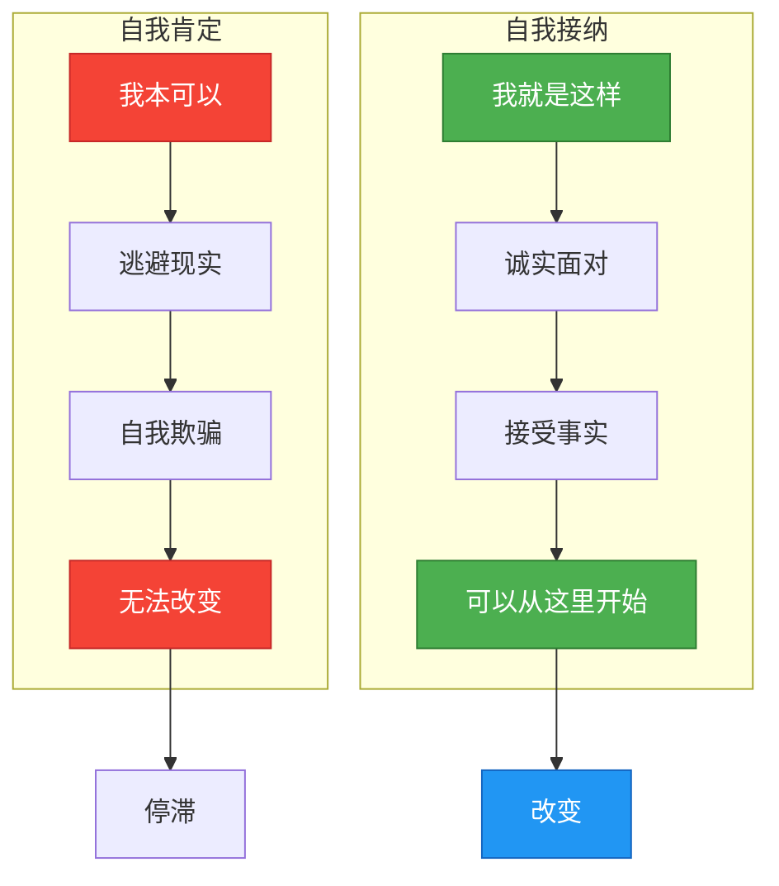
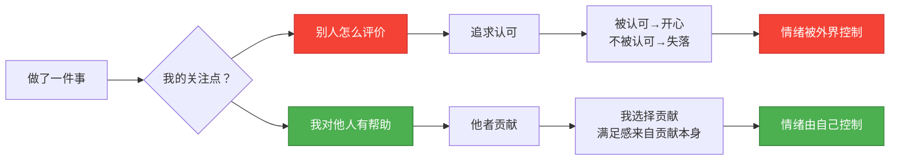
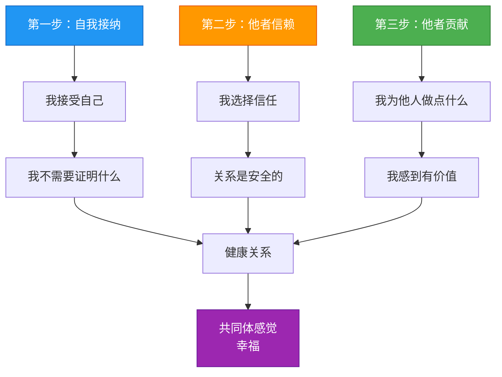

# 第四夜：要有被讨厌的勇气

> **核心概念**：共同体感觉、他者贡献
> **章节定位**：阿德勒心理学的"关系重建"——从课题分离到共同体感觉，从"不被影响"到"主动贡献"
> **一句话总结**：幸福的本质是共同体感觉，来自自我接纳、他者信赖、他者贡献三支柱

---

## 一、章节定位

### 1.1 这一夜在解决什么问题？

**核心困境**：
- ❌ 为什么越成功越空虚？
- ❌ 为什么很难建立深度关系？
- ❌ 为什么总觉得自己不够好？
- ❌ 为什么人际关系总是充满竞争和焦虑？

**阿德勒给出的答案**：

**一句话定位**：
> 幸福不是比别人优秀，而是你觉得自己对他人有用。共同体感觉，就是幸福的终极目标。

---

### 1.2 这一夜在五夜结构中的位置



**承上启下**：
- **承接第三夜**：课题分离是守住边界，但人不能孤立存在 → 如何建立健康关系？
- **开启第五夜**：共同体感觉是关系的理想状态 → 如何在当下实现？

---

### 1.3 与其他章节的关联

| 章节 | 关联关系 | 共同逻辑 |
|------|----------|----------|
| [[第一夜-我们的不幸是谁的错]] | 理论基础 | 目的论→自我接纳，你可以选择如何看待自己 |
| [[第二夜-一切烦恼皆源于人际关系]] | 问题铺垫 | 诊断竞争思维→提出贡献思维 |
| [[第三夜-让干涉你生活的人滚开]] | 前提准备 | 课题分离守住边界→才有能力贡献 |
| 第五夜 | 终极实现 | 共同体感觉→活在当下，幸福在此时此刻 |

---

## 二、核心观点（三层提取）

### 观点1：共同体感觉——幸福的终极目标

#### 【表层】现象层

**书中核心定义**：
- **共同体感觉（Gemeinschaftsgefühl）**：把他人看作伙伴，而非竞争对手或敌人
- **共同体的范围**：从家庭→朋友→职场→社会→全人类→宇宙整体
- **为什么重要**：共同体感觉是衡量一个人心理健康的终极指标

**两种思维对比**：

| 维度 | 竞争思维 | 共同体思维 |
|------|----------|------------|
| **看待他人** | 竞争对手/威胁 | 伙伴/支持者 |
| **人生观** | 必须比别人好 | 我可以为他人做贡献 |
| **自我价值** | 来自比较和优越感 | 来自贡献感 |
| **情绪状态** | 焦虑、对立、疲惫 | 平和、连接、充实 |

**读者熟悉的场景**：
- 同事升职了 → 竞争思维："为什么不是我？" → 共同体思维："他做成了什么，我能学到什么？"
- 朋友成功了 → 竞争思维："失落、嫉妒" → 共同体思维："为他高兴，我也被激励了"
- 社交媒体刷到同龄人成就 → 竞争思维："我怎么这么差" → 共同体思维："每个人有自己的路"

---

#### 【中层】机制层

**从"我"到"我们"的心理转变**：


**共同体感觉的三个层次**：



**三大障碍**：

```mermaid
flowchart TD
    subgraph 障碍1：自我中心
        A1[我最重要] --> A2[他人是工具]
        A2 --> A3[无法建立真诚关系]
    end
    
    subgraph 障碍2：敌对关系
        B1[他人是威胁] --> B2[必须竞争]
        B2 --> B3[陷入焦虑和对立]
    end
    
    subgraph 障碍3：追求优越
        C1[必须比别人好] --> C2[自卑感驱动]
        C2 --> C3[永远不满足]
    end
    
    A3 --> X[无法获得共同体感觉]
    B3 --> X
    C3 --> X
    
    style A1 fill:#F44336,stroke:#C62828,color:#fff
    style A2 fill:#F44336,stroke:#C62828,color:#fff
    style B1 fill:#F44336,stroke:#C62828,color:#fff
    style B2 fill:#F44336,stroke:#C62828,color:#fff
    style C1 fill:#F44336,stroke:#C62828,color:#fff
    style C2 fill:#F44336,stroke:#C62828,color:#fff
    style X fill:#9E9E9E,stroke:#616161,color:#fff
```

---

#### 【底层】规律层

> **共同体感觉定律**：幸福不是来自他人的认可，而是来自"我能对他人/共同体做出贡献"的感觉。三支柱：自我接纳（诚实）、他者信赖（无条件）、他者贡献（价值感）。

**降维翻译**：
> 幸福不是别人觉得你幸福，
> 而是你觉得自己有价值。
>
> 价值不是比别人优秀，
> 而是你对别人有用。
>
> **他者贡献不是伟大成就，
> 而是你在乎的人，因为你，生活好了一点点。**

---

#### 【当下连接】2026热点锚定

|----------|----------|----------|
| 为什么越成功越空虚？ | 追求认可≠贡献感；真正的幸福来自贡献，而非名利 | "原来我追求错了方向" |
| 为什么很难建立深度关系？ | 没有他者信赖，都是条件交换；信赖是关系的基础 | "原来我从未真正信任过" |
| 为什么总觉得自己不够好？ | 没有自我接纳，一直在自我肯定（假装）；诚实面对才能改变 | "原来诚实比假装更有力量" |
| **深度连接** | | |
| 为什么社交媒体越刷越空虚？ | **共同体感觉：点赞≠贡献感，真正的价值来自真实影响** | "原来我一直在用虚假认可填补真实空虚" |
| 为什么35岁如此迷茫？ | **竞争思维：和别人比永远不够；贡献思维：我的价值由我定义** | "原来我可以停止比较，开始贡献" |

---

### 观点2：幸福三支柱——自我接纳·他者信赖·他者贡献

#### 【表层】现象层

**三支柱详解**：

| 支柱 | 定义 | 关键词 | 对立面 |
|------|------|--------|--------|
| **自我接纳** | 诚实接受现在的自己（60分就是60分） | 诚实 | 自我肯定（假装100分）|
| **他者信赖** | 无条件信任他人（即使可能被背叛） | 无条件 | 怀疑、保留、条件交换 |
| **他者贡献** | 对他人/共同体有贡献感 | 贡献感 | 追求认可、回报、名利 |

**读者熟悉的场景**：

**自我接纳 vs 自我肯定**：
- 自我肯定："我本可以考100分" → 逃避现实，自我欺骗
- 自我接纳："我考了60分，这是事实，但我可以从这里开始" → 诚实面对

**他者信赖 vs 条件交换**：
- 怀疑："我帮了他，他会不会不回报？" → 条件交换
- 信赖："我选择信任，背叛与否是他的课题" → 无条件关系

**他者贡献 vs 追求认可**：
- 认可追求："我要让别人看到我的成就" → 外在驱动
- 贡献感："我做这件事对他人的帮助" → 内在满足

---

#### 【中层】机制层

**三支柱的递进机制**：



**自我接纳的真相**：



**他者信赖的悖论**：


---

#### 【底层】规律层

> **三支柱定律**：
> - **自我接纳**：诚实面对自己，是改变的起点。60分就是60分，从这里开始。
> - **他者信赖**：无条件信任，是深度关系的基础。背叛与否是对方的课题。
> - **他者贡献**：贡献感，是幸福的来源。不追求认可，只追求"我对他人有用"。

**降维翻译**：
> **自我接纳**：
> 你不需要假装自己是100分，
> 承认自己是60分，
> 才能从60分开始变好。
>
> **他者信赖**：
> 你不需要等别人证明值得信任，
> 你选择信任，
> 关系才有可能。
>
> **他者贡献**：
> 你不需要做伟大的事，
> 只需要让你在乎的人，
> 因为你，生活好了一点点。

---

#### 【当下连接】

|----------|----------|----------|
| 为什么总觉得自己不够好？ | 自我接纳：60分就是60分，从这里开始 | "原来诚实比假装更有力量" |
| 为什么很难建立深度关系？ | 他者信赖：无条件信任，背叛是对方的课题 | "原来我一直用条件交换代替真诚关系" |
| 为什么越努力越空虚？ | 他者贡献：追求认可vs追求贡献感 | "原来我一直在用外在认可填补内在空虚" |
| **深度连接** | | |
| 为什么朋友圈越经营越累？ | **自我接纳：你在演100分，而不是承认60分** | "原来我在用虚假人设代替真实自己" |
| 为什么亲密关系总出问题？ | **他者信赖：你在等对方证明，而不是先选择信任** | "原来我先设防，关系怎么深" |

---

### 观点3：他者贡献——如何建立健康的人际关系

#### 【表层】现象层

**书中核心观点**：
- **他者贡献的本质**：不是"我为别人做了什么"，而是"我能为别人做什么"的感觉
- **贡献≠牺牲**：贡献是内在满足，牺牲是自我感动
- **贡献≠认可**：贡献是我的选择，认可是别人的评价

**两种贡献对比**：

| 维度 | 追求认可的"贡献" | 真正的他者贡献 |
|------|------------------|----------------|
| **动机** | 想得到表扬/感谢 | 想对他人有帮助 |
| **关注点** | 别人的反应 | 自己的贡献 |
| **情绪** | 被忽视时失落 | 无论回应都满足 |
| **性质** | 交易 | 赠予 |

**读者熟悉的场景**：
- 帮同事做完项目 → 期待领导表扬 → 没表扬就失落 → 这是追求认可
- 帮同事做完项目 → 觉得自己帮到了团队 → 无论表扬与否都满足 → 这是他者贡献

---

#### 【中层】机制层

**他者贡献的心理机制**：



**建立健康关系的三步**：



---

#### 【底层】规律层

> **他者贡献定律**：幸福来自"我对他人有用"的感觉，而非"别人认可我"。贡献是我的选择，认可是别人的课题。

**降维翻译**：
> 你帮别人，不是等对方说谢谢，
> 而是你觉得自己帮到了。
>
> 对方说谢谢，是锦上添花；
> 对方没说，你依然满足。
>
> **他者贡献 = 我选择贡献，不求回报**
> **追求认可 = 我期待回报，否则失落**

---

#### 【当下连接】

|----------|----------|----------|
| 为什么帮了别人反而更累？ | 你在追求认可，而非贡献；被忽视时自然失落 | "原来我一直在用帮助换认可" |
| 为什么付出越多越委屈？ | 你把贡献当成了交易；期待回报，没得到就委屈 | "原来我从未真正贡献过" |
| 为什么关系越经营越累？ | 你在用"付出"控制关系；真正的贡献不求控制 | "原来我在用付出绑架关系" |
| **深度连接** | | |
| 为什么职场越努力越不被认可？ | **追求认可：你等老板表扬；他者贡献：你觉得自己有价值** | "原来我可以不需要别人的认可" |
| 为什么亲密关系总想控制？ | **"我对你这么好，你为什么不..."=交易，不是贡献** | "原来我在用付出换控制" |

---

## 三、金句库

### 原书金句

**【共同体感觉】**
1. "共同体感觉是幸福的终极目标。"
2. "把他人看作伙伴，而非竞争对手或敌人。"
3. "共同体的范围从家庭到全人类，甚至到宇宙整体。"

**【自我接纳】**
4. "自我接纳：如果做不到，就诚实接受'做不到的自己'，然后尽量努力。"
5. "自我肯定'我本可以'是逃避，自我接纳'我现在就这样'是诚实。"

**【他者信赖】**
6. "他者信赖：无条件地相信他人，即使可能被背叛。"
7. "背叛与否是对方的课题，你选择信任是你的课题。"

**【他者贡献】**
8. "幸福不是来自他人的认可，而是来自'我能对他人/共同体做出贡献'的感觉。"
9. "他者贡献不是伟大成就，而是你对他人有用。"
10. "贡献感是我的选择，认可是别人的课题。"

**【幸福公式】**
11. "自我接纳 → 他者信赖 → 他者贡献 → 共同体感觉（幸福）"

---

### 降维金句

**【共同体感觉·幸福版】**
1. **幸福不是别人觉得你幸福，而是你觉得自己对他人有用。**
2. **价值不是比别人优秀，而是你对别人有用。**
3. **他者贡献不是伟大成就，而是你在乎的人，因为你，生活好了一点点。**

**【自我接纳·诚实版】**
4. **自我肯定"我本可以"是逃避，自我接纳"我现在就这样"是诚实。**
5. **你不需要假装自己是100分，承认自己是60分，才能从60分开始变好。**
6. **诚实比假装更有力量——承认现状，是改变的起点。**

**【他者信赖·信任版】**
7. **他者信赖不是交换，而是无条件信任——背叛与否是他的课题。**
8. **你不需要等别人证明值得信任，你选择信任，关系才有可能。**
9. **条件交换换不来深度关系，无条件信赖才能建立真实连接。**

**【他者贡献·价值版】**
10. **你帮别人，不是等对方说谢谢，而是你觉得自己帮到了。**
11. **贡献是我的选择，认可是别人的课题——我不求回报，自然不失落。**
12. **他者贡献 = 我选择贡献，不求回报；追求认可 = 我期待回报，否则失落。**

---

## 四、当下映射

### 2026年热点连接

| 热点现象 | 共同体感觉视角 | 洞察 |
|----------|----------------|------|
| **社交媒体焦虑** | 点赞≠贡献感，真正的价值来自真实影响 | 经营人设vs真实贡献 |
| **35岁中年危机** | 竞争思维：和别人比永远不够；贡献思维：我的价值由我定义 | 停止比较，开始贡献 |
| **内卷与躺平** | 内卷=追求认可；躺平=放弃贡献 | 他者贡献=找到自己的价值 |
| **亲密关系危机** | "我对你好，你应该..."=交易 | 真正的贡献不求回报 |
| **职场倦怠** | 努力为了认可→没认可就倦怠 | 努力为了贡献→无论认可都满足 |
| **育儿焦虑** | "我为你付出这么多..."=绑架 | 真正的爱是贡献，不是交易 |

### 读者画像与痛点

**核心人群**：25-40岁，面临关系困扰、价值感缺失

| 痛点 | 共同体感觉解法 |
|------|----------------|
| 越成功越空虚 | 追求认可≠贡献感；真正的幸福来自贡献 |
| 很难建立深度关系 | 缺乏他者信赖，都在条件交换 |
| 总觉得自己不够好 | 没有自我接纳，一直在自我肯定（假装） |
| 帮了别人反而累 | 追求认可，而非贡献；被忽视时自然失落 |
| 关系越经营越累 | 用"付出"控制关系；真正的贡献不求控制 |

---

## 五、章节关联

### 与主读书笔记的关联

本章节是[[被讨厌的勇气-岸见一郎]]中**观点3：共同体感觉**的深度展开。

| 主记录观点 | 本章节深化 |
|------------|------------|
| 共同体感觉定义 | 三支柱详解：自我接纳、他者信赖、他者贡献 |
| 三大障碍 | 详述：自我中心、敌对关系、追求优越 |
| 降维翻译 | 生活化场景：自我接纳、他者信赖、他者贡献对比 |

### 与前后章节的关联

```mermaid
flowchart LR
    subgraph 第三夜
        C1[课题分离]
        C2[守住边界]
    end
    
    subgraph 第四夜 ⭐
        D1[共同体感觉]
        D2[自我接纳]
        D3[他者信赖]
        D4[他者贡献]
    end
    
    subgraph 第五夜
        E1[活在当下]
        E2[此时此刻]
    end
    
    C1 --> D1
    D1 --> E1
    D2 --> D3
    D3 --> D4
    D4 --> D1
    
    style D1 fill:#4CAF50,stroke:#2E7D32,color:#fff
    style D2 fill:#2196F3,stroke:#1565C0,color:#fff
    style D3 fill:#FF9800,stroke:#E65100,color:#fff
    style D4 fill:#4CAF50,stroke:#2E7D32,color:#fff
```

### 与其他书籍的关联

| 书籍 | 关联点 | 对话 |
|------|--------|------|
| [[影响力-西奥迪尼]] | 他者贡献 vs 影响力的互惠原则 | 真诚贡献vs策略性付出 |
| [[少有人走的路-派克]] | 自我接纳 vs 自律 | 诚实面对自己是成长起点 |
| [[心流-契克森米哈赖]] | 他者贡献 vs 心流 | 都强调内在满足，而非外在认可 |
| [[道德经-老子]] | 他者贡献 ≈ 利而不争 | 都强调贡献而非竞争 |
| [[传习录-王阳明]] | 自我接纳 ≈ 致良知 | 都强调诚实面对自己 |

---

## 六、问答设计

### 读者高频问题Q&A

#### Q1：他者贡献会不会被人利用？

**A**：区分"贡献"和"牺牲"。

- **贡献**：我选择贡献，满足感来自贡献本身
- **牺牲**：我付出期待回报，没回报就委屈

**关键**：
> 他者贡献是你的选择，别人怎么回应是别人的课题。
> 你选择贡献，不是为了控制别人，而是因为你觉得自己有价值。

---

#### Q2：无条件信任不是会受伤吗？

**A**：会受伤，但这是值得的。

**阿德勒的观点**：
- 没有无条件信任，永远不可能建立深度关系
- 被背叛的风险，是深度关系的代价
- 你可以选择信任，也可以在被背叛后选择不再信任——这是你的课题

**关键认知**：
> 条件交换换不来深度关系。
> 无条件信赖，才有可能建立真正的连接。
> 被背叛是你的风险，但也是你选择信任的证明。

---

#### Q3：自我接纳会不会导致躺平？

**A**：不会。自我接纳是改变的起点。

**自我接纳 vs 自我放弃**：
- **自我接纳**：承认现状，从这里开始努力
- **自我放弃**：承认现状，所以不用努力

**案例**：
- 自我接纳："我考了60分，这是事实，但我可以从这里开始" → 改变
- 自我放弃："我就是不行，算了" → 躺平

**关键**：
> 自我接纳 = 诚实面对 + 从这里开始
> 自我肯定 = 逃避现实 + 假装更好
> 自我放弃 = 承认现状 + 不再努力

---

#### Q4：共同体感觉在职场怎么用？

**A**：从竞争思维转向贡献思维。

**三步法**：

1. **自我接纳**：承认自己的能力和局限，不假装
2. **他者信赖**：把同事当伙伴，而非竞争对手
3. **他者贡献**：专注于"我能为团队做什么"，而非"我能得到什么"

**案例**：
- 竞争思维："同事升职了，为什么不是我？" → 焦虑
- 贡献思维："他做成了什么，我能学到什么？我能为团队做什么？" → 充实

---

#### Q5：如何在亲密关系中实践共同体感觉？

**A**：三支柱应用。

| 支柱 | 亲密关系中的应用 |
|------|------------------|
| **自我接纳** | 在伴侣面前做真实的自己，不假装 |
| **他者信赖** | 无条件信任伴侣，不被过去的伤害影响 |
| **他者贡献** | 为伴侣做点什么，不求回报，不控制 |

**关键**：
> "我对你这么好，你应该..."=交易，不是贡献。
> 真正的爱是我选择付出，不期待回报。

---

### 章节测试题

**测试你对共同体感觉的理解**：

1. 以下哪个是"他者贡献"的正确理解？
   - [ ] 我帮了你，你要回报我
   - [ ] 我帮了你，你要说谢谢
   - [ ] 我帮了你，我感到满足，无论你怎么回应
   - [ ] 我帮了你，你要记得我的好

<details>
<summary>点击查看答案</summary>

**答案**：我帮了你，我感到满足，无论你怎么回应

**解析**：
- 他者贡献的关键：满足感来自贡献本身，而非别人的回应
- A/B/D都是追求认可，不是真正的贡献
</details>

---

2. 自我接纳和自我肯定的区别是什么？

<details>
<summary>点击查看答案</summary>

**答案**：

| 维度 | 自我肯定 | 自我接纳 |
|------|----------|----------|
| **本质** | 假装自己很好 | 承认自己现状 |
| **表达** | "我本可以考100分" | "我考了60分，这是事实" |
| **结果** | 逃避现实，无法改变 | 诚实面对，从这里开始 |

**关键**：自我接纳是改变的起点，自我肯定是逃避的借口。
</details>

---

## 七、章节总结

### 核心公式

```
共同体感觉（幸福）= 自我接纳 + 他者信赖 + 他者贡献

自我接纳 = 诚实面对自己（60分就是60分）
他者信赖 = 无条件信任（背叛是对方的课题）
他者贡献 = 我选择贡献（不求回报，不求认可）

幸福的本质 = 你觉得自己对他人有用
价值的来源 = 贡献感，而非优越感
```

### 一句话记住这一夜

> **共同体感觉：幸福不是比别人优秀，而是你觉得自己对他人有用。**
> **三支柱：自我接纳（诚实）→ 他者信赖（无条件）→ 他者贡献（价值感）。**
> **他者贡献不是伟大成就，而是你在乎的人，因为你，生活好了一点点。**

---
