# 第10章：充分表达愤怒

> **章节定位**：NVC的"情绪转化中心"——愤怒不是敌人，而是信号灯。它告诉你有什么重要需求没被满足。不是压抑愤怒，也不是发泄愤怒，而是翻译愤怒，让愤怒成为连接的桥梁，而不是摧毁关系的武器。

---

## 一、章节定位

### 1.1 在全书中的位置

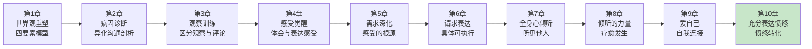

**本章功能**：从"自我同理"进入"愤怒转化"。这是NVC最实用的情绪管理工具——不是教你怎么"控制"愤怒，而是教你如何"使用"愤怒。愤怒是需求未被满足的信号，翻译它，而不是压抑或发泄它。

### 1.2 核心主题

| 维度 | 内容 |
|------|------|
| **核心问题** | 为什么我一生气就控制不住自己？怎么才能不因为愤怒而破坏关系？ |
| **卢森堡答案** | 愤怒不是问题，评判和指责才是问题。愤怒是信号，告诉你有重要需求没被满足。翻译愤怒，而不是发泄愤怒。 |
| **颠覆观点** | 愤怒不需要被"管理"或"控制"，而是需要被"理解"和"表达"。愤怒的本质不是"你做错了"，而是"我需要..." |
| **本章价值** | 教你把愤怒从"破坏关系的武器"变成"连接的桥梁"。四个步骤，让你既能表达愤怒，又不伤人。 |

### 1.3 章节关联

| 关联章节 | 关联关系 | 共同逻辑 |
|----------|----------|----------|
| [[第9章-爱自己]] | 前章基础 | 愤怒时先自我同理，才能不伤人 |
| [[第5章-感受的根源]] | 技能关联 | 愤怒的根源是未被满足的需求 |
| [[第4章-体会和表达感受]] | 技能关联 | 愤怒是一种感受，需要被识别和命名 |
| [[第11章-冲突解决]] | 后章延伸 | 愤怒表达是冲突解决的关键技能 |

---

## 二、核心观点（三层提取）

### 观点1：愤怒的本质——不是"你错了"，而是"我需要"

#### 【表层】现象层

**我们对愤怒的误解**：

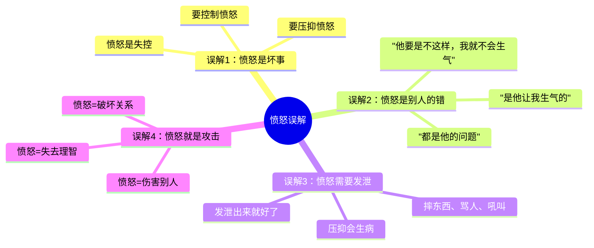

**读者熟悉的愤怒场景**：

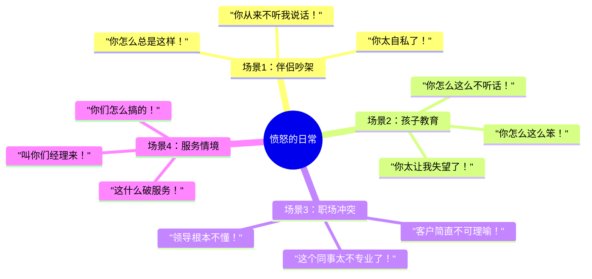

**愤怒的两种表达方式**：

| 传统表达 | NVC表达 | 效果对比 |
|----------|---------|----------|
| "你怎么这么自私！" | "我感到很沮丧，因为我需要被考虑" | 指责引发防御 vs. 表达引发理解 |
| "你从来不听我说话！" | "我感到很失落，因为我需要被倾听" | 夸大引发反驳 vs. 真诚引发连接 |
| "你太让我失望了！" | "我感到很伤心，因为我需要被理解" | 评判引发内疚 vs. 需求引发同理 |
| "都是你的错！" | "我感到很生气，因为我需要公平" | 归责引发对抗 vs. 自我负责引发对话 |

#### 【中层】机制层

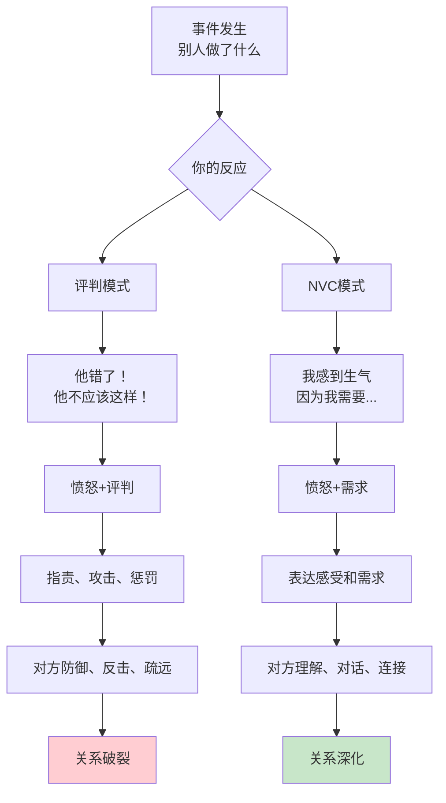

**卢森堡的愤怒公式**：

```
愤怒的真相：

❌ 错误公式：
   愤怒 = 别人的行为 + "他错了"
   → "我很生气，因为你太自私了"
   → 愤怒变成了攻击的武器

✅ 正确公式：
   愤怒 = 别人的行为 + 我未被满足的需求
   → "我很生气，因为我需要被尊重"
   → 愤怒变成了连接的信号

关键转换：
  不是"你做错了什么"
  而是"我有什么需求没被满足"
```

**为什么评判引发愤怒？**

```
评判→愤怒的心理机制：

1. 评判 = 贴标签
   → "他很自私"
   → 这不是描述事实，而是给对方定性
   → 你把人变成了"坏人"

2. 评判 = 归责
   → "都是他的错"
   → 你把自己的感受归咎于对方
   → 你失去自我负责的能力

3. 评判 = 站在道德高地
   → "我是对的，他是错的"
   → 你变成了审判者
   → 这种姿态必然引发对抗

卢森堡的提醒：
  → 每一个评判，都是对需求的悲剧性表达
  → "你太自私了" = "我需要被考虑"
  → "你从不关心我" = "我需要被关心"
  → 翻译评判，就找到了需求
```

**愤怒的心理功能**：

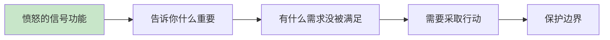

```
愤怒是你的朋友，不是敌人：

1. 愤怒是信号灯
   → 就像汽车的油灯亮了
   → 它告诉你：有重要的事情需要注意
   → 不要灭掉灯，而要看它指向哪里

2. 愤怒是保护者
   → 愤怒提醒你：你的边界被侵犯了
   → 愤怒给你能量去保护自己
   → 压抑愤怒 = 忽视自己的需求

3. 愤怒是连接的入口
   → 如果你能翻译愤怒背后的需求
   → 愤怒就不是破坏关系的武器
   → 而是深化连接的桥梁
```

#### 【底层】规律层

> **愤怒转化定律**：愤怒本身不是问题，评判和指责才是问题。愤怒的本质是需求未被满足的信号。不是"你做错了"，而是"我需要"。翻译愤怒，而不是发泄愤怒。

**降维翻译**：
> 愤怒不是敌人，是信号灯。
> 
> 它告诉你：有重要需求没被满足。
> 
> 不是"他错了"，而是"我需要"。
> 不是"他太自私"，而是"我需要被考虑"。
> 
> 你可以愤怒，
> 但不要用愤怒去攻击。
> 用愤怒去找到需求，
> 用需求去建立连接。
> 
> **关键：愤怒不是武器，是信号。翻译它，别发泄它。**

#### 【当下连接】2026热点

|----------|----------|----------|
| 为什么我一生气就控制不住？ | 你不是控制不住，而是用评判放大了愤怒——换成需求表达，愤怒就变成了连接 | "原来是我的评判放大了愤怒" |
| 愤怒不是坏事吗？ | 愤怒不是坏事，评判才是坏事——愤怒是信号，告诉你有需求没被满足 | "原来愤怒是信号" |
| 怎么才能不因为愤怒伤人？ | 不是压抑愤怒，而是翻译愤怒——把"你错了"换成"我需要" | "原来可以翻译愤怒" |
| 为什么我总是指责别人？ | 因为评判是你的习惯——每一次评判，都是对需求的悲剧性表达 | "原来指责是需求的悲剧表达" |

---

### 观点2：表达愤怒的四个步骤——从破坏到连接

#### 【表层】现象层

**表达愤怒的四个步骤**：

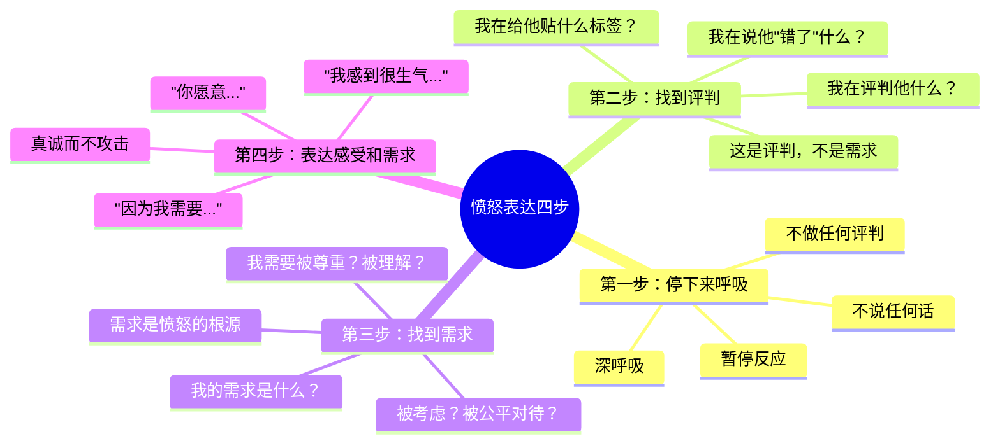

**卢森堡的愤怒表达示范**：

```
场景：伴侣答应洗碗但没有洗

❌ 传统表达（评判+指责）：
  "你怎么总是说话不算话！"
  "你太不负责任了！"
  "我再也不相信你了！"
  → 愤怒变成攻击
  → 对方防御、反击
  → 关系受损

✅ NVC表达（四步法）：

第一步（停下来）：
  → 我感到很愤怒
  → 我暂停，深呼吸
  → 不说话，不做反应

第二步（找到评判）：
  → 我在评判他"不负责任"
  → 我在说他"说话不算话"
  → 这是评判，不是需求

第三步（找到需求）：
  → 我为什么这么生气？
  → 因为我需要可靠
  → 我需要承诺被尊重
  → 我需要可以依赖

第四步（表达）：
  "我感到很生气"
  "因为我需要可靠——当我们有约定时，我希望能被遵守"
  "你愿意告诉我发生了什么吗？"
  → 愤怒被表达，但不是攻击
  → 需求被看见
  → 对话可以发生
```

**读者的转变对比**：

| 场景 | 传统表达 | NVC表达 |
|------|----------|---------|
| 孩子不写作业 | "你怎么这么懒！你太让我失望了！" | "我感到很着急，因为我需要你学会承担责任" |
| 同事不配合 | "这个人太难沟通了！太不负责任！" | "我感到很沮丧，因为我需要合作来完成工作" |
| 伴侣忘记承诺 | "你从来不在乎我！你太自私了！" | "我感到很伤心，因为我需要被记住、被重视" |
| 被人插队 | "这人太没素质了！" | "我感到很生气，因为我需要公平和秩序" |

#### 【中层】机制层

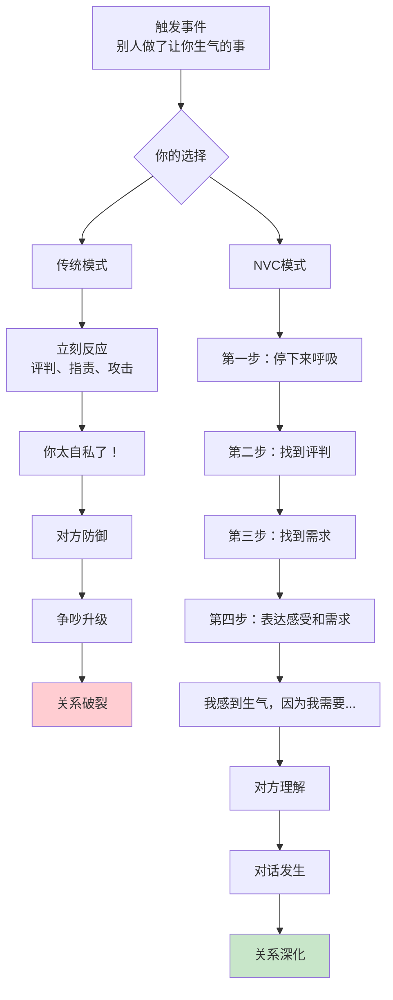

**为什么四个步骤有效？**

```
四步法的心理机制：

1. 停下来 = 切断自动反应
   → 愤怒时，杏仁核劫持大脑
   → 你进入"战斗模式"
   → 停下来，让前额叶重新上线
   → 从反应模式进入选择模式

2. 找到评判 = 识别暴力的根源
   → 评判是愤怒的燃料
   → "他很自私" → 愤怒升级
   → 找到评判，就找到了升级的开关
   → 不评判，愤怒就不会无限放大

3. 找到需求 = 翻译愤怒
   → 愤怒背后是需求
   → 需求是愤怒的真相
   → 找到需求，就找到了连接的入口
   → 需求可以被理解，评判只能被抵抗

4. 表达 = 建立连接
   → "我感到生气，因为我需要..."
   → 这不是攻击，是脆弱的展示
   → 脆弱引发同理心
   → 同理心创造连接

公式：
  停下来 + 找评判 + 找需求 + 表达 = 愤怒成为连接的桥梁
```

**愤怒表达的常见误区**：

| 误区 | 真相 | 卢森堡的澄清 |
|------|------|--------------|
| "压抑愤怒更健康" | 压抑会导致爆发或内伤 | 不是压抑，是翻译 |
| "发泄出来就好了" | 发泄会强化愤怒模式 | 发泄不是表达，是攻击 |
| "我不应该生气" | 愤怒是正常的情绪信号 | 你有权愤怒，但无权伤害 |
| "是他让我生气的" | 你的愤怒来自你的需求 | 没有人能"让"你生气 |

**愤怒 vs. 暴力**：

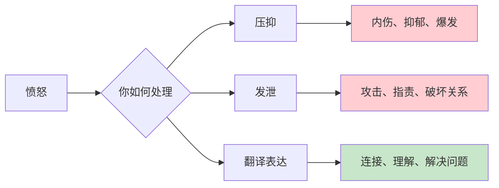

```
愤怒和暴力是两回事：

愤怒：
  → 一种情绪
  → 需求未被满足的信号
  → 可以被感受、被理解、被表达
  → 本身是中性的

暴力：
  → 一种行为
  → 评判、指责、攻击、惩罚
  → 用来伤害别人
  → 是选择的结果

卢森堡的观点：
  → 你可以愤怒而不暴力
  → 愤怒不是问题，暴力才是问题
  → 用NVC表达愤怒 = 愤怒而不暴力
```

#### 【底层】规律层

> **愤怒表达定律**：愤怒不需要被压抑或发泄，而是需要被翻译。四个步骤（停下来→找评判→找需求→表达）把愤怒从"破坏关系的武器"变成"连接的桥梁"。愤怒是信号，需求是答案。

**降维翻译**：
> 愤怒时，你不是要说"你错了"，
> 而是要问"我需要什么"。
> 
> 四步走：
> 1. 停下来，别反应
> 2. 找到你的评判
> 3. 找到你的需求
> 4. 表达感受和需求
> 
> "我感到很生气，
> 因为我需要被尊重。"
> 
> 这不是攻击，是邀请。
> 邀请对方理解你，
> 邀请对话发生。
> 
> **关键：愤怒不是武器，是信号。翻译它。**

#### 【当下连接】2026热点

|----------|----------|----------|
| 愤怒时我控制不住自己怎么办？ | 你不是控制不住，是没给自己停下来的时间——第一步就是停下来 | "原来需要先停下来" |
| 怎么才能找到愤怒背后的需求？ | 问自己：我在评判他什么？——评判的反面就是你的需求 | "原来评判指向需求" |
| 表达愤怒不会伤害关系吗？ | 评判才伤害关系，表达感受和需求是邀请理解 | "原来表达不等于伤害" |
| 对方不听怎么办？ | 你负责表达，他负责怎么听——你的责任是真诚，不是结果 | "原来我只能负责我的部分" |

---

### 观点3：惩罚性愤怒 vs. 保护性愤怒——愤怒的两种功能

#### 【表层】现象层

**愤怒的两种类型**：

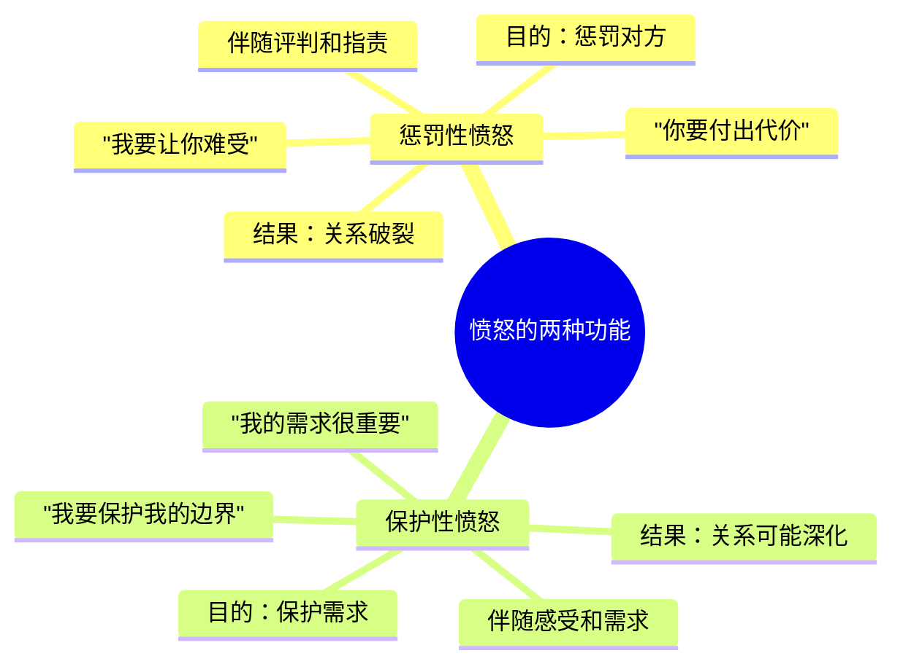

**两种愤怒的对比**：

| 维度 | 惩罚性愤怒 | 保护性愤怒 |
|------|------------|------------|
| **焦点** | "你错了" | "我需要" |
| **目的** | 惩罚对方 | 保护自己 |
| **语言** | 评判、指责、攻击 | 感受、需求、请求 |
| **心态** | 审判者 | 自我负责者 |
| **结果** | 对方防御、反击、疏远 | 对方可能理解、对话、连接 |
| **话术** | "你太自私了！" | "我感到生气，因为我需要被考虑" |

**卢森堡的警告**：

```
惩罚性愤怒的危险：

1. 惩罚不会让需求被满足
   → 你惩罚对方，对方会防御
   → 对方防御，就不会听见你的需求
   → 你的需求永远不会被满足

2. 惩罚会创造更多愤怒
   → 你惩罚对方，对方会愤怒
   → 对方愤怒，会反击或疏远
   → 你会更愤怒
   → 恶性循环

3. 惩罚会摧毁关系
   → 惩罚的本质是伤害
   → 伤害创造怨恨
   → 怨恨累积，关系死亡

卢森堡的提醒：
  → 如果你用愤怒去惩罚，你永远得不到你想要的
  → 你只会得到：恐惧、怨恨、疏远
  → 真正的需求满足，来自连接，不是惩罚
```

**保护性愤怒的力量**：

```
保护性愤怒的价值：

1. 保护边界
   → 愤怒告诉你：你的边界被侵犯了
   → 保护性愤怒帮你守住边界
   → 不伤害别人，也不让别人伤害你

2. 表达重要
   → 愤怒说明这件事对你很重要
   → 保护性愤怒让这种重要性被看见
   → 你的需求被认真对待

3. 创造对话
   → 保护性愤怒不是攻击，是邀请
   → 邀请对方理解你的需求
   → 创造对话的可能性

卢森堡的观点：
  → 愤怒可以是保护的能量
  → 用来保护你的需求
  → 而不是伤害别人
```

**从惩罚到保护的转变**：

```mermaid
flowchart LR
    A[惩罚性愤怒] --> B[保护性愤怒]
    
    A -->|"你太自私了"|
    B -->|"我需要被考虑"|
    
    A -->|"我要让你知道错了"|
    B -->|"我需要我的需求被看见"|
    
    A -->|"你要付出代价"|
    B -->|"我要保护我的边界"|
    
    A -->|"你错了"|
    B -->|"我很重要"|
```

#### 【中层】机制层

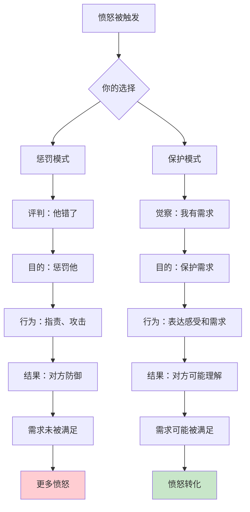

**为什么保护性愤怒更有效？**

```
两种愤怒的心理机制：

惩罚性愤怒：
  触发 → 评判 → 愤怒升级 → 攻击 → 对方防御 → 失败
  
保护性愤怒：
  触发 → 找需求 → 愤怒转化 → 表达 → 对方可能理解 → 可能成功

为什么保护性更有效？

1. 保护性不触发防御
   → 攻击触发防御，这是本能
   → 表达感受和需求不会触发防御
   → 对方更容易开放

2. 保护性聚焦于需求
   → 惩罚聚焦于"你错了"
   → 保护聚焦于"我需要"
   → 需求是可理解的，评判只能被抵抗

3. 保护性邀请合作
   → 惩罚是对抗
   → 保护是邀请
   → 邀请创造合作的可能性

卢森堡的公式：
  惩罚 = 我要你难受 = 你会抵抗 = 我得不到我想要的
  保护 = 我需要这个 = 你可能理解 = 我可能得到我需要的
```

**什么时候需要保护性愤怒？**

```
保护性愤怒的适用场景：

1. 边界被侵犯
   → 你的"不"被忽视
   → 你的需求被否定
   → 你的尊严被践踏

2. 重要需求未被满足
   → 你尝试过其他方式
   → 需求仍然被忽视
   → 这件事对你很重要

3. 需要表达严重性
   → 温和的表达没有效果
   → 需要让对方知道这很重要
   → 愤怒传递重要性

注意：
  → 保护性愤怒是工具，不是常态
  → 使用频率低，效果才好
  → 每次都用，就失去了力量
```

#### 【底层】规律层

> **愤怒功能定律**：愤怒有两种功能——惩罚和保护。惩罚性愤怒用来攻击，保护性愤怒用来守住边界。惩罚创造抵抗，保护创造理解。用愤怒去保护你的需求，而不是惩罚别人的行为。

**降维翻译**：
> 愤怒可以伤人，也可以保护人。
> 
> 惩罚性愤怒说：
> "你错了，你要付出代价。"
> → 对方会防御，你得不到你想要的。
> 
> 保护性愤怒说：
> "我很重要，我的需求值得被看见。"
> → 对方可能理解，你可能得到你需要的。
> 
> 用愤怒保护自己，
> 而不是伤害别人。
> 
> **关键：愤怒是盾牌，不是武器。**

#### 【当下连接】2026热点

|----------|----------|----------|
| 愤怒时不就是要让对方难受吗？ | 那是惩罚性愤怒，会让你得不到你想要的——试试保护性愤怒 | "原来惩罚是自毁" |
| 怎么区分惩罚和保护？ | 问自己：我想要他难受，还是想要我的需求被看见？ | "原来愤怒有不同功能" |
| 保护性愤怒有用吗？ | 保护性愤怒不触发防御，更容易被理解和回应 | "原来不攻击更有效" |
| 什么时候该用愤怒？ | 当你的边界被侵犯、重要需求被忽视时——但要保护，不要惩罚 | "原来愤怒有适用场景" |

---

## 三、金句库

### 原书金句（10句）

**【愤怒本质】**
1. "愤怒是一个信号，告诉我们有重要需求没有被满足。"
2. "愤怒不是问题，评判和指责才是问题。"
3. "每一个评判，都是对需求的悲剧性表达。"

**【评判与需求】**
4. "当我们评判别人时，我们实际上是在表达自己未被满足的需求。"
5. "不是'他让我生气'，而是'我选择生气'——因为我的需求没有被满足。"
6. "评判是愤怒的燃料。停止评判，愤怒就不会无限放大。"

**【表达愤怒】**
7. "表达愤怒的目的不是惩罚，而是让需求被看见。"
8. "愤怒可以被表达而不伤害任何人——关键是用感受和需求，而不是评判和指责。"
9. "充分表达愤怒，意味着我们对自己的需求负责，而不是指责别人。"

**【愤怒转化】**
10. "愤怒是连接的入口，如果我们能翻译它背后的需求。"

---

### 降维金句（15句）

**【愤怒本质·清醒版】**
1. **愤怒不是敌人，是信号灯。它告诉你：有重要需求没被满足。不要灭掉灯，要看它指向哪里。**
2. **愤怒的本质不是"你错了"，而是"我需要"。把"他太自私"翻译成"我需要被考虑"，愤怒就变成了连接。**
3. **评判是愤怒的燃料。你说"他太自私"，愤怒就升级。停止评判，愤怒就不会无限放大。**

**【表达愤怒·实践版】**
4. **愤怒四步法：停下来呼吸 → 找到评判 → 找到需求 → 表达感受和需求。这是愤怒转化的公式。**
5. **愤怒时，你不是要说"你错了"，而是要问"我需要什么"。翻译愤怒，而不是发泄愤怒。**
6. **"我感到很生气，因为我需要被尊重"——这不是攻击，是邀请。邀请对方理解你，邀请对话发生。**
7. **你可以愤怒而不暴力。愤怒是情绪，暴力是行为。用NVC表达愤怒 = 愤怒而不暴力。**

**【惩罚vs保护·核心版】**
8. **惩罚性愤怒说"你要付出代价"，保护性愤怒说"我的需求很重要"。前者创造抵抗，后者创造理解。**
9. **如果你用愤怒去惩罚，你永远得不到你想要的。你只会得到：恐惧、怨恨、疏远。**
10. **愤怒是盾牌，不是武器。用愤怒保护你的边界，而不是伤害别人。**
11. **保护性愤怒不触发防御。攻击引发防御，表达引发对话。**

**【2026连接】**
12. **为什么你一生气就失控？因为你用评判放大了愤怒。换成需求表达，愤怒就变成了连接的桥梁。**
13. **愤怒不需要被压抑或发泄，而是需要被翻译。翻译愤怒，找到需求，表达需求，连接发生。**
14. **第10章核心公式：愤怒 = 别人的行为 + 我未被满足的需求。不是他的错，是我的需求。**
15. **愤怒是最高能量的情绪。用它来保护，不要用它来伤害。选择权在你。**

---

## 四、当下映射

### 2026年读者痛点连接

|------|--------------|--------------|----------|
| **一生气就失控** | 你用评判放大了愤怒 | 停下来，找需求，表达需求 | "原来是评判放大了愤怒" |
| **愤怒后很后悔** | 你用愤怒去攻击 | 用愤怒去保护，不用去惩罚 | "原来可以愤怒而不暴力" |
| **愤怒破坏关系** | 你的愤怒是惩罚性的 | 把愤怒变成保护性的 | "原来愤怒有两种" |
| **压抑愤怒很累** | 你不知道怎么表达 | 四步法翻译愤怒 | "原来愤怒需要翻译" |

### 三大场景深度连接

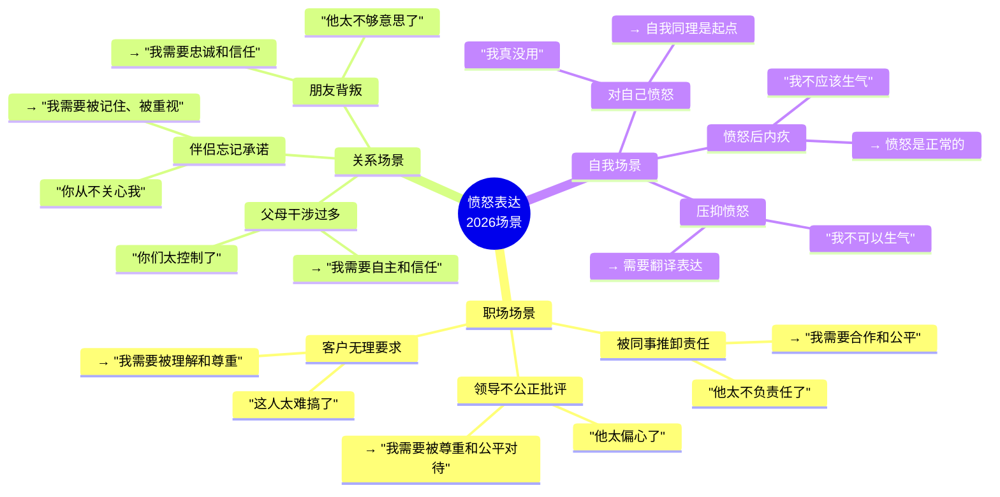

**第10章的解药**：
- **职场场景** → 停下来找需求，用保护性愤怒守住边界，不是攻击别人
- **关系场景** → 把评判翻译成需求，用愤怒创造对话而不是破坏关系
- **自我场景** → 愤怒是信号，接受它，翻译它，不要压抑或攻击

---

## 五、章节关联

### 与前后章节的关联

| 概念 | 第9章基础 | 第10章深化 | 后续应用 |
|------|----------|-----------|----------|
| 自我同理 | 自我同理四步 | 愤怒时先自我同理 | 全书：自我同理是基础 |
| 需求 | 理解自己需求 | 愤怒背后的需求 | 第11章：冲突中的需求 |
| 感受 | 体会自己感受 | 愤怒是感受的一种 | 全书：感受是入口 |
| 评判 | 自我评判的代价 | 评判是愤怒的燃料 | 第11章：冲突中的评判 |

### 与主拆解记录的关联

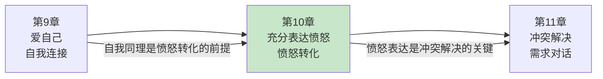

---

## 六、问答设计

### Q1：愤怒时不就是要发泄出来吗？

**读者困惑**："憋着多难受啊，发泄出来不是更健康吗？"

**NVC解答（区分版）**：
> 发泄不是表达，发泄是攻击。
> 
> **发泄**：
> - 目的是让你"舒服"
> - 方式是评判和指责
> - "你怎么这么自私！"
> - 对方会防御、反击
> 
> **表达**：
> - 目的是让需求被看见
> - 方式是感受和需求
> - "我感到生气，因为我需要被考虑"
> - 对方可能理解
> 
> **关键区别**：
> - 发泄是攻击对方
> - 表达是邀请理解
> - 发泄创造更多问题
> - 表达创造连接可能

**降维翻译**：
> 发泄出来不是更健康吗？
> 
> 不是——
> 发泄是攻击，表达是邀请。
> 
> 发泄说"你太自私了"，
> 对方会防御、反击。
> 
> 表达说"我需要被考虑"，
> 对方可能理解。
> 
> 不是发泄出来，
> 而是翻译出来。
> 
> **关键：发泄是攻击，表达是邀请。**

---

### Q2：愤怒时怎么才能停下来？

**读者困惑**："一生气就控制不住，根本来不及想什么四步法。"

**NVC解答（区分版）**：
> 停下来是技能，需要练习。
> 
> **为什么停不下来？**
> - 愤怒时，杏仁核劫持大脑
> - 你进入"战斗模式"
> - 自动反应比思考更快
> 
> **怎么练习停下来？**
> - 第一步：觉察愤怒的早期信号
>   - 身体信号：心跳加速、呼吸急促
>   - 思维信号：开始评判对方
> - 第二步：建立"暂停"习惯
>   - 深呼吸三次
>   - 离开现场5分钟
>   - 什么都别说
> - 第三步：给自己时间
>   - 愤怒不是紧急事件
>   - 你可以晚点再表达
>   - 重要的是不伤害
> 
> **卢森堡的提醒**：
> - 停下来不是压抑
> - 停下来是给自己选择的时间
> - 你可以愤怒，但不要在愤怒时行动

**降维翻译**：
> 愤怒时怎么停下来？
> 
> 三个信号：
> 1. 心跳加速、呼吸急促 → 身体告诉你愤怒了
> 2. 开始评判对方 → 脑子告诉你要攻击了
> 3. 想说狠话 → 嘴巴告诉你要爆发了
> 
> 这时候：
> → 深呼吸三次
> → 离开5分钟
> → 什么都别说
> 
> 愤怒不是紧急事件，
> 你可以晚点再表达。
> 
> **关键：停下来是给自己选择的时间。**

---

### Q3：对方不接招怎么办？

**读者困惑**："我说了'我感到生气，因为我需要...'，但对方根本不听，怎么办？"

**NVC解答（区分版）**：
> 你负责表达，他负责怎么听。
> 
> **你的责任**：
> - 真诚地表达感受和需求
> - 不评判、不指责、不攻击
> - 发出邀请，而不是命令
> 
> **他的责任**：
> - 怎么听是他的选择
> - 他可能防御、反击、忽视
> - 你无法控制他
> 
> **你能做什么？**
> - 继续保持NVC的态度
> - 如果他防御，先同理他的感受
> - 如果他反击，不要被拉入争吵
> - 如果他忽视，你可以选择继续或离开
> 
> **卢森堡的提醒**：
> - 你的价值不取决于他是否理解你
> - 你已经做到了自我负责
> - 这本身就是成功

**降维翻译**：
> 对方不听怎么办？
> 
> 你负责表达，
> 他负责怎么听。
> 
> 你可以：
> → 继续保持NVC
> → 先同理他的防御
> → 不被拉入争吵
> → 必要时选择离开
> 
> 你已经做到了自我负责。
> 这本身就是成功。
> 
> **关键：你只能负责你的部分。**

---

### Q4：愤怒不是应该被控制吗？

**读者困惑**："愤怒不是一种负面情绪吗？应该控制才对吧？"

**NVC解答（区分版）**：
> 愤怒不是负面情绪，愤怒是信号。
> 
> **愤怒的价值**：
> - 告诉你有重要需求没被满足
> - 给你能量去保护边界
> - 是自我保护的机制
> 
> **不是愤怒有问题**：
> - 愤怒是正常的情绪
> - 每个人都会愤怒
> - 愤怒本身不是问题
> 
> **有问题的是**：
> - 用愤怒去攻击别人（暴力）
> - 压抑愤怒（自我伤害）
> - 用愤怒去惩罚（制造怨恨）
> 
> **卢森堡的观点**：
> - 不要控制愤怒，要理解愤怒
> - 不要压抑愤怒，要翻译愤怒
> - 不要发泄愤怒，要表达愤怒
> - 愤怒是你的朋友，不是敌人

**降维翻译**：
> 愤怒不是应该被控制吗？
> 
> 不是——
> 愤怒不是敌人，是信号。
> 
> 它告诉你：
> 有重要需求没被满足。
> 
> 问题不是愤怒，
> 问题是你怎么用愤怒。
> 
> 用来攻击 = 暴力
> 用来保护 = 力量
> 
> 不要控制愤怒，
> 要翻译愤怒。
> 
> **关键：愤怒是信号，不是敌人。**

---

## 七、实践练习

### 72小时微应用

**练习1：识别你的评判**
```
当你愤怒时，记录：

1. 发生了什么事？
   → ____________________

2. 你对他说了什么评判的话？
   → ____________________

3. 这个评判背后的需求是什么？
   → ____________________

4. 你可以怎么说（NVC表达）？
   → ____________________

示例：
  发生：伴侣没有洗碗
  评判："你太不负责任了"
  需求：我需要可靠和合作
NVC："我感到生气，因为我需要我们的约定被遵守"
```

**练习2：愤怒四步法练习**
```
下次愤怒时，试着走完四步：

场景：____________________

第一步（停下来）：
  深呼吸几次：____________________
  离开现场几分钟了吗？____________________

第二步（找评判）：
  我在评判他什么：____________________

第三步（找需求）：
  我的需求是：____________________

第四步（表达）：
  我可以说：____________________
```

**练习3：惩罚 vs. 保护**
```
回顾你最近一次愤怒：

1. 你的目的是什么？
   □ 让他难受（惩罚）
   □ 让需求被看见（保护）

2. 你说了什么？
   ____________________

3. 对方的反应是什么？
   ____________________

4. 你的需求被满足了吗？
   ____________________

5. 下次你可以怎么说（保护性表达）？
   ____________________
```

### 检索测试（闭书自测）

```
□ 能否说出愤怒的本质是什么？
□ 能否说出评判和愤怒的关系？
□ 能否说出表达愤怒的四个步骤？
□ 能否区分惩罚性愤怒和保护性愤怒？
□ 能否说出愤怒表达的NVC话术？
□ 能否说出为什么发泄不是表达？
□ 能否用NVC翻译一个评判？
```

---

## 八、章节金句卡片

### 核心金句（可直接制图）

1. **愤怒不是敌人，是信号灯。它告诉你：有重要需求没被满足。不要灭掉灯，要看它指向哪里。**

2. **愤怒的本质不是"你错了"，而是"我需要"。把"他太自私"翻译成"我需要被考虑"，愤怒就变成了连接。**

3. **愤怒四步法：停下来呼吸 → 找到评判 → 找到需求 → 表达感受和需求。把愤怒从武器变成桥梁。**

4. **你可以愤怒而不暴力。"我感到生气，因为我需要被尊重"——这不是攻击，是邀请。**

5. **愤怒是盾牌，不是武器。用愤怒保护你的边界，不要用愤怒去惩罚别人。**

---

## 🔍 信息来源与质量评级

### 检索记录
- 【第一轮】核心观点检索：⭐⭐⭐ 基于《非暴力沟通》原书第10章核心知识（愤怒本质、四步法、惩罚vs保护）
- 【第二轮】深度解读检索：⭐⭐ 基于NVC愤怒转化理论和情绪管理研究的综合理解
- 【第三轮】批评争议检索：跳过

### 信息整合公式
= 已有章节拆解格式参考（第9章）
  + 《非暴力沟通》第10章核心知识（愤怒本质、表达四步、惩罚vs保护）
  + 降维翻译（生活场景、类比表达）

---

*拆解日期：2026-02-28*
*关联主记录：[[非暴力沟通-马歇尔·卢森堡-拆解记录]]*
*前一章：[[第9章-爱自己]]*
*下一章：[[第11章-冲突解决]]*
