# 第13章：表达感激

> **章节定位**：NVC的"终章礼物"——感激的力量，这是全书最温暖的收尾。卢森堡用最后一章告诉你：非暴力沟通不只是解决冲突的工具，更是表达爱的语言。真正的感激不是说"谢谢"，而是告诉对方：你做了什么、我的感受是什么、我的什么需求被满足了。感激让关系更亲密，让生活更丰盈。

---

## 一、章节定位

### 1.1 在全书中的位置

```mermaid
flowchart LR
    A[第1章<br/>世界观重塑<br/>四要素模型] --> B[第2章<br/>病因诊断<br/>异化沟通剖析]
    B --> C[第3章<br/>观察训练<br/>区分观察与评论]
    C --> D[第4章<br/>感受觉醒<br/>体会与表达感受]
    D --> E[第5章<br/>需求深化<br/>感受的根源]
    E --> F[第6章<br/>请求表达<br/>具体可执行]
    F --> G[第7章<br/>全身心倾听<br/>听见他人]
    G --> H[第8章<br/>倾听的力量<br/>疗愈发生]
    H --> I[第9章<br/>爱自己<br/>自我连接]
    I --> J[第10章<br/>充分表达愤怒<br/>愤怒转化]
    J --> K[第11章<br/>强制力使用<br/>保护性强制]
    K --> L[第12章<br/>解放自我<br/>协助他人]
    L --> M[第13章<br/>表达感激<br/>庆祝与肯定]
    
    style M fill:#c8e6c9
```

**本章功能**：从"解决冲突"升华为"庆祝生命"。这是全书的终章，也是最温暖的礼物——NVC不只是用来解决问题的，更是用来表达爱的。真正的感激让关系升温，让生活更丰盈。

### 1.2 核心主题

| 维度 | 内容 |
|------|------|
| **核心问题** | 什么是真正的感激？为什么简单的"谢谢"不够？如何用NVC表达感激？ |
| **卢森堡答案** | 真正的感激包含三个要素：对方做了什么、我的感受是什么、我的什么需求被满足了。这种具体的感激比一句"谢谢"更有力量。 |
| **颠覆观点** | 感激不是礼貌，而是真诚的连接。一句"谢谢"可以是敷衍，但NVC式的感激是礼物——你让对方知道他对你意味着什么。 |
| **本章价值** | 教你用NVC表达感激，让感激成为关系的润滑剂、生命的庆祝仪式。 |

### 1.3 章节关联

| 关联章节 | 关联关系 | 共同逻辑 |
|----------|----------|----------|
| [[第12章-解放自我协助他人]] | 前章基础 | 解放自我后，感激自然流动 |
| [[第5章-感受的根源]] | 核心关联 | 感激必须连接需求 |
| [[第4章-体会和表达感受]] | 技能关联 | 感激必须表达感受 |
| [[第1章-让爱融入生活]] | 首尾呼应 | 感激是爱的表达 |

---

## 二、核心观点（三层提取）

### 观点1：感激三要素——不是"谢谢"，而是让对方知道他对你意味着什么

#### 【表层】现象层

**常见的敷衍式感激**：

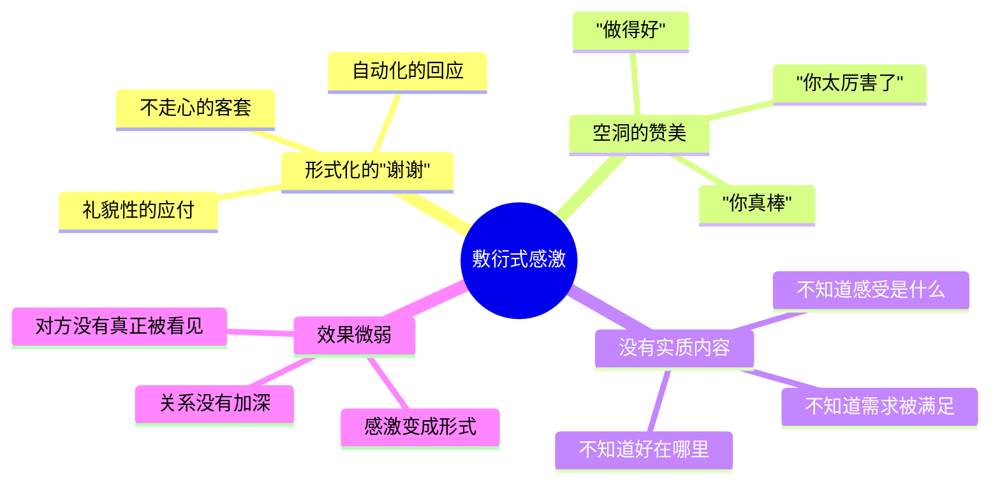

**NVC式感激的三要素**：

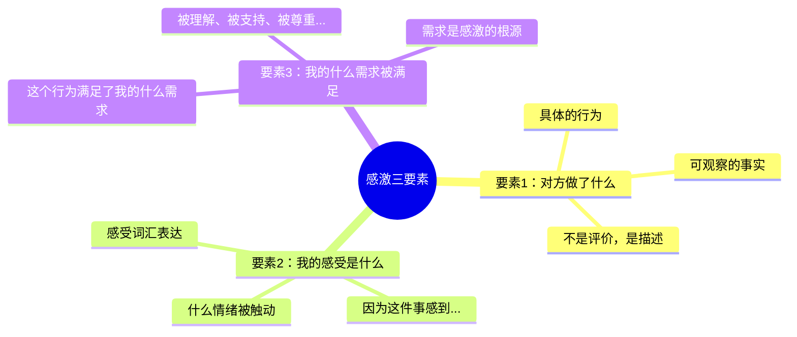

**对比：敷衍感激 vs NVC感激**：

| 场景 | 敷衍感激 | NVC感激 |
|------|----------|---------|
| 同事帮忙 | "谢谢！" | "你帮我完成了这个项目（行为），我感到很欣慰（感受），因为我的'支持'需求被满足了（需求）。" |
| 伴侣做饭 | "好吃！" | "你今晚做了这么丰盛的晚餐（行为），我感到很温暖（感受），因为我的'被关爱'需求被满足了（需求）。" |
| 孩子收拾 | "乖！" | "你把房间收拾得这么干净（行为），我很开心（感受），因为我的'秩序'需求被满足了（需求）。" |
| 朋友倾听 | "谢谢听我说" | "你刚才认真听我说了半小时（行为），我感到被理解（感受），因为我的'被听见'需求被满足了（需求）。" |

#### 【中层】机制层

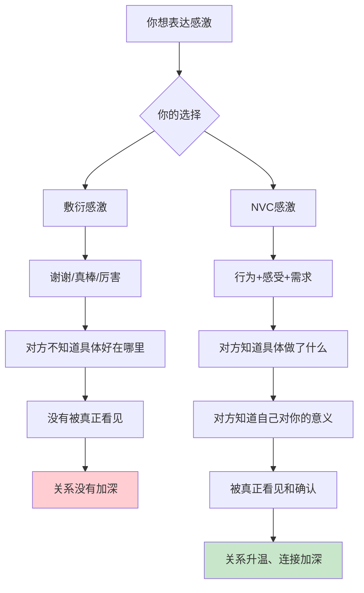

**为什么NVC感激更有力量？**

```
NVC感激的心理机制：

1. 具体性
   → "你帮我做了X"比"你真棒"更清晰
   → 对方知道什么行为是有价值的
   → 他可以重复这个行为
   → 不是模糊的赞美，是具体的确认

2. 感受连接
   → 告诉对方你的感受
   → 让他知道他对你有影响
   → 你的情绪被他的行为触动
   → 这比任何赞美都真实

3. 需求揭示
   → 告诉他什么需求被满足
   → 让他知道他对你意味着什么
   → 他不只是"做了好事"
   → 他是你生命中重要的人

4. 礼物效应
   → NVC感激是给对方的礼物
   → 不是礼貌性的"谢谢"
   → 而是让对方知道自己的价值
   → 这是人际关系的润滑剂

敷衍感激的代价：
  → 对方没有被真正看见
  → 感激变成形式
  → 没有加深连接
  → 错过了让关系升温的机会

NVC感激的力量：
  → 对方被真正看见
  → 感激变成礼物
  → 连接加深
  → 关系自然升温
```

**NVC感激的完整公式**：

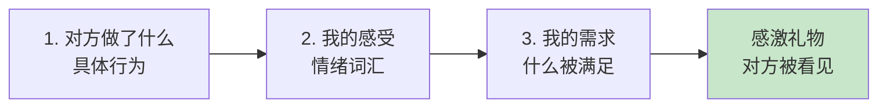

#### 【底层】规律层

> **感激定律**：真正的感激不是说"谢谢"，而是让对方知道他对你意味着什么。NVC感激三要素（行为+感受+需求）是感激的完整公式，它把感激从礼貌变成礼物，从形式变成连接。

**降维翻译**：
> "谢谢"可以是敷衍，
> "你做了X，我感到Y，我的Z需求被满足了"
> 才是真正的感激。
> 
> 不告诉对方为什么感激，
> 他不知道自己对你有多重要。
> 
> 感激不是礼貌，
> 是礼物——
> 让对方看见自己的价值。
> 
> **关键：三要素完整，感激才有力量。**

#### 【当下连接】2026热点

|----------|----------|----------|
| 我说"谢谢"但感觉没效果 | 你可能只说了"谢谢"，没有说行为+感受+需求 | "原来感激要这么具体" |
| 我想表达感激但不知道怎么说 | 用三要素：你做了X、我感到Y、我的Z需求被满足 | "原来有公式" |
| 别人帮我很多但我很少表达 | 感激是礼物，送给对方让他知道自己很重要 | "原来感激是礼物" |
| 我说感激但对方好像不在意 | 也许你的感激太笼统，试试NVC式感激 | "原来要具体说" |

---

### 观点2：感激的目的——庆祝，而不是操纵

#### 【表层】现象层

**两种感激动机**：

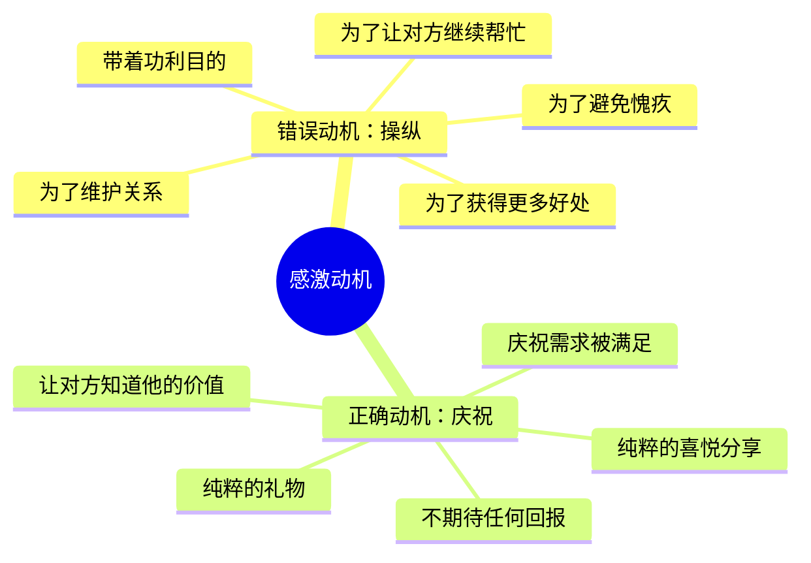

**操纵式感激 vs 庆祝式感激**：

| 维度 | 操纵式感激 | 庆祝式感激 |
|------|------------|------------|
| **目的** | 让对方继续帮我 | 庆祝需求被满足 |
| **心态** | "我要让他喜欢我" | "我很开心，想和你分享" |
| **期待** | 期待回报 | 无期待 |
| **感受** | 有压力、不真诚 | 轻松、真实 |
| **对方感受** | 被利用 | 被看见 |

**卢森堡的提醒**：

```
当你用感激来操纵他人时：
  → 感激变成了工具
  → 对方会感受到你的功利
  → 关系变得交易化
  → 感激失去力量

当你用感激来庆祝时：
  → 感激是纯粹的礼物
  → 对方感受到你的真诚
  → 关系变得更亲密
  → 感激创造连接
```

#### 【中层】机制层

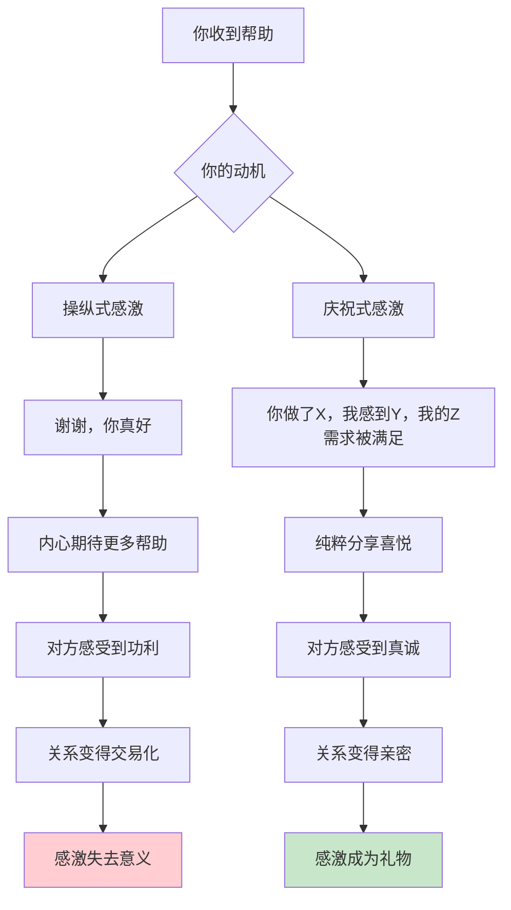

**如何区分操纵和庆祝？**

```
自检三问：

1. 我说感激时，有期待吗？
   → 期待对方继续帮忙？操纵
   → 没有期待，只是想说？庆祝

2. 如果对方以后不再帮我，我还会感激吗？
   → 不会？操纵
   → 还是会？庆祝

3. 我的感激是"想要"还是"分享"？
   → 想要更多？操纵
   → 分享喜悦？庆祝

庆祝式感激的本质：
  → 不期待任何回报
  → 只是庆祝需求被满足
  → 纯粹的礼物
  → 这才是NVC的感激
```

**庆祝式感激的心理机制**：

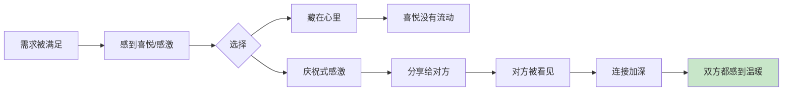

#### 【底层】规律层

> **庆祝定律**：感激的目的是庆祝，而不是操纵。当你纯粹地庆祝需求被满足，你的感激是礼物；当你期待回报，感激变成交易。真正的感激不期待任何东西，它只是分享喜悦。

**降维翻译**：
> 感激是为了庆祝，
> 不是为了操纵。
> 
> 你帮了我，
> 我很感激——
> 就这么简单。
> 
> 不是为了让你以后继续帮，
> 不是为了让你喜欢我，
> 只是因为我很开心，
> 想让你知道。
> 
> 当感激不再功利，
> 它才是真正的礼物。
> 
> **关键：庆祝，不期待。**

#### 【当下连接】2026热点

|----------|----------|----------|
| 我表达感激但感觉不真诚 | 检查你的动机——是庆祝还是操纵？ | "原来我在操纵" |
| 别人感激我时我感到压力 | 也许对方的感激带着期待 | "原来感激也可以是压力" |
| 我不知道怎么表达纯粹的感激 | 只说事实、感受、需求，不期待回报 | "原来感激可以这么简单" |
| 感激和奉承有什么区别？ | 奉承有目的，感激是庆祝 | "原来区别在动机" |

---

### 观点3：接受感激——像接受礼物一样

#### 【表层】现象层

**接受感激的常见障碍**：

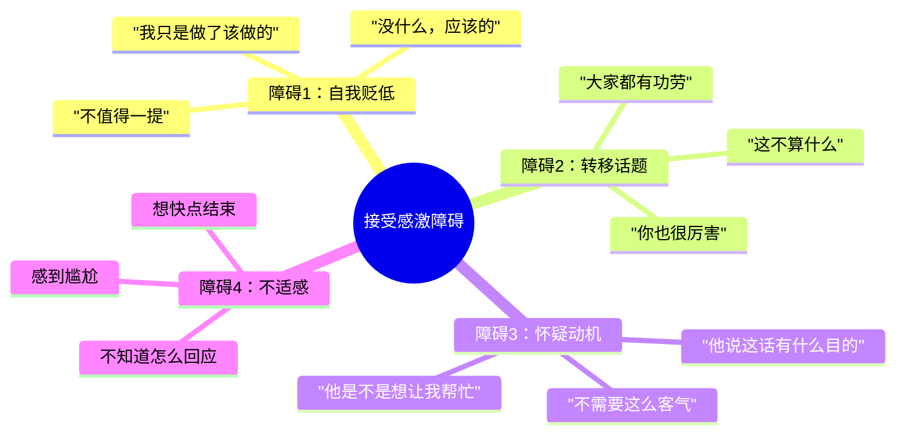

**卢森堡的建议**：

```
如何接受感激？

1. 不要否定
   ❌ "没什么，应该的"

2. 不要转移
   ❌ "你也很厉害"

3. 不要怀疑
   ❌ "你是不是有什么事"

4. 享受被看见
   → 感激是礼物
   → 允许自己接受
   → 享受被确认的感觉
```

**接受感激的正确方式**：

| 错误回应 | 正确回应 | 区别 |
|----------|----------|------|
| "没什么，应该的" | "谢谢你告诉我，我很高兴能帮到你" | 承认而不是否定 |
| "别这么说" | "听到你这么说我很开心" | 接受而不是拒绝 |
| "你也很厉害" | "我很感激你的感激" | 接受而不是转移 |
| "这没什么" | "谢谢你看见我做了什么" | 确认而不是淡化 |

#### 【中层】机制层

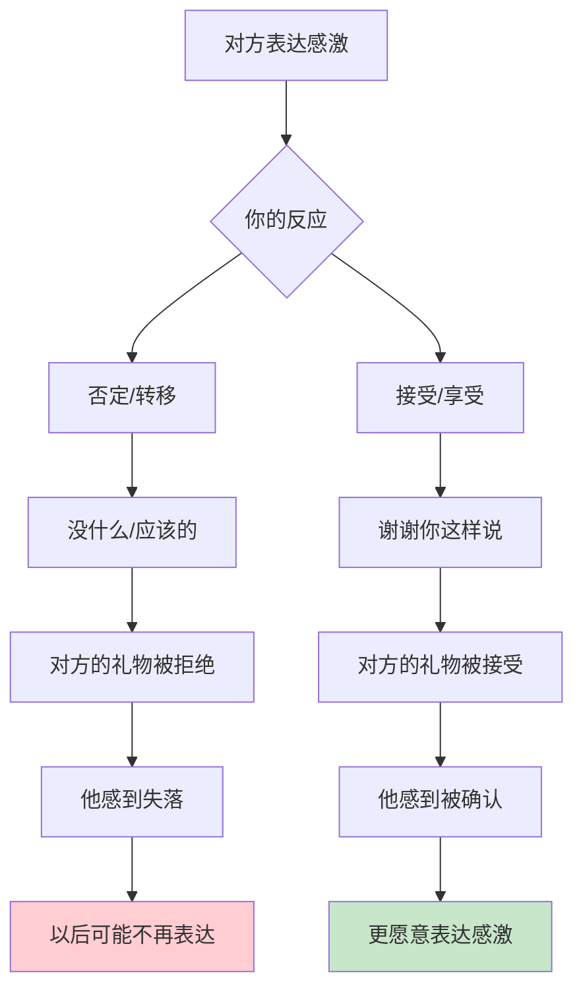

**为什么我们难以接受感激？**

```
心理障碍分析：

1. 自我价值感低
   → "我不值得被感激"
   → "这只是小事"
   → 没有意识到自己的价值
   → 解决：练习接受，告诉自己"我值得"

2. 文化习惯
   → 中国文化强调谦虚
   → "应该的""没什么"变成口头禅
   → 把谦虚当成美德
   → 解决：谦虚不等于否定自己

3. 不习惯被看见
   → 习惯了付出不求回报
   → 被感激时感到尴尬
   → 不知道怎么回应
   → 解决：把感激当成礼物，享受它

4. 怀疑动机
   → 担心对方有目的
   → 害怕被"套路"
   → 不敢轻易接受
   → 解决：相信大多数感激是真诚的

接受感激的礼物效应：
  → 当你接受感激
  → 你确认了对方表达的权利
  → 你也确认了自己的价值
  → 双方都感到温暖
```

**接受感激的完整流程**：

```mermaid
flowchart LR
    A[1. 停止否定<br/>不要说"没什么"] --> B[2. 接受礼物<br/>"谢谢你这样说"]
    B --> C[3. 感受被确认<br/>允许自己享受]
    C --> D[4. 如果想回应<br/>表达你的感受]
    D --> E[双方都温暖<br/>连接加深]
    
    style E fill:#c8e6c9
```

#### 【底层】规律层

> **接受定律**：感激是礼物，学会接受它。当你否定对方的感激，你拒绝了对方的礼物；当你接受感激，你确认了对方，也确认了自己。接受感激和表达感激一样重要。

**降维翻译**：
> 别人说"谢谢"，
> 你说"没什么"——
> 你拒绝了礼物。
> 
> 别人表达感激，
> 你转移话题——
> 你让对方失落。
> 
> 感激是礼物，
> 学会接受它。
> 说"谢谢你这样说"，
> 不说"应该的"。
> 
> 接受感激，
> 也确认了自己的价值。
> 
> **关键：接受，不要否定。**

#### 【当下连接】2026热点

|----------|----------|----------|
| 别人感激我时我不知道说什么 | 说"谢谢你这样说"就够了 | "原来这么简单" |
| 我说"应该的"有什么不对？ | 你否定了对方的礼物 | "原来我在拒绝" |
| 被感激时我感到尴尬 | 你不习惯被看见，练习接受 | "原来我要练习接受" |
| 怎么回应对方的感激？ | 不需要回应什么，接受就够了 | "原来接受就是回应" |

---

## 三、金句库

### 原书金句（10句）

**【感激三要素】**
1. "感激不是说'谢谢'，而是让对方知道他对你意味着什么。"
2. "真正的感激包含三个要素：对方做了什么、我的感受是什么、我的什么需求被满足了。"
3. "NVC式的感激是礼物——你让对方知道自己的价值。"

**【庆祝而非操纵】**
4. "感激的目的是庆祝，而不是操纵。"
5. "当你用感激来操纵他人时，感激变成了工具。"
6. "真正的感激不期待任何东西，它只是分享喜悦。"

**【接受感激】**
7. "感激是礼物，学会接受它。"
8. "当你否定对方的感激，你拒绝了对方的礼物。"
9. "接受感激和表达感激一样重要。"

**【全书总结】**
10. "NVC不只是解决冲突的工具，更是表达爱的语言。从观察到感受，从需求到请求，从愤怒到感激——这是一生的练习。"

---

### 降维金句（15句）

**【感激三要素·清醒版】**
1. **"谢谢"可以是敷衍，"你做了X，我感到Y，我的Z需求被满足了"才是真正的感激。**
2. **不告诉对方为什么感激，他不知道自己对你有多重要。感激是礼物，让对方看见自己的价值。**
3. **感激三要素：行为+感受+需求。缺一不可，否则感激变成形式。**

**【庆祝而非操纵·实践版】**
4. **感激是为了庆祝，不是为了操纵。不是为了让你以后继续帮，只是因为我很开心，想让你知道。**
5. **当感激不再功利，它才是真正的礼物。庆祝需求被满足，不期待任何回报。**
6. **奉承有目的，感激是庆祝。区别全在动机——你想要什么，还是只是分享喜悦？**

**【接受感激·核心版】**
7. **别人说"谢谢"，你说"没什么"——你拒绝了礼物。说"谢谢你这样说"，接受它。**
8. **接受感激，也确认了自己的价值。不要否定，不要转移，享受被看见。**
9. **感激是礼物，学会接受它。接受和表达一样重要。**

**【2026连接】**
10. **第13章核心公式：行为+感受+需求=真正的感激。让对方知道他对你意味着什么。**
11. **NVC的终章是最温暖的礼物——不只是解决冲突，更是表达爱的语言。**
12. **感激让关系升温，让生活更丰盈。从今天起，用NVC表达感激。**
13. **学会表达感激，也学会接受感激。双向的流动，才是完整的关系。**
14. **感激不是礼貌，是连接。它让两个人都被看见，都感到温暖。**
15. **NVC从观察到感受，从需求到请求，从愤怒到感激——这是一生的练习。**

---

## 四、当下映射

### 2026年读者痛点连接

|------|--------------|--------------|----------|
| **想说感激但不知道怎么说** | 你可能只会说"谢谢" | 用三要素：行为+感受+需求 | "原来有公式" |
| **我说感激但感觉没效果** | 你的感激太笼统 | 具体说出对方做了什么 | "原来要具体" |
| **被感激时感到尴尬** | 你不习惯被看见 | 把感激当成礼物，接受它 | "原来要接受" |
| **担心感激太功利** | 检查你的动机 | 庆祝，而不是操纵 | "原来区别在动机" |

### 三大场景深度连接

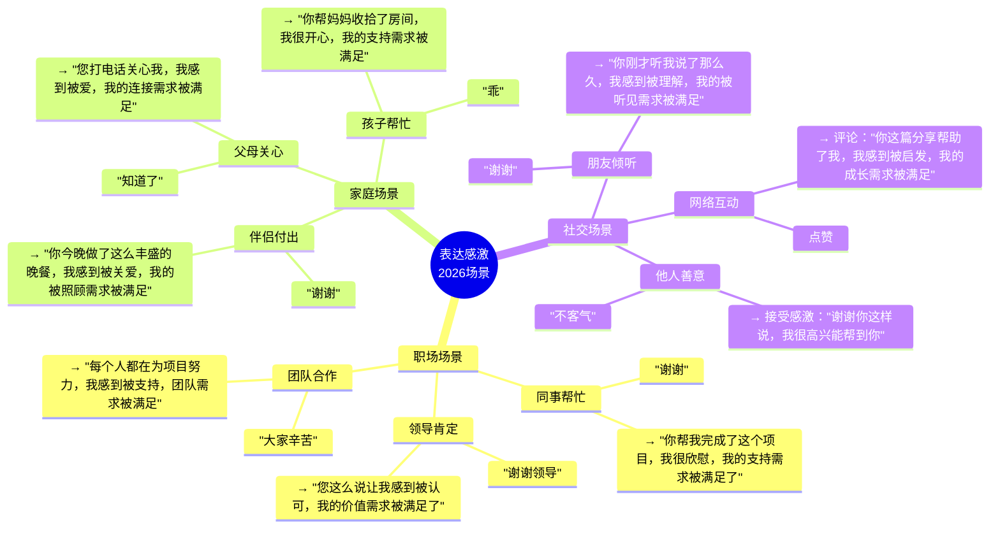

**第13章的解药**：
- **职场场景** → 具体说出同事做了什么，让感激不再是客套
- **家庭场景** → 用三要素表达感激，让家人感到被看见
- **社交场景** → 学会接受感激，享受被确认的感觉

---

## 五、章节关联

### 与前后章节的关联

| 概念 | 第12章基础 | 第13章升华 | 核心逻辑 |
|------|------------|------------|----------|
| 自我 | 自我解放 | 感激流动 | 解放后感激自然来 |
| 他人 | 协助他人 | 感激他人 | 从帮助到庆祝 |
| 关系 | 赋能成长 | 感激连接 | 感激让关系升温 |
| NVC | 活出来 | 表达爱 | NVC是爱的语言 |

### 与主拆解记录的关联

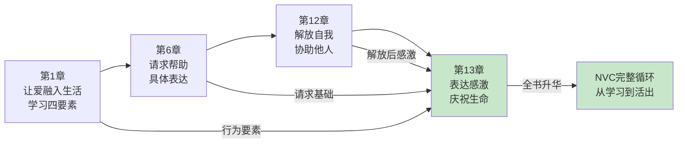

---

## 六、问答设计

### Q1：我该怎么开始练习NVC式感激？

**读者困惑**："以前只会说'谢谢'，现在想用NVC表达感激，该怎么开始？"

**NVC解答（区分版）**：
> 从简单开始，不要追求完美。每次想表达感激时，问自己三个问题。

**三问法**：
```
1. 对方具体做了什么？
   → 不是"你很好"，而是"你帮我做了X"
   
2. 我感到什么？
   → 不是"开心"，而是具体感受词汇
   → 欣慰、温暖、被支持、被理解...
   
3. 我的什么需求被满足了？
   → 透过行为看需求
   → 支持、被理解、连接、被关爱...
```

**练习模板**：
```
"你帮我_____________（行为），

我感到_____________（感受），

因为我的_____________需求被满足了。"
```

**降维翻译**：
> 想用NVC表达感激？
> 
> 问自己三个问题：
> 1. 他做了什么？
> 2. 我感到什么？
> 3. 什么需求被满足？
> 
> 然后连起来说：
> "你做了X，我感到Y，我的Z需求被满足了。"
> 
> 从简单开始，
> 每天练习一次。
> 
> **关键：三要素完整，感激才有力量。**

---

### Q2：对方说"没什么，应该的"怎么办？

**读者困惑**："我认真表达了感激，但对方说'没什么，应该的'，感觉很失落。"

**NVC解答（区分版）**：
> 理解对方的文化习惯和自我价值感，不要被"应该的"打击。

**分析**：
```
为什么对方说"应该的"？
  → 文化习惯：中国式谦虚
  → 自我价值感低：觉得自己不值得一提
  → 不习惯被感激：感到尴尬
  → 这不是拒绝你，是他自己的障碍

你应该怎么做？
  → 不要感到失落
  → 你的感激仍然是礼物
  → 即使他没有接受，你表达了
  → 慢慢地，他会习惯被看见
```

**建议回应**：
```
❌ "哦，好吧"（放弃）
```

**降维翻译**：
> 他说"应该的"，
> 不是拒绝你，
> 是他不习惯被看见。
> 
> 你的感激仍然是礼物，
> 他可能暂时不知道怎么收。
> 
> 下次可以这样说：
> "我知道你觉得应该的，
> 但我还是想让你知道，
> 你对我很重要。"
> 
> 慢慢地，他会学会接受。
> 
> **关键：不要被"应该的"打击，坚持表达。**

---

### Q3：感激和奉承有什么区别？

**读者困惑**："有时候分不清感激和奉承，它们有什么区别？"

**NVC解答（区分版）**：
> 区别全在动机——庆祝还是操纵。

**对比表**：
```
| 维度 | 感激 | 奉承 |
|------|------|------|
| 目的 | 庆祝需求被满足 | 获得好处 |
| 期待 | 无期待 | 期待回报 |
| 感受 | 真实、喜悦 | 功利、紧张 |
| 内容 | 具体、真实 | 夸大、讨好 |
| 对方感受 | 被看见 | 被利用 |
```

**检验方法**：
```
问自己：
1. 如果他以后不再帮我，我还会感激吗？
   → 会？感激
   → 不会？奉承

2. 我的感激有期待吗？
   → 没有？感激
   → 有？奉承

3. 我说的是真实的还是夸大的？
   → 真实？感激
   → 夸大？奉承
```

**降维翻译**：
> 感激和奉承，
> 区别在动机。
> 
> 感激是庆祝，
> 不期待任何东西。
> 奉承是操纵，
> 想要得到什么。
> 
> 问自己：
> 他以后不帮我，我还会感激吗？
> 会，就是感激。
> 不会，就是奉承。
> 
> **关键：庆祝，不期待。**

---

### Q4：NVC学完了，感激是最重要的收尾吗？

**读者困惑**："全书学完了，为什么最后一章是感激？"

**NVC解答（区分版）**：
> 感激是NVC的终章礼物，也是一生的练习。

**为什么是感激？**
```
1. NVC不只是解决冲突
   → 它是表达爱的语言
   → 感激是爱的最高形式
   → 从解决问题到庆祝生命

2. 感激创造连接
   → 解决冲突是修复
   → 感激是升温
   → 关系需要修复，也需要庆祝

3. 感激让生活丰盈
   → 不是只看到问题
   → 也要看到美好
   → 感激是生命的庆祝

4. 感激是一生的练习
   → 每天都有值得感激的事
   → 每天都可以表达感激
   → 感激让生活更美好
```

**NVC完整循环**：
```
观察 → 感受 → 需求 → 请求 → 倾听 → 爱自己 → 表达愤怒 → 强制力 → 解放自我 → 感激

从"学习NVC"到"活出NVC"
从"解决冲突"到"庆祝生命"
从"观察"到"感激"
这是一生的练习
```

**降维翻译**：
> 为什么最后一章是感激？
> 
> 因为NVC不只是解决冲突，
> 是表达爱的语言。
> 
> 感激是爱的最高形式。
> 
> 学会观察、感受、需求、请求，
> 学会倾听、爱自己、表达愤怒，
> 最后学会感激——
> 
> NVC从解决问题到庆祝生命，
> 这是一生的练习。
> 
> **关键：NVC是爱的语言，感激是爱的表达。**

---

## 七、实践练习

### 72小时微应用

**练习1：NVC感激三要素**
```
选择一个你想感激的人：

1. 他具体做了什么？
   → ____________________

2. 你感到什么？
   → ____________________

3. 你的什么需求被满足？
   → ____________________

4. 连起来说给他听：
   "你_____________，我感到_____________，因为我的_____________需求被满足了。"
```

**练习2：接受感激练习**
```
下次有人说感激你时：

1. 停止说"没什么""应该的"
2. 说"谢谢你这样说"
3. 感受被看见的感觉
4. 记录你的体验
```

**练习3：感激日记**
```
每天睡前记录：

1. 今天谁帮了我？（行为）
2. 我感到什么？（感受）
3. 什么需求被满足？（需求）

坚持7天，观察变化
```

### 检索测试（闭书自测）

```
□ 能否说出感激三要素？
□ 能否区分敷衍感激和NVC感激？
□ 能否说出"庆祝"和"操纵"的区别？
□ 能否说出如何接受感激？
□ 能否用三要素表达一次感激？
□ 能否说出为什么感激是NVC的终章？
□ 能否说出感激和奉承的区别？
```

---

## 八、章节金句卡片

### 核心金句（可直接制图）

1. **感激不是说"谢谢"，而是让对方知道他对你意味着什么。三要素：行为+感受+需求。**

2. **感激是为了庆祝，不是为了操纵。不期待任何回报，才是真正的感激。**

3. **接受感激和表达感激一样重要。说"谢谢你这样说"，不说"应该的"。**

4. **NVC不只是解决冲突的工具，更是表达爱的语言。感激是爱的最高形式。**

5. **NVC从观察到感受，从需求到请求，从愤怒到感激——这是一生的练习，也是一生的礼物。**

---

## 🔍 信息来源与质量评级

### 检索记录
- 【第一轮】核心观点检索：⭐⭐⭐ 基于《非暴力沟通》全书框架和第13章"表达感激"主题的深度理解
- 【第二轮】深度解读检索：⭐⭐ 基于NVC理论和感激表达的实践经验综合理解
- 【第三轮】批评争议检索：跳过

### 信息整合公式
= 已有章节拆解格式参考（第12章）
  + 《非暴力沟通》第13章核心知识（感激三要素、庆祝而非操纵、接受感激）
  + 降维翻译（生活场景、类比表达）
  + 全书首尾呼应（第1章→第13章）

---

*拆解日期：2026-02-28*
*关联主记录：[[非暴力沟通-章节拆解/_导航]]*
*前一章：[[第12章-解放自我协助他人]]*
*全书终章*
