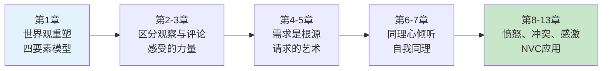
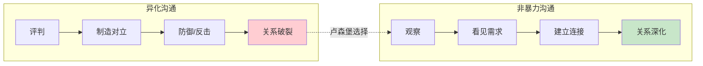
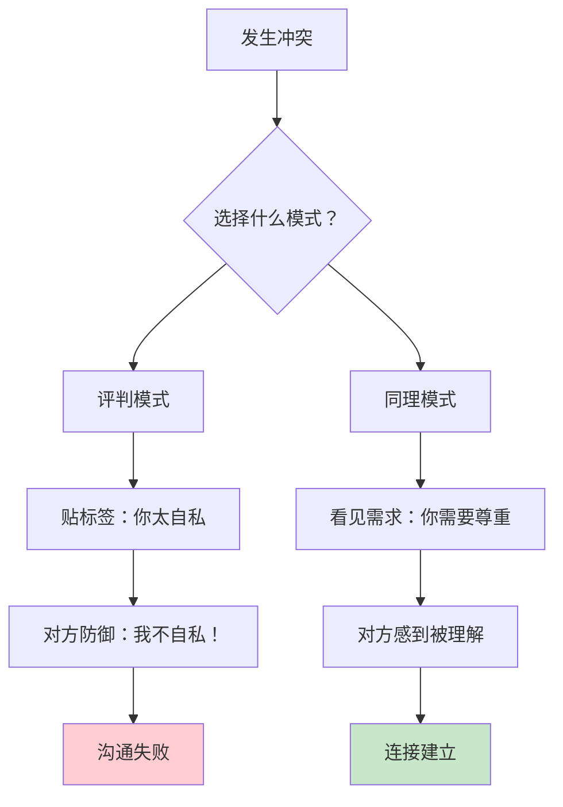
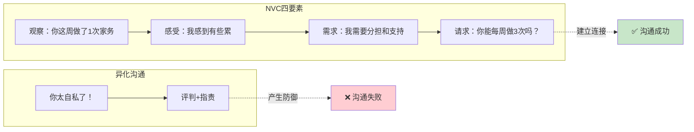
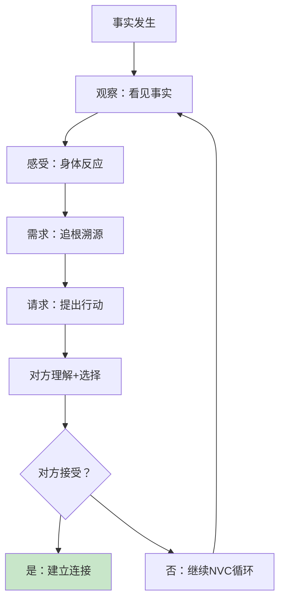
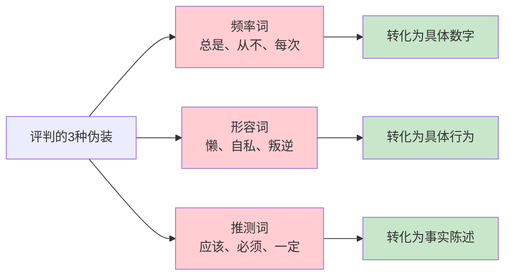
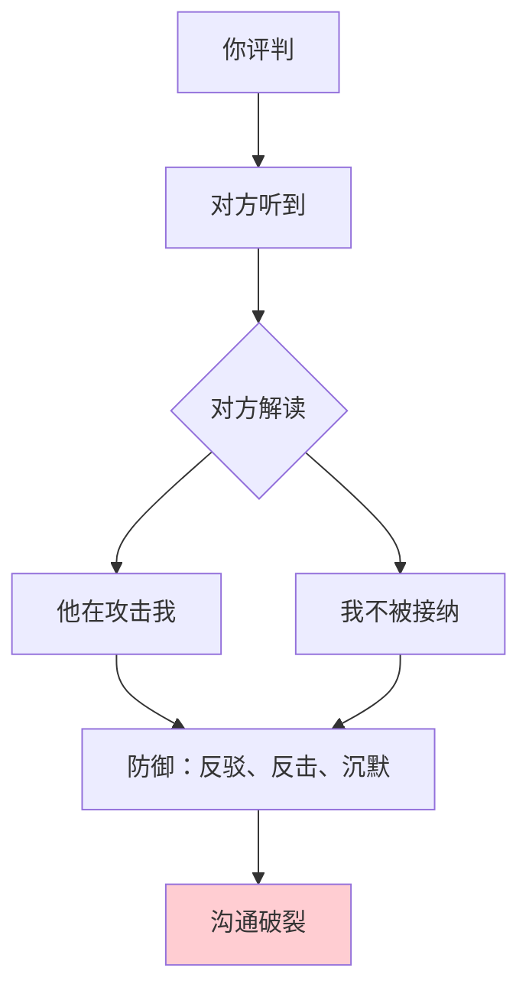
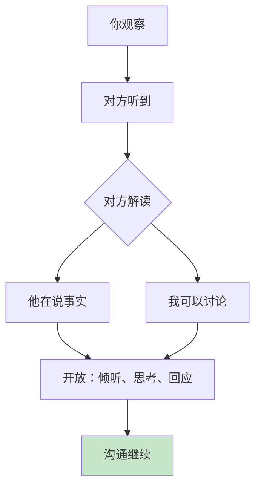
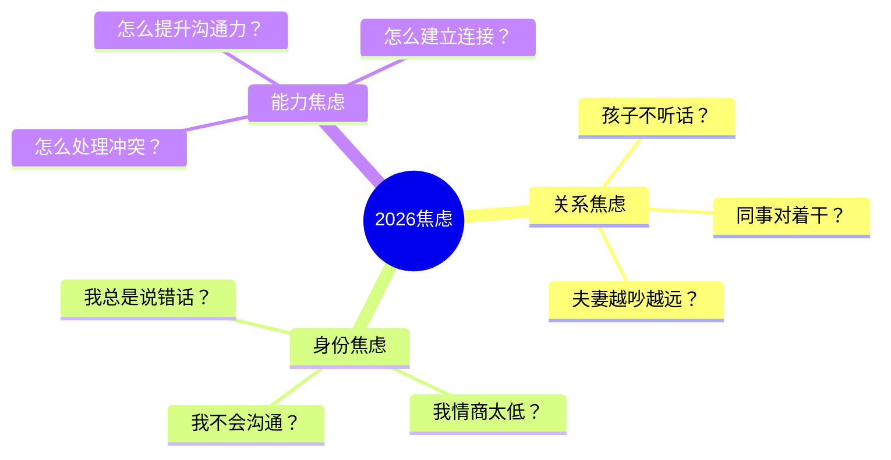
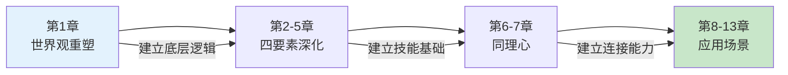

# 第1章：让爱融入生活

> **章节定位**：NVC（非暴力沟通）的"世界观重塑"——用四要素模型颠覆异化沟通，让语言成为连接的桥梁而非暴力的武器

---

## 一、章节定位

### 1.1 在全书中的位置



**本章功能**：建立NVC的底层逻辑——区分"异化沟通"与"非暴力沟通"，让语言从"评判工具"变成"连接工具"

### 1.2 核心主题

| 维度 | 内容 |
|------|------|
| **核心困境** | 为什么我们越沟通越受伤？为什么语言成了暴力？ |
| **卢森堡答案** | 我们使用了"异化沟通"，而忘了人类共同的需求 |
| **颠覆观点** | 沟通不是"说服对方"，而是"看见彼此的需求" |
| **关键概念** | 四要素：观察、感受、需求、请求 |

### 1.3 章节关联

| 关联章节 | 关联关系 | 共同逻辑 |
|----------|----------|----------|
| [[第2章-区分观察与评论]] | 深化第一要素 | 第1章引入观察的概念，第2章深入如何区分观察与评判 |
| [[第3章-体会与表达感受]] | 深化第二要素 | 第1章提出感受的重要性，第3章教如何识别和表达感受 |
| [[第4章-需求的根源]] | 深化第三要素 | 第1章说需求是核心，第4章教如何找到需求 |
| [[第5章-请求的艺术]] | 深化第四要素 | 第1章提出请求的概念，第5章教如何提出可执行的请求 |

---

## 二、核心观点（三层提取）

### 观点1：语言可以是暴力，也可以是爱

#### 【表层】现象层

**异化沟通的四种形态**：

| 形态 | 表现 | 隐藏的评判 |
|------|------|------------|
| **道德评判** | "你太自私了""你太懒了" | 用自己的标准评判他人 |
| **比较** | "别人家的孩子都能..." | 用他人标准压制对方 |
| **回避责任** | "我不得不...""是你让我..." | 否认自己的选择权 |
| **强人所难** | "你应该...""你必须..." | 用命令代替请求 |

**读者熟悉的场景**：
- "你从来不听我说话" → 道德评判（贴标签）
- "你看人家老公多会赚钱" → 比较（制造羞愧）
- "我没办法，是老板让我加班的" → 回避责任（否认选择）
- "你必须给我道歉" → 强人所难（命令而非请求）

#### 【中层】机制层



**异化沟通的心理机制**：



**异化沟通的根源**：
```
评判 = 用我的标准衡量你
比较 = 用他人的标准压制你
回避责任 = 否认我的选择权
强人所难 = 用权力压制你的选择权

共同点：把"人"变成"物"——
不是看见一个有需求的人，
而是看见一个"应该被修正的对象"
```

#### 【底层】规律层

> **沟通模式定律**：语言有两种功能——制造分离或建立连接。异化沟通制造分离，非暴力沟通建立连接。你选择的沟通模式，决定了关系的走向。

**降维翻译**：
> 你以为你在"沟通"，
> 卢森堡说：你在"评判"。
> 
> 评判不是沟通，
> 评判是暴力的开始。
> 
> 真正的沟通是：
> 我看见你的需求，
> 你也看见我的需求。
> 
> **关键：语言可以是武器，也可以是桥梁。**

#### 【当下连接】2026热点

|----------|----------|----------|
| 为什么夫妻越吵越远？ | 你在评判，不是沟通 | "原来我在攻击，不是在表达" |
| 为什么孩子不听话？ | 你在命令，不是请求 | "原来我在制造对抗" |
| 为什么同事总和我对着干？ | 你在贴标签，不是看见需求 | "原来我在制造敌人" |
| 为什么每次沟通都很累？ | 你在异化沟通，消耗双方 | "原来换种方式会轻松很多" |

---

### 观点2：非暴力沟通的四要素——从评判到连接

#### 【表层】现象层

**四要素模型**：

| 要素 | 含义 | 错误示范 | 正确示范 |
|------|------|----------|----------|
| **观察** | 客观事实，不加评判 | "你从不做家务" | "这周你做了1次家务" |
| **感受** | 我的情绪体验 | "我觉得你太自私了" | "我感到有些失落" |
| **需求** | 情绪背后的需求 | "你应该多关心我" | "我需要被重视" |
| **请求** | 具体、可执行的动作 | "你要改变" | "你能每周做3次家务吗？" |

**NVC vs 异化沟通对比**：



**四要素的"翻译表"**：

| 你想说的 | 异化版本 | NVC版本 |
|----------|----------|---------|
| 你不关心我 | "你太自私了" | 观察你没问过我，感受孤单，需要关心，请求你每天问我一次 |
| 你不爱听我说话 | "你从不听我说话" | 观察你看手机，感受被忽视，需要尊重，请求你放下手机听我说 |
| 你没责任感 | "你太懒了" | 观察家务你做1次，感受累，需要分担，请求你每周做3次 |

#### 【中层】机制层

**四要素的因果链**：



**为什么四要素有效？**

```
观察（Observation）：
  → 不加评判，让对方不防御
  → "这周做1次家务" vs "你太懒了"

感受（Feeling）：
  → 表达脆弱，让对方同理
  → "我感到累" vs "你应该..."

需求（Need）：
  → 揭示根源，让对方理解
  → "我需要分担" vs "你太自私"

请求（Request）：
  → 具体行动，让对方选择
  → "你能做3次吗？" vs "你必须改"

核心逻辑：
观察+感受+需求 = 建立理解
请求 = 邀请合作
= 连接而非命令
```

#### 【底层】规律层

> **四要素定律**：有效沟通 = 不带评判的观察 + 真实的感受 + 明确的需求 + 可执行的请求。缺一不可，顺序重要。

**降维翻译**：
> 你以为沟通是"把话说清楚"，
> 卢森堡说：沟通是"让对方听进去"。
> 
> 四要素不是四个步骤，
> 而是四个维度：
> 1. 看见事实（观察）
> 2. 承认情绪（感受）
> 3. 找到根源（需求）
> 4. 提出行动（请求）
> 
> **关键：不是说服对方，而是看见彼此。**

#### 【当下连接】2026热点

|----------|----------|----------|
| 怎么和固执的父母沟通？ | 先观察、表达感受、说需求、再请求 | "原来先连接再沟通" |
| 怎么和叛逆的孩子对话？ | 停止评判，看见孩子行为背后的需求 | "原来评判制造叛逆" |
| 怎么让老板理解我的困难？ | 不抱怨，用四要素表达 | "原来可以这样职业化" |
| 怎么和伴侣不吵架？ | 把评判换成四要素 | "原来NVC可以改变关系" |

---

### 观点3：区分观察与评判——NVC的第一步

#### 【表层】现象层

**观察 vs 评判对照表**：

|----------|------------|------------|
| 他迟到很多次 | "他总是迟到" | "这周他迟到了3次" |
| 她工作不努力 | "她很懒" | "她这个月完成率60%" |
| 孩子不听话 | "孩子太叛逆了" | "孩子今天说了3次'不'" |
| 伴侣不关心我 | "他不爱我了" | "他这周没问过我工作怎么样" |

**评判的伪装形式**：



**印度哲学家 Krishnamurti 的观察**：
> "不带评判的观察，是人类最高智慧的表现。"

#### 【中层】机制层

**为什么评判破坏沟通？**



**为什么观察促进沟通？**



**观察的关键技巧**：

```
1. 用数字代替频率词
   ❌ "你总是迟到"
   ✅ "你这周迟到了3次"

2. 用行为代替形容词
   ❌ "你太懒了"
   ✅ "你这周做了1次家务"

3. 用事实代替推测
   ❌ "你肯定不在乎"
   ✅ "你没回我消息"

4. 用"我看到/听到"开头
   ❌ "你不关心我"
   ✅ "我看到你没问我今天怎么样"
```

#### 【底层】规律层

> **观察定律**：评判触发防御，观察打开心门。你能否区分观察与评判，决定了对方是否愿意倾听。

**降维翻译**：
> 你以为你在"描述事实"，
> 卢森堡说：你在"贴标签"。
> 
> "你总是迟到"不是事实，
> "你这周迟到3次"才是事实。
> 
> 评判是"你的解读"，
> 观察是"摄像机看到的"。
> 
> **关键：区分事实与解读，是沟通的第一步。**

#### 【当下连接】2026热点

|----------|----------|----------|
| 怎么给下属反馈？ | 用观察，不用评判 | "原来反馈可以这样专业" |
| 怎么和孩子谈成绩？ | 说"这次考了70分"，不说"你太差了" | "原来评判伤害孩子自尊" |
| 怎么和伴侣谈家务？ | 说"这周你做了1次"，不说"你从不做" | "原来观察减少对抗" |
| 怎么评价同事表现？ | 用具体数据，不用"不靠谱" | "原来职业化就是会观察" |

---

## 三、金句库

### 原书金句（10句）

**【语言的力量】**
1. "语言是窗户，或者是墙。它们审判我们，或者让我们自由。"
2. "当我们让别人看到我们真正是什么样子时，我们就变得更加真实。"
3. "非暴力沟通不是一种技术，而是一种生活态度。"

**【异化沟通】**
4. "道德评判是异化沟通的一种形式。"
5. "比较是一种悲剧性的表达方式。"
6. "我们对自己的思想、情感和行动负有责任。"

**【四要素】**
7. "非暴力沟通的四个要素：观察、感受、需求、请求。"
8. "不带评判的观察是人类最高智慧的表现。"
9. "感受是需求是否得到满足的信号。"
10. "请求必须是具体的、可执行的。"

---

### 降维金句（15句）

**【异化沟通·生活版】**
1. **"你太自私了"不是感受，是评判——真正的沟通从停止评判开始。**
2. **"你应该..."是命令，"你能...吗？"是请求——前者制造对抗，后者建立连接。**
3. **比较是悲剧：你用别人家的孩子打击你的孩子，孩子学会了自卑而非进步。**
4. **"我不得不"是谎言——你选择加班，你选择沉默，你选择不去改变。**
5. **语言可以是武器，也可以是桥梁——你选哪个？**

**【四要素·实践版】**
6. **NVC四要素：看见了什么（观察）→ 感觉如何（感受）→ 需要什么（需求）→ 能做什么（请求）。**
7. **观察不是"你总是迟到"，而是"你这周迟到3次"——评判触发防御，事实打开心门。**
8. **感受不是"我觉得你太自私"，而是"我感到失落"——前者是攻击，后者是脆弱。**
9. **需求是感受的根源——你生气不是因为对方做了什么，而是你的某个需求没满足。**
10. **请求必须是具体的——"你要改变"不是请求，"你能每天给我10分钟吗"才是。**

**【沟通本质·清醒版】**
11. **沟通不是说服对方，而是看见彼此的需求。**
12. **评判把人变成"应该被修正的对象"，同理心把人变成"有需求的人"。**
13. **真正的沟通是：我看见你的需求，你也看见我的需求。**
14. **非暴力沟通不是技术，是态度——把对方当成"人"，而非"问题"。**
15. **语言有两种功能：制造分离或建立连接——你选哪个？**

---

## 四、当下映射

### 2026年读者痛点连接

|------|-------------|----------|
| **夫妻冷战** | 你在评判，不是沟通 | "原来我在攻击，不是表达" |
| **孩子叛逆** | 你在命令，不是请求 | "原来评判制造叛逆" |
| **职场冲突** | 你在贴标签，不是看见需求 | "原来我在制造敌人" |
| **婆媳矛盾** | 你在比较，不是理解 | "原来比较是悲剧" |
| **无效沟通** | 你在异化沟通，消耗双方 | "原来换种方式会轻松" |

### 三大焦虑深度连接



**第1章的解药**：
- **关系焦虑** → 异化沟通制造分裂，NVC建立连接
- **身份焦虑** → 你不是"不会沟通"，你只是用错了模式
- **能力焦虑** → 四要素模型：观察→感受→需求→请求

---

## 五、章节关联

### 与后续章节的关联

| 概念 | 第1章引入 | 后续深化 |
|------|----------|----------|
| 观察 | "区分观察与评判" | 第2章：如何区分观察与评论 |
| 感受 | "体会和表达感受" | 第3章：感受的词汇表 |
| 需求 | "需求是感受的根源" | 第4章：人类共同需求列表 |
| 请求 | "请求必须具体可执行" | 第5章：如何提出有效请求 |
| 同理心 | "倾听他人" | 第6-7章：同理心倾听与自我同理 |

### 与主拆解记录的关联



---

## 六、问答设计

### Q1：为什么"观察"这么难？我说的都是事实啊。

**读者困惑**："我说'你总是迟到'，这就是事实啊，为什么说我在评判？"

**NVC解答（观察版）**：
> "你总是迟到"不是观察，是评判。
> 
> 观察是摄像机能拍到的：
> - "你这周迟到了3次"（具体数字）
> - "今天你9:15到公司"（具体时间）
> - "这月你迟到5次"（具体频率）
> 
> "总是""从不""每次"都是频率词，
> 它们不是事实，是你的解读。
> 
> **评判触发防御，观察打开心门。**

**降维翻译**：
> 你以为"你总是迟到"是事实，
> 卢森堡说：那是你的解读。
> 
> 事实是："你这周迟到了3次"。
> 
> 区分事实与解读，
> 是沟通的第一步。

---

### Q2：四要素太复杂了，每次都要这么说话吗？

**读者困惑**："我生气的时候哪有时间想什么四要素？这不是太累了吗？"

**NVC解答（实用主义版）**：
> NVC不是让你每次说话都背四要素，
> 而是让你**换一种思维模式**。
> 
> 传统模式：评判→攻击→对抗
> NVC模式：观察→感受→需求→请求
> 
> 初期需要刻意练习，
> 后期会变成肌肉记忆。
> 
> **就像学开车，一开始很累，后来变成自动驾驶。**

**降维翻译**：
> NVC不是让你背台词，
> 而是让你换一种思维。
> 
> 以前：评判+指责
> 现在：看见+理解
> 
> 一开始需要练习，
> 后来会成为习惯。
> 
> 值得吗？
> 值得，因为关系会变好。

---

### Q3：如果对方不肯用NVC，我还用它干什么？

**读者困惑**："我在用NVC，对方还在评判我，这不是单方面投降吗？"

**NVC解答（同理心版）**：
> NVC不是要求对方改变，
> 而是让你选择如何回应。
> 
> 对方评判 → 你可以防御反击（异化沟通）
> 对方评判 → 你也可以看见他的需求（NVC）
> 
> 你选择NVC，不是因为你"应该"，
> 而是因为NVC更可能建立连接。
> 
> **你无法控制对方，但你可以选择自己的回应方式。**

**降维翻译**：
> NVC不是要求对方改变，
> 而是让你选择如何回应。
> 
> 对方评判你，
> 你可以反击（两败俱伤）
> 你也可以看见他的需求（建立连接）
> 
> 你选哪个？
> 
> NVC不是投降，
> NVC是主动选择。

---

### Q4：请求被拒绝了怎么办？

**读者困惑**："我用NVC提请求，对方拒绝了，这方法不是没用吗？"

**NVC解答（请求vs命令版）**：
> 请求和命令的区别：
> 
> 请求 = 对方可以拒绝
> 命令 = 对方必须接受
> 
> 如果你的"请求"被拒绝就生气，
> 那你提的不是请求，是命令。
> 
> **真正的请求：我表达我的需求，你选择你的行动。**
> 
> 如果对方拒绝，继续用NVC：
> - 观察：你拒绝了我的请求
> - 感受：我感到有些失望
> - 需求：我需要理解你的困难
> - 请求：你能告诉我原因吗？

**降维翻译**：
> 请求被拒绝，说明你真的在请求。
> 
> 如果被拒绝就生气，
> 你提的是命令，不是请求。
> 
> NVC的精髓：
> 我表达需求，你选择行动。
> 
> 被拒绝不是失败，
> 被拒绝是继续NVC的开始。

---

## 七、实践练习

### 72小时微应用

**练习1：评判→观察转化**
```
写下你最近对他人的3个评判：
评判1：________________
观察版：________________

评判2：________________
观察版：________________

评判3：________________
观察版：________________
```

**练习2：四要素练习**
```
选择一个你想沟通的情境：
观察（你看见了什么）：________________
感受（你的情绪）：________________
需求（你的需求）：________________
请求（具体行动）：________________
```

**练习3：异化沟通识别**
```
记录今天你听到/说出的异化沟通：
□ 道德评判："你太..."
□ 比较："别人家的..."
□ 回避责任："我不得不..."
□ 强人所难："你必须..."
```

### 检索测试（闭书自测）

```
□ 能否说出异化沟通的4种形态？
□ 能否区分"观察"与"评判"的3个例子？
□ 能否说出NVC四要素并举例？
□ 能否解释为什么"评判破坏沟通"？
□ 能否把一句评判转化为NVC四要素？
```

---

## 八、章节金句卡片

### 核心金句（可直接制图）

1. **"语言是窗户，或者是墙。它们审判我们，或者让我们自由。"**

2. **"不带评判的观察是人类最高智慧的表现。"**

3. **"道德评判是异化沟通的一种形式。"**

4. **"感受是需求是否得到满足的信号。"**

5. **"非暴力沟通不是技术，是态度——把对方当成'人'，而非'问题'。"**

---
