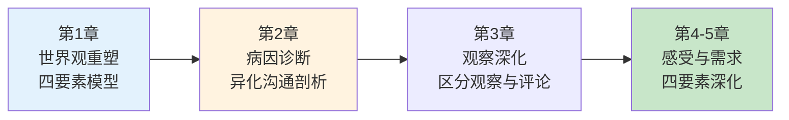
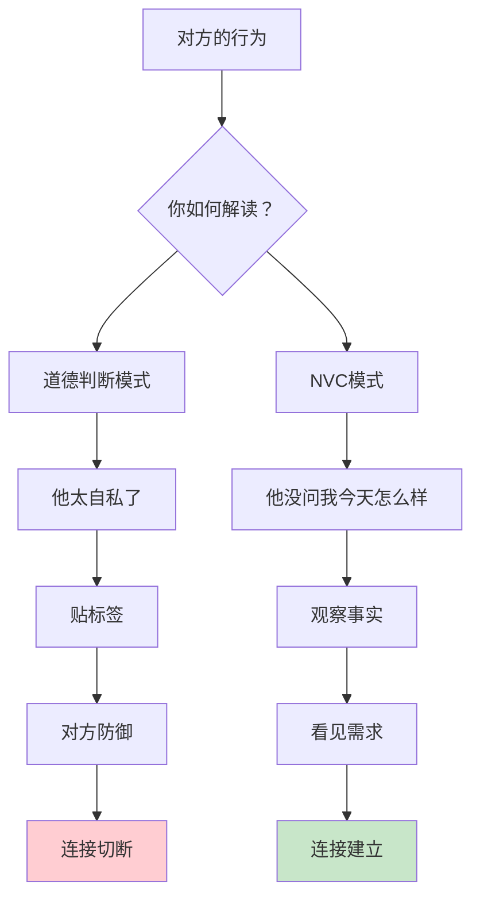
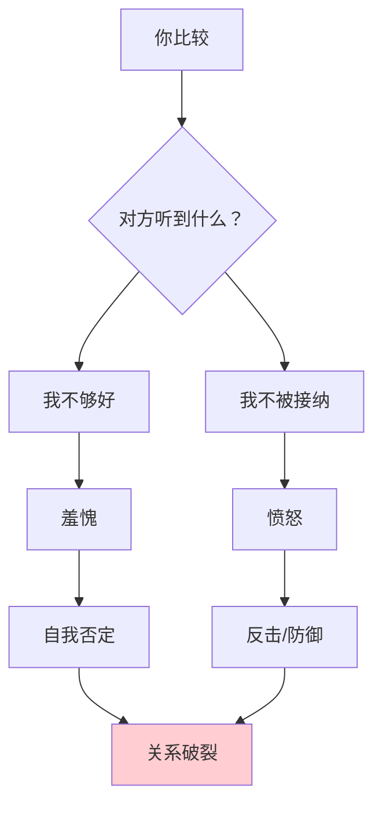
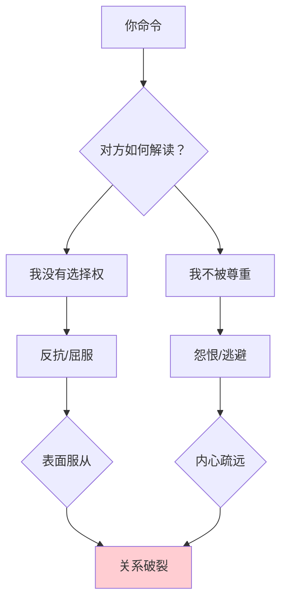
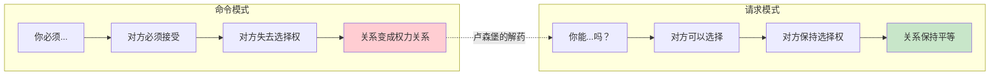
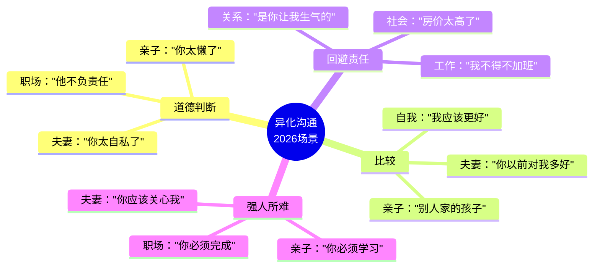
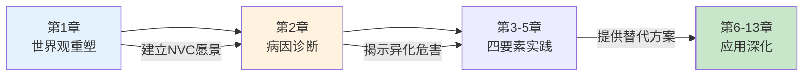

# 第2章：是什么蒙蔽了爱

> **章节定位**：NVC的"病因诊断"——深入剖析四种异化沟通方式如何切断人与人的连接，揭示为什么我们越想表达爱，越把爱推远

---

## 一、章节定位

### 1.1 在全书中的位置



**本章功能**：诊断"沟通疾病"——为什么我们明明相爱，却用语言互相伤害？四种异化沟通方式如何系统性地切断连接？

### 1.2 核心主题

| 维度 | 内容 |
|------|------|
| **核心问题** | 是什么蒙蔽了爱？为什么语言成了暴力的工具？ |
| **卢森堡诊断** | 四种异化沟通方式：道德判断、比较、回避责任、强人所难 |
| **颠覆观点** | 这些方式看起来"正常"，但它们在系统性摧毁连接 |
| **本章价值** | 不是教你"不要这样做"，而是揭示"为什么这样做的代价如此巨大" |

### 1.3 章节关联

| 关联章节 | 关联关系 | 共同逻辑 |
|----------|----------|----------|
| [[第1章-让爱融入生活]] | 前章引入 | 第1章提到异化沟通，第2章深入剖析 |
| [[第1章-哈吉斯]] | 后章深化 | 第2章揭示问题，第3章开始教解决方案 |
| [[第1章-哈吉斯]] | 深层溯源 | 第2章说"异化沟通切断连接"，第4章说"需求是连接的根源" |

---

## 二、核心观点（三层提取）

### 观点1：道德判断——用"对错"代替"需求"

#### 【表层】现象层

**道德判断的常见形态**：

| 类型 | 表现 | 隐藏逻辑 |
|------|------|----------|
| **贴标签** | "你太自私了""你太懒了" | 用一个词否定整个人 |
| **价值判断** | "这样做是对的""那样是错的" | 用道德标准压制对方 |
| **归因评判** | "你就是想伤害我" | 推测对方的动机 |
| **应然判断** | "你应该...""你不应该..." | 用规则代替理解 |

**读者熟悉的场景**：
- "你太自私了，从不考虑我的感受" → 贴标签（否定整个人）
- "你这样做是不对的" → 价值判断（用对错压制）
- "你就是想气我" → 归因评判（推测动机）
- "你应该多关心我" → 应然判断（用规则代替需求）

#### 【中层】机制层



**道德判断的心理代价**：

```mermaid
flowchart LR
    A[你评判] --> B[对方听到"我不被接纳"]
    B --> C[防御机制启动]
    C --> D[反击/逃避/沉默]
    D --> E[你的需求没被满足]
    E --> F[你更评判]
    F --> G[恶性循环]
    
    style G fill:#ffcdd2
```

**为什么道德判断如此普遍？**

```
1. 文化编程：
   - "好人""坏人"的二分法
   - "对""错"的道德教育
   - "应该""不应该"的社会规则

2. 心理捷径：
   - 评判比理解更快
   - 贴标签比看见需求更省力
   - "你错了"比"我需要什么"更容易

3. 权力游戏：
   - 评判=占据道德高地
   - "我是对的，你是错的"
   - 用道德武器压制对方

共同点：
  评判不是沟通，
  评判是权力的行使。
```

#### 【底层】规律层

> **道德判断定律**：当你用"对错"衡量对方时，你切断的是"需求"。道德判断把人变成"应该被修正的对象"，而非"有需求的人"。

**降维翻译**：
> 你以为"你太自私了"是在表达不满，
> 卢森堡说：那是在贴标签。
> 
> 贴标签不是沟通，
> 贴标签是道德审判。
> 
> 真正的沟通是：
> "我看见你做X，我感到Y，我需要Z。"
> 
> **关键：用需求代替判断，连接才会发生。**

#### 【当下连接】2026热点

|----------|----------|----------|
| 为什么伴侣越说越不听？ | 你在评判，不是表达需求 | "原来我在攻击，不是沟通" |
| 为什么孩子总和我对着干？ | 你在用"对错"压制，不是理解 | "原来评判制造叛逆" |
| 为什么同事总防着我？ | 你在贴标签，不是看见人 | "原来我在制造敌人" |
| 为什么每次沟通都很累？ | 你在道德审判，消耗双方 | "原来换种方式会轻松" |

---

### 观点2：比较——用"他人"压制"自己"

#### 【表层】现象层

**比较的常见形态**：

| 类型 | 表现 | 隐藏伤害 |
|------|------|----------|
| **横向比较** | "别人家的孩子都能..." | 用他人标准否定对方 |
| **纵向比较** | "你以前不是这样的" | 用过去标准压制现在 |
| **理想比较** | "你应该像我期望的那样" | 用幻想标准摧毁现实 |
| **反向比较** | "你看人家多不容易，你还..." | 用他人苦难否定对方感受 |

**卢森堡的警告**：
> "比较是一种悲剧性的表达方式。"

**读者熟悉的场景**：
- "你看人家小明考了100分" → 横向比较（否定孩子）
- "你以前对我多好" → 纵向比较（否定现在）
- "你应该更努力" → 理想比较（否定现实）
- "你看非洲孩子多惨" → 反向比较（否定感受）

#### 【中层】机制层



**比较的心理机制**：

```mermaid
flowchart LR
    A[你比较] --> B[制造"不够好"]
    B --> C[触发羞愧]
    C --> D{对方如何反应？}
    
    D --> E[羞愧→自我否定→失去动力]
    D --> F[愤怒→反击→关系恶化]
    
    E --> G[沟通失败]
    F --> G
    
    style G fill:#ffcdd2
```

**为什么比较如此致命？**

```
比较的三个陷阱：

1. 永远不够好：
   → 总有人比你更好
   → 你永远达不到"理想标准"
   → 你永远不配被爱

2. 否定独特性：
   → 每个人有不同的需求
   → 每个人有不同的路径
   → 比较用一把尺子量所有人

3. 切断当下连接：
   → 比较指向"他人"或"过去"
   → 眼前的人被忽视
   → 连接在此刻被切断

卢森堡的诊断：
  比较不是激励，
  比较是暴力的隐形形式。
```

#### 【底层】规律层

> **比较定律**：比较用"他人的标准"否定"眼前的独特性"。你比较的那一刻，你失去的是对眼前这个人的看见。

**降维翻译**：
> 你以为"别人家的孩子"能激励孩子，
> 卢森堡说：那是在制造羞愧。
> 
> 羞愧不是动力，
> 羞愧是自我否定的开始。
> 
> 真正的激励是：
> "我看见你的努力，我理解你的困难，我需要我们一起想办法。"
> 
> **关键：用看见代替比较，连接才会发生。**

#### 【当下连接】2026热点

|----------|----------|----------|
| 为什么孩子越来越不自信？ | 你在用"别人家的孩子"打击他 | "原来比较摧毁自信" |
| 为什么伴侣越来越沉默？ | 你在用"以前"否定现在 | "原来比较制造距离" |
| 为什么员工越来越躺平？ | 你在用"应该"否定现实 | "原来比较制造绝望" |
| 为什么我总觉得自己不够好？ | 你被比较了太多 | "原来我的自我否定来自这里" |

---

### 观点3：回避责任——用"外部原因"否认"选择权"

#### 【表层】现象层

**回避责任的常见话术**：

| 类型 | 表现 | 隐藏的谎言 |
|------|------|------------|
| **归因组织** | "公司规定就是这样" | 我没选择，是组织的错 |
| **归因他人** | "是你让我这么做的" | 我没选择，是你的错 |
| **归因角色** | "我不得不作为主管..." | 我没选择，是角色的错 |
| **归因压力** | "我没办法，形势所迫" | 我没选择，是环境的错 |
| **归因性别/年龄** | "男人都这样" | 我没选择，是性别的错 |

**卢森堡的核心观点**：
> "我们对自己的思想、情感和行动负有责任。"

**读者熟悉的场景**：
- "我不得不加班，是老板要求的" → 归因组织
- "我打你是因为你太不听话" → 归因他人
- "我作为父亲必须严厉" → 归因角色
- "我没办法，房价太高了" → 归因压力

#### 【中层】机制层

```mermaid
flowchart TD
    A[你说"我不得不"] --> B{对方听到什么？}
    B --> C["你不是自愿的"]
    B --> D["你在推卸责任"]
    
    C --> E[对方感到被强迫]
    D --> F[对方感到被操控]
    
    E --> G[关系变成权力关系]
    F --> G
    
    style G fill:#ffcdd2
```

**回避责任的心理机制**：

```mermaid
flowchart LR
    A[你回避责任] --> B[否认选择权]
    B --> C[变成"受害者"]
    C --> D{这带来什么？}
    
    D --> E[短期：减轻内疚]
    D --> F[长期：失去力量]
    
    E --> G[但关系恶化]
    F --> G
    
    style G fill:#ffcdd2
```

**卢森堡的"选择权"重构**：

```
传统思维：
  "我不得不加班" → 我是受害者 → 环境的错

NVC思维：
  "我选择加班，因为我需要收入/认可/安全感"
  → 我是选择者 → 我承担责任

关键转变：
  从"我不得不"到"我选择"

为什么这很重要？
  "我不得不" = 你是被动受害者
  "我选择" = 你是主动选择者
  
  受害者没有力量，
  选择者拥有力量。
```

#### 【底层】规律层

> **责任定律**：当你用"我不得不"说话时，你失去的是自己的力量。真正的自由不是"没有约束"，而是"为自己的选择负责"。

**降维翻译**：
> 你以为"我不得不"是在解释原因，
> 卢森堡说：那是在推卸责任。
> 
> "我不得不"是谎言：
> 你选择加班，是因为你需要收入。
> 你选择沉默，是因为你需要安全。
> 你选择不改变，是因为你需要舒适。
> 
> 承认"我选择"，
> 你才拥有改变的力量。
> 
> **关键：用"我选择"代替"我不得不"，你才重新成为自己的主人。**

#### 【当下连接】2026热点

|----------|----------|----------|
| 为什么我总感到无力？ | 你在说"我不得不"，失去选择权 | "原来我放弃了力量" |
| 为什么伴侣总推卸责任？ | 他在用"外部原因"回避选择 | "原来这是权力游戏" |
| 为什么员工没有主动性？ | 他们在说"公司让我"，失去主体性 | "原来组织制造受害者" |
| 为什么我总是抱怨？ | 抱怨是"我不得不"的副产品 | "原来抱怨源于回避责任" |

---

### 观点4：强人所难——用"命令"代替"请求"

#### 【表层】现象层

**强人所难 vs 请求对照表**：

|------|---------------|-----------|
| **语气** | "你必须...""你应该..." | "你能...吗？" |
| **选择权** | 对方必须接受 | 对方可以拒绝 |
| **后果** | 拒绝=惩罚/生气 | 拒绝=理解+继续对话 |
| **关系** | 权力关系 | 平等关系 |

**强人所难的常见形式**：

| 形式 | 表现 | 隐藏的威胁 |
|------|------|------------|
| **直接命令** | "你必须给我道歉" | 不做就惩罚 |
| **道德绑架** | "你应该...才是好人" | 不做就是坏人 |
| **情感勒索** | "你不...就是不爱你" | 不做就是不爱 |
| **隐性威胁** | "你自己看着办" | 后果自负 |

**读者熟悉的场景**：
- "你必须每天给我打电话" → 直接命令
- "你应该多关心我才是好丈夫" → 道德绑架
- "你不改就是不爱你" → 情感勒索
- "你自己看着办" → 隐性威胁

#### 【中层】机制层



**命令 vs 请求的心理机制**：



**为什么我们忍不住命令？**

```
1. 效率错觉：
   "我说了你就得做，这样最快"
   → 但对方会反抗/拖延，最终更慢

2. 焦虑驱动：
   "我不确定你会做，所以我必须命令"
   → 但命令制造反抗，你的焦虑加剧

3. 权力习惯：
   "我是父母/上司，我有权命令"
   → 但命令摧毁关系，你的权力被削弱

4. 过去经验：
   "我从小被命令，我也这样对人"
   → 但你在复制暴力，而非创造连接

卢森堡的诊断：
  命令的本质是"我对你有权力"，
  请求的本质是"我尊重你的选择"。
  
  你选哪个？
```

#### 【底层】规律层

> **命令定律**：命令切断的是"选择的尊严"。真正的请求是：我表达我的需求，你选择你的行动。被拒绝不是失败，是继续对话的开始。

**降维翻译**：
> 你以为"你必须"是效率，
> 卢森堡说：那是暴力。
> 
> 命令的本质：
> "我对你有权力，你必须服从。"
> 
> 请求的本质：
> "我有需求，你有选择。"
> 
> 区分的方法很简单：
> 如果对方拒绝，你生气吗？
> - 生气 = 你提的是命令
> - 不生气 = 你提的是请求
> 
> **关键：把命令变成请求，连接才会发生。**

#### 【当下连接】2026热点

|----------|----------|----------|
| 为什么孩子总和我对抗？ | 你在命令，不是请求 | "原来我在制造对抗" |
| 为什么伴侣越来越疏远？ | 你在用"应该"制造压力 | "原来命令摧毁亲密" |
| 为什么员工表面服从背地抗拒？ | 你在用权力压制，不是邀请合作 | "原来命令制造假配合" |
| 为什么我的请求总被拒绝？ | 你提的不是请求，是命令 | "原来我的'请求'带着威胁" |

---

## 三、金句库

### 原书金句（10句）

**【道德判断】**
1. "道德评判是异化沟通的一种形式。"
2. "当我们用对错、好坏来评判他人时，我们切断了连接。"
3. "评判不是看见，评判是否定。"

**【比较】**
4. "比较是一种悲剧性的表达方式。"
5. "当我们比较时，我们失去的是对眼前这个人的看见。"
6. "比较用他人的标准，否定眼前的独特性。"

**【回避责任】**
7. "我们对自己的思想、情感和行动负有责任。"
8. "'我不得不'是谎言，'我选择'是力量。"
9. "回避责任的人，失去的是改变的力量。"

**【强人所难】**
10. "命令的本质是'我对你有权力'，请求的本质是'我尊重你的选择'。"

---

### 降维金句（15句）

**【道德判断·生活版】**
1. **"你太自私了"不是感受，是贴标签——真正的沟通从停止判断开始。**
2. **道德判断的代价：你得到的是防御，失去的是连接。**
3. **评判把人变成"应该被修正的对象"，同理心把人变成"有需求的人"。**
4. **"你应该..."是道德武器，"我需要..."是连接桥梁——你选哪个？**

**【比较·清醒版】**
5. **比较用"他人"否定"眼前"，你失去的是对这个人的看见。**
6. **"别人家的孩子"能激励吗？不，比较制造的是羞愧，不是动力。**
7. **比较的三个陷阱：永远不够好、否定独特性、切断当下连接。**
8. **激励的本质是"我看见你"，比较的本质是"你不如人"。**

**【回避责任·力量版】**
9. **"我不得不"是谎言——你选择加班，你选择沉默，你选择不改变。**
10. **从"我不得不"到"我选择"，你才重新成为自己的主人。**
11. **回避责任的人是"受害者"，承担选择的人是"主人"——你选哪个？**
12. **抱怨是"我不得不"的副产品——停止抱怨，从承认"我选择"开始。**

**【强人所难·关系版】**
13. **命令制造服从，请求创造合作——表面服从背后是怨恨。**
14. **区分命令和请求很简单：对方拒绝，你生气吗？生气=命令，不生气=请求。**
15. **真正的请求：我表达需求，你选择行动——被拒绝不是失败，是继续对话。**

---

## 四、当下映射

### 2026年读者痛点连接

|------|-------------|--------------|----------|
| **夫妻冷战** | 你在道德判断，不是表达需求 | 用需求代替判断 | "原来我在攻击，不是沟通" |
| **孩子叛逆** | 你在比较和命令，不是理解和请求 | 用看见代替比较，用请求代替命令 | "原来评判制造叛逆" |
| **职场冲突** | 你在贴标签，不是看见人 | 用同理心代替判断 | "原来我在制造敌人" |
| **无力感** | 你在说"我不得不"，失去选择权 | 从"我不得不"到"我选择" | "原来我放弃了力量" |

### 四大异化沟通的2026场景



**第2章的解药**：
- **道德判断** → 用需求代替判断
- **比较** → 用看见代替比较
- **回避责任** → 用"我选择"代替"我不得不"
- **强人所难** → 用请求代替命令

---

## 五、章节关联

### 与前后章节的关联

| 概念 | 第1章引入 | 第2章深化 | 后续应用 |
|------|----------|----------|----------|
| 异化沟通 | 四种形态概述 | 深入剖析每种形态的心理机制 | 全书持续对照 |
| 道德判断 | 提到"评判" | 详细分析为什么评判切断连接 | 第3章：观察代替评判 |
| 比较 | 提到"比较是悲剧" | 分析比较的心理陷阱 | 第4章：需求是独特性的根基 |
| 回避责任 | 提到"我不得不" | 分析如何重获选择权 | 第7章：自我同理 |
| 强人所难 | 提到"命令vs请求" | 分析命令的心理代价 | 第5章：请求的艺术 |

### 与主拆解记录的关联



---

## 六、问答设计

### Q1：道德判断不是正常的吗？我怎么能不判断？

**读者困惑**："我生气的时候肯定觉得对方'太自私了'，这不是正常的情绪反应吗？"

**NVC解答（接纳版）**：
> 道德判断是**正常的人类反应**，
> 但它不是**有效的沟通方式**。
> 
> 你可以有判断，
> 但你**不必把判断说出口**。
> 
> NVC不是让你"不要判断"，
> NVC是教你在**判断之后做什么**：
> - 传统：判断 → 说出来 → 对方防御 → 沟通失败
> - NVC：判断 → 翻译成需求 → 表达需求 → 建立连接
> 
> **关键：把判断翻译成需求，连接才会发生。**

**降维翻译**：
> 你可以有判断，
> 但你不必说判断。
> 
> "你太自私了" → 翻译 → "我需要被重视"
> "你太懒了" → 翻译 → "我需要分担"
> 
> 判断是情绪，
> 需求是沟通。
> 
> 从情绪到沟通，
> 中间需要翻译。

---

### Q2：比较不是能激励人吗？为什么说比较是悲剧？

**读者困惑**："我就是被'别人家的孩子'激励长大的，现在不也挺好吗？"

**NVC解答（激励本质版）**：
> 比较能**短期刺激**，
> 但比较不能**长期激励**。
> 
> 比较的激励机制：
> - 制造羞愧 → 羞愧带来短暂动力
> - 但羞愧同时 → 伤害自我价值感
> - 长期结果 → 外驱力依赖+内驱力丧失
> 
> 真正的激励：
> - 看见努力 → 建立自信
> - 理解困难 → 提供支持
> - 表达需求 → 建立连接
> 
> **激励的本质不是"你不如人"，而是"我看见你"。**

**降维翻译**：
> 比较制造的是羞愧，不是动力。
> 
> 羞愧能让你短期努力，
> 但羞愧同时摧毁你的自我价值感。
> 
> 真正的动力来自：
> "我看见你的努力"
> 而不是
> "你不如别人"。
> 
> 你选哪个？

---

### Q3："我不得不"不是事实吗？我确实没办法啊。

**读者困惑**："房价那么高，我不得不加班赚钱，这不是事实吗？"

**NVC解答（选择权版）**：
> "我不得不"描述的是**外部约束**，
> 但它忽略了你的**内部选择**。
> 
> 同样的事实：
> - "我不得不加班"（受害者视角）
> - "我选择加班，因为我需要收入"（选择者视角）
> 
> 两种视角，两种力量：
> - 受害者视角 → 你没有力量
> - 选择者视角 → 你拥有力量
> 
> **"我选择"不是否认困难，而是重新拿回力量。**

**降维翻译**：
> "我不得不"是半真话。
> 
> 真相是：
> 你选择加班，因为你需要收入。
> 你选择不换工作，因为你需要稳定。
> 你选择不改变，因为你需要安全。
> 
> 承认"我选择"，
> 你才有力量改变。
> 
> 不承认选择，
> 你永远是受害者。

---

### Q4：如果我不用命令，对方不做怎么办？

**读者困惑**："我不说'你必须做作业'，孩子就不做啊，这不是很现实吗？"

**NVC解答（命令vs请求版）**：
> 命令的**短期效果**：服从
> 命令的**长期代价**：反抗+怨恨+关系破裂
> 
> 请求的**短期风险**：可能被拒绝
> 请求的**长期收益**：合作+连接+关系深化
> 
> 你要哪个？
> 
> 如果对方拒绝你的请求：
> 1. 继续用NVC：观察对方拒绝 → 看见对方需求 → 继续对话
> 2. 探索原因：为什么拒绝？有什么困难？
> 3. 共同创造：有没有双方都满意的方案？
> 
> **被拒绝不是失败，被拒绝是继续NVC的开始。**

**降维翻译**：
> 命令制造服从，请求创造合作。
> 
> 服从的背后是怨恨，
> 合作的背后是理解。
> 
> 你要表面的服从，
> 还是深层的合作？
> 
> 被拒绝不是失败，
> 被拒绝是继续对话的开始。
> 
> 用NVC回应拒绝：
> "你拒绝了我，我感到失望，我需要理解你的困难，你能告诉我原因吗？"

---

## 七、实践练习

### 72小时微应用

**练习1：异化沟通识别**
```
今天记录你听到/说出的异化沟通：
□ 道德判断："你太..."
□ 比较："别人家的..."
□ 回避责任："我不得不..."
□ 强人所难："你必须..."

每一句，尝试翻译成NVC：
异化版：________________
NVC版：________________
```

**练习2：从"我不得不"到"我选择"**
```
写下3个你经常说的"我不得不"：
1. "我不得不_______"
   → 翻译："我选择_______，因为我需要_______"

2. "我不得不_______"
   → 翻译："我选择_______，因为我需要_______"

3. "我不得不_______"
   → 翻译："我选择_______，因为我需要_______"
```

**练习3：从命令到请求**
```
把你最近的一个"命令"转化为"请求"：
命令版："你必须_______"
请求版："你能_______吗？"

检查：
□ 对方可以拒绝吗？
□ 如果对方拒绝，你会生气吗？
  → 生气 = 仍是命令
  → 不生气 = 真正的请求
```

### 检索测试（闭书自测）

```
□ 能否说出四种异化沟通方式？
□ 能否解释为什么"道德判断切断连接"？
□ 能否举例说明"比较是悲剧"？
□ 能否区分"我不得不"和"我选择"的心理差异？
□ 能否区分"命令"和"请求"？
□ 能否把一句异化沟通翻译成NVC？
```

---

## 八、章节金句卡片

### 核心金句（可直接制图）

1. **"道德评判是异化沟通的一种形式——它把人变成'应该被修正的对象'。"**

2. **"比较是一种悲剧性的表达方式——用他人的标准，否定眼前的独特性。"**

3. **"我们对自己的思想、情感和行动负有责任——'我不得不'是谎言，'我选择'是力量。"**

4. **"命令的本质是'我对你有权力'，请求的本质是'我尊重你的选择'。"**

5. **"是什么蒙蔽了爱？四种异化沟通：道德判断、比较、回避责任、强人所难。"**

---
