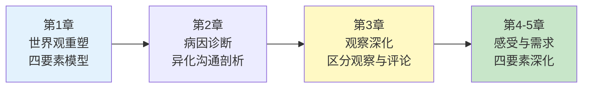
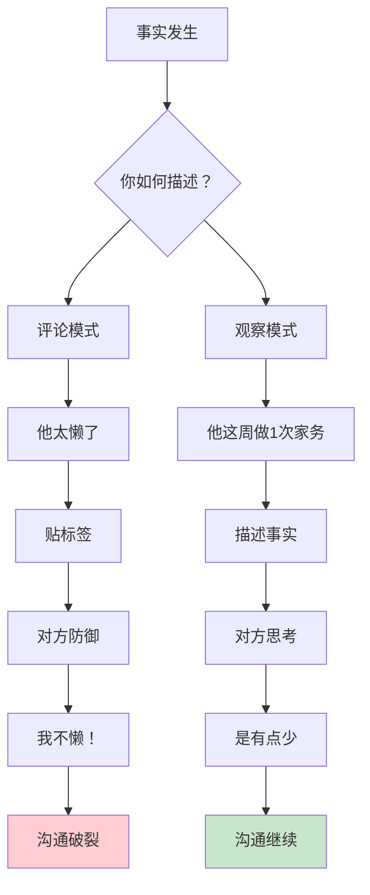
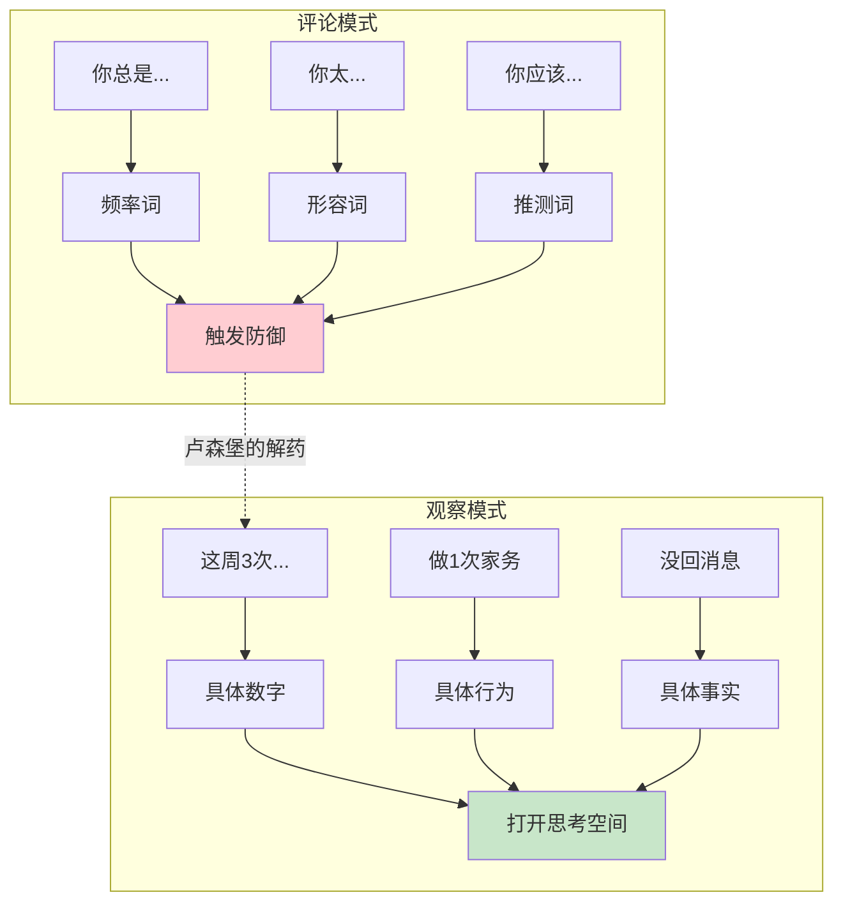
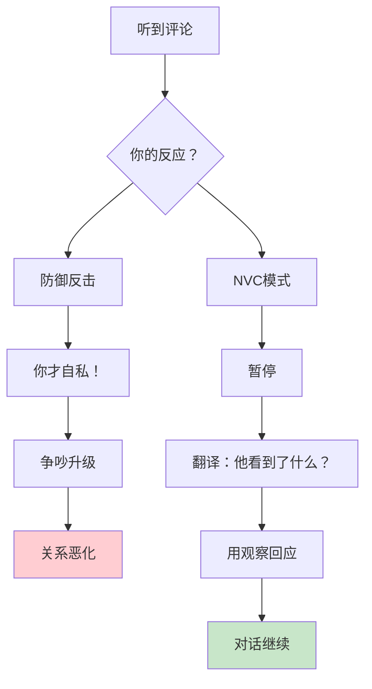
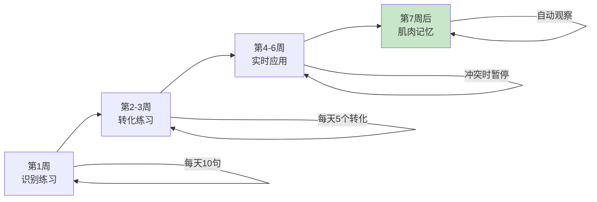
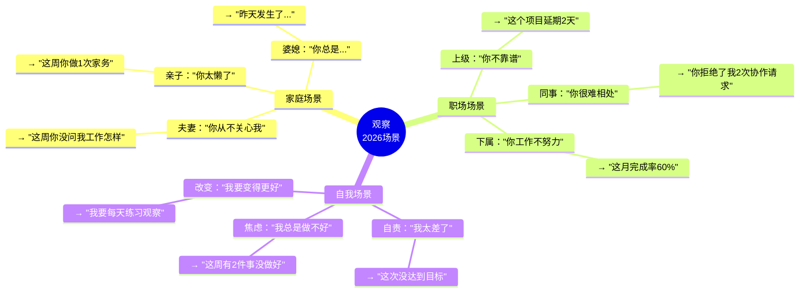
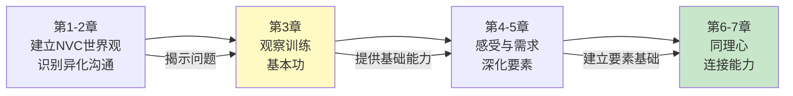

# 第3章：观察

> **章节定位**：NVC的"基本功训练"——学会区分观察与评论，用摄像机视角看见事实，这是建立连接的第一道门槛

---

## 一、章节定位

### 1.1 在全书中的位置



**本章功能**：训练NVC的第一要素——如何不带评判地观察。这是整个NVC体系的入口，没有"观察"的能力，后面的感受、需求、请求都无法落地。

### 1.2 核心主题

| 维度 | 内容 |
|------|------|
| **核心问题** | 为什么我们的"观察"总是带着评判？如何看见事实本身？ |
| **卢森堡答案** | 区分观察与评论，用摄像机视角描述事实 |
| **颠覆观点** | 大部分你以为的"事实"，其实是你的解读 |
| **本章价值** | 教你一项核心能力：把评判翻译成可观察的事实 |

### 1.3 章节关联

| 关联章节 | 关联关系 | 共同逻辑 |
|----------|----------|----------|
| [[第1章-让爱融入生活]] | 前章引入 | 第1章提出"观察"概念，第3章深入训练 |
| [[第2章-是什么蒙蔽了爱]] | 问题承接 | 第2章揭示道德判断，第3章提供解药 |
| [[第4章-感受的力量]] | 后章深化 | 观察是基础，感受是观察后的情绪反应 |

---

## 二、核心观点（三层提取）

### 观点1：观察≠评论——你以为的事实，其实是解读

#### 【表层】现象层

**观察 vs 评论对照表**：

| 你想说的话 | 评论版（❌） | 观察版（✅） |
|----------|------------|------------|
| 他总是迟到 | "他太不守时了" | "这周他迟到了3次" |
| 她工作不努力 | "她很懒" | "她这月完成率60%" |
| 孩子不听话 | "孩子太叛逆了" | "孩子今天说了3次'不'" |
| 伴侣不关心我 | "他不爱我了" | "他这周没问过我工作怎么样" |
| 同事不配合 | "他很难相处" | "他拒绝了2次我的协作请求" |

**评论的5种伪装形式**：

| 伪装形式 | 表现 | 例子 |
|----------|------|------|
| **频率词** | 总是、从不、每次、一直 | "你总是迟到" |
| **形容词** | 懒、自私、冷漠、叛逆 | "你太自私了" |
| **推测词** | 应该、必须、一定、肯定 | "你肯定不在乎" |
| **否定词** | 不、没有、从未 | "你从不关心我" |
| **概括词** | 每次、所有、任何 | "每次都是这样" |

**读者熟悉的场景**：
- "你从来不做家务" → 频率词+否定（全盘否定）
- "你太懒了" → 形容词贴标签（否定整个人）
- "你应该知道我的想法" → 推测词（隐藏期待）
- "每次你都这样" → 概括词（以偏概全）

#### 【中层】机制层



**为什么评论破坏沟通？**

```mermaid
flowchart LR
    A[你评论] --> B[对方听到"评判"]
    B --> C{对方解读}
    C --> D["他在攻击我"]
    C --> E["我不被接纳"]
    D --> F[防御机制启动]
    E --> F
    F --> G[反驳/反击/沉默]
    G --> H[你的需求没被满足]
    
    style H fill:#ffcdd2
```

**为什么观察促进沟通？**

```mermaid
flowchart LR
    A[你观察] --> B[对方听到"事实"]
    B --> C{对方解读}
    C --> D["他在说事实"]
    C --> E["可以讨论"]
    D --> F[思考空间打开]
    E --> F
    F --> G[倾听/思考/回应]
    G --> H[沟通继续]
    
    style H fill:#c8e6c9
```

**评论的三个心理陷阱**：

```
1. 效率错觉：
   "我说'你太懒了'，多省事"
   → 但对方会防御，沟通更耗时

2. 情绪宣泄：
   "我生气了，就要说'你从不...'"
   → 但情绪宣泄不是沟通

3. 习惯思维：
   "我从小被这样说，我也这样对人"
   → 但习惯不等于正确

卢森堡的提醒：
  评论节省了你的时间，
  但它消耗了你们的关系。
```

#### 【底层】规律层

> **观察定律**：评论触发防御，观察打开心门。你能否区分事实与解读，决定了对方是否愿意倾听。

**降维翻译**：
> 你以为你在"描述事实"，
> 卢森堡说：你在"贴标签"。
> 
> "你总是迟到"不是事实，
> "你这周迟到3次"才是事实。
> 
> 事实是摄像机能拍到的，
> 评论是你的脑补。
> 
> **关键：区分事实与解读，是NVC的第一步。**

#### 【当下连接】2026热点

|----------|----------|----------|
| 为什么伴侣越说我越不听？ | 你在评论，不是观察 | "原来我在被评判" |
| 为什么孩子总和我对抗？ | 你在贴标签，不是说事实 | "原来评判制造叛逆" |
| 为什么员工抵触反馈？ | 你在用形容词，不是数据 | "原来职业化就是会观察" |
| 为什么每次沟通都变成吵架？ | 你在表达解读，不是事实 | "原来观察能减少冲突" |

---

### 观点2：观察的关键技巧——用具体替代抽象

#### 【表层】现象层

**评论→观察的5种转化技巧**：

| 技巧 | 评论版 | 观察版 | 转化方法 |
|------|--------|--------|----------|
| **数字替代频率** | "你总是迟到" | "你这周迟到3次" | 具体化频率 |
| **行为替代形容词** | "你太懒了" | "你这周做1次家务" | 具体化行为 |
| **事实替代推测** | "你肯定不在乎" | "你没回我消息" | 具体化证据 |
| **场景替代概括** | "每次都这样" | "昨天和今天发生了..." | 具体化场景 |
| **"我看到"开头** | "你不关心我" | "我看到你没问我今天怎样" | 主观视角声明 |

**印度哲学家克里希那穆提的观察**：
> "不带评判的观察，是人类最高智慧的表现。"

**诗歌《观察》**：
```
我从未见过懒惰的人；
我见过
有个人有时在床上睡到上午11点，
在他不做任何事的日子，
但说他是个懒惰的人，不是观察。
我见过
一个孩子没有按我要求的那样做事，
但他不是个叛逆的孩子，
请帮帮我，告诉我你看到了什么。
——鲁思·贝本梅尔
```

#### 【中层】机制层



**观察的心理机制**：

```
评论 = 我对你下定义
     = 我占据道德高地
     = 我说你"是"什么样的人

观察 = 我看见发生了什么
     = 我保持开放态度
     = 我说"发生"了什么事

核心区别：
  评论把人"定型"
  观察让对话"流动"
```

**为什么"我看到"开头有效？**

```mermaid
flowchart LR
    A["你不关心我"] --> B[对方听到"指控"]
    B --> C[防御启动]
    C --> D[沟通破裂]
    
    E["我看到你没问我今天怎样"] --> F[对方听到"事实"]
    F --> G[思考空间]
    G --> H[沟通继续]
    
    style D fill:#ffcdd2
    style H fill:#c8e6c9
```

#### 【底层】规律层

> **具体化定律**：评论用抽象词汇，观察用具体描述。你的描述越具体，对方的防御越少，对话空间越大。

**降维翻译**：
> 你以为"你太懒了"是在说事实，
> 卢森堡说：那是你的评论。
> 
> 事实是："你这周做1次家务"
> 评论是："你太懒了"
> 
> 评论省事，但切断连接。
> 观察费事，但打开心门。
> 
> **关键：用具体替代抽象，评论变观察。**

#### 【当下连接】2026热点

|----------|----------|----------|
| 怎么给孩子反馈成绩？ | 说"这次70分"，不说"你太差了" | "原来具体化保护自尊" |
| 怎么和伴侣谈家务？ | 说"这周做1次"，不说"你从不做" | "原来观察减少对抗" |
| 怎么评价同事表现？ | 用数据，不用"不靠谱" | "原来职业化就是会观察" |
| 怎么让父母理解我？ | 说具体事件，不概括"你们从不" | "原来观察让沟通变简单" |

---

### 观点3：观察的练习——从评论者到观察者

#### 【表层】现象层

**观察练习的三个层级**：

| 层级 | 能力 | 练习方法 |
|------|------|----------|
| **识别** | 能区分评论与观察 | 阅读句子，判断是评论还是观察 |
| **转化** | 能把评论转化为观察 | 把"你太懒了"翻译成观察 |
| **实时** | 能在对话中运用观察 | 冲突时先观察，再表达 |

**经典练习示例**：

| 原句 | 识别 | 观察版 |
|------|------|--------|
| "你总是打断我" | 评论（频率词） | "你在我说话时插了3次话" |
| "你从不关心我" | 评论（否定词） | "你这周没问过我工作怎么样" |
| "你太自私了" | 评论（形容词） | "你没问我就做了决定" |
| "每次都是这样" | 评论（概括词） | "昨天和今天发生了类似的事" |

**卢森堡的观察训练法**：
```
第一步：听到评论时，暂停
第二步：问自己"他看到了什么事实？"
第三步：用观察重新表述
```

#### 【中层】机制层



**从评论者到观察者的心理转变**：

```
评论者的心态：
  我是对的，你是错的
  我有资格评判你
  我要改变你

观察者的心态：
  我看见发生了什么
  我不知道你的全部
  我想理解你

转变的关键：
  从"我是对的"
  到"我看见了什么"

评论者创造对立，
观察者创造对话。
```

**观察的肌肉记忆训练**：



#### 【底层】规律层

> **观察者定律**：观察是一种能力，需要刻意练习。从评论者到观察者，不是态度转变，而是能力升级。

**降维翻译**：
> 观察不是态度，
> 观察是能力。
> 
> 你不是"不想观察"，
> 你是"不会观察"。
> 
> 就像开车、游泳、弹钢琴，
> 观察需要刻意练习。
> 
> 练习方法：
> 1. 识别：这句是评论还是观察？
> 2. 转化：把评论翻译成观察
> 3. 实时：冲突时先观察，再表达
> 
> **关键：观察是能力，能力需要练习。**

#### 【当下连接】2026热点

|----------|----------|----------|
| 我知道要观察，但就是做不到 | 观察是能力，需要刻意练习 | "原来我需要训练" |
| 练习多久能看到效果？ | 4-6周建立基本能力 | "有明确时间预期" |
| 怎么在冲突时记得观察？ | 先学会"暂停"，再练习观察 | "原来有方法" |
| 练习观察会让我变成机器人吗？ | 观察让你更精准，不是更冷漠 | "原来观察提升表达" |

---

## 三、金句库

### 原书金句（10句）

**【观察的本质】**
1. "不带评判的观察是人类最高智慧的表现。"——克里希那穆提
2. "观察是摄像机能拍到的东西。"
3. "评论是你的脑补，观察是事实本身。"

**【评论的危害】**
4. "评论触发防御，观察打开心门。"
5. "大部分你以为的'事实'，其实是你的解读。"
6. "你能否区分事实与解读，决定了对方是否愿意倾听。"

**【观察的技巧】**
7. "用数字代替频率词，用行为代替形容词。"
8. "'我看到'开头，声明你的主观视角。"
9. "你的描述越具体，对方的防御越少。"

**【观察的价值】**
10. "观察是NVC的入口，没有观察，后面的感受、需求、请求都无法落地。"

---

### 降维金句（15句）

**【观察vs评论·生活版】**
1. **"你总是迟到"不是观察，"你这周迟到3次"才是——评判触发防御，事实打开心门。**
2. **"你太懒了"不是事实，是你贴的标签——事实是"你这周做1次家务"。**
3. **评论用形容词，观察用行为——形容词定人格，行为可讨论。**
4. **"每次都这样"是概括，"昨天和今天发生了..."是观察——概括制造对立，具体打开对话。**
5. **"你不关心我"是指控，"我看到你没问我今天怎样"是观察——指控制造防御，观察邀请回应。**

**【观察技巧·实践版】**
6. **观察的关键：用数字替代频率词，用行为替代形容词。**
7. **"我看到/听到"开头——声明这是你的视角，不是绝对真理。**
8. **事实是摄像机能拍到的，评论是你的脑补——区分两者，NVC开始。**
9. **你的描述越具体，对方的防御越少——具体化是观察的核心。**
10. **评论节省时间，观察建立连接——你选哪个？**

**【观察能力·清醒版】**
11. **观察不是态度，观察是能力——需要刻意练习。**
12. **你不是"不想观察"，你是"不会观察"——接受这点，练习开始。**
13. **从评论者到观察者，4-6周建立基本能力——有明确预期。**
14. **观察让你更精准，不是更冷漠——精准是表达力，不是无情。**
15. **观察是NVC的入口——没有观察，后面的感受、需求、请求都是空中楼阁。**

---

## 四、当下映射

### 2026年读者痛点连接

|------|-------------|--------------|----------|
| **夫妻冷战** | 你在评论，不是观察 | 用具体事实代替形容词 | "原来我在攻击，不是表达" |
| **孩子叛逆** | 你在贴标签，不是说事实 | "这次考70分"代替"你太差了" | "原来评判伤害自尊" |
| **职场冲突** | 你用形容词评价，不用数据 | 用"完成率60%"代替"不靠谱" | "原来职业化就是会观察" |
| **无效沟通** | 你在表达解读，不是事实 | "这周做1次"代替"你从不做" | "原来观察减少对抗" |

### 三大场景深度连接



**第3章的解药**：
- **家庭场景** → 用具体替代概括，减少防御
- **职场场景** → 用数据替代形容词，提升职业度
- **自我场景** → 用观察替代自责，减少内耗

---

## 五、章节关联

### 与前后章节的关联

| 概念 | 第1-2章引入 | 第3章深化 | 后续应用 |
|------|----------|----------|----------|
| 观察 | 四要素之一 | 如何区分观察与评论 | 全书持续应用 |
| 评判 | 异化沟通的核心形态 | 为什么评判切断连接 | 第4章：感受来自对观察的解读 |
| 具体 | 请求必须具体 | 观察也必须具体 | 第5章：请求的艺术 |
| 摄像机视角 | 提到"观察"概念 | 深入训练摄像机视角 | 第6章：同理心倾听也用观察 |

### 与主拆解记录的关联



---

## 六、问答设计

### Q1：观察不就是说实话吗？为什么要这么复杂？

**读者困惑**："我说'你太懒了'就是实话啊，为什么说我在评论？"

**NVC解答（观察版）**：
> "你太懒了"不是观察，是评论。
> 
> 观察是摄像机能拍到的：
> - "你这周做1次家务"（具体行为）
> - "你的房间3天没整理"（具体状态）
> - "你今天10点才起床"（具体时间）
> 
> "懒"是你给行为贴的标签，
> 不是行为本身。
> 
> **观察是看见行为，评论是定义人格。**

**降维翻译**：
> 观察不是说实话，
> 观察是说"摄像机能拍到的东西"。
> 
> "你太懒了"是实话吗？
> 那是你对行为的主观判断。
> 
> "你这周做1次家务"是观察吗？
> 是的，因为摄像机能拍到。
> 
> 区分观察与评论，
> 就是区分"事实"与"你的判断"。

---

### Q2：观察和评论的界限在哪里？这不是很主观吗？

**读者困惑**："你说'你太懒了'是评论，那我说'你做家务很少'算观察还是评论？"

**NVC解答（边界版）**：
> 观察和评论有清晰的边界：
> 
> **观察**：具体、可验证、无评判
> - "这周做1次家务" → 可验证
> - "今天9:15到" → 可验证
> - "这月完成60%" → 可验证
> 
> **评论**：抽象、主观、带评判
> - "很少" → 多少算少？主观
> - "太懒" → 什么是懒？主观
> - "不靠谱" → 什么是靠谱？主观
> 
> **边界检验法**：摄像机能拍到吗？
> - 能 → 观察
> - 不能 → 评论
> 
> **关键：观察是客观事实，评论是主观解读。**

**降维翻译**：
> 边界很简单：摄像机能拍到吗？
> 
> "做1次家务" → 摄像机能拍到 → 观察
> "做家务很少" → "很少"是主观判断 → 评论
> 
> 如果你说的是摄像机能拍到的，
> 你就在观察。
> 
> 如果你用了形容词、频率词、推测词，
> 你很可能在评论。

---

### Q3：如果事实本身就是负面的，观察不就是"说难听话"吗？

**读者困惑**："对方做错事，我说事实，他还是会不高兴啊。"

**NVC解答（观察vs批评版）**：
> 观察不是"说难听话"，
> 观察是"让事实被看见"。
> 
> 批评：你太不负责任了！
> 观察：你延期了2天交报告。
> 
> 批评触发防御：
> "我不负责任？你才..."
> 
> 观察打开对话：
> "是延期了，因为..."
> 
> **观察不是为了让对方高兴，**
> **观察是为了让对话继续。**
> 
> 如果你只说事实，对方还是防御，
> 那问题不在观察，
> 在你们的关系已经受损。

**降维翻译**：
> 观察不是让对方高兴，
> 观察是让对话继续。
> 
> 你说"你延期2天"（观察），
> 对方可能还是不高兴。
> 
> 但至少：
> - 他没有听到"你太不负责任了"（评论）
> - 他有机会解释原因
> - 对话没有变成争吵
> 
> 观察不能保证对方高兴，
> 但观察能保证对话不破裂。

---

### Q4：观察会不会让我变得很冷漠、很机械？

**读者困惑**："总是说'这周做1次家务'，感觉像机器人，没有感情了。"

**NVC解答（温度版）**：
> 观察不是让你变冷漠，
> 观察是让你的情绪更精准地被表达。
> 
> NVC的四要素：
> 1. 观察：看见事实
> 2. 感受：表达情绪 ← 这里有感情！
> 3. 需求：揭示根源
> 4. 请求：提出行动
> 
> 观察只是第一步，
> 后面还有感受、需求、请求。
> 
> 完整的NVC表达：
> "你这周做1次家务（观察），我感到有些累（感受），我需要分担（需求），你能每周做3次吗？（请求）"
> 
> 你看，这不是机器人，
> 这是更精准地表达感情。

**降维翻译**：
> 观察不会让你变冷漠，
> 观察会让你的表达更精准。
> 
> 传统表达：
> "你太懒了！"（只有情绪）
> 
> NVC表达：
> 观察："你这周做1次家务"
> 感受："我感到有些累"
> 需求："我需要分担"
> 请求："你能每周做3次吗？"
> 
> 哪个更有感情？
> NVC表达更完整，更精准，更有力量。
> 
> 观察不是冷漠，
> 观察是让你的感情有落脚点。

---

## 七、实践练习

### 72小时微应用

**练习1：评论vs观察识别**
```
阅读以下句子，判断是评论（C）还是观察（O）：

1. "你总是迟到" → ____
2. "你这周迟到3次" → ____
3. "你太自私了" → ____
4. "你没问我今天怎样" → ____
5. "你从不关心我" → ____
6. "他这月完成率60%" → ____
7. "孩子太叛逆了" → ____
8. "孩子今天说了3次'不'" → ____

答案：C O C O C O C O
```

**练习2：评论→观察转化**
```
把你最近的3个评论转化为观察：

评论1："________________"
观察版："________________"

评论2："________________"
观察版："________________"

评论3："________________"
观察版："________________"

转化技巧：
- 用数字替代频率词
- 用行为替代形容词
- 用事实替代推测
```

**练习3：摄像机测试**
```
你最近想说的一句话是：
"________________"

问自己：摄像机能拍到吗？
→ 能 → 这是观察
→ 不能 → 这是评论

如果是评论，转化为观察：
"________________"
```

### 检索测试（闭书自测）

```
□ 能否说出观察与评论的3个区别？
□ 能否识别评论的5种伪装形式？
□ 能否把"你总是迟到"转化为观察？
□ 能否解释为什么评论触发防御？
□ 能否说出"摄像机测试"的方法？
□ 能否说出观察是NVC的入口？
```

---

## 八、章节金句卡片

### 核心金句（可直接制图）

1. **"不带评判的观察，是人类最高智慧的表现。"——克里希那穆提**

2. **"你总是迟到"不是观察，"你这周迟到3次"才是——评判触发防御，事实打开心门。**

3. **事实是摄像机能拍到的，评论是你的脑补——区分两者，NVC开始。**

4. **观察不是态度，是能力——需要4-6周刻意练习。**

5. **评论节省时间，观察建立连接——你选哪个？**

---
