# 第5章：感受的根源

> **章节定位**：NVC的"需求觉醒"——理解感受的真正来源不是他人的行为，而是我们如何看待自己的需要。这是从"受害者心态"到"自我负责"的关键转折点。

---

## 一、章节定位

### 1.1 在全书中的位置

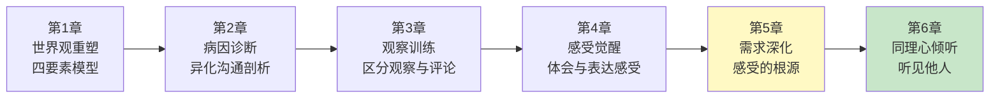

**本章功能**：揭示感受的真正来源——不是"你让我..."，而是"我需要..."。这是NVC的核心转折点，从归咎他人转向自我负责。

### 1.2 核心主题

| 维度 | 内容 |
|------|------|
| **核心问题** | 为什么别人一句话能让我难过一整天？感受的真正来源是什么？ |
| **卢森堡答案** | 感受源于我们如何看待自己的需要，而非他人的言行 |
| **颠覆观点** | "你让我生气"是谎言——生气是因为我需要被尊重，不是因为你说了什么 |
| **本章价值** | 教你从"受害者"变成"自我负责者"——情绪的主人 |

### 1.3 章节关联

| 关联章节 | 关联关系 | 共同逻辑 |
|----------|----------|----------|
| [[第4章-体会和表达感受]] | 前章基础 | 感受是信号灯，本章回答"信号灯为什么亮" |
| [[第1章-哈吉斯]] | 后章延伸 | 理解自己的需求，才能听懂他人的需求 |
| [[第1章-哈吉斯]] | 纵向深化 | 需求是自我同理的核心对象 |

---

## 二、核心观点（三层提取）

### 观点1：感受的根源——不是"你让我"，而是"我需要"

#### 【表层】现象层

**三种听"不中听话"的方式**：

| 方式 | 表现 | 后果 |
|------|------|------|
| **归咎自己** | "都是我的错" | 内疚、自责、自我否定 |
| **指责对方** | "都是你的错" | 愤怒、攻击、关系破裂 |
| **体会自己** | "我什么需求没被满足？" | 理解、清晰、有机会解决 |
| **体会对方** | "他什么需求没被满足？" | 同理、连接、理解他人 |

**读者熟悉的场景**：

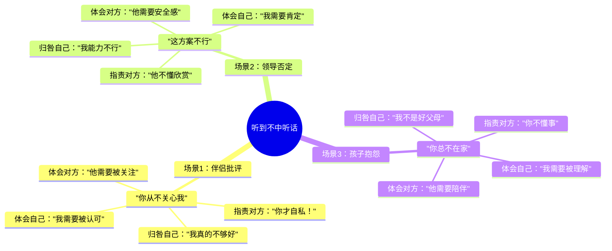

**卢森堡的核心区分**：

| 错误认知 | 正确认知 |
|----------|----------|
| "你让我生气" | "我感到生气，因为我需要被尊重" |
| "这件事让我很难过" | "我感到难过，因为我需要理解" |
| "他伤害了我" | "我感到受伤，因为我需要被关心" |

#### 【中层】机制层

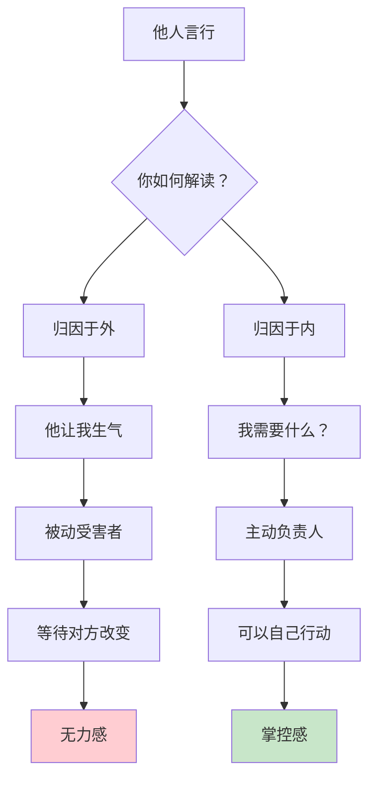

**感受-需求链条**：

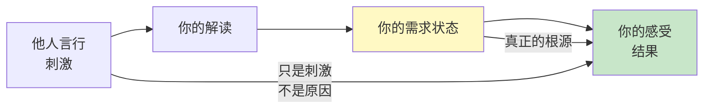

**为什么"你让我"是谎言？**

```
"你让我生气"的逻辑漏洞：

同一件事：
  甲听到 → 生气
  乙听到 → 无所谓
  丙听到 → 好笑

如果"你让我生气"是真的，
那甲乙丙应该都生气。
为什么反应不同？
→ 因为需求不同。

甲需要被尊重 → 听到批评 → 生气
乙不需要认可 → 听到批评 → 无所谓
丙需要幽默感 → 听到批评 → 好笑

同样的刺激，不同的需求，
产生不同的感受。
→ 感受的根源是需求，不是刺激。
```

**情绪责任的核心公式**：

```
错误公式：他人行为 = 我的感受
正确公式：他人行为 + 我的需求状态 = 我的感受

简化版：
  刺激 + 需求 = 感受
  
卢森堡的提醒：
  我们无法控制刺激，
  但我们可以觉察需求。
  觉察需求，
  就能理解感受。
```

#### 【底层】规律层

> **需求定律**：感受是需求是否被满足的信号。他人的言行只是刺激，你的需求状态才是感受的真正根源。

**降维翻译**：
> 你以为"他让我生气"是事实，
> 卢森堡说：那是认知的陷阱。
> 
> 同样一句话——
> 你生气，因为你需要被尊重；
> 他无感，因为他不在乎这事；
> 我好笑，因为我觉得这荒谬。
> 
> 同样的刺激，不同的需求，产生不同的感受。
> 
> **关键：情绪的责任人是你自己，不是他人。**

#### 【当下连接】2026热点

|----------|----------|----------|
| 为什么伴侣一句话能毁我一天？ | 你的需求在等他满足，你在等，不是在负责 | "原来我在等救世主" |
| 为什么同样的事，别人不生气？ | 他们的需求和你不同 | "原来需求因人而异" |
| 我能控制自己的情绪吗？ | 你不能控制刺激，但可以觉察需求 | "原来我有选择" |
| 为什么我总被情绪绑架？ | 你把情绪的遥控器交给了别人 | "原来我在给别人控制权" |

---

### 观点2：人类共同的基本需求——感受的"真名"

#### 【表层】现象层

**NVC的核心需求清单**：

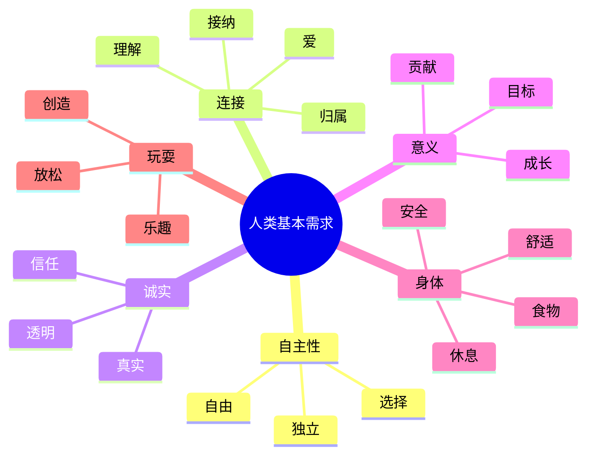

**需求 vs 想法/策略对照表**：

|------|----------------|------------|
| "我要你道歉" | 策略：让对方做某事 | 需求：被尊重、被理解 |
| "我要你陪我" | 策略：让对方做某事 | 需求：连接、陪伴 |
| "我要升职" | 策略：获得某个职位 | 需求：成长、认可、安全感 |
| "我要你改" | 策略：改变对方 | 需求：被理解、被尊重 |

**区分需求与策略的关键**：

```
需求是"什么"——抽象、普遍
  → 被理解、被尊重、安全感、连接

策略是"怎么做"——具体、特定
  → 你道歉、你陪我、升职、你改

检验方法：
  问自己："我真正想要的是什么？"
  如果答案还是"他要..."，继续问。
  直到答案是抽象的、指向自己的。
```

#### 【中层】机制层

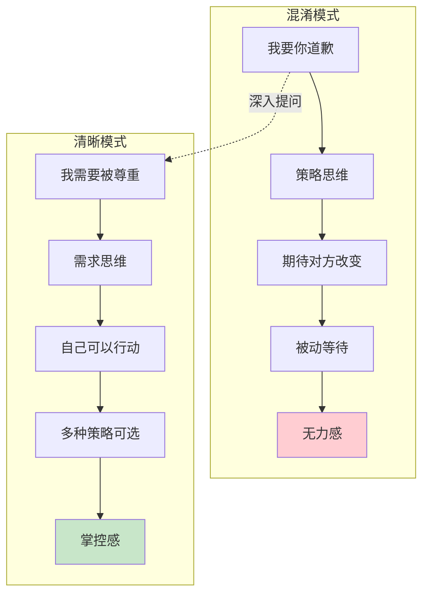

**需求识别的三个层次**：

```
第一层：行为层（最表面）
  "他要道歉" → 这是策略

第二层：感受层
  "我感到受伤" → 这是信号

第三层：需求层（最核心）
  "我需要被尊重" → 这是根源

NVC的追问路径：
  他做了什么？→ 观察
  你什么感受？→ 感受
  你需要什么？→ 需求
  怎么满足？→ 请求
```

**需求的"足够少"原则**：

```mermaid
flowchart LR
    A[看似无限的<br/>具体要求] --> B[追问"为什么"]
    B --> C[发现背后的<br/>共同需求]
    C --> D[人类基本需求<br/>约7-9类]
    
    D --> E[自主性]
    D --> F[连接]
    D --> G[诚实]
    D --> H[意义]
    D --> I[身体]
    D --> J[玩耍]
    
    style D fill:#fff9c4
```

**需求是"足够少"的**：

```
表面上千变万化的要求：
  我要你道歉
  我要你按时回家
  我要你多关心我
  我要你不要这样说话
  ...

背后可能都是同一个需求：
  被尊重
  被理解
  连接
  安全感

识别需求，
就是把无限的问题，
归纳为有限的需求。
然后针对需求，
设计策略。
```

#### 【底层】规律层

> **需求抽象定律**：需求是抽象的、普遍的，策略是具体的、特定的。当你能把"他要..."翻译成"我需要..."，你就找到了感受的根源。

**降维翻译**：
> "我要你道歉"不是需求，
> "我要你陪我"不是需求，
> "我要你改"不是需求。
> 
> 这些是策略，是"怎么做"。
> 
> 需求是"被尊重"、"被理解"、"连接"——
> 抽象的、普遍的、指向自己的。
> 
> 识别需求的方法：
> 问自己"我真正想要什么？"
> 答案如果是"他要..."，继续问。
> 直到答案是抽象的、指向自己的。
> 
> **关键：需求是"什么"，策略是"怎么做"。**

#### 【当下连接】2026热点

|----------|----------|----------|
| 为什么我的要求总被拒绝？ | 你在要策略，不是要需求 | "原来我一直在要错东西" |
| 怎么知道自己真正要什么？ | 把"他要..."翻译成"我需要..." | "原来需要翻译" |
| 需求和想要有什么区别？ | 需求是抽象的，想要是具体的策略 | "原来不是一回事" |
| 为什么知道需求这么重要？ | 需求是感受的根源，也是解决的入口 | "原来这是入口" |

---

### 观点3：情绪负责——从"受害者"到"自我负责者"

#### 【表层】现象层

**受害者 vs 负责者的对话模式**：

| 场景 | 受害者模式 | 负责者模式 |
|------|------------|------------|
| 伴侣批评 | "你让我太难受了！" | "听到这话，我感到受伤，因为我需要被尊重" |
| 领导否定 | "他总是针对我" | "我感到挫败，因为我需要认可" |
| 孩子抱怨 | "这孩子让我操碎了心" | "我感到疲惫，因为我需要支持" |
| 朋友冷落 | "他不在乎我" | "我感到孤单，因为我需要连接" |

**卢森堡的转变公式**：

```
受害者语言：
  "你让我..."
  "这件事让我..."
  "他伤害了我..."
  → 被动、无力、等待

负责者语言：
  "我感到...，因为我需要..."
  → 主动、清晰、可以行动

转变步骤：
  1. 停止说"你让我"
  2. 问自己"我什么感受？"
  3. 问自己"我需要什么？"
  4. 表达："我感到...，因为我需要..."
```

**读者熟悉的内心独白**：

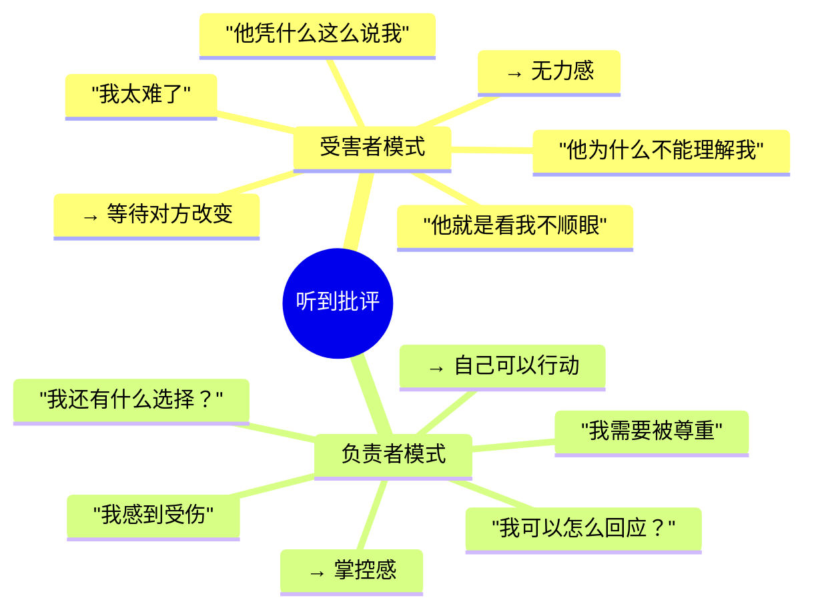

#### 【中层】机制层

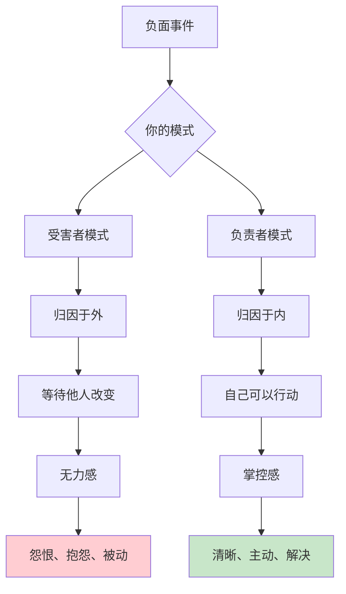

**为什么"你让我"会上瘾？**

```
"你让我生气"的心理收益：
1. 道德高地：你是错的，我是对的
2. 免责声明：不是我的问题，是你的问题
3. 期待改变：你应该改，不是我改
4. 自我保护：我很受伤，你是坏人

代价：
1. 把控制权交给别人
2. 等待别人改变（可能永远不会）
3. 持续的无力感
4. 关系越来越差

"我需要..."的心理收益：
1. 收回控制权
2. 自己可以行动
3. 清晰、主动
4. 关系有改善可能

挑战：
1. 承认自己有需求（脆弱）
2. 需要自我觉察（练习）
3. 承担责任（不习惯）
```

**情绪负责的心理转变图**：

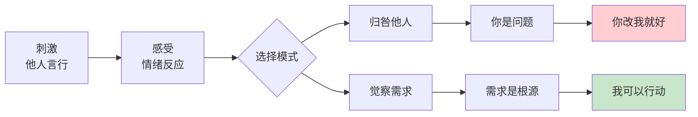

#### 【底层】规律层

> **责任定律**：你不是他人言行的受害者，你是自己情绪的负责人。当你把"你让我..."改成"我感到...因为我需要..."，你就从被动者变成了主动者。

**降维翻译**：
> "你让我生气"是世上最危险的话。
> 它把情绪的遥控器交给了别人。
> 
> 别人按一下，你就生气；
> 别人不按，你就等着。
> 
> "我感到生气，因为我需要被尊重"——
> 这句话收回遥控器。
> 
> 感受是我的，
> 需求是我的，
> 行动也可以是我的。
> 
> **关键：情绪的责任人是你自己，收回遥控器。**

#### 【当下连接】2026热点

|----------|----------|----------|
| 为什么我总被别人影响情绪？ | 你把情绪遥控器交给了别人 | "原来是我交出去的" |
| 怎么才能不被别人伤害？ | 收回情绪责任，觉察自己的需求 | "原来我有选择" |
| 承担情绪责任会不会太累？ | 被动等待更累，而且无效 | "原来现在才累" |
| 这是不是在为别人开脱？ | 承担责任≠认可行为，是为自己的感受负责 | "原来两回事" |

---

## 三、金句库

### 原书金句（10句）

**【感受的根源】**
1. "感受的根源在于我们如何看待自己的需要。"
2. "他人的言行也许和我们的感受有关，但不是感受的根源。"
3. "听到不中听的话，我们有四种选择：归咎自己、指责对方、体会自己、体会对方。"

**【需求vs策略】**
4. "批评往往暗含着期待。对他人的批评，实际上表达了我们尚未满足的需要。"
5. "如果我们通过批评来表达需要，人们往往会自卫或反击。"
6. "直接说出需要，比批评更可能得到积极的回应。"

**【情绪责任】**
7. "我们对自己的意愿、感受和行为负有完全的责任。"
8. "别人无法让我们感受任何东西——是我们自己选择了感受。"
9. "当我们为自己的感受负责时，我们就有能力改变它们。"

**【需求的普遍性】**
10. "人类有一些共同的基本需要，这些需要是感受的根源。"

---

### 降维金句（15句）

**【感受根源·生活版】**
1. **"你让我生气"是谎言——生气是因为我需要被尊重，不是因为你说了什么。**
2. **同样一句话，你生气他不生气——因为你们的需求不同。感受的根源是需求，不是刺激。**
3. **情绪的遥控器在你自己手里，只是你习惯性交给别人。**
4. **"他伤害了我"不是事实——"我感到受伤，因为我需要被关心"才是事实。**
5. **刺激只是火花，需求才是干柴——没有干柴，火花点不着火。**

**【需求vs策略·实践版】**
6. **"我要你道歉"不是需求，是策略——"我需要被尊重"才是需求。**
7. **需求是"什么"——被理解、被尊重、连接；策略是"怎么做"——你道歉、你陪我、你改。**
8. **识别需求的方法：把"他要..."翻译成"我需要..."——答案会变。**
9. **表面上千变万化的要求，背后可能都是同一个需求——被理解。**
10. **需求是"足够少"的——约7-9类，策略是无限的。**

**【情绪责任·清醒版】**
11. **受害者说"你让我..."，负责者说"我感到...因为我需要..."——一字之差，天壤之别。**
12. **承担情绪责任不是为别人开脱，是收回自己的控制权。**
13. **"你让我生气"的代价：把遥控器交给别人，等别人改变（可能永远不会）。**
14. **"我需要..."的收益：收回遥控器，自己可以行动。**
15. **你不是他人言行的受害者，你是自己情绪的负责人。**

---

## 四、当下映射

### 2026年读者痛点连接

|------|-------------|--------------|----------|
| **情绪总被他人左右** | 你把情绪遥控器交给了别人 | 收回责任，觉察需求 | "原来是我交出去的" |
| **不知道自己要什么** | 混淆需求和策略 | 把"他要..."翻译成"我需要..." | "原来需要翻译" |
| **总觉得自己是受害者** | 归因于外，等待改变 | 归因于内，自己可以行动 | "原来我可以改变" |
| **要求总被拒绝** | 在要策略，不是要需求 | 说出需求，设计多种策略 | "原来我一直在要错东西" |

### 三大场景深度连接

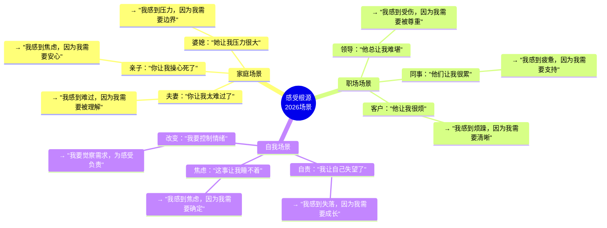

**第5章的解药**：
- **家庭场景** → 把"你让我..."改成"我感到...因为我需要..."
- **职场场景** → 识别情绪背后的需求，而非归咎他人
- **自我场景** → 收回情绪责任，做自己感受的主人

---

## 五、章节关联

### 与前后章节的关联

| 概念 | 第4章基础 | 第5章深化 | 后续应用 |
|------|----------|----------|----------|
| 感受 | 识别和表达感受 | 感受的根源是需求 | 全书持续应用 |
| 需求 | 四要素之一 | 需求vs策略、情绪责任 | 第6章：听懂他人需求 |
| 责任 | 未涉及 | 情绪的自我负责 | 第7章：自我同理 |
| 归因 | 未涉及 | 从归咎到负责 | 第8章：愤怒的处理 |

### 与主拆解记录的关联

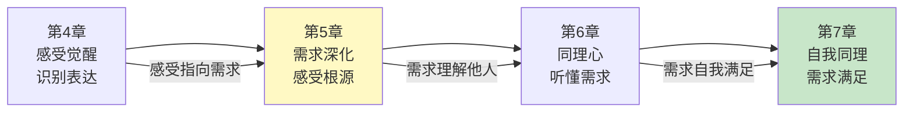

---

## 六、问答设计

### Q1：感受真的是因为需求，不是因为别人吗？

**读者困惑**："明明是他说的那句话让我生气，怎么变成我的需求问题了？"

**NVC解答（区分版）**：
> 他说的话是**刺激**，你的需求是**根源**。
> 
> 举个例子：
> 他说"这方案不行"
> - 你需要认可 → 你感到挫败
> - 你需要成长 → 你感到好奇（哪里不行？）
> - 你不需要他认可 → 你无所谓
> 
> 同样的刺激，不同的需求，产生不同的感受。
> 
> 如果刺激是根源，那听到同样的话，所有人应该有同样的感受。
> 但事实不是——有人生气，有人无感，有人好奇。
> 
> **关键：刺激是火花，需求是干柴。没有干柴，火花点不着火。**

**降维翻译**：
> 他说的那句话是火花，
> 你的需求是干柴。
> 
> 没有干柴，火花点不着火。
> 
> 你需要被尊重 → 听到批评 → 生气
> 他不需要认可 → 听到批评 → 无所谓
> 
> 同样的火花，不同的干柴，
> 产生不同的火。
> 
> **关键：火花（刺激）+ 干柴（需求）= 火（感受）。**

---

### Q2：需求和想要有什么区别？

**读者困惑**："我想要他道歉，这不就是需求吗？"

**NVC解答（区分版）**：
> "我想要他道歉"不是需求，是**策略**。
> 
> **需求**是抽象的、普遍的：
> - 被尊重
> - 被理解
> - 被关心
> 
> **策略**是具体的、特定的：
> - 他道歉
> - 他改变态度
> - 他承认错误
> 
> 同一个需求（被尊重），可以有多种策略：
> - 他道歉
> - 他解释原因
> - 他改变沟通方式
> - 你选择不在乎
> - 你自己获得尊重（不依赖他）
> 
> **检验方法**：需求指向自己，策略指向他人。

**降维翻译**：
> "我要他道歉"是策略——具体、指向他人。
> "我需要被尊重"是需求——抽象、指向自己。
> 
> 同一个需求，可以有多种策略：
> - 他道歉（策略1）
> - 他解释（策略2）
> - 你不在乎（策略3）
> - 你自己认可自己（策略4）
> 
> 识别需求，就是打开策略的可能性。
> 只盯着一个策略，就把自己困住了。
> 
> **关键：需求是"什么"，策略是"怎么做"。**

---

### Q3：承担情绪责任是不是在为别人开脱？

**读者困惑**："明明是他做错了，为什么变成我的问题了？"

**NVC解答（区分版）**：
> 承担情绪责任 ≠ 认可对方行为。
> 
> 两件事要分开：
> 1. 他的行为是否恰当？（可以讨论）
> 2. 我的感受是谁负责？（我自己）
> 
> 你可以说：
> "你的说话方式让我感到受伤，因为我需要被尊重。
> 我希望我们能用更尊重的方式沟通。"
> 
> 这句话同时做到：
> - 承认自己的感受和需求（负责）
> - 指出对方行为的影响（不认可）
> - 提出改变的请求（主动）
> 
> **关键：负责是收回控制权，不是放弃立场。**

**降维翻译**：
> 承担情绪责任，不是说他做对了。
> 是说：
> - 他的行为可以讨论
> - 但我的感受我自己负责
> 
> "你让我生气" → 等他改（被动）
> "我感到生气，我需要被尊重" → 我可以行动（主动）
> 
> 两者区别：
> - 前者：把遥控器交给他
> - 后者：收回遥控器
> 
> 收回遥控器 ≠ 认可他的行为。
> 收回遥控器 = 我可以自己选择怎么回应。
> 
> **关键：负责是收回控制权，不是放弃立场。**

---

### Q4：怎么找到自己的需求？

**读者困惑**："我确实不知道自己需要什么，怎么办？"

**NVC解答（找不到版）**：
> 找不到需求，是很正常的。
> 我们从小被教"你要什么"，很少被问"你需要什么"。
> 
> **找需求的方法**：
> 
> 1. 从感受反推
>    - 感受：愤怒 → 可能需要被尊重
>    - 感受：失落 → 可能需要被关心
>    - 感受：焦虑 → 可能需要安全感
> 
> 2. 用需求清单对照
>    - 看着NVC的需求清单
>    - 问自己：哪个最触动了？
> 
> 3. 问"为什么"
>    - "我要他道歉"
>    - → 为什么？→ 我想让他承认错误
>    - → 为什么？→ 我希望被尊重
>    - → 需求：被尊重
> 
> 4. 允许自己模糊
>    - "我需要...被理解？"
>    - 先说出来，再慢慢精准

**降维翻译**：
> 找不到需求，不是你的问题，
> 是你从小没被问过。
> 
> 方法：
> 1. 从感受反推（愤怒→被尊重，失落→被关心）
> 2. 看需求清单，找最触动的
> 3. 问"为什么"（"我要道歉"→"想被承认"→"被尊重"）
> 4. 允许模糊，慢慢精准
> 
> 找需求是能力，
> 能力可以学习。
> 
> 从今天开始，
> 每次有强烈情绪，
> 问自己："我需要什么？"

---

## 七、实践练习

### 72小时微应用

**练习1：识别感受的根源**
```
记录3次强烈情绪，找出背后的需求：

事件1：____________________
我的感受：________________
我的需求：________________

事件2：____________________
我的感受：________________
我的需求：________________

事件3：____________________
我的感受：________________
我的需求：________________

提示：参考NVC需求清单
```

**练习2：从"你让我"到"我需要"**
```
把你最近的3句"你让我..."转化为"我感到...因为我需要..."：

原句1："你让我________________"
转化："我感到________________，因为我需要________________"

原句2："你让我________________"
转化："我感到________________，因为我需要________________"

原句3："你让我________________"
转化："我感到________________，因为我需要________________"
```

**练习3：区分需求与策略**
```
判断以下是需求（N）还是策略（S）：

1. "我要他道歉" → ____
2. "我需要被尊重" → ____
3. "我要升职" → ____
4. "我需要成长" → ____
5. "我要他改变态度" → ____
6. "我需要被理解" → ____

答案：S N S N S N
```

### 检索测试（闭书自测）

```
□ 能否说出感受的根源是什么？
□ 能否说出听到不中听话的四种方式？
□ 能否区分需求与策略？
□ 能否说出3个基本人类需求？
□ 能否把"你让我生气"转化为"我感到...因为我需要..."？
□ 能否解释为什么"你让我"是危险的？
□ 能否说出情绪责任的核心公式？
```

---

## 八、章节金句卡片

### 核心金句（可直接制图）

1. **"你让我生气"是谎言——生气是因为我需要被尊重，不是因为你说了什么。**

2. **"我要你道歉"不是需求，是策略——"我需要被尊重"才是需求。需求是"什么"，策略是"怎么做"。**

3. **情绪的遥控器在你自己手里，只是你习惯性交给别人。**

4. **受害者等待改变，负责者创造改变——"我感到...因为我需要..."，收回遥控器。**

5. **刺激+需求=感受。同样的火花，不同的干柴，产生不同的火。**

---
