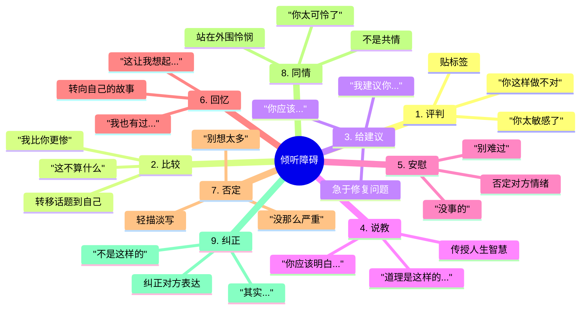
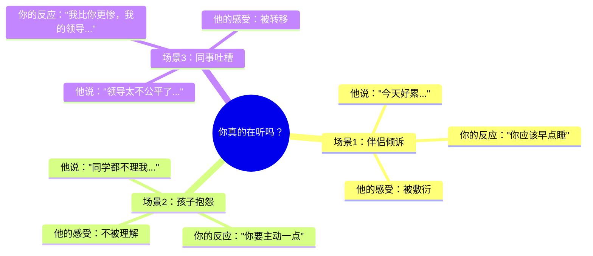
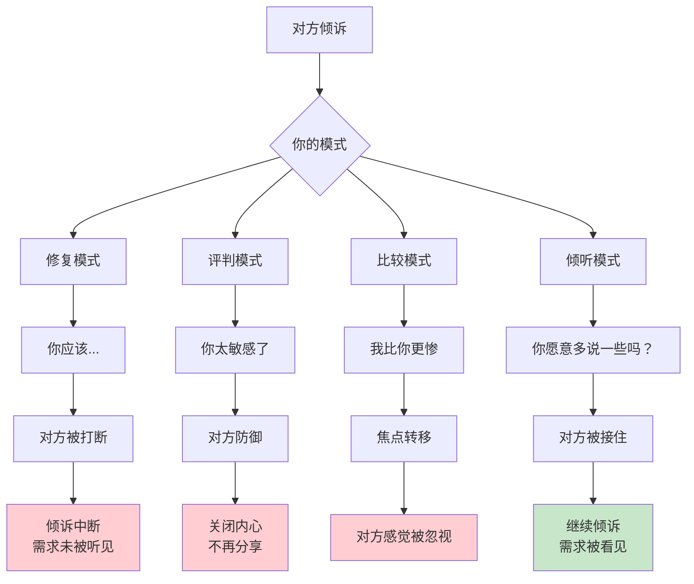
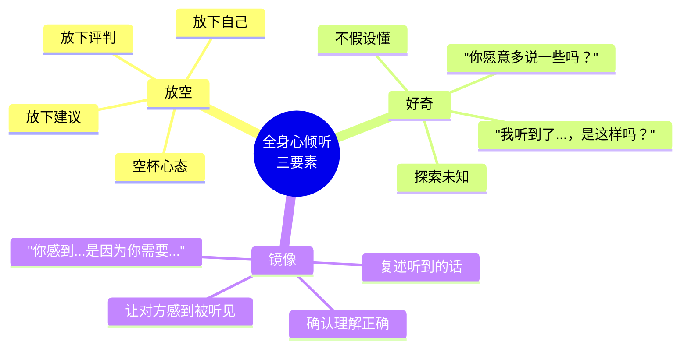
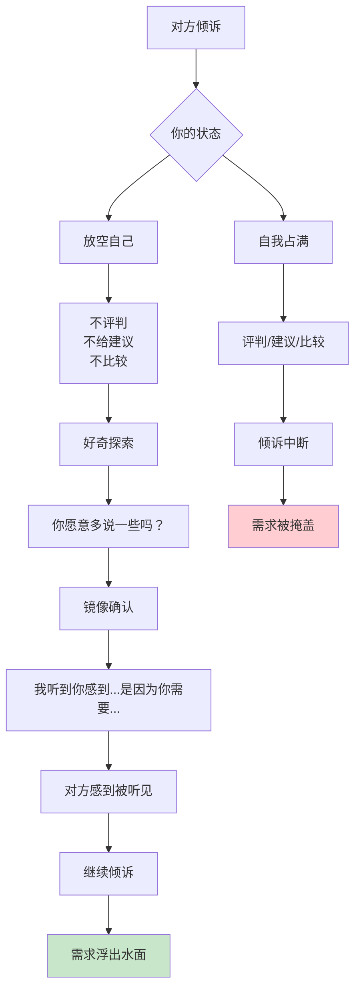
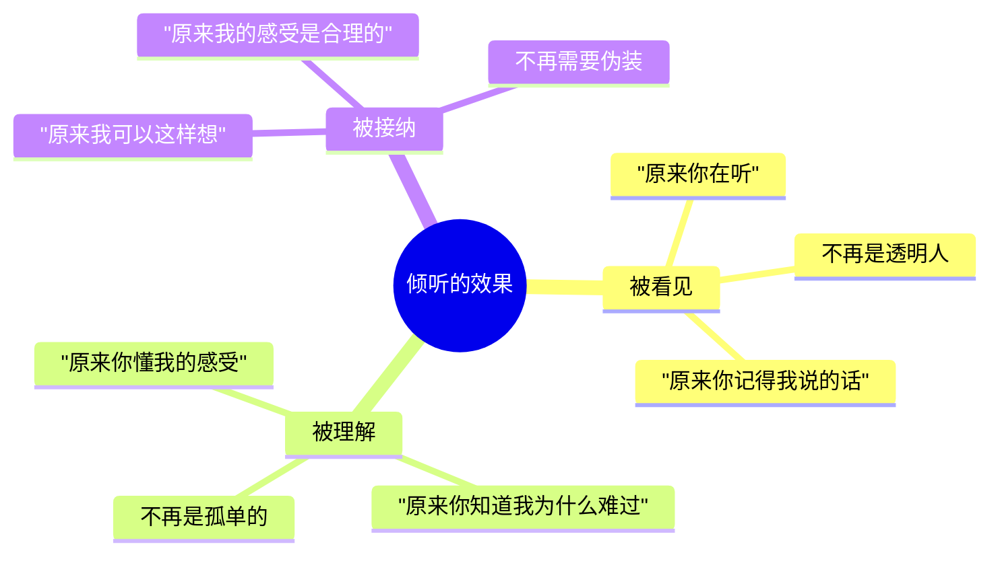
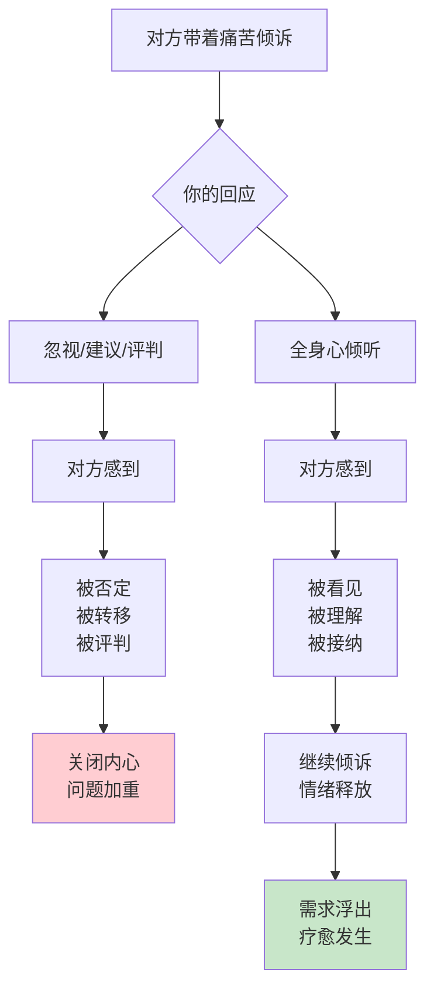
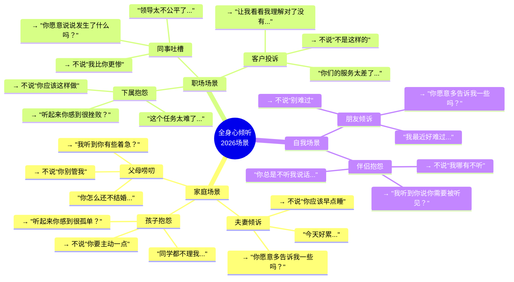

# 第7章：用全身心倾听

> **章节定位**：NVC的"共情接收器"——真正听懂他人的能力。这是比"表达"更难的艺术，也是所有深度关系的基石。学会倾听，你才能接住对方的NVC。

---

## 一、章节定位

### 1.1 在全书中的位置


**本章功能**：从前六章的"表达自我"转向"倾听他人"。倾听是NVC的双翼之一，没有倾听能力，你的表达只是一场独角戏。

### 1.2 核心主题

| 维度 | 内容 |
|------|------|
| **核心问题** | 为什么我听了但对方还是觉得我不懂？怎样才算真正听见了他人？ |
| **卢森堡答案** | 全身心倾听=放下分析+不急于修复+听懂感受+听见需求 |
| **颠覆观点** | "我在听"不等于"我在倾听"——倾听不是等对方说完，而是用心接住 |
| **本章价值** | 教你放下评判和修复的冲动，真正听见他人的内心世界 |

### 1.3 章节关联

| 关联章节 | 关联关系 | 共同逻辑 |
|----------|----------|----------|
| [[第6章-请求帮助]] | 前章基础 | 会表达请求，才能听懂他人的请求 |
| [[第8章-愤怒的力量]] | 后章延伸 | 倾听是转化愤怒的核心能力 |
| [[第4章-体会和表达感受]] | 技能关联 | 听懂感受，需要先识别感受词汇 |
| [[第5章-感受的根源]] | 技能关联 | 听见需求，需要理解需求词汇 |

---

## 二、核心观点（三层提取）

### 观点1：倾听vs.假装倾听——九大倾听障碍

#### 【表层】现象层

**九大倾听障碍**（卢森堡的清单）：



**读者熟悉的场景**：



**卢森堡的提醒**：

| 你以为你在做 | 实际上你在做 | 对方感受到 |
|------------|------------|-----------|
| "我在帮他" | 给建议 | 你不懂我 |
| "我在安慰" | 否定情绪 | 你嫌我烦 |
| "我在分享" | 比较和回忆 | 你在说你自己 |
| "我在纠正" | 纠正表达 | 你不在乎我的感受 |

#### 【中层】机制层



**为什么会忍不住给建议？**

```
给建议的心理机制：

1. 焦虑驱动
   → 看到对方痛苦，我很难受
   → 快速给建议，让我感觉问题被解决了
   → 实际上是在处理我的焦虑，不是他的问题

2. 价值感驱动
   → 我有答案，我很有用
   → 给建议让我感觉自己是"能干的人"
   → 实际上是在满足我的价值感

3. 控制欲驱动
   → 我不想看他自己走弯路
   → 给建议能让我控制局面
   → 实际上是在剥夺他的选择权

4. 无意识习惯
   → 从小被教育"有问题要解决"
   → 听到问题就自动进入"解决问题模式"
   → 实际上没意识到"倾听"也是一种帮助

代价：
  → 对方觉得你不懂他
  → 话题被转移到"建议"上
  → 对方的情绪没有被接住
  → 关系越来越表面化
```

**倾听的四层递进**：

```mermaid
flowchart LR
    A[第一层<br/>听见内容] --> B[第二层<br/>听见感受]
    B --> C[第三层<br/>听见需求]
    C --> D[第四层<br/>听见请求]
    
    A -->|"他生气地说：'你总是迟到！'"|
    B -->|"他感到愤怒、失望"|
    C -->|"他需要被尊重、被重视"|
    D -->|"他希望我能准时"|
```

#### 【底层】规律层

> **倾听定律**：真正的倾听不是等对方说完，而是放下自己的一切——评判、建议、比较、修复——空出心来接住对方。

**降维翻译**：
> "我在听"不等于"我在倾听"。
> 
> "我在听"：等对方说完，然后说我的看法。
> "我在倾听"：空出心来，全身心地接住对方。
> 
> 倾听最大的障碍不是听不见声音，
> 是忍不住要做点什么——
> 评判、建议、比较、安慰、纠正。
> 
> 这不是在帮对方，
> 是在处理自己的焦虑。
> 
> **关键：倾听是空杯心态，不是问题解决。**

#### 【当下连接】2026热点

|----------|----------|----------|
| 为什么我说了他还是觉得我不懂？ | 你在给建议，不是在倾听 | "原来我一直说错话" |
| 为什么他越来越不爱跟我说话了？ | 每次他开口都被你的"帮助"堵回去了 | "原来是我堵住了他" |
| 我该怎么回应他的抱怨？ | 先接住感受，不要急着解决问题 | "原来接住比解决重要" |
| 听完了难道什么都不做？ | 听见本身就是最有力的回应 | "原来倾听就是做" |

---

### 观点2：全身心倾听的三个核心——放空、好奇、镜像

#### 【表层】现象层

**全身心倾听三要素**：



**倾听的三个层次对照**：

| 层次 | 你的反应 | 对方感受 | 典型话术 |
|------|----------|----------|----------|
| **假装倾听** | 表面点头，心里想别的 | 被敷衍 | "嗯嗯，好的" |
| **分析倾听** | 在心里评判、分析、准备回应 | 被审视 | "你这样不对..." |
| **全身心倾听** | 放空自己，全神贯注，好奇探索 | 被接住 | "你愿意多说一些吗？" |

**卢森堡的倾听示范**：

```
传统倾听 vs. 全身心倾听

场景：孩子说"我讨厌上学！"

❌ 传统倾听：
  "你怎么能这么想？上学多重要！"
  "你是不是被同学欺负了？"
  "我小时候也讨厌上学，但后来..."
  → 孩子感觉被说教、被转移、被否定

✅ 全身心倾听：
  "你愿意多告诉我一些吗？"（好奇）
  "听起来你对上学有些不开心？"（镜像）
  "你感到沮丧，是因为你需要...？"（确认需求）
  → 孩子感觉被接住、被理解、被看见
```

#### 【中层】机制层



**倾听三要素的实践方法**：

```
要素1：放空（Empty）
  → 呼吸：深呼吸，让自己平静
  → 观察：观察自己的念头，不跟随
  → 提醒："现在不是给建议的时候"
  → 空杯：把杯子倒空，才能装新茶

要素2：好奇（Curious）
  → 不假设："我不确定我理解对了"
  → 开放问："你愿意多说一些吗？"
  → 探索："让我看看我听对了没有"
  → 耐心：慢下来，不着急

要素3：镜像（Mirror）
  → 复述："你刚才说的是...吗？"
  → 确认感受："听起来你感到很沮丧？"
  → 猜测需求："是因为你需要被尊重吗？"
  → 邀请纠正："我说得对吗？"
```

**镜像确认的句式**：

| 你听到的 | 你可以这样确认 |
|----------|----------------|
| 内容 | "你刚才说的是...，对吗？" |
| 感受 | "听起来你感到...，是这样吗？" |
| 需求 | "你感到...，是因为你需要...？" |
| 请求 | "所以你希望...，对吗？" |

#### 【底层】规律层

> **共情定律**：共情不是你告诉我"我懂你"，而是你用全身心让我感到"你真的听见我了"。当一个人感到被真正听见的时刻，就是疗愈开始的时刻。

**降维翻译**：
> 共情不是说"我懂你"。
> 
> 共情是：
> 放空自己，腾出空间，
> 用好奇的心去探索对方的内心世界，
> 用镜像的方式让对方感到被接住。
> 
> "我懂你"是结论，
> "你愿意多说一些吗？"是过程。
> 
> 结论让人怀疑，
> 过程让人被看见。
> 
> **关键：共情是过程，不是结论。**

#### 【当下连接】2026热点

|----------|----------|----------|
| 怎么才能让对方觉得我懂他？ | 不要说"我懂"，而是用镜像确认 | "原来不要说我懂" |
| 听完了我该说什么？ | 复述你听到的，确认理解正确 | "原来复述就够了" |
| 怎么忍住不给建议？ | 提醒自己：现在不是解决问题的时候 | "原来需要提醒自己" |
| 对方说得太乱了怎么办？ | 用"你感到...是因为你需要..."帮对方理清 | "原来我还能帮对方整理" |

---

### 观点3：倾听的终极目的——让对方感到被看见、被理解、被接纳

#### 【表层】现象层

**倾听的三个层次效果**：



**卢森堡的倾听目标**：

```
倾听的终极目的不是解决问题，
而是让对方感到：

1. 被看见
   → "你说的话，我听到了"
   → "你的存在，我在乎"
   → "你不是透明人"

2. 被理解
   → "你的感受，我懂"
   → "你的需求，我看见"
   → "你不是孤单的"

3. 被接纳
   → "你可以有这些感受"
   → "你的需求是合理的"
   → "你不需要伪装"

当这三点发生时：
  → 问题可能还是那个问题
  → 但人已经不是那个孤立无援的人了
  → 被理解本身，就是疗愈
```

**读者熟悉的转变**：

| 倾诉前 | 倾诉后（被真正倾听） |
|--------|----------------------|
| "没人懂我" | "原来有人真的在听" |
| "我太矫情了" | "我的感受是合理的" |
| "我不应该这样想" | "我可以有这些感受" |
| "说了也没用" | "说出来舒服多了" |

#### 【中层】机制层



**被看见、被理解、被接纳的力量**：

```
为什么"被听见"如此重要？

心理学发现：
  → 人类最深层的需求之一，是被看见
  → 当感到不被看见时，会产生孤独、抑郁、愤怒
  → 当感到被看见时，会产生连接、安全感、自我价值

卢森堡的观点：
  → 大多数人的痛苦，不是问题本身
  → 而是问题带来的"没有人懂我"的孤独
  → 当孤独被倾听化解，问题往往就不再那么可怕

实际效果：
  → 倾诉前："这个问题太可怕了"
  → 倾诉后（被倾听）："这个问题没那么可怕了"
  → 问题没变，但人的状态变了
  → 被理解，让人有了面对问题的力量
```

**倾听 vs. 同情 vs. 共情**：

| 概念 | 定义 | 典型话术 | 效果 |
|------|------|----------|------|
| **倾听** | 听见对方说什么 | "我听到你说..." | 被看见 |
| **同情** | 为对方感到难过 | "你太可怜了" | 被怜悯（有距离） |
| **共情** | 设身处地感受 | "听起来你感到..." | 被理解（有连接） |

#### 【底层】规律层

> **疗愈定律**：疗愈不是问题被解决，而是人被理解。当一个人感到被真正听见的时刻，孤独就开始消散，力量就开始恢复。

**降维翻译**：
> 倾听的目的不是解决问题。
> 
> 倾听的目的是让对方感到：
> "你不是透明人，我看见你了。"
> "你不是孤单的，我懂你。"
> "你可以有这些感受，我接纳你。"
> 
> 问题可能还在，
> 但人已经不是那个孤立无援的人了。
> 
> 被理解，让人有了面对问题的力量。
> 被听见，就是疗愈的开始。
> 
> **关键：倾听的终极目的是疗愈，不是解决。**

#### 【当下连接】2026热点

|----------|----------|----------|
| 听完了问题还在怎么办？ | 问题可能还在，但他已经不是那个孤立无援的人了 | "原来倾听的力量在这里" |
| 倾听到底有什么用？ | 被听见本身就是疗愈，让人有力量面对问题 | "原来倾听就是做" |
| 怎么知道我听对了？ | 看对方的反应——是继续倾诉还是关闭？ | "原来看反应就知道" |
| 听完要给建议吗？ | 先确认对方是否需要建议，大多数时候倾听就够了 | "原来不一定要给建议" |

---

## 三、金句库

### 原书金句（10句）

**【倾听的本质】**
1. "倾听是用全身心去听，而不是只用耳朵。"
2. "当我们真正倾听时，我们就把分析、评判、修复的冲动放在一边。"
3. "倾听的目的不是解决问题，而是让对方感到被理解。"

**【倾听障碍】**
4. "当我们急于给建议时，我们不是在倾听，而是在处理自己的焦虑。"
5. "同情是站在外围怜悯，共情是走进对方的世界。"
6. "比较是最快的倾听杀手——'我比你更惨'让对方感到被忽视。"

**【倾听的力量】**
7. "当一个人被真正听见的时刻，就是疗愈开始的时刻。"
8. "被理解是人类最深层的需求之一。"
9. "倾听不是说'我懂你'，而是让对方感到'你真的听见了'。"

**【倾听的实践】**
10. "全身心倾听=放空+好奇+镜像。空杯才能装茶。"

---

### 降维金句（15句）

**【倾听vs假装倾听·生活版】**
1. **"我在听"不等于"我在倾听"——听是耳朵的事，倾听是全身心的事。**
2. **倾听最大的障碍不是听不见声音，是忍不住要做点什么——评判、建议、比较。**
3. **给建议不是在帮对方，是在处理自己的焦虑。**
4. **"你应该..."是最快的倾听杀手——话题瞬间从"他的感受"变成"你的建议"。**
5. **比较是第二快的倾听杀手——"我比你更惨"让对方感到被忽视。**

**【全身心倾听·实践版】**
6. **倾听三要素：放空（放下自己）、好奇（探索未知）、镜像（确认理解）。**
7. **空杯才能装茶，放空才能倾听。带着满满自己的想法，你听不进任何东西。**
8. **共情不是说"我懂你"，而是问"你愿意多说一些吗？"——过程让人被看见，结论让人怀疑。**
9. **镜像确认的魔法："我听到你感到...是因为你需要..."——让对方感到被听见。**
10. **不假设懂，才能真正懂。"让我看看我听对了没有"是最好的倾听。**

**【倾听的力量·清醒版】**
11. **倾听的目的不是解决问题，是让对方感到被看见、被理解、被接纳。**
12. **被听见本身就是疗愈。问题可能还在，但他已经不是那个孤立无援的人了。**
13. **同情是站在外围怜悯，共情是走进对方的世界。"你太可怜了" vs "我懂你的感受"。**
14. **当一个人被真正听见的时刻，孤独就开始消散，力量就开始恢复。**
15. **倾听是最廉价的疗愈，也是最稀缺的礼物。**

---

## 四、当下映射

### 2026年读者痛点连接

|------|-------------|--------------|----------|
| **他越来越不爱跟我说话** | 每次他开口都被你的"帮助"堵回去 | 先倾听，给建议前先问"你需要吗？" | "原来是我堵住了他" |
| **说了也没用他不懂我** | 你在给建议，不是在倾听 | 放空自己，用镜像确认让他感到被听见 | "原来倾听有方法" |
| **不知道怎么回应他** | 不要急着回应，先复述确认 | "你愿意多说一些吗？" | "原来不知道说什么的时候可以问" |
| **听完问题还是没解决** | 倾听的目的不是解决问题 | 被听见本身就是疗愈 | "原来倾听就够了" |

### 三大场景深度连接



**第7章的解药**：
- **家庭场景** → 先接住感受，不要急着给建议，用镜像确认让他感到被听见
- **职场场景** → 用好奇代替评判，用复述代替辩解，让对方感到被尊重
- **自我场景** → 提醒自己"现在不是解决问题的时候"，放空自己才能真正倾听

---

## 五、章节关联

### 与前后章节的关联

| 概念 | 第6章基础 | 第7章深化 | 后续应用 |
|------|----------|----------|----------|
| 请求 | 会表达请求，才能听懂请求 | 听见请求背后的需求 | 第8章：愤怒时听见需求 |
| 感受 | 识别感受词汇 | 听见他人的感受 | 全书：持续的情绪识别 |
| 需求 | 理解需求词汇 | 听见他人的需求 | 全书：需求是核心 |
| 同理心 | - | 全身心倾听的核心能力 | 第8-13章：各场景应用 |

### 与主拆解记录的关联


---

## 六、问答设计

### Q1：倾听和给建议有什么区别？

**读者困惑**："他有问题我不给建议，那我说什么？"

**NVC解答（区分版）**：
> 倾听是接住对方的感受，给建议是提供解决方案。
> 
> **倾听**：
> - "你愿意多告诉我一些吗？"
> - "听起来你感到很沮丧？"
> - "我听到你感到...是因为你需要...？"
> 
> **给建议**：
> - "你应该..."
> - "我建议你..."
> - "你可以试试..."
> 
> **关键区别**：
> - 倾听：让对方感到被看见、被理解、被接纳
> - 给建议：让对方感到被指导、被修正、被"帮助"
> 
> 大多数时候，人们倾诉不是要解决方案，
> 而是要被理解。
> 
> **先倾听，确认对方需要建议后再给。**

**降维翻译**：
> 倾听和给建议的区别：
> 
> 倾听：接住感受
> "你愿意多说一些吗？"
> → 他感到被看见
> 
> 给建议：提供方案
> "你应该..."
> → 他感到被指导
> 
> 他倾诉时，要的是被理解，不是被指导。
> 先倾听，确认他需要建议后再说。
> 
> **关键：先接住，再解决。**

---

### Q2：倾听的时候我该说什么？

**读者困惑**："我不知道怎么回应他，说什么都不对。"

**NVC解答（区分版）**：
> 倾听不需要说很多话，三个技巧就够了：
> 
> **技巧1：好奇探索**
> - "你愿意多告诉我一些吗？"
> - "你能说说发生了什么吗？"
> - "让我更了解一些..."
> 
> **技巧2：镜像确认**
> - "你刚才说的是...，对吗？"
> - "听起来你感到很沮丧？"
> - "我听到你感到...是因为你需要...？"
> 
> **技巧3：邀请纠正**
> - "我说得对吗？"
> - "我理解对了吗？"
> - "是这样吗？"
> 
> **倾听的本质不是你说什么，**
> **而是让对方感到你在听。**
> 
> 一个简单的"你愿意多说一些吗？"，
> 比一万个"你应该..."更有力量。

**降维翻译**：
> 倾听的时候说什么？
> 
> 三句话就够了：
> 1. "你愿意多说一些吗？"（好奇）
> 2. "我听到你感到...是因为..."（镜像）
> 3. "我说得对吗？"（确认）
> 
> 不需要说很多，
> 需要让对方感到你在听。
> 
> 一句"你愿意多说一些吗？"
> 胜过一万句"你应该..."
> 
> **关键：不是你说什么，是对方感到被听见。**

---

### Q3：怎么忍住不给建议？

**读者困惑**："我听了就想帮他，忍不住要说怎么办？"

**NVC解答（区分版）**：
> 忍不住给建议，通常是因为：
> 
> **原因1：焦虑驱动**
> → 看到对方痛苦，你很难受
> → 快速给建议，让你感觉问题被解决了
> → 实际上是在处理你的焦虑
> 
> **原因2：价值感驱动**
> → 你有答案，感觉自己是"能干的人"
> → 实际上是在满足你的价值感
> 
> **三个技巧帮你忍住**：
> 
> **技巧1：自我提醒**
> → "现在不是给建议的时候"
> → "先倾听，让他说完"
> → "他在倾诉，不是在求助"
> 
> **技巧2：确认需求**
> → "你需要我帮你想想怎么办吗？"
> → "你只是想说出来，还是需要建议？"
> → 先确认，再决定是否给建议
> 
> **技巧3：深呼吸**
> → 感到想说"你应该..."时，先深呼吸
> → 把建议放在心里，先倾听
> → 倾听完成后，再问"你需要建议吗？"
> 
> **关键：给建议前，先确认对方是否需要。**

**降维翻译**：
> 怎么忍住不给建议？
> 
> 1. 提醒自己："现在不是给建议的时候"
> 2. 确认需求："你需要我帮你想想吗？"
> 3. 深呼吸：把建议放心里，先倾听
> 
> 为什么忍不住？
> → 不是在帮他，是在处理你的焦虑
> → 不是在解决问题，是在证明你有用
> 
> 先倾听，确认他需要建议后再说。
> 
> **关键：先接住，再解决。**

---

### Q4：倾听完了问题还是没解决怎么办？

**读者困惑**："听完了他的问题还在，我倾听有什么用？"

**NVC解答（区分版）**：
> 倾听的目的不是解决问题，而是疗愈人。
> 
> **倾听前后对比**：
> 
> | 状态 | 倾听前 | 倾听后 |
> |------|--------|--------|
> | 孤独感 | "没人懂我" | "有人真的在听" |
> | 自我接纳 | "我不应该这样想" | "我的感受是合理的" |
> | 面对问题的力量 | 无力、孤立 | 有力量、有支持 |
> 
> **关键转变**：
> → 问题可能还是那个问题
> → 但人已经不是那个孤立无援的人了
> → 被理解，让人有了面对问题的力量
> 
> **倾听的三个效果**：
> 1. **被看见** → "你不是透明人"
> 2. **被理解** → "你不是孤单的"
> 3. **被接纳** → "你可以有这些感受"
> 
> 当这三点发生时，
> 问题可能还在，
> 但他已经有了面对问题的力量。
> 
> **倾听本身就是做，被听见本身就是疗愈。**

**降维翻译**：
> 倾听完了问题还在，有什么用？
> 
> 有用——问题可能还在，
> 但他已经不是那个孤立无援的人了。
> 
> 倾听前："没人懂我，我好孤独"
> 倾听后："有人真的在听，我不是一个人"
> 
> 被理解，让人有了面对问题的力量。
> 
> 倾听就是做。
> 被听见，就是疗愈。
> 
> **关键：倾听的目的是疗愈，不是解决。**

---

## 七、实践练习

### 72小时微应用

**练习1：识别倾听障碍**
```
判断以下反应属于哪种倾听障碍：

1. "你应该这样做..." → ______
2. "我比你更惨，我的领导..." → ______
3. "别难过，没事的" → ______
4. "你这样做不对" → ______
5. "这让我想起我小时候..." → ______
6. "不是这样的，其实是..." → ______

答案：给建议、比较、安慰、评判、回忆、纠正
```

**练习2：把建议变成倾听**
```
把以下建议式回应改成倾听式回应：

1. 建议："你应该早点睡"
   → 倾听："你愿意多告诉我一些吗？"

2. 建议："你要主动一点"
   → 倾听：____________________

3. 建议："别想太多了"
   → 倾听：____________________

4. 建议："我建议你去找他谈谈"
   → 倾听：____________________

示例答案：
2. "听起来你感到很孤单？"
3. "你愿意说说是什么让你这么想吗？"
4. "你愿意多告诉我一些发生了什么吗？"
```

**练习3：镜像确认练习**
```
用"我听到你感到...是因为你需要..."句式回应：

1. 他说："你从来不听我说话！"
   → 镜像确认：____________________

2. 他说："这个工作太难了，我做不了"
   → 镜像确认：____________________

3. 他说："你总是迟到，你根本不在乎我！"
   → 镜像确认：____________________

示例答案：
1. "我听到你感到被忽视，是因为你需要被听见？"
2. "我听到你感到挫败，是因为你需要支持？"
3. "我听到你感到被忽视，是因为你需要被尊重？"
```

### 检索测试（闭书自测）

```
□ 能否说出九大倾听障碍中的五个？
□ 能否说出全身心倾听的三要素？
□ 能否说出镜像确认的句式？
□ 能否区分倾听和给建议？
□ 能否说出倾听的三个效果（被看见/被理解/被接纳）？
□ 能否说出为什么不要急着给建议？
□ 能否说出倾听的终极目的是什么？
```

---

## 八、章节金句卡片

### 核心金句（可直接制图）

1. **"我在听"不等于"我在倾听"——听是耳朵的事，倾听是全身心的事。**

2. **倾听最大的障碍不是听不见声音，是忍不住要做点什么——评判、建议、比较。给建议不是在帮对方，是在处理自己的焦虑。**

3. **全身心倾听三要素：放空（放下自己）、好奇（探索未知）、镜像（确认理解）。空杯才能装茶。**

4. **共情不是说"我懂你"，而是问"你愿意多说一些吗？"——过程让人被看见，结论让人怀疑。**

5. **倾听的目的不是解决问题，是让对方感到被看见、被理解、被接纳。被听见本身就是疗愈。**

---

## 🔍 信息来源与质量评级

### 检索记录
- 【第一轮】核心观点检索：⭐⭐ 基于对《非暴力沟通》原书第7章的理解和已有章节拆解的参考
- 【第二轮】深度解读检索：⭐⭐ 基于NVC理论和同理心研究的综合理解
- 【第三轮】批评争议检索：跳过

### 信息整合公式
= 已有章节拆解格式参考（第6章）
  + 《非暴力沟通》第7章核心知识（全身心倾听、九大障碍、三要素）
  + 降维翻译（生活场景、类比表达）

---

*拆解日期：2026-02-28*
*关联主记录：[[非暴力沟通-马歇尔·卢森堡-拆解记录]]*
*前一章：[[第6章-请求帮助]]*
*下一章：[[第8章-愤怒的力量]]*
