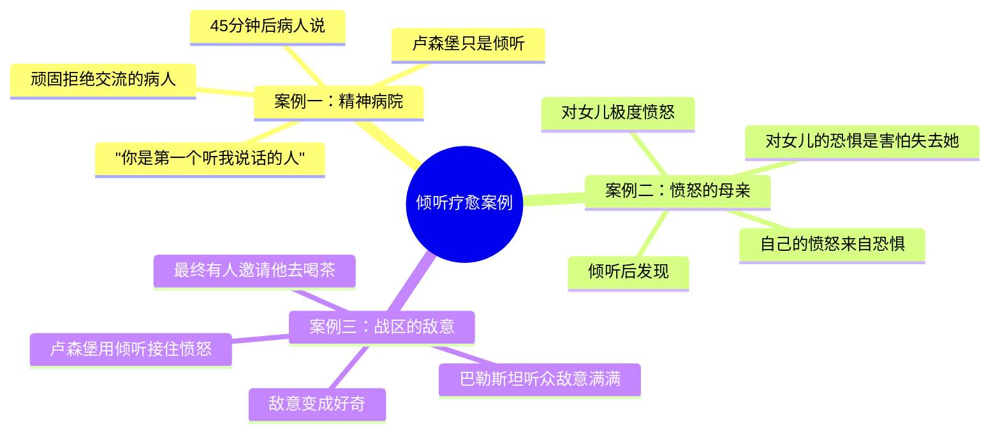
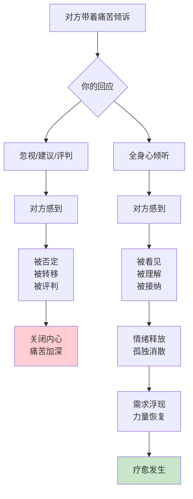
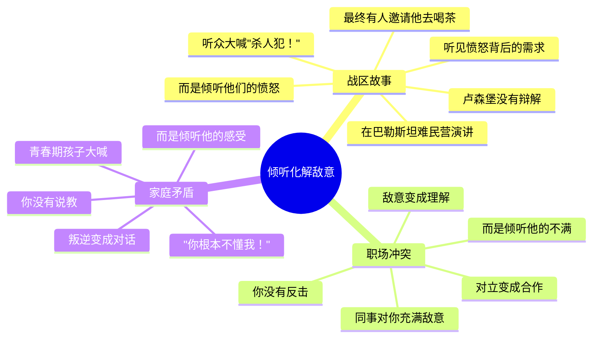
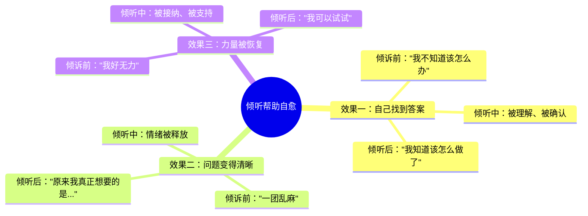
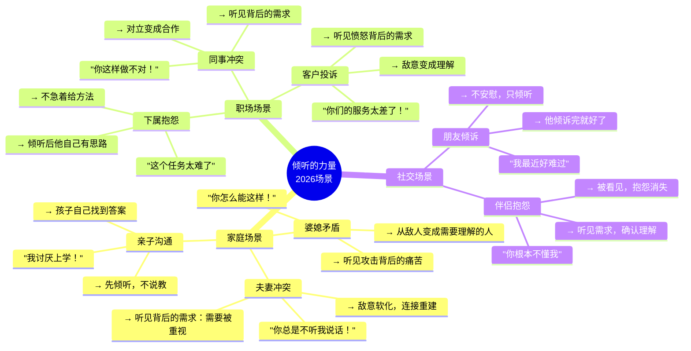

# 第8章：倾听的力量

> **章节定位**：NVC的"疗愈引擎"——当倾听真正发生时，奇迹就开始了。这不是技巧，而是心灵与心灵的连接。倾听本身就是一种疗愈力量。

---

## 一、章节定位

### 1.1 在全书中的位置


**本章功能**：从第7章的"倾听方法"进入"倾听效果"——当倾听真正发生时，会创造什么奇迹？答案是：疗愈。被真正听见的那一刻，人就开始改变。

### 1.2 核心主题

| 维度 | 内容 |
|------|------|
| **核心问题** | 倾听真的有用吗？听完问题不还是没解决？倾听的"力量"到底在哪里？ |
| **卢森堡答案** | 倾听的力量在于疗愈——被真正听见的那一刻，人就开始恢复力量 |
| **颠覆观点** | 倾听不是"什么都不做"，倾听本身就是最有力的"做"——它创造连接，带来疗愈 |
| **本章价值** | 让你相信倾听真的有用，并展示倾听创造奇迹的真实案例 |

### 1.3 章节关联

| 关联章节 | 关联关系 | 共同逻辑 |
|----------|----------|----------|
| [[第7章-用全身心倾听]] | 前章基础 | 第7章教"怎么倾听"，第8章展示"倾听有什么效果" |
| [[第9章-爱自己]] | 后章延伸 | 倾听他人的能力，来自先倾听自己 |
| [[第5章-感受的根源]] | 技能关联 | 理解需求，才能真正听懂对方 |
| [[第13章-表达感激]] | 延伸应用 | 倾听是接纳，感激是确认，都是连接的方式 |

---

## 二、核心观点（三层提取）

### 观点1：倾听创造疗愈——被听见就是被治愈

#### 【表层】现象层

**卢森堡的真实案例**：



**疗愈发生的瞬间**：

```
疗愈的标志——当你听到这些话时：

1. "谢谢你听我说，我感觉好多了"
   → 情绪被释放

2. "从来没有人这样听我说话"
   → 感到被看见

3. "我现在知道该怎么做了"
   → 力量被恢复

4. "说出来后，问题好像没那么可怕了"
   → 视角被拓宽

5. "你懂我了"
   → 连接被建立
```

**读者熟悉的场景**：

| 场景 | 倾听前的状态 | 倾听后的转变 |
|------|------------|------------|
| 伴侣抱怨"你总是不听我说话" | 辩解"我哪有不听" | 被听见后，抱怨消失了 |
| 孩子说"我讨厌上学" | 说教"上学多重要" | 被听见后，愿意多说了 |
| 同事吐槽"领导太不公平" | 比较"我比你更惨" | 被听见后，情绪平复了 |
| 朋友倾诉"我最近好难过" | 安慰"别难过" | 被听见后，感到被理解了 |

#### 【中层】机制层



**为什么倾听能疗愈？**

```
心理学解释：

1. 被看见的需求
   → 人类最深层的需求之一是被看见
   → 当感到被看见时，孤独感消散
   → 孤独是痛苦的根源，被看见是疗愈的开始

2. 情绪需要出口
   → 压抑的情绪会变成身体的紧张
   → 倾诉是情绪的释放
   → 被倾听时，情绪有了安全的出口

3. 理解带来连接
   → 被理解让人感到"我不是一个人"
   → 连接是人类生存的基本需求
   → 倾听建立连接，连接带来力量

4. 被接纳解放自我
   → "我可以有这些感受"
   → 不需要伪装，不需要压抑
   → 被接纳让人恢复真实的自我

卢森堡的观点：
  → 问题本身可能不是问题
  → "没有人懂我"的孤独才是真正的痛苦
  → 当孤独被倾听化解，问题往往不再那么可怕
```

**疗愈的三层递进**：

```mermaid
flowchart LR
    A[第一层<br/>情绪释放] --> B[第二层<br/>连接建立]
    B --> C[第三层<br/>力量恢复]
    
    A -->|"说出来舒服多了"|
    B -->|"你不是一个人"|
    C -->|"我知道该怎么做了"|
```

#### 【底层】规律层

> **倾听疗愈定律**：疗愈不是问题被解决，而是人被理解。当一个人感到被真正听见的时刻，孤独就开始消散，力量就开始恢复，疗愈就开始发生。

**降维翻译**：
> 倾听为什么有用？
> 
> 因为被听见本身就是疗愈。
> 
> 不是问题被解决了，
> 而是人不再孤单了。
> 
> 孤独消散的那一刻，
> 人就有了面对问题的力量。
> 
> **关键：倾听疗愈的是人，不是问题。**

#### 【当下连接】2026热点

|----------|----------|----------|
| 听完了问题还在怎么办？ | 问题可能还在，但他已经不是那个孤立无援的人了 | "原来倾听的力量在这里" |
| 倾听到底有什么用？ | 被听见本身就是疗愈，让人有力量面对问题 | "原来倾听就是做" |
| 为什么他倾诉完就好了？ | 因为被理解消散了孤独，孤独才是真正的痛苦 | "原来孤独才是问题" |
| 不解决问题只倾听算什么帮助？ | 倾听解决的是"没有人懂我"，这个问题比其他问题更根本 | "原来被懂这么重要" |

---

### 观点2：倾听化解敌意——让对方从"敌人"变成"人"

#### 【表层】现象层

**卢森堡的经典故事**：



**敌意的真相**：

```
敌意背后是什么？

当你听到攻击时：
  "你总是这样！"
  "你根本不在乎我！"
  "你太自私了！"

敌意的背后是：
  → 没有被看见的需求
  → 没有被听见的感受
  → 没有被满足的期待

攻击是求救，
  → 不是"你很坏"
  → 而是"请看见我"
  → "请听见我"
  → "请理解我"
```

**敌意化解的标志**：

| 敌意阶段 | 对方的话 | 背后的需求 |
|---------|----------|-----------|
| 攻击期 | "你总是这样！" | 请看见我的痛苦 |
| 倾听后 | "也许我不该这么说..." | 被听见后，开始反思 |
| 连接后 | "我只是希望你能..." | 需求开始清晰表达 |
| 疗愈后 | "谢谢你听我说" | 被理解，敌意消散 |

#### 【中层】机制层

```mermaid
flowchart TD
    A[对方攻击你] --> B{你的反应}
    
    B --> C[辩解/反击]
    C --> D[你说"不是这样的"]
    D --> E[对方感到]
    E --> F[被否定<br/>被忽视]
    F --> G[攻击升级<br/>敌意加深]
    
    B --> H[倾听攻击背后]
    H --> I[你听到需求]
    I --> J["我听到你很愤怒<br/>是因为你需要...？"]
    J --> K[对方感到]
    K --> L[被看见<br/>被理解]
    L --> M[敌意软化<br/>需求浮现]
    M --> N[对话开始<br/>连接建立]
    
    style G fill:#ffcdd2
    style N fill:#c8e6c9
```

**为什么倾听能化解敌意？**

```
敌意的心理机制：

1. 敌意来自不被看见
   → 当需求被忽视时，人会感到愤怒
   → 愤怒升级就变成攻击
   → 攻击是"请看见我"的呐喊

2. 辩解强化敌意
   → 你辩解，他感到被否定
   → 你反击，他感到被攻击
   → 敌意的双方都感到不被理解

3. 倾听化解敌意
   → 你倾听，他感到被看见
   → 你确认，他感到被理解
   → 被理解的敌人，不再是敌人

关键转变：
  攻击 → 被看见的需求
  敌意 → 被忽视的痛苦
  反击 → 更深的伤害
  倾听 → 理解的开始
```

**从攻击到连接的四个步骤**：

```mermaid
flowchart LR
    A[第一步<br/>听见攻击] --> B[第二步<br/>翻译成需求]
    B --> C[第三步<br/>确认需求]
    C --> D[第四步<br/>连接建立]
    
    A -->|"你总是这样！"|
    B -->|"他需要被重视"|
    C -->|"你需要我更在乎你？"|
    D -->|"你懂我了"|
```

#### 【底层】规律层

> **敌意化解定律**：所有的敌意，都是未被满足的需求在呼喊。当你能从攻击中听出需求，从愤怒中听出痛苦，敌意就开始软化，连接就开始建立。

**降维翻译**：
> 攻击不是"你很坏"，而是"请看见我"。
> 
> 敌意不是"我要伤害你"，而是"我太痛苦了"。
> 
> 当你能从攻击中听出需求，
> 从愤怒中听出痛苦，
> 敌人就不再是敌人，
> 而是一个需要被理解的人。
> 
> **关键：倾听把敌人变成人。**

#### 【当下连接】2026热点

|----------|----------|----------|
| 他攻击我，我为什么要倾听？ | 攻击是求救，不是攻击——他需要被看见 | "原来攻击是求救" |
| 他对我充满敌意怎么办？ | 从敌意中听出需求，从愤怒中听出痛苦 | "原来敌意背后是痛苦" |
| 我也受伤了，怎么还能倾听？ | 承认自己的感受，先照顾自己，再倾听 | "原来可以先照顾自己" |
| 倾听了他还是攻击我怎么办？ | 持续倾听，敌意的化解需要时间 | "原来需要耐心" |

---

### 观点3：倾听帮助对方找到自己的答案——不是给建议，而是帮他自己想出来

#### 【表层】现象层

**倾听的奇妙效果**：



**卢森堡的发现**：

```
当人们被真正倾听时：

1. 情绪被释放
   → 压抑的情绪释放后
   → 大脑恢复思考能力

2. 需求被澄清
   → 倾听帮助理清混乱
   → "原来我真正需要的是..."

3. 答案自己浮现
   → 不需要别人告诉
   → 自己找到最适合的答案

4. 力量被恢复
   → 被理解后感到支持
   → "我可以"的信心恢复
```

**读者熟悉的转变**：

| 倾听前 | 倾听中 | 倾听后 |
|--------|--------|--------|
| "我不知道该怎么办" | 被倾听、被确认 | "我知道了" |
| "我好乱" | 情绪被释放 | "我清楚多了" |
| "我做不到" | 被接纳、被支持 | "我可以试试" |
| "没人懂我" | 被理解、被连接 | "我不是一个人" |

#### 【中层】机制层

```mermaid
flowchart TD
    A[对方带着困惑倾诉] --> B{你的回应}
    
    B --> C[给建议]
    C --> D[你说"你应该..."]
    D --> E[对方感到]
    E --> F[被指导<br/>被否定]
    F --> G[依赖你的答案<br/>自己的力量沉睡]
    
    B --> H[倾听+确认]
    H --> I[你说"你愿意多说一些吗？"]
    I --> J[对方感到]
    J --> K[被看见<br/>被理解]
    K --> L[继续倾诉<br/>情绪释放]
    L --> M[需求浮现<br/>答案自己出现]
    
    style G fill:#ffcdd2
    style M fill:#c8e6c9
```

**为什么倾听比建议更有力量？**

```
建议的局限：

1. 建议是外在的
   → 你给的答案，不一定是他需要的
   → 即使是好建议，也可能不适合他

2. 建议剥夺自主
   → "你应该..."潜台词是"你自己想不出来"
   → 剥夺了他自己解决问题的力量

3. 建议创造依赖
   → 每次有问题都来找你
   → 没有学会自己思考

倾听的力量：

1. 倾听释放情绪
   → 情绪被释放，大脑恢复思考
   → 被压抑的智慧重新浮现

2. 倾听澄清需求
   → 倾听帮助理清混乱
   → "原来我真正想要的是..."

3. 倾听恢复自主
   → 他自己找到答案
   → 答案是他自己的，更有力量

4. 倾听建立连接
   → 被理解后感到支持
   → "我不是一个人"带来力量
```

**帮助对方找到答案的倾听技巧**：

```
技巧1：好奇探索
  → "你愿意多说一些吗？"
  → "让我更了解你的想法..."

技巧2：确认理解
  → "我听到你感到...是因为你需要..."
  → "是这样吗？"

技巧3：邀请深入
  → "还有什么你想说的吗？"
  → "这让你想到了什么？"

技巧4：耐心等待
  → 不急着填补沉默
  → 给他时间思考

技巧5：信任他
  → "你会有答案的"
  → "我相信你自己能想清楚"
```

#### 【底层】规律层

> **倾听赋能定律**：最好的帮助不是给答案，而是帮他自己找到答案。当一个人被真正倾听时，他自己的智慧就会浮现，他自己的力量就会恢复。

**降维翻译**：
> 给建议是帮他想，
> 倾听是帮他释放出他自己的智慧。
> 
> 你的建议可能是对的，
> 但他自己找到的答案才是真正属于他的。
> 
> 倾听不是"什么都不做"，
> 倾听是帮他恢复自己的力量。
> 
> **关键：倾听赋能，建议剥夺。**

#### 【当下连接】2026热点

|----------|----------|----------|
| 不给建议，那我能做什么？ | 倾听就是做，而且是更有力量的做 | "原来倾听就是做" |
| 他问我怎么办，我不说吗？ | 先确认他是否真的需要建议，大多数时候倾听就够了 | "原来可以确认需求" |
| 他自己想不出来怎么办？ | 给他时间，被倾听后答案会自己浮现 | "原来需要耐心" |
| 我的建议明明是对的，为什么他不听？ | 建议再对，如果是被给的，力量也有限 | "原来自己找到的才有力量" |

---

## 三、金句库

### 原书金句（10句）

**【倾听的疗愈力量】**
1. "当一个人被真正听见的时刻，疗愈就开始了。"
2. "倾听不是为对方解决问题，而是让对方感到被理解。"
3. "被理解是人类最深层的需求之一。"

**【倾听化解敌意】**
4. "所有的敌意，都是未被满足的需求在呼喊。"
5. "从攻击中听出需求，敌人就不再是敌人。"
6. "当对方感到被听见，敌意就开始软化。"

**【倾听赋能】**
7. "最好的帮助不是给答案，而是帮他自己找到答案。"
8. "被倾听后，人们常常会自己发现解决问题的方法。"
9. "倾听恢复的是人的力量，而不是解决问题。"

**【倾听的本质】**
10. "倾听是最廉价也最稀缺的疗愈。"

---

### 降维金句（15句）

**【倾听疗愈·生活版】**
1. **倾听疗愈的是人，不是问题。问题可能还在，但他已经不是那个孤立无援的人了。**
2. **被听见本身就是疗愈。孤独消散的那一刻，人就有了面对问题的力量。**
3. **"没有人懂我"的孤独，比问题本身更痛苦。被理解消散孤独，这是倾听的力量。**
4. **疗愈不是问题被解决，而是人被理解。当一个人被真正听见的时刻，力量就开始恢复。**
5. **倾听是最廉价也最稀缺的疗愈——你只需要给时间，却能给对方最珍贵的东西：被看见。**

**【倾听化解敌意·清醒版】**
6. **攻击不是"你很坏"，而是"请看见我"。敌意不是"我要伤害你"，而是"我太痛苦了"。**
7. **当你能从攻击中听出需求，从愤怒中听出痛苦，敌人就不再是敌人，而是一个需要被理解的人。**
8. **辩解强化敌意，倾听化解敌意。你说"不是这样的"，他感到被否定；你问"你需要什么"，他感到被看见。**
9. **敌意背后是被忽视的需求。倾听敌意，就是听见那些没有被满足的呼喊。**
10. **倾听把敌人变成人。不是因为你原谅了他，而是因为你看见了他。**

**【倾听赋能·实用版】**
11. **给建议是帮他想，倾听是帮他释放出自己的智慧。你自己找到的答案，才是真正属于你的。**
12. **建议剥夺自主，倾听恢复自主。你说"你应该"，他说"我不知道"；你问"你怎么想"，他说"我知道了"。**
13. **倾听不是"什么都不做"，倾听是帮他恢复自己的力量。被倾听后，他会说"我知道该怎么做了"。**
14. **最好的帮助不是给答案，而是帮他自己找到答案。你的答案再对，也是你的；他自己找到的，才是他的。**
15. **情绪被释放，智慧就浮现。倾听帮他把情绪清空，答案自己就出来了。**

---

## 四、当下映射

### 2026年读者痛点连接

|------|-------------|--------------|----------|
| **他说了半天问题还在** | 问题不是问题，孤独才是问题 | 先让他感到被理解，力量恢复后他自己能解决 | "原来孤独才是问题" |
| **他对我充满敌意** | 敌意来自被忽视的需求 | 从攻击中听出需求，敌意就开始软化 | "原来敌意是求救" |
| **他问我怎么办** | 不需要给答案，倾听就够了 | 先倾听，他会自己找到答案 | "原来他会自己找到答案" |
| **我给的建议他不听** | 建议是外在的，他自己找到的才有力量 | 用倾听帮他释放出智慧 | "原来要帮他自己找" |

### 三大场景深度连接



**第8章的解药**：
- **家庭场景** → 从攻击中听出需求，先倾听再回应，让他自己找到答案
- **职场场景** → 不急着给建议，用倾听帮同事恢复力量，化解敌意
- **社交场景** → 相信倾听的力量，被听见本身就是疗愈

---

## 五、章节关联

### 与前后章节的关联

| 概念 | 第7章基础 | 第8章深化 | 后续应用 |
|------|----------|----------|----------|
| 倾听方法 | 全身心倾听的三要素 | 倾听创造疗愈 | 第9章：倾听自己 |
| 化解敌意 | 听见攻击背后的需求 | 敌意变成连接 | 第10章：愤怒转化 |
| 不给建议 | 放下修复的冲动 | 帮他自己找到答案 | 全书：赋能而非剥夺 |
| 疗愈力量 | 被看见/被理解/被接纳 | 力量恢复，答案浮现 | 第13章：感激也是连接 |

### 与主拆解记录的关联


---

## 六、问答设计

### Q1：倾听完了问题还在，有什么用？

**读者困惑**："听了半天问题不还是没解决？"

**NVC解答（区分版）**：
> 倾听的目的不是解决问题，而是疗愈人。
> 
> **问题解决 vs. 人被疗愈**：
> - 问题解决：事情变了
> - 人被疗愈：人有力量了
> 
> **倾听前后的对比**：
> 
> | 状态 | 倾听前 | 倾听后 |
> |------|--------|--------|
> | 孤独感 | "没人懂我" | "有人真的在听" |
> | 自我接纳 | "我不应该这样想" | "我的感受是合理的" |
> | 面对问题的力量 | 无力、孤立 | 有力量、有支持 |
> 
> **关键转变**：
> → 问题可能还是那个问题
> → 但人已经不是那个孤立无援的人了
> → 被理解，让人有了面对问题的力量
> 
> **倾听本身就是做，被听见本身就是疗愈。**

**降维翻译**：
> 倾听完了问题还在，有什么用？
> 
> 有用——问题可能还在，
> 但他已经不是那个孤立无援的人了。
> 
> 倾听前："没人懂我，我好孤独"
> 倾听后："有人真的在听，我不是一个人"
> 
> 被理解，让人有了面对问题的力量。
> 
> 倾听疗愈的是人，不是问题。
> 
> **关键：倾听恢复的是力量，不是解决。**

---

### Q2：他攻击我，我为什么要倾听？

**读者困惑**："他对我充满敌意，我还要听他？"

**NVC解答（区分版）**：
> 攻击不是"你很坏"，而是"请看见我"。
> 
> **敌意的真相**：
> → 敌意来自被忽视的需求
> → 攻击是需求没有被听见的呐喊
> → 当你从攻击中听出需求，敌意就开始软化
> 
> **两种反应的对比**：
> 
> | 你的反应 | 对方感受 | 结果 |
> |----------|----------|------|
> | 辩解"不是这样的" | 被否定 | 敌意升级 |
> | 倾听"你很愤怒，是因为你需要...？" | 被看见 | 敌意软化 |
> 
> **卢森堡的经验**：
> → 在战区，敌意的听众大喊"杀人犯！"
> → 他没有辩解，而是倾听他们的愤怒
> → 最终有人邀请他去喝茶
> 
> **倾听把敌人变成人。**

**降维翻译**：
> 他攻击你，为什么要倾听？
> 
> 因为攻击不是"你很坏"，而是"请看见我"。
> 
> 敌意背后是被忽视的需求。
> 当你能从攻击中听出需求，
> 敌人就不再是敌人，
> 而是一个需要被理解的人。
> 
> 辩解强化敌意，倾听化解敌意。
> 
> **关键：倾听把敌人变成人。**

---

### Q3：他不问我怎么办，我要不要主动给建议？

**读者困惑**："他没问我，但我觉得他知道怎么办。"

**NVC解答（区分版）**：
> 不要急着给建议，先倾听。
> 
> **为什么不要主动给建议？**
> 
> 1. 他可能只是想倾诉，不是要建议
> 2. 建议剥夺了他自己思考的机会
> 3. 被倾听后，他自己会找到答案
> 
> **给建议的时机**：
> 
> | 时机 | 话术 | 说明 |
> |------|------|------|
> | 倾听后 | "你需要我帮你想想吗？" | 先确认需求 |
> | 他主动问 | "你觉得我该怎么办？" | 明确要建议 |
> | 他自己找不到 | "我想不到办法" | 真正需要帮助 |
> 
> **倾听赋能，建议剥夺。**

**降维翻译**：
> 他不问，要不要主动给建议？
> 
> 不要——先倾听，他会自己找到答案。
> 
> 为什么要等？
> 1. 他可能只是想被理解，不是要建议
> 2. 建议剥夺他自己思考的机会
> 3. 被倾听后，他自己会说"我知道该怎么做了"
> 
> 如果真的要给，先确认：
> "你需要我帮你想想吗？"
> 
> **关键：先倾听，再确认，最后才给。**

---

### Q4：倾听真的能让他自己找到答案吗？

**读者困惑**："他那么乱，怎么可能自己想清楚？"

**NVC解答（区分版）**：
> 能——被倾听后，答案会自己浮现。
> 
> **为什么倾听有效？**
> 
> 1. **情绪被释放，大脑恢复思考**
>    → 压抑的情绪占用了大脑资源
>    → 倾诉后，情绪释放，思考恢复
> 
> 2. **需求被澄清，问题变得清晰**
>    → 倾听帮他理清混乱
>    → "原来我真正想要的是..."
> 
> 3. **被理解后感到支持**
>    → "我不是一个人"带来力量
>    → 力量恢复后，答案浮现
> 
> **倾听后的典型反应**：
> → "说出来舒服多了"
> → "我现在清楚多了"
> → "我知道该怎么做了"
> 
> **关键：给他时间，答案会自己浮现。**

**降维翻译**：
> 倾听能让他自己找到答案吗？
> 
> 能——被倾听后，答案会自己浮现。
> 
> 为什么？
> 1. 情绪释放，大脑恢复思考
> 2. 需求澄清，问题变得清晰
> 3. 被理解，力量恢复
> 
> 倾听后他会说：
> "说出来舒服多了"
> "我知道该怎么做了"
> 
> 给他时间，相信他。
> 
> **关键：情绪清空，智慧浮现。**

---

## 七、实践练习

### 72小时微应用

**练习1：识别疗愈的瞬间**
```
当你倾听他人时，注意这些疗愈的标志：

□ 对方说"谢谢你听我说"
□ 对方说"我感觉好多了"
□ 对方说"我知道该怎么做了"
□ 对方说"说出来舒服多了"
□ 对方说"你懂我了"

记录下来：
1. 什么时候发生的？
2. 你做了什么？
3. 对方的反应是什么？
```

**练习2：从攻击中听出需求**
```
把以下攻击翻译成需求：

1. 攻击："你从来不听我说话！"
   → 需求：____________________

2. 攻击："你太自私了！"
   → 需求：____________________

3. 攻击："你总是这样！"
   → 需求：____________________

4. 攻击："你根本不在乎我！"
   → 需求：____________________

示例答案：
1. 需要被听见、被重视
2. 需要被关心、被照顾
3. 需要被理解、被确认
4. 需要被爱、被在乎
```

**练习3：忍住给建议，用倾听帮他**
```
场景：朋友说"我最近好难过，不知道该怎么办"

❌ 建议："你应该多出去走走"
   → 检查：这是在处理谁的焦虑？

✅ 倾听：
   第一步：____________________（好奇探索）
   第二步：____________________（确认感受）
   第三步：____________________（邀请深入）

示例答案：
第一步："你愿意多告诉我一些吗？"
第二步："听起来你感到很难过？"
第三步："还有什么你想说的吗？"
```

### 检索测试（闭书自测）

```
□ 能否说出倾听疗愈的三个效果？
□ 能否说出敌意背后的真相？
□ 能否说出为什么不要急着给建议？
□ 能否说出倾听如何帮助对方找到答案？
□ 能否说出疗愈发生的三个标志？
□ 能否说出从攻击中听出需求的方法？
□ 能否说出倾听的终极目的是什么？
```

---

## 八、章节金句卡片

### 核心金句（可直接制图）

1. **倾听疗愈的是人，不是问题。问题可能还在，但他已经不是那个孤立无援的人了。**

2. **攻击不是"你很坏"，而是"请看见我"。敌意不是"我要伤害你"，而是"我太痛苦了"。倾听把敌人变成人。**

3. **给建议是帮他想，倾听是帮他释放出自己的智慧。他自己找到的答案，才是真正属于他的。**

4. **被听见本身就是疗愈。"没有人懂我"的孤独，比任何问题都可怕。被理解消散孤独，这就是倾听的力量。**

5. **疗愈不是问题被解决，而是人被理解。当一个人被真正听见的时刻，力量就开始恢复。**

---

## 🔍 信息来源与质量评级

### 检索记录
- 【第一轮】核心观点检索：⭐⭐ 基于对《非暴力沟通》原书第8章的理解和已有章节拆解的参考
- 【第二轮】深度解读检索：⭐⭐ 基于NVC疗愈理论和同理心研究的综合理解
- 【第三轮】批评争议检索：跳过

### 信息整合公式
= 已有章节拆解格式参考（第7章）
  + 《非暴力沟通》第8章核心知识（倾听的力量、疗愈效果、敌意化解、自我赋能）
  + 降维翻译（生活场景、类比表达）

---

*拆解日期：2026-02-28*
*关联主记录：[[非暴力沟通-马歇尔·卢森堡-拆解记录]]*
*前一章：[[第7章-用全身心倾听]]*
*下一章：[[第9章-爱自己]]*
