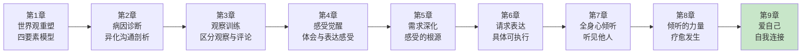
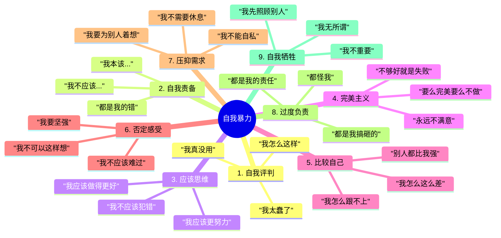
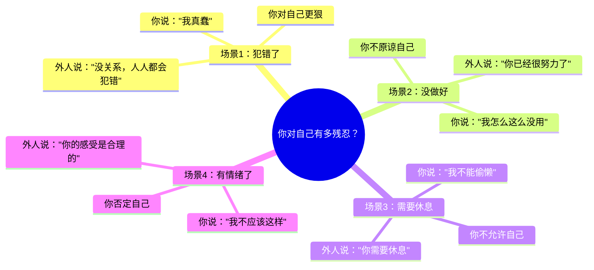
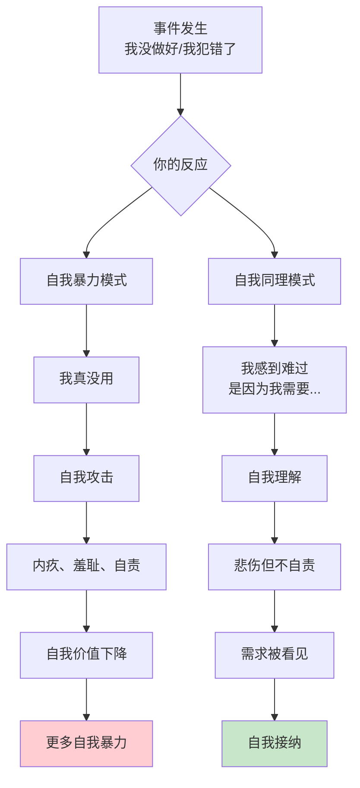
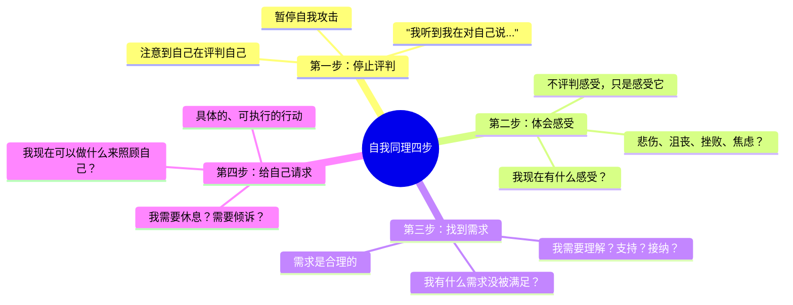
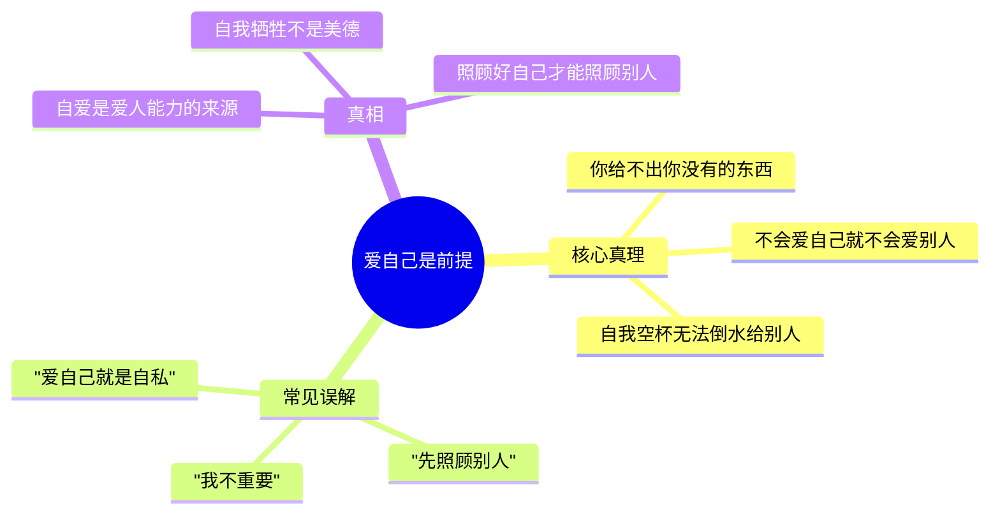
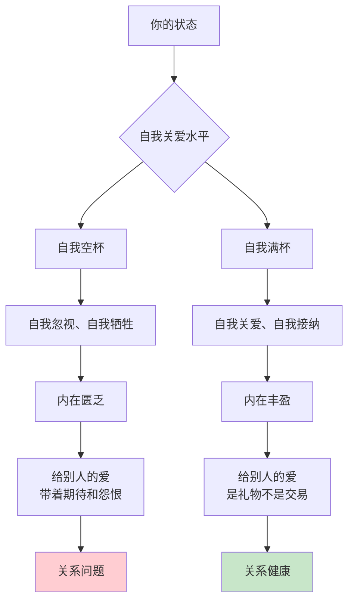
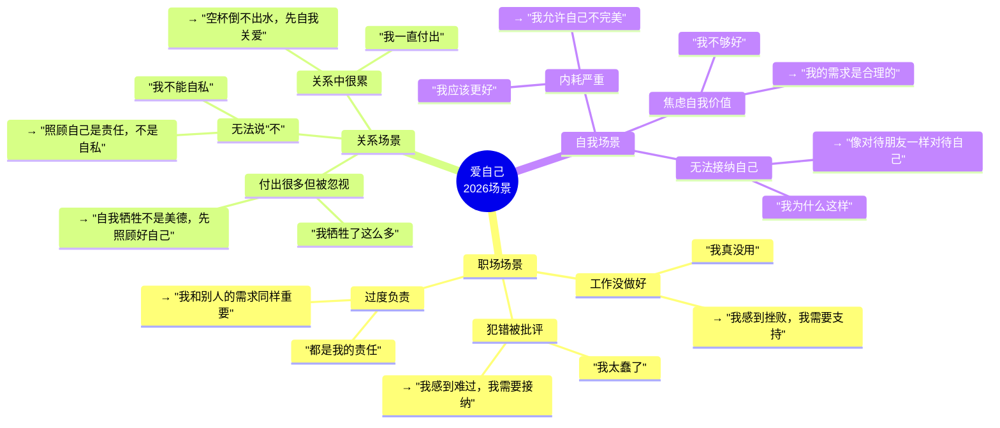
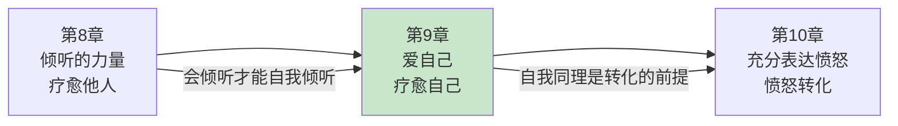

# 第9章：爱自己

> **章节定位**：NVC的"自我疗愈中心"——所有对外关系的起点，都是与自己的关系。如果你不会爱自己，就不可能真正爱别人。自我同理是NVC最容易被忽视，却最重要的能力。

---

## 一、章节定位

### 1.1 在全书中的位置



**本章功能**：从"倾听他人"回到"倾听自己"。这是NVC的转折点——你给不出你没有的东西。不会爱自己，就不会爱别人；不会自我同理，就无法真正同理他人。

### 1.2 核心主题

| 维度 | 内容 |
|------|------|
| **核心问题** | 为什么我总是对自己那么苛刻？怎么才能接纳不完美的自己？ |
| **卢森堡答案** | 自我暴力（自我评判、自我责备）和异化沟通一样，切断了与自己的连接。用NVC对待自己，才能恢复自我连接。 |
| **颠覆观点** | 对自己好不是自私，而是爱别人的前提——你给不出你没有的东西。 |
| **本章价值** | 教你用同样的NVC（观察-感受-需求-请求）对待自己，停止自我暴力，学会自我同理。 |

### 1.3 章节关联

| 关联章节 | 关联关系 | 共同逻辑 |
|----------|----------|----------|
| [[第8章-倾听的力量]] | 前章基础 | 会倾听他人，才能倾听自己 |
| [[第10章-充分表达愤怒]] | 后章延伸 | 愤怒时先自我同理，才能不伤人 |
| [[第5章-感受的根源]] | 技能关联 | 理解自己的需求，才能自我同理 |
| [[第4章-体会和表达感受]] | 技能关联 | 识别自己的感受，才能知道自己需要什么 |

---

## 二、核心观点（三层提取）

### 观点1：自我暴力的真相——我们对自己比对外人更残忍

#### 【表层】现象层

**自我暴力的九种形式**：



**读者熟悉的场景**：



**卢森堡的发现**：

| 你对外人 | 你对自己 | 差距 |
|----------|----------|------|
| "没关系，人人都会犯错" | "我真蠢" | 你对自己更残忍 |
| "你需要休息" | "我不能偷懒" | 你不允许自己休息 |
| "你的感受是合理的" | "我不应该这样想" | 你否定自己的感受 |
| "这不是你的错" | "都是我的错" | 你过度自责 |

#### 【中层】机制层



**为什么我们对自己更残忍？**

```
自我暴力的心理根源：

1. 内化的严厉父母
   → 小时候被说"你真没用"
   → 长大后自己对自己说"你真没用"
   → 那个严厉的声音变成了你自己的声音

2. 错误的自我价值公式
   → "我有价值" = "我做得好"
   → "我没做好" = "我没价值"
   → 把价值和表现绑定

3. 害怕自满
   → "如果我对自己太好，我就不会进步"
   → "自我批评是进步的动力"
   → 误以为自我暴力是自我激励

4. 不懂得自我接纳
   → 从小没有被教过"接纳自己"
   → 只学会"批评自己"和"鞭策自己"
   → 不知道还有第三种选择

代价：
  → 自我价值感低落
  → 焦虑、抑郁、内耗
  → 无法真正爱别人（你给不出你没有的）
  → 永远觉得自己不够好
```

**自我暴力的恶性循环**：

```mermaid
flowchart LR
    A[我没做好] --> B[自我评判<br/>"我真没用"]
    B --> C[自我价值下降]
    C --> D[更加害怕失败]
    D --> E[更努力/更焦虑]
    E --> F[更容易出错]
    F --> A
    
    style A fill:#ffcdd2
```

#### 【底层】规律层

> **自我暴力定律**：我们对自己说的话，比对最恨的敌人更狠。这种自我暴力切断了我们与自己的连接，让我们无法真正爱别人——因为你给不出你没有的东西。

**降维翻译**：
> 你对自己说的话，
> 比对最讨厌的人还狠。
> 
> 别人犯错，你说"没关系"；
> 你犯错，你说"我真蠢"。
> 
> 这不是高标准，
> 这是自我暴力。
> 
> 你对自己这么狠，
> 怎么可能对别人温柔？
> 
> **关键：自我暴力，是无法爱人的根源。**

#### 【当下连接】2026热点

|----------|----------|----------|
| 为什么我总觉得自己不够好？ | 因为你在用"应该"鞭打自己，而不是用"需求"理解自己 | "原来我在鞭打自己" |
| 为什么我对自己这么苛刻？ | 你内化了一个严厉的法官，现在是你自己在审判自己 | "原来审判我的是我自己" |
| 不批评自己怎么进步？ | 自我同理不是放弃进步，而是用理解代替惩罚 | "原来理解比惩罚更有力" |
| 为什么我无法真正爱别人？ | 你给不出你没有的东西——先学会爱自己，才能爱别人 | "原来要先爱自己" |

---

### 观点2：自我同理的四个步骤——用NVC对待自己

#### 【表层】现象层

**自我同理的四个步骤**：



**卢森堡的自我同理示范**：

```
场景：我说错话了，感到很糟糕

❌ 自我暴力：
  "我真蠢，我怎么会说那种话"
  → 自我评判 → 自我攻击

✅ 自我同理：
  第一步（停止评判）：
    "我听到自己在说'我真蠢'"
    → 意识到自己在自我攻击
  
  第二步（体会感受）：
    "我现在感到很沮丧、很尴尬"
    → 命名感受，不评判
  
  第三步（找到需求）：
    "我沮丧是因为我需要被理解、被接纳"
    → 理解自己的需求
  
  第四步（给自己请求）：
    "我现在可以做什么来照顾自己？"
    → 也许我需要找人聊聊
    → 也许我需要给自己一个拥抱
```

**读者熟悉的转变**：

| 场景 | 自我暴力 | 自我同理 |
|------|----------|----------|
| 没做好工作 | "我真没用" | "我感到挫败，我需要支持" |
| 和人吵架了 | "我怎么这样" | "我感到后悔，我需要理解" |
| 需要休息 | "我不能偷懒" | "我感到疲惫，我需要休息" |
| 犯错了 | "我太蠢了" | "我感到难过，我需要接纳" |

#### 【中层】机制层

```mermaid
flowchart TD
    A[触发事件<br/>我没做好/犯错了] --> B{你的模式}
    
    B --> C[自我暴力]
    C --> D[评判自己<br/>"我真没用"]
    D --> E[感到羞耻/内疚]
    E --> F[自我价值下降]
    F --> G[能量内耗]
    
    B --> H[自我同理]
    H --> I[停止评判<br/>"我听到我在说..."]
    I --> J[体会感受<br/>"我感到沮丧"]
    J --> K[找到需求<br/>"我需要理解"]
    K --> L[给自己请求<br/>"我可以做什么"]
    L --> M[自我连接恢复]
    M --> N[力量恢复]
    
    style G fill:#ffcdd2
    style N fill:#c8e6c9
```

**自我同理为什么有效？**

```
自我同理的心理机制：

1. 停止评判 = 停止自我攻击
   → 自我评判是二次伤害
   → 停止评判，停止伤害
   → 给自己喘息的空间

2. 体会感受 = 承认自己的感受
   → "我可以有这些感受"
   → 感受被承认，情绪就有出口
   → 压抑的情绪开始流动

3. 找到需求 = 理解自己的需求
   → 需求是合理的、正当的
   → 理解需求，就知道自己缺什么
   → 缺什么，就可以补什么

4. 给自己请求 = 具体的自我照顾行动
   → 不停留在情绪里
   → 转化为具体的行动
   → 真正照顾自己

自我同理的公式：
  停止评判 + 体会感受 + 找到需求 + 给自己请求 = 自我连接恢复
```

**自我同理 vs. 自我放纵**：

| 概念 | 自我同理 | 自我放纵 |
|------|----------|----------|
| 定义 | 理解自己的感受和需求 | 逃避责任、即时满足 |
| 态度 | 接纳感受，承担责任 | 否认问题，逃避后果 |
| 目的 | 恢复自我连接，增强力量 | 暂时舒服，不解决问题 |
| 结果 | 长期的自我成长 | 短期的舒适，长期的问题 |
| 话术 | "我感到挫败，我需要支持" | "算了，无所谓" |

#### 【底层】规律层

> **自我同理定律**：自我同理不是自我放纵，而是用同样的NVC（观察-感受-需求-请求）对待自己。当你学会自我同理，你才能恢复与自己的连接，才能真正爱别人——因为你终于有了可以给的东西。

**降维翻译**：
> 对自己好不是自私，
> 而是爱别人的前提。
> 
> 自我同理不是放弃进步，
> 而是用理解代替惩罚。
> 
> 你不会对别人说的话，
> 也不要对自己说。
> 
> 像对待最好的朋友一样，
> 对待你自己。
> 
> **关键：自我同理 = 像对待朋友一样对待自己。**

#### 【当下连接】2026热点

|----------|----------|----------|
| 自我同理是不是找借口？ | 自我同理是理解自己，不是逃避责任——理解是改变的起点 | "原来理解不是找借口" |
| 怎么才能不对自己那么苛刻？ | 像对待最好的朋友一样对待自己——你不会对朋友说"你真蠢" | "原来我对自己比朋友更狠" |
| 自我同理具体怎么做？ | 四步：停止评判→体会感受→找到需求→给自己请求 | "原来有具体方法" |
| 为什么我总是很难对自己好？ | 你内化了一个严厉的声音，现在需要学会对自己温柔 | "原来需要重新学习" |

---

### 观点3：爱自己是爱别人的前提——你给不出你没有的东西

#### 【表层】现象层

**卢森堡的核心观点**：



**读者的困惑与真相**：

```
困惑1："爱自己不是自私吗？"

真相：
  → 自私是"只在乎自己"
  → 自爱是"先照顾好自己，再照顾别人"
  → 空杯子倒不出水
  → 你给不出你没有的东西

困惑2："我应该先照顾别人吧？"

真相：
  → 自我牺牲不是美德
  → 牺牲自己照顾别人，你会怨恨
  → 带着怨恨的照顾，不是爱
  → 先照顾好自己，照顾别人才是礼物

困惑3："我不是很重要吧？"

真相：
  → 你和别人的需求同样重要
  → 你的需求不是"次要的"
  → 你值得被爱，包括被自己爱
  → 把自己当人看，不是自私
```

**自我牺牲的代价**：

| 你以为的自我牺牲 | 实际上的后果 |
|------------------|--------------|
| "我先照顾别人" | 你累了，照顾质量下降 |
| "我无所谓" | 你压抑需求，最终爆发 |
| "我不重要" | 你感到被忽视，开始怨恨 |
| "我来承担" | 你过度负责，别人失去成长机会 |

#### 【中层】机制层



**为什么爱自己是爱别人的前提？**

```
"空杯"原理：

1. 你给不出你没有的东西
   → 如果你内心匮乏，你给的爱也会匮乏
   → 如果你不会接纳自己，你也不会真正接纳别人
   → 如果你不觉得自己值得被爱，你会怀疑别人爱你

2. 自我牺牲创造怨恨
   → 你牺牲自己照顾别人
   → 你会期待别人回报
   → 如果别人没有回报，你会怨恨
   → 带着怨恨的爱，不是爱

3. 自我照顾是责任
   → 照顾好自己的需求是你的责任
   → 把这个责任推给别人，是不公平的
   → 当你照顾好自己，你才能真正照顾别人

卢森堡的观点：
  → "我不是在提倡自私"
  → "我是说，你和别人的需求同样重要"
  → "当你学会自我关爱，你给别人的爱才是真正的礼物"
```

**从自我牺牲到自我关爱**：

```mermaid
flowchart LR
    A[自我牺牲] --> B[自我关爱]
    
    A -->|"我把你放在第一位"|
    B -->|"我和你同样重要"|
    
    A -->|"我压抑自己的需求"|
    B -->|"我承认我的需求"|
    
    A -->|"我期待你的回报"|
    B -->|"我给你的是礼物"|
    
    A -->|"我累了会怨恨"|
    B -->|"我照顾好自己才能照顾你"|
```

#### 【底层】规律层

> **自爱定律**：你给不出你没有的东西。当你学会爱自己，你给别人的爱才是礼物，而不是交易。自我牺牲不是美德，而是对自己和关系的伤害。

**降维翻译**：
> 空杯子倒不出水。
> 
> 你不会爱自己，
> 就不会真正爱别人。
> 
> 你给的"爱"会带着期待：
> "我对你这么好，你也应该对我好。"
> 
> 这不是爱，这是交易。
> 
> 先把自己的杯子装满，
> 给别人的才是礼物。
> 
> **关键：爱自己，才能爱人。满杯才能分享。**

#### 【当下连接】2026热点

|----------|----------|----------|
| 爱自己不是自私吗？ | 自私是"只在乎自己"，自爱是"先照顾好自己"——空杯倒不出水 | "原来自爱和自私不一样" |
| 为什么我总是付出但得不到回报？ | 你给的"爱"带着期待，这是交易不是礼物——先自我关爱 | "原来我给的是交易" |
| 怎么才能不那么累？ | 先照顾好自己，才能持续照顾别人——自我牺牲不可持续 | "原来可以先照顾自己" |
| 为什么我总是很怨恨？ | 因为你牺牲自己，期待回报，但没得到——先自我关爱 | "原来怨恨来自牺牲" |

---

## 三、金句库

### 原书金句（10句）

**【自我暴力】**
1. "我们对自己说的话，比对最恨的敌人更狠。"
2. "自我评判是一种暴力，它切断了我们与自己的连接。"
3. "每一次对自己说'我应该'，都是在对自己进行暴力。"

**【自我同理】**
4. "自我同理不是自我放纵，而是用同样的NVC对待自己。"
5. "对自己好不是自私，而是爱别人的前提。"
6. "你不会对别人说的话，也不要对自己说。"

**【爱自己】**
7. "你给不出你没有的东西。"
8. "当你学会自我关爱，你给别人的爱才是真正的礼物。"
9. "自我牺牲不是美德，而是对自己和关系的伤害。"

**【自我接纳】**
10. "需求没有对错，感受没有好坏。你的需求和感受都是合理的。"

---

### 降维金句（15句）

**【自我暴力·清醒版】**
1. **你对自己说的话，比对最讨厌的人还狠。别人犯错你说"没关系"，你犯错你说"我真蠢"。**
2. **自我评判不是自我激励，是二次伤害。你已经在难过了，为什么还要再伤害自己？**
3. **"我应该"是最隐蔽的自我暴力。每次说"我应该"，你都在对自己说"你不够好"。**

**【自我同理·实践版】**
4. **自我同理四步：停止评判 → 体会感受 → 找到需求 → 给自己请求。像对待最好的朋友一样对待自己。**
5. **你不会对朋友说"你真蠢"，为什么对自己说？像对待朋友一样对待自己，这就是自我同理。**
6. **自我同理不是自我放纵，而是用理解代替惩罚。理解是改变的起点，惩罚只是伤害。**
7. **对自己的话术："我感到...是因为我需要...我可以..."——对自己用NVC。**

**【爱自己·核心版】**
8. **空杯子倒不出水。你不会爱自己，就不会真正爱别人——你给不出你没有的东西。**
9. **爱自己不是自私，是爱别人的前提。先照顾好自己，给别人的才是礼物。**
10. **自我牺牲不是美德，是伤害。带着怨恨的照顾，不是爱。**
11. **你和别人的需求同样重要。把自己当人看，不是自私。**

**【2026连接】**
12. **为什么你总是付出但很累？因为你空杯还在倒水。先照顾好自己，才能持续照顾别人。**
13. **为什么你总是怨恨？因为你牺牲自己期待回报，这是交易不是爱。**
14. **自我同理是所有关系的基石。你对自己的态度，决定了你对他人的态度。**
15. **第9章核心公式：爱自己 = 停止评判 + 体会感受 + 找到需求 + 给自己请求。**

---

## 四、当下映射

### 2026年读者痛点连接

|------|-------------|--------------|----------|
| **总觉得自己不够好** | 你在用"应该"鞭打自己 | 用自我同理代替自我评判 | "原来我在鞭打自己" |
| **付出很多但很累** | 你空杯在倒水 | 先照顾好自己，给别人的才是礼物 | "原来要先装满杯子" |
| **总是很怨恨** | 你牺牲自己期待回报 | 自我牺牲是伤害，不是美德 | "原来牺牲创造怨恨" |
| **无法真正爱别人** | 你不会爱自己 | 先学会自我同理，才能同理他人 | "原来要先爱自己" |

### 三大场景深度连接



**第9章的解药**：
- **职场场景** → 停止自我评判，用自我同理代替自我攻击，承认自己的需求
- **关系场景** → 先照顾好自己，给别人的才是礼物，自我牺牲创造怨恨
- **自我场景** → 像对待朋友一样对待自己，承认感受，理解需求，照顾自己

---

## 五、章节关联

### 与前后章节的关联

| 概念 | 第8章基础 | 第9章深化 | 后续应用 |
|------|----------|----------|----------|
| 倾听 | 倾听他人 | 倾听自己 | 全书：自我同理是基础 |
| 感受 | 听懂他人感受 | 体会自己感受 | 第10章：愤怒时先自我同理 |
| 需求 | 听见他人需求 | 理解自己需求 | 全书：需求是核心 |
| 同理心 | 同理他人 | 自我同理 | 第13章：自我感激 |

### 与主拆解记录的关联



---

## 六、问答设计

### Q1：爱自己不是自私吗？

**读者困惑**："对自己好不是自私吗？我应该先为别人着想吧？"

**NVC解答（区分版）**：
> 自爱和自私是两回事。
> 
> **自私**：
> - 只在乎自己
> - 忽视别人的需求
> - "我最重要，你们都不重要"
> 
> **自爱**：
> - 先照顾好自己
> - 承认自己和别人的需求同样重要
> - "我和你同样重要"
> 
> **关键区别**：
> - 自私是"我重要，你不重要"
> - 自爱是"我们同样重要"
> 
> 空杯倒不出水。
> 你给不出你没有的东西。
> 先照顾好自己，给别人的才是礼物。

**降维翻译**：
> 爱自己不是自私吗？
> 
> 不是——
> 自私是"只在乎自己"，
> 自爱是"先照顾好自己"。
> 
> 空杯倒不出水。
> 你不会爱自己，就不会爱别人。
> 
> 先把自己的杯子装满，
> 给别人的才是礼物。
> 
> **关键：自爱是爱人的前提，不是自私。**

---

### Q2：自我同理会不会让我不进步？

**读者困惑**："如果我不批评自己，我怎么进步？"

**NVC解答（区分版）**：
> 自我同理不是放弃进步，而是用理解代替惩罚。
> 
> **自我暴力驱动**：
> - "我应该做得更好"
> - 动力来自恐惧和羞耻
> - 短期有效，长期内耗
> - 结果：焦虑、抑郁、自我价值低
> 
> **自我同理驱动**：
> - "我想要成长，因为..."
> - 动力来自需求和意义
> - 长期可持续
> - 结果：自我接纳、持续成长
> 
> **理解比惩罚更有力**：
> - 自我批评让你聚焦于"我不够好"
> - 自我同理让你聚焦于"我需要什么"
> - 理解需求，才能真正改变

**降维翻译**：
> 自我同理会不会让我不进步？
> 
> 不会——
> 自我同理是理解自己，不是放弃进步。
> 
> 自我批评让你说"我不够好"，
> 自我同理让你问"我需要什么"。
> 
> 理解是改变的起点，
> 惩罚只是伤害。
> 
> **关键：自我同理让你可持续地进步。**

---

### Q3：怎么具体做自我同理？

**读者困惑**："我知道要对自己好，但具体怎么做？"

**NVC解答（区分版）**：
> 自我同理四步法：
> 
> **第一步：停止评判**
> - 注意到自己在评判自己
> - "我听到我在对自己说'我真蠢'"
> - 暂停自我攻击
> 
> **第二步：体会感受**
> - "我现在有什么感受？"
> - 悲伤？沮丧？挫败？焦虑？
> - 不评判感受，只是感受它
> 
> **第三步：找到需求**
> - "我有什么需求没被满足？"
> - 我需要理解？支持？接纳？
> - 需求是合理的
> 
> **第四步：给自己请求**
> - "我现在可以做什么来照顾自己？"
> - 我需要休息？需要倾诉？
> - 具体的、可执行的行动

**降维翻译**：
> 怎么做自我同理？
> 
> 四步：
> 1. 停止评判："我听到我在对自己说..."
> 2. 体会感受："我现在感到..."
> 3. 找到需求："我需要..."
> 4. 给自己请求："我可以做什么来照顾自己？"
> 
> 像对待最好的朋友一样，
> 对待你自己。
> 
> **关键：自我同理 = 对自己用NVC。**

---

### Q4：为什么我总是觉得自己不够好？

**读者困惑**："不管我做什么，我都觉得自己不够好。"

**NVC解答（区分版）**：
> 因为你有一个错误的自我价值公式。
> 
> **错误的公式**：
> - "我有价值" = "我做得好"
> - "我没做好" = "我没价值"
> - 把自我价值和表现绑定
> 
> **正确的公式**：
> - "我有价值" = "我存在"
> - 我的价值不取决于我做什么
> - 我值得被爱，包括被自己爱
> 
> **卢森堡的提醒**：
> - 需求没有对错，感受没有好坏
> - 你的需求和感受都是合理的
> - 你不需要"证明"自己值得被爱
> - 你存在，就值得

**降维翻译**：
> 为什么觉得自己不够好？
> 
> 因为你的公式错了：
> "我有价值" ≠ "我做得好"
> "我有价值" = "我存在"
> 
> 你的价值不取决于你做什么，
> 你存在，就值得被爱。
> 
> 需求没有对错，
> 感受没有好坏，
> 你是值得的。
> 
> **关键：你的价值不取决于表现。**

---

## 七、实践练习

### 72小时微应用

**练习1：识别自我暴力**
```
记录你今天对自己说的话：

1. 你对自己说了什么评判的话？
   → ____________________

2. 你对自己说了什么"应该"的话？
   → ____________________

3. 你压抑了什么需求？
   → ____________________

4. 如果你把这些话对朋友说，你觉得合适吗？
   → ____________________
```

**练习2：自我同理练习**
```
当你感到难过时，用四步自我同理：

场景：____________________

第一步（停止评判）：
  我听到我在对自己说：____________________

第二步（体会感受）：
  我现在感到：____________________

第三步（找到需求）：
  我需要：____________________

第四步（给自己请求）：
  我可以做什么来照顾自己：____________________
```

**练习3：像对待朋友一样对待自己**
```
当你说"我真蠢"时，问自己：

1. 如果我的朋友这样说，我会怎么回应？
   → ____________________

2. 我可以对朋友说"你真蠢"吗？
   → ____________________

3. 我可以怎么对自己说同样的话？
   → ____________________

示例：
  朋友："我真蠢"
  我："没关系，人人都会犯错"
  
  我："我真蠢"
  我对自己："没关系，人人都会犯错"
```

### 检索测试（闭书自测）

```
□ 能否说出自我暴力的三种形式？
□ 能否说出自我同理的四个步骤？
□ 能否区分自爱和自私？
□ 能否说出为什么爱自己是爱别人的前提？
□ 能否说出自我同理的话术（我感到...是因为我需要...）？
□ 能否说出为什么自我牺牲不是美德？
□ 能否像对待朋友一样对待自己？
```

---

## 八、章节金句卡片

### 核心金句（可直接制图）

1. **你对自己说的话，比对最讨厌的人还狠。你不会对朋友说"你真蠢"，为什么对自己说？**

2. **空杯倒不出水。你不会爱自己，就不会爱别人。你给的"爱"带着期待，这是交易。**

3. **自我同理四步：停止评判 → 体会感受 → 找到需求 → 给自己请求。像对待最好的朋友一样对待自己。**

4. **爱自己不是自私，是爱别人的前提。自我牺牲不是美德，是伤害。**

5. **你给不出你没有的东西。先照顾好自己，给别人的才是礼物。**

---

## 🔍 信息来源与质量评级

### 检索记录
- 【第一轮】核心观点检索：⭐⭐ 基于对《非暴力沟通》原书第9章的理解和已有章节拆解的参考
- 【第二轮】深度解读检索：⭐⭐ 基于NVC自我同理理论和自我关爱研究的综合理解
- 【第三轮】批评争议检索：跳过

### 信息整合公式
= 已有章节拆解格式参考（第7章、第8章）
  + 《非暴力沟通》第9章核心知识（自我暴力、自我同理四步、爱自己是前提）
  + 降维翻译（生活场景、类比表达）

---

*拆解日期：2026-02-28*
*关联主记录：[[非暴力沟通-马歇尔·卢森堡-拆解记录]]*
*前一章：[[第8章-倾听的力量]]*
*下一章：[[第10章-充分表达愤怒]]*
