# 《非暴力沟通》章节笔记导航

> **主读书笔记**：[[非暴力沟通/_导航]]

---

## 📖 章节进度

```mermaid
flowchart LR
    A[第1章<br/>让爱融入生活] --> B[第2章<br/>是什么蒙蔽了爱]
    B --> C[第3章<br/>观察]
    C --> D[第4章<br/>体会和表达感受]
    D --> E[第5章<br/>感受的根源]
    E --> F[第6章<br/>请求帮助]
    F --> G[第7章<br/>全身心倾听]
    G --> H[第8章<br/>倾听的力量]
    H --> I[第9章<br/>爱自己]
    I --> J[第10章<br/>充分表达愤怒]
    J --> K[第11章<br/>强制力与保护性使用]
    K --> L[第12章<br/>解放自我协助他人]
    L --> M[第13章<br/>表达感激]
    
    style A fill:#c8e6c9
    style B fill:#c8e6c9
    style C fill:#c8e6c9
    style D fill:#c8e6c9
    style E fill:#c8e6c9
    style F fill:#c8e6c9
    style G fill:#c8e6c9
    style H fill:#c8e6c9
    style I fill:#c8e6c9
    style J fill:#c8e6c9
    style K fill:#c8e6c9
    style L fill:#c8e6c9
    style M fill:#c8e6c9
```

**图例**：
- 🟩 绿色：已完成
- 🟦 蓝色：待拆解

---

## 📚 章节列表

### 第一部分：四要素基础

| 章节 | 标题 | 核心内容 | 状态 | 链接 |
|------|------|----------|------|------|

### 第二部分：同理心

| 章节 | 标题 | 核心内容 | 状态 | 链接 |
|------|------|----------|------|------|

### 第三部分：应用

| 章节 | 标题 | 核心内容 | 状态 | 链接 |
|------|------|----------|------|------|

---

## 🎯 核心概念索引

| 概念 | 定义 | 首次引入 | 深化章节 |
|------|------|----------|----------|
| **异化沟通** | 评判、比较、回避责任、强人所难 | 第1章 | 第2章 |
| **四要素** | 观察、感受、需求、请求 | 第1章 | 第2-5章 |
| **观察** | 不带评判的事实描述 | 第1章 | 第3章 |
| **感受** | 情绪体验 | 第1章 | 第4章 |
| **需求** | 感受的根源 | 第1章 | 第4章 |
| **请求** | 具体、可执行的行动邀请 | 第1章 | 第6章 |
| **同理心** | 倾听他人的NVC | 第1章 | 第6-7章 |
| **感激** | 行为+感受+需求的表达 | 第13章 | 第13章 |

---

## 📊 拆解统计

| 统计项 | 数量 |
|--------|------|
| **总章节数** | 13章 |
| **已完成** | 13章 |
| **待拆解** | 0章 |
| **完成度** | 100% |

---

## 🔗 相关资源

- **主读书笔记**：[[非暴力沟通/_导航]]
- **方法论**：系统化阅读方法论
- **任务追踪**：100本书拆解任务追踪

---
*最后更新：2026-02-28*
*本次更新：新增第12章-解放自我协助他人拆解*
