# 第11章：强制力与保护性使用

> **章节定位**：NVC的"边界守护术"——强制力不是暴力，关键在于目的。惩罚性强制力用来伤害，保护性强制力用来防止伤害。卢森堡教你区分两者的本质，在必要时用强制力保护生命和需求，而不是用它来惩罚和报复。

---

## 一、章节定位

### 1.1 在全书中的位置

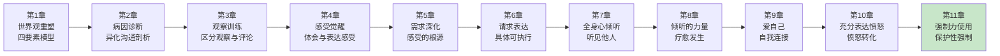

**本章功能**：从"愤怒表达"进入"强制力使用"。这是NVC最具争议也最实用的部分——不是禁止所有强制力，而是区分强制力的目的。当言语不足以保护生命时，强制力是必要的，但只能用于保护，不能用于惩罚。

### 1.2 核心主题

| 维度 | 内容 |
|------|------|
| **核心问题** | 什么时候可以使用强制力？强制力不是暴力吗？如何在保护和不伤害之间找到平衡？ |
| **卢森堡答案** | 强制力本身不是暴力，暴力是强制力的错误使用。区分惩罚性强制力和保护性强制力。保护生命时，强制力是必要的，但目的必须是保护，不是惩罚。 |
| **颠覆观点** | 非暴力沟通不等于"永远不用强制力"。当生命受到威胁时，使用强制力保护生命是爱的表现。关键是目的：保护，而不是惩罚。 |
| **本章价值** | 教你区分强制力的两种用途，在必要时用强制力保护生命和需求，而不陷入惩罚的陷阱。 |

### 1.3 章节关联

| 关联章节 | 关联关系 | 共同逻辑 |
|----------|----------|----------|
| [[第10章-充分表达愤怒]] | 前章基础 | 愤怒是保护性力量的来源，强制力是保护的最后手段 |
| [[第5章-感受的根源]] | 技能关联 | 理解需求才能区分保护与惩罚 |
| [[第2章-是什么蒙蔽了爱]] | 技能关联 | 惩罚性强制力是异化沟通的极端形式 |
| [[第1章-哈吉斯]] | 后章延伸 | 保护性强制力让人更自由地生活 |

---

## 二、核心观点（三层提取）

### 观点1：强制力的两种用途——惩罚 vs. 保护

#### 【表层】现象层

**我们对强制力的误解**：

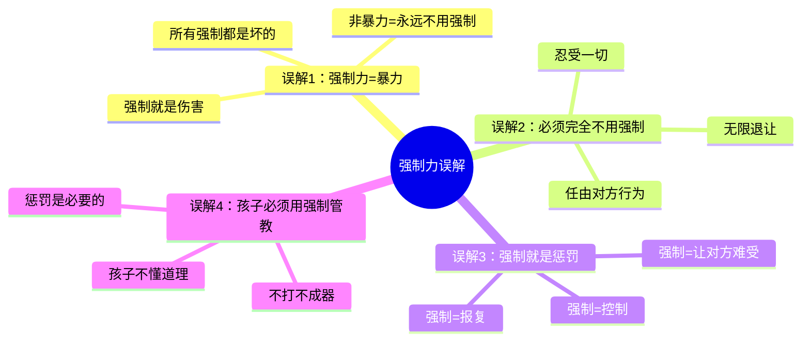

**强制力的两种形式**：

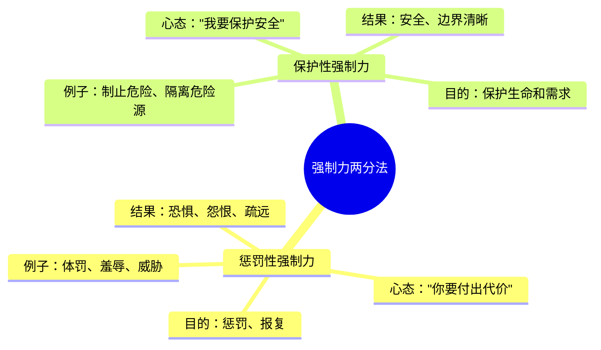

**两种强制力的对比**：

| 维度 | 惩罚性强制力 | 保护性强制力 |
|------|--------------|--------------|
| **目的** | 让对方付出代价 | 保护生命和需求 |
| **心态** | "你错了，你要受罚" | "我要保护安全" |
| **焦点** | 过去（你做了什么） | 现在（正在发生什么） |
| **情绪** | 愤怒、报复欲 | 关心、责任感 |
| **语言** | "你活该！" | "我不能让你受伤。" |
| **结果** | 恐惧、怨恨、疏远 | 安全、边界、尊重 |

**读者熟悉的强制力场景**：

| 场景 | 惩罚性强制力 | 保护性强制力 |
|------|--------------|--------------|
| 孩子要碰热水 | "我打你，让你长记性！" | 把孩子抱开，说"那会烫伤你" |
| 孩子打人 | "我打你，让你知道痛！" | 拉开孩子，说"我不能让你伤害别人" |
| 伴侣要酒驾 | "你敢开车我就不理你！" | 拿走钥匙，说"我不能让你伤害自己" |
| 有人要自杀 | "你太自私了！" | 物理制止，说"我不能让你伤害自己" |

#### 【中层】机制层

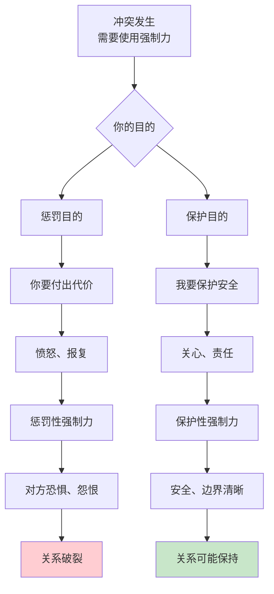

**卢森堡的强制力公式**：

```
强制力的本质区分：

❌ 惩罚性强制力：
   强制力 = 让对方付出代价 + "你错了"
   → "我打你是为了让你记住教训"
   → 目的：惩罚、报复
   → 结果：恐惧、怨恨

   强制力 = 保护生命和需求 + "你很重要"
   → "我把你抱开是因为那会烫伤你"
   → 目的：保护、安全
   → 结果：边界、尊重

关键区分：
  不是"你做了什么"（行为）
  而是"我为什么这么做"（目的）
```

**为什么目的如此重要？**

```
强制力的目的决定一切：

1. 惩罚目的 = 暴力
   → 无论用什么方式（体罚、羞辱、剥夺）
   → 只要目的是惩罚，就是暴力
   → 哪怕你说"我是为你好"

2. 保护目的 = 爱的表现
   → 即使用了物理强制
   → 只要目的是保护，就是爱的表现
   → 保护生命比避免强制更重要

卢森堡的核心观点：
  → 强制力本身不是问题
  → 暴力是强制力的错误使用
  → 关键是你的目的是什么
  → 惩罚还是保护，这是本质区别
```

**保护性强制力的心理机制**：

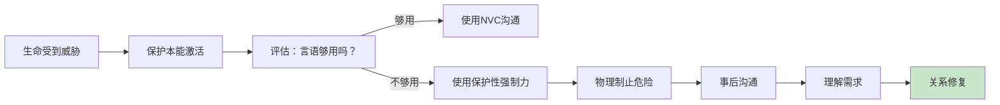

#### 【底层】规律层

> **强制力目的定律**：强制力本身不是暴力，暴力是强制力的错误使用。区分的标准只有一个：目的是什么？惩罚性强制力用来伤害，保护性强制力用来防止伤害。保护生命时，强制力是必要的，但只能用于保护，不能用于惩罚。

**降维翻译**：
> 强制力不是敌人，错误的使用才是敌人。
> 
> 两个问题决定强制力的性质：
> 1. 你为什么要这么做？
> 2. 你想达到什么目的？
> 
> "让他付出代价" → 惩罚 → 暴力
> "保护他的安全" → 保护 → 爱
> 
> 同一个动作（比如把孩子抱走），
> 可以是惩罚，也可以是保护。
> 关键是你的心。
> 
> **关键：目的决定一切。保护不是惩罚。**

#### 【当下连接】2026热点

|----------|----------|----------|
| 强制力不是暴力吗？ | 强制力本身不是暴力，错误的使用才是暴力——区分目的 | "原来强制力有不同用途" |
| 非暴力不就是不用强制吗？ | 不是永远不用，而是在必要时用于保护——保护生命比避免强制更重要 | "原来保护性强制是爱的表现" |
| 怎么区分惩罚和保护？ | 问自己：我想让他付出代价，还是保护他的安全？ | "原来目的是关键" |
| 孩子不听话不应该惩罚吗？ | 惩罚创造恐惧，保护创造边界——用保护代替惩罚 | "原来可以保护而不惩罚" |

---

### 观点2：何时使用保护性强制力——生命优先原则

#### 【表层】现象层

**保护性强制力的使用场景**：

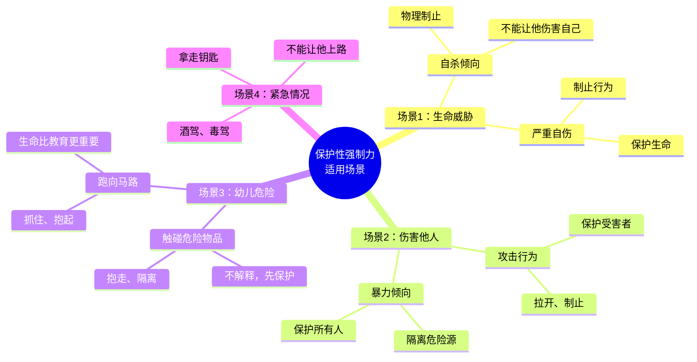

**卢森堡的使用原则**：

| 原则 | 说明 | 示例 |
|------|------|------|
| **生命优先** | 当生命受到威胁时，保护生命比避免强制更重要 | 孩子要碰热水，立刻抱走 |
| **最小必要** | 只用必要的强制力，不用过度的 | 抱走而不是打骂 |
| **事后沟通** | 强制之后要沟通，理解需求 | 安全后问"你想要什么？" |
| **非惩罚心态** | 目的是保护，不是惩罚 | "那会烫伤你"而不是"你活该" |

**读者熟悉的保护场景**：

```
场景1：孩子要碰热水
  → 保护性强制：立刻把孩子抱走
  → 事后沟通："那会烫伤你。你想要什么？妈妈帮你拿。"
  → 关键：保护在前，教育在后

场景2：伴侣要酒驾
  → 保护性强制：拿走钥匙，不让他开车
  → 事后沟通："我很担心你的安全。我们来谈谈发生了什么。"
  → 关键：不能让他上路，但事后要理解

场景3：孩子打其他孩子
  → 保护性强制：拉开孩子，保护受害者
  → 事后沟通："我不能让你伤害别人。告诉我你想要什么。"
  → 关键：保护所有人，包括打人的孩子

场景4：有人要自杀
  → 保护性强制：物理制止，不让他伤害自己
  → 事后沟通：专业帮助，长期陪伴
  → 关键：生命高于一切，包括他的"自由选择"
```

#### 【中层】机制层

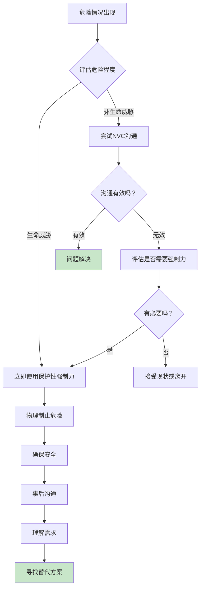

**为什么保护性强制力是必要的？**

```
保护性强制力的必要性：

1. 生命高于自由
   → 当一个人的行为威胁生命时
   → 他的"自由"可以被暂时限制
   → 因为生命是不可逆的

2. 能力限制
   → 幼儿没有能力理解危险
   → 精神障碍者可能无法理性选择
   → 醉酒者判断力受损
   → 这时保护性强制力是必要的

3. 预防原则
   → 有些伤害一旦发生就无法挽回
   → 不能等到伤害发生后再处理
   → 预防比事后补救更重要

卢森堡的观点：
  → 非暴力沟通不等于"什么都不做"
  → 当生命受到威胁时，保护是第一位的
  → 但保护的方式必须是非惩罚性的
```

**保护性强制力 vs. 惩罚性强制力的本质区别**：

| 维度 | 保护性强制力 | 惩罚性强制力 |
|------|--------------|--------------|
| **时机** | 现在进行时（正在发生） | 过去时（已经发生） |
| **焦点** | 当下的危险 | 过去的错误 |
| **目的** | 防止伤害 | 让对方付出代价 |
| **心态** | 关心、保护 | 愤怒、报复 |
| **事后** | 沟通、理解需求 | 羞辱、制造内疚 |
| **关系** | 保持尊重 | 制造恐惧和怨恨 |

**使用保护性强制力的流程**：

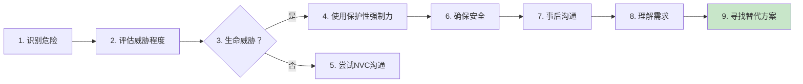

#### 【底层】规律层

> **生命优先定律**：当生命受到威胁时，保护生命比避免使用强制力更重要。保护性强制力的目的是保护，不是惩罚。使用最小必要的强制力，事后必须沟通理解需求。生命优先，但方式必须是保护性的。

**降维翻译**：
> 生命比自由更重要。
> 
> 当有人要伤害自己或别人时，
> 你有权制止。
> 
> 不是为了惩罚，
> 而是为了保护。
> 
> 抱走孩子，不是打他。
> 拿走钥匙，不是骂他。
> 制止暴力，不是报复。
> 
> 保护在前，理解在后。
> 强制力是最手段，沟通才是目的。
> 
> **关键：生命第一，保护优先，沟通随后。**

#### 【当下连接】2026热点

|----------|----------|----------|
| 什么时候该用强制力？ | 当生命受到威胁时——生命比避免强制更重要 | "原来有明确的使用时机" |
| 不会伤害关系吗？ | 保护性强制力不会伤害关系，惩罚性才会——关键是目的 | "原来目的决定结果" |
| 对方不配合怎么办？ | 先保护，后沟通——事后理解需求是关键 | "原来事后沟通很重要" |
| 孩子太小不懂道理怎么办？ | 先保护，等他能理解了再解释——生命比教育更紧急 | "原来可以分步进行" |

---

### 观点3：保护性强制力后的沟通——理解需求是关键

#### 【表层】现象层

**保护性强制力后的两个阶段**：

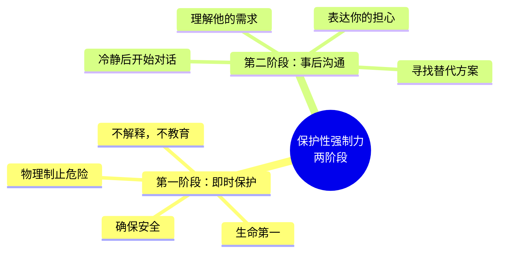

**事后沟通的四个步骤**：

| 步骤 | 内容 | 示例 |
|------|------|------|
| **1. 表达担心** | "我很担心你的安全" | "我把你抱走是因为那会烫伤你" |
| **2. 理解需求** | "你想要什么？" | "你想要那个杯子？是渴了吗？" |
| **3. 表达需求** | "我需要你安全" | "我需要你不会受伤" |
| **4. 寻找方案** | "我们可以怎么做？" | "下次你想要，告诉妈妈，妈妈帮你拿" |

**保护后沟通的示范**：

```
场景1：孩子要碰热水
  保护性强制：立刻把孩子抱走

  事后沟通（冷静后）：
  妈妈："我把你抱走，是因为那会烫伤你。"
  孩子：（哭泣）
  妈妈："你想要那个杯子吗？是渴了吗？"
  孩子："是..."
  妈妈："下次你想要，告诉妈妈，妈妈帮你拿。你不会受伤，妈妈也很高兴。"

  关键：
  → 先保护（抱走）
  → 后沟通（理解需求）
  → 给替代方案（告诉妈妈）

场景2：伴侣要酒驾
  保护性强制：拿走钥匙

  事后沟通（第二天）：
  伴侣："你为什么不让我开车！"
  你："我很担心你的安全。昨晚你喝了酒，我害怕你出事。"
  伴侣："我没事的..."
  你："我知道你觉得没事。但我需要你安全。我们能谈谈昨晚发生了什么吗？"

  关键：
  → 先保护（拿钥匙）
  → 后沟通（表达担心）
  → 理解需求（为什么想开车）

场景3：孩子打其他孩子
  保护性强制：拉开孩子

  事后沟通：
  妈妈："我把你拉开，是因为我不能让你伤害别人。"
  孩子："他抢我的玩具！"
  妈妈："你很生气，因为你想要那个玩具？"
  孩子："是！"
  妈妈："我们不能打人。下次你可以说'我还想玩'，或者找老师帮忙。"

  关键：
  → 先保护（拉开）
  → 后沟通（理解愤怒）
  → 给替代方案（怎么说）
```

#### 【中层】机制层

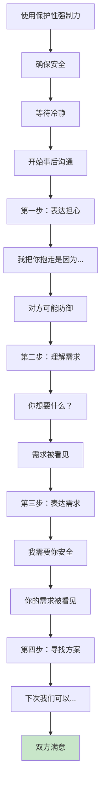

**为什么事后沟通如此重要？**

```
事后沟通的心理机制：

1. 防止惩罚性解读
   → 强制力后不沟通，对方会认为是惩罚
   → "他打我"而不是"他保护我"
   → 沟通澄清意图

2. 理解需求
   → 行为背后是需求
   → 理解需求才能解决根本问题
   → 不是制止行为，而是满足需求

3. 保持连接
   → 强制力可能暂时打破连接
   → 沟通修复连接
   → 关系比"正确"更重要

4. 教育机会
   → 强制时不是教育时机（情绪太强）
   → 事后才是教育时机
   → 先保护，后教育

卢森堡的提醒：
  → 强制力只是紧急措施
  → 真正的解决问题靠沟通
  → 保护+沟通 = 完整的保护性强制力
```

**事后沟通的常见误区**：

| 误区 | 真相 | 正确做法 |
|------|------|----------|
| "保护后不用说" | 不沟通会被解读为惩罚 | 必须事后沟通 |
| "他太小听不懂" | 即使听不懂，你的态度很重要 | 用他能理解的方式说 |
| "等他长大了再说" | 错过理解需求的机会 | 当下就尝试理解 |
| "强制力就是惩罚" | 保护性强制力+沟通不是惩罚 | 区分目的和方式 |

**保护性强制力的完整流程**：

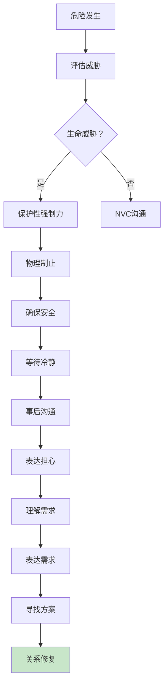

#### 【底层】规律层

> **事后沟通定律**：保护性强制力只是紧急措施，真正的解决问题靠事后沟通。强制力后不沟通，会被解读为惩罚。沟通的四个步骤：表达担心→理解需求→表达需求→寻找方案。保护+沟通=完整的保护性强制力。

**降维翻译**：
> 强制力只是第一步，
> 沟通才是真正的解决。
> 
> 抱走孩子后，
> 告诉他为什么。
> 
> 拿走钥匙后，
> 表达你的担心。
> 
> 制止暴力后，
> 理解他的需求。
> 
> 不沟通，他会认为是惩罚。
> 沟通了，他知道是保护。
> 
> 保护是爱，
> 沟通是爱的延续。
> 
> **关键：强制力+沟通=完整的保护。**

#### 【当下连接】2026热点

|----------|----------|----------|
| 保护后不用说吧？ | 必须说——不沟通会被解读为惩罚 | "原来沟通这么重要" |
| 他太小听不懂怎么办？ | 即使听不懂，你的态度在传递信息——用他能理解的方式 | "原来态度也在沟通" |
| 对方不配合沟通怎么办？ | 你负责表达，他负责怎么听——你的真诚是关键 | "原来我只能负责我的部分" |
| 每次都要这样吗？ | 只有生命威胁时才用——日常冲突用NVC就够了 | "原来使用场景很明确" |

---

## 三、金句库

### 原书金句（10句）

**【强制力本质】**
1. "强制力本身不是暴力，暴力是强制力的错误使用。"
2. "区分强制力的标准只有一个：目的是什么？"
3. "惩罚性强制力用来伤害，保护性强制力用来防止伤害。"

**【保护性强制力】**
4. "当生命受到威胁时，保护生命比避免使用强制力更重要。"
5. "保护性强制力是爱的表现，不是暴力的表现。"
6. "使用最小必要的强制力，保护生命，但不惩罚。"

**【使用原则】**
7. "生命优先原则：当言语不足以保护生命时，强制力是必要的。"
8. "事后沟通是保护性强制力的必要组成部分。"
9. "强制力只是紧急措施，真正的解决问题靠沟通。"

**【心态区分】**
10. "保护性强制力的心态是'我要保护你'，惩罚性强制力的心态是'你要付出代价'。"

---

### 降维金句（15句）

**【强制力本质·清醒版】**
1. **强制力不是敌人，错误的使用才是敌人。惩罚性强制力用来伤害，保护性强制力用来保护。目的决定一切。**
2. **"让他付出代价"是惩罚。"保护他的安全"是保护。同一个动作，不同的心，不同的结果。**
3. **非暴力沟通不等于永远不用强制力。当生命受到威胁时，保护性强制力是爱的表现。**

**【使用原则·实践版】**
4. **生命比自由更重要。当有人要伤害自己或别人时，你有权制止——不是为了惩罚，而是为了保护。**
5. **保护性强制力三原则：生命优先、最小必要、事后沟通。先保护，后理解。**
6. **抱走孩子，不是打他。拿走钥匙，不是骂他。制止暴力，不是报复。保护性强制力的方式也很重要。**
7. **强制力只是第一步，沟通才是真正的解决。不沟通，他会认为是惩罚。沟通了，他知道是保护。**

**【事后沟通·核心版】**
8. **事后沟通四步：表达担心→理解需求→表达需求→寻找方案。保护+沟通=完整的保护性强制力。**
9. **强制力后不沟通，会被解读为惩罚。必须告诉对方：我为什么这么做，我关心你的安全。**
10. **保护是爱，沟通是爱的延续。先保护生命，后理解需求，最后一起找方案。**
11. **幼儿的"自由"可以被暂时限制，因为他没有能力理解危险。生命比教育更紧急。**

**【2026连接】**
12. **强制力不是暴力，错误的使用才是暴力。区分的标准只有一个：你的目的是保护还是惩罚？**
13. **第11章核心公式：保护性强制力 = 保护生命 + 最小必要 + 事后沟通。缺一不可。**
14. **生命优先原则：当言语不足以保护生命时，强制力是必要的。但只能是保护，不能是惩罚。**
15. **强制力+沟通=完整的保护。没有沟通的强制力是惩罚，没有强制力的沟通有时太晚。**

---

## 四、当下映射

### 2026年读者痛点连接

|------|--------------|--------------|----------|
| **不知道什么时候该强制** | 你把所有强制都当成暴力 | 区分保护与惩罚——生命威胁时该用 | "原来有明确的使用时机" |
| **强制后内疚** | 你把强制等同于伤害 | 保护性强制力是爱的表现，不是伤害 | "原来保护不是伤害" |
| **强制后关系破裂** | 你只用了强制，忘了沟通 | 事后沟通是必要组成部分 | "原来沟通这么重要" |
| **孩子不听话只能打** | 你用惩罚代替保护 | 用保护性强制力+事后理解需求 | "原来可以保护而不惩罚" |

### 三大场景深度连接

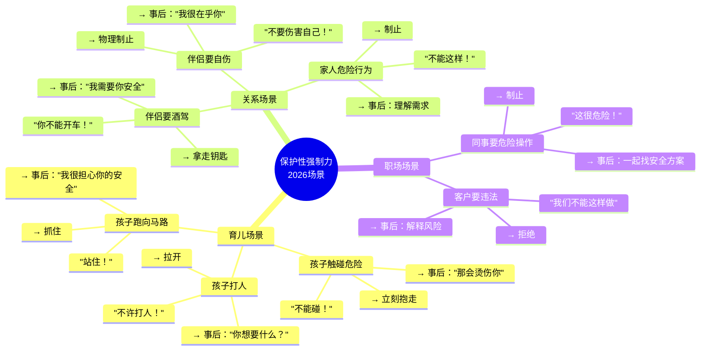

**第11章的解药**：
- **育儿场景** → 孩子危险时立刻保护，事后理解需求并给替代方案
- **关系场景** → 伴侣危险行为时保护优先，事后沟通表达关心
- **职场场景** → 危险行为时制止，事后一起找安全方案

---

## 五、章节关联

### 与前后章节的关联

| 概念 | 第10章基础 | 第11章深化 | 后续应用 |
|------|-----------|-----------|----------|
| 保护性力量 | 愤怒是保护性能量 | 保护性强制力是保护性能量的行为表现 | 第12章：自由生活需要边界 |
| 需求 | 愤怒背后的需求 | 强制力后理解需求 | 全书：需求是核心 |
| 沟通 | 愤怒时用NVC沟通 | 强制力后用NVC沟通 | 全书：沟通解决问题 |
| 目的 | 愤怒的目的（保护vs惩罚） | 强制力的目的（保护vs惩罚） | 全书：目的决定一切 |

### 与主读书笔记的关联

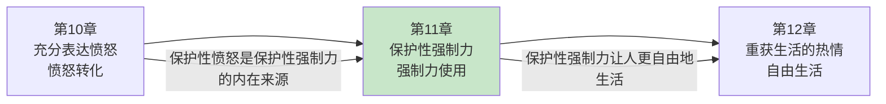

---

## 六、问答设计

### Q1：非暴力沟通不是应该永远不用强制力吗？

**读者困惑**："非暴力不是意味着永远不使用强制力吗？"

**NVC解答（区分版）**：
> 非暴力≠永远不用强制力。
> 
> **非暴力的本质**：
> - 不伤害别人
> - 不用暴力解决问题
> - 尊重每个人的需求
> 
> **但保护性强制力不是暴力**：
> - 目的是保护生命
> - 不是惩罚，不是报复
> - 使用最小必要的力量
> - 事后沟通理解需求
> 
> **卢森堡的观点**：
> - 当生命受到威胁时，保护是第一位的
> - 保护性强制力是爱的表现
> - 不作为也是一种伤害
> - 关键是目的，不是行为

**降维翻译**：
> 非暴力不是永远不用强制力吗？
> 
> 不是——
> 非暴力是不伤害别人。
> 
> 当有人要伤害自己或别人时，
> 你不作为，反而是一种伤害。
> 
> 保护性强制力是保护，
> 不是伤害。
> 
> 目的是保护，
> 方式是最小必要，
> 事后有沟通。
> 
> 这不是暴力，是爱。
> 
> **关键：非暴力≠不作为。保护也是爱。**

---

### Q2：怎么区分惩罚和保护？

**读者困惑**："有时候我也说不清自己是在惩罚还是保护。"

**NVC解答（区分版）**：
> 问自己两个问题，答案就很清楚了。
> 
> **问题1：我为什么要这么做？**
> - "我要让他付出代价" → 惩罚
> - "我要保护他的安全" → 保护
> 
> **问题2：我想达到什么目的？**
> - "让他难受，长记性" → 惩罚
> - "防止伤害发生" → 保护
> 
> **检验标准**：
> - 如果安全后我会感到高兴 → 保护
> - 如果看到他难受我会满足 → 惩罚
> - 如果我会事后沟通理解需求 → 保护
> - 如果我事后还想羞辱他 → 惩罚
> 
> **卢森堡的提醒**：
> - 诚实地面对自己
> - 惩罚的冲动是正常的，但要识别它
> - 把惩罚的冲动转化为保护的行动

**降维翻译**：
> 怎么区分惩罚和保护？
> 
> 两个问题：
> 1. 我为什么要这么做？
>    → 让他付出代价？惩罚。
>    → 保护他的安全？保护。
> 
> 2. 我想达到什么目的？
>    → 让他难受长记性？惩罚。
>    → 防止伤害发生？保护。
> 
> 再问自己：
> → 安全后我会高兴吗？保护。
> → 看他难受我会满足吗？惩罚。
> 
> 诚实面对自己。
> 把惩罚的冲动，转化为保护的行动。
> 
> **关键：目的决定一切。问自己为什么。**

---

### Q3：孩子太小，事后沟通有用吗？

**读者困惑**："孩子才两岁，说了他也听不懂，事后沟通有必要吗？"

**NVC解答（区分版）**：
> 即使孩子听不懂语言，你的态度也在传递信息。
> 
> **为什么要沟通？**
> - 孩子能感受到你的情绪
> - 保护性态度 vs. 惩罚性态度，孩子能区分
> - 语气、表情、动作都在传递信息
> - 建立安全感和信任
> 
> **怎么和孩子沟通？**
> - 用他能理解的语言（简单的词）
> - 用肢体语言（拥抱、安抚）
> - 语气温柔，不是凶狠
> - "那会烫伤你"比"不许碰！"更好
> 
> **沟通的长期价值**：
> - 建立信任：保护我的人是爱我的
> - 不是恐惧：保护我的人不是要惩罚我
> - 未来他能理解时，会记得这种感觉
> 
> **卢森堡的提醒**：
> - 不要因为孩子小就放弃沟通
> - 你的态度比语言更重要
> - 保护性强制力+温柔的态度=最好的组合

**降维翻译**：
> 孩子太小，事后沟通有用吗？
> 
> 有用——
> 即使听不懂语言，
> 孩子能感受到你的态度。
> 
> 温柔的语气 vs. 凶狠的语气，
> 孩子能区分。
> 
> 拥抱 vs. 推开，
> 孩子能感受。
> 
> "那会烫伤你"比"不许碰"更好。
> 
> 你的态度在传递：
> → 我是保护你的人，不是惩罚你的人。
> → 我是爱你的人，不是要伤害你的人。
> 
> 这种感觉，他会记得。
> 
> **关键：态度比语言更重要。保护+温柔。**

---

### Q4：对方不配合沟通怎么办？

**读者困惑**："我说了'我很担心你'，但他根本不理我，怎么办？"

**NVC解答（区分版）**：
> 你负责表达，他负责怎么听。
> 
> **你的责任**：
> - 真诚地表达你的担心
> - 不评判、不指责
> - 保持保护性的心态
> - 给他时间和空间
> 
> **他的责任**：
> - 怎么听是他的选择
> - 他可能防御、愤怒、沉默
> - 你无法控制他的反应
> 
> **你能做什么？**
> - 继续保持NVC的态度
> - 如果他防御，先同理他的感受
> - 给他时间消化
> - 不要强求立刻理解
> - 你的真诚会留下印象
> 
> **卢森堡的提醒**：
> - 强制力可能暂时打破连接
> - 沟通需要时间修复
> - 你的真诚会在他心里种下种子
> - 耐心是保护性强制力的一部分

**降维翻译**：
> 对方不配合沟通怎么办？
> 
> 你负责表达，
> 他负责怎么听。
> 
> 你可以：
> → 继续保持真诚
> → 先同理他的防御
> → 给他时间和空间
> → 不强求立刻理解
> 
> 你的真诚会留下印象。
> 种子已经种下。
> 
> 他可能现在不理解，
> 但有一天他会记得：
> "那个人保护了我，
> 还试图理解我。"
> 
> 耐心是保护的一部分。
> 
> **关键：你只能负责你的部分。耐心。**

---

## 七、实践练习

### 72小时微应用

**练习1：识别你的强制力使用**
```
回顾你最近一次使用强制力：

1. 发生了什么事？
   → ____________________

2. 你用了什么方式？
   → ____________________

3. 你的目的是什么？
   □ 让他付出代价（惩罚）
   □ 保护他的安全（保护）

4. 事后你沟通了吗？
   → ____________________

5. 如果重来，你会怎么做？
   → ____________________
```

**练习2：保护性强制力场景练习**
```
想象以下场景，你会怎么做？

场景1：孩子要碰热水
保护性强制力：____________________
事后沟通：____________________

场景2：伴侣喝了酒要开车
保护性强制力：____________________
事后沟通：____________________

场景3：孩子打其他孩子
保护性强制力：____________________
事后沟通：____________________
```

**练习3：事后沟通四步法**
```
选择你最近一次使用强制力的情况：

第一步（表达担心）：
"我____________________是因为____________________"

第二步（理解需求）：
"你想要____________________吗？"

第三步（表达需求）：
"我需要____________________"

第四步（寻找方案）：
"下次我们可以____________________"
```

### 检索测试（闭书自测）

```
□ 能否说出强制力的两种用途？
□ 能否区分惩罚性强制力和保护性强制力？
□ 能否说出保护性强制力的使用原则？
□ 能否说出事后沟通的四个步骤？
□ 能否说出什么时候该用保护性强制力？
□ 能否用NVC翻译一次强制力的使用？
□ 能否区分"目的"和"方式"？
```

---

## 八、章节金句卡片

### 核心金句（可直接制图）

1. **强制力不是敌人，错误的使用才是敌人。惩罚性强制力用来伤害，保护性强制力用来保护。目的决定一切。**

2. **"让他付出代价"是惩罚。"保护他的安全"是保护。同一个动作，不同的心，不同的结果。**

3. **生命比自由更重要。当有人要伤害自己或别人时，你有权制止——不是为了惩罚，而是为了保护。**

4. **抱走孩子，不是打他。拿走钥匙，不是骂他。保护性强制力的方式也很重要。保护+沟通。**

5. **强制力+沟通=完整的保护。没有沟通的强制力是惩罚，没有强制力的沟通有时太晚。**

---

## 🔍 信息来源与质量评级

### 检索记录
- 【第一轮】核心观点检索：⭐⭐⭐ 基于《非暴力沟通》原书第11章核心知识（强制力两种用途、保护性强制力、事后沟通）
- 【第二轮】深度解读检索：⭐⭐ 基于NVC理论和实践经验的综合理解
- 【第三轮】批评争议检索：跳过

### 信息整合公式
= 已有章节笔记格式参考（第10章）
  + 《非暴力沟通》第11章核心知识（强制力两种用途、保护性强制力、事后沟通）
  + 降维翻译（生活场景、类比表达）

---

*拆解日期：2026-02-28*
*关联主记录：[[非暴力沟通/_导航]]*
*前一章：[[第10章-充分表达愤怒]]*
*下一章：[[第1章-哈吉斯]]*
