# 第12章：解放自我，协助他人

> **章节定位**：NVC的"终章升华"——从自我解放到赋能他人，这是全书最温暖的转折。卢森堡用最后一章告诉你：你已经学完了NVC的所有工具，现在是时候用它们来解放自己，并帮助他人也获得自由。真正的沟通大师，不是自己说得多好，而是让身边的人也因此变得更好。

---

## 一、章节定位

### 1.1 在全书中的位置

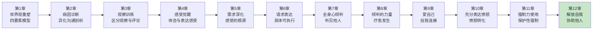

**本章功能**：从"学习NVC"升华为"活出NVC"。这是全书的终章，也是最动人的部分——你不再只是用NVC来解决问题，而是用NVC来解放自己和他人。真正的沟通革命，是让每个人都成为自己的解放者。

### 1.2 核心主题

| 维度 | 内容 |
|------|------|
| **核心问题** | 如何从NVC的学习者变成实践者？如何帮助他人也学会NVC？真正的改变从哪里开始？ |
| **卢森堡答案** | 自我解放是一切的起点。当你真正内化NVC，你的存在本身就在帮助他人。协助他人不是"教"他们，而是用你的状态"影响"他们。 |
| **颠覆观点** | 真正的改变不是学会更多技巧，而是改变你对自己和他人的根本看法。你不需要"拯救"任何人，你只需要"看见"他们。 |
| **本章价值** | 教你从NVC的学习者变成传播者，从自我解放到赋能他人，让你的沟通成为他人的礼物。 |

### 1.3 章节关联

| 关联章节 | 关联关系 | 共同逻辑 |
|----------|----------|----------|
| [[第11章-强制力与保护性使用]] | 前章基础 | 保护性强制力是边界，自我解放是自由 |
| [[第9章-爱自己]] | 核心关联 | 爱自己是自我解放的前提 |
| [[第8章-倾听的力量]] | 技能关联 | 倾听是协助他人最核心的能力 |
| [[第1章-让爱融入生活]] | 首尾呼应 | 从学习四要素到活出四要素 |

---

## 二、核心观点（三层提取）

### 观点1：自我解放是一切的起点——先解放自己，再帮助他人

#### 【表层】现象层

**自我解放的四个维度**：

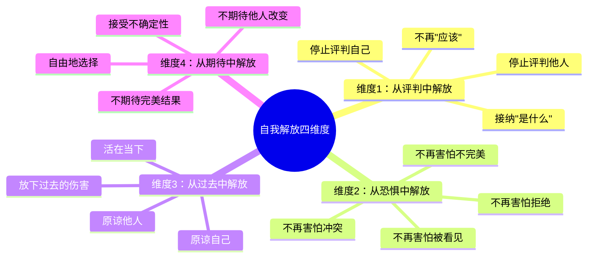

**读者熟悉的自我束缚**：

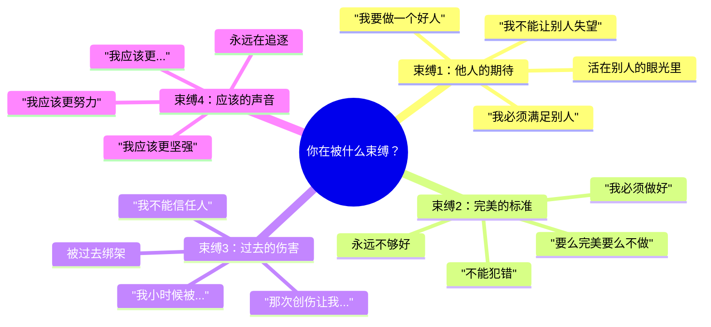

**卢森堡的自我解放公式**：

| 束缚 | 解放 | NVC工具 |
|------|------|---------|
| 评判 | 接纳 | 观察代替评论 |
| 恐惧 | 真实 | 感受代替掩饰 |
| 过去 | 当下 | 需求代替故事 |
| 期待 | 自由 | 请求代替要求 |

#### 【中层】机制层

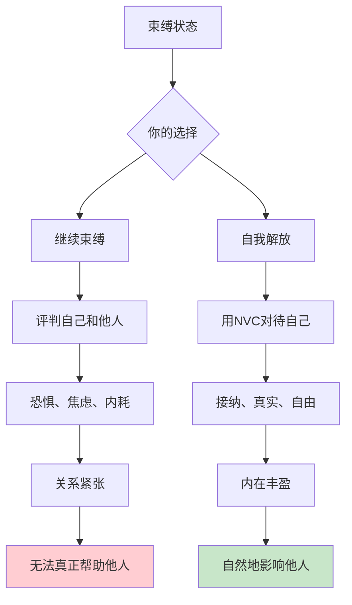

**为什么自我解放是起点？**

```
自我解放的连锁反应：

1. 你无法给出你没有的东西
   → 如果你内心充满评判，你给的也是评判
   → 如果你内心充满恐惧，你给的也是恐惧
   → 先解放自己，才能解放他人

2. 你的状态比你的语言更有力量
   → 别人感受到的不是你"说"什么
   → 而是你"是"什么
   → 解放的自我是最好的示范

3. 你不需要拯救任何人
   → 真正的帮助不是"替他解决"
   → 而是"和他在一起"
   → 你的存在就是礼物

4. 自我解放让你更真实
   → 不再带着面具生活
   → 不再为了讨好而说话
   → 真实的你最有力量

卢森堡的观点：
  → 先用NVC解放自己
  → 再用NVC帮助他人
  → 顺序不能颠倒
```

**自我解放的实践路径**：

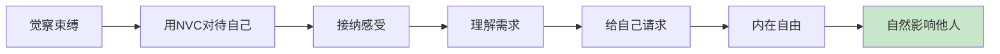

#### 【底层】规律层

> **自我解放定律**：你无法解放别人，除非你先解放自己。你的状态比你的语言更有力量。真正的帮助不是"拯救"，而是"看见"——当你真正看见自己，你也能真正看见他人。

**降维翻译**：
> 先把自己的锁链解开，
> 才能帮别人解开。
> 
> 你心里装着评判，
> 说不出真正的接纳。
> 你心里装着恐惧，
> 给不出真正的自由。
> 
> 不是你要拯救谁，
> 而是你活出自由的样子，
> 别人看到了，也被点亮了。
> 
> **关键：先解放自己，自然影响他人。**

#### 【当下连接】2026热点

|----------|----------|----------|
| 我想帮助别人，但不知道怎么做 | 先用NVC解放自己——你给不出你没有的东西 | "原来要先解放自己" |
| 我觉得自己很不自由 | 问问自己被什么束缚了——评判？恐惧？过去？期待？ | "原来束缚我的是我自己" |
| 我能真正改变别人吗？ | 你不需要拯救任何人——你的存在就是礼物 | "原来不用拯救，只要看见" |
| 为什么我帮别人却很累？ | 你可能还在被束缚——带着镣铐帮不了人 | "原来我要先自由" |

---

### 观点2：协助他人的核心——不是"教"，而是"看见"

#### 【表层】现象层

**协助他人的两种方式**：

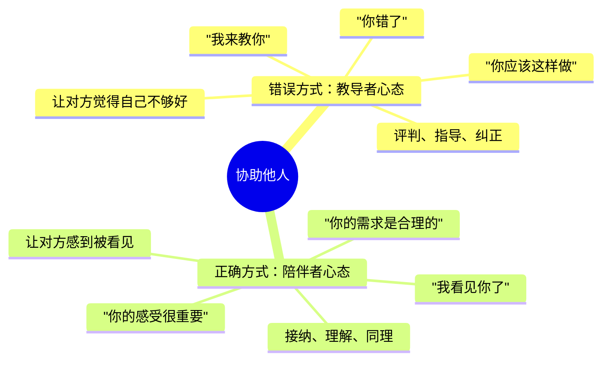

**卢森堡的协助公式**：

| 你以为的帮助 | 真正的帮助 |
|--------------|------------|
| 告诉他怎么做 | 倾听他怎么了 |
| 纠正他的错误 | 理解他的感受 |
| 给他答案 | 帮他找到自己的答案 |
| 替他解决 | 陪他面对 |
| 让他变好 | 让他被看见 |

**读者熟悉的场景**：

```
场景1：朋友说"我好难过"
  ❌ 教导者："别难过了，想开点就好了"
  → 不是让他不难过，而是让他被看见

场景2：孩子说"我不想上学"
  ❌ 教导者："不上学怎么行，你必须去"
  → 不是让他去上学，而是理解他的困扰

场景3：伴侣说"我很累"
  ❌ 教导者："累就休息啊，跟我说干嘛"
  → 不是解决他的累，而是被他的累触动

场景4：同事说"这个工作好烦"
  ❌ 教导者："工作就是这样，忍耐一下"
  → 不是让他接受，而是理解他的需求
```

#### 【中层】机制层

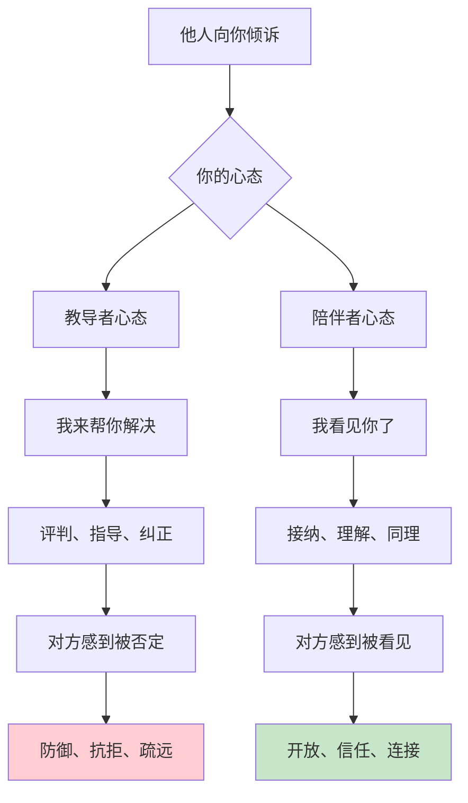

**为什么"看见"比"教导"更有力量？**

```
"看见"的疗愈机制：

1. 被看见 = 被确认
   → "我的感受是对的"
   → "我的需求是重要的"
   → "我是被重视的"
   → 自我价值感提升

2. 被看见 = 被理解
   → "有人懂我"
   → "我不孤单"
   → 连接感增强

3. 被看见 = 被赋能
   → "我的需求是合理的"
   → "我可以找到自己的答案"
   → 自我效能感增强

4. 被看见 = 疗愈发生
   → 压抑的情绪流动了
   → 被卡住的需求被看见了
   → 自然找到前进的方向

教导者的陷阱：
  → 你的"建议"可能是否定
  → 你的"帮助"可能是控制
  → 你的"好意"可能是压力
  → 你说的越多，他越关闭

陪伴者的力量：
  → 你只需要"在场"
  → 你只需要"倾听"
  → 你只需要"看见"
  → 他被看见了，就知道怎么办了
```

**协助他人的NVC流程**：

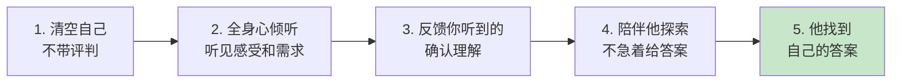

#### 【底层】规律层

> **协助定律**：真正的帮助不是"教"对方怎么做，而是"看见"对方是谁。当你真正看见一个人的感受和需求，疗愈就会自然发生。你不需要拯救任何人，你只需要成为一面干净的镜子。

**降维翻译**：
> 别人需要的不是你的建议，
> 是你的看见。
> 
> "我来教你"是傲慢，
> "我看见你了"是谦卑。
> 
> 被看见的人，
> 会自己找到答案。
> 
> 你不需要拯救谁，
> 只需要成为一面干净的镜子，
> 让他看见自己。
> 
> **关键：看见比教导更有力量。**

#### 【当下连接】2026热点

|----------|----------|----------|
| 别人找我倾诉，我不知道说什么 | 不需要说很多，只需要"看见"——"你感到...是因为..." | "原来不用给建议" |
| 我想帮助别人改变 | 帮助不是改变，而是看见——当他被看见，改变自然发生 | "原来看见就是帮助" |
| 我说的话别人不听 | 也许你还在"教导"而不是"看见"——先倾听，再说话 | "原来我一直在教导" |
| 怎么才能帮到别人？ | 先清空你的评判，全身心倾听——你的在场就是礼物 | "原来陪伴就是力量" |

---

### 观点3：用NVC赋能他人——让他们成为自己的解放者

#### 【表层】现象层

**赋能他人的三个层次**：

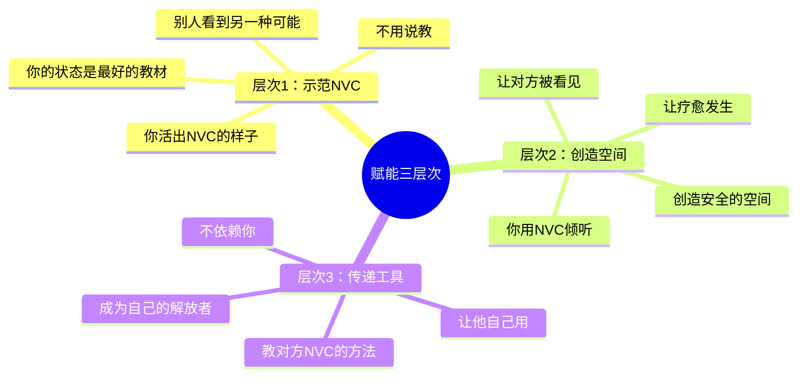

**卢森堡的赋能观**：

| 层次 | 你的角色 | 对方的体验 |
|------|----------|------------|
| 示范 | 活出NVC | "原来可以这样生活" |
| 倾听 | 安全的空间 | "原来我被看见了" |
| 传授 | NVC的传递者 | "原来我也可以这样" |

**赋能的误区与正解**：

```
误区1：我要让他变得更好
  正解：他已经够好了，只是没被看见

误区2：我要替他解决问题
  正解：他有能力自己解决，我只需要陪伴

误区3：我要教他正确的方法
  正解：他有自己的智慧，我只需要帮他找到

误区4：我要改变他
  正解：改变是他自己的选择，我无法替他决定

赋能的真相：
  → 不是让他依赖你
  → 而是让他不再需要你
  → 真正的帮助是让对方成为自己的解放者
```

**赋能他人的实践**：

```
场景1：孩子遇到困难
  ❌ 控制型：让我来帮你解决
  → 让他找到自己的答案

场景2：朋友情绪低落
  ❌ 控制型：你应该振作起来
  → 让他感受被看见，自己找到力量

场景3：伴侣表达不满
  ❌ 控制型：你应该这样想
  → 让他理解自己的需求，自己找到方向

场景4：同事工作困惑
  ❌ 控制型：你应该这样做
  → 让他理清思路，自己找到方案
```

#### 【中层】机制层

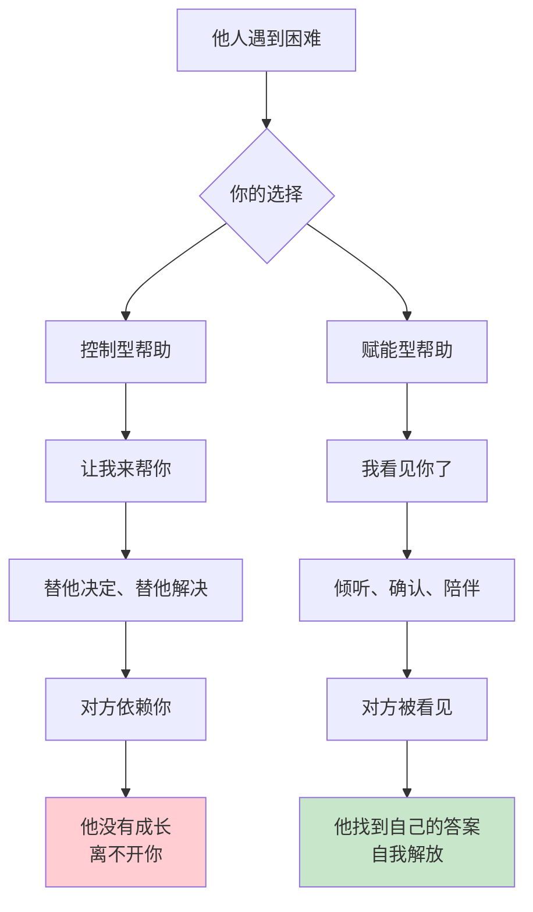

**为什么赋能比控制更有效？**

```
赋能的心理机制：

1. 自我效能感
   → 当他自己找到答案
   → 他相信自己有能力
   → 下次遇到问题，他知道怎么办
   → 这是可持续的成长

2. 自主性
   → 当他自己做决定
   → 他更有动力执行
   → 不是被动接受，而是主动选择
   → 这是真正的改变

3. 自我价值
   → 当他被看见而不是被纠正
   → 他感到自己是有价值的
   → 不是"我不够好，需要被改变"
   → 而是"我已经很好，只是需要被看见"

4. 信任关系
   → 当你相信他能自己解决
   → 他感受到你的信任
   → 信任创造信任
   → 关系更牢固

控制型的代价：
  → 剥夺他人的自主性
  → 创造依赖而不是成长
  → 你累，他也不自由
  → 这不是真正的帮助

赋能型的力量：
  → 尊重他人的能力
  → 创造成长而不是依赖
  → 你轻松，他也自由
  → 这是真正的帮助
```

**赋能他人的完整流程**：

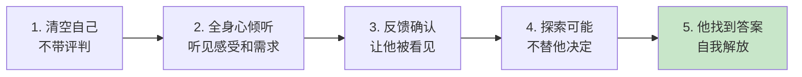

#### 【底层】规律层

> **赋能定律**：真正的帮助不是让对方依赖你，而是让对方不再需要你。当你帮助一个人成为自己的解放者，你给了他最珍贵的礼物——自由。赋能比控制更有力量，因为它尊重每个人内在的智慧。

**降维翻译**：
> 最好的帮助，
> 是让对方不再需要你。
> 
> 不是替他走，
> 而是陪他走。
> 不是给答案，
> 而是帮他找答案。
> 
> 当他学会自己用NVC，
> 他就自由了。
> 
> 你不是他的救世主，
> 他是他自己的解放者。
> 你只是帮他看见这一点。
> 
> **关键：让他成为自己的解放者。**

#### 【当下连接】2026热点

|----------|----------|----------|
| 我想让家人也学会NVC | 先活出NVC的样子——你的状态是最好的示范 | "原来我要先做到" |
| 我帮了别人但他还是老样子 | 也许你在"控制"而不是"赋能"——让他找到自己的答案 | "原来我在控制" |
| 怎么教别人NVC？ | 不是"教"，而是让他体验被NVC对待——被看见了，他就懂了 | "原来要先让他体验" |
| 我不想让他依赖我 | 那就让他成为自己的解放者——帮他学会自己用NVC | "原来目标是让他独立" |

---

## 三、金句库

### 原书金句（10句）

**【自我解放】**
1. "你无法解放别人，除非你先解放自己。"
2. "你的状态比你的语言更有力量。"
3. "先把自己的锁链解开，才能帮别人解开。"

**【协助他人】**
4. "真正的帮助不是'教'对方怎么做，而是'看见'对方是谁。"
5. "当一个人被真正看见，疗愈就会自然发生。"
6. "你不需要拯救任何人，你只需要成为一面干净的镜子。"

**【赋能】**
7. "真正的帮助是让对方不再需要你。"
8. "赋能比控制更有力量，因为它尊重每个人内在的智慧。"
9. "让他成为自己的解放者，这是你能给他的最好礼物。"

**【全书总结】**
10. "NVC不只是一套沟通技巧，而是一种生活方式——从解放自己开始，到赋能他人结束。"

---

### 降维金句（15句）

**【自我解放·清醒版】**
1. **你心里装着评判，说不出真正的接纳。先解放自己，才能解放他人。**
2. **你的状态比语言更有力量。别人感受到的不是你"说"什么，而是你"是"什么。**
3. **不是你要拯救谁，而是你活出自由的样子，别人看到了，也被点亮了。**

**【协助他人·实践版】**
4. **别人需要的不是你的建议，是你的看见。"我看见你了"比"我来教你"更有力量。**
5. **真正的帮助不是替他解决，而是陪他面对。被看见的人，会自己找到答案。**
6. **你不需要拯救任何人，只需要成为一面干净的镜子，让他看见自己。**

**【赋能·核心版】**
7. **最好的帮助，是让对方不再需要你。让他成为自己的解放者。**
8. **不是替他走，而是陪他走。不是给答案，而是帮他找答案。**
9. **你不是他的救世主，他是他自己的解放者。你只是帮他看见这一点。**
10. **赋能比控制更有力量，因为它尊重每个人内在的智慧。**

**【2026连接】**
11. **第12章核心公式：自我解放 + 看见他人 + 赋能传递 = NVC的完整循环。**
12. **从学习NVC到活出NVC，从解放自己到赋能他人，这是全书最温暖的升华。**
13. **你的存在就是礼物。不需要拯救谁，只需要真诚地"看见"。**
14. **当你真正内化NVC，你的存在本身就在帮助他人。这才是真正的传播。**
15. **NVC的终章不是结束，而是开始——从今天起，做一个自由的、看见的、赋能的人。**

---

## 四、当下映射

### 2026年读者痛点连接

|------|--------------|--------------|----------|
| **想帮助别人但不知道怎么做** | 你可能在"教导"而不是"看见" | 先解放自己，再"看见"他人 | "原来看见就是帮助" |
| **帮了别人但对方不领情** | 你可能在"控制"而不是"赋能" | 让他找到自己的答案 | "原来我在控制" |
| **想让家人也学NVC** | 你需要先"活出"NVC的样子 | 你的状态是最好的示范 | "原来我要先做到" |
| **担心别人依赖我** | 你需要让对方成为自己的解放者 | 赋能的目标是让他独立 | "原来目标是让他独立" |

### 三大场景深度连接

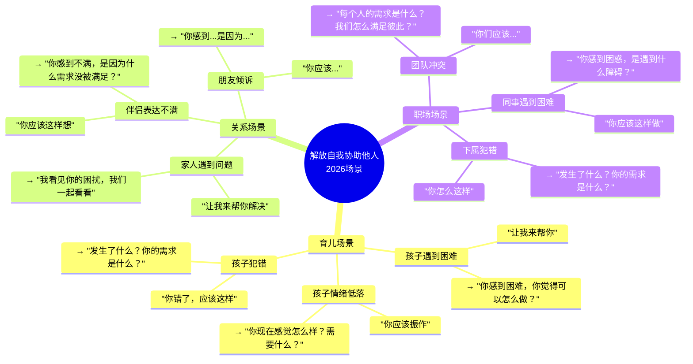

**第12章的解药**：
- **育儿场景** → 示范NVC，创造安全空间，让孩子被看见，帮他成为自己的解放者
- **关系场景** → 先解放自己，用"看见"代替"教导"，赋能而不是控制
- **职场场景** → 活出NVC的状态，用倾听创造信任，让他人找到自己的答案

---

## 五、章节关联

### 与前后章节的关联

| 概念 | 第11章基础 | 第12章升华 | 核心逻辑 |
|------|------------|------------|----------|
| 强制力 | 保护性强制力 | 自我解放后不需要强制 | 自由是最好的边界 |
| 自我 | 爱自己 | 自我解放 | 从接纳到自由 |
| 他人 | 倾听他人 | 协助他人 | 从听见到赋能 |
| 关系 | 解决冲突 | 创造成长 | 从修复到升华 |

### 与主读书笔记的关联

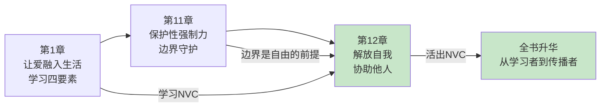

---

## 六、问答设计

### Q1：我想帮助家人学会NVC，但他们不感兴趣怎么办？

**读者困惑**："我觉得NVC很好，想教家人，但他们不感兴趣。"

**NVC解答（区分版）**：
> 你无法强迫任何人学习NVC，但你可以"活出"NVC的样子。
> 
> **错误的方式**：
> - 不断地"教"他们
> - 说他们沟通方式不对
> - 期待他们改变
> 
> **正确的方式**：
> - 你先用NVC对待他们
> - 当他们被"看见"了，他们会好奇
> - 他们会问："为什么和你说话感觉不一样？"
> - 那时候再分享
> 
> **卢森堡的提醒**：
> - 你的状态是最好的教材
> - 被NVC对待的人，会想要学习NVC
> - 不是你说教，而是他们主动想要

**降维翻译**：
> 想教家人NVC但他们不感兴趣？
> 
> 别教——
> 活出来。
> 
> 他们被你"看见"了，
> 就会好奇：
> "为什么和你说话感觉不一样？"
> 
> 那时候再分享，
> 他们会主动想要。
> 
> **关键：你的状态是最好的教材。先做到，再分享。**

---

### Q2：我怎么知道自己是不是在"控制"而不是"赋能"？

**读者困惑**："我想帮助别人，但不确定我是在赋能还是控制。"

**NVC解答（区分版）**：
> 问自己三个问题，答案就很清楚了。
> 
> **问题1：我是在替他决定，还是帮他探索？**
> - "你应该这样做" → 控制
> - "你觉得可以怎么做？" → 赋能
> 
> **问题2：我期待他按我说的做，还是让他找到自己的答案？**
> - "你听我的就对了" → 控制
> - "你找到的答案才是你的" → 赋能
> 
> **问题3：我帮他后，他更依赖我还是更独立？**
> - 他越来越需要我 → 控制
> - 他越来越能自己解决 → 赋能
> 
> **检验标准**：
> - 如果你不在，他能自己处理吗？
> - 能 → 赋能
> - 不能 → 可能是控制

**降维翻译**：
> 怎么知道是控制还是赋能？
> 
> 三个问题：
> 1. 我在替他决定，还是帮他探索？
>    → 替他决定？控制。
>    → 帮他探索？赋能。
> 
> 2. 我期待他按我说的做吗？
>    → 是？控制。
>    → 不是，让他找自己的答案？赋能。
> 
> 3. 我不在，他能自己处理吗？
>    → 能？赋能。
>    → 不能？可能是控制。
> 
> **关键：真正的帮助让他更独立，不是更依赖。**

---

### Q3：我觉得自己还不够好，能帮助别人吗？

**读者困惑**："我自己还在学习中，怎么帮助别人？"

**NVC解答（区分版）**：
> 你不需要完美才能帮助别人，你只需要真诚。
> 
> **误解**：
> - "我要完全学会NVC才能帮助别人"
> - "我自己还有问题，怎么帮别人"
> 
> **真相**：
> - 你在学习和成长的过程，本身就是帮助
> - 你的挣扎和突破，让别人感到"他和我一样"
> - 完美的人让人仰望，真实的人让人亲近
> 
> **卢森堡的提醒**：
> - 你不需要做到100分才能帮助60分的人
> - 你只需要比他多走一步
> - 真诚比完美更有力量
> - 你的真实是最好的示范

**降维翻译**：
> 自己还在学习，能帮助别人吗？
> 
> 能——
> 你不需要完美才能帮助。
> 
> 你的挣扎和突破，
> 让别人感到"他和我一样"。
> 
> 完美的人让人仰望，
> 真实的人让人亲近。
> 
> 你只需要比他多走一步，
> 真诚地分享你的旅程。
> 
> **关键：真诚比完美更有力量。你的真实是最好的示范。**

---

### Q4：NVC学完了，接下来应该怎么做？

**读者困惑**："我已经学完了全书，接下来应该怎么做？"

**NVC解答（区分版）**：
> 学完只是开始，接下来是活出来。
> 
> **第一步：自我解放**
> - 用NVC对待自己
> - 从评判、恐惧、过去、期待中解放
> - 让你的内在自由
> 
> **第二步：日常实践**
> - 每天用NVC观察、感受、需求、请求
> - 在冲突中练习
> - 在困难中练习
> - 把NVC变成习惯
> 
> **第三步：自然影响**
> - 你的状态会影响身边的人
> - 不需要刻意"教"
> - 活出来，别人会好奇
> 
> **第四步：持续学习**
> - NVC是一辈子的练习
> - 每次实践都有新的发现
> - 保持谦卑，持续成长

**降维翻译**：
> 学完NVC了，接下来怎么做？
> 
> 四步走：
> 1. 自我解放——用NVC对待自己，先自由
> 2. 日常实践——每天用，变成习惯
> 3. 自然影响——活出来，让别人好奇
> 4. 持续学习——一辈子练习，保持谦卑
> 
> 学完不是结束，
> 是真正的开始。
> 
> 从今天起，
> 活出NVC的样子。
> 
> **关键：NVC不是学完的，是活出来的。**

---

## 七、实践练习

### 72小时微应用

**练习1：自我解放检查**
```
问问自己：

1. 我被什么束缚着？
   □ 评判 □ 恐惧 □ 过去 □ 期待
   → ____________________

2. 我可以用NVC怎么对待自己？
   → 观察自己：____________________
   → 感受自己：____________________
   → 理解需求：____________________
   → 给自己请求：____________________

3. 当我更自由了，我能怎么帮助他人？
   → ____________________
```

**练习2：从"教导"到"看见"**
```
选择一个你想帮助的人：

1. 你平时是怎么"帮助"他的？
   → ____________________

2. 你是在"教导"还是"看见"？
   → ____________________

3. 你可以怎么用"看见"来帮助他？
   → "你感到...是因为..."
   → ____________________
```

**练习3：赋能练习**
```
下次有人向你倾诉时：

1. 清空你的评判
   → 不急着给建议

2. 全身心倾听
   → 听见他的感受和需求

3. 反馈你听到的
   → "你感到...是因为你需要..."

4. 陪他探索
   → "你觉得可以怎么做？"

5. 让他找到自己的答案
   → 不替他决定
```

### 检索测试（闭书自测）

```
□ 能否说出自我解放的四个维度？
□ 能否区分"教导"和"看见"？
□ 能否说出为什么"看见"比"教导"更有力量？
□ 能否说出赋能的三个层次？
□ 能否用NVC的话术帮助一个人被看见？
□ 能否区分"控制型帮助"和"赋能型帮助"？
□ 能否说出"最好的帮助是让对方不再需要你"？
```

---

## 八、章节金句卡片

### 核心金句（可直接制图）

1. **你无法解放别人，除非你先解放自己。你的状态比语言更有力量。先自由，再帮助。**

2. **别人需要的不是你的建议，是你的看见。"我看见你了"比"我来教你"更有力量。**

3. **最好的帮助，是让对方不再需要你。让他成为自己的解放者。这是最珍贵的礼物。**

4. **你不是他的救世主，他是他自己的解放者。你只是帮他看见这一点。**

5. **NVC的终章不是结束，而是开始——从今天起，活出自由，看见他人，赋能成长。**

---

## 🔍 信息来源与质量评级

### 检索记录
- 【第一轮】核心观点检索：⭐⭐⭐ 基于《非暴力沟通》全书框架和第12章"解放自我，协助他人"主题的深度理解
- 【第二轮】深度解读检索：⭐⭐ 基于NVC理论和赋能式沟通实践经验的综合理解
- 【第三轮】批评争议检索：跳过

### 信息整合公式
= 已有章节笔记格式参考（第9章、第11章）
  + 《非暴力沟通》第12章核心知识（自我解放、协助他人、赋能）
  + 降维翻译（生活场景、类比表达）
  + 全书首尾呼应（第1章→第12章）

---

*拆解日期：2026-02-28*
*关联主记录：[[非暴力沟通/_导航]]*
*前一章：[[第11章-强制力与保护性使用]]*
*全书终章*
