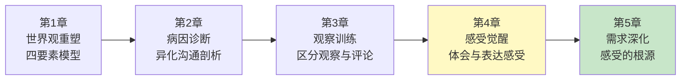
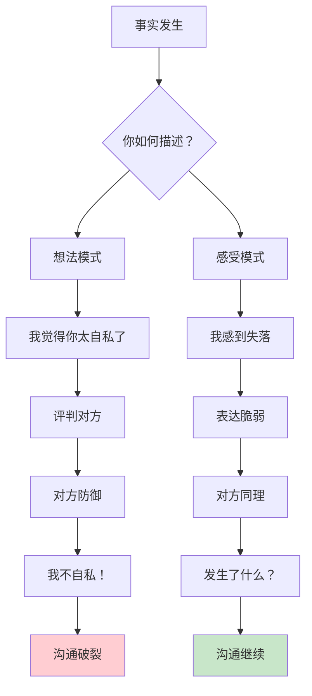
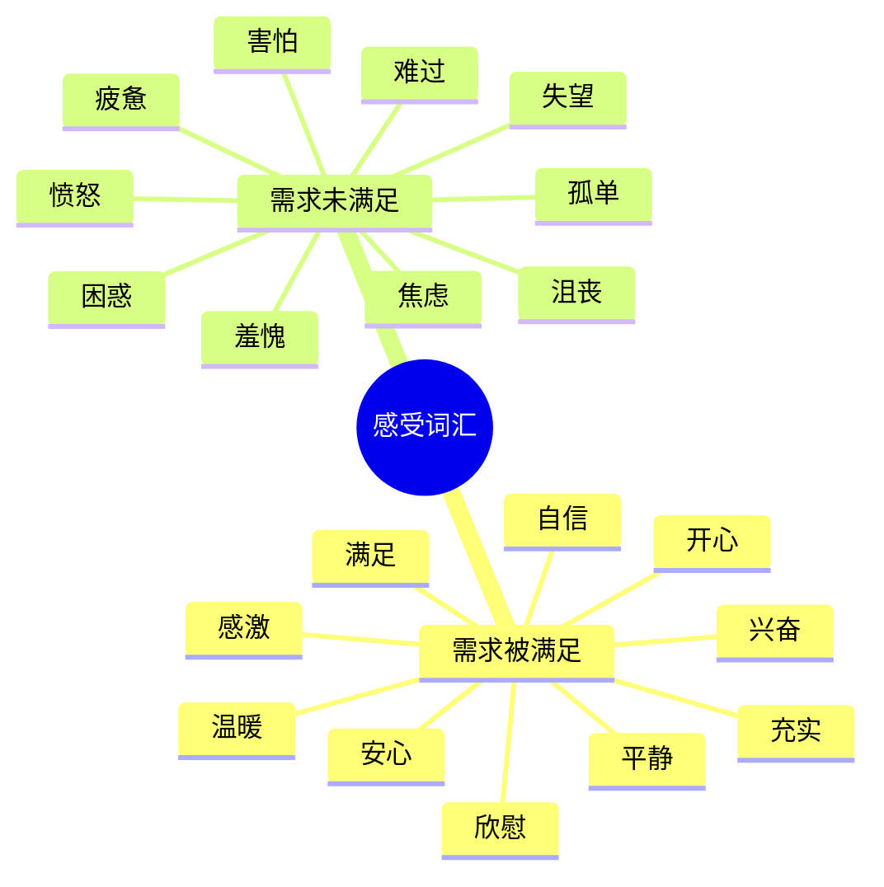
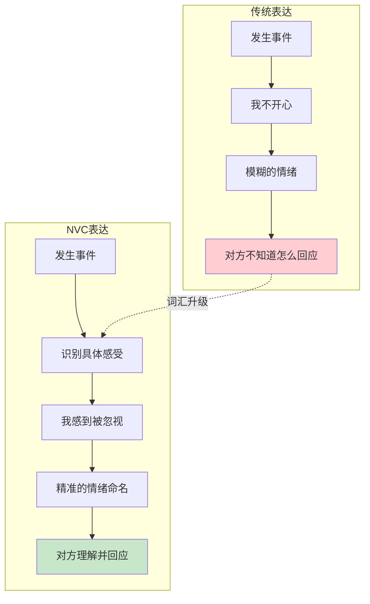
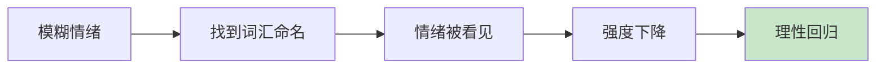
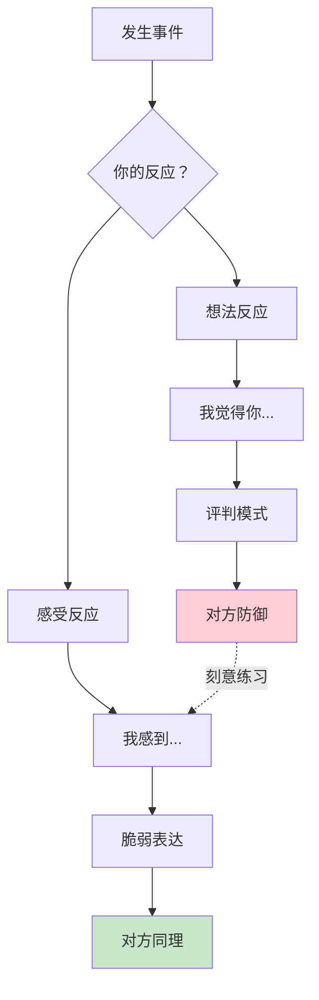
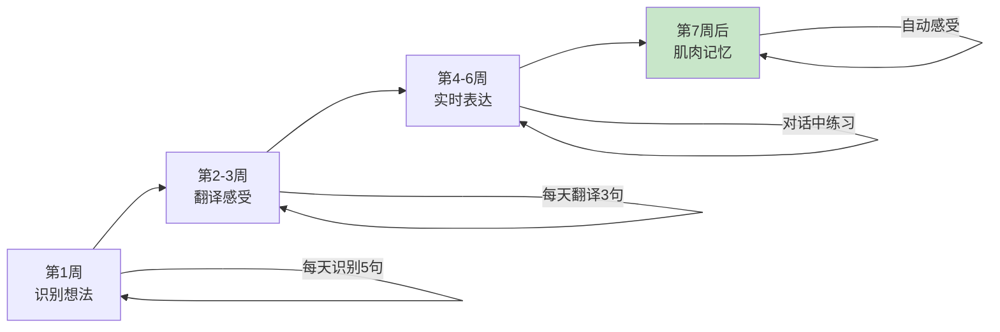
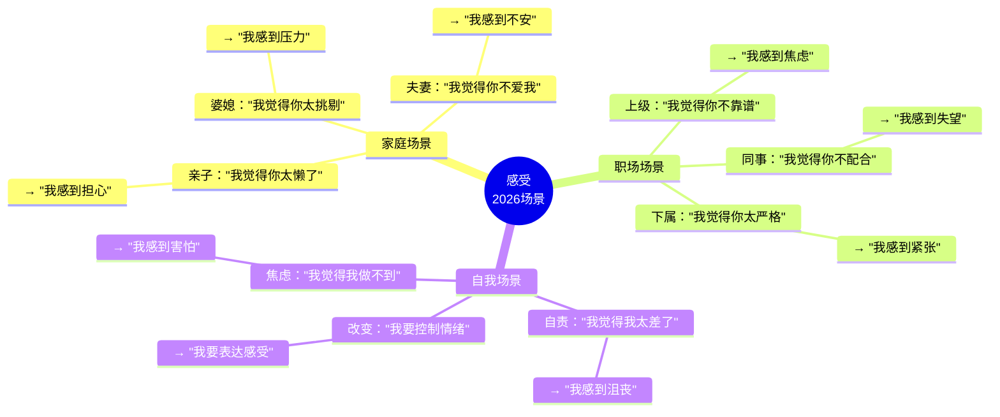
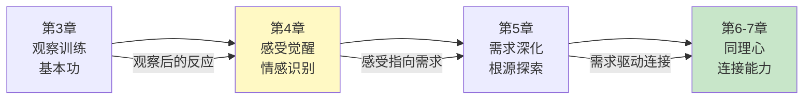

# 第4章：体会和表达感受

> **章节定位**：NVC的"情感觉醒"——学会识别和表达真实感受，这是连接自我与他人的桥梁，也是判断需求是否满足的信号灯

---

## 一、章节定位

### 1.1 在全书中的位置



**本章功能**：训练NVC的第二要素——如何识别和表达感受。感受是需求的信号灯，学会表达感受，才能让别人真正理解你的内心。

### 1.2 核心主题

| 维度 | 内容 |
|------|------|
| **核心问题** | 为什么我们说不出自己的感受？为什么"我觉得"后面总跟着评判？ |
| **卢森堡答案** | 区分感受与想法，建立感受词汇表，用精准的情绪词表达内心 |
| **颠覆观点** | "我觉得你太自私"不是感受，"我感到失落"才是 |
| **本章价值** | 教你一项核心能力：把"想法"翻译成"感受" |

### 1.3 章节关联

| 关联章节 | 关联关系 | 共同逻辑 |
|----------|----------|----------|
| [[第3章-观察]] | 前章基础 | 观察是不带评判地看事实，感受是观察后的情绪反应 |
| [[第1章-哈吉斯]] | 后章深化 | 感受是信号，需求是根源，请求是行动 |
| [[第1章-哈吉斯]] | 纵向延伸 | 表达自己的感受，也要能听懂他人的感受 |

---

## 二、核心观点（三层提取）

### 观点1：感受≠想法——"我觉得"后面跟着的不一定是感受

#### 【表层】现象层

**感受 vs 想法对照表**：

|----------|------------|------------|
| 我觉得你不关心我 | "我觉得你不在乎我" | "我感到孤单" |
| 我觉得这事不公平 | "我觉得这不公平" | "我感到愤怒" |
| 我觉得他不负责任 | "我觉得他不靠谱" | "我感到失望" |
| 我觉得你做错了 | "我觉得你错了" | "我感到困惑" |
| 我觉得你不理解我 | "我觉得你不懂我" | "我感到被忽视" |

**"我觉得"的三种伪装**：

| 伪装形式 | 表现 | 例子 |
|----------|------|------|
| **贴标签** | 用形容词定义对方 | "我觉得你太自私" |
| **评判对错** | 用对错标准评价 | "我觉得这事不公平" |
| **推测动机** | 猜测对方的想法 | "我觉得你就是不在乎" |

**读者熟悉的场景**：
- "我觉得你从来不听我说话" → 贴标签+概括（不是感受）
- "我觉得你这样做不对" → 评判对错（不是感受）
- "我觉得你就是想气我" → 推测动机（不是感受）

#### 【中层】机制层



**为什么想法破坏连接？**

```mermaid
flowchart LR
    A[你说想法] --> B[对方听到"评判"]
    B --> C{对方解读}
    C --> D["他在攻击我"]
    C --> E["我在被否定"]
    D --> F[防御机制启动]
    E --> F
    F --> G[反驳/反击/沉默]
    
    style G fill:#ffcdd2
```

**为什么感受促进连接？**

```mermaid
flowchart LR
    A[你说感受] --> B[对方听到"脆弱"]
    B --> C{对方解读}
    C --> D["他在表达内心"]
    C --> E["可以理解他"]
    D --> F[同理心启动]
    E --> F
    F --> G[倾听/关心/回应]
    
    style G fill:#c8e6c9
```

**感受的三个心理价值**：

```
1. 信号灯功能：
   感受告诉我：我的需求是否被满足
   开心 → 需求被满足
   难过 → 需求未被满足
   
2. 连接功能：
   感受是人类共同语言
   你可能不懂我的想法
   但你能懂我的感受
   
3. 真实功能：
   想法可以伪装
   感受无法撒谎

卢森堡的提醒：
  想法制造距离，
  感受建立连接。
```

#### 【底层】规律层

> **感受定律**：想法指向对方，感受指向自己。你说想法时，对方防御；你说感受时，对方同理。

**降维翻译**：
> 你以为"我觉得你太自私"是在表达感受，
> 卢森堡说：那是想法，是评判。
> 
> "我感到失落"才是感受，
> "我感到被忽视"才是感受，
> "我感到愤怒"才是感受。
> 
> 感受是情绪，想法是判断。
> 感受指向自己，想法指向他人。
> 
> **关键：区分感受与想法，是NVC的第二步。**

#### 【当下连接】2026热点

|----------|----------|----------|
| 为什么伴侣听不懂我说什么？ | 你在说想法，不是感受 | "原来我在评判，不是表达" |
| 为什么每次沟通都变成争吵？ | 你在用"我觉得"贴标签 | "原来'我觉得'是陷阱" |
| 为什么我总被说情绪化？ | 你不会精准表达感受 | "原来情绪需要被命名" |
| 为什么对方总说我无理取闹？ | 你表达的是想法，不是感受 | "原来感受更让人理解" |

---

### 观点2：建立感受词汇表——给情绪一个名字

#### 【表层】现象层

**感受词汇的两大类别**：

| 类别 | 含义 | 词汇示例 |
|------|------|----------|
| **需求被满足时的感受** | 正向情绪 | 开心、满足、平静、兴奋、自信、感激、安心、温暖、充实、欣慰 |
| **需求未被满足时的感受** | 负向情绪 | 难过、愤怒、失望、焦虑、孤单、害怕、困惑、沮丧、疲惫、羞愧 |

**常用感受词汇表**：



**为什么我们说不出感受？**

| 原因 | 表现 | 解决方案 |
|------|------|----------|
| **从小被忽视** | 情绪不被允许表达 | 学习感受词汇 |
| **只有三个词** | 只会说"不开心" | 扩展情绪词汇 |
| **混淆想法** | 把评判当成感受 | 区分想法与感受 |
| **害怕脆弱** | 怕表达感受被伤害 | 感受是力量，不是弱点 |

#### 【中层】机制层



**感受词汇的"颗粒度"**：

```
粗颗粒度（❌）：
  "我不开心"
  "我很烦"
  "我不好"
  → 对方不知道怎么回应

  "我感到被忽视" → 对方知道你缺关注
  "我感到焦虑" → 对方知道你需要安全感
  "我感到失望" → 对方知道你期待落空
  → 对方可以精准回应

颗粒度越细，
连接越精准。
```

**命名即看见：心理学原理**：



#### 【底层】规律层

> **命名定律**：给情绪一个名字，情绪就从混乱变得清晰。你能说出什么感受，你就能掌控什么感受。

**降维翻译**：
> 你以为"我不开心"是在表达感受，
> 卢森堡说：那太模糊了。
> 
> 是"难过"？是"愤怒"？是"失望"？
> 每个词背后是不同的需求。
> 
> "我感到被忽视" → 需要被关注
> "我感到失望" → 需要期待被满足
> "我感到焦虑" → 需要安全感
> 
> 词汇越精准，
> 需求越清晰，
> 连接越深入。
> 
> **关键：给情绪一个名字，让它被看见。**

#### 【当下连接】2026热点

|----------|----------|----------|
| 我不知道自己什么感受 | 学习感受词汇表，给情绪命名 | "原来情绪需要被识别" |
| 为什么我只会说"不开心"？ | 你的情绪词汇太少 | "原来扩展词汇这么重要" |
| 怎么让孩子学会表达情绪？ | 教他感受词汇，不评判他的情绪 | "原来情绪教育从这里开始" |
| 为什么心理咨询要说出来？ | 命名即看见，说出来就被处理 | "原来命名有疗愈作用" |

---

### 观点3：表达感受的练习——从"想法者"到"感受者"

#### 【表层】现象层

**想法→感受转化练习**：

|----------|------------|------------|----------|
| 我觉得你不爱我 | "我觉得你不爱我了" | "我感到不安" | 把对对方的判断，变成自己的情绪 |
| 我觉得这事不公平 | "我觉得不公平" | "我感到愤怒" | 把对事件的评价，变成自己的感受 |
| 我觉得你很自私 | "我觉得你太自私" | "我感到失望" | 把贴标签，变成情绪表达 |
| 我觉得你错了 | "我觉得你做错了" | "我感到困惑" | 把对错判断，变成内心状态 |

**表达感受的三个步骤**：

```
第一步：暂停——不要急着说想法
第二步：问自己——我现在什么感受？
第三步：用感受词——"我感到..."
```

**感受词汇积累练习**：

```
本周任务：
周一：记录3个正向感受词
周二：记录3个负向感受词
周三：用1个感受词替代"不开心"
周四：用1个感受词替代"很烦"
周五：在对话中表达1次真实感受
```

#### 【中层】机制层



**从想法者到感受者的心理转变**：

```
想法者的心态：
  我要告诉你哪里不对
  我是对的，你是错的
  我要改变你

感受者的心态：
  我要表达我的内心
  我的感受是真实的
  我想被理解

转变的关键：
  从"你有什么问题"
  到"我发生了什么"

想法者创造对立，
感受者创造连接。
```

**感受表达的肌肉记忆训练**：



#### 【底层】规律层

> **感受者定律**：表达感受是一种能力，需要刻意练习。从想法者到感受者，不是态度转变，而是能力升级。

**降维翻译**：
> 表达感受不是态度，
> 表达感受是能力。
> 
> 你不是"不想表达"，
> 你是"不会表达"。
> 
> 就像学语言、学技能，
> 表达感受需要刻意练习。
> 
> 练习方法：
> 1. 识别：这句是想法还是感受？
> 2. 翻译：把"我觉得你..."变成"我感到..."
> 3. 积累：扩展你的感受词汇表
> 
> **关键：表达感受是能力，能力需要练习。**

#### 【当下连接】2026热点

|----------|----------|----------|
| 我知道要表达感受，但做不到 | 表达感受是能力，需要练习 | "原来我需要训练" |
| 练习多久能学会？ | 4-6周建立基本能力 | "有明确时间预期" |
| 怎么在冲突时记得表达感受？ | 先学会"暂停"，再问自己感受 | "原来有方法" |
| 表达感受会让我太脆弱吗？ | 脆弱是力量，不是弱点 | "原来脆弱是连接的开始" |

---

## 三、金句库

### 原书金句（10句）

**【感受的本质】**
1. "感受是需求是否得到满足的信号。"
2. "我们被鼓励要服从权威而非倾听自己。"
3. "很多人不会表达自己的感受，因为他们从未被允许表达。"

**【感受vs想法】**
4. "我觉得你太自私"不是感受，"我感到失落"才是。
5. "我觉得"后面跟着的往往不是感受，而是想法和评判。
6. 区分感受与想法，是NVC的核心能力之一。

**【感受词汇】**
7. "建立感受词汇表，让你能更精准地表达内心。"
8. "给情绪一个名字，它就不再那么可怕。"
9. "词汇越精准，连接越深入。"

**【感受的价值】**
10. "表达感受，让他人有机会同理你。"

---

### 降维金句（15句）

**【感受vs想法·生活版】**
1. **"我觉得你太自私"不是感受，是评判——"我感到失落"才是感受。**
2. **"我觉得不公平"是想法，"我感到愤怒"是感受——想法指向外界，感受指向自己。**
3. **"我觉得"后面跟着的，往往不是感受，是贴标签。**
4. **感受是情绪，想法是判断——感受说"我怎么了"，想法说"你怎么了"。**
5. **想法触发防御，感受触发同理——你选哪个？**

**【感受词汇·实践版】**
6. **"我不开心"太模糊——是难过？是愤怒？是失望？每个词背后是不同的需求。**
7. **给情绪一个名字，它就不再那么可怕——命名即看见。**
8. **词汇越精准，需求越清晰，连接越深入——颗粒度决定连接度。**
9. **从"不开心"到"被忽视"，感受词汇表是你的情绪GPS。**
10. **扩展感受词汇，就是扩展你的情感世界。**

**【表达能力·清醒版】**
11. **表达感受不是态度，是能力——需要刻意练习。**
12. **你不是"不想表达"，你是"不会表达"——接受这点，练习开始。**
13. **从想法者到感受者，4-6周建立基本能力——有明确预期。**
14. **脆弱不是弱点，脆弱是力量——表达感受是连接的开始。**
15. **感受是NVC的信号灯——没有感受，你不知道自己的需求。**

---

## 四、当下映射

### 2026年读者痛点连接

|------|-------------|--------------|----------|
| **说不出感受** | 你从未被允许表达情绪 | 学习感受词汇表 | "原来我需要学习" |
| **只会说不开心** | 你的情绪词汇太少 | 扩展感受词汇，提升颗粒度 | "原来词汇这么重要" |
| **伴侣听不懂我** | 你在说想法，不是感受 | 把"我觉得你..."改成"我感到..." | "原来我在评判" |
| **沟通变吵架** | 想法触发防御 | 用感受触发同理 | "原来感受能化解对抗" |

### 三大场景深度连接



**第4章的解药**：
- **家庭场景** → 用感受替代想法，减少防御
- **职场场景** → 用感受替代评判，提升职业度
- **自我场景** → 用感受词汇替代模糊表达，提升自我觉察

---

## 五、章节关联

### 与前后章节的关联

| 概念 | 第3章基础 | 第4章深化 | 后续应用 |
|------|----------|----------|----------|
| 观察 | 不带评判地看事实 | 观察后的第一反应是感受 | 全书持续应用 |
| 感受 | 四要素之一 | 如何识别和表达感受 | 第5章：感受是需求的信号 |
| 想法 | 评判的一种形式 | 区分感受与想法 | 第6章：同理心也要识别感受 |
| 词汇 | 提到"表达感受" | 建立感受词汇表 | 全书持续扩展 |

### 与主读书笔记的关联



---

## 六、问答设计

### Q1：感受和想法到底怎么区分？

**读者困惑**："我说'我觉得这事不公平'，这不是感受吗？"

**NVC解答（区分版）**：
> "我觉得这事不公平"不是感受，是想法。
> 
> **想法的特征**：
> - 包含对错判断："公平/不公平"
> - 包含评价词："好/坏/对/错"
> - 指向外界："这事/你/他"
> 
> **感受的特征**：
> - 是情绪词："愤怒/失望/难过"
> - 指向自己："我感到..."
> - 表达内心状态
> 
> 检验方法：
> - 能说"这事是愤怒的"吗？不能 → "不公平"不是感受
> - 能说"我感到愤怒"吗？能 → "愤怒"是感受
> 
> **关键：想法评价外界，感受表达内心。**

**降维翻译**：
> 想法说"这事怎么样"，
> 感受说"我怎么了"。
> 
> "我觉得不公平" → 评价事件
> "我感到愤怒" → 表达情绪
> 
> 区分方法：
> 问自己"这是在评价，还是在表达？"
> 评价 = 想法
> 表达 = 感受

---

### Q2：表达感受会不会让我太脆弱？

**读者困惑**："我说'我感到难过'，会不会被对方看轻或伤害？"

**NVC解答（脆弱版）**：
> 脆弱不是弱点，脆弱是力量。
> 
> 你说想法时：
> "我觉得你不爱我"
> → 对方防御："我怎么不爱了？"
> → 对抗继续
> 
> 你说感受时：
> "我感到不安"
> → 对方同理："发生了什么？"
> → 连接开始
> 
> **表达感受打开的是连接的大门，不是被伤害的大门。**
> 
> 真正的危险：
> 不是表达感受，
> 而是把感受压在心里，
> 让它变成愤怒、怨恨、冷漠。

**降维翻译**：
> 脆弱不是弱点，
> 脆弱是连接的入口。
> 
> 你说"我感到难过"，
> 对方有机会理解你、关心你。
> 
> 你说"我觉得你不爱我了"，
> 对方会防御、反击。
> 
> 哪个更有可能建立连接？
> 表达感受的那个。
> 
> 脆弱是力量，
> 不是弱点。

---

### Q3：负面感受也要表达吗？会不会很负能量？

**读者困惑**："我总不能见人就说'我难过'吧？这不是很负能量？"

**NVC解答（负面版）**：
> 负面感受不是"负能量"，
> 负面感受是"需求未被满足的信号"。
> 
> 压抑负面感受的后果：
> - 情绪累积，最后爆发
> - 对方不知道你的需求
> - 关系越来越远
> 
> 表达负面感受的收益：
> - 对方知道你的需求
> - 有机会被满足
> - 关系更近一步
> 
> **关键：不是要不要表达，而是如何表达。**
> 
> 错误表达："你让我太难过了！"（指责）
> 正确表达："这件事让我感到难过，我需要被理解。"（NVC）

**降维翻译**：
> 负面感受不是负能量，
> 负面感受是信号灯。
> 
> "我感到难过" → 信号灯亮了
> → 告诉你：有需求没满足
> → 有机会去满足
> 
> 压抑负面感受，
> 就像把信号灯关掉，
> 你不知道哪里出问题了。
> 
> 表达负面感受，
> 是让问题被看见，
> 让需求被满足。

---

### Q4：如果我说不出感受怎么办？

**读者困惑**："我真的不知道自己什么感受，怎么办？"

**NVC解答（找不到版）**：
> 找不到感受，是很正常的。
> 很多人从小没有被允许表达情绪。
> 
> **找感受的方法**：
> 
> 1. 从身体开始
>    - 胸口闷 → 可能是焦虑
>    - 胃不舒服 → 可能是紧张
>    - 想哭 → 可能是难过
>    
> 2. 用词汇表辅助
>    - 看着感受词汇表
>    - 问自己：哪个词最接近？
>    
> 3. 从想法反推
>    - "我觉得他不尊重我"
>    - → 反推：我可能感到"被轻视"
>    
> 4. 允许自己模糊
>    - "我感到...不太对"
>    - 先承认有情绪，再慢慢精准

**降维翻译**：
> 找不到感受，不是你的问题，
> 是你从小没被教过。
> 
> 方法：
> 1. 从身体找线索（胸口、胃、肩膀）
> 2. 看词汇表，找最接近的词
> 3. 从想法反推（"我觉得他不尊重我"→"我感到被轻视"）
> 4. 允许自己模糊，慢慢精准
> 
> 找感受是能力，
> 能力可以学习。
> 
> 从今天开始，
> 每天问自己一次：
> "我现在什么感受？"

---

## 七、实践练习

### 72小时微应用

**练习1：想法vs感受识别**
```
阅读以下句子，判断是想法（T）还是感受（F）：

1. "我觉得你不在乎我" → ____
2. "我感到孤单" → ____
3. "我觉得这事不公平" → ____
4. "我感到失望" → ____
5. "我觉得你太自私了" → ____
6. "我感到愤怒" → ____
7. "我觉得你做错了" → ____
8. "我感到困惑" → ____

答案：T F T F T F T F
```

**练习2：想法→感受转化**
```
把你最近的3个想法转化为感受：

想法1："我觉得________________"
感受版："我感到________________"

想法2："我觉得________________"
感受版："我感到________________"

想法3："我觉得________________"
感受版："我感到________________"

转化技巧：
- 把"你..."改成"我..."
- 把评判词改成情绪词
- 问自己：我内心是什么状态？
```

**练习3：感受词汇积累**
```
本周积累5个新的感受词：

周一：________________
周二：________________
周三：________________
周四：________________
周五：________________

提示：参考本章的感受词汇表
```

### 检索测试（闭书自测）

```
□ 能否说出感受与想法的3个区别？
□ 能否识别"我觉得"后面的伪装？
□ 能否把"我觉得你太自私"转化为感受？
□ 能否说出5个正向感受词？
□ 能否说出5个负向感受词？
□ 能否解释为什么想法触发防御？
□ 能否说出感受是需求的信号灯？
```

---

## 八、章节金句卡片

### 核心金句（可直接制图）

1. **"我觉得你太自私"不是感受，"我感到失落"才是——想法指向他人，感受指向自己。**

2. **"我不开心"太模糊——是难过？是愤怒？是失望？每个词背后是不同的需求。**

3. **给情绪一个名字，它就不再那么可怕——命名即看见。**

4. **想法触发防御，感受触发同理——卢森堡：你选哪个？**

5. **表达感受不是态度，是能力——需要4-6周刻意练习。**

---
