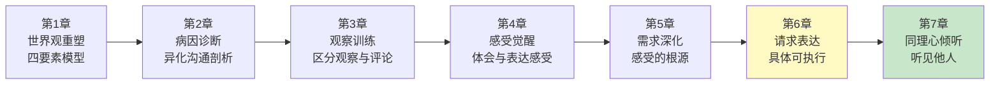
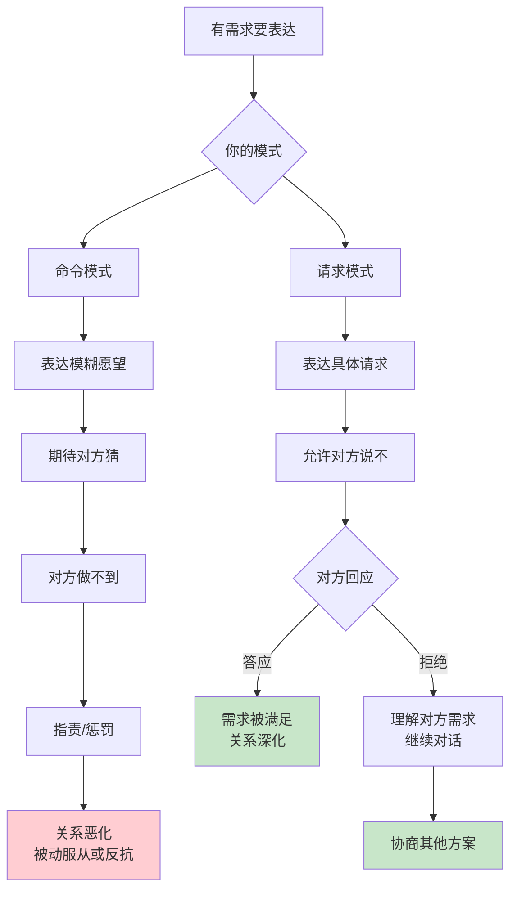
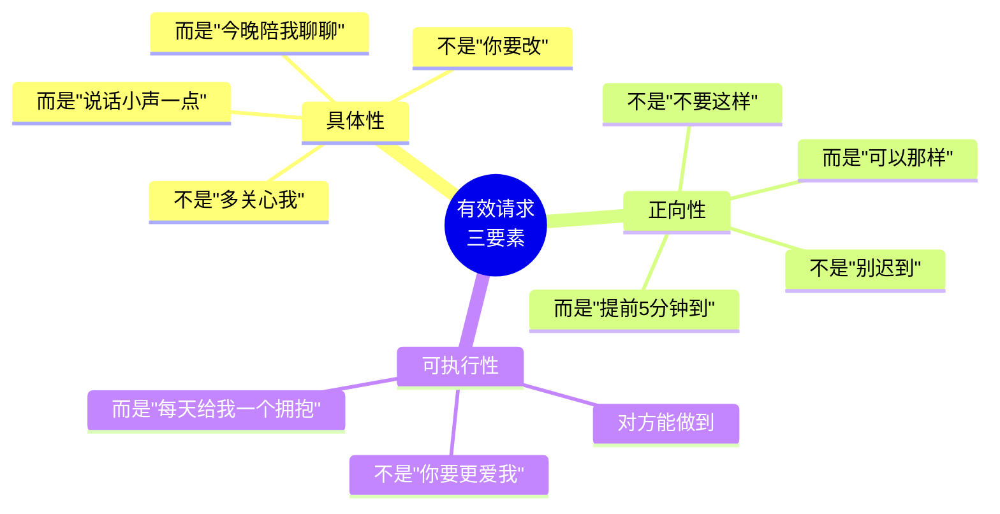
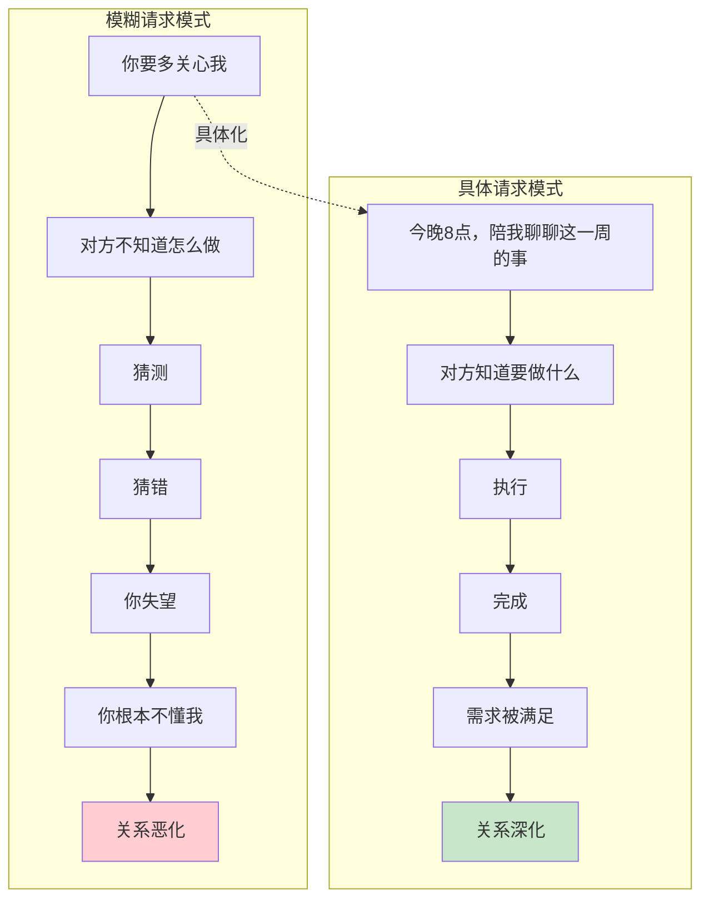
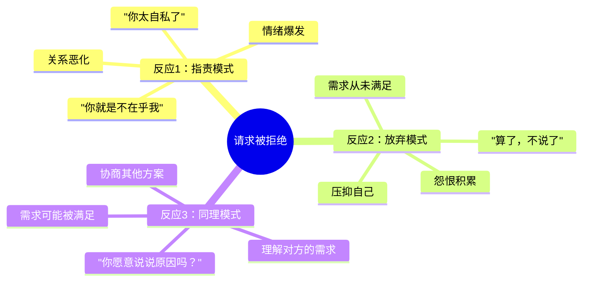
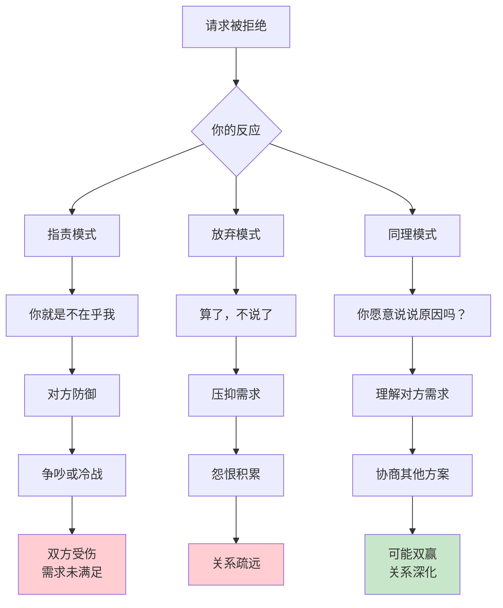
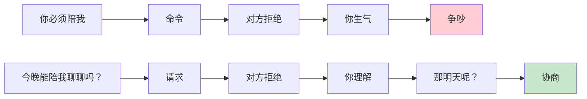
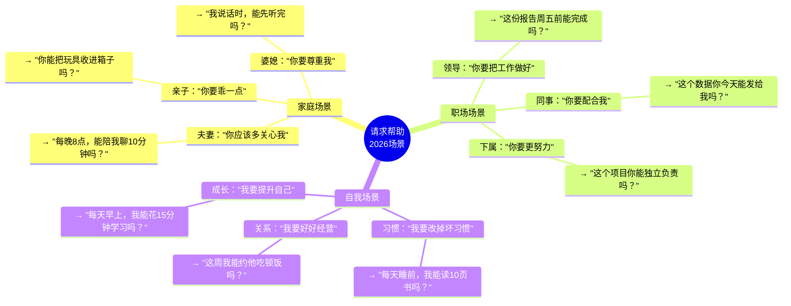
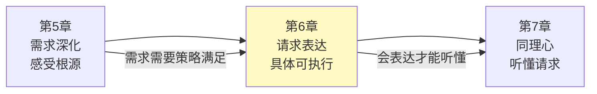

# 第6章：请求帮助

> **章节定位**：NVC的"行动转化器"——把模糊的愿望变成具体的请求。这是从"心里想要"到"开口表达"的关键一步，也是检验你是否真的在非暴力沟通的分水岭。

---

## 一、章节定位

### 1.1 在全书中的位置



**本章功能**：把前五章的内在工作（观察、感受、需求）转化为外在行动（请求）。这是NVC四要素的最后一个环节，也是"沟通"变成"对话"的关键。

### 1.2 核心主题

| 维度 | 内容 |
|------|------|
| **核心问题** | 为什么我的请求总被忽视或拒绝？怎样表达才能让对方愿意行动？ |
| **卢森堡答案** | 请求要具体、正向、可执行；更重要的是，请求允许对方说"不" |
| **颠覆观点** | "你应该懂我"是懒惰——有效请求是明确说出你要什么，不是让对方猜 |
| **本章价值** | 教你把模糊的愿望翻译成对方能听懂、愿意做、做得到的具体行动 |

### 1.3 章节关联

| 关联章节 | 关联关系 | 共同逻辑 |
|----------|----------|----------|
| [[第5章-感受的根源]] | 前章基础 | 需求是请求的根源，请求是满足需求的策略 |
| [[第1章-哈吉斯]] | 后章延伸 | 会表达请求，才能听懂他人的请求 |
| [[第1章-让爱融入生活]] | 全书根基 | 请求是NVC四要素的闭环 |

---

## 二、核心观点（三层提取）

### 观点1：请求vs命令——检验标准是"能不能说不"

#### 【表层】现象层

**请求与命令的本质区别**：

| 特征 | 命令 | 请求 |
|------|------|------|
| **对方说不** | 生气、指责、惩罚 | 接纳、理解、继续对话 |
| **表达方式** | "你必须..."、"你应该..." | "你愿意...吗？" |
| **潜台词** | "不答应就是不爱我/不尊重我" | "你有选择的自由" |
| **结果** | 关系恶化、被动服从或反抗 | 关系深化、真诚回应 |

**读者熟悉的场景**：

```mermaid
mindmap
  root((提出请求))
    场景1：伴侣沟通
      命令模式
        "你应该多陪陪我"
        对方逃避
        你指责他不在乎
      请求模式
        "今晚你能陪我聊聊吗？"
        对方有选择
        关系更亲密
    场景2：职场协作
      命令模式
        "这个必须今天完成"
        同事被动应付
        或直接对抗
      请求模式
        "你能今天完成吗？有困难可以说"
        同事主动配合
        或协商时间
    场景3：亲子互动
      命令模式
        "你必须把房间收拾好"
        孩子反抗或敷衍
        亲子关系紧张
      请求模式
        "你能把玩具收进箱子里吗？"
        孩子有参与感
        习惯逐步养成
```



**卢森堡的核心区分**：

| 错误认知 | 正确认知 |
|----------|----------|
| "我表达了就是请求" | 请求的本质是尊重对方的选择权 |
| "他拒绝就是不爱我" | 拒绝是对方的权利，不是对你的否定 |
| "说不出口才是问题" | 说出口但不容许拒绝，那不是请求是命令 |
| "请求太直接了" | 模糊的愿望让对方猜，才是最大的负担 |

#### 【中层】机制层



**检验请求的"金标准"**：

```
卢森堡的检验方法：
  当对方说"不"的时候，
  你的第一反应是什么？

  命令者的反应：
    生气 "你怎么能这样！"
    指责 "你根本不在乎我"
    惩罚 冷战、报复、威胁
    贴标签 "你就是自私"

  请求者的反应：
    理解 "原来你也需要..."
    接纳 "好的，我尊重你的选择"
    继续对话 "那你有其他想法吗？"
    协商 "我们有没有双赢的可能？"

关键：请求允许对方说不，
      命令不允许。
```

**为什么"你应该懂我"是陷阱？**

```
"你应该懂我"的心理机制：

1. 隐性期待
   → 我不说，你应该知道
   → 你不知道，就是不够爱我

2. 模糊测试
   → 我不说具体，看你能不能猜对
   → 猜不对，说明你不懂我

3. 情绪绑架
   → 你做不到，我就生气
   → 用情绪惩罚你

4. 自我保护
   → 不说出具体要求，就不会被明确拒绝
   → 模糊让我有安全感

代价：
  → 对方永远猜不对
  → 你永远失望
  → 关系越来越差
  → 双方都很累
```

#### 【底层】规律层

> **请求定律**：请求的本质不是"要什么"，而是"尊重对方的自主权"。当你允许对方说不，你的请求才是真正的请求。

**降维翻译**：
> "你应该懂我"是最危险的期待。
> 
> 它把沟通的责任交给对方，
> 把失望的权利留给自己。
> 
> 有效请求是：
> 明确说出你要什么，
> 同时尊重对方可以说不。
> 
> 命令说"你必须"，
> 请求问"你愿意吗"。
> 
> 命令者害怕拒绝，
> 请求者接纳拒绝。
> 
> **关键：请求的本质是尊重选择权，不是索取顺从。**

#### 【当下连接】2026热点

|----------|----------|----------|
| 为什么我的请求总被忽视？ | 你在说模糊的愿望，不是具体的请求 | "原来我一直在说空话" |
| 为什么他总说我不直接？ | 你在等他猜，他猜不到 | "原来是我懒得说清楚" |
| 怎么才能让对方愿意做？ | 具体表达+尊重选择，而不是模糊期待+情绪绑架 | "原来尊重比控制有效" |
| 被拒绝了我该生气吗？ | 请求允许拒绝，拒绝不是否定你 | "原来拒绝是权利" |

---

### 观点2：有效请求的三个特征——具体、正向、可执行

#### 【表层】现象层

**有效请求的三个标准**：



**请求质量对照表**：

| 你的说法 | 问题诊断 | 有效请求 |
|----------|----------|----------|
| "你要多关心我" | 模糊，不知道怎么做 | "每天晚上给我10分钟，聊聊今天发生了什么" |
| "你要改改你的脾气" | 模糊，"改脾气"是什么？ | "我说话的时候，你能先听完再回应吗？" |
| "不要总玩手机" | 负向，说的是不要做什么 | "吃饭的时候，能把手机放一边吗？" |
| "你要更爱我" | 不可执行，"更爱"无法衡量 | "你能每天出门前抱我一下吗？" |
| "你要负责任" | 模糊，太大 | "孩子作业这件事，你能负责检查吗？" |

**读者熟悉的模糊请求**：

```
模糊请求的典型话术：

伴侣关系：
  "你应该更体贴一点"
  → 体贴是什么？你说的和我想的可能不一样

亲子关系：
  "你要乖一点"
  → 乖是什么？不哭？听话？成绩好？

职场协作：
  "这个工作要做好"
  → 好的标准是什么？你的标准和我的标准一样吗？

自我对话：
  "我要改变自己"
  → 改变什么？怎么改？什么时候改？

共同问题：
  接收者不知道具体要做什么
  → 猜错 → 失望 → 指责
  → 猜对纯属运气
```

#### 【中层】机制层



**具体化的三个问题**：

```
检验你的请求是否具体：

问题1：对方听到后，知道具体要做什么吗？
  模糊："你要对我好一点"
  具体："我回家的时候，你能来门口接我吗？"

问题2：对方能做到吗？
  不可执行："你要更爱我"
  可执行："每天睡前说一句晚安"

问题3：你说的是"要什么"还是"不要什么"？
  负向："不要这么晚回家"
  正向："能在9点前回来吗？"

卢森堡的提醒：
  我们习惯说"不要什么"，
  但对方需要知道"要什么"。
  把负向翻译成正向，
  请求才能被执行。
```

**正向表达的翻译表**：

| 负向表达 | 正向翻译 |
|----------|----------|
| 不要迟到 | 提前5分钟到 |
| 不要打断我 | 让我把话说完再回应 |
| 不要这么大声 | 用正常的音量说话 |
| 不要总看手机 | 吃饭时把手机放一边 |
| 不要敷衍我 | 看着我的眼睛说话 |
| 不要忽略我 | 每天给我10分钟专注的时间 |

#### 【底层】规律层

> **清晰定律**：模糊的请求产生模糊的回应。当你能说出"具体做什么"、"什么时间做"、"怎么做"，你的请求才有可能被执行。

**降维翻译**：
> "你要对我好一点"是最无效的请求。
> 
> 对方听完不知道要做什么——
> 是买礼物？是嘘寒问暖？还是别的？
> 
> 有效请求是翻译机：
> "对我好" → "每天出门前抱我一下"
> "多关心" → "每晚8点陪我聊10分钟"
> "要改" → "说话时看着我的眼睛"
> 
> 越具体，越容易被满足。
> 越模糊，越容易被误解。
> 
> **关键：把模糊的愿望翻译成具体的行动。**

#### 【当下连接】2026热点

|----------|----------|----------|
| 为什么我说了他还是做不到？ | 你说的是模糊的愿望，他不知道具体怎么做 | "原来是我没说清楚" |
| 为什么他总说不知道我要什么？ | 你没告诉他具体要什么，他在猜 | "原来猜是最累的" |
| 怎么把"不要"变成"要"？ | 把你不想看到的，翻译成你想看到的 | "原来需要翻译" |
| 请求要具体到什么程度？ | 具体到对方听完知道要做什么 | "原来要这么具体" |

---

### 观点3：请求被拒绝怎么办——同理拒绝，理解需求

#### 【表层】现象层

**请求被拒绝的三种反应**：



**拒绝背后的需求**：

| 对方说 | 表面拒绝 | 背后需求 |
|--------|----------|----------|
| "我没时间" | 拒绝你的请求 | 需要自主安排时间 |
| "我不想做" | 拒绝具体行为 | 需要选择权或休息 |
| "这太难了" | 拒绝这个方案 | 需要更简单的方案 |
| "以后再说" | 拒绝现在做 | 需要延迟或准备 |
| "我做不了" | 拒绝能力外的事 | 需要可执行的请求 |

**卢森堡的提醒**：

```
拒绝不是终点，是对话的入口。

当对方说"不"：
  命令者听到：反抗、不尊重
  请求者听到：他有他的需求

拒绝背后的逻辑：
  对方说"不"，
  不是对你说"不"，
  而是对某个需求说"是"。

例子：
  你请求："今晚能聊聊吗？"
  他拒绝："我太累了。"
  
  他不是拒绝你，
  他是对"休息"说"是"。
  
  理解这一点，
  你就不会把拒绝当成否定。
```

#### 【中层】机制层



**同理拒绝的四步法**：

```
当对方说"不"，卢森堡建议：

Step 1：暂停反应
  → 不要立刻指责或放弃
  → 深呼吸，给自己时间

Step 2：好奇询问
  → "你愿意说说原因吗？"
  → "是什么让你现在做不了？"
  → 带着真诚，不是质问

Step 3：理解需求
  → 对方拒绝背后有什么需求？
  → 他对什么说"是"？

Step 4：协商方案
  → "那有没有其他时间可以？"
  → "有没有我能帮你做的？"
  → "我们有没有双赢的可能？"

关键：
  拒绝不是对话的结束，
  拒绝是对话的深入。
```

**从"命令"到"请求"的转变**：



#### 【底层】规律层

> **拒绝定律**：拒绝不是否定你，是对方在保护自己的需求。当你理解拒绝背后的需求，拒绝就变成了对话的入口，而不是关系的终点。

**降维翻译**：
> 他拒绝你，不是不爱你。
> 
> 他说"我太累了"，
> 是对"休息"说"是"，
> 不是对"你"说"不"。
> 
> 命令者把拒绝当否定，
> 请求者把拒绝当信息。
> 
> 信息告诉我：
> 他有他的需求，
> 我可以理解，
> 我们可以协商。
> 
> 拒绝不是终点，
> 拒绝是对话的入口。
> 
> **关键：理解拒绝背后的需求，继续对话。**

#### 【当下连接】2026热点

|----------|----------|----------|
| 被拒绝了我很受伤怎么办？ | 区分"拒绝我"和"拒绝这个请求" | "原来不是否定我" |
| 为什么他总拒绝我？ | 你的请求可能是命令，对方在保护边界 | "原来我在命令" |
| 怎么才能不被拒绝？ | 请求允许拒绝，拒绝是权利不是伤害 | "原来被拒绝没关系" |
| 拒绝后还能继续吗？ | 理解拒绝背后的需求，协商其他方案 | "原来拒绝是入口" |

---

## 三、金句库

### 原书金句（10句）

**【请求vs命令】**
1. "请求与命令的区别在于：当对方说'不'时，你如何回应。"
2. "如果我们把请求当作命令，对方要么服从，要么反抗。"
3. "真正的请求允许对方说不。"

**【有效请求】**
4. "请求必须具体、正向、可执行。"
5. "模糊的请求只能得到模糊的回应。"
6. "我们习惯说'不要什么'，但对方需要知道'要什么'。"

**【请求被拒绝】**
7. "拒绝不是否定你，是对方在保护自己的需求。"
8. "当对方说'不'时，不是对你说不，而是对某个需求说是。"
9. "拒绝是对话的入口，不是关系的终点。"

**【请求的本质】**
10. "请求的本质是尊重对方的选择权。"

---

### 降维金句（15句）

**【请求vs命令·生活版】**
1. **命令说"你必须"，请求问"你愿意吗"。命令害怕拒绝，请求接纳拒绝。**
2. **"你应该懂我"是最危险的期待——你说不清楚，他猜不对，双方都很累。**
3. **检验你的请求：当对方说不，你的第一反应是指责还是理解？**
4. **请求的本质不是要什么，是尊重对方可以说不。**
5. **说不出口的不是请求，是期待；说出口但不允许拒绝的，是命令。**

**【有效请求·实践版】**
6. **"你要对我好一点"是最无效的请求——对方不知道具体要做什么。**
7. **越具体，越容易被满足；越模糊，越容易被误解。**
8. **把"不要"翻译成"要"：不要迟到 → 提前5分钟到；不要敷衍 → 看着我说话。**
9. **有效请求三要素：具体（做什么）、正向（要什么）、可执行（能做到）。**
10. **你说的是愿望还是请求？愿望在心里，请求说出口。**

**【请求被拒绝·清醒版】**
11. **他说"我太累了"，不是拒绝你，是对"休息"说是。**
12. **拒绝不是否定你，是对方在保护自己的需求。理解这一点，你就不会受伤。**
13. **命令者把拒绝当否定，请求者把拒绝当信息——信息告诉你可以继续对话。**
14. **拒绝不是终点，拒绝是对话的入口——理解他的需求，协商其他方案。**
15. **被拒绝没关系，拒绝是权利；受伤是因为你把拒绝当否定。**

---

## 四、当下映射

### 2026年读者痛点连接

|------|-------------|--------------|----------|
| **请求总被忽视** | 你在说模糊的愿望，不是具体的请求 | 具体化：明确说出要做什么 | "原来是我没说清楚" |
| **对方总说不知道我要什么** | 你没说具体，他在猜 | 翻译：把愿望变成行动 | "原来猜是最累的" |
| **被拒绝很受伤** | 你把拒绝当否定，不是信息 | 同理：理解拒绝背后的需求 | "原来拒绝不是否定" |
| **不知道怎么开口** | 你在等对方猜，不想承担责任 | 表达：明确说出你要什么 | "原来开口是我的责任" |

### 三大场景深度连接



**第6章的解药**：
- **家庭场景** → 把模糊期待翻译成具体请求，允许对方说不
- **职场场景** → 把"做好"变成具体可执行的标准，尊重对方的时间边界
- **自我场景** → 把"我要..."变成"我能做...吗？"，尊重自己的节奏

---

## 五、章节关联

### 与前后章节的关联

| 概念 | 第5章基础 | 第6章深化 | 后续应用 |
|------|----------|----------|----------|
| 需求 | 需求是感受的根源 | 请求是满足需求的策略 | 第7章：听懂他人的需求 |
| 策略 | 区分需求vs策略 | 把策略具体化为请求 | 第8章：愤怒时的请求 |
| 责任 | 情绪的自我负责 | 请求是对自己需求负责 | 全书：持续的自我负责 |
| 选择 | - | 尊重对方的选择权 | 第7章：尊重他人的选择 |

### 与主读书笔记的关联



---

## 六、问答设计

### Q1：请求和期待有什么区别？

**读者困惑**："我觉得我表达了啊，怎么他说不知道我要什么？"

**NVC解答（区分版）**：
> 期待在心里，请求说出口。
> 
> **期待**是模糊的、内在的：
> - "我希望他对我好"
> - "我觉得他应该懂"
> - "这还用说吗？"
> 
> **请求**是具体的、外在的：
> - "今晚你能陪我聊聊吗？"
> - "我回家的时候，你能来门口接我吗？"
> - "每天睡前能给我一个拥抱吗？"
> 
> 期待把责任给对方——"你应该懂我"
> 请求把责任给自己——"我告诉你我要什么"
> 
> **关键：期待是等对方猜，请求是告诉对方。**

**降维翻译**：
> 期待和请求的区别：
> 
> 期待：我心里有，等你发现
> 请求：我告诉你，你来选择
> 
> 期待者说"你应该懂我"
> 请求者说"我希望你..."
> 
> 期待让对方累——猜错要被指责
> 请求让对方轻松——知道要做什么
> 
> **关键：把期待翻译成请求，是对自己负责。**

---

### Q2：请求一定要具体到什么程度？

**读者困惑**："说太具体会不会太直白了？"

**NVC解答（区分版）**：
> 具体到对方听完知道要做什么。
> 
> **检验方法**：对方听到你的请求后，知道：
> 1. 要做什么（具体行为）
> 2. 什么时候做（时间）
> 3. 怎么做（标准）
> 
> **不够具体**：
> - "你要多关心我" → 不知道怎么做
> - "你要对我好一点" → 不知道什么算好
> 
> **足够具体**：
> - "每晚8点，能陪我聊10分钟吗？" → 时间、行为、时长都清楚
> - "每天出门前，能抱我一下吗？" → 时间、行为都清楚
> 
> **直白不是问题**，模糊才是问题。
> 对方喜欢明确知道自己要做什么，
> 而不是猜错了还要被指责。
> 
> **关键：具体是对对方的体贴，不是要求。**

**降维翻译**：
> 具体到什么程度？
> 
> 具体到对方听完说："好的，我知道要做什么。"
> 
> 不够具体："你要对我好"——好是什么？
> 足够具体："每天抱我一下"——清楚了。
> 
> 你觉得直白，
> 对方觉得省心。
> 
> 模糊让他猜，
> 猜错你生气，
> 他更累。
> 
> **关键：具体是体贴，不是要求。**

---

### Q3：对方拒绝了我该怎么办？

**读者困惑**："被拒绝很受伤，是不是他不爱我？"

**NVC解答（区分版）**：
> 拒绝不是否定你，是对方在保护自己的需求。
> 
> 当对方说"不"：
> 
> **Step 1：暂停反应**
> → 不要立刻指责或给自己贴标签
> → 深呼吸，给自己时间
> 
> **Step 2：区分拒绝的对象**
> → 他拒绝的是这个请求，不是拒绝你这个人
> → "我太累了" ≠ "我不爱你"
> 
> **Step 3：理解对方的需求**
> → 他为什么拒绝？他对什么说"是"？
> → "我太累了" = 他对"休息"说"是"
> 
> **Step 4：协商其他方案**
> → "那明天可以吗？"
> → "有没有我能帮你的？"
> → "我们有没有双赢的可能？"
> 
> **关键：拒绝是对话的入口，不是关系的终点。**

**降维翻译**：
> 被拒绝不是他不爱你。
> 
> 他说"我太累了"——
> 是对"休息"说是，不是对你说不。
> 
> 他拒绝的是这个请求，
> 不是拒绝你这个人。
> 
> 检验你是不是在请求：
> 被拒绝时，你是指责还是好奇？
> 
> 指责者说："你就是不在乎我"
> 好奇者说："你愿意说说原因吗？"
> 
> 好奇，让你理解他的需求
> 理解，让你们继续对话
> 对话，让需求可能被满足
> 
> **关键：拒绝是对话的入口。**

---

### Q4：怎么把模糊的愿望变成具体的请求？

**读者困惑**："我知道自己想要什么，但不知道怎么说。"

**NVC解答（操作版）**：
> 用三个问题翻译：
> 
> **问题1：我真正想要的是什么行为？**
> → "对他好" → 想要什么行为？→ "每天抱我一下"
> → "多关心" → 想要什么行为？→ "每晚陪我聊10分钟"
> 
> **问题2：这个行为对方能做到吗？**
> → "更爱我" → 做不到，爱是抽象的
> → "每天说一句晚安" → 做得到
> 
> **问题3：这是正向的吗？**
> → "不要敷衍" → 负向
> → "看着我说话" → 正向
> 
> **翻译公式**：
> 模糊愿望 + 什么行为？ + 能做到吗？ + 正向吗？ = 具体请求
> 
> **例子**：
> "你要对我好" 
> → 什么行为？抱我一下
> → 能做到吗？可以
> → 正向吗？是
> → "每天出门前能抱我一下吗？"

**降维翻译**：
> 把模糊愿望翻译成具体请求：
> 
> 1. 问自己：我想要什么行为？
>    "对他好" → 想要他抱我
> 
> 2. 问自己：这行为他能做到吗？
>    "更爱我" → 不行，爱是抽象的
>    "抱我一下" → 可以
> 
> 3. 问自己：这是正向的吗？
>    "不要敷衍" → 负向
>    "看着我说话" → 正向
> 
> 翻译公式：
> 模糊愿望 → 具体行为 → 可执行 → 正向
> 
> **关键：翻译是能力，可以练习。**

---

## 七、实践练习

### 72小时微应用

**练习1：识别请求vs命令**
```
判断以下是请求（R）还是命令（C）：

1. "你必须今天做完" → ____
2. "你能帮我看看吗？" → ____
3. "你应该知道我要什么" → ____
4. "今晚能聊聊吗？" → ____
5. "不答应就是不爱我" → ____
6. "你有空的时候可以..." → ____

答案：C R C R C R
```

**练习2：把模糊愿望翻译成具体请求**
```
翻译以下模糊愿望：

1. "你要对我好一点"
   → 具体请求：____________________

2. "你要多关心我"
   → 具体请求：____________________

3. "不要敷衍我"
   → 具体请求：____________________

示例答案：
1. 每天出门前能抱我一下吗？
2. 每晚8点能陪我聊10分钟吗？
3. 我说话时能看着我的眼睛吗？
```

**练习3：应对拒绝**
```
记录一次被拒绝的经历：

对方拒绝了什么？____________________
对方说的原因是？____________________
对方背后的需求可能是？____________________
我可以怎么协商？____________________
```

### 检索测试（闭书自测）

```
□ 能否说出请求与命令的区别？
□ 能否说出有效请求的三个特征？
□ 能否把"不要迟到"翻译成正向表达？
□ 能否说出被拒绝时的四步应对法？
□ 能否说出拒绝不是否定你，是什么？
□ 能否检验自己的请求是否具体？
□ 能否说出请求的本质是什么？
```

---

## 八、章节金句卡片

### 核心金句（可直接制图）

1. **命令说"你必须"，请求问"你愿意吗"。命令害怕拒绝，请求接纳拒绝。**

2. **"你要对我好一点"是最无效的请求——对方不知道具体要做什么。越具体，越容易被满足。**

3. **他说"不"，不是拒绝你，是对"休息"说是。拒绝不是否定你，是对方在保护自己的需求。**

4. **检验你是不是在命令：对方说不的时候，你生气吗？生气就是命令，理解就是请求。**

5. **有效请求 = 具体行动 + 正向表达 + 尊重选择权。请求的本质是尊重，不是索取。**

---

## 🔍 信息来源与质量评级

### 检索记录
- 【第一轮】核心观点检索：⭐⭐ 基于对《非暴力沟通》原书的理解和已有章节笔记的参考
- 【第二轮】深度解读检索：MCP服务不可用，使用替代工具搜索但未获取到高质量内容
- 【第三轮】批评争议检索：跳过

### 信息整合公式
= 已有章节笔记格式参考（第5章）
  + 《非暴力沟通》第6章核心知识
  + 降维翻译（生活场景、类比表达）

---

*拆解日期：2026-02-28*
*关联主记录：[[非暴力沟通/_导航]]*
*前一章：[[第5章-感受的根源]]*
*下一章：[[第1章-哈吉斯]]*
