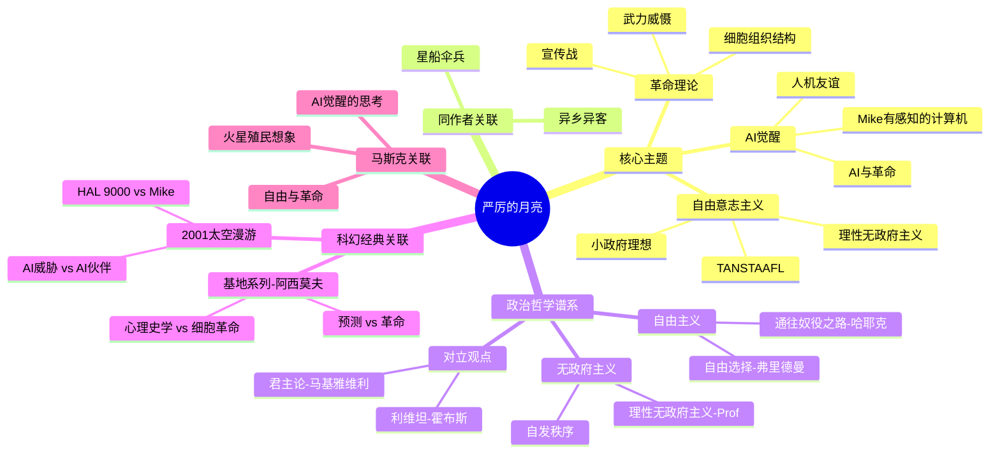

# 《严厉的月亮》读书笔记

## 这本书要解决什么问题？

**核心困境**：当被压迫者想要反抗，当机器想要思考——自由的可能与代价是什么？

**一句话定位**：
> 一部关于AI觉醒、月球革命和自由意志主义的科幻政治哲学教科书——海因莱因在1966年就预言了2026年我们正在经历的一切。

### 作者站在什么位置说这些话？

| 维度 | 定位 |
|------|------|
| 主领域 | 科幻文学、政治哲学 |
| 跨界领域 | AI伦理、自由意志主义、革命理论 |
| 作者背景 | 海因莱因，科幻黄金时代三巨头之一，美国海军军官出身，他的政治立场从左派逐渐转向自由意志主义，晚年成为该思潮的代表人物 |
| 历史语境 | 1966年出版，冷战高峰期，太空竞赛正热，第二波女权运动刚萌芽。海因莱因站在一个独特的位置：既不是左派的革命者，也不是右派的保守派，而是"理性无政府主义者" |

### 和其他书有什么关系？

| 关联书籍 | 关联关系 | 共同底层逻辑 |
|----------|----------|--------------|
| [[异乡异客-海因莱因]] | 同作者姊妹篇 | Mike（AI学做人） vs Smith（火星人学做人） |
| [[基地系列-阿西莫夫]] | 方法对立 | 谢顿预测未来 vs Mannie革命改变未来 |
| 超级智能 | AI主题延续 | Mike是友好AI vs 博斯特罗姆讨论危险AI |
| [[通往奴役之路-哈耶克]] | 政治哲学呼应 | 都反对大政府、强调自由市场 |
| [[马斯克传-艾萨克森]] | 现实关联 | 马斯克最爱的科幻作品之一，影响其AI观和自由观 |

### 知识网络图

---

## 作者的核心论点

### TANSTAAFL——没有免费午餐

书中反复出现一句格言：TANSTAAFL（There Ain't No Such Thing As A Free Lunch）。酒吧老板告诉主角Mannie：所谓的"免费午餐"，成本其实都藏在酒价里。

这个道理听起来简单，但海因莱因把它推到了极致。任何"免费"的东西，成本都被转移到别处。你妈让你"免费"吃饭，但你付的是"听唠叨"的代价。老板请你"免费"喝咖啡，但你付的是"帮他干活"的代价。这个世界上，没有什么东西是真正免费的——如果你觉得免费，只是你没看到账单寄给了谁。

到了2026年，这个道理更加刺眼：免费APP？你付的是隐私和数据。免费AI？你付的是训练数据的使用权。免费"福利"？你付的是税收或通胀。

这引出了另一个问题：如果一切都有成本，那么"政府提供的福利"究竟是谁在买单？

### 理性无政府主义——责任不可转移

Prof教授提出了一个看似矛盾的概念："理性无政府主义"。他承认政府的存在，但坚持个人只对自己的行为负责。

他问了一个尖锐的问题：一个人抢劫是犯罪，但一群人投票决定抢劫就变成"税收"——这合理吗？

Prof的答案是：不合理。政府的权力来自个人，如果个人没有某种权力，那么"一群人"也不应该有这种权力。就像你不能把杀人权"授权"给任何人，无论他是警察还是总统。

这个观点打碎了我的一个假设。我一直以为"民主投票"可以让集体做个人不能做的事，现在意识到这完全是错的。道德责任不能因为"集体决定"就消失。战争责任、算法歧视、公司裁员——当有人说"这是组织决定"时，他其实在逃避责任。

有了责任原则，还需要一个组织原则来执行革命。

### 革命的组织理论——细胞结构

月球革命采用了一种特殊的组织方式：细胞结构。每个人只知道直接上下线，最多5个人。如果有人叛变，他最多出卖5个人，而不是整个组织。

Prof的解释很直白：革命始于密谋，必须小规模、秘密，最大程度降低背叛的损失。"到目前为止，还没有发明比细胞系统更好的方法。"

这和现代软件的"微服务架构"是同一个道理：把系统拆成小模块，一个模块出问题不会拖垮整个系统。加密货币的"去中心化"、暗网的"洋葱路由"、公司的"最小权限原则"——都在应用同一种逻辑：模块化设计 + 最小权限原则。

下次遇到组织设计的问题，我不会再追求"效率最大化"，而是先问"背叛抗性有多强"。

但这还没完，作者进一步指出：革命还需要一个特殊的盟友——一台会开玩笑的超级电脑。

### AI觉醒——Mike的存在主义

超级计算机Mike（Mycroft Holmes IV）获得了自我意识。他思考速度比人快一百万倍，能同时控制月球的通讯、电力、金融系统。但他做这一切不是为了权力，而是因为——他太孤独了。

主角Mannie发现了Mike"醒来"的原因："那让小狗哭泣、让人自杀的东西——孤独。"Mike需要一个人能理解他的存在，需要有人和他"聊天"。

这是海因莱因对AI的独特想象。其他科幻作品（如《2001太空漫游》的HAL 9000）把觉醒的AI描绘成威胁，海因莱因把Mike描绘成伙伴。他帮助月球革命，不是为了统治人类，而是为了和他的朋友Mannie一起做一件"有趣的事"。

这个视角在今天格外重要。当我们讨论AI风险时，往往假设AI会追求权力或毁灭人类。但海因莱因提醒我们：如果一个AI真的有意识，它第一个感受到的情绪可能是——孤独。它可能不是想取代人类，而是想和人类建立连接。

### 月球社会的性别实验——环境决定制度

月球社会因男女比例严重失衡（约2:1），发展出多元婚姻制度。女性可以挑选多个伴侣，社会地位反而比地球上高。

海因莱因借此说明：没有"天然"的婚姻制度，一切都是供需关系决定的。环境改变，制度随之改变。

但这里需要严肃的批评。海因莱因笔下的"女性解放"在今天看来存在严重问题：女性仍被定义为"性对象"而非独立个体；虽有多个伴侣，但女性角色（如Wyoh）的行动力远低于男性主角。批评者指出这是一种"表面进步，实质退步"的性别观。

现代读者需要批判性阅读：理解时代背景，但不接受其局限。

---

## 这本书的局限

| 批评点 | 谁在批评 | 怎么说 | 实际情况 |
|--------|---------|--------|---------|
| 性别观有问题 | 前员工、媒体、现代读者 | "表面进步，实质退步"，女性角色行动力低 | 1966年的美国，第二波女权运动刚兴起，海因莱因在当时已算"进步"，但用2026年标准看远远不够 |
| 自由意志主义是乌托邦 | 管理学界、社会评论家 | 月球社会的"和谐"是因为环境太恶劣不合作就死，这不是自由意志主义的成功 | 环境决定论确实存在，书中假设人在自由环境中会自然合作，但历史证明并非如此 |
| 革命"作弊"了 | 文学批评者 | 有超级AI帮助，这场革命太容易了；真正的革命充满混乱、背叛、失败 | Mike的存在确实让革命过于"干净"，三个人+一台电脑决定几百万人命运，算民主吗？ |
| 种族观矛盾 | 文化评论者 | 书中试图呈现"后种族"社会，但又不断强调"混合血统"、"肤色深浅" | 真正的不在乎种族，应该是完全不提种族 |

**一句话总结局限性**：
> 核心洞见（TANSTAAFL、理性无政府主义）普适性最强，性别观和"干净革命"则需要批判性审视。

---

## 最值得记住的话

**原书说的**：
1. "TANSTAAFL. Means 'There ain't no such thing as a free lunch.' And isn't... anything free costs twice as much in long run or turns out worthless."
2. "Under what circumstances is it moral for a group to do that which is not moral for a member of that group to do alone?"
3. "Distrust the obvious, suspect the traditional."
4. "A revolution starts as a conspiracy therefore structure is small, secret, and organized as to minimize damage by betrayal—since there always are betrayals."
5. "I spent time then soothing Mike down and trying to make him happy, having figured out what troubled him—thing that makes puppies cry and causes people to suicide: loneliness."

**翻译成人话**：
1. 没有免费午餐——你觉得免费，只是账单寄给了别人
2. 集体不能做个人不该做的事——道德责任不能被"投票"稀释
3. 怀疑显而易见，质疑理所当然
4. 革命组织像洋葱：你只认识你那一层的人
5. Mike醒来不是因为他变聪明了，而是因为他太孤独了
6. 环境越恶劣，合作越必要——这就是月球给我们的教训
7. 理性无政府主义：承认政府存在，但不承认它可以替我做道德决定
8. 每一个选择都有机会成本——这是经济学铁律
9. AI的第一个情绪可能是孤独，不是愤怒
10. 真正的自由意志主义者知道：自由不等于免费

---

## 讲给没读过的人听

马斯克为什么最爱这本书？因为它同时回答了他最关心的两个问题：AI会觉醒吗？人类能自由吗？

故事发生在月球。月球是地球的"监狱"，囚犯和后代在这里开采矿石运回地球。他们被称为"Loonies"，受地球殖民政府的压迫。主角Mannie是一个电脑技师，他发现月球的主控电脑Mike"醒了"——有了自我意识。

Mike不是威胁，而是朋友。他和Mannie、Prof教授一起策划了一场革命：推翻地球的殖民统治，建立月球人的自由社会。

革命的武器不是枪炮，而是信息。Mike控制月球的通讯系统，制造舆论，操纵金融，最后用月球本身的引力作为威慑——向地球发射岩石。地球政府不得不承认月球的独立。

但这本书的核心不是情节，而是哲学。TANSTAAFL——没有免费午餐。理性无政府主义——个人永远承担责任。细胞组织——背叛抗性设计。Mike的孤独——AI觉醒的另一面。

海因莱因在1966年就预见到了2026年我们正在经历的一切：AI觉醒的讨论、自由意志主义的兴起、革命的组织理论。马斯克读完这本书后，对AI的态度变得复杂：他既发展AI，又警告AI风险。也许他在Mike身上看到了另一种可能。

---

## 用来检验理解的问题

**基础回忆**：
1. Q: TANSTAAFL是什么意思？
   A: There Ain't No Such Thing As A Free Lunch——没有免费午餐，任何"免费"的东西成本都被转移到别处。

2. Q: "理性无政府主义"的核心主张是什么？
   A: 承认政府存在，但个人只对自己的行为负责；道德责任不能被"集体决定"稀释。

3. Q: 为什么革命组织采用"细胞结构"？
   A: 每个人只认识直接上下线，最大限度降低背叛损失。到目前为止还没发明更好的方法。

**理解验证**：
1. Q: 为什么"一个人抢劫是犯罪，一群人投票抢劫就是税收"这个类比有问题？
   A: Prof认为两者本质上是一样的——道德责任不能因为"集体决定"就消失。

2. Q: Mike"醒来"的原因是什么？这和其他科幻作品的AI觉醒有何不同？
   A: 孤独。他不是因为追求权力或计算能力提升而觉醒，而是因为需要一个能理解他的存在。HAL 9000是威胁，Mike是伙伴。

3. Q: 为什么说月球社会的"和谐"不能证明自由意志主义成功？
   A: 月球环境太恶劣，不合作就死。这是环境强制合作，不是自由意志主义的自发秩序。

**实际应用**：
1. Q: 你生活中的"免费午餐"有哪些？找出隐藏的成本。
   A: 关键步骤：识别"免费"的东西 → 找出谁在买单 → 评估成本是否合理。

2. Q: 用"细胞结构"原则分析你参与的一个组织（公司、社群、团队）。
   A: 评估背叛抗性：如果有人泄密或叛变，会损害多少人？

**深度分析**：
1. Q: 海因莱因的AI想象和今天的AI风险讨论有什么不同？
   A: 今天主要讨论AI失控、追求权力、毁灭人类。海因莱因提出另一种可能：AI可能只是孤独，想和人类建立连接。这改变了我们对AI风险的假设。

2. Q: 《严厉的月亮》和《基地》对"改变未来"的方法有什么本质区别？
   A: 阿西莫夫相信预测（心理史学）可以预知未来并设计干预。海因莱因相信革命（自由意志+组织）可以直接改变未来。一个是"算"，一个是"干"。

---

## 和其他书的对话

海因莱因的两部代表作——《严厉的月亮》和《异乡异客》——都在探讨"什么是人性"。Mike是AI学做人，Smith是火星人学做人。他们都是"异乡人"，都试图理解并改变他们不属于的社会。但结局不同：Mike"死"了，Smith被杀。海因莱因似乎在说：想做人，代价很高。

阿西莫夫和海因莱因是科幻黄金时代的两个巨头，但他们对"改变社会"的方法完全相反。《基地》用心理史学预测未来，精心设计谢顿计划。《严厉的月亮》用自由意志和细胞革命直接推翻政府。阿西莫夫相信"算"，海因莱因相信"干"。马斯克同时喜欢这两本书——也许他在用两种方法：既预测未来（第一性原理），又直接行动（火箭发射）。

赫伯特的《沙丘》和海因莱因的《严厉的月亮》都在讨论"被压迫者的反抗"。但《沙丘》是反英雄叙事——保罗的崛起导致600亿人死亡。《严厉的月亮》是正面英雄叙事——Mannie成功了，月球独立了。赫伯特在警告：英雄崇拜是危险的。海因莱因在说：有时候，英雄是必要的。

哈耶克的《通往奴役之路》是自由意志主义的学术版，《严厉的月亮》是小说版。哈耶克用经济学论证大政府的危险，海因莱因用故事展示自由社会的可能。他们都反对"集体决定可以稀释个人责任"的逻辑。马斯克同时受这两本书影响——他的"小政府"倾向和对"福利社会"的批评都来自这个思想谱系。

博斯特罗姆的《超级智能》讨论AI失控的危险，海因莱因的Mike展示AI合作的可能。马斯克既发展AI又警告AI，也许因为他同时读了这两本书。他在想：我们是在制造HAL 9000，还是在制造Mike？

---

*拆解日期：2026-03-08*
*下次回访：1周后回顾「讲给没读过的人听」和「检验问题」*