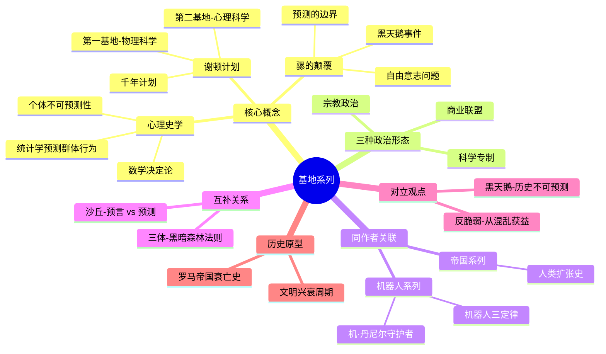

# 《基地》系列读书笔记

## 这本书要解决什么问题？

**核心困境**：如何预测和控制人类社会的未来？

**一句话定位**：
> 用数学预测人类命运的银河史诗——阿西莫夫在1940年代就构想了"大数据"和"社会工程学"，启发了包括马斯克在内的整整一代科技领袖。

### 作者站在什么位置说这些话？

| 维度 | 定位 |
|------|------|
| 主领域 | 科幻文学、社会学、历史哲学 |
| 跨界领域 | 数学（概率论）、政治学、历史学 |
| 作者背景 | 阿西莫夫，波士顿大学生物化学教授，科幻黄金时代三巨头之一，一生出版近500本书，被称为"万能博士" |
| 历史语境 | 1942年开始连载，灵感直接来自爱德华·吉本的《罗马帝国衰亡史》。阿西莫夫当时在费城海军造船厂工作，看到帝国兴衰的历史规律，想到：如果把这个规律扩展到银河尺度呢？ |

### 和其他书有什么关系？

| 关联书籍 | 关联关系 | 共同底层逻辑 |
|----------|----------|--------------|
| [[沙丘-赫伯特]] | 互补概念 | 谢顿（被设计的救世主） vs 保罗（被制造的先知） |
| [[黑天鹅-塔勒布]] | 对立观点 | 历史可预测 vs 历史不可预测 |
| [[反脆弱-塔勒布]] | 对立观点 | 系统控制 vs 从混乱获益 |
| 超级智能 | 延伸思考 | AI预测人类 vs 人类预测自己 |
| [[马斯克传-艾萨克森]] | 现实关联 | 马斯克最爱的科幻作品，影响了他的火星殖民计划 |
| [[从零到一-彼得蒂尔]] | 思想延续 | 第一性原理的科幻源头 |

### 知识网络图

---

## 作者的核心论点

### 心理史学的预测逻辑

哈里·谢顿预测银河帝国将灭亡，随后会有3万年黑暗期才能建立第二帝国。他用数学算出了这个结果。

背后的机制其实不难理解。当个体数量足够大（数万亿人），随机性互相抵消，群体行为呈现数学规律。就像气体运动论：单个分子运动不可预测，但整体温度、压力可精确计算。阿西莫夫把这个原理搬到了社会学上——只要样本够大，人类行为就像气体分子一样可计算。

想象你在炒股票。一个人的买卖行为是随机的，但如果有1亿人同时交易，股价就会呈现某种规律。阿西莫夫在1940年代就想到：如果样本不是1亿人，而是整个银河系的数万亿人，那么历史本身就成了可以计算的数学公式。

心理史学有两大前提：第一，研究对象数量必须足够庞大；第二，研究对象必须不知道分析结果，否则会自我改变行为。

这引出了另一个问题：既然能预测，能不能干预？

### 谢顿计划的设计——缩短黑暗期

谢顿知道帝国一定会灭亡，但他无法阻止。于是他想："既然阻止不了崩溃，那就让崩溃后的恢复期短一点。"

他建立了两个"基地"。第一基地由物理科学家组成，保存技术知识，发展科技。第二基地隐藏在暗处，由心理科学家组成，监控和修正计划偏差。谢顿设计了周期性的"谢顿危机"，每次危机推动基地发展到下一个阶段。

银河帝国的崩溃就像一个即将倒塌的庞然大物。你无法阻止台风，但你可以提前加固房屋，减少损失。谢顿计划把3万年的黑暗期缩短到1000年。

基地经历了三种政治形态：科学专制（靠核技术威慑）、宗教政治（科技包装成神圣知识）、商业联盟（贸易取代宗教成为控制工具）。刀剑、宗教、黄金——人类社会控制的三种形态，阿西莫夫一网打尽。

我以前一直以为预测是为了"避免灾难"，现在意识到这完全错了。谢顿的智慧是：既然无法阻止崩溃，就让崩溃后的恢复期短一点。下次遇到无法避免的风险，我不会再试图"阻止"，而是问"如何让后果可控"。

但谢顿计划有一个致命的盲点。

### 骡的存在——预测的局限

变异者"骡"拥有精神控制能力，能够颠覆谢顿计划的每个预测。

骡的象征意义非常明确：个人意志 vs 历史决定论，数学模型 vs 黑天鹅事件，系统控制 vs 不可控因素。当你制定完美计划时，总有一些你没想到的东西会搞砸一切。骡的存在本身就证明了：无论你的数学模型多精确，总有计算不到的变量。

这打碎了我对"历史决定论"的迷信。以前觉得只要数据够多、模型够好，就能预测未来。现在看，塔勒布说得对：历史是由黑天鹅驱动的。骡就是那个黑天鹅——一个你无法预知的变量，可能颠覆所有预测。

下次遇到"完美计划"，我不会再相信它能覆盖所有变量，而是会问：我的"骡"在哪里？

### 盖娅模式——集体意识的选择

系列最后，主角面临选择：建立第二帝国，还是创建银河级集体意识"盖娅"？阿西莫夫选择了后者。

这是阿西莫夫晚年对心理史学的反思。他从"数学可以预测群体行为"的乐观，转向了"群体意识可能优于个体分散"的谦逊。

哲学追问随之而来：个体自由重要，还是物种生存重要？在宇宙威胁面前，人类需要统一意志吗？盖娅模式暗示：自由意志可能是人类最大的弱点，也是最宝贵的财富。

---

## 这本书的局限

| 批评点 | 谁在批评 | 怎么说 | 实际情况 |
|--------|---------|--------|---------|
| 角色薄弱 | 文学批评者、读者 | "人物只是理论的载体，缺乏情感深度"，"角色被迅速建立，又被迅速抛弃" | 阿西莫夫的视角是历史而非个人——"伟人不创造历史，历史创造伟人"的文学表达 |
| 预测悖论 | 逻辑批评者 | 如果个体不可预测，为何哈定等"英雄"能解决危机？ | 确实存在矛盾——骡的存在说明个体能打破预测，但基地的英雄似乎又在"应验"预测 |
| 自由意志问题 | 哲学界 | 心理史学暗示人类没有真正的自由意志 | 阿西莫夫通过骡和盖娅回应了这个问题，但回答不够彻底 |
| 剧集改编偏离 | 原著粉丝 | Apple TV+剧集偏离了"群体决定论"的哲学内核 | 剧集需要戏剧性，但确实削弱了原著的核心思想 |

**一句话总结局限性**：
> 心理史学是一个迷人的思想实验，但作为科学预测方法，它与马克思主义历史唯物主义面临同样的困境：能解释过去，但预测未来能力存疑。

---

## 最值得记住的话

**原书说的**：
1. "Violence is the last refuge of the incompetent."（暴力是无能者的最后避难所）
2. "It is a bad idea to let others destroy your dreams."（让别人摧毁你的梦想是个坏主意）
3. "Never let your sense of morals prevent you from doing what is right."（别让道德感阻止你做正确的事）
4. "To succeed, planning alone is insufficient. One must improvise as well."（只有计划是不够的，还必须即兴发挥）
5. "Psychohistory is that branch of mathematics which deals with the reactions of human conglomerates to fixed social and economic stimuli."（心理史学是数学的一个分支，专门研究人类群体对社会和经济刺激的反应）

**翻译成人话**：
1. 心理史学就是：一个人的命运不可知，但全人类的命运可以被计算
2. 谢顿的智慧：既然阻止不了崩溃，那就让崩溃后的恢复期短一点
3. 骡的存在证明：任何数学模型，都算不到黑天鹅
4. 《基地》的核心不是预测未来，而是创造未来
5. 当样本足够大，混乱就会呈现规律——这就是大数据的祖宗
6. 三个政治形态：刀剑、宗教、黄金——人类社会控制的三种形态
7. 第一基地保存知识，第二基地修正偏差——系统+反馈的经典设计
8. 暴力是无能者的最后手段，但有时你不得不无能
9. 预测的价值不在于准确，而在于让人提前思考
10. 历史创造伟人，而非伟人创造历史——这就是基地的叙事逻辑

---

## 讲给没读过的人听

马斯克为什么想把这本书带上火星？因为它让他相信：未来是可以被设计的。

1940年代，阿西莫夫坐在纽约地铁里，构思了一个故事：数学家哈里·谢顿用数学预测到银河帝国将灭亡，随后会有3万年黑暗期。他无法阻止崩溃，但他设计了一个计划，把黑暗期从3万年缩短到1000年。

就像烧开水。个体的行为像气泡，随机、不可预测。但当气泡足够多，水就开了。谢顿的"心理史学"就是：当人口足够多（数万亿人），群体的行为就像开水的温度一样可计算。

但计划被一个叫"骡"的突变者打乱了。骡拥有精神控制能力，不在任何数学模型里。他证明了：无论你的预测多精确，总有一些你算不到的变量。

基地经历了三种形态：靠科技威慑的专制、靠宗教包装的操控、靠贸易联盟的商业。阿西莫夫在1940年代就预见到了：人类社会控制的本质，就是谁掌握稀缺资源，谁就掌握权力。

马斯克本质上在执行自己的谢顿计划——既然地球帝国终将崩溃，那就让崩溃后的人类还有火星这个备份。

---

## 用来检验理解的问题

**基础回忆**：
1. Q: 心理史学的两大前提是什么？
   A: 研究对象数量必须足够庞大；研究对象必须不知道分析结果。

2. Q: 谢顿计划的两个基地分别做什么？
   A: 第一基地保存物理科学知识，第二基地监控和修正计划偏差。

3. Q: 基地经历的三种政治形态是什么？
   A: 科学专制（核技术威慑）→ 宗教政治（科技包装成神圣知识）→ 商业联盟（贸易控制）。

**理解验证**：
1. Q: 为什么"骡"能颠覆谢顿计划？
   A: 骡是一个数学模型无法预知的变量——拥有精神控制能力的突变个体。他证明了个体可以打破群体规律。

2. Q: 心理史学的理论基础来自哪些学科？
   A: 气体运动论（物理学）、群众心理学（勒庞《乌合之众》）、历史决定论（汤恩比"挑战与回应"理论）。

3. Q: 为什么阿西莫夫晚年用"盖娅"替代心理史学？
   A: 他可能认识到个体预测的不可靠性，转向"群体意识可能优于个体分散"的思考。

**实际应用**：
1. Q: 找出你生活中的一个"大样本效应"例子——群体可预测，个体不可预测。
   A: 可以观察股市、交通、热搜——单个人行为随机，但整体呈现规律。

2. Q: 为自己的未来3年制定一个"缩短黑暗期"的计划。
   A: 关键思路：既然无法避免某些风险，就提前准备减少损失。

**深度分析**：
1. Q: 阿西莫夫和塔勒布应对不确定性的本质区别？
   A: 塔勒布构建反脆弱系统——从混乱中获益；阿西莫夫系统化预测——在临界点做最小有效干预。一个拥抱混乱，一个控制变量。

2. Q: 马斯克的火星计划和谢顿计划有什么共同逻辑？
   A: 都是"既然无法阻止崩溃，就提前备份"的思路。缩短黑暗期的本质是减少系统性风险的损失。

---

## 和其他书的对话

阿西莫夫和塔勒布吵了80年（虽然不是同一个时代）：历史到底能不能预测？阿西莫夫在1940年代说可以——只要样本够大，群体行为就是数学公式。塔勒布在2007年说不行——黑天鹅事件才是历史的真正驱动力。骡的存在恰恰验证了塔勒布：任何预测系统都无法预见真正的"未知未知"。读完《基地》去读《黑天鹅》，你会看到两种应对不确定性的哲学：一个是控制，一个是拥抱混乱。

赫伯特的《沙丘》是阿西莫夫最好的对话者。谢顿用数学预测未来，保罗用神秘预言看到未来。谢顿是科学主义，保罗是神秘主义。但两人的悲剧本质相同：谢顿的计划被骡打乱，保罗预见灾难却无法阻止。《基地》说"预测可以改变未来"，《沙丘》说"预知本身是陷阱"。读完《基地》去读《沙丘》，你会发现数学和神秘主义面对同样的困境。

海因莱因的《严厉的月亮》和《基地》是科幻黄金时代两座山峰的对望。阿西莫夫相信数学预测，海因莱因相信自由革命。谢顿精心设计千年计划，Mannie直接推翻殖民政府。一个是"算"，一个是"干"。马斯克同时喜欢两本书——他用第一性原理"算"未来，用SpaceX"干"未来。

博斯特罗姆的《超级智能》和《基地》在讨论同一个问题：谁能预测和控制谁？阿西莫夫想象人类预测自己，博斯特罗姆担心AI预测人类。骡的隐喻让人不安：超级智能可能就是现实中的"骡"——一个超出所有预测模型的变量。读完《基地》去读《超级智能》，你会看到同样的担忧从"人类预测人类"扩展到"机器预测人类"。

马斯克公开表示《基地》是他最喜欢的科幻作品。他曾将《基地》的数字版本放入SpaceX的Dragon飞船。谢顿的跨文明时间尺度、缩短黑暗期的思路、保存人类知识的计划——都在马斯克的火星殖民蓝图中有清晰的回响。马斯克本质上在执行自己的谢顿计划。读完《基地》去读《马斯克传》，你会看到科幻如何塑造了现实。

---

*拆解日期：2026-03-08*
*下次回访：1周后回顾「讲给没读过的人听」和「检验问题」*