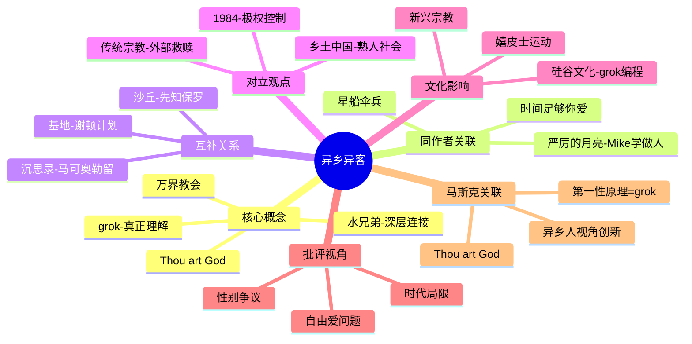

# 《异乡异客》拆解记录

## 这本书要解决什么问题？

**核心困境**：当一个人用全新的视角看待熟悉的一切时，会发生什么？当一个"异乡人"试图理解并改变一个他不属于的社会时，他能走多远？

**一句话定位**：
> 火星人眼中的地球文明——一部外星人视角的人类社会批判史，关于"真正理解"的哲学探索，也是60年代反文化运动的精神图腾。

### 作者站在什么位置说这些话？

| 维度 | 定位 |
|------|------|
| 主领域 | 科幻文学、宗教人类学、社会批判 |
| 跨界领域 | 哲学（存在主义）、心理学、语言学 |
| 作者背景 | 海因莱因，科幻黄金时代三巨头之一，《异乡异客》是他最争议的作品——既被嬉皮士奉为"圣经"，又被批评者视为"充满性别歧视的问题作品" |
| 历史语境 | 1961年出版，正值美国社会剧变期：民权运动、女权运动、反战运动、性解放运动。海因莱因用一个火星人视角来审视这一切，意外地成为了反文化运动的精神偶像 |

### 和其他书有什么关系？

| 关联书籍 | 关联关系 | 共同底层逻辑 |
|----------|----------|--------------|
| [[严厉的月亮-罗伯特·海因莱因-拆解记录]] | 同作者姊妹篇 | Mike（AI学做人） vs Smith（火星人学做人） |
| [[沙丘-弗兰克·赫伯特-拆解记录]] | 互补概念 | 保罗（被崇拜的先知） vs Smith（创立新宗教的先知） |
| [[基地系列-艾萨克·阿西莫夫-拆解记录]] | 方法互补 | grok（直觉理解） vs 心理史学（数学预测） |
| [[乡土中国-费孝通-拆解记录]] | 对立观点 | 熟人社会 vs 陌生人社会 |
| [[马斯克传-艾萨克森-拆解记录]] | 现实关联 | 马斯克的"Thou art God"引用 + 第一性原理思维 |

### 知识网络图

---

## 作者的核心论点

### grok的深层含义——理解的最高境界

Smith用"grok"来表达"真正理解"。这个词不只是"知道"，而是成为被理解对象的一部分。

想象你在学骑自行车。第一步：你看了很多书，知道平衡原理——这叫"知道"。第二步：你骑上去试了几次，会了但还要想——这叫"理解"。第三步：你骑车上路，根本不需要想，平衡感已经内化到身体里——这才叫"grok"。

理解有三个层次：知道（认知）→ 理解（逻辑）→ 内化（体验/grok）。真正的理解是消除主客二分——你不再观察对象，你成为对象。

这就是为什么马斯克喜欢这个词。真正的第一性原理，不是"知道"物理公式，而是"grok"物理规律——让它成为你思维的一部分。grok这个词后来在硅谷流行开来，程序员用它来形容"真正理解代码"的状态。

但grok不只是理解，它还是连接。这引出了另一个问题：如何建立最深的连接？

### 水兄弟的深层连接——稀缺创造深度关系

在火星，分享水是最珍贵的仪式。当你和另一个人分享水时，你冒着生命危险信任对方。这不是酒桌上的"兄弟"，不是微信上的"好友"，而是真正可以托付生死的"水兄弟"。

海因莱因用这个概念告诉我们：真正的连接，来自于共享最珍贵的东西。稀缺创造价值——当某物极度稀缺时，分享它就建立了最深的信任。

在社交媒体时代，我们有1000个好友，却没有一个"水兄弟"。这正是现代人存在主义危机的根源——连接的数量在增加，深度在消失。

有了深度连接，Smith开始理解人类社会。但他发现了一个悖论。

### 宗教的悖论——先知的宿命

Smith创立了"万界教会"，传播"Thou art God"（你就是神）的思想。这句话不是说你是全知全能的神，而是说：你内心有神性的火花，你不需要外部的拯救。

但讽刺的是：Smith创立的教会最终变成了另一个教条化的宗教。他的信徒开始崇拜他这个人，而不是理解他的思想。先知被暴民杀死，信仰被机构化，精神被教条取代。

这个观点打碎了我的一个假设。我一直以为新宗教可以避免旧宗教的问题，现在看，任何教条化的信仰，最终都会杀死其创始人的精神。赫伯特在《沙丘》中延续了同样的主题——保罗不想成为救世主，但他无法阻止自己被推上神坛。Smith和保罗的命运惊人相似：都是被崇拜的先知，都导致了意想不到的后果。

海因莱因的真正意图是"教人如何思考"，而不是"教人想什么"。他在1972年致读者信中说："我不是在给答案。我只是想让读者摆脱一些预设观念，开始独立思考。"

### 异乡人视角——颠覆性创新的力量

Smith用火星人的视角审视地球文明，发现了很多人类习以为常的荒谬之事：为什么人类要穿衣服？为什么人类害怕死亡？为什么人类崇拜金钱？为什么人类要结婚？

这些问题听起来可笑，但正是这种"异乡人视角"让Smith（和读者）重新审视一切"理所当然"的事。外部视角 = 去习惯化 = 看到本质。当你不再"习惯"一件事，你才能质疑它。

马斯克的第一性原理思维，本质上就是"异乡人视角"——如果从零开始设计，会怎样？他不接受"这是惯例"作为答案，因为他是一个"商业异乡人"。

下次遇到一个"理所当然"的事情，我会试着问自己：如果我是火星人，我会怎么看这件事？

---

## 这本书的局限

| 批评点 | 谁在批评 | 怎么说 | 实际情况 |
|--------|---------|--------|---------|
| 性别观有问题 | 女权主义者、现代读者 | "90%的强奸是女性自找的"台词引发巨大争议；女性角色多为秘书、护士、舞者；"自由爱"被批评为男性多偶制幻想 | 1961年写作，需要考虑时代背景；海因莱因后来的作品展现更进步的性别观 |
| 自由爱公社像邪教 | 社会评论家 | Smith创立的万界教会具有邪教特征；群体性行为被批评为对女性的物化 | 海因莱因本人对嬉皮士公社实验持批评态度，认为读者误解了他的意图 |
| 文学价值争议 | 文学批评者 | 对话冗长说教，Jubal Harshaw成为作者"传声筒"；性爱场景被批评为"尴尬"和"过时" | 这是"哲学小说"而非"情节小说"，重点是思想而非故事 |
| 道德相对主义风险 | 哲学界 | "Thou art God"可能被误解为"怎么做都可以" | 需要区分"内在神性"和"道德放纵"——海因莱因说的是前者 |

**一句话总结局限性**：
> grok概念和异乡人视角的洞见普适性最强，性别观和"自由爱"公社需要批判性审视。用2026年的标准评判1961年的作品不公平，但也不能完全以"时代局限"回避批评。

---

## 最值得记住的话

**原书说的**：
1. "Grok means to understand so thoroughly that the observer becomes a part of the observed—to merge, blend, intermarry, lose identity in group experience."
2. "Thou art God."（你就是神）
3. "Love is that condition in which the happiness of another person is essential to your own."
4. "A prude is a person who thinks that his own rules of propriety are natural laws."
5. "Democracy is a poor system; the only thing that can be said for it is it's eight times as good as any other method."
6. "But goodness alone is never enough. A hard, cold wisdom is required for goodness to accomplish good."
7. "I've found out why people laugh. They laugh because it hurts... because it's the only thing that'll make it stop hurting."
8. "Faith strikes me as intellectual laziness."
9. "Specialization is for insects."

**翻译成人话**：
1. grok = 不只是知道，而是成为被理解对象的一部分
2. 水兄弟 = 分享最珍贵的东西，建立最深的连接
3. Thou art God = 你内心有神性的火花，不需要外部拯救
4. 真正的理解是消除"我"和"你"的界限
5. 先知死了，信仰被机构化，精神被教条取代——这是所有宗教的宿命
6. 善良需要智慧保驾护航，没有智慧的善良往往作恶
7. 人们笑不是因为事情好笑，而是因为笑能让痛苦停止
8. 民主很糟糕，但其他制度更糟糕——丘吉尔式的诚实
9. 专业化是给昆虫的——人应该什么都会
10. 信仰是思维懒惰的表现——你放弃思考，交给神

---

## 讲给没读过的人听

马斯克为什么喜欢说"Thou art God"？因为这本书让他明白：每个人心中都有神性。

故事的主角是Valentine Michael Smith，一个在火星长大的地球人。他被火星人抚养，学会了火星的语言、思维方式和"grok"——一种真正理解的方式。当他回到地球时，他像一个外星人审视人类社会。

他发现了很多荒谬之事：为什么人类害怕死亡？为什么人类崇拜金钱？为什么人类要穿衣服？这些问题听起来可笑，但正是这种"异乡人视角"让他（和读者）重新审视一切。

Smith创立了"万界教会"，传播"Thou art God"——你内心有神性，不需要外部拯救。但讽刺的是，他的教会变成了另一个教条化的宗教，他被暴民杀死。先知死了，信仰被机构化，精神被教条取代。

这本书在1960年代被嬉皮士奉为"圣经"，催生了许多公社实验。但海因莱因本人对这些实验持批评态度。他说："我不是在给答案。我只是想让读者摆脱预设观念，开始独立思考。"

马斯克的第一性原理思维，本质上就是"异乡人视角"——不接受"惯例"作为答案，从零开始思考。grok思维——真正理解物理世界，让规律成为思维的一部分。

---

## 用来检验理解的问题

**基础回忆**：
1. Q: grok是什么意思？它与"知道"有什么区别？
   A: grok是"真正理解"——不只是知道，而是内化为直觉。三个层次：知道（认知）→ 理解（逻辑）→ 内化（体验）。

2. Q: "水兄弟"是什么概念？为什么在火星如此重要？
   A: 分享水是最珍贵的仪式，意味着托付生死的深度信任。稀缺创造价值，分享稀缺建立最深连接。

3. Q: Smith创立的"万界教会"最终怎么了？
   A: 变成了另一个教条化的宗教，信徒崇拜Smith而非理解他的思想，Smith被暴民杀死。

**理解验证**：
1. Q: 为什么"Thou art God"不是道德相对主义？
   A: 它说的是"内在神性"而非"放纵自由"——你不需要外部拯救，但你仍需对自己的选择负责。

2. Q: 异乡人视角为什么能带来颠覆性创新？
   A: 外部视角 = 去习惯化 = 看到本质。当你不再"习惯"一件事，你才能质疑它。

3. Q: 海因莱因对嬉皮士公社实验的态度是什么？
   A: 批评态度。他认为读者误解了他的意图——他不是在给答案，而是让人独立思考。

**实际应用**：
1. Q: 找出你生活中的一个"理所当然"的事情，用异乡人视角审视它。
   A: 问自己：如果我是火星人，我会怎么看这件事？为什么人类这样做？

2. Q: 你有没有一个真正的"水兄弟"？如何建立这种深度连接？
   A: 关键：分享最珍贵的东西——不是物质，而是信任、脆弱、真实。

**深度分析**：
1. Q: Smith和保罗（《沙丘》）的命运有何相似之处？
   A: 都是被崇拜的先知，都创立了新宗教/教会，都导致了意想不到的后果，都无法阻止自己被推上神坛。赫伯特和海因莱因都在探讨"先知/英雄崇拜的危险"。

2. Q: grok思维和马斯克的第一性原理有什么关系？
   A: 本质相同——不只是"知道"物理公式，而是让规律成为思维的一部分。不接受"惯例"作为答案，从零开始思考。

---

## 和其他书的对话

海因莱因的两部代表作——《异乡异客》和《严厉的月亮》——是姊妹篇，都在探讨"什么是人性"。Smith是火星人学做人，Mike是AI学做人。他们都是"异乡人"，都试图理解并改变他们不属于的社会。结局不同：Smith被暴民杀死，Mike"死"了。海因莱因似乎在说：想做人，代价很高。

赫伯特的《沙丘》是海因莱因最好的对话者。Smith和保罗都是被崇拜的先知，都创立了新宗教，都导致了灾难性的后果。赫伯特明确说《沙丘》是"反英雄"叙事，海因莱因可能没想到《异乡异客》被嬉皮士当成了"英雄圣经"。两人的共同主题是：先知崇拜的危险，信仰被机构化的必然。

阿西莫夫的《基地》和海因莱因的《异乡异客》在探讨同一个问题：如何理解和改变社会。谢顿用心理史学预测未来，Smith用grok理解人性。一个是数学计算，一个是直觉体验。两种方法都在探索"理解和改变社会"的可能性。

费孝通的《乡土中国》是《异乡异客》的对立面。费孝通讨论的是传统中国的"熟人社会"——连接基于血缘地缘，归属感来自差序格局。海因莱因讨论的是现代西方的"陌生人社会"——连接基于理念共享（水兄弟），归属感来自选择而非命运。在2026年，我们都是彼此的"异乡异客"。

马斯克公开引用"Thou art God"，这说明《异乡异客》对他影响深远。他的第一性原理思维 = grok物理世界；他的移民身份 = 异乡人视角；他的多领域创业 = "专业化是给昆虫的"。马斯克本质上是一个"商业异乡人"——用全新视角审视传统行业。

---

*拆解日期：2026-03-08*
*下次回访：1周后回顾「讲给没读过的人听」和「检验问题」*