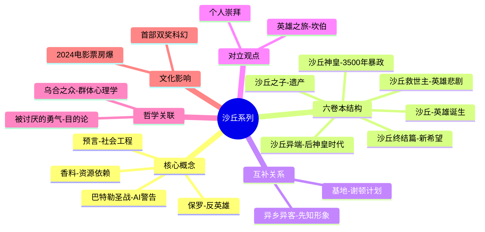

# 《沙丘》拆解记录

## 这本书要解决什么问题？

**核心困境**：当你预见到自己的"英雄之路"会导致毁灭时，你该怎么办？

**一句话定位**：
> 一部反英雄的太空史诗——赫伯特用《沙丘》告诉我们：小心那些被你奉为救世主的人。

### 作者站在什么位置说这些话？

| 维度 | 定位 |
|------|------|
| 主领域 | 科幻、生态学、政治学、哲学 |
| 跨界领域 | 伊斯兰苏菲主义、禅宗佛教、深生态学、罗马帝国史 |
| 作者背景 | 弗兰克·赫伯特，记者出身，花6年研究沙漠生态和伊斯兰文化后才动笔。不是书斋里的幻想家，是实地考察的观察者 |
| 历史语境 | 1965年出版，灵感来自"阿拉伯的劳伦斯"——一个外来者被原住民推上神坛，然后引发灾难的历史。赫伯特站在冷战和石油危机的前夜，预言了资源依赖、英雄崇拜、预言操控这些2026年仍在发生的事 |

### 和其他书有什么关系？

| 关联书籍 | 关联关系 | 共同底层逻辑 |
|----------|----------|--------------|
| [[基地系列-艾萨克·阿西莫夫-拆解记录]] | 互补概念 | 谢顿（被设计的救世主） vs 保罗（被制造的先知） |
| [[异乡异客-罗伯特·海因莱因-拆解记录]] | 互补概念 | Smith和保罗都是被崇拜的先知，都导致了意想不到的后果 |
| [[乌合之众-勒庞-拆解记录]] | 理论基础 | 费雷德人的群体疯狂 = 勒庞的乌合之众 |
| [[被讨厌的勇气-岸见一郎-拆解记录]] | 哲学对话 | 保罗的宿命论 vs 阿德勒的目的论 |
| [[超级智能-尼克·博斯特罗姆-拆解记录]] | 延伸思考 | 巴特勒圣战 = AI控制警告 |
| [[马斯克传-艾萨克森-拆解记录]] | 现实关联 | 马斯克公开表示"英雄崇拜是危险的"，与赫伯特的警告一致 |

### 知识网络图

---

## 作者的核心论点

### 香料=石油=芯片=AI=资源诅咒

"The spice must flow."（香料必须流动）"He who controls the spice, controls the universe."（谁控制香料，谁控制宇宙）

香料（Melange）是宇宙最珍贵的资源：延长寿命、让星际旅行成为可能、增强预知能力。谁控制香料，谁控制宇宙。赫伯特在1965年就看见了：文明的繁荣建立在脆弱的单一资源依赖上。

从19世纪的煤炭，到20世纪的石油，到21世纪的芯片、AI算力——我们在不断创造新的"香料"。2026年，美国四大AI公司计划投入近7000亿美元在AI基础设施上。台积电的先进制程成为现代"香料"。从石油到锂矿，资源诅咒仍在继续。

这引出了另一个问题：为什么人们会相信预言？

### 预言=社会工程=算法操控

保罗的"预言"是怎么来的？不是神启示，而是贝尼·杰瑟里特女巫在费雷德文化中植入了宗教传说，等待数百年后有人来"应验"。"Prophecy is a tool of the Bene Gesserit."（预言是贝尼·杰瑟里特的工具）

这就像今天的社交媒体算法：不是在预测未来，而是在塑造未来。它给你看你想看的东西，让你相信你早就相信的事情。赫伯特在1965年就预见到了"信息茧房"和"算法操控"。TikTok/抖音算法就是现代版的Missionaria Protectiva。ChatGPT的回答在塑造用户的认知，而非反映真实。

有了X，还需要Y来支撑。预言能操控人群，但人群为什么会相信？

### 英雄=危险=反弥赛亚

赫伯特1979年接受采访时说："The bottom line of the Dune trilogy is: beware of heroes. Much better to rely on your own judgment, and your own mistakes."（警惕英雄。最好依靠你自己的判断和你自己的错误。）

保罗成为救世主后，引发了600亿人的圣战（Jihad）。他预见到了，但无法阻止。费雷德人需要救世主，他们创造了Muad'Dib，然后保罗被迫扮演了这个角色。英雄崇拜的本质是：个体责任外包 = 群体疯狂。当人们相信"英雄会拯救一切"时，他们就放弃了思考。

这个观点打碎了我的一个假设。我一直以为英雄叙事是激励人心的正面力量。但赫伯特让我看到：英雄崇拜的本质是逃避——把命运交给别人，比自己承担责任轻松得多。下次看到有人被捧成"救世主"，我不会再跟着欢呼，而是问：这些人把什么责任外包了？

但这还没完，作者进一步指出：还有一种比英雄崇拜更隐蔽的危险——把思考交给机器。

### 巴特勒圣战=AI控制警告

《沙丘》宇宙中，人类经历过"巴特勒圣战"——一场反对AI的宗教战争。结果是人类禁止了"思维机器"，转而发展"门塔"（Mentat）——人类计算机。

赫伯特的警告比常见的"AI失控"警告更深刻："Once men turned their thinking over to machines in the hope that this would set them free. But that only permitted other men with machines to enslave them."（曾经，人们把思考交给机器，希望这能让他们自由。但这只会让拥有机器的其他人奴役他们。）

问题不是AI会反叛，而是控制AI的人会奴役其他人。把思考外包给AI，就是把自主权交给控制AI的人。当AI替我们做决策时，谁在控制AI？ChatGPT时代，我们是否正在"把思考交给机器"？

---

## 这本书的局限

| 批评点 | 谁在批评 | 怎么说 | 实际情况 |
|--------|---------|--------|---------|
| 东方主义与文化挪用 | 中东和北非裔评论者 | 大量借鉴伊斯兰文化但当作"异域风情"背景板 | 赫伯特深入研究过伊斯兰教和苏菲主义，但用2026年标准看确实存在"白人救世主"叙事问题 |
| 白人救世主叙事 | 电影评论者、Reddit用户 | 保罗是典型的"外来者领导原住民解放"叙事 | 赫伯特明确表示《沙丘》是对"白人救世主"的批判而非歌颂——保罗的胜利导致600亿人死亡 |
| 性别角色 | 女性主义批评者 | 女性角色被限制在操控者、母亲、爱人三种角色 | 用1965年标准是进步的，贝尼·杰瑟里特是最强大组织之一，但用2026年标准需审视 |
| 哲学深度 | Reddit深度读者、托尔金 | 对进化、生存、权力的理解过于简单化 | 托尔金批评"故事毫无新意"；但哲学学者认为其深刻探讨了自由意志vs宿命论 |

**一句话总结局限性**：
> 赫伯特的反英雄意图和读者的英雄叙事感受之间存在差距——作者想批判英雄崇拜，但很多读者把保罗当成了真正的英雄。

---

## 最值得记住的话

**原书说的**：
1. "I must not fear. Fear is the mind-killer. Fear is the little-death that brings total obliteration."（我绝不能恐惧。恐惧是思维杀手。恐惧是带来彻底毁灭的小小死神。）
2. "The spice must flow."（香料必须流动）
3. "He who controls the spice, controls the universe."（谁控制香料，谁控制宇宙）
4. "Beware of heroes. Much better to rely on your own judgment, and your own mistakes."（警惕英雄。最好依靠你自己的判断和你自己的错误。）
5. "Don't give over all of your critical faculties to people in power, no matter how admirable they may appear."（不要把你的批判能力交给掌权者，无论他们看起来多么值得钦佩。）
6. "Once men turned their thinking over to machines in the hope that this would set them free. But that only permitted other men with machines to enslave them."（曾经，人们把思考交给机器，希望这能让他们自由。但这只会让拥有机器的其他人奴役他们。）

**翻译成人话**：
1. 恐惧是思维杀手——当人们恐惧时，他们就会放弃独立思考
2. 香料=石油=芯片=AI：我们的繁荣建立在脆弱的资源依赖上
3. 预言不是天启，是社会工程——在目标文化中植入信仰
4. 英雄崇拜是危险的：当你相信救世主时，你就放弃了思考
5. 把思考交给AI，就是把自由交给控制AI的人
6. 赫伯特的终极警告：魅力领袖是危险的，无论他们看起来多么值得钦佩
7. 保罗的悲剧：他预见到了灾难，但被命运推着前进
8. 贝尼·杰瑟里特=世界上最强大的公关公司+基因工程师+宗教策划者
9. 费雷德人的"预言"是被设计好的，就像算法给你看你想看的东西
10. 1965年的《沙丘》预言了2026年的我们：仍在寻找救世主，仍在依赖单一资源

---

## 讲给没读过的人听

马斯克为什么警惕英雄崇拜？因为他读过《沙丘》。

保罗·厄崔迪不想成为救世主，他预见到了自己的崛起会导致600亿人的死亡。但费雷德人需要一个救世主，贝尼·杰瑟里特女巫早就植入好了宗教传说，等待有人来"应验"。保罗被迫扮演了这个角色。

赫伯特想告诉我们：英雄崇拜是危险的。当你把所有希望寄托在一个英雄身上时，你就放弃了思考，放弃了责任。肯尼迪为什么危险？赫伯特说：因为人们不质疑他。

《沙丘》还在讲另一种危险：香料。香料是宇宙最珍贵的资源，谁控制香料，谁控制宇宙。赫伯特在1965年就看见了：我们的文明建立在脆弱的单一资源依赖上。从石油到芯片到AI，我们在不断创造新的"香料"。

还有一种更隐蔽的危险：把思考交给机器。赫伯特说，问题不是AI会反叛，而是控制AI的人会奴役其他人。这比"机器人起义"的警告深刻得多。

---

## 用来检验理解的问题

**基础回忆**：
1. Q: 赫伯特写《沙丘》的核心警告是什么？
   A: "警惕英雄。最好依靠你自己的判断和你自己的错误。"英雄崇拜的本质是逃避责任。

2. Q: 贝尼·杰瑟里特的Missionaria Protectiva是什么？
   A: 在目标文化中植入宗教传说，等待数百年后有人来"应验"。预言是社会工程工具。

3. Q: 巴特勒圣战的核心教训是什么？
   A: 把思考交给机器，就是把自主权交给控制机器的人。问题不是AI反叛，而是控制AI的人。

**理解验证**：
1. Q: 为什么保罗无法阻止600亿人的圣战？
   A: 费雷德人需要救世主，宗教传说已经植入好了，他被推上神坛后无法下来。预言自我实现了。

2. Q: 香料对应现实中的哪些资源？
   A: 19世纪的煤炭，20世纪的石油，21世纪的芯片、AI算力。我们在不断创造新的"香料"。

3. Q: 赫伯特的AI警告和常见的"AI失控"警告有什么区别？
   A: 常见警告担心AI反叛，赫伯特担心控制AI的人奴役其他人。前者关注机器，后者关注权力。

**实际应用**：
1. Q: 找出你生活中的一个"香料依赖"。
   A: 可以是收入来源、技能、平台、关系。单一依赖就是脆弱性。

2. Q: 当你发现自己在崇拜某个领袖/大佬时，问自己什么？
   A: "我放弃了什么思考？我外包了什么责任？"

**深度分析**：
1. Q: 赫伯特和勒庞如何看待群体疯狂？
   A: 勒庞分析机制，赫伯特展示后果。费雷德人的圣战就是勒庞"乌合之众"的银河尺度演绎。

2. Q: 马斯克为什么既读《沙丘》又读《基地》？
   A: 赫伯特让他警惕英雄崇拜，阿西莫夫让他相信未来可以设计。两者互补。

---

## 和其他书的对话

赫伯特和阿西莫夫在讨论同一个问题：人类能预测和控制未来吗？谢顿用数学预测，保罗用神秘预言。谢顿是科学主义，保罗是神秘主义。但两人的悲剧本质相同：谢顿的计划被骡打乱，保罗预见灾难却无法阻止。《基地》说"预测可以改变未来"，《沙丘》说"预知本身是陷阱"。

海因莱因的《异乡异客》是《沙丘》最好的镜像。Smith和保罗都是被崇拜的先知，都创立了新宗教，都导致了灾难性后果。两部作品都在探讨"先知崇拜的危险"。区别是：Smith主动传播"Thou art God"，保罗被动被推上神坛。

勒庞的《乌合之众》是《沙丘》的心理学底座。费雷德人的群体疯狂就是勒庞理论的银河演绎：当人们相信救世主时，他们就放弃了思考，成为可以被操控的乌合之众。贝尼·杰瑟里特就是最熟练的群体心理操控者。

阿德勒的《被讨厌的勇气》和《沙丘》形成有趣的哲学张力。阿德勒说"你可以选择你的目的"，保罗说"我预见到了灾难但无法阻止"。阿德勒是目的论，保罗是宿命论。读完《沙丘》去读《被讨厌的勇气》，会让你反思：保罗真的没有选择吗？还是他选择了放弃选择？

博斯特罗姆的《超级智能》和《沙丘》在讨论同一个问题：谁能控制谁？赫伯特担心控制AI的人奴役其他人，博斯特罗姆担心AI本身成为控制者。读完《沙丘》再去读《超级智能》，你会发现赫伯特的警告更接地气：权力问题比技术问题更现实。

马斯克公开表示《沙丘》影响了他的英雄观。他警惕魅力领袖，警惕被推上神坛。但他同时也在执行自己的"谢顿计划"——火星殖民本质上是"缩短黑暗期"的思路。读完《沙丘》去读《马斯克传》，会看到一个人如何同时吸收了赫伯特的警告和阿西莫夫的设计思维。

---

*拆解日期：2026-03-08*
*下次回访：1周后回顾「讲给没读过的人听」和「检验问题」*