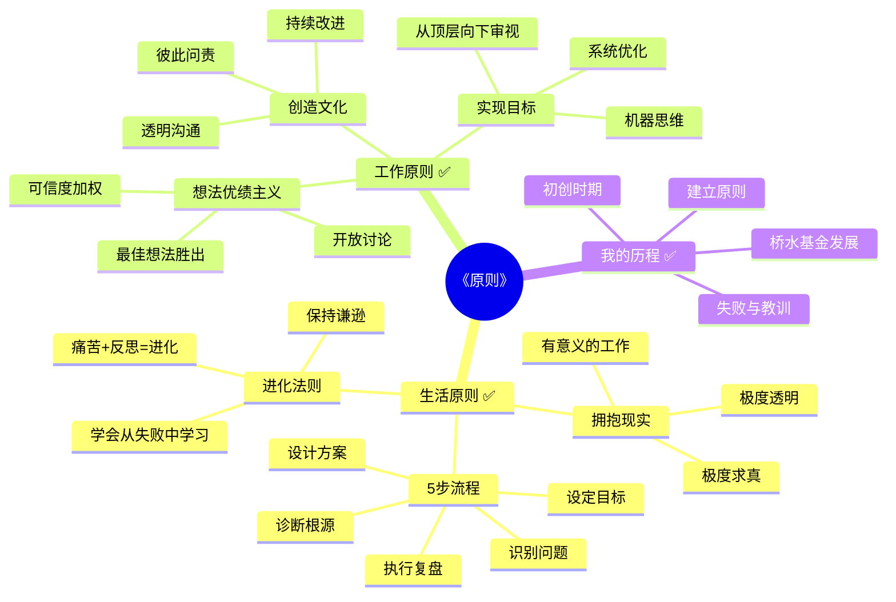
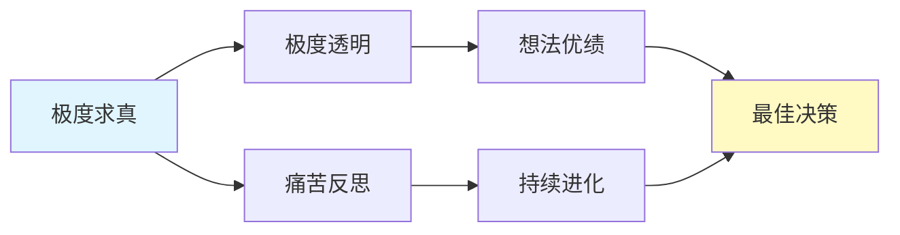

# 《原则》 - 章节导航

> 作者: 雷·达里奥
> 总章节: 3大部分
> 拆解状态: ✅ 已完成
> 最后更新: 2026-02-27

---

## 📚 章节结构（Mermaid Mindmap）

---

## 🔗 核心概念关联图

---

## 📊 拆解进度追踪

| 章节 | 标题 | 状态 | 完成日期 | 核心收获 |
|------|------|------|----------|----------|
| 第一部分 | 我的历程 | ✅ | 2026-02-27 | 从个人经历中提炼普适原则的重要性 |
| 第二部分 | 生活原则 | ✅ | 2026-02-27 | 个人系统化思维方式的核心框架 |
| 第三部分 | 工作原则 | ✅ | 2026-02-27 | 将个人原则拓展至组织管理的关键理念 |

**状态说明:**
- ✅ 已完成
- 🔄 进行中
- ⏳ 待开始
- ⏸️ 暂停

---

## 🚀 快速跳转

### 按章节跳转
- [[第一部分-我的历程]]
- [[第二部分-生活原则]]
- [[第三部分-工作原则]]

### 按主题跳转
- [[极度透明]]
- [[想法优绩]]
- [[痛苦+反思=进化]]

### 相关资源
- [[原则-拆解记录]] - 主拆解笔记
- [[我的历程-章节拆解]] - 初创过程回顾
- [[生活原则-章节拆解]] - 人生系统的构建
- [[工作原则-章节拆解]] - 组织系统的优化
