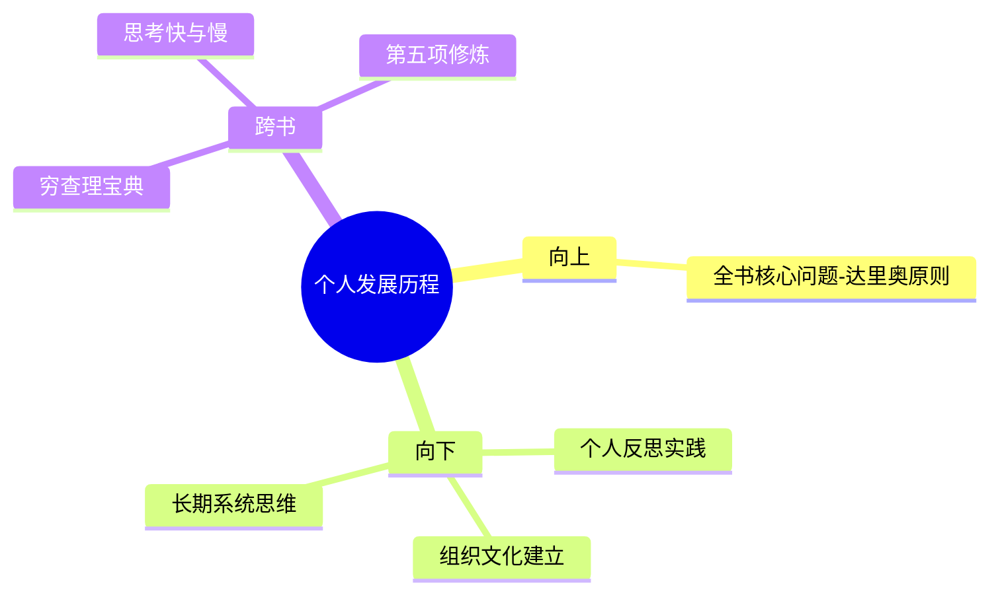

---

category: 
  - 书籍拆解

status: draft
chapter: 
number: 1
title: 我的历程
links:

  - "[[第二部分-生活原则]]"
  - "[[第三部分-工作原则]]"
  - "原则-_导航"
created: 2026-02-27
tags:
  - 原则
  - 生活原则
  - 工作原则
  - 我的历程
  - 达里奥
---

# 第一部分 我的历程

## 📍 章节定位

### 全书位置
> 达里奥人生的回顾和核心原则的起源，为整本书的理论提供实践基础。

- **全书核心问题**: 如何建立一个可预测、可复制、可持续的成功原则体系？
- **本章回答的问题**: 原则是如何在真实人生经历中产生的？
- **角色类型**: 传记铺垫
- **论证位置**: 提供实践样本，为理论奠基

### 章节序列
| 方向 | 章节标题 | 逻辑连接 |
|------|----------|----------|
| 后章 | [[第二部分-生活原则]] | 介绍生活原则的具体内容 |
| 后章 | [[第三部分-工作原则]] | 介绍工作原则的具体内容 |

### 一句话定位
> 第一部分是整书的"源头故事"，通过达里奥从孩童到桥水基金创始人的个人经历，展示原则的重要性，同时为后续两部分的详细说明铺垫基础。

---

## 🎯 核心观点

### 第一层：表层案例
> 章节中的具体案例、故事、数据

| 案例名称 | 简要描述 | 页码 | 关键引文 |
|----------|----------|------|----------|
| 早年炒股 | 少年时期买股票的经历及教训 | - | 早期失败教会我反思的重要性 |
| 第一次创业失败 | 在桥水基金成立初期的投资失误 | - | 不要过度自信于个人判断 |
| 桥水成长史 | 桥水基金逐步发展和原则系统完善的过程 | - | 痛苦+反思=进步 |
| 金融危机应对 | 2008年金融危机期间的经验 | - | 准确预判源于系统化原则 |

### 第二层：中层机制
> 案例背后的运行机制、方法论

| 机制名称 | 组成要素 | 因果链条 | 证据来源 |
|----------|----------|----------|----------|
| 经历→原则→系统 | 实践经历 + 反思总结 + 规则化 | 失败 → 痛苦 → 反思 → 原则 → 规则 | 案例1 |
| 原则迭代机制 | 基础原则 + 实践验证 + 不断修正 | 原则 → 应用 → 检验 → 调整 | 案例2-3 |
| 系统思维 | 个体认知 + 群体共识 + 反馈学习 | 个人智慧 → 决策机制 → 系统升级 | 案例3-4 |

### 第三层：底层规律
> 可迁移的普遍规律

| 规律陈述 | 抽象层级 | 知识连接 | 适用范围 |
|----------|----------|----------|----------|
| 痛苦是成长信号 | 认知心理学+系统论 | 思考快与慢-系统1与系统2 | 个人发展 |
| 反思是转化动力 | 学习科学+行为经济学 | 穷查理宝典-逆向思维 | 个人成长 |
| 系统胜过个人判断 | 统计学+集体智慧 | 系统之美-系统思维 | 组织管理 |

---

## 💬 降维翻译

### 观点1: 从失败中学到的东西比成功多

#### 原文表达
> "痛苦+反思=进步"，通过记录错误、反思和总结，形成原则，避免重蹈覆辙。我的整个职业生涯都建立在此之上。

#### 降维翻译（中学生能懂）
失败不只是让人难过，更是免费的学习机会。关键是要学会从失败里找出原因，然后形成自己的"防错规则"。

#### 日常类比（奶奶能懂）
就像种地，头年地里的庄稼烂了，不能光叹气，要找原因：是浇水多了还是种子不行？找到原因后记下来，明年就知道该怎么办。

#### 检验
- Q: 如果一个中学生问你达里奥为什么要记住失败？
- A: 为了避免在同一处摔倒第二次，每次摔倒都要想办法不再跌倒。

### 观点2: 极度透明创造强大竞争力

#### 原文表达
> 在桥水基金，每个人都能自由表达观点，即使是对领导的质疑，这种极度透明的文化提高了决策质量。

#### 降维翻译（中学生能懂）
好点子应该胜出，不管是谁提出的。即使是地位最低的人，只要想法对，也应该被采纳。

#### 日常类比（奶奶能懂）
就像村里的大事，大家敞开来说，不因为谁官职大就说谁对，谁说得更有道理就听谁的。

#### 检验
- Q: 如果一个中学生问你为什么公司不保密？
- A: 因为隐藏问题比公开问题更可怕。

### 观点3: 个人原则是成功系统的基石

#### 原文表达
> 个人的原则体系是构建工作原则和生活原则的基础，它们相互促进，形成完整的系统。

#### 降维翻译（中学生能懂）
每个人都需要一些基本的做事准则，这些原则指导我们的生活和工作。

#### 日常类比（奶奶能懂）
做人要有做人的规矩，做事要有做事的方法，这些规矩和方法就像人生的罗盘。

#### 检验
- Q: 如果一个中学生问你达里奥为什么要写这么多规矩？
- A: 因为有规矩才不会走偏，就像走路需要指南针。

---

## ✨ 金句库

### 原书金句
| 金句 | 页码 | 适用场景 |
|------|------|----------|
| "痛苦+反思=进步" | - | 面对挫折 |
| "拥抱现实，应对现实" | - | 心态建设 |
| 如果你不喜欢痛苦，就应该害怕做一些可能带来更长久痛苦的事情 | - | 延迟满足 |
| 在投资生涯中，我的目标不是追求高额回报，而是力求取得最大的成功概率 | - | 决策制定 |

### 降维金句
| 金句 | 来源观点 | 适用场景 |
|------|----------|----------|
| 失败是免费的学习机会，关键是别浪费它 | 观点1 | 面对错误反思 |
| 好主意胜过往事，无关提出者身份地位 | 观点2 | 团队决策 |
| 个人原则是人生系统的底层代码 | 观点3 | 处世哲学 |

## 🔗 当下映射

### 💰 财富应用
| 场景 | 具体行动 | 预期效果 | 风险提示 |
|------|----------|----------|----------|
| 投资理财 | 建立投资原则文档，记录每次交易的原因和结果 | 避免情绪投资，提高决策成功率 | 过度依赖过往经验 |
| 事业发展 | 建立个人职业原则库，每月审视执行情况 | 战略更清晰，避免盲动 | 僵化教条主义 |

### 💼 职场应用
| 场景 | 具体行动 | 所需能力 | 适用职级 |
|------|----------|----------|----------|
| 会议发言 | 遵循"事实为准，观点为辅"原则 | 批判性思维 | 中高级别 |
| 团队管理 | 建立"对事不对人"的透明文化 | 情商智商 | 管理岗位 |

### 🏠 生活应用
| 场景 | 具体行动 | 可行性 | 见效时间 |
|------|----------|--------|----------|
| 人际关系 | 遇到冲突时优先澄清事实而非维护情绪 | 高 | 1个月 |
| 个人成长 | 每次重大失败后强制写反思日记 | 高 | 立刻起效 |

### 72小时行动计划
1. [明天可以做的第一件事] 写一篇关于上次失败经历的反思笔记，记录痛苦、原因和改进措施
2. [本周内可以尝试的事] 在一个安全环境中尝试表达一个可能有争议的观点
3. [需要准备资源才能做的事] 整理一套个人原则文档草稿

---

## 🕸️ 章节关联

### 向上关联 → 整书
- **贡献**: 章节提供了达里奥个人发展的原始素材，为书中原则提供真实性和可信度
- **位置**: 构成全书的实践基础部分，后面的具体原则都由此而来

### 向下关联 → 具体应用
| 应用场景 | 难度 | 前置知识 |
|----------|------|----------|
| 个人成长原则 | 低 | 接受反思的必要性 | 
| 职业发展规划 | 中 | 基础的自我认知能力 |
| 组织文化建设 | 高 | 管理经验和心理学知识 |

### 跨书关联 → 知识网络
| 书籍 | 概念 | 关系 | 备注 |
|------|------|------|------|
| [[穷查理宝典]] | 逆向思维 | 延伸 | 穷查理强调避免愚蠢的决定，达里奥强调记录和反思错误 |
| [[思考快与慢]] | 系统化决策 | 支持 | 都强调克服认知偏误，建立系统机制 |
| [[第五项修炼-圣吉]] | 学习型组织 | 延伸 | 达里奥的透明文化与学习型组织的理念相通 |

### 关联可视化

---

## ❓ 问答设计

### Q1: [记忆型问题]
**问题**: 达里奥提出的核心成长公式是什么？
**认知层次**: 记忆
**难度**: 低
**答案要点**:
- 痛苦+反思=进步
- 通过记录错误、反思和总结形成原则

### Q2: [理解型问题]
**问题**: 为什么达里奥认为失败比成功提供的学习价值更大？
**认知层次**: 理解
**难度**: 中
**答案要点**:
- 成功可能会让人过度自信
- 失败暴露了系统性问题
- 痛苦记忆更深刻，有利于避免重复错误

### Q3: [应用型问题]
**问题**: 如何在生活中践行"极度透明"的原则？
**认知层次**: 应用
**难度**: 中
**答案要点**:
- 诚实地面对自己的缺点和错误
- 不隐藏问题，寻求反馈和改进建议
- 建立反思记录的习惯

### Q4: [理解型问题]
**问题**: 达里奥的个人经历如何体现了他的"进化"理念？
**认知层次**: 理解
**难度**: 中
**答案要点**:
- 从童年到成人到创业者的角色转变
- 每个阶段都形成相应的系统性原则
- 持续学习和适应环境变化

### Q5: [应用型问题]
**问题**: 如何建立自己的个人经验档案？
**认知层次**: 应用
**难度**: 中
**答案要点**:
- 记录成功和失败的重要时刻
- 每次事后进行反思分析
- 提炼出通用性的经验教训

### Q6: [分析型问题]
**问题**: 极度透明文化适用于哪些类型的组织？
**认知层次**: 分析
**难度**: 中
**答案要点**:
- 创新型和知识型组织
- 对决策准确性要求高的团队
- 需要快速迭代的环境

### Q7: [分析型问题]
**问题**: 个人原则和组织原则之间有何异同？
**认知层次**: 分析
**难度**: 中
**答案要点**:
- 相同：都是行为准则和决策依据
- 不同：个人原则更关注内在价值观，组织原则关注外部互动

### Q8: [评价型问题]
**问题**: 痛苦+反思=进步是否适用于所有文化背景？
**认知层次**: 评价
**难度**: 高
**答案要点**:
- 某些文化可能更注重和谐而非直面冲突
- 需要在透明和情理之间找到平衡
- 因地制宜调整执行方式

### Q9: [应用型问题]
**问题**: 如何在现有工作环境中实践原则？？
**认知层次**: 应用
**难度**: 高
**答案要点**:
- 先从个人范围内建立原则
- 以身作则，影响周围同事
- 寻找理念相符的合作伙伴

### Q10: [分析型问题]
**问题**: 达里奥的方法论如何平衡灵活性和原则性？
**认知层次**: 分析
**难度**: 高
**答案要点**:
- 原则提供长期导向
- 策略保持短期灵活
- 定期检视原则的有效性

### Q11: [理解型问题]
**问题**: 达里奥的进化理论与一般成长理论有何不同？
**认知层次**: 理解
**难度**: 中
**答案要点**:
- 更注重系统性和可操作性
- 强调痛苦的作用
- 注重机制建设而非仅凭感觉

### Q12: [应用型问题]
**问题**: 5步流程具体如何运用在日常生活规划中？
**认知层次**: 应用
**难度**: 中
**答案要点**:
- 目标具体化
- 问题明确化
- 解决方案多样化
- 执行过程中监控
- 定期回顾和调整

### Q13: [分析型问题]
**问题**: 极度透明原则是否适合所有家庭关系？
**认知层次**: 分析
**难度**: 高
**答案要点**:
- 关爱需要因人而异的表达
- 某些透明可能造成不必要的伤害
- 需要平衡原则与人性温情

### Q14: [评价型问题]
**问题**: 达里奥的方法论对年轻人是否过于功利化？
**认知层次**: 评价
**难度**: 中
**答案要点**:
- 需要区分实用主义者和理想主义者
- 实用主义未必等于功利主义
- 系统化思维也有其人文价值

### Q15: [创造型问题]
**问题**: 如何将达里奥的进化论融入传统东方哲学？
**认知层次**: 创造
**难度**: 高
**答案要点**:
- 结合道法自然的顺应思想
- 融合儒家的修身理念
- 吸收禅宗的反省精神

---
