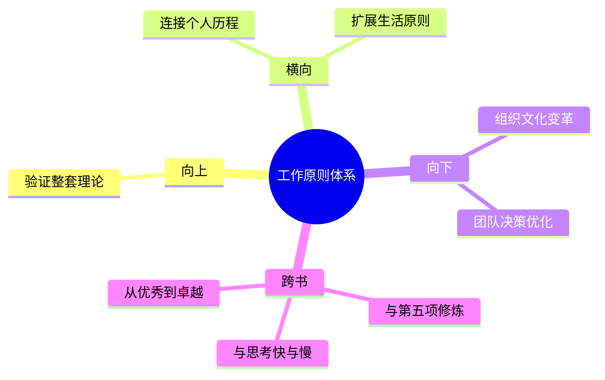

---

category: 
  - 书籍拆解

status: draft
chapter: 
number: 3
title: 工作原则
links:

  - "[[第一部分-我的历程]]"
  - "[[第二部分-生活原则]]"
  - "原则-_导航"
created: 2026-02-27
tags:
  - 原则
  - 工作原则
  - 想法优绩
  - 透明文化
  - 决策系统
description: "工作原则作为《原则》全书的终极应用，展示了如何将个人原则扩展到组织管理和团队运作。"
---

# 第三部分 工作原则

## 📍 章节定位

### 全书位置
> 工作原则作为《原则》全书的终极应用，展示了如何将个人原则扩展到组织管理和团队运作。

- **全书核心问题**: 如何建立一个可预测、可复制、可持续的成功原则体系？
- **本章回答的问题**: 在集体和组织中如何实现高效协同与最优决策？
- **角色类型**: 核心应用
- **论证位置**: 个人原则向组织原则的成功转化与实践展示

### 章节序列
| 方向 | 章节标题 | 逻辑连接 |
|------|----------|----------|
| 前章 | [[第二部分-生活原则]] | 承接个人系统化思维基础 |
| 前章 | [[第一部分-我的历程]] | 连接实践来源 |

### 一句话定位
> 第三部分将前两部分的个人原则转化为组织化解决方案，展示如何在团队和企业中推行"想法优绩主义"的运作模式。

---

## 🎯 核心观点

### 第一层：表层案例
> 章节中的具体案例、故事、数据

| 案例名称 | 简要描述 | 页码 | 关键引文 |
|----------|----------|------|----------|
| 桥水基金会议 | 激烈的辩论、透明的记录过程 | - | "会议录音让每个人都能听到真实反馈" |
| 领导者评估 | 达里奥本人接受员工评价的场景 | - | "我必须比任何人都更透明" |
| 决策流程 | 桥水基金采用可信度加权算法 | - | "最好想法胜出，而非最高职位胜出" |
| 组织文化转型 | 桥水文化从传统到透明的转变 | - | "从权威决策到共识驱动的艰难转型" |

### 第二层：中层机制
> 案例背后的运行机制、方法论

| 机制名称 | 组成要素 | 因果链条 | 证据来源 |
|----------|----------|----------|----------|
| 想法优绩机制 | 群体智慧 + 权重算法 | 开放讨论 → 可信度加权 → 最优决策 → 优异结果 | 案例1、3 |
| 透明沟通机制 | 信息公开 + 坦诚反馈 | 隐藏问题 → 透明交流 → 高效解决 → 信任提升 | 案例2 |
| 文化植入机制 | 价值观输入 + 行为强化 | 个人认同 → 行为模仿 → 集体共识 → 文化形成 | 案例4 |
| 组织进化机制 | 试错实践 + 系统迭代 | 问题暴露 → 集体反思 → 流程优化 → 能力升级 | 案例全部 |

### 第三层：底层规律
> 可迁移的普遍规律

| 规律陈述 | 抽象层级 | 知识连接 | 适用范围 |
|----------|----------|----------|----------|
| 集体智慧胜过个体权威 | 组织管理+行为经济学 | 系统之美-涌现特性 | 团队决策 |
| 透明文化提升系统效率 | 社会学+沟通学 | 第五项修炼-心智模式 | 企业文化 |
| 可信度加权优化结果 | 数据科学+群体智能 | 思考快与慢-偏误校正 | 决策机构 |
| 软件治理硬实力缺陷 | 行为科学+组织理论 | 从优秀到卓越-飞轮效应 | 大型组织 |

---

## 💬 降维翻译

### 观点1: 想法优绩主义 - 让最好想法胜出

#### 原文表达
> "想法优绩主义"(Idea Meritocracy) 是指一个让最好的想法胜出的环境，在这样的环境里，没有人能靠权威强行推销观点。所有人的思考都受到严格审查，最佳观点脱颖而出。无论职务高低，每个人的思考都有同等价值。

#### 降维翻译（中学生能懂）
公司里谁有好想法就应该听谁的，不能单纯按职位说话。要让人把想法拿出来讨论，好的就留下来。

#### 日常类比（奶奶能懂）
就跟村里议事一样，谁的办法有用就听谁的，不一定要听老族长的，小伙子要是有更好的点子也该重视。

#### 检验
- Q: 如果一个中学生问你什么叫想法优绩？
- A: 就像班级里一起讨论数学题，不管你是班长还是成绩不好，好的解法都应该被采纳。

### 观点2: 极度透明创造最佳决策

#### 原文表达
> "极度透明"是桥水基金文化的基石 - 要求所有想法、所有担忧、所有批评都开诚布公地表达出来，而不是藏着掖着。通过极度透明，我们可以更快发现问题、更准确定位根源、更好地做出改进。

#### 降维翻译（中学生能懂）
有问题就要说出来，不能藏着，大家一起面对问题，这样解决得更快更好。

#### 日常类比（奶奶能懂）
就像家里遇到困难，大家一起把事摆到桌面上说，不能你猜我疑，大家都敞开心扉说话才能过得好。

#### 检验
- Q: 如果一个中学生问你为什么公司要透明？
- A: 因为藏着问题只会变大，说出来才能一起解决掉。

### 观点3: 从失败学习的机制化

#### 原文表达
> 每次出现问题或失败之后，团队需要进行深入的反思和分析。不仅要搞清楚发生了什么，更要分析为什么会发生。这种机制化反思有助于个人和组织从错误中学习，避免重复犯错。

#### 降维翻译（中学生能懂）
每次出事之后都得好好想想哪一步做错了，怎么错的，以后不能再犯同样的错误，把教训变成规则。

#### 日常类比（奶奶能懂）
就像做错了饭，不光得知道咸了淡了，还得知道为啥咸了淡了，以后注意火候或调料，别老是一错再错。

#### 检验
- Q: 如果一个中学生问你为什么要把错误记录下来？
- A: 这是为了提醒自己别在同一个地方摔倒两次。

### 观点4: 人才系统化管理

#### 原文表达
> 桥水基金将人员视为机器上的一个零件，不仅要了解每个人的优缺点，还要建立匹配机制，让人适其所用，让每个人都在发挥自己最强优势的位置上。

#### 降维翻译（中学生能懂）
公司的每个人都有不同的能力特点，要把他们放到最适合的位置干最拿手的活。

#### 日常类比（奶奶能懂）
就像家里分工，有人手巧适合做针线活，有人力气大适合干农活，每个人做最适合他做的事才最有效率。

#### 检验
- Q: 如果一个中学生问你为什么要把每个人都测评一遍？
- A: 因为要让人发挥长处，避开短处，这样整体效率最高。

---

## ✨ 金句库

### 原书金句
| 金句 | 页码 | 适用场景 |
|------|------|----------|
| 最好的想法获胜，而不管这想法来自谁 | - | 团队决策 |
| 极度透明带来最优质的合作 | - | 组织沟通 |
| 从失败中学习是进步的捷径 | - | 个人成长 |
| 每个人都有自己的优点和局限 | - | 用人管理 |
| 知道你不知道的是智慧的开端 | - | 能力建设 |
| 过于温和的批评是在纵容不佳的表现 | - | 绩效管理 |
| 高标准才能带来高质量 | - | 文化建设 |
| 用可信度加权决策 | - | 群体决策 |
| 没有人能够拥有最好的想法，除非他们从分歧中学习 | - | 团队协作 |
| 真正的问题不是出现了什么，而是你不明白它是怎么回事 | - | 问题解决 |

### 降维金句
| 金句 | 来源观点 | 适用场景 |
|------|----------|----------|
| 好想法胜过权威 | 观点1 | 团队决策 |
| 透明是最佳润滑剂 | 观点2 | 组织关系 |
| 失败是最好的老师 | 观点3 | 个人成长 |
| 扬长避短最大化效能 | 观点4 | 人才管理 |

## 🔗 当下映射

### 💰 财富应用
| 场景 | 具体行动 | 预期效果 | 风险提示 |
|------|----------|----------|----------|
| 项目投资决策 | 组建多元化视角的投资决策小组 | 降低单一认知盲区风险 | 决策时间延长 |
| 团队投资 | 建立可信度加权的意见采信机制 | 提升整体投研水平 | 权威争议 |

### 💼 职场应用
| 场景 | 具体行动 | 所需能力 | 适用职级 |
|------|----------|----------|----------|
| 会议沟通 | 采用透明开放式讨论，鼓励异议 | 情商、逻辑思维 | 管理岗 |
| 项目复盘 | 建立问题反思和归因机制 | 反思能力、数据分析 | 全职级 |

### 🏠 生活应用
| 场景 | 具体行动 | 可行性 | 见效时间 |
|------|----------|--------|----------|
| 家庭事务决策 | 采用透明沟通和民主讨论 | 高 | 1个月 |
| 子女教育 | 实施透明反馈和成长机制 | 中 | 3个月 |

### 72小时行动计划
1. [明天可以做的第一件事] 在团队会议上实践一个开放性问题讨论
2. [本周内可以尝试的事] 对最近一次决策失败进行深度复盘
3. [需要准备资源才能做的事] 引入可信度评估指标用于会议决策机制

---

## 🕸️ 章节关联

### 向上关联 → 整书
- **贡献**: 工作原则是全书理论的实际应用最高体现，展示了个人原则如何推广到组织层面
- **位置**: 作为个人与组织之间的桥梁，验证整套理论的可扩展性

### 横向关联 → 章节间
| 章节编号 | 章节标题 | 关联类型 | 连接描述 |
|----------|----------|----------|----------|
| 第1部分 | 我的历程 | 源头 | 验证个人经验形成的决策机制 |
| 第2部分 | 生活原则 | 基础 | 个人原则是团队原则的原型和基础 |

### 向下关联 → 具体应用
| 应用场景 | 难度 | 前置知识 |
|----------|------|----------|
| 组织文化变革 | 高 | 管理学基础、行为经济学 | 
| 团队协作优化 | 中 | 团队建设经验 |
| 决策系统化 | 中 | 基础数据分析能力 |

### 跨书关联 → 知识网络
| 书籍 | 概念 | 关系 | 备注 |
|------|------|------|------|
| [[第五项修炼-圣吉]] | 学习型组织 | 对应 | 达里奥透明文化与圣吉的系统思考理念相通 |
| [[思考快与慢-丹尼尔·卡尼曼]] | 群体决策优化 | 延伸 | 可信度加权算法减少认知偏误的影响 |
| 从优秀到卓越-科林斯 | 先人后事原则 | 延伸 | 与达里奥的用人理念有相似之处 |

### 关联可视化

---

## ❓ 问答设计

### Q1: [记忆型问题]
**问题**: "想法优绩主义"(Idea Meritocracy)的基本概念是什么？
**认知层次**: 记忆
**难度**: 低
**答案要点**:
- 按想法质量而非职位决定是否采纳
- 所有观点都应接受公开评议
- 最佳观点应当胜出

### Q2: [理解型问题]
**问题**: 为什么桥水基金要实施极度透明的文化？
**认知层次**: 理解
**难度**: 中
**答案要点**:
- 隐藏问题会让问题恶化
- 透明能提升问题发现和解决速度
- 透明的文化能筛选合适的人才

### Q3: [应用型问题]
**问题**: 在现有公司的管理层级制度下，如何引入可信度加权思想？
**认知层次**: 应用
**难度**: 高
**答案要点**:
- 先在小团队试点
- 根据过往决策准确性建立权重机制
- 通过绩效提升证明价值

### Q4: [分析型问题]
**问题**: 相比传统的领导拍板决策模式，想法获胜制的优劣势分别是什么？
**认知层次**: 分析
**难度**: 高
**答案要点**:
- 优势：减少个人偏见、充分利用群体智慧
- 劣势：决策周期变长、容易陷入无休止争论

### Q5: [应用型问题]
**问题**: 如何构建企业内部的"从错误中学习"反馈循环？
**认知层次**: 应用
**难度**: 中
**答案要点**:
- 建立问题日志机制
- 定期进行失败复盘
- 将教训转化成操作规范

### Q6: [理解型问题]
**问题**: 可信度加权的计算逻辑是什么？
**认知层次**: 理解
**难度**: 中
**答案要点**:
- 根据过去观点的预测准确率赋予权重
- 权重动态调整随着新的验证结果
- 领域相关性影响权重分配

### Q7: [分析型问题]
**问题**: 极度透明文化适用于哪些行业，哪些行业不适合？
**认知层次**: 分析
**难度**: 高
**答案要点**:
- 适合：咨询、科技、投资(需智力密集)
- 不适合：需要保密的军事国防、法律服务等

### Q8: [应用型问题]
**问题**: 如何平衡极度透明与员工尊严保护？
**认知层次**: 应用
**难度**: 高
**答案要点**:
- 区分对事和对人
- 强调成长导向反馈
- 逐步推进文化适应

### Q9: [评价型问题]
**问题**: 桥水文化在西方国家更成功是否有文化背景因素？
**认知层次**: 评价
**难度**: 高
**答案要点**:
- 个人主义文化更接受平等交流
- 集体主义文化可能更注重关系维护
- 需要本土化调整程度

### Q10: [理解型问题]
**问题**: 达里奥的工作原则与丰田生产方式有何相似性？
**认知层次**: 理解
**难度**: 中
**答案要点**:
- 都强调问题暴露而非掩盖
- 都追求持续改进
- 都建立在系统化的基础上

### Q11: [分析型问题]
**问题**: 想法优绩机制对团队成员的必备素质要求有哪些？
**认知层次**: 分析
**难度**: 中
**答案要点**:
- 较高水平的认知能力
- 情绪管理能力
- 开放心态

### Q12: [应用型问题]
**问题**: 小型团队如何循序渐进引入想法优绩文化？
**认知层次**: 应用
**难度**: 高
**答案要点**:
- 从无风险讨论开始
- 建立反馈培训
- 领导者身先示范

### Q13: [评价型问题]
**问题**: 极度透明是否可能导致内部信息泄露风险增大？
**认知层次**: 评价
**难度**: 高
**答案要点**:
- 需要区分内部透明与对外信息披露
- 透明指的是信息流向而非范围
- 内部保密协议更加重要

### Q14: [创造型问题]
**问题**: 如何设计符合中国文化的"想法优绩制"改良版本？
**认知层次**: 创造
**难度**: 高
**答案要点**:
- 融入圆融的沟通方式
- 平衡面子文化与真实反馈
- 保留必要的等级仪式感

### Q15: [分析型问题]
**问题**: 桥水的管理模式对现代企业管理的最大启示是什么？
**认知层次**: 分析
**难度**: 高
**答案要点**:
- 重视系统化设计胜过经验管理
- 智力透明度胜过权威压制
- 持续学习文化胜过既往业绩

---
