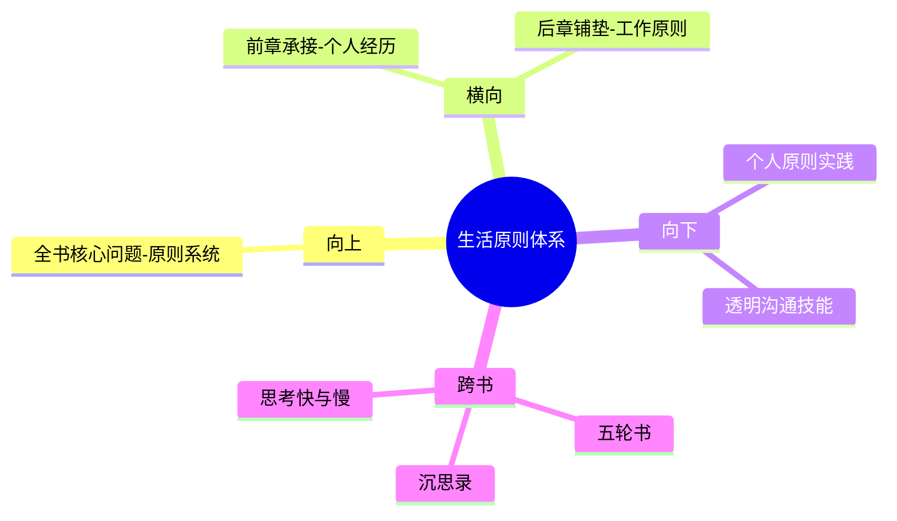

---

category: 
  - 书籍拆解

status: draft
chapter: 
number: 2
title: 生活原则
links:

  - "[[第一部分-我的历程]]"
  - "[[第三部分-工作原则]]"
  - "原则-_导航"
created: 2026-02-27
tags:
  - 原则
  - 生活原则
  - 极度求真
  - 痛苦反思
  - 进化成长
description: "生活原则作为《原则》全书的重要组成部分，阐述了如何通过原则指导人生决策与生活方式。"
---

# 第二部分 生活原则

## 📍 章节定位

### 全书位置
> 生活原则作为《原则》全书的重要组成部分，阐述了如何通过原则指导人生决策与生活方式。

- **全书核心问题**: 如何建立一个可预测、可复制、可持续的成功原则体系？
- **本章回答的问题**: 个人生活中应遵循哪些核心原则？
- **角色类型**: 核心概念
- **论证位置**: 连接个人发展与系统化原则

### 章节序列
| 方向 | 章节标题 | 逻辑连接 |
|------|----------|----------|
| 前章 | [[第一部分-我的历程]] | 承接个人经历的启示 |
| 后章 | [[第三部分-工作原则]] | 铺垫组织系统的设计 |

### 一句话定位
> 第二部分是整书的核心内容，提供了一套完整的生活决策系统，涵盖个人成长、决策制定、人际关系处理等方面。

---

## 🎯 核心观点

### 第一层：表层案例
> 章节中的具体案例、故事、数据

| 案例名称 | 简要描述 | 页码 | 关键引文 |
|----------|----------|------|----------|
| 桥水内部冲突 | 员工间的激烈辩论和透明文化实践 | - | "有意义的分歧能够推动更好的决策" |
| 家庭会议场景 | 在家中实践透明沟通的例子 | - | "家庭也是需要透明度的小型组织" |
| 决策错误记录 | 达里奥记录个人决策失误的做法 | - | "写下你的错误是为了避免重复" |
| 个人弱点识别 | 主动识别自身不足的练习 | - | "承认不知是智慧的第一步" |

### 第二层：中层机制
> 案例背后的运行机制、方法论

| 机制名称 | 组成要素 | 因果链条 | 证据来源 |
|----------|----------|----------|----------|
| 痛苦识别机制 | 痛苦感受 + 触发反思 | 痛苦 → 意识到问题 → 反思分析 | 案例1 |
| 真相发现机制 | 诚实面对 + 系统分析 | 隐藏问题 → 暴露问题 → 获得反馈 | 案例2 |
| 原则构建机制 | 体验总结 + 规则化 | 多次同类经验 → 提炼原则 → 形成决策依据 | 案例3 |
| 进化驱动机制 | 痛苦激发 + 反思驱动 | 满足现状 → 经历痛点 → 驱动改变 | 案例4 |

### 第三层：底层规律
> 可迁移的普遍规律

| 规律陈述 | 抽象层级 | 知识连接 | 适用范围 |
|----------|----------|----------|----------|
| 拥抱痛苦促进成长 | 认知心理学+发展心理学 | 思考快与慢-认知偏差修正 | 个人发展 |
| 透明度提升系统效率 | 组织管理+沟通学 | 系统之美-信息传递 | 人际关系 |
| 原则系统化决策优势 | 行为经济学+决策理论 | 穷查理宝典-决策系统 | 决策制定 |
| 反思驱动持续进化 | 学习科学+成长型思维 | 五轮书-从经验中学习 | 能力提升 |

---

## 💬 降维翻译

### 观点1: 拥抱现实，应对现实

#### 原文表达
> "拥抱现实，应对现实"是生活的基础。你必须了解真实的自己、真实的处境以及可能的未来，才能做出正确的决策。

#### 降维翻译（中学生能懂）
不要活在幻想里，要看清事实真相后再想办法应对，只有认清现状才能改变未来。

#### 日常类比（奶奶能懂）
就像做饭，不能瞎猜米够不够、水多少，先看好实际情况再动手，不然不是粥稠就是粥稀。

#### 检验
- Q: 如果一个中学生问达里奥什么叫拥抱现实？
- A: 就像是先照镜子看清自己，再想办法让自己变得更好。

### 观点2: 极度求真和透明

#### 原文表达
> "极度求真"意味着追求并保持客观真实的信息；"极度透明"则要求我们真诚地分享想法，即使这些想法可能令人不适。

#### 降维翻译（中学生能懂）
说话要诚实，即使实话可能伤害关系；听取意见也要坦然，哪怕被人批评也不要生气。

#### 日常类比（奶奶能懂）
就像邻居之间吵架，直接问清楚为啥生气，有什么不满说出来，藏在心里反而生出更大的矛盾。

#### 检验
- Q: 如果一个中学生问你为什么达里奥强调透明？
- A: 因为不说出来的问题永远解决不了，而且会越来越严重。

### 观点3: 痛苦+反思=进步

#### 原文表达
> 痛苦是一种信号，它告诉我们哪里有问题需要改进。如果我们能够冷静地反思痛苦的根源，就能找到改进的方法。

#### 降维翻译（中学生能懂）
每次感到痛苦的时候别着急逃避，停下来想想为什么会痛，这样痛才有意义。

#### 日常类比（奶奶能懂）
就像手被烫伤了，不能光顾着喊疼，要看看是什么烫的，以后躲开就行了。

#### 检验
- Q: 如果一个中学生问你为什么痛苦是有价值的？
- A: 因为您要不痛苦就不会知道哪里出错了。

### 观点4: 系统化的生活

#### 原文表达
> 将生活的各个方面都视为系统的一部分，通过设计流程和原则来管理它们，而非依靠随意的感觉和冲动。

#### 降维翻译（中学生能懂）
把人生当作一个工程来做，每个环节都提前安排好原则，而不是想起来做什么就做什么。

#### 日常类比（奶奶能懂）
就像家里种地，春天播种、夏天锄草、秋天收割都有固定的时间和方式，不能乱来。

#### 检验
- Q: 如果一个中学生问为何要系统化生活？
- A: 因为有了规矩就不太容易犯错，而且进步更稳定可预期。

---

## ✨ 金句库

### 原书金句
| 金句 | 页码 | 适用场景 |
|------|------|----------|
| 痛苦+反思=进步 | - | 面对困难 |
| 拥抱现实，应对现实 | - | 人生态度 |
| 既坦诚又善良 | - | 沟通相处 |
| 让最合理的想法获胜 | - | 决策制定 |
| 个人的进化轨迹是无穷尽的 | - | 人生观 |
| 进化是宇宙中最强大的力量之一 | - | 世界观 |
| 压力过大时，人们很难做出正确的决定 | - | 决策管理 |
| 优秀的合作者应该是既坦诚又善良的人 | - | 团队合作 |
| 最坏的情况是没人愿意说真话 | - | 组织文化 |
| 我们需要系统地审视生活中的方方面面 | - | 生活管理 |

### 降维金句
| 金句 | 来源观点 | 适用场景 |
|------|----------|----------|
| 逃避痛苦就是逃避成长 | 观点3 | 自我提升 |
| 实话虽难听，但真相指方向 | 观点2 | 人际关系 |
| 现实是路标，不是阻碍 | 观点1 | 心态调整 |
| 系统规划胜过随机应变 | 观点4 | 工作生活 |

## 🔗 当下映射

### 💰 财富应用
| 场景 | 具体行动 | 预期效果 | 风险提示 |
|------|----------|----------|----------|
| 投资决策 | 建立决策原则避免情绪化买卖 | 提高决策质量 | 过度理性化导致错过机会 |
| 理财管理 | 定期审视收支原则，记录反思 | 长期财务健康 | 原则僵化限制灵活性 |

### 💼 职场应用
| 场景 | 具体行动 | 所需能力 | 适用职级 |
|------|----------|----------|----------|
| 团队协作 | 在项目中推行透明沟通原则 | 沟通能力、情商 | 中高级别 |
| 决策流程 | 制定个人决策原则，避免冲动判断 | 批判性思维 | 所有职级 |

### 🏠 生活应用
| 场景 | 具体行动 | 可行性 | 见效时间 |
|------|----------|--------|----------|
| 人际关系 | 遇到冲突时先弄清事实再沟通 | 高 | 2周 |
| 个人成长 | 每月回顾重要事件的决策过程 | 高 | 1个月 |

### 72小时行动计划
1. [明天可以做的第一件事] 写下今天一件让你感到不适的真实情况
2. [本周内可以尝试的事] 在一个安全环境中尝试对某人提出坦诚而善意的意见
3. [需要准备资源才能做的事] 建立个人生活原则文档，记录核心价值观

---

## 🕸️ 章节关联

### 向上关联 → 整书
- **贡献**: 第二部分提供了生活的系统性原则，是全书理论体系的核心输出
- **位置**: 作为理论应用的典型范例，验证第一章提到的原则系统

### 横向关联 → 章节间
| 章节编号 | 章节标题 | 关联类型 | 连接描述 |
|----------|----------|----------|----------|
| 第1部分 | [[第1章-我的历程]] | 承接 | 为具体的生活原则提供实践来源 |
| 第3部分 | [[第三部分-工作原则]] | 铺垫 | 个人生活原则是工作原则的原型 |

### 向下关联 → 具体应用
| 应用场景 | 难度 | 前置知识 |
|----------|------|----------|
| 建立个人原则系统 | 中 | 自我认知基本能力 | 
| 实施透明沟通 | 高 | 较强的抗挫折能力 |
| 拥抱痛苦理念 | 高 | 成熟的心智与价值观 |

### 跨书关联 → 知识网络
| 书籍 | 概念 | 关系 | 备注 |
|------|------|------|------|
| [[五轮书-宫本武藏]] | 木匠之道悟出兵法之道 | 延伸 | 都强调实践经验基础上系统化总结 |
| [[沉思录-马可·奥勒留]] | 自我反思、理性认知 | 支持 | 古代智慧与现代方法的共鸣 |
| [[思考快与慢]] | 系统2主导决策 | 延伸 | 达里奥原则相当于系统性应用系统2 |

### 关联可视化

---

## ❓ 问答设计

### Q1: [记忆型问题]
**问题**: "痛苦+反思=进步"这个公式是谁提出来的，核心含义是什么？
**认知层次**: 记忆
**难度**: 低
**答案要点**:
- 达里奥提出
- 痛苦是成长信号
- 反思帮助从中学习

### Q2: [理解型问题]
**问题**: 为什么达里奥强调"拥抱现实"比逃避现实更重要？
**认知层次**: 理解
**难度**: 中
**答案要点**:
- 逃避问题会让问题恶化
- 唯有认清现状才能改变未来
- 逃避是短期舒适长期痛苦

### Q3: [应用型问题]
**问题**: 在日常生活中如何实践"极度透明"原则，又不伤害他人感情？
**认知层次**: 应用
**难度**: 中
**答案要点**:
- 选择合适时机和场合
- 采取"既坦诚又善良"的沟通方式
- 避免羞辱式的诚实

### Q4: [分析型问题]
**问题**: 生活原则为什么需要系统化，而非依靠直觉和情感做出反应？
**认知层次**: 分析
**难度**: 中
**答案要点**:
- 直觉常常受到认知偏误影响
- 情绪化反应不稳定
- 系统化的原则提供一致性

### Q5: [应用型问题]
**问题**: 如何在家庭关系中实践"极度透明",但不破坏亲密关系？
**认知层次**: 应用
**难度**: 中
**答案要点**:
- 选择适合的家庭透明度级别
- 确保透明信息是建设性的
- 考虑对方的心理承受能力

### Q6: [理解型问题]
**问题**: 达里奥生活原则的核心哲学逻辑是什么？
**认知层次**: 理解
**难度**: 中
**答案要点**:
- 世界是客观存在的
- 智慧在于认识真相
- 认识与行动之间需要有效的连接

### Q7: [分析型问题]
**问题**: 哪些人格特质最适合运用达里奥的生活原则？
**认知层次**: 分析
**难度**: 高
**答案要点**:
- 高韧性、抗挫折能力
- 开放心态、愿意接受反馈
- 逻辑思维、不感情用事

### Q8: [应用型问题]
**问题**: 如何在现有关系网络中逐步引入透明沟通？
**认知层次**: 应用
**难度**: 高
**答案要点**:
- 从小事和安全环境开始
- 寻找志同道合的伙伴
- 循序渐进建立信任

### Q9: [评价型问题]
**问题**: "极度透明"在东方社会文化背景下适用性如何？
**认知层次**: 评价
**难度**: 高
**答案要点**:
- 需要考虑和谐文化背景
- 面子观念的现实存在
- 因地制宜调整程度

### Q10: [理解型问题]
**问题**: 达里奥的"进化"理念与常规的自我提升有何不同？
**认知层次**: 理解
**难度**: 中
**答案要点**:
- 更强调系统化、自动化
- 通过规则避免重复错误
- 持续循环改进机制

### Q11: [分析型问题]
**问题**: 生活原则和工作原则有何根本区别？
**认知层次**: 分析
**难度**: 中
**答案要点**:
- 生活原则关注个人内在
- 工作原则关注集体协作
- 但底层价值观一致

### Q12: [应用型问题]
**问题**: 如何将"痛苦+反思"应用到孩子的教育中？
**认知层次**: 应用
**难度**: 高
**答案要点**:
- 选择适合孩子年龄的方式
- 重点在引导而非强迫
- 培养反思习惯而非惩罚错误

### Q13: [评价型问题]
**问题**: 达里奥方法是否过于冷峻理性，忽略了人性温暖面？
**认知层次**: 评价
**难度**: 高
**答案要点**:
- 旨在提高效率而非冷酷
- 理性与温情可平衡统一
- 需要因人而异调节强度

### Q14: [创造型问题]
**问题**: 如何将达里奥生活原则与东方传统文化结合？
**认知层次**: 创造
**难度**: 高
**答案要点**:
- 融合中庸之道
- 引入仁爱价值观
- 平衡个人与集体关系

### Q15: [分析型问题]
**问题**: 生活原则中最大难点是什么,如何克服？
**认知层次**: 分析
**难度**: 高
**答案要点**:
- 拒绝舒适圈挑战
- 需要极高自律与韧性
- 建立支持系统应对

---
